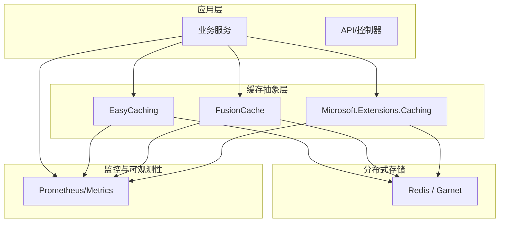
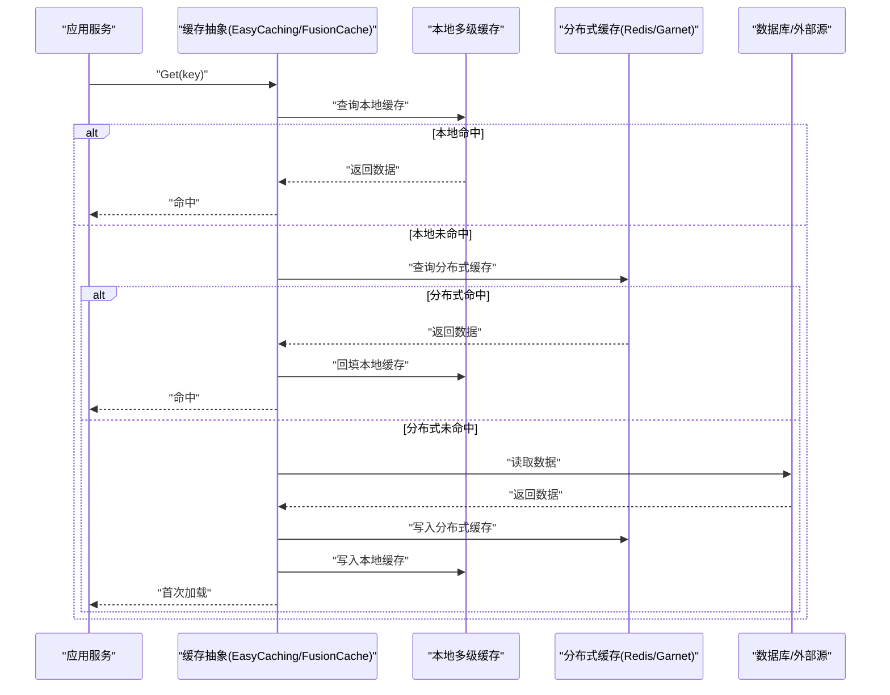
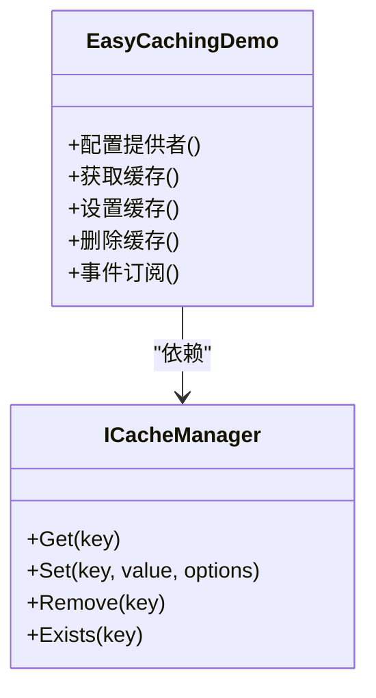
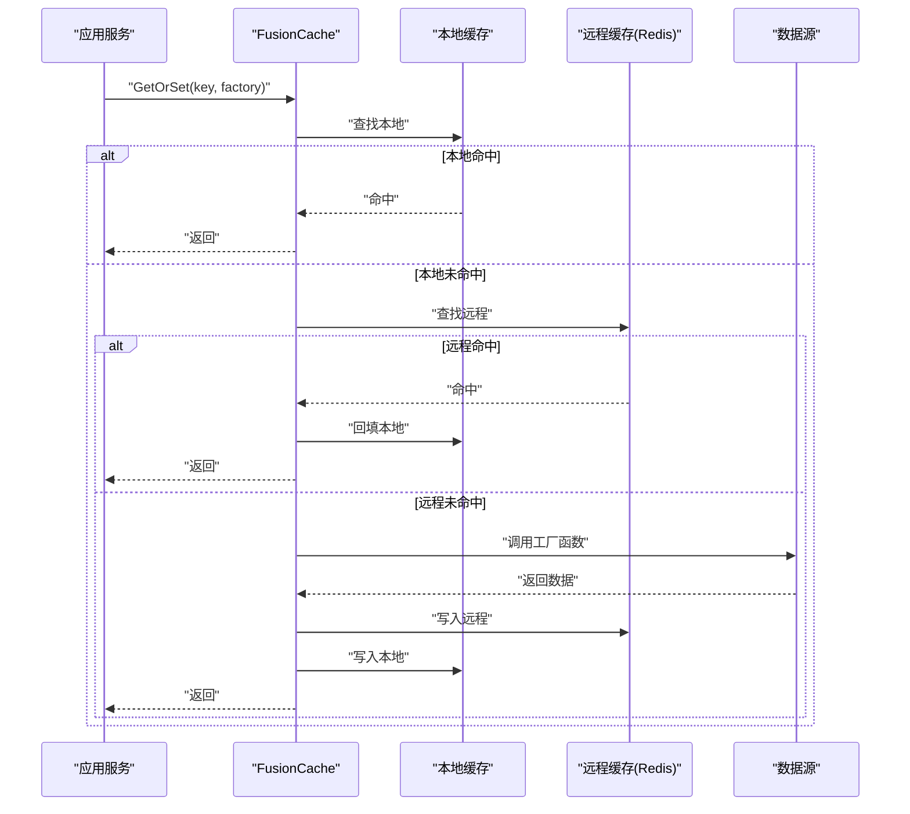
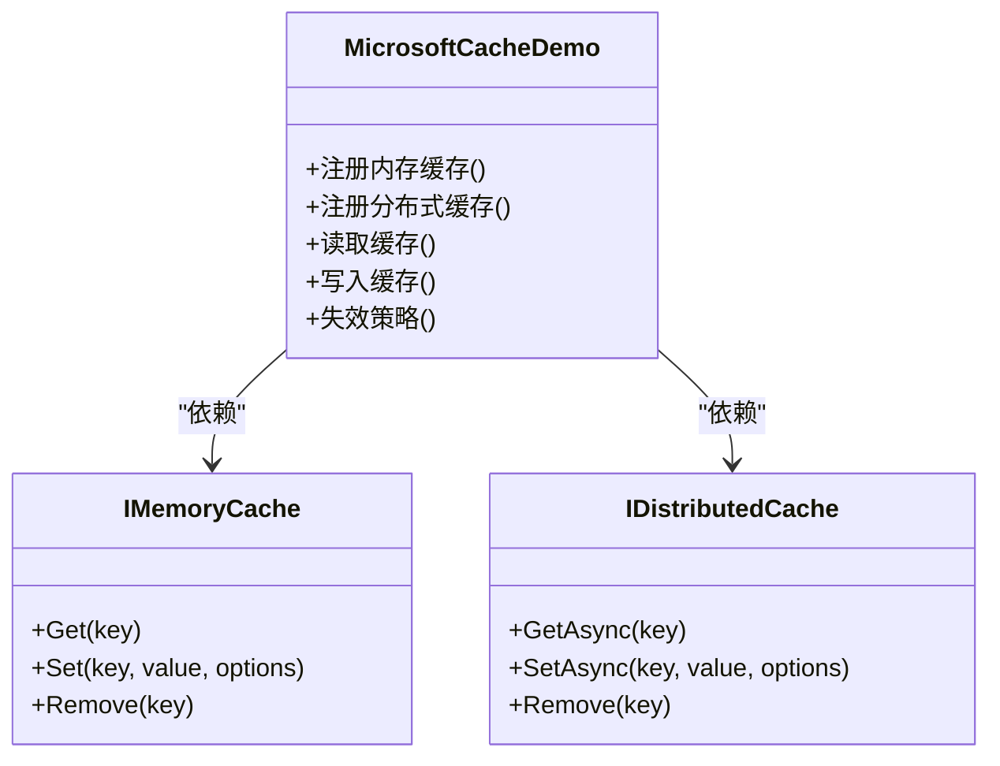
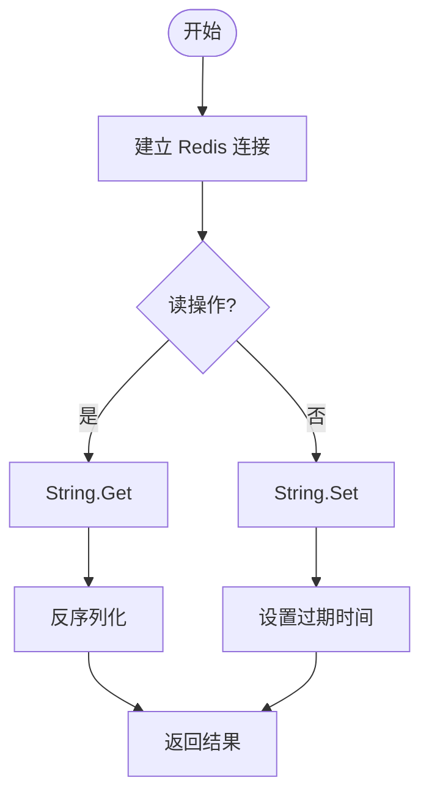
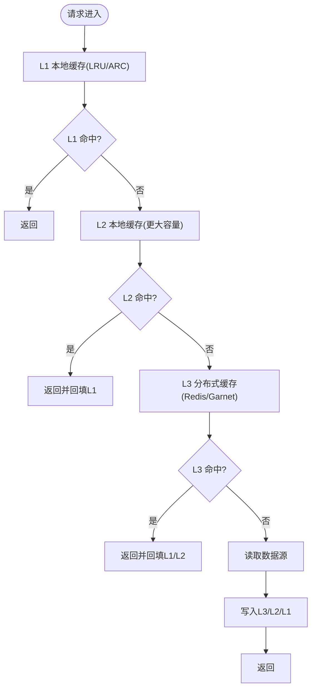
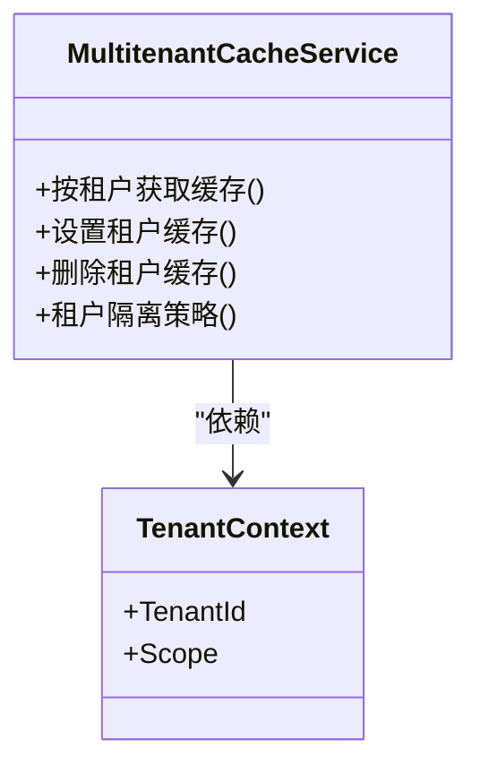
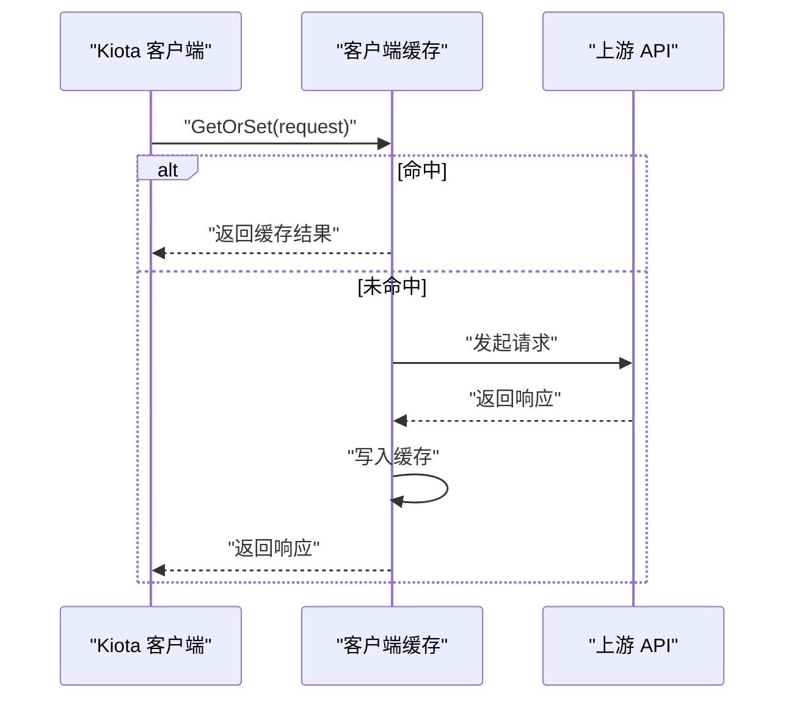
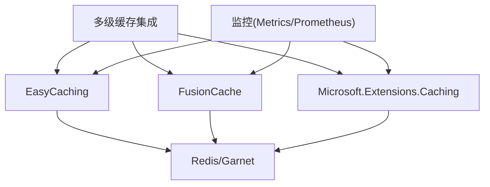

# 缓存策略

<cite>
**本文引用的文件**   
- [easycaching_demo.cs](file://easycaching_demo.cs)
- [fusioncache_demo.cs](file://fusioncache_demo.cs)
- [microsoft_cache_demo.cs](file://microsoft_cache_demo.cs)
- [stackexchange_redis_cache.cs](file://stackexchange_redis_cache.cs)
- [garnet_redis_cache.cs](file://garnet_redis_cache.cs)
- [cache_hybrid_integration.cs](file://cache_hybrid_integration.cs)
- [multitenant_cache_service.cs](file://multitenant_cache_service.cs)
- [kiota_cache.cs](file://kiota_cache.cs)
- [metrics_monitoring.cs](file://metrics_monitoring.cs)
- [prometheus_metrics.cs](file://prometheus_metrics.cs)
</cite>

## 目录
1. [简介](#简介)
2. [项目结构](#项目结构)
3. [核心组件](#核心组件)
4. [架构总览](#架构总览)
5. [详细组件分析](#详细组件分析)
6. [依赖分析](#依赖分析)
7. [性能考虑](#性能考虑)
8. [故障排查指南](#故障排查指南)
9. [结论](#结论)
10. [附录](#附录)

## 简介
本文件面向多级缓存与分布式缓存的落地实践，围绕 EasyCaching、FusionCache、Microsoft.Extensions.Caching（内存/分布式）以及 Redis/Garnet 等实现，系统阐述：
- 多级缓存架构设计与分层命中路径
- 缓存一致性与失效策略（TTL、滑动过期、主动失效、事件驱动）
- 分布式缓存同步与热点数据保护
- 缓存预热、穿透防护与雪崩治理
- 监控指标、容量规划与调优建议

## 项目结构
仓库中包含多个独立的缓存示例与集成文件，覆盖本地内存、进程内多级缓存、Redis/Garnet 分布式缓存以及与业务服务集成的典型用法。关键文件如下：
- EasyCaching 使用示例
- FusionCache 使用示例
- Microsoft.Extensions.Caching 内存缓存示例
- StackExchange.Redis 直连缓存示例
- Garnet 作为高性能 Redis 兼容存储的示例
- 多级缓存混合集成示例
- 多租户缓存服务示例
- Kiota 客户端缓存示例
- 监控与指标采集示例

[本图为概念性结构图，不直接映射具体源码文件]

## 核心组件
- EasyCaching：提供统一的缓存接口与多种后端（内存、Redis、SQL Server 等），支持序列化、过期策略、分布式锁与事件总线。
- FusionCache：强调高可用与容错的多级缓存库，内置内存+远程两级缓存、防抖、回退、重试、健康检查与丰富的统计。
- Microsoft.Extensions.Caching：标准内存缓存与分布式缓存抽象，常与 Redis 提供者组合使用。
- StackExchange.Redis：高性能 Redis 客户端，适合细粒度控制与自定义缓存逻辑。
- Garnet：Redis 兼容的高性能键值存储，可作为 Redis 的直接替换或替代方案。
- 多级缓存混合集成：将进程内多级缓存与分布式缓存结合，形成“本地多级 + 远端”的统一访问面。
- 多租户缓存服务：按租户隔离缓存空间，避免跨租户污染并提升命中率。
- Kiota 客户端缓存：对 API 客户端请求进行缓存，降低下游调用压力。
- 监控与指标：通过 Metrics/Prometheus 暴露缓存命中率、延迟、错误率等关键指标。

**章节来源**
- [easycaching_demo.cs](file://easycaching_demo.cs)
- [fusioncache_demo.cs](file://fusioncache_demo.cs)
- [microsoft_cache_demo.cs](file://microsoft_cache_demo.cs)
- [stackexchange_redis_cache.cs](file://stackexchange_redis_cache.cs)
- [garnet_redis_cache.cs](file://garnet_redis_cache.cs)
- [cache_hybrid_integration.cs](file://cache_hybrid_integration.cs)
- [multitenant_cache_service.cs](file://multitenant_cache_service.cs)
- [kiota_cache.cs](file://kiota_cache.cs)
- [metrics_monitoring.cs](file://metrics_monitoring.cs)
- [prometheus_metrics.cs](file://prometheus_metrics.cs)

## 架构总览
下图展示从应用到缓存再到后端的整体流程，包含多级缓存与分布式同步的关键路径。

**图表来源**
- [cache_hybrid_integration.cs](file://cache_hybrid_integration.cs)
- [easycaching_demo.cs](file://easycaching_demo.cs)
- [fusioncache_demo.cs](file://fusioncache_demo.cs)
- [microsoft_cache_demo.cs](file://microsoft_cache_demo.cs)
- [stackexchange_redis_cache.cs](file://stackexchange_redis_cache.cs)
- [garnet_redis_cache.cs](file://garnet_redis_cache.cs)

## 详细组件分析

### EasyCaching 组件分析
- 角色与职责：统一缓存接口封装，支持多种后端；提供过期策略、序列化、分布式锁与事件通知能力。
- 典型用法：注册 EasyCaching 提供者（内存/Redis），注入 ICacheManager，执行 Get/Set/Remove/Exists 等操作。
- 多级缓存：可与本地缓存配合，先查本地再查 EasyCaching 后端。
- 一致性：更新时删除或刷新对应 key，或通过消息总线广播失效。
- 监控：可通过中间件或扩展暴露命中率、延迟等指标。

**图表来源**
- [easycaching_demo.cs](file://easycaching_demo.cs)

**章节来源**
- [easycaching_demo.cs](file://easycaching_demo.cs)

### FusionCache 组件分析
- 角色与职责：高可用多级缓存，默认“内存+远程”，具备防抖、回退、重试、健康检查、统计与可视化。
- 典型用法：注册 FusionCache 与远程缓存（如 Redis），注入 IFusionCache，使用 GetOrSet 模式。
- 多级缓存：自动在本地与远程之间协调，支持本地 TTL、远程 TTL、回退策略。
- 一致性：写操作后主动失效本地与远程缓存；支持基于事件的失效。
- 监控：内置统计，可导出至 Metrics/Prometheus。

**图表来源**
- [fusioncache_demo.cs](file://fusioncache_demo.cs)

**章节来源**
- [fusioncache_demo.cs](file://fusioncache_demo.cs)

### Microsoft.Extensions.Caching 组件分析
- 角色与职责：标准内存缓存 IMemoryCache 与分布式缓存 IDistributedCache 抽象，便于切换后端。
- 典型用法：注册 MemoryCache 或 Redis 提供者，注入相应接口，执行 Get/Set/Refresh/Remove。
- 多级缓存：可在上层组合 IMemoryCache 与 IDistributedCache，实现两级缓存。
- 一致性：写后删除或更新相关 key，或使用版本号/时间戳策略。
- 监控：通过 Metrics 记录命中率、延迟、错误数。

**图表来源**
- [microsoft_cache_demo.cs](file://microsoft_cache_demo.cs)

**章节来源**
- [microsoft_cache_demo.cs](file://microsoft_cache_demo.cs)

### StackExchange.Redis 组件分析
- 角色与职责：高性能 Redis 客户端，适合需要精细控制的场景。
- 典型用法：连接字符串配置，使用 IDatabase 执行 String/List/Hash/Set/ZSet 等操作。
- 多级缓存：在上层封装为分布式缓存提供者，与本地缓存组合。
- 一致性：写后删除或更新 key，可使用 Lua 脚本保证原子性。
- 监控：通过客户端指标与网络层监控观察吞吐与延迟。

**图表来源**
- [stackexchange_redis_cache.cs](file://stackexchange_redis_cache.cs)

**章节来源**
- [stackexchange_redis_cache.cs](file://stackexchange_redis_cache.cs)

### Garnet 组件分析
- 角色与职责：Redis 兼容的高性能键值存储，适合高吞吐与低延迟场景。
- 典型用法：以 Redis 客户端方式接入，替换现有 Redis 集群或单机实例。
- 优势：更高的内存效率与网络吞吐，适合热点数据与大规模并发。
- 迁移：保持协议兼容，通常只需更换连接字符串与部署环境。

**图表来源**
- [garnet_redis_cache.cs](file://garnet_redis_cache.cs)

**章节来源**
- [garnet_redis_cache.cs](file://garnet_redis_cache.cs)

### 多级缓存混合集成
- 设计要点：本地多级（L1/L2）+ 分布式（L3），优先本地快速命中，未命中则逐级降级。
- 失效策略：写后主动失效本地与分布式缓存；支持滑动过期与绝对过期组合。
- 热点保护：本地缓存放大热点，分布式缓存承载全局热点；必要时加限流与熔断。
- 一致性：采用版本号或事件驱动失效，确保最终一致。

**图表来源**
- [cache_hybrid_integration.cs](file://cache_hybrid_integration.cs)

**章节来源**
- [cache_hybrid_integration.cs](file://cache_hybrid_integration.cs)

### 多租户缓存服务
- 设计要点：按租户隔离缓存空间（前缀或命名空间），避免跨租户污染。
- 生命周期：租户上下文初始化时绑定缓存实例，结束时清理资源。
- 配额与限流：按租户限制缓存大小与 QPS，防止单租户占用过多资源。

**图表来源**
- [multitenant_cache_service.cs](file://multitenant_cache_service.cs)

**章节来源**
- [multitenant_cache_service.cs](file://multitenant_cache_service.cs)

### Kiota 客户端缓存
- 设计要点：对 API 客户端的请求进行缓存，减少重复调用与网络开销。
- 适用场景：读多写少、幂等接口、低频变更的数据。
- 失效策略：基于时间或版本号失效，写操作后主动清除。

**图表来源**
- [kiota_cache.cs](file://kiota_cache.cs)

**章节来源**
- [kiota_cache.cs](file://kiota_cache.cs)

## 依赖分析
- 组件耦合：各缓存实现通过统一接口或上层封装解耦，便于替换与扩展。
- 外部依赖：Redis/Garnet 作为分布式后端，Metrics/Prometheus 用于监控。
- 潜在风险：循环依赖应避免；缓存与业务强耦合需通过抽象层隔离。

**图表来源**
- [easycaching_demo.cs](file://easycaching_demo.cs)
- [fusioncache_demo.cs](file://fusioncache_demo.cs)
- [microsoft_cache_demo.cs](file://microsoft_cache_demo.cs)
- [stackexchange_redis_cache.cs](file://stackexchange_redis_cache.cs)
- [garnet_redis_cache.cs](file://garnet_redis_cache.cs)
- [cache_hybrid_integration.cs](file://cache_hybrid_integration.cs)
- [metrics_monitoring.cs](file://metrics_monitoring.cs)
- [prometheus_metrics.cs](file://prometheus_metrics.cs)

**章节来源**
- [easycaching_demo.cs](file://easycaching_demo.cs)
- [fusioncache_demo.cs](file://fusioncache_demo.cs)
- [microsoft_cache_demo.cs](file://microsoft_cache_demo.cs)
- [stackexchange_redis_cache.cs](file://stackexchange_redis_cache.cs)
- [garnet_redis_cache.cs](file://garnet_redis_cache.cs)
- [cache_hybrid_integration.cs](file://cache_hybrid_integration.cs)
- [metrics_monitoring.cs](file://metrics_monitoring.cs)
- [prometheus_metrics.cs](file://prometheus_metrics.cs)

## 性能考虑
- 多级缓存命中率优化：合理设置 L1/L2 TTL 与容量，热点数据优先本地命中。
- 序列化与压缩：选择高效序列化器（如 MessagePack/Protobuf），大对象压缩传输。
- 连接池与超时：Redis/Garnet 连接池参数调优，避免阻塞与超时风暴。
- 热点保护：限流、熔断、随机化过期时间，避免雪崩。
- 监控与告警：命中率、P95/P99 延迟、错误率、内存使用量、网络带宽。
- 容量规划：根据 QPS、平均对象大小、TTL 估算内存与带宽需求，预留冗余。

[本节为通用指导，不直接分析具体文件]

## 故障排查指南
- 常见问题
  - 缓存穿透：空结果缓存短 TTL 或布隆过滤器拦截非法 key。
  - 缓存击穿：互斥锁或一次性重建，避免并发大量请求落库。
  - 缓存雪崩：随机化过期时间，分级降级与熔断。
  - 一致性不一致：写后删除或版本号策略，事件驱动失效。
- 诊断方法
  - 查看命中率与延迟分布，定位瓶颈层级。
  - 检查连接池、超时与重试策略是否合理。
  - 监控 Redis/Garnet 的内存、CPU、网络与慢查询。
  - 通过日志追踪 key 的生命周期与失效原因。

**章节来源**
- [metrics_monitoring.cs](file://metrics_monitoring.cs)
- [prometheus_metrics.cs](file://prometheus_metrics.cs)

## 结论
通过 EasyCaching、FusionCache、Microsoft.Extensions.Caching 与 Redis/Garnet 的组合，可以构建稳定高效的多级缓存体系。关键在于：
- 明确分层与命中路径，优先本地快速响应
- 设计一致的失效与同步策略，保障最终一致
- 针对热点与异常流量实施保护机制
- 持续监控与容量规划，动态调优

[本节为总结性内容，不直接分析具体文件]

## 附录
- 最佳实践清单
  - 所有缓存 key 加入命名空间与版本前缀
  - 设置合理的 TTL 与滑动过期
  - 写操作后主动失效相关 key
  - 启用监控与告警，关注命中率与延迟
  - 压测验证多级缓存在不同负载下的表现
- 参考实现路径
  - EasyCaching 示例：[easycaching_demo.cs](file://easycaching_demo.cs)
  - FusionCache 示例：[fusioncache_demo.cs](file://fusioncache_demo.cs)
  - Microsoft.Extensions.Caching 示例：[microsoft_cache_demo.cs](file://microsoft_cache_demo.cs)
  - StackExchange.Redis 示例：[stackexchange_redis_cache.cs](file://stackexchange_redis_cache.cs)
  - Garnet 示例：[garnet_redis_cache.cs](file://garnet_redis_cache.cs)
  - 多级缓存集成：[cache_hybrid_integration.cs](file://cache_hybrid_integration.cs)
  - 多租户缓存服务：[multitenant_cache_service.cs](file://multitenant_cache_service.cs)
  - Kiota 客户端缓存：[kiota_cache.cs](file://kiota_cache.cs)
  - 监控与指标：[metrics_monitoring.cs](file://metrics_monitoring.cs)、[prometheus_metrics.cs](file://prometheus_metrics.cs)