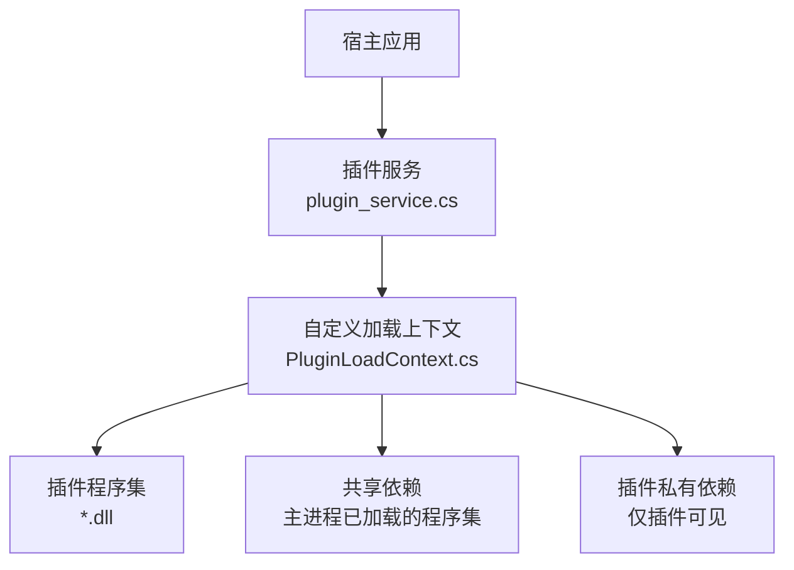
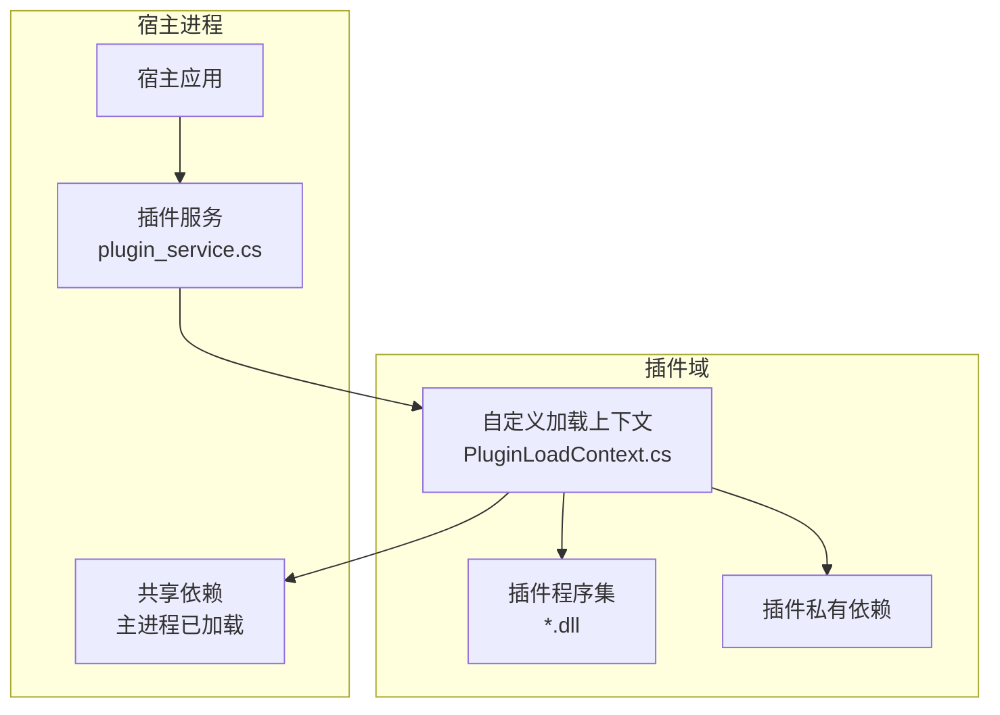
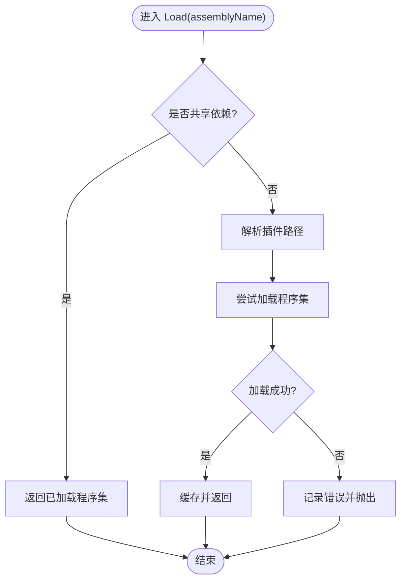
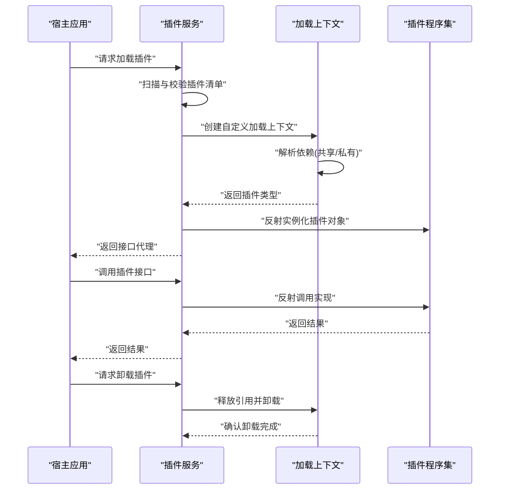
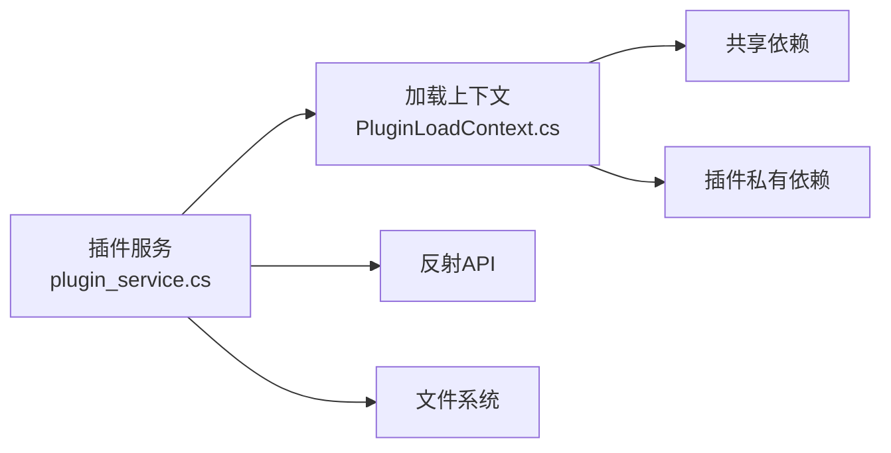

# 动态加载机制

<cite>
**本文引用的文件**   
- [PluginLoadContext.cs](file://PluginLoadContext.cs)
- [plugin_service.cs](file://plugin_service.cs)
</cite>

## 目录
1. [简介](#简介)
2. [项目结构](#项目结构)
3. [核心组件](#核心组件)
4. [架构总览](#架构总览)
5. [详细组件分析](#详细组件分析)
6. [依赖分析](#依赖分析)
7. [性能考虑](#性能考虑)
8. [故障排查指南](#故障排查指南)
9. [结论](#结论)
10. [附录](#附录)

## 简介
本文件围绕程序集动态加载机制展开，重点说明基于 AssemblyLoadContext 的插件化架构：包括加载上下文管理、依赖解析策略、插件隔离与共享依赖处理、反射调用与类型发现、接口绑定、热重载支持与卸载清理。文档提供加载流程时序图、错误处理策略以及最佳实践建议，帮助读者在复杂运行时环境中安全、稳定地实现可插拔扩展。

## 项目结构
仓库中包含与动态加载相关的两个关键源文件：
- PluginLoadContext.cs：自定义 AssemblyLoadContext 的实现，负责插件程序集的加载、依赖解析与隔离。
- plugin_service.cs：插件服务层，封装插件生命周期（发现、加载、初始化、调用、卸载）与资源清理。

图表来源
- [PluginLoadContext.cs](file://PluginLoadContext.cs)
- [plugin_service.cs](file://plugin_service.cs)

章节来源
- [PluginLoadContext.cs](file://PluginLoadContext.cs)
- [plugin_service.cs](file://plugin_service.cs)

## 核心组件
- 自定义加载上下文（AssemblyLoadContext）
  - 职责：控制插件程序集及其依赖的加载顺序与可见性；拦截默认解析逻辑，优先使用宿主已加载的类型，避免版本冲突；支持插件私有依赖与共享依赖分离。
  - 关键点：重写 Load 方法以区分“共享依赖”和“插件依赖”；维护加载缓存与引用计数；确保类型隔离与资源释放。
- 插件服务（PluginService）
  - 职责：扫描插件目录、识别插件入口类型、创建加载上下文、实例化插件对象、暴露统一接口供宿主调用；管理插件生命周期与异常隔离；提供卸载与清理能力。
  - 关键点：插件契约（接口）定义与发现；反射调用入口；错误捕获与诊断；资源释放（文件句柄、内存、事件订阅）。

章节来源
- [PluginLoadContext.cs](file://PluginLoadContext.cs)
- [plugin_service.cs](file://plugin_service.cs)

## 架构总览
下图展示宿主、插件服务与自定义加载上下文之间的交互关系，以及插件程序集与依赖的加载路径。

图表来源
- [plugin_service.cs](file://plugin_service.cs)
- [PluginLoadContext.cs](file://PluginLoadContext.cs)

## 详细组件分析

### 自定义加载上下文（AssemblyLoadContext）
- 设计要点
  - 隔离性：每个插件或插件组拥有独立的加载上下文，避免类型与版本冲突。
  - 依赖解析策略：优先解析宿主已加载的共享依赖；未命中时再尝试从插件目录加载私有依赖。
  - 资源管理：跟踪已加载程序集与类型引用，支持显式卸载与垃圾回收。
- 典型行为
  - 拦截 Load(assemblyName)：判断是否为共享依赖，若是则返回已加载实例；否则按插件路径解析并加载。
  - 类型发现：通过反射枚举类型、查找实现特定接口的类，用于插件注册与调用。
  - 错误处理：对缺失依赖、版本不匹配、权限不足等异常进行包装与上报。

图表来源
- [PluginLoadContext.cs](file://PluginLoadContext.cs)

章节来源
- [PluginLoadContext.cs](file://PluginLoadContext.cs)

### 插件服务（PluginService）
- 职责边界
  - 插件发现：扫描指定目录，识别符合约定的插件程序集。
  - 生命周期管理：创建加载上下文、加载插件、初始化、调用、卸载。
  - 接口绑定：通过反射将插件类型映射到宿主定义的接口，确保类型一致性。
  - 异常隔离：捕获插件执行过程中的异常，防止影响宿主稳定性。
- 关键流程
  - 启动阶段：扫描插件目录，构建插件清单。
  - 加载阶段：为每个插件创建独立加载上下文，解析依赖并实例化插件对象。
  - 运行阶段：通过接口调用插件功能，收集结果与日志。
  - 卸载阶段：释放引用、取消事件订阅、关闭资源，触发 GC。

图表来源
- [plugin_service.cs](file://plugin_service.cs)
- [PluginLoadContext.cs](file://PluginLoadContext.cs)

章节来源
- [plugin_service.cs](file://plugin_service.cs)
- [PluginLoadContext.cs](file://PluginLoadContext.cs)

### 反射调用与类型发现
- 类型发现策略
  - 约定优于配置：插件需实现宿主定义的接口，并通过命名约定或特性标记被识别。
  - 元数据扫描：枚举类型、检查接口实现、过滤非公开成员。
- 接口绑定
  - 通过反射获取插件类型后，将其转换为宿主接口类型，确保跨上下文类型一致。
  - 若类型来自不同上下文，需通过 MarshalByRefObject 或消息传递方式通信。
- 性能优化
  - 缓存反射结果与方法信息，减少重复开销。
  - 使用委托或动态编译提升调用效率。

章节来源
- [plugin_service.cs](file://plugin_service.cs)
- [PluginLoadContext.cs](file://PluginLoadContext.cs)

### 热重载支持与卸载清理
- 热重载思路
  - 为每次更新创建新的加载上下文，旧上下文保持引用直至无活跃对象。
  - 通过版本号或哈希标识插件实例，确保新旧版本共存与切换。
- 卸载与清理
  - 显式释放所有插件引用，取消事件订阅与定时器。
  - 关闭文件句柄、数据库连接、网络套接字等资源。
  - 等待 GC 回收，必要时触发强制回收。

章节来源
- [plugin_service.cs](file://plugin_service.cs)
- [PluginLoadContext.cs](file://PluginLoadContext.cs)

## 依赖分析
- 组件耦合
  - 插件服务依赖加载上下文进行程序集加载与依赖解析。
  - 加载上下文依赖宿主已加载的共享依赖，避免重复加载。
- 外部依赖
  - 反射 API 用于类型发现与调用。
  - 文件系统访问用于插件扫描与加载。
- 潜在循环依赖
  - 插件不应反向依赖宿主内部实现，仅通过接口通信。

图表来源
- [plugin_service.cs](file://plugin_service.cs)
- [PluginLoadContext.cs](file://PluginLoadContext.cs)

章节来源
- [plugin_service.cs](file://plugin_service.cs)
- [PluginLoadContext.cs](file://PluginLoadContext.cs)

## 性能考虑
- 加载性能
  - 预扫描插件清单，减少运行时 IO。
  - 缓存已解析的类型与方法信息。
- 调用性能
  - 使用委托缓存反射调用，避免每次反射开销。
  - 批量处理插件调用，减少上下文切换。
- 内存管理
  - 及时释放插件引用，避免内存泄漏。
  - 监控大对象堆与频繁分配场景。

## 故障排查指南
- 常见问题
  - 依赖缺失：检查插件目录结构与依赖清单。
  - 版本冲突：确认共享依赖版本一致，避免多版本并存。
  - 权限问题：确保宿主对插件目录具有读取权限。
  - 类型不一致：确保插件实现的接口与宿主定义完全一致。
- 诊断手段
  - 启用详细日志，记录加载失败原因与堆栈。
  - 使用依赖分析工具查看程序集加载顺序。
  - 模拟不同环境验证兼容性。

章节来源
- [plugin_service.cs](file://plugin_service.cs)
- [PluginLoadContext.cs](file://PluginLoadContext.cs)

## 结论
通过自定义 AssemblyLoadContext 与插件服务的协同，可实现高内聚、低耦合的插件化架构。合理的依赖解析策略与类型隔离机制确保了系统的稳定性与可扩展性。结合反射调用、热重载与完善的错误处理，能够在复杂运行时环境中提供灵活的扩展能力。

## 附录
- 最佳实践
  - 明确插件契约，避免强耦合。
  - 严格管理依赖版本，优先使用共享依赖。
  - 实现健壮的异常处理与日志记录。
  - 定期审查资源使用情况，防止内存泄漏。
- 参考实现
  - 自定义加载上下文：[PluginLoadContext.cs](file://PluginLoadContext.cs)
  - 插件服务：[plugin_service.cs](file://plugin_service.cs)