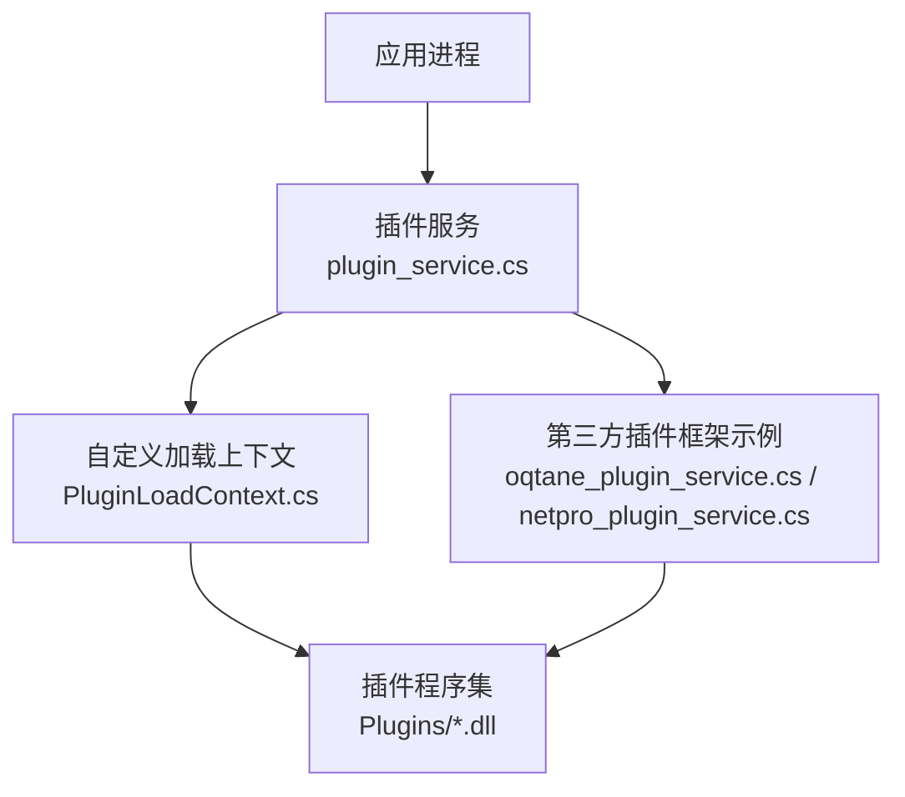
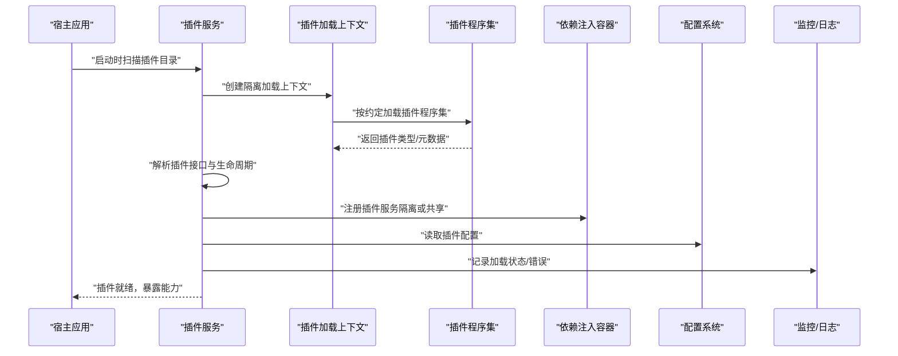
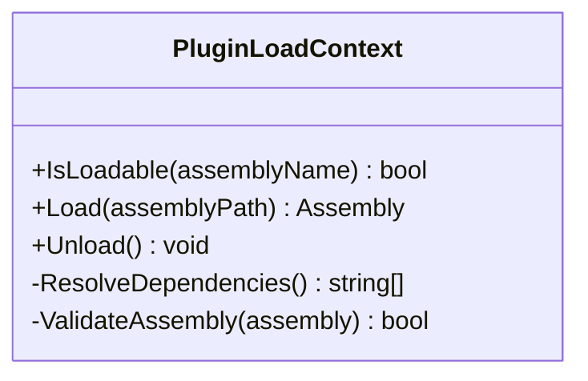
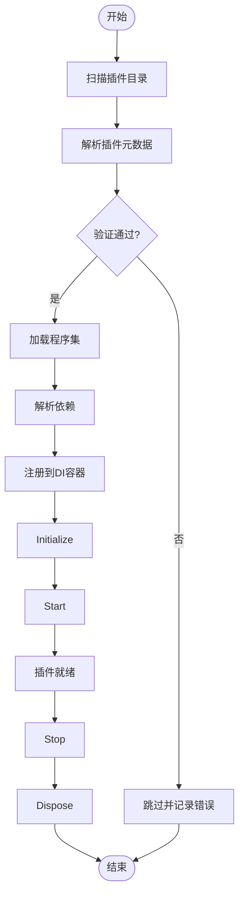
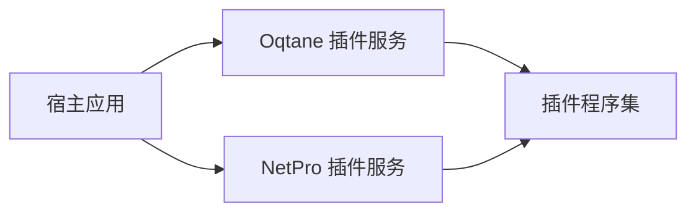
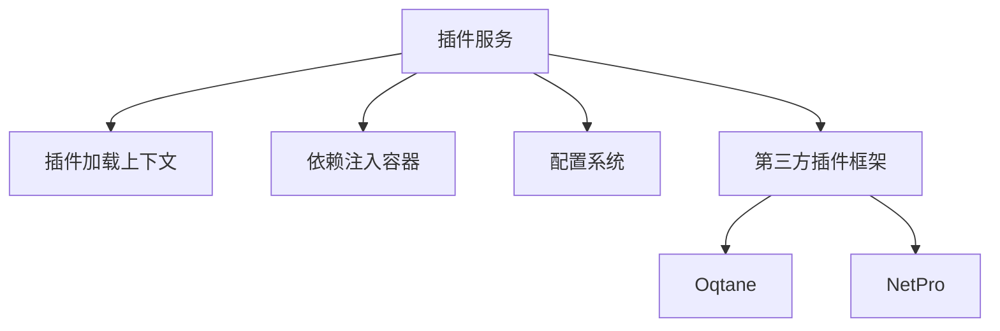

# 插件开发

<cite>
**本文引用的文件**   
- [PluginLoadContext.cs](file://PluginLoadContext.cs)
- [plugin_service.cs](file://plugin_service.cs)
- [netpro_plugin_service.cs](file://netpro_plugin_service.cs)
- [oqtane_plugin_service.cs](file://oqtane_plugin_service.cs)
- [README.md](file://README.md)
</cite>

## 目录
1. [简介](#简介)
2. [项目结构](#项目结构)
3. [核心组件](#核心组件)
4. [架构总览](#架构总览)
5. [详细组件分析](#详细组件分析)
6. [依赖关系分析](#依赖关系分析)
7. [性能考量](#性能考量)
8. [故障排查指南](#故障排查指南)
9. [结论](#结论)
10. [附录](#附录)

## 简介
本文件面向插件开发者，系统化阐述本仓库中的插件体系：包括插件架构设计、动态加载机制、插件接口规范与生命周期管理；并覆盖程序集隔离、依赖注入集成、插件配置管理与版本兼容性。同时给出插件开发框架建议、调试技巧与部署策略，并提供插件市场、插件管理与用户界面的实现方案参考。

## 项目结构
仓库采用“示例/集成式”组织方式，大量以“_integration.cs”命名的文件展示各类技术栈的集成用法。与插件相关的关键文件集中在根目录与 code 目录下，分别提供：
- 自定义 LoadContext 与插件加载上下文（程序集隔离）
- 通用插件服务（发现、加载、生命周期）
- 与第三方插件框架（如 Oqtane、NetPro）的集成示例

图表来源 
- [plugin_service.cs](file://plugin_service.cs)
- [PluginLoadContext.cs](file://PluginLoadContext.cs)
- [oqtane_plugin_service.cs](file://oqtane_plugin_service.cs)
- [netpro_plugin_service.cs](file://netpro_plugin_service.cs)

章节来源
- [README.md](file://README.md)

## 核心组件
- 插件加载上下文（程序集隔离）
  - 通过自定义 AssemblyLoadContext 实现插件程序集的隔离加载，避免主程序与插件之间的类型冲突与版本冲突。
  - 负责解析插件依赖、按需加载、卸载与资源释放。
- 插件服务（发现与生命周期）
  - 扫描指定目录下的插件程序集，识别插件元数据与入口类型。
  - 提供统一的插件生命周期钩子（初始化、启动、停止、销毁）。
  - 与依赖注入容器集成，将插件服务注册到宿主 DI 或隔离的 DI 容器中。
- 第三方插件框架集成
  - 提供与 Oqtane、NetPro 等成熟插件框架的对接示例，便于快速接入现有生态。

章节来源
- [PluginLoadContext.cs](file://PluginLoadContext.cs)
- [plugin_service.cs](file://plugin_service.cs)
- [oqtane_plugin_service.cs](file://oqtane_plugin_service.cs)
- [netpro_plugin_service.cs](file://netpro_plugin_service.cs)

## 架构总览
下图展示了插件从发现、加载到运行期的整体流程，以及与应用、DI、配置与监控的交互点。

图表来源 
- [plugin_service.cs](file://plugin_service.cs)
- [PluginLoadContext.cs](file://PluginLoadContext.cs)

## 详细组件分析

### 组件一：插件加载上下文（程序集隔离）
- 职责
  - 继承并实现自定义 AssemblyLoadContext，控制插件程序集及其依赖的加载路径与解析策略。
  - 实现 IsLoadable、Load 等关键方法，确保仅加载受信任的插件与白名单依赖。
  - 支持插件卸载与资源清理，避免内存泄漏。
- 关键点
  - 隔离范围：每个插件或插件组可拥有独立加载上下文，避免类型碰撞。
  - 依赖解析：优先使用宿主共享依赖，其次回退到插件私有依赖。
  - 安全校验：对程序集签名、版本、来源进行校验。
- 复杂度与性能
  - 首次加载存在反射与 I/O 开销，应缓存已解析的类型与元数据。
  - 卸载需显式调用并等待 GC 回收，避免频繁创建/销毁上下文。

图表来源 
- [PluginLoadContext.cs](file://PluginLoadContext.cs)

章节来源
- [PluginLoadContext.cs](file://PluginLoadContext.cs)

### 组件二：插件服务（发现、加载与生命周期）
- 职责
  - 扫描插件目录，读取插件清单（名称、版本、依赖、入口类型）。
  - 基于约定或特性标记识别插件接口与生命周期方法。
  - 协调加载顺序、依赖解析、异常处理与重试。
  - 与 DI 容器集成，将插件服务注册为单例/瞬态/作用域等。
- 生命周期
  - Initialize：初始化插件内部状态与配置。
  - Start：启动后台任务、订阅事件、注册端点等。
  - Stop：优雅关闭，释放资源。
  - Dispose：彻底释放非托管资源。
- 错误处理
  - 捕获加载失败、类型缺失、版本不兼容等异常，记录诊断信息。
  - 提供降级策略（跳过有问题的插件，继续加载其他插件）。

图表来源 
- [plugin_service.cs](file://plugin_service.cs)

章节来源
- [plugin_service.cs](file://plugin_service.cs)

### 组件三：第三方插件框架集成（Oqtane、NetPro）
- Oqtane 集成
  - 通过 oqtane_plugin_service.cs 展示如何与 Oqtane 的模块/页面/主题模型对接。
  - 复用其元数据、路由、权限与 UI 渲染管线。
- NetPro 集成
  - 通过 netpro_plugin_service.cs 展示与 NetPro 插件体系的适配，包括插件包格式、安装与更新流程。
- 价值
  - 快速获得成熟的插件生态能力（UI、权限、升级、审计等）。

图表来源 
- [oqtane_plugin_service.cs](file://oqtane_plugin_service.cs)
- [netpro_plugin_service.cs](file://netpro_plugin_service.cs)

章节来源
- [oqtane_plugin_service.cs](file://oqtane_plugin_service.cs)
- [netpro_plugin_service.cs](file://netpro_plugin_service.cs)

### 组件四：插件接口规范与生命周期约定
- 接口规范建议
  - 定义最小化公共接口（IPlugin），包含名称、版本、依赖声明、生命周期方法。
  - 使用特性或约定标识扩展点（如 IEndpoint, IBackgroundTask, IEventHandler）。
- 生命周期约定
  - Initialize：读取配置、建立连接、预热缓存。
  - Start：启动定时任务、消息订阅、HTTP 端点。
  - Stop：取消任务、断开连接、持久化状态。
  - Dispose：释放非托管资源。
- 版本兼容性
  - 语义化版本控制，主版本不兼容变更需明确提示。
  - 运行时检查版本约束，提供向后兼容适配器。

章节来源
- [plugin_service.cs](file://plugin_service.cs)
- [PluginLoadContext.cs](file://PluginLoadContext.cs)

## 依赖关系分析
- 组件耦合
  - 插件服务依赖加载上下文完成程序集隔离加载。
  - 插件服务依赖 DI 容器完成服务注册与解析。
  - 插件服务依赖配置系统读取插件配置。
- 外部依赖
  - 可选集成 Oqtane/NetPro 等框架，以获得更丰富的插件管理能力。
- 潜在循环依赖
  - 插件不应反向依赖宿主具体实现，应通过接口与事件解耦。

图表来源 
- [plugin_service.cs](file://plugin_service.cs)
- [PluginLoadContext.cs](file://PluginLoadContext.cs)
- [oqtane_plugin_service.cs](file://oqtane_plugin_service.cs)
- [netpro_plugin_service.cs](file://netpro_plugin_service.cs)

章节来源
- [plugin_service.cs](file://plugin_service.cs)
- [PluginLoadContext.cs](file://PluginLoadContext.cs)
- [oqtane_plugin_service.cs](file://oqtane_plugin_service.cs)
- [netpro_plugin_service.cs](file://netpro_plugin_service.cs)

## 性能考量
- 加载优化
  - 缓存插件元数据与类型映射，避免重复反射。
  - 延迟加载非必要依赖，按需实例化。
- 内存管理
  - 合理划分加载上下文，避免大对象长期驻留。
  - 及时释放非托管资源，避免内存泄漏。
- 并发与吞吐
  - 插件间尽量无状态或线程安全设计。
  - 对 IO 密集型操作使用异步与缓冲。
- 监控与诊断
  - 记录加载耗时、错误率、内存占用等指标。
  - 提供健康检查与自诊断接口。

[本节为通用指导，无需特定文件引用]

## 故障排查指南
- 常见问题
  - 程序集未找到或版本不一致：检查插件依赖清单与共享依赖版本。
  - 类型找不到或无法转换：确认接口版本兼容性与加载上下文隔离策略。
  - 插件启动失败：查看初始化阶段异常与配置项是否正确。
- 定位手段
  - 启用详细日志，记录加载过程与错误堆栈。
  - 使用诊断工具（如 dotnet-dump、dotnet-trace）分析内存与 CPU。
  - 逐步禁用插件，缩小问题范围。
- 恢复策略
  - 自动回滚到上一稳定版本。
  - 提供热插拔与灰度发布能力。

章节来源
- [plugin_service.cs](file://plugin_service.cs)
- [PluginLoadContext.cs](file://PluginLoadContext.cs)

## 结论
本仓库提供了完整的插件体系基础能力：通过自定义加载上下文实现程序集隔离，通过插件服务统一管理插件的发现、加载与生命周期，并支持与主流插件框架集成。在此基础上，结合接口规范、版本兼容与监控诊断，可构建稳定、可扩展且易维护的插件生态。

[本节为总结性内容，无需特定文件引用]

## 附录

### 插件开发框架建议
- 统一接口与约定
  - 定义最小化的 IPlugin 接口与生命周期方法。
  - 使用特性或约定标注扩展点（API、任务、事件处理器）。
- 元数据与清单
  - 插件需提供清单文件（名称、版本、依赖、作者、描述）。
  - 清单用于安装、升级与依赖解析。
- 安全与签名
  - 强制插件签名校验与来源白名单。
  - 限制插件访问敏感 API 的能力。

[本节为通用指导，无需特定文件引用]

### 调试技巧
- 本地调试
  - 将插件项目与宿主项目同解决方案调试，设置断点与日志。
  - 使用独立加载上下文模式模拟生产环境。
- 远程诊断
  - 启用远程调试与性能剖析。
  - 收集崩溃转储与跟踪数据。
- 自动化测试
  - 编写插件单元测试与集成测试，覆盖加载、启动、停止流程。

[本节为通用指导，无需特定文件引用]

### 部署策略
- 目录结构
  - 插件目录与宿主分离，支持多租户或多环境部署。
- 版本管理
  - 使用语义化版本与锁定文件，确保依赖一致性。
- 更新与回滚
  - 支持增量更新与一键回滚。
  - 灰度发布与流量切换。
- 监控告警
  - 采集插件健康指标与错误率，设置阈值告警。

[本节为通用指导，无需特定文件引用]

### 插件市场与管理界面
- 插件市场
  - 提供插件搜索、分类、评分与评论。
  - 支持在线安装、更新与卸载。
- 管理界面
  - 插件列表、详情、启停控制、配置编辑。
  - 日志查看、健康检查与诊断报告。
- 权限与安全
  - 基于角色的访问控制（RBAC）。
  - 插件安装审批与审计追踪。

[本节为通用指导，无需特定文件引用]