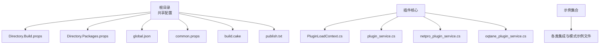
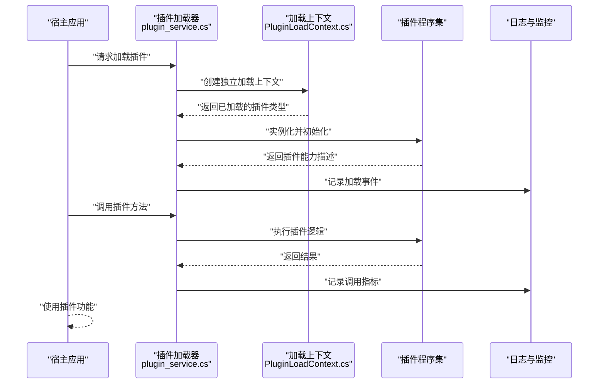
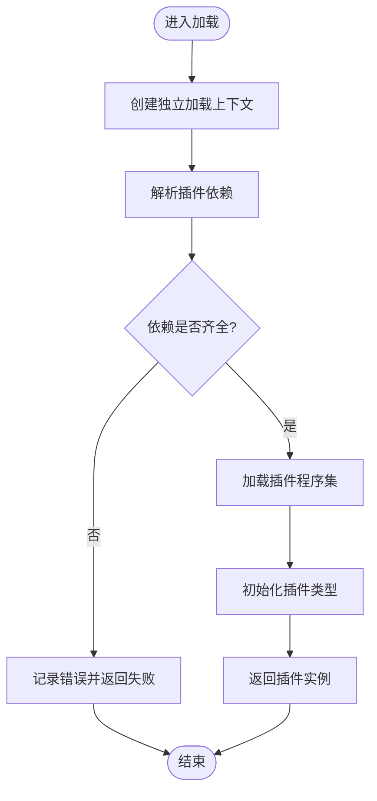
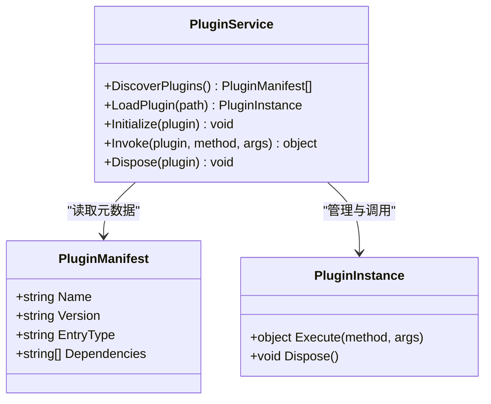
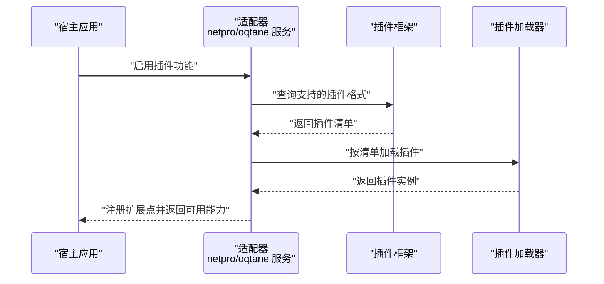
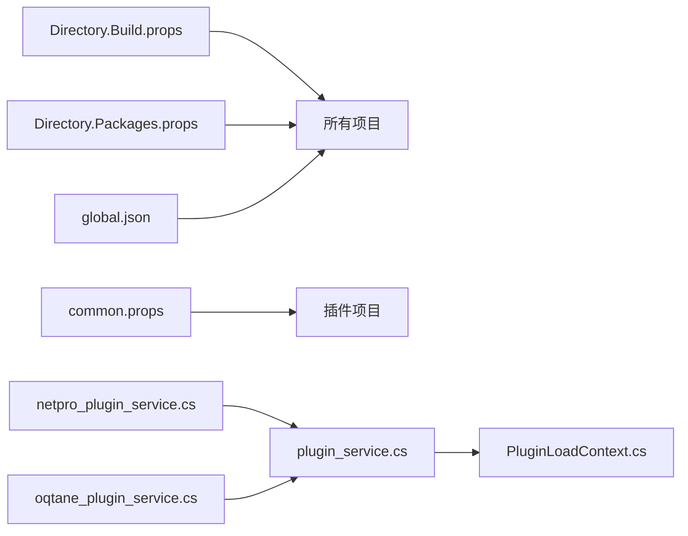

# 插件开发指南

<cite>
**本文引用的文件**   
- [README.md](file://README.md)
- [Directory.Build.props](file://Directory.Build.props)
- [Directory.Packages.props](file://Directory.Packages.props)
- [global.json](file://global.json)
- [PluginLoadContext.cs](file://PluginLoadContext.cs)
- [plugin_service.cs](file://plugin_service.cs)
- [netpro_plugin_service.cs](file://netpro_plugin_service.cs)
- [oqtane_plugin_service.cs](file://oqtane_plugin_service.cs)
- [common.props](file://common.props)
- [build.cake](file://build.cake)
- [publish.txt](file://publish.txt)
</cite>

## 目录
1. [简介](#简介)
2. [项目结构](#项目结构)
3. [核心组件](#核心组件)
4. [架构总览](#架构总览)
5. [详细组件分析](#详细组件分析)
6. [依赖关系分析](#依赖关系分析)
7. [性能考虑](#性能考虑)
8. [故障排查指南](#故障排查指南)
9. [结论](#结论)
10. [附录](#附录)

## 简介
本指南面向从零开始开发插件的工程师，围绕本仓库中已有的插件基础设施与示例服务，系统讲解如何搭建插件项目、组织代码、配置开发环境、调试与监控、打包签名与发布。内容覆盖：
- 插件项目模板与基础类库
- 命名约定与代码组织规范
- 插件加载与生命周期管理
- 日志记录与性能监控
- 构建、打包、签名与发布流程
- 完整开发示例与常见问题解决方案

## 项目结构
该仓库采用“多示例 + 共享配置”的组织方式。根目录包含大量独立示例文件（如各种集成与模式演示），同时提供统一的构建与包管理配置文件，以及插件相关的核心实现与服务。

- 根级共享配置
  - Directory.Build.props / Directory.Packages.props：集中定义公共属性与包版本，确保所有子项目一致化构建与依赖。
  - global.json：锁定 SDK/工具链版本，保证跨环境一致性。
  - common.props：可被各示例或插件项目引用，统一输出路径、符号生成、强名称等。
  - build.cake：构建脚本入口，支持自动化编译、测试、打包。
  - publish.txt：发布相关说明或步骤参考。

- 插件相关核心文件
  - PluginLoadContext.cs：自定义程序集加载上下文，用于隔离加载插件及其依赖，避免主应用与插件之间的类型冲突。
  - plugin_service.cs：插件服务抽象与宿主侧加载、发现、生命周期管理的示例实现。
  - netpro_plugin_service.cs / oqtane_plugin_service.cs：不同插件框架风格的宿主集成示例，展示如何对接外部插件生态。

**图表来源** 
- [Directory.Build.props](file://Directory.Build.props)
- [Directory.Packages.props](file://Directory.Packages.props)
- [global.json](file://global.json)
- [common.props](file://common.props)
- [build.cake](file://build.cake)
- [publish.txt](file://publish.txt)
- [PluginLoadContext.cs](file://PluginLoadContext.cs)
- [plugin_service.cs](file://plugin_service.cs)
- [netpro_plugin_service.cs](file://netpro_plugin_service.cs)
- [oqtane_plugin_service.cs](file://oqtane_plugin_service.cs)

**章节来源**
- [README.md](file://README.md)
- [Directory.Build.props](file://Directory.Build.props)
- [Directory.Packages.props](file://Directory.Packages.props)
- [global.json](file://global.json)
- [common.props](file://common.props)
- [build.cake](file://build.cake)
- [publish.txt](file://publish.txt)

## 核心组件
- 插件加载上下文（PluginLoadContext）
  - 职责：为插件创建独立的加载域，隔离主应用与插件的程序集解析，避免版本冲突与类型污染。
  - 关键点：自定义程序集解析策略；按需加载插件依赖；释放资源时清理加载上下文。

- 插件服务（plugin_service）
  - 职责：定义插件接口契约、发现机制、生命周期管理（初始化、运行、销毁）、错误处理与事件通知。
  - 关键点：插件元数据读取；按约定或清单加载；异常隔离与恢复；健康检查与状态上报。

- 宿主集成示例（netpro_plugin_service / oqtane_plugin_service）
  - 职责：展示如何与不同插件框架或宿主环境集成，包括配置注入、依赖注入容器适配、扩展点注册。
  - 关键点：适配器模式封装差异；统一插件发现与加载流程；兼容多框架风格。

**章节来源**
- [PluginLoadContext.cs](file://PluginLoadContext.cs)
- [plugin_service.cs](file://plugin_service.cs)
- [netpro_plugin_service.cs](file://netpro_plugin_service.cs)
- [oqtane_plugin_service.cs](file://oqtane_plugin_service.cs)

## 架构总览
下图展示了插件宿主与插件之间的交互关系，包括加载、调用、日志与监控的关键路径。

**图表来源** 
- [plugin_service.cs](file://plugin_service.cs)
- [PluginLoadContext.cs](file://PluginLoadContext.cs)

## 详细组件分析

### 插件加载上下文（PluginLoadContext）
- 设计要点
  - 隔离加载：通过自定义程序集解析，仅允许加载插件目录下的依赖，避免与宿主冲突。
  - 依赖管理：支持显式声明插件依赖清单，按需解析与缓存。
  - 资源释放：在卸载插件时正确释放上下文，防止内存泄漏。
- 复杂度与性能
  - 程序集解析时间复杂度与依赖数量线性相关；建议缓存已解析的类型映射。
  - 避免频繁创建/销毁上下文，尽量复用或池化。
- 错误处理
  - 捕获依赖缺失、版本不匹配等异常，向上抛出明确错误信息。
  - 提供回退策略（如降级到最小依赖集）。

**图表来源** 
- [PluginLoadContext.cs](file://PluginLoadContext.cs)

**章节来源**
- [PluginLoadContext.cs](file://PluginLoadContext.cs)

### 插件服务（plugin_service）
- 设计要点
  - 插件契约：定义统一的接口与元数据模型，便于宿主识别与调用。
  - 发现机制：基于约定（目录/文件名）或清单（JSON/XML）发现插件。
  - 生命周期：初始化、启动、停止、销毁；支持热重载与动态更新。
  - 错误隔离：捕获插件异常，避免影响宿主稳定性。
- 性能优化
  - 懒加载：仅在首次使用时加载插件。
  - 并发控制：限制并发加载与调用，避免资源争用。
  - 缓存策略：缓存插件元数据与已解析类型。

**图表来源** 
- [plugin_service.cs](file://plugin_service.cs)

**章节来源**
- [plugin_service.cs](file://plugin_service.cs)

### 宿主集成示例（netpro_plugin_service / oqtane_plugin_service）
- 设计要点
  - 适配器模式：封装不同插件框架的差异，对外暴露统一接口。
  - 依赖注入：将插件服务注册到宿主 DI 容器，支持按作用域生命周期管理。
  - 扩展点注册：在宿主启动时扫描并注册插件提供的扩展点。
- 兼容性
  - 支持多框架风格插件，通过配置切换加载策略。
  - 提供迁移工具与文档，帮助从旧框架平滑过渡。

**图表来源** 
- [netpro_plugin_service.cs](file://netpro_plugin_service.cs)
- [oqtane_plugin_service.cs](file://oqtane_plugin_service.cs)

**章节来源**
- [netpro_plugin_service.cs](file://netpro_plugin_service.cs)
- [oqtane_plugin_service.cs](file://oqtane_plugin_service.cs)

## 依赖关系分析
- 共享配置依赖
  - Directory.Build.props 与 Directory.Packages.props 为所有项目提供一致的构建属性与包版本，减少重复配置。
  - global.json 锁定 SDK 版本，确保跨平台与 CI 一致性。
  - common.props 可被插件项目引用，统一输出路径、符号生成、强名称等。

- 插件核心依赖
  - plugin_service.cs 依赖 PluginLoadContext.cs 进行隔离加载。
  - netpro_plugin_service.cs 与 oqtane_plugin_service.cs 作为适配器，依赖 plugin_service.cs 的统一接口。

**图表来源** 
- [Directory.Build.props](file://Directory.Build.props)
- [Directory.Packages.props](file://Directory.Packages.props)
- [global.json](file://global.json)
- [common.props](file://common.props)
- [plugin_service.cs](file://plugin_service.cs)
- [PluginLoadContext.cs](file://PluginLoadContext.cs)
- [netpro_plugin_service.cs](file://netpro_plugin_service.cs)
- [oqtane_plugin_service.cs](file://oqtane_plugin_service.cs)

**章节来源**
- [Directory.Build.props](file://Directory.Build.props)
- [Directory.Packages.props](file://Directory.Packages.props)
- [global.json](file://global.json)
- [common.props](file://common.props)
- [plugin_service.cs](file://plugin_service.cs)
- [PluginLoadContext.cs](file://PluginLoadContext.cs)
- [netpro_plugin_service.cs](file://netpro_plugin_service.cs)
- [oqtane_plugin_service.cs](file://oqtane_plugin_service.cs)

## 性能考虑
- 加载性能
  - 使用懒加载与缓存，避免重复解析与加载。
  - 限制并发加载数量，防止 I/O 与 CPU 瓶颈。
- 运行时性能
  - 插件方法调用应尽量避免反射开销，必要时缓存委托或表达式树。
  - 对长耗时操作使用异步与线程池，避免阻塞主线程。
- 内存管理
  - 及时释放插件上下文与对象，避免内存泄漏。
  - 监控大对象分配与 GC 压力，必要时调整堆大小。

[本节为通用指导，无需特定文件来源]

## 故障排查指南
- 常见加载问题
  - 依赖缺失：检查插件清单与实际依赖是否一致，确认 DLL 存在于插件目录。
  - 版本冲突：使用独立加载上下文隔离版本，避免与宿主冲突。
  - 权限不足：确保宿主进程对插件目录有读/执行权限。
- 运行时异常
  - 插件崩溃：捕获异常并记录堆栈，提供降级或重启策略。
  - 性能退化：使用性能计数器与日志定位热点，优化算法与 I/O。
- 调试技巧
  - 启用详细日志，记录加载、初始化、调用与错误事件。
  - 使用远程调试或附加调试器到宿主进程，逐步排查插件问题。

**章节来源**
- [PluginLoadContext.cs](file://PluginLoadContext.cs)
- [plugin_service.cs](file://plugin_service.cs)

## 结论
本指南基于仓库中的插件基础设施与示例，提供了从零开始开发插件的系统性方法。通过统一的加载上下文、服务抽象与宿主适配器，开发者可以快速构建稳定、可维护且高性能的插件系统。结合共享配置与构建脚本，可实现一致的构建、测试与发布流程。建议在开发过程中严格遵循命名约定与代码组织规范，充分利用日志与监控工具，确保插件质量与可观测性。

[本节为总结性内容，无需特定文件来源]

## 附录
- 开发环境配置
  - 安装匹配的 .NET SDK（由 global.json 指定）。
  - 使用 dotnet CLI 或 Cake 脚本进行构建与发布。
- 插件项目模板
  - 参考 common.props 与 Directory.Build.props 设置输出与依赖。
  - 定义插件接口与元数据模型，遵循 plugin_service.cs 的约定。
- 打包与签名
  - 使用 NuGet 打包插件包，或通过 publish.txt 的步骤进行部署。
  - 如需强名称签名，配置 common.props 中的签名选项。
- 发布流程
  - 构建产物上传至制品库或部署目录。
  - 在宿主应用中配置插件路径与清单，完成动态加载。

**章节来源**
- [common.props](file://common.props)
- [Directory.Build.props](file://Directory.Build.props)
- [Directory.Packages.props](file://Directory.Packages.props)
- [global.json](file://global.json)
- [build.cake](file://build.cake)
- [publish.txt](file://publish.txt)