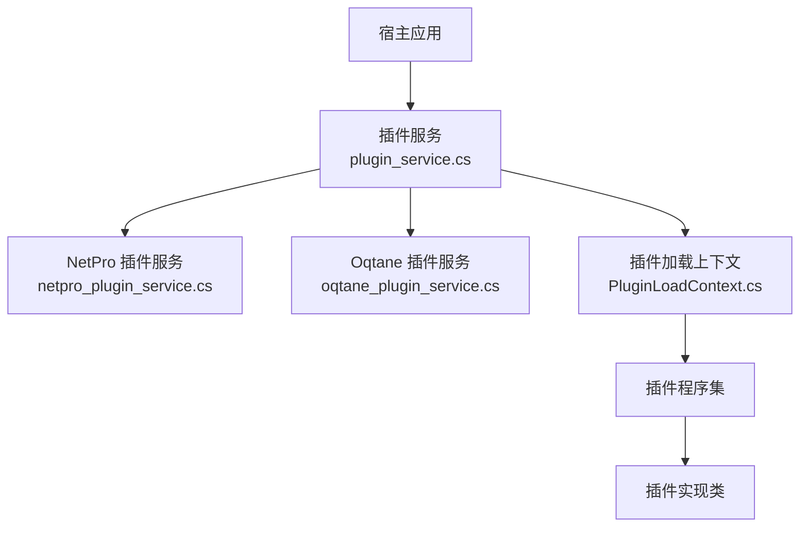
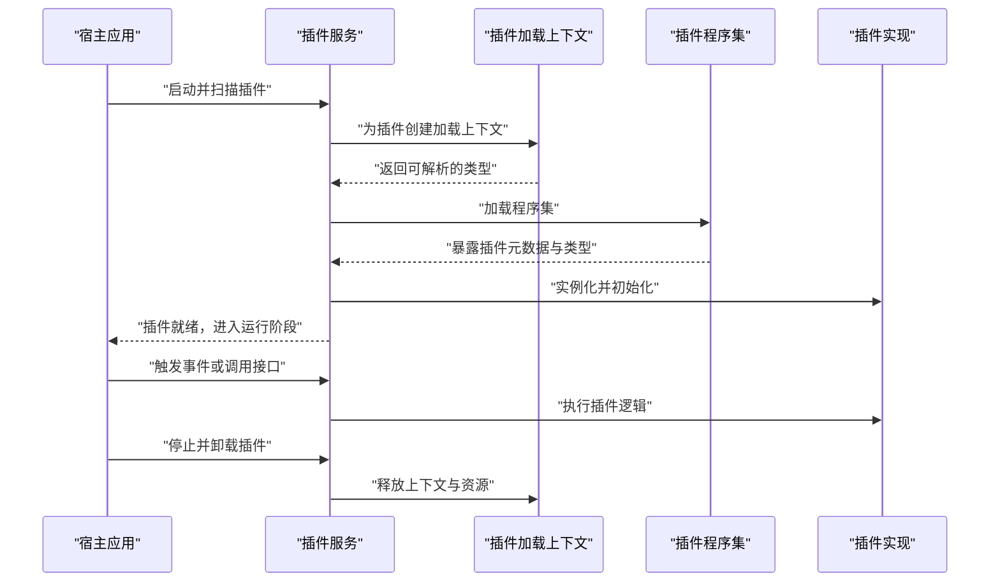
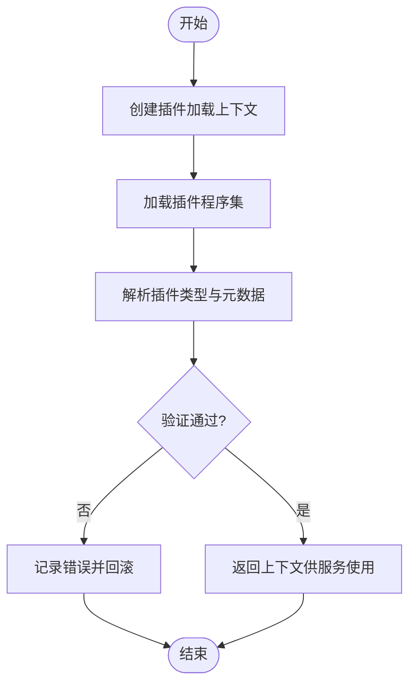
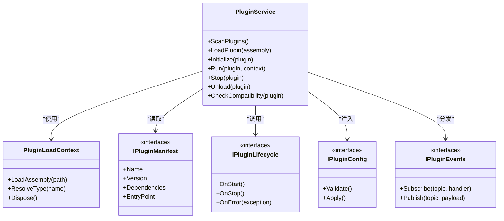
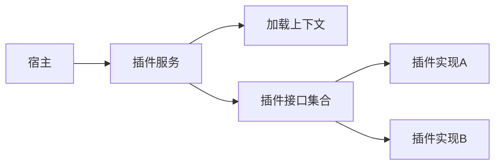
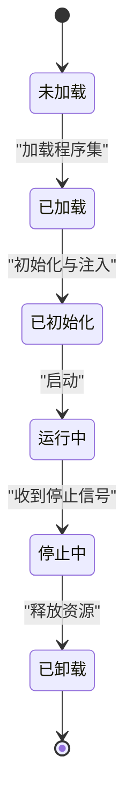

# 插件接口设计

<cite>
**本文引用的文件**   
- [PluginLoadContext.cs](file://PluginLoadContext.cs)
- [plugin_service.cs](file://plugin_service.cs)
- [netpro_plugin_service.cs](file://netpro_plugin_service.cs)
- [oqtane_plugin_service.cs](file://oqtane_plugin_service.cs)
</cite>

## 目录
1. [简介](#简介)
2. [项目结构](#项目结构)
3. [核心组件](#核心组件)
4. [架构总览](#架构总览)
5. [详细组件分析](#详细组件分析)
6. [依赖关系分析](#依赖关系分析)
7. [性能考量](#性能考量)
8. [故障排查指南](#故障排查指南)
9. [结论](#结论)
10. [附录](#附录)

## 简介
本文件面向插件系统的设计与实现，聚焦于“插件接口”的定义规范、版本兼容性与向后兼容策略，涵盖抽象设计、契约定义与扩展点规划。重点说明：
- 插件生命周期接口（加载、初始化、运行、卸载）
- 配置接口（读取、校验、热更新）
- 事件接口（发布/订阅、错误与诊断）
- 接口测试策略（模拟对象、测试框架集成）
- 示例代码路径与最佳实践

## 项目结构
仓库中包含多个与插件相关的实现与服务文件，用于演示不同风格的插件加载与管理方式。关键文件包括：
- PluginLoadContext.cs：自定义程序集加载上下文，隔离插件域
- plugin_service.cs：通用插件服务，负责发现、加载、生命周期管理
- netpro_plugin_service.cs：基于 NetPro 的插件服务实现
- oqtane_plugin_service.cs：参考 Oqtane 的插件服务模式

图表来源
- [plugin_service.cs](file://plugin_service.cs)
- [netpro_plugin_service.cs](file://netpro_plugin_service.cs)
- [oqtane_plugin_service.cs](file://oqtane_plugin_service.cs)
- [PluginLoadContext.cs](file://PluginLoadContext.cs)

章节来源
- [plugin_service.cs](file://plugin_service.cs)
- [netpro_plugin_service.cs](file://netpro_plugin_service.cs)
- [oqtane_plugin_service.cs](file://oqtane_plugin_service.cs)
- [PluginLoadContext.cs](file://PluginLoadContext.cs)

## 核心组件
- 插件加载上下文（PluginLoadContext）
  - 职责：为每个插件创建独立的程序集加载域，避免类型冲突与全局污染
  - 关键点：隔离依赖、按需解析、资源释放
- 插件服务（plugin_service）
  - 职责：扫描插件、实例化、注册到容器、协调生命周期
  - 关键点：版本探测、兼容性检查、错误恢复
- NetPro 插件服务（netpro_plugin_service）
  - 职责：在 NetPro 生态中提供插件能力
  - 关键点：与框架 DI、中间件、配置系统集成
- Oqtane 插件服务（oqtane_plugin_service）
  - 职责：参考 Oqtane 的模块化与插件模式
  - 关键点：模块清单、路由、权限与国际化支持

章节来源
- [PluginLoadContext.cs](file://PluginLoadContext.cs)
- [plugin_service.cs](file://plugin_service.cs)
- [netpro_plugin_service.cs](file://netpro_plugin_service.cs)
- [oqtane_plugin_service.cs](file://oqtane_plugin_service.cs)

## 架构总览
下图展示宿主、插件服务、加载上下文与插件之间的交互关系。

图表来源
- [plugin_service.cs](file://plugin_service.cs)
- [PluginLoadContext.cs](file://PluginLoadContext.cs)

## 详细组件分析

### 插件加载上下文（PluginLoadContext）
- 设计要点
  - 隔离加载：每个插件使用独立上下文，避免类型冲突
  - 依赖解析：仅解析插件所需依赖，减少内存占用
  - 资源释放：显式释放上下文，确保卸载时清理
- 复杂度与权衡
  - 空间复杂度：随插件数量线性增长
  - 时间复杂度：首次加载较慢，后续解析较快
- 优化建议
  - 延迟加载：按需解析类型
  - 缓存元数据：避免重复反射开销
  - 异常边界：捕获加载期异常，记录诊断信息

图表来源
- [PluginLoadContext.cs](file://PluginLoadContext.cs)

章节来源
- [PluginLoadContext.cs](file://PluginLoadContext.cs)

### 插件服务（plugin_service）
- 职责范围
  - 插件发现：按约定路径扫描程序集
  - 生命周期管理：初始化、运行、停止、卸载
  - 兼容性检查：版本、依赖、特性开关
  - 错误处理：失败降级、重试、熔断
- 扩展点
  - IPluginManifest：插件清单（名称、版本、依赖、入口）
  - IPluginLifecycle：生命周期钩子（OnStart、OnStop、OnError）
  - IPluginConfig：配置模型与校验器
  - IPluginEvents：事件总线接入点

图表来源
- [plugin_service.cs](file://plugin_service.cs)
- [PluginLoadContext.cs](file://PluginLoadContext.cs)

章节来源
- [plugin_service.cs](file://plugin_service.cs)

### NetPro 插件服务（netpro_plugin_service）
- 特点
  - 与 NetPro 的 DI、配置、日志、监控集成
  - 支持中间件管道中的插件扩展点
- 适配策略
  - 将插件能力封装为中间件或服务
  - 使用框架提供的配置源与密钥管理

章节来源
- [netpro_plugin_service.cs](file://netpro_plugin_service.cs)

### Oqtane 插件服务（oqtane_plugin_service）
- 特点
  - 参考 Oqtane 的模块化架构
  - 支持路由、权限、国际化等高级特性
- 适配策略
  - 以模块形式组织插件
  - 通过清单描述依赖与能力

章节来源
- [oqtane_plugin_service.cs](file://oqtane_plugin_service.cs)

## 依赖关系分析
- 耦合度
  - 插件服务与加载上下文强耦合（加载与解析）
  - 插件实现与接口弱耦合（通过契约）
- 外部依赖
  - 反射与程序集加载
  - 可选：DI 容器、消息总线、配置中心
- 循环依赖
  - 通过接口解耦，避免直接引用实现

图表来源
- [plugin_service.cs](file://plugin_service.cs)
- [PluginLoadContext.cs](file://PluginLoadContext.cs)

章节来源
- [plugin_service.cs](file://plugin_service.cs)
- [PluginLoadContext.cs](file://PluginLoadContext.cs)

## 性能考量
- 加载性能
  - 延迟加载与按需解析
  - 元数据缓存与预编译
- 运行时性能
  - 避免频繁反射
  - 使用轻量级事件总线
- 资源管理
  - 显式释放上下文与句柄
  - 限制并发加载数量

## 故障排查指南
- 常见问题
  - 程序集加载失败：检查依赖版本与签名
  - 类型解析异常：确认命名空间与程序集清单
  - 生命周期回调未触发：检查初始化顺序与异常捕获
- 诊断手段
  - 启用详细日志与跟踪
  - 输出插件清单与依赖图
  - 使用单元测试与集成测试覆盖加载流程

章节来源
- [plugin_service.cs](file://plugin_service.cs)
- [PluginLoadContext.cs](file://PluginLoadContext.cs)

## 结论
通过清晰的接口契约、严格的版本管理与健壮的生命周期控制，插件系统可实现高内聚、低耦合与可扩展性。结合隔离加载、缓存与诊断能力，可在保证稳定性的同时提升开发效率与运行性能。

## 附录

### 接口抽象设计与契约定义
- 插件清单（IPluginManifest）
  - 字段：名称、版本、作者、描述、依赖列表、入口类型
  - 校验：必填项、语义化版本、依赖存在性
- 生命周期（IPluginLifecycle）
  - 方法：OnStart、OnStop、OnError
  - 约束：幂等、超时保护、异常不传播
- 配置（IPluginConfig）
  - 方法：Validate、Apply
  - 约束：只读快照、变更通知、默认值
- 事件（IPluginEvents）
  - 方法：Subscribe、Publish
  - 约束：异步、去重、限流

### 版本兼容性与向后兼容策略
- 语义化版本
  - 主版本：破坏性变更
  - 次版本：新增功能（向后兼容）
  - 修订：缺陷修复
- 兼容性矩阵
  - 宿主与插件版本对照表
  - 特性开关与弃用警告
- 迁移策略
  - 双写与灰度发布
  - 自动迁移脚本与回滚机制

### 插件生命周期接口
- 阶段
  - 发现与加载
  - 初始化与依赖注入
  - 运行与事件处理
  - 停止与卸载
- 状态机
  - 未加载 → 已加载 → 已初始化 → 运行中 → 停止中 → 已卸载

图表来源
- [plugin_service.cs](file://plugin_service.cs)

### 配置接口设计原则
- 最小化暴露：仅暴露必要配置项
- 强类型与校验：避免运行时错误
- 热更新：支持动态刷新与生效
- 审计与追踪：记录变更历史

### 事件接口设计原则
- 主题化：按领域划分事件主题
- 幂等与去重：防止重复处理
- 背压与限流：保护下游
- 可观测性：指标与日志

### 接口测试策略
- 单元测试
  - 模拟插件实现与依赖
  - 断言生命周期回调顺序
- 集成测试
  - 端到端加载与运行
  - 验证配置与事件流
- 模拟对象
  - 使用 Mock 框架替代真实依赖
  - 构造异常场景与边界条件

### 示例代码路径
- 插件清单与生命周期示例
  - [plugin_service.cs](file://plugin_service.cs)
- 加载上下文与隔离示例
  - [PluginLoadContext.cs](file://PluginLoadContext.cs)
- NetPro 集成示例
  - [netpro_plugin_service.cs](file://netpro_plugin_service.cs)
- Oqtane 风格示例
  - [oqtane_plugin_service.cs](file://oqtane_plugin_service.cs)

### 最佳实践指南
- 明确契约：接口稳定、文档完善
- 渐进演进：优先向后兼容，逐步淘汰旧特性
- 安全边界：沙箱化与权限控制
- 可观测性：指标、日志、追踪三件套
- 自动化：CI/CD 中纳入兼容性检测与回归测试