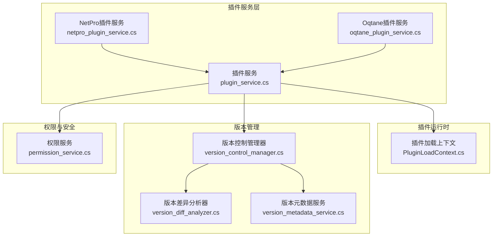
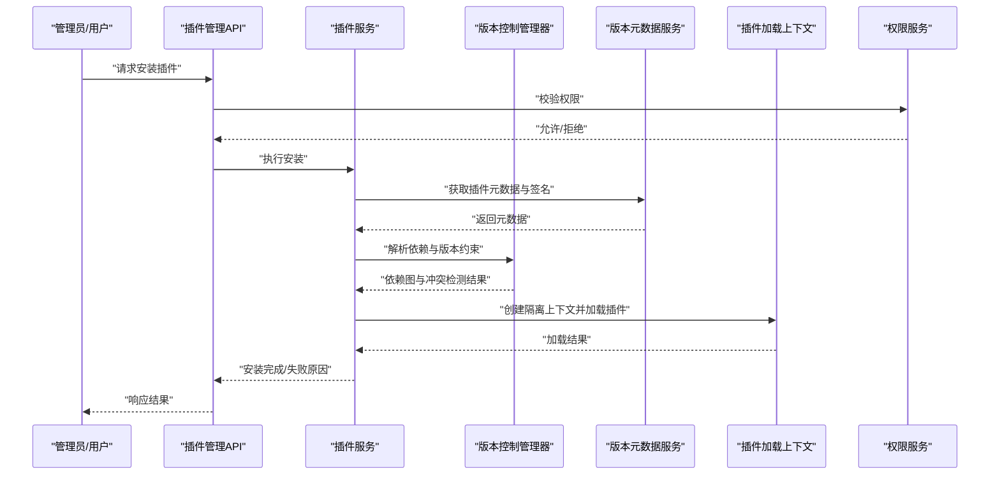
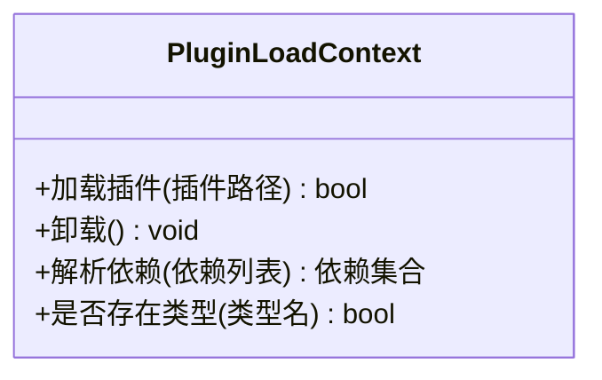
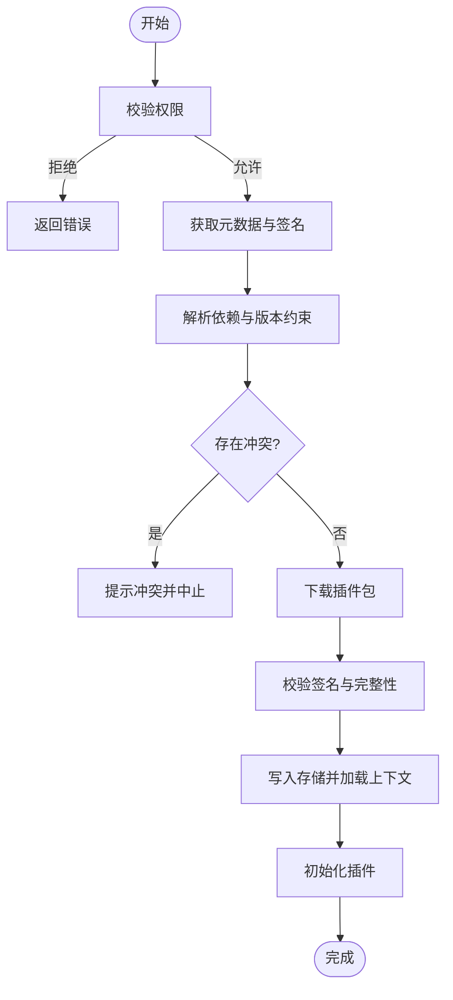
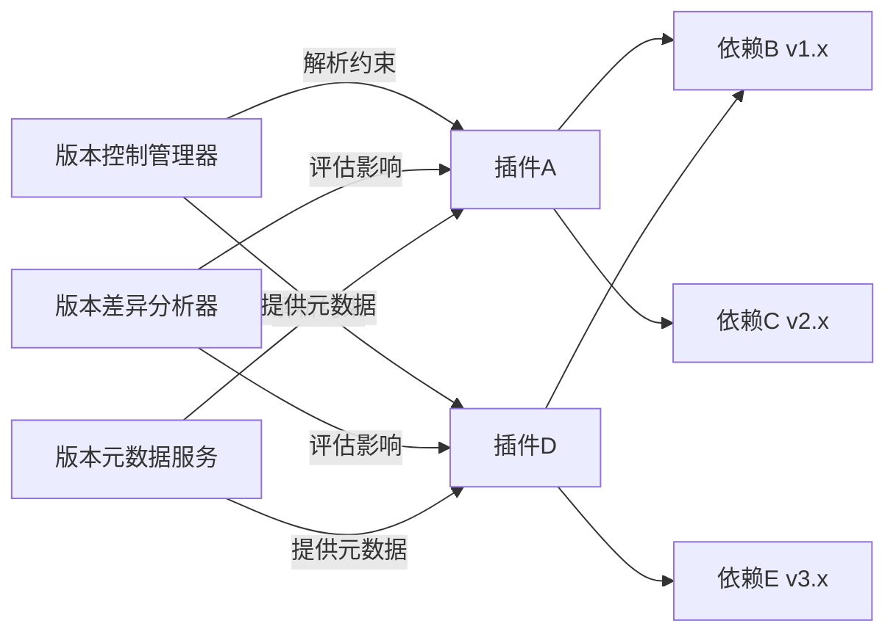

# 插件管理

<cite>
**本文引用的文件**   
- [PluginLoadContext.cs](file://PluginLoadContext.cs)
- [plugin_service.cs](file://plugin_service.cs)
- [netpro_plugin_service.cs](file://netpro_plugin_service.cs)
- [oqtane_plugin_service.cs](file://oqtane_plugin_service.cs)
- [version_control_manager.cs](file://version_control_manager.cs)
- [version_diff_analyzer.cs](file://version_diff_analyzer.cs)
- [version_metadata_service.cs](file://version_metadata_service.cs)
- [permission_service.cs](file://permission_service.cs)
</cite>

## 目录
1. [简介](#简介)
2. [项目结构](#项目结构)
3. [核心组件](#核心组件)
4. [架构总览](#架构总览)
5. [详细组件分析](#详细组件分析)
6. [依赖关系分析](#依赖关系分析)
7. [性能考量](#性能考量)
8. [故障排查指南](#故障排查指南)
9. [结论](#结论)
10. [附录](#附录)

## 简介
本文件围绕“插件管理”主题，系统化梳理插件的安装、更新、卸载与版本管理流程；阐述插件仓库、依赖解析与冲突解决机制；说明权限控制、安全验证与访问限制；并给出插件市场/在线商店与Web管理界面的实现方案。同时提供插件管理API、命令行工具与Web管理界面的设计建议，帮助读者快速理解与落地。

## 项目结构
从仓库根目录可见多个与插件加载与管理相关的源文件，涵盖插件上下文、服务层、版本管理与权限控制等关键模块。整体采用分层组织：
- 插件运行时上下文：负责隔离加载与生命周期管理
- 插件服务：封装安装、更新、卸载、发现与元数据操作
- 版本管理：统一版本解析、差异分析与元数据服务
- 权限与安全：基于角色的访问控制与策略校验

图表来源
- [PluginLoadContext.cs](file://PluginLoadContext.cs)
- [plugin_service.cs](file://plugin_service.cs)
- [netpro_plugin_service.cs](file://netpro_plugin_service.cs)
- [oqtane_plugin_service.cs](file://oqtane_plugin_service.cs)
- [version_control_manager.cs](file://version_control_manager.cs)
- [version_diff_analyzer.cs](file://version_diff_analyzer.cs)
- [version_metadata_service.cs](file://version_metadata_service.cs)
- [permission_service.cs](file://permission_service.cs)

章节来源
- [PluginLoadContext.cs](file://PluginLoadContext.cs)
- [plugin_service.cs](file://plugin_service.cs)
- [netpro_plugin_service.cs](file://netpro_plugin_service.cs)
- [oqtane_plugin_service.cs](file://oqtane_plugin_service.cs)
- [version_control_manager.cs](file://version_control_manager.cs)
- [version_diff_analyzer.cs](file://version_diff_analyzer.cs)
- [version_metadata_service.cs](file://version_metadata_service.cs)
- [permission_service.cs](file://permission_service.cs)

## 核心组件
- 插件加载上下文（PluginLoadContext）
  - 职责：为每个插件创建独立的加载上下文，隔离程序集与依赖，避免类型冲突与全局污染
  - 关键点：按插件边界隔离依赖解析、按需加载、卸载时释放引用
  - 参考路径：[PluginLoadContext.cs](file://PluginLoadContext.cs)

- 插件服务（plugin_service.cs）
  - 职责：封装插件的发现、安装、更新、卸载、启用/禁用、状态查询与元数据读取
  - 关键点：事务性操作、回滚策略、幂等性与并发控制
  - 参考路径：[plugin_service.cs](file://plugin_service.cs)

- NetPro插件服务（netpro_plugin_service.cs）
  - 职责：面向特定框架或生态的插件适配与扩展点集成
  - 关键点：能力注册、生命周期钩子、配置注入
  - 参考路径：[netpro_plugin_service.cs](file://netpro_plugin_service.cs)

- Oqtane插件服务（oqtane_plugin_service.cs）
  - 职责：对接Oqtane生态的插件模型与约定
  - 关键点：包格式兼容、路由与视图集成、权限映射
  - 参考路径：[oqtane_plugin_service.cs](file://oqtane_plugin_service.cs)

- 版本控制管理器（version_control_manager.cs）
  - 职责：统一版本语义解析、比较、升级路径计算与降级回滚
  - 关键点：语义化版本约束、依赖版本矩阵、冲突检测
  - 参考路径：[version_control_manager.cs](file://version_control_manager.cs)

- 版本差异分析器（version_diff_analyzer.cs）
  - 职责：对比两个版本的元数据与依赖差异，生成变更清单
  - 关键点：破坏性变更识别、兼容性矩阵、影响面评估
  - 参考路径：[version_diff_analyzer.cs](file://version_diff_analyzer.cs)

- 版本元数据服务（version_metadata_service.cs）
  - 职责：维护插件版本元数据、签名信息、发布渠道与镜像源
  - 关键点：元数据缓存、签名校验、多源聚合
  - 参考路径：[version_metadata_service.cs](file://version_metadata_service.cs)

- 权限服务（permission_service.cs）
  - 职责：插件级权限控制、访问限制与审计日志
  - 关键点：角色/资源/动作三元组、最小权限原则、动态授权
  - 参考路径：[permission_service.cs](file://permission_service.cs)

章节来源
- [PluginLoadContext.cs](file://PluginLoadContext.cs)
- [plugin_service.cs](file://plugin_service.cs)
- [netpro_plugin_service.cs](file://netpro_plugin_service.cs)
- [oqtane_plugin_service.cs](file://oqtane_plugin_service.cs)
- [version_control_manager.cs](file://version_control_manager.cs)
- [version_diff_analyzer.cs](file://version_diff_analyzer.cs)
- [version_metadata_service.cs](file://version_metadata_service.cs)
- [permission_service.cs](file://permission_service.cs)

## 架构总览
插件管理采用“上下文隔离 + 服务编排 + 版本治理 + 权限控制”的分层架构。插件通过独立上下文加载，服务层协调安装/更新/卸载流程，版本管理层确保一致性，权限层保障安全访问。

图表来源
- [plugin_service.cs](file://plugin_service.cs)
- [version_control_manager.cs](file://version_control_manager.cs)
- [version_metadata_service.cs](file://version_metadata_service.cs)
- [PluginLoadContext.cs](file://PluginLoadContext.cs)
- [permission_service.cs](file://permission_service.cs)

## 详细组件分析

### 插件加载上下文（PluginLoadContext）
- 设计要点
  - 插件隔离：每个插件拥有独立程序集加载域，避免全局类型冲突
  - 依赖解析：优先解析插件自身依赖，再回退到宿主共享库
  - 生命周期：支持按需加载与显式卸载，释放未引用对象
- 使用场景
  - 安装后首次激活
  - 热更新时的替换加载
  - 卸载时的资源回收

图表来源
- [PluginLoadContext.cs](file://PluginLoadContext.cs)

章节来源
- [PluginLoadContext.cs](file://PluginLoadContext.cs)

### 插件服务（plugin_service.cs）
- 功能范围
  - 插件发现：扫描本地与远程仓库
  - 安装/更新/卸载：事务性操作，支持回滚
  - 启用/禁用：控制插件运行状态
  - 元数据查询：名称、版本、作者、描述、许可证
- 关键流程
  - 安装：校验权限 -> 拉取元数据 -> 解析依赖 -> 下载包 -> 校验签名 -> 写入存储 -> 加载上下文 -> 初始化
  - 更新：检查新版本 -> 差异分析 -> 备份当前版本 -> 安装新版本 -> 切换引用
  - 卸载：停止插件 -> 清理依赖 -> 删除文件 -> 释放上下文

图表来源
- [plugin_service.cs](file://plugin_service.cs)
- [version_control_manager.cs](file://version_control_manager.cs)
- [version_metadata_service.cs](file://version_metadata_service.cs)
- [PluginLoadContext.cs](file://PluginLoadContext.cs)
- [permission_service.cs](file://permission_service.cs)

章节来源
- [plugin_service.cs](file://plugin_service.cs)

### NetPro插件服务（netpro_plugin_service.cs）
- 适配目标：针对NetPro生态的插件约定与扩展点
- 重点能力：能力注册、生命周期钩子、配置注入、事件总线集成
- 与通用插件服务的协作：复用安装/更新/卸载流程，聚焦领域适配

章节来源
- [netpro_plugin_service.cs](file://netpro_plugin_service.cs)

### Oqtane插件服务（oqtane_plugin_service.cs）
- 适配目标：Oqtane插件包格式与约定
- 重点能力：包解析、路由映射、视图集成、权限映射
- 与通用插件服务的协作：复用版本与依赖管理，专注包格式转换与UI集成

章节来源
- [oqtane_plugin_service.cs](file://oqtane_plugin_service.cs)

### 版本控制管理器（version_control_manager.cs）
- 职责：语义化版本解析、比较、升级路径计算、降级回滚
- 关键点：依赖版本矩阵、冲突检测、兼容性约束
- 输出：变更清单、风险评估、回滚策略

章节来源
- [version_control_manager.cs](file://version_control_manager.cs)

### 版本差异分析器（version_diff_analyzer.cs）
- 职责：对比两个版本的元数据与依赖差异
- 关键点：破坏性变更识别、影响面评估、兼容性矩阵
- 输出：差异报告、升级建议、风险提示

章节来源
- [version_diff_analyzer.cs](file://version_diff_analyzer.cs)

### 版本元数据服务（version_metadata_service.cs）
- 职责：维护插件版本元数据、签名信息、发布渠道与镜像源
- 关键点：元数据缓存、签名校验、多源聚合、失效策略
- 输出：版本列表、签名摘要、来源溯源

章节来源
- [version_metadata_service.cs](file://version_metadata_service.cs)

### 权限服务（permission_service.cs）
- 职责：插件级权限控制、访问限制与审计日志
- 关键点：角色/资源/动作三元组、最小权限原则、动态授权
- 输出：授权决策、访问记录、违规告警

章节来源
- [permission_service.cs](file://permission_service.cs)

## 依赖关系分析
插件依赖解析与冲突解决的核心在于版本约束与依赖图的构建。版本控制管理器负责解析语义化版本与约束，差异分析器评估变更影响，元数据服务提供权威来源。

图表来源
- [version_control_manager.cs](file://version_control_manager.cs)
- [version_diff_analyzer.cs](file://version_diff_analyzer.cs)
- [version_metadata_service.cs](file://version_metadata_service.cs)

章节来源
- [version_control_manager.cs](file://version_control_manager.cs)
- [version_diff_analyzer.cs](file://version_diff_analyzer.cs)
- [version_metadata_service.cs](file://version_metadata_service.cs)

## 性能考量
- 加载隔离与内存占用
  - 插件上下文隔离会增加内存开销，应合理设置最大插件数量与资源上限
  - 使用对象池与延迟加载减少启动时间
- 依赖解析与缓存
  - 对依赖图与版本约束进行缓存，避免重复计算
  - 元数据服务引入多级缓存（本地/远端），降低网络延迟
- 并发与事务
  - 安装/更新/卸载操作需保证原子性，避免部分成功导致的状态不一致
  - 使用分布式锁或队列串行化高并发写操作
- 磁盘与I/O
  - 批量下载与增量更新减少带宽与I/O压力
  - 校验与签名验证可并行化以提升吞吐

## 故障排查指南
- 常见安装失败原因
  - 权限不足：检查权限服务授权策略与调用者角色
  - 依赖冲突：查看版本差异分析报告，调整版本约束或移除冲突依赖
  - 签名校验失败：确认元数据服务中的签名信息与证书链
- 更新失败回滚
  - 自动回滚到上一稳定版本，保留备份与日志
  - 人工干预时需核对差异报告与兼容性矩阵
- 加载异常
  - 检查插件上下文是否被正确释放
  - 确认依赖路径与共享库版本一致
- 权限与访问限制
  - 审计日志定位越权访问
  - 动态调整权限策略并重新生效

章节来源
- [permission_service.cs](file://permission_service.cs)
- [version_diff_analyzer.cs](file://version_diff_analyzer.cs)
- [version_metadata_service.cs](file://version_metadata_service.cs)
- [plugin_service.cs](file://plugin_service.cs)

## 结论
本插件管理体系以“上下文隔离 + 服务编排 + 版本治理 + 权限控制”为核心，覆盖插件全生命周期管理。通过严格的依赖解析与冲突解决、完善的版本差异分析与元数据服务、以及细粒度的权限控制，确保插件生态的安全、稳定与可扩展。结合API、命令行与Web管理界面，可为用户提供一致的插件管理能力。

## 附录

### 插件管理API设计建议
- 插件仓库接口
  - 列出插件、查询元数据、搜索与过滤
- 安装/更新/卸载接口
  - 提交任务、查询进度、处理冲突与回滚
- 版本管理接口
  - 获取版本列表、差异报告、升级路径
- 权限与审计接口
  - 授权决策、访问记录、违规告警

### 命令行工具设计建议
- 命令集
  - plugin install/update/uninstall/list/search/info
  - version diff/show/policy
  - audit log/review
- 交互模式
  - 非交互式脚本支持与交互式确认
- 安全特性
  - 签名校验、来源白名单、权限令牌

### Web管理界面设计建议
- 插件市场/在线商店
  - 插件展示、详情、评分与评论、一键安装
- 管理控制台
  - 插件状态监控、版本对比、依赖可视化、冲突解决向导
- 权限与审计
  - 角色与策略配置、访问日志、合规报表