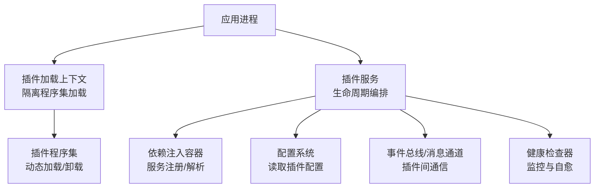
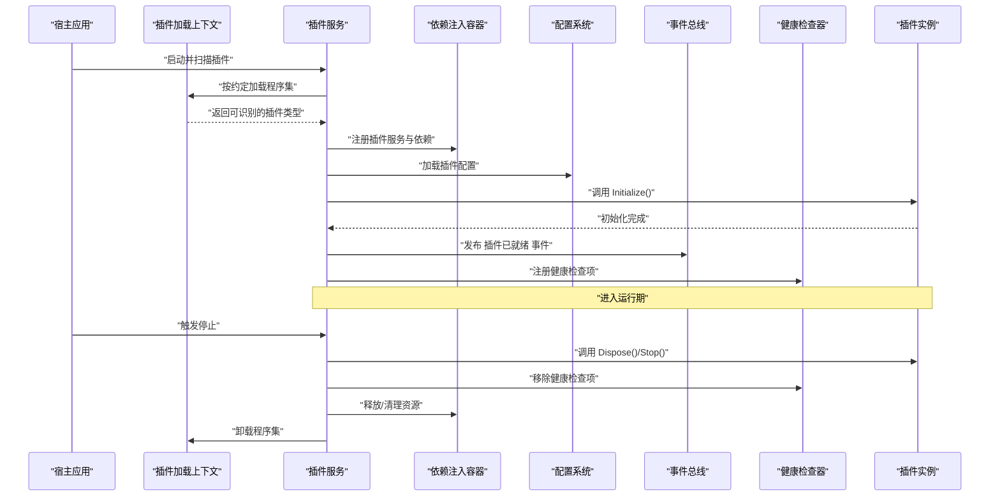
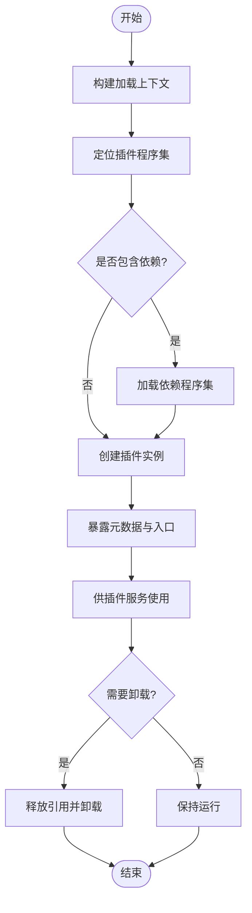
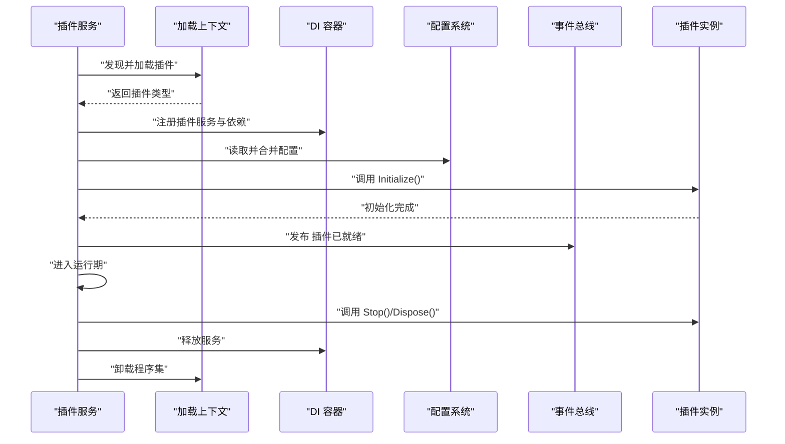
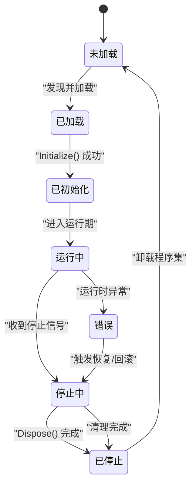
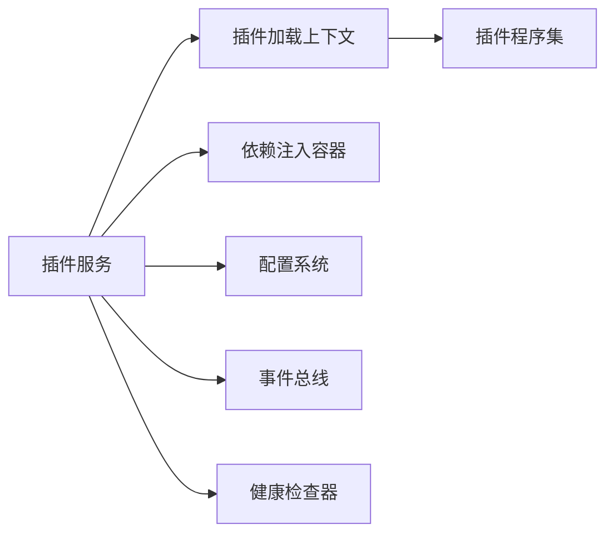

# 生命周期管理

<cite>
**本文引用的文件**   
- [PluginLoadContext.cs](file://PluginLoadContext.cs)
- [plugin_service.cs](file://plugin_service.cs)
- [netpro_plugin_service.cs](file://netpro_plugin_service.cs)
- [oqtane_plugin_service.cs](file://oqtane_plugin_service.cs)
</cite>

## 目录
1. [简介](#简介)
2. [项目结构](#项目结构)
3. [核心组件](#核心组件)
4. [架构总览](#架构总览)
5. [详细组件分析](#详细组件分析)
6. [依赖关系分析](#依赖关系分析)
7. [性能考量](#性能考量)
8. [故障排查指南](#故障排查指南)
9. [结论](#结论)
10. [附录](#附录)

## 简介
本文件围绕插件生命周期管理进行系统化说明，覆盖启动、初始化、运行与销毁四个阶段，并结合依赖注入容器集成、服务注册与配置加载顺序。文档还阐述插件状态管理、健康检查与故障恢复策略，以及插件间通信（事件订阅与消息传递）机制。通过流程图与序列图帮助读者快速理解关键流程与异常处理策略。

## 项目结构
仓库中包含多个与插件相关的实现示例，分别对应不同的宿主或框架风格：
- 自定义插件加载上下文：用于隔离程序集加载与卸载
- 通用插件服务：封装插件发现、生命周期控制与容器集成
- 基于特定框架的插件服务：如 Oqtane/NetPro 风格的插件服务

[此图为概念性结构示意，不直接映射具体源码文件]

## 核心组件
- 插件加载上下文：负责插件程序集的隔离加载、依赖解析与卸载边界，避免主进程污染与内存泄漏。
- 插件服务：统一编排插件的生命周期（启动、初始化、运行、销毁），协调 DI 容器与服务注册、配置加载、事件总线与健康检查。
- 框架适配插件服务：针对特定宿主（如 Oqtane/NetPro）提供约定式接口与扩展点，简化插件开发。

章节来源
- [PluginLoadContext.cs](file://PluginLoadContext.cs)
- [plugin_service.cs](file://plugin_service.cs)
- [netpro_plugin_service.cs](file://netpro_plugin_service.cs)
- [oqtane_plugin_service.cs](file://oqtane_plugin_service.cs)

## 架构总览
下图展示插件从发现到销毁的整体交互，包括 DI 容器、配置系统与事件总线的关键参与方。

图表来源
- [plugin_service.cs](file://plugin_service.cs)
- [PluginLoadContext.cs](file://PluginLoadContext.cs)

章节来源
- [plugin_service.cs](file://plugin_service.cs)
- [PluginLoadContext.cs](file://PluginLoadContext.cs)

## 详细组件分析

### 插件加载上下文（PluginLoadContext）
职责与要点
- 隔离加载：为每个插件创建独立的加载上下文，避免程序集版本冲突与全局污染。
- 依赖解析：按需解析插件及其依赖的程序集，支持延迟加载与按需卸载。
- 资源边界：确保插件对象在卸载时能被正确回收，防止内存泄漏。

典型流程
- 构建加载上下文
- 定位插件程序集
- 解析并加载依赖
- 暴露插件元数据与入口类型
- 卸载时释放引用

图表来源
- [PluginLoadContext.cs](file://PluginLoadContext.cs)

章节来源
- [PluginLoadContext.cs](file://PluginLoadContext.cs)

### 插件服务（PluginService）
职责与要点
- 生命周期编排：统一调度插件的启动、初始化、运行与销毁。
- DI 集成：在插件上下文中注册服务，支持作用域与单例策略。
- 配置加载：按优先级合并默认配置、环境配置与插件专属配置。
- 事件总线：发布/订阅插件生命周期事件，支持跨插件协作。
- 健康检查：为每个插件注册健康检查项，支持失败重试与降级。

生命周期序列

图表来源
- [plugin_service.cs](file://plugin_service.cs)

章节来源
- [plugin_service.cs](file://plugin_service.cs)

### 框架适配插件服务（Oqtane/NetPro 风格）
职责与要点
- 约定式接口：定义统一的插件接口与生命周期回调，降低接入成本。
- 宿主集成：与宿主框架的模块系统、路由、权限等能力对接。
- 扩展点：提供扩展点以注入中间件、过滤器、任务调度器等。

适用场景
- 面向 Web 应用的模块化扩展
- 多租户或多业务域的插件化部署

章节来源
- [oqtane_plugin_service.cs](file://oqtane_plugin_service.cs)
- [netpro_plugin_service.cs](file://netpro_plugin_service.cs)

### 插件生命周期状态机
状态与转换
- 未加载：尚未发现或加载
- 已加载：程序集已加载，类型可解析
- 已初始化：Initialize 成功执行
- 运行中：对外提供服务
- 停止中：正在执行 Stop/Dispose
- 已停止：完全释放资源
- 错误：出现异常，进入故障态

图表来源
- [plugin_service.cs](file://plugin_service.cs)

章节来源
- [plugin_service.cs](file://plugin_service.cs)

## 依赖关系分析
- 插件服务依赖加载上下文：用于隔离加载与卸载
- 插件服务依赖 DI 容器：用于服务注册与解析
- 插件服务依赖配置系统：用于读取与合并配置
- 插件服务依赖事件总线：用于插件间通信与生命周期广播
- 插件服务依赖健康检查器：用于监控与自愈

图表来源
- [plugin_service.cs](file://plugin_service.cs)
- [PluginLoadContext.cs](file://PluginLoadContext.cs)

章节来源
- [plugin_service.cs](file://plugin_service.cs)
- [PluginLoadContext.cs](file://PluginLoadContext.cs)

## 性能考量
- 延迟加载：仅在首次使用时加载插件，减少启动时间
- 批量初始化：对无依赖关系的插件并行初始化，缩短初始化耗时
- 缓存元数据：缓存插件类型与依赖图，避免重复反射
- 资源池化：对频繁创建的对象进行池化复用
- 异步化：I/O 与长耗时操作采用异步，避免阻塞主线程
- 卸载优化：及时释放引用，避免程序集无法卸载导致的内存泄漏

[本节为通用指导，不直接分析具体文件]

## 故障排查指南
常见问题与处理建议
- 插件无法加载
  - 检查程序集路径与依赖完整性
  - 确认加载上下文隔离策略是否正确
- 初始化失败
  - 查看 DI 容器中的服务注册是否完整
  - 核对配置项是否存在且格式正确
- 运行期异常
  - 启用健康检查与告警
  - 记录异常堆栈与上下文信息
- 无法卸载
  - 检查是否有静态引用或事件未解除订阅
  - 确保所有资源已释放

章节来源
- [plugin_service.cs](file://plugin_service.cs)
- [PluginLoadContext.cs](file://PluginLoadContext.cs)

## 结论
通过插件加载上下文与插件服务的协同，可实现稳定、可观测、可扩展的插件化体系。结合 DI 容器、配置系统与事件总线，能够清晰划分关注点，提升系统的可维护性与演进能力。配合健康检查与故障恢复策略，可在生产环境中保障高可用与弹性伸缩。

[本节为总结性内容，不直接分析具体文件]

## 附录
- 最佳实践
  - 明确插件边界与契约，避免强耦合
  - 使用只读配置与不可变对象，降低并发风险
  - 为每个插件提供独立日志与追踪标识
  - 设计幂等的初始化与销毁逻辑
- 参考实现
  - 自定义加载上下文：见 [PluginLoadContext.cs](file://PluginLoadContext.cs)
  - 通用插件服务：见 [plugin_service.cs](file://plugin_service.cs)
  - 框架适配服务：见 [oqtane_plugin_service.cs](file://oqtane_plugin_service.cs)、[netpro_plugin_service.cs](file://netpro_plugin_service.cs)