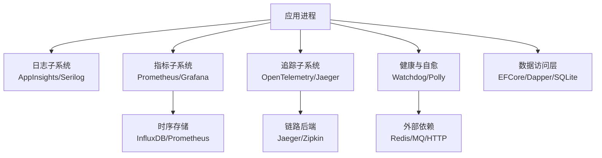
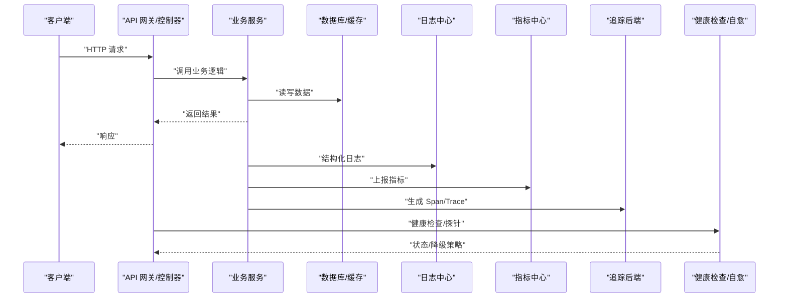
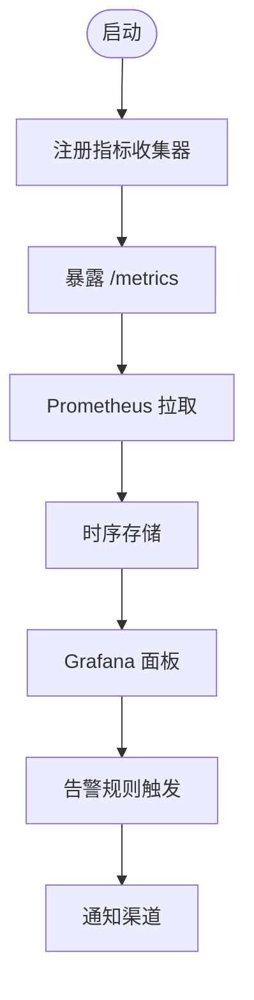
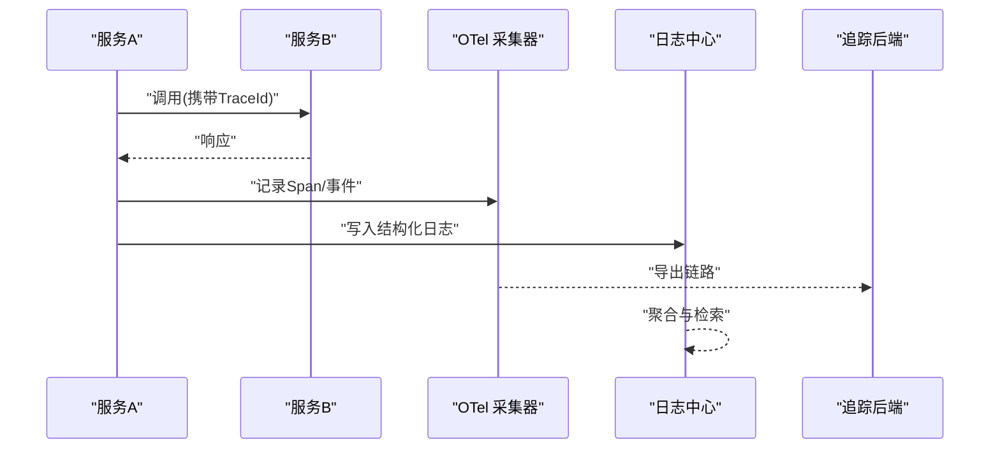
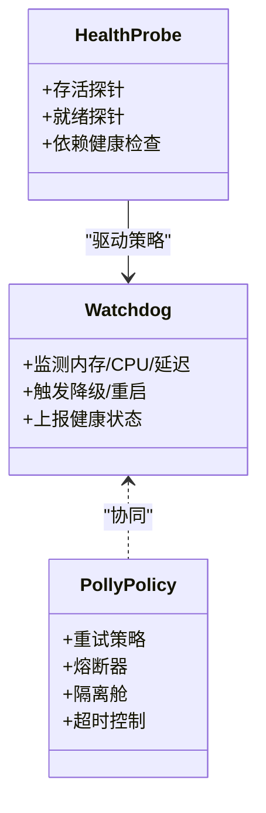
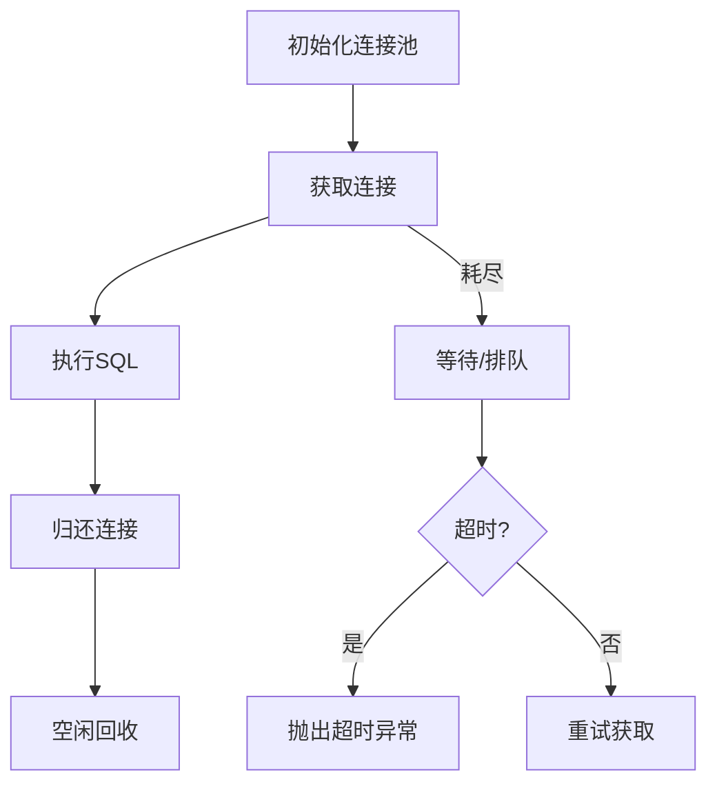
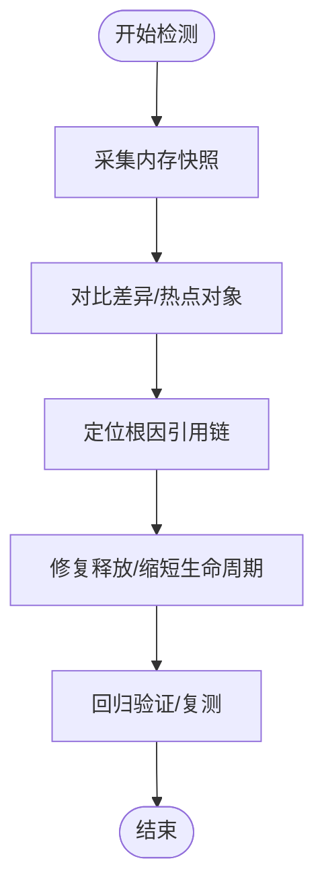
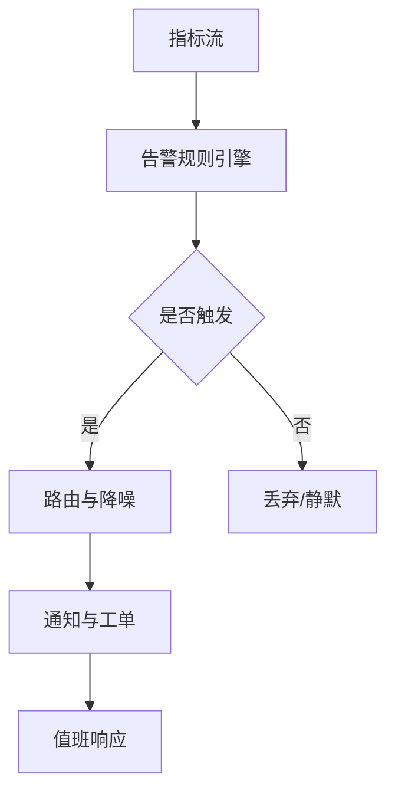
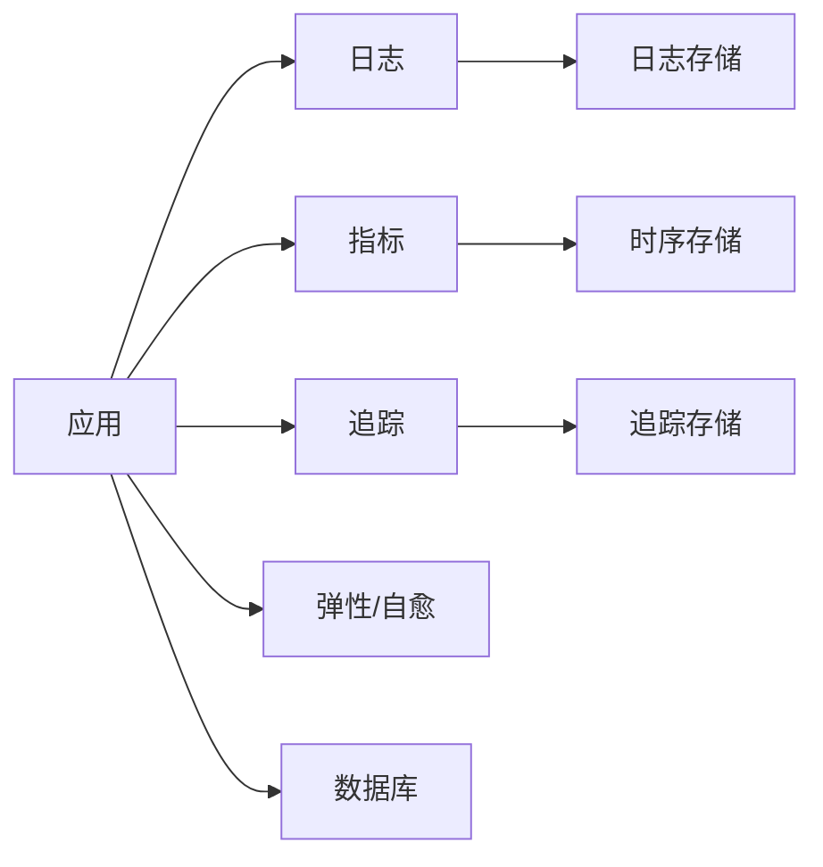

# 故障排查指南

<cite>
**本文引用的文件**   
- [memory_leak_detection.cs](file://memory_leak_detection.cs)
- [performance_metrics.cs](file://performance_metrics.cs)
- [metrics_monitoring.cs](file://metrics_monitoring.cs)
- [appinsights_logging.cs](file://appinsights_logging.cs)
- [prometheus_integration.cs](file://prometheus_integration.cs)
- [grafana_integration.cs](file://grafana_integration.cs)
- [alert_rules.cs](file://alert_rules.cs)
- [watchdog_alert_rules.cs](file://watchdog_alert_rules.cs)
- [watchdog_memory.cs](file://watchdog_memory.cs)
- [watchdog_pipeline.cs](file://watchdog_pipeline.cs)
- [watchdog_distributed_tracing.cs](file://watchdog_distributed_tracing.cs)
- [opentelemetry_integration.cs](file://opentelemetry_integration.cs)
- [opentelemetry_production.cs](file://opentelemetry_production.cs)
- [signalr_advanced_monitoring.cs](file://signalr_advanced_monitoring.cs)
- [sqlite_connection_pool.cs](file://sqlite_connection_pool.cs)
- [database_backup_service.cs](file://database_backup_service.cs)
- [resilient_polly_integration.cs](file://resilient_polly_integration.cs)
- [http_resilience_integration.cs](file://http_resilience_integration.cs)
- [appsettings.json](file://appsettings.json)
</cite>

## 目录
1. [简介](#简介)
2. [项目结构](#项目结构)
3. [核心组件](#核心组件)
4. [架构总览](#架构总览)
5. [详细组件分析](#详细组件分析)
6. [依赖关系分析](#依赖关系分析)
7. [性能注意事项](#性能注意事项)
8. [故障排查指南](#故障排查指南)
9. [结论](#结论)
10. [附录](#附录)

## 简介
本指南面向生产与研发人员，提供系统化的故障排查方法与实践。内容覆盖常见问题的诊断、日志分析技巧、性能瓶颈定位、内存泄漏检测、调试工具使用、堆栈跟踪分析、线程问题排查、数据库连接问题处理，以及监控系统配置、告警规则设置和应急响应流程。文档同时给出典型故障案例与解决方案，帮助快速恢复服务并降低复发风险。

## 项目结构
本项目包含大量可插拔的集成示例与能力模块，涉及监控、日志、追踪、指标、缓存、消息队列、数据库、HTTP 客户端弹性等。针对故障排查，重点关注的目录与文件包括：
- 监控与指标：Prometheus、Grafana、App Insights、OpenTelemetry、自定义指标采集
- 日志与追踪：结构化日志、分布式追踪、链路采样与导出
- 健康检查与自愈：Watchdog、Polly 重试/熔断、限流与退避
- 数据库与连接池：SQLite 连接池、备份服务
- 配置与环境：应用配置、运行时开关

[本图为概念性结构图，不直接映射具体源码文件]

## 核心组件
- 指标与监控
  - Prometheus 集成与指标暴露
  - Grafana 可视化面板与告警联动
  - App Insights 遥测与日志聚合
  - OpenTelemetry 统一追踪与日志关联
- 健康检查与自愈
  - Watchdog 监控管道（内存、延迟、流水线）
  - Polly 重试、熔断、隔离与超时
  - HTTP 客户端弹性策略
- 日志与追踪
  - 结构化日志输出与分级
  - 分布式链路追踪与采样
- 数据与连接
  - SQLite 连接池优化与监控
  - 数据库备份与恢复
- 配置管理
  - appsettings.json 环境化配置
  - 动态开关与特性标志

**章节来源**
- [prometheus_integration.cs](file://prometheus_integration.cs)
- [grafana_integration.cs](file://grafana_integration.cs)
- [appinsights_logging.cs](file://appinsights_logging.cs)
- [opentelemetry_integration.cs](file://opentelemetry_integration.cs)
- [opentelemetry_production.cs](file://opentelemetry_production.cs)
- [watchdog_memory.cs](file://watchdog_memory.cs)
- [watchdog_pipeline.cs](file://watchdog_pipeline.cs)
- [resilient_polly_integration.cs](file://resilient_polly_integration.cs)
- [http_resilience_integration.cs](file://http_resilience_integration.cs)
- [sqlite_connection_pool.cs](file://sqlite_connection_pool.cs)
- [database_backup_service.cs](file://database_backup_service.cs)
- [appsettings.json](file://appsettings.json)

## 架构总览
下图展示从请求入口到监控、日志、追踪与健康自愈的整体交互。

**图表来源**
- [appinsights_logging.cs](file://appinsights_logging.cs)
- [prometheus_integration.cs](file://prometheus_integration.cs)
- [opentelemetry_integration.cs](file://opentelemetry_integration.cs)
- [watchdog_memory.cs](file://watchdog_memory.cs)
- [resilient_polly_integration.cs](file://resilient_polly_integration.cs)

## 详细组件分析

### 指标与监控（Prometheus + Grafana）
- 指标采集与暴露
  - 通过中间件或 SDK 暴露 /metrics 端点
  - 关键指标：请求速率、错误率、延迟分位、GC 统计、线程池、连接池
- 可视化与告警
  - Grafana 面板聚合多源指标
  - 基于阈值与趋势的告警规则
- 最佳实践
  - 合理标签维度，避免高基数
  - 指标命名规范与版本兼容
  - 采样与降采样策略

**章节来源**
- [prometheus_integration.cs](file://prometheus_integration.cs)
- [grafana_integration.cs](file://grafana_integration.cs)
- [metrics_monitoring.cs](file://metrics_monitoring.cs)

### 日志与追踪（App Insights + OpenTelemetry）
- 结构化日志
  - 按级别输出，包含上下文（TraceId、SpanId、租户、用户）
  - 敏感信息脱敏与采样
- 分布式追踪
  - 跨服务传播 TraceId
  - 关键路径埋点与耗时统计
- 关联分析
  - 日志与追踪 ID 关联
  - 异常堆栈自动上报

**章节来源**
- [appinsights_logging.cs](file://appinsights_logging.cs)
- [opentelemetry_integration.cs](file://opentelemetry_integration.cs)
- [opentelemetry_production.cs](file://opentelemetry_production.cs)

### 健康检查与自愈（Watchdog + Polly）
- Watchdog
  - 内存、CPU、延迟、队列长度等监控
  - 自动重启/降级/隔离策略
- Polly
  - 重试、熔断、隔离、超时、回退
  - 指数退避与抖动
- 适用场景
  - 下游不稳定、瞬时故障、资源争用

**图表来源**
- [watchdog_memory.cs](file://watchdog_memory.cs)
- [watchdog_pipeline.cs](file://watchdog_pipeline.cs)
- [resilient_polly_integration.cs](file://resilient_polly_integration.cs)
- [http_resilience_integration.cs](file://http_resilience_integration.cs)

**章节来源**
- [watchdog_memory.cs](file://watchdog_memory.cs)
- [watchdog_pipeline.cs](file://watchdog_pipeline.cs)
- [resilient_polly_integration.cs](file://resilient_polly_integration.cs)
- [http_resilience_integration.cs](file://http_resilience_integration.cs)

### 数据库连接与备份（SQLite 连接池 + 备份服务）
- 连接池
  - 最大连接数、超时、空闲回收
  - 慢查询与锁等待监控
- 备份与恢复
  - 定时快照、增量备份
  - 校验与演练恢复
- 常见问题
  - 连接耗尽、死锁、磁盘 IO 瓶颈

**图表来源**
- [sqlite_connection_pool.cs](file://sqlite_connection_pool.cs)
- [database_backup_service.cs](file://database_backup_service.cs)

**章节来源**
- [sqlite_connection_pool.cs](file://sqlite_connection_pool.cs)
- [database_backup_service.cs](file://database_backup_service.cs)

### 内存泄漏检测与性能剖析
- 内存泄漏检测
  - 定期快照对比、对象生命周期追踪
  - 热点分配与 GC 压力分析
- 性能剖析
  - CPU 火焰图、热点方法定位
  - 异步任务与线程池饥饿排查
- 优化建议
  - 减少临时分配、复用缓冲
  - 合理使用缓存与对象池

**章节来源**
- [memory_leak_detection.cs](file://memory_leak_detection.cs)
- [performance_metrics.cs](file://performance_metrics.cs)

### 告警规则与监控配置
- 告警规则
  - 错误率、延迟 P95/P99、饱和度、资源水位
  - 多条件组合与抑制去重
- 监控配置
  - 采集频率、保留周期、采样率
  - 标签规范化与权限控制
- 通知与应急
  - 多渠道通知（邮件、短信、IM）
  - 升级路径与值班轮转

**章节来源**
- [alert_rules.cs](file://alert_rules.cs)
- [watchdog_alert_rules.cs](file://watchdog_alert_rules.cs)
- [grafana_integration.cs](file://grafana_integration.cs)

## 依赖关系分析
- 松耦合设计
  - 各子系统通过接口与配置解耦
  - 中间件式扩展点便于替换与升级
- 外部依赖
  - 时序数据库、日志平台、追踪后端
  - 消息队列与缓存
- 潜在风险
  - 循环依赖、强耦合模块
  - 第三方库版本冲突

[本图为概念性依赖图，不直接映射具体源码文件]

## 性能注意事项
- 指标与日志开销
  - 控制日志级别与采样率
  - 指标维度精简，避免高基数
- 异步与并发
  - 避免阻塞调用，合理设置超时
  - 线程池大小与背压策略
- 缓存与对象池
  - 命中率与过期策略
  - 容量上限与淘汰算法
- 数据库与 IO
  - 连接池参数调优
  - 批量操作与分页策略

[本节为通用指导，不直接分析具体文件]

## 故障排查指南

### 常见问题与诊断方法
- 服务不可用
  - 检查健康探针与依赖状态
  - 查看错误日志与异常堆栈
  - 确认资源水位（CPU/内存/连接）
- 响应缓慢
  - 追踪端到端延迟与热点方法
  - 分析慢 SQL 与锁等待
  - 检查 GC 停顿与线程池饱和
- 内存持续增长
  - 抓取堆快照并对比
  - 定位未释放引用与长生命周期对象
  - 评估缓存与对象池配置
- 数据库连接异常
  - 连接池耗尽、超时、死锁
  - 网络抖动与认证失败
  - 备份与恢复演练

**章节来源**
- [sqlite_connection_pool.cs](file://sqlite_connection_pool.cs)
- [database_backup_service.cs](file://database_backup_service.cs)
- [memory_leak_detection.cs](file://memory_leak_detection.cs)
- [performance_metrics.cs](file://performance_metrics.cs)

### 日志分析技巧
- 结构化字段
  - TraceId/SpanId、级别、时间戳、服务名、租户
- 过滤与聚合
  - 按错误码、异常类型、耗时区间筛选
  - 关联上下游日志进行归因
- 脱敏与安全
  - 敏感字段掩码与白名单
  - 审计日志留存策略

**章节来源**
- [appinsights_logging.cs](file://appinsights_logging.cs)
- [opentelemetry_integration.cs](file://opentelemetry_integration.cs)

### 性能瓶颈定位
- 指标观察
  - QPS、错误率、P95/P99、吞吐
  - GC 次数、堆大小、线程数
- 追踪分析
  - 热点链路、外部依赖耗时
  - 序列化/反序列化与 IO 瓶颈
- 剖析工具
  - CPU 火焰图、Allocation 热点
  - 异步任务与锁竞争

**章节来源**
- [prometheus_integration.cs](file://prometheus_integration.cs)
- [opentelemetry_production.cs](file://opentelemetry_production.cs)
- [performance_metrics.cs](file://performance_metrics.cs)

### 内存泄漏检测
- 步骤
  - 采集快照与基线对比
  - 识别增长对象与引用链
  - 修复后回归验证
- 工具
  - 内置检测器与第三方剖析器
  - 自动化巡检与告警

**章节来源**
- [memory_leak_detection.cs](file://memory_leak_detection.cs)

### 调试工具使用
- 本地调试
  - 断点、变量监视、日志级别切换
  - 模拟外部依赖（Mock/Stub）
- 远程诊断
  - 热更新与 Dump 抓取
  - 在线 Profiling 与采样

[本节为通用指导，不直接分析具体文件]

### 堆栈跟踪分析
- 关键点
  - 异常类型与消息
  - 调用链与最近变更
  - 并发相关（竞态、死锁）
- 技巧
  - 最小化复现场景
  - 结合指标与追踪缩小范围

**章节来源**
- [appinsights_logging.cs](file://appinsights_logging.cs)
- [opentelemetry_integration.cs](file://opentelemetry_integration.cs)

### 线程问题排查
- 症状
  - 卡顿、超时、CPU 飙升
  - 线程池饥饿、死锁
- 方法
  - 线程快照与锁等待分析
  - 异步代码审查与超时设置

**章节来源**
- [performance_metrics.cs](file://performance_metrics.cs)
- [resilient_polly_integration.cs](file://resilient_polly_integration.cs)

### 数据库连接问题
- 现象
  - 连接超时、拒绝连接、死锁
  - 慢查询导致拥塞
- 措施
  - 调整连接池参数与超时
  - 优化 SQL 与索引
  - 启用重试与熔断

**章节来源**
- [sqlite_connection_pool.cs](file://sqlite_connection_pool.cs)
- [database_backup_service.cs](file://database_backup_service.cs)
- [resilient_polly_integration.cs](file://resilient_polly_integration.cs)

### 监控系统配置
- 采集
  - 指标端点、日志采集、追踪采样
- 存储
  - 保留策略、压缩与归档
- 可视化
  - 面板模板与共享
  - 权限与多租户隔离

**章节来源**
- [prometheus_integration.cs](file://prometheus_integration.cs)
- [grafana_integration.cs](file://grafana_integration.cs)
- [opentelemetry_production.cs](file://opentelemetry_production.cs)

### 告警规则设置
- 原则
  - 明确阈值与持续时间
  - 降噪与抑制，避免告警风暴
- 分类
  - 可用性、性能、容量、安全
- 联动
  - 自动扩缩容、熔断、降级

**章节来源**
- [alert_rules.cs](file://alert_rules.cs)
- [watchdog_alert_rules.cs](file://watchdog_alert_rules.cs)

### 应急响应流程
- 发现与分级
  - 监控告警、用户反馈、巡检
- 处置与恢复
  - 回滚、隔离、扩容、降级
- 复盘与改进
  - 根因分析、预案完善、演练

[本节为通用流程，不直接分析具体文件]

### 典型故障案例与解决方案
- 案例一：内存泄漏导致 OOM
  - 现象：服务周期性崩溃，内存持续上升
  - 排查：快照对比、对象生命周期分析
  - 解决：修复未释放引用，限制缓存大小
- 案例二：数据库连接池耗尽
  - 现象：大量超时与连接拒绝
  - 排查：连接池监控、慢查询定位
  - 解决：增大池大小、优化 SQL、增加重试
- 案例三：下游服务抖动引发雪崩
  - 现象：级联超时与错误率飙升
  - 排查：追踪链路、指标趋势
  - 解决：熔断、隔离、退避与回退

[本节为通用案例，不直接分析具体文件]

## 结论
通过完善的监控、日志、追踪与健康自愈体系，配合系统的故障排查方法与应急预案，可以显著提升系统的可观测性与稳定性。建议在开发阶段即引入指标与追踪，在生产环境建立告警与演练机制，持续优化性能与可靠性。

## 附录
- 常用命令与脚本
  - 指标拉取、日志导出、Dump 抓取
- 参考链接
  - 监控平台文档、告警规则模板、最佳实践清单

[本节为补充信息，不直接分析具体文件]