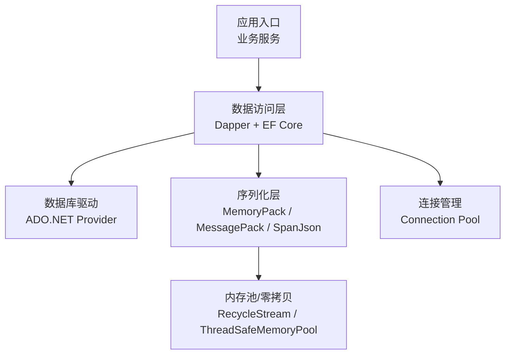
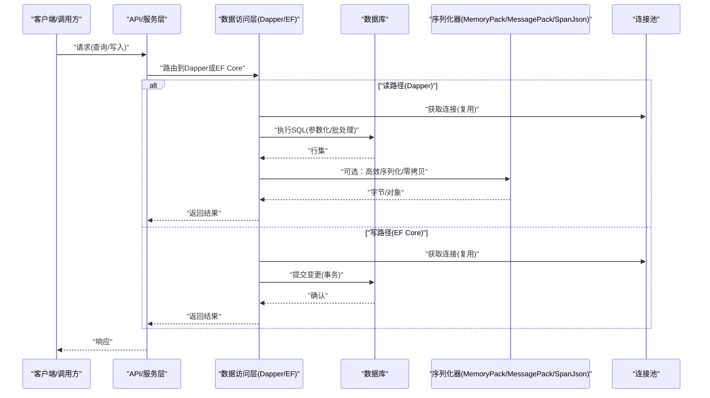
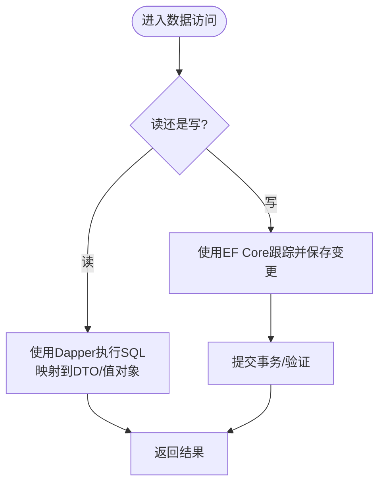
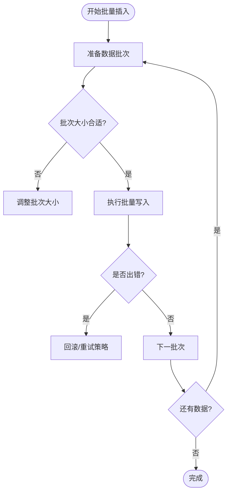
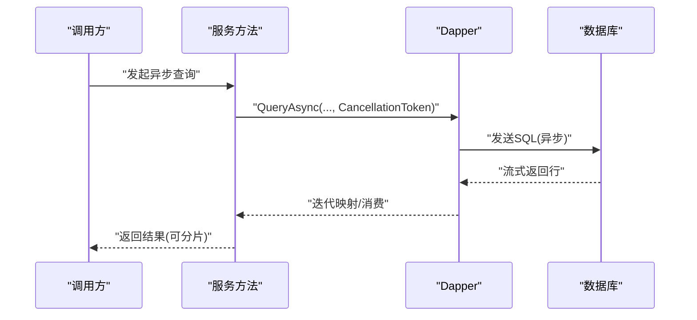
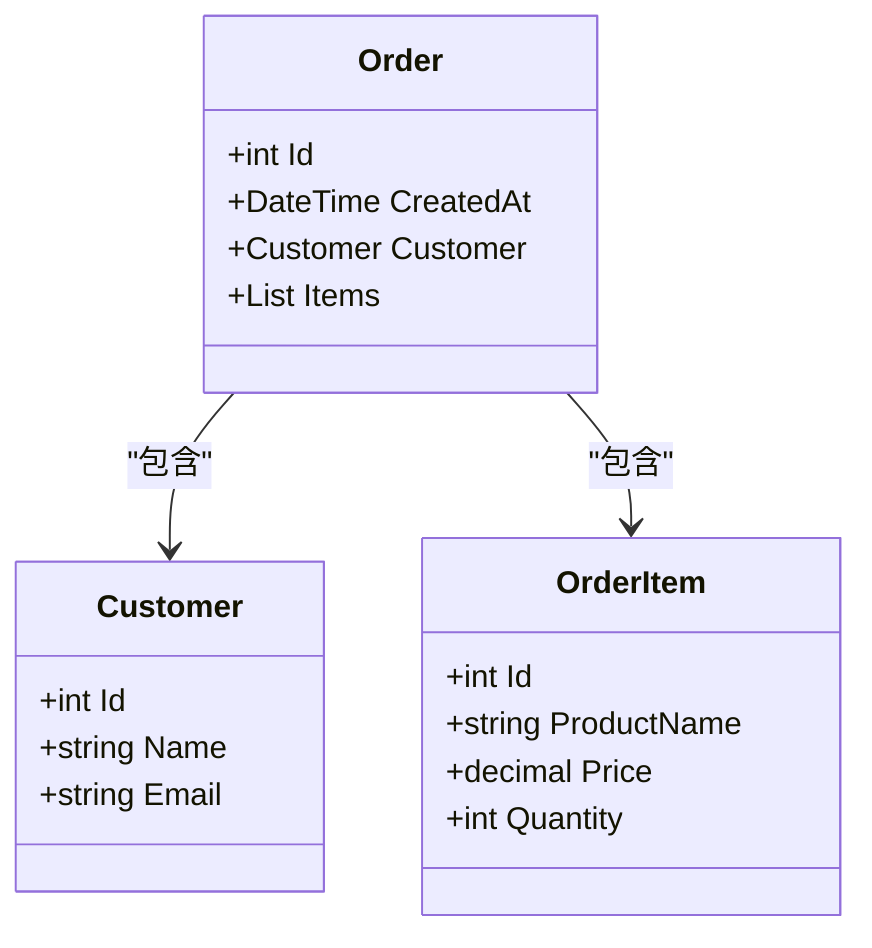
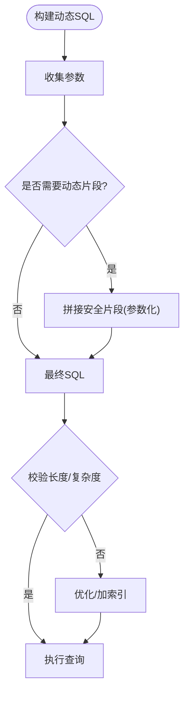
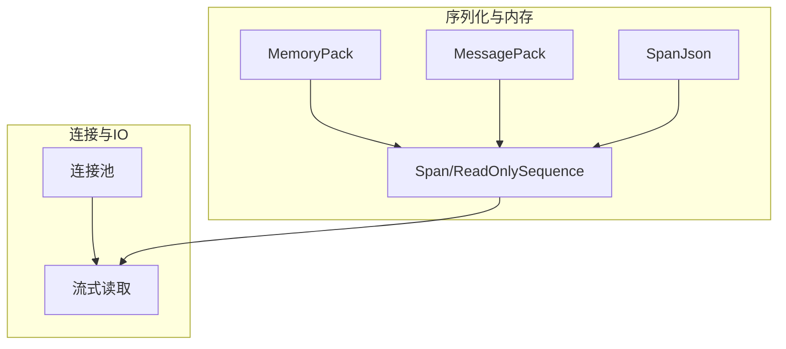
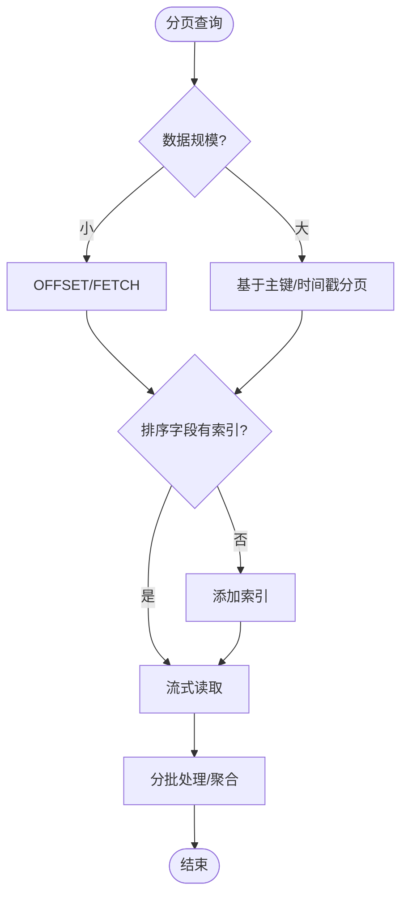
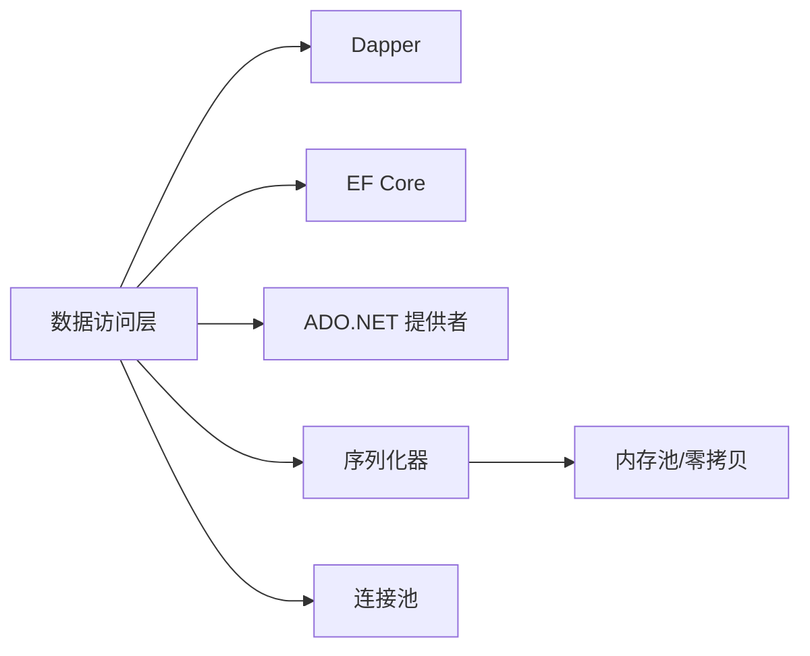

# Dapper高性能查询

<cite>
**本文引用的文件**   
- [efcore_dapper_integration.cs](file://efcore_dapper_integration.cs)
- [performance_metrics.cs](file://performance_metrics.cs)
- [high_frequency_10m.cs](file://high_frequency_10m.cs)
- [high_frequency_100k.cs](file://high_frequency_100k.cs)
- [high_frequency_1m.cs](file://high_frequency_1m.cs)
- [sqlite_connection_pool.cs](file://sqlite_connection_pool.cs)
- [recyclable_memorystream_integration.cs](file://recyclable_memorystream_integration.cs)
- [threadsafememorypool_serializer.cs](file://threadsafememorypool_serializer.cs)
- [zero_copy_serializer.cs](file://zero_copy_serializer.cs)
- [spanjson_serializer.cs](file://spanjson_serializer.cs)
- [inproc_messagepack_serializer.cs](file://inproc_messagepack_serializer.cs)
- [shared_memory_messagepack.cs](file://shared_memory_messagepack.cs)
- [memorypack_demo.cs](file://memorypack_demo.cs)
</cite>

## 目录
1. [简介](#简介)
2. [项目结构](#项目结构)
3. [核心组件](#核心组件)
4. [架构总览](#架构总览)
5. [详细组件分析](#详细组件分析)
6. [依赖关系分析](#依赖关系分析)
7. [性能考量](#性能考量)
8. [故障排查指南](#故障排查指南)
9. [结论](#结论)
10. [附录](#附录)

## 简介
本文件面向需要在.NET中实现“极致I/O与序列化性能”的开发者，聚焦Dapper作为轻量级ORM在高并发、大数据量场景下的最佳实践。内容涵盖：
- Dapper的设计理念与适用边界（低开销映射、手写SQL、避免过度抽象）
- 批量插入、异步查询、多映射（Multi-Mapping）与动态SQL构建的实践要点
- 高频数据处理的优化技巧：连接复用、内存池、零拷贝/低分配序列化
- 与EF Core混合使用模式及性能对比思路
- 大数据量处理、分页查询与复杂对象映射的实际案例

## 项目结构
仓库包含大量集成示例与性能演示代码。与Dapper相关的高价值素材主要集中在以下文件：
- efcore_dapper_integration.cs：展示Dapper与EF Core在同一应用中的协作方式
- performance_metrics.cs：提供性能指标采集与对比的基础能力
- high_frequency_*.cs：不同吞吐目标下的高频写入/读取基准与优化策略
- sqlite_connection_pool.cs：连接池与连接复用的参考实现
- recyclable_memorystream_integration.cs、threadsafememorypool_serializer.cs、zero_copy_serializer.cs、spanjson_serializer.cs、inproc_messagepack_serializer.cs、shared_memory_messagepack.cs、memorypack_demo.cs：围绕低分配/零拷贝/共享内存/快速序列化的多种方案

图表来源
- [efcore_dapper_integration.cs](file://efcore_dapper_integration.cs)
- [performance_metrics.cs](file://performance_metrics.cs)
- [high_frequency_10m.cs](file://high_frequency_10m.cs)
- [sqlite_connection_pool.cs](file://sqlite_connection_pool.cs)
- [recyclable_memorystream_integration.cs](file://recyclable_memorystream_integration.cs)
- [threadsafememorypool_serializer.cs](file://threadsafememorypool_serializer.cs)
- [zero_copy_serializer.cs](file://zero_copy_serializer.cs)
- [spanjson_serializer.cs](file://spanjson_serializer.cs)
- [inproc_messagepack_serializer.cs](file://inproc_messagepack_serializer.cs)
- [shared_memory_messagepack.cs](file://shared_memory_messagepack.cs)
- [memorypack_demo.cs](file://memorypack_demo.cs)

章节来源
- [efcore_dapper_integration.cs](file://efcore_dapper_integration.cs)
- [performance_metrics.cs](file://performance_metrics.cs)
- [high_frequency_10m.cs](file://high_frequency_10m.cs)
- [high_frequency_100k.cs](file://high_frequency_100k.cs)
- [high_frequency_1m.cs](file://high_frequency_1m.cs)
- [sqlite_connection_pool.cs](file://sqlite_connection_pool.cs)
- [recyclable_memorystream_integration.cs](file://recyclable_memorystream_integration.cs)
- [threadsafememorypool_serializer.cs](file://threadsafememorypool_serializer.cs)
- [zero_copy_serializer.cs](file://zero_copy_serializer.cs)
- [spanjson_serializer.cs](file://spanjson_serializer.cs)
- [inproc_messagepack_serializer.cs](file://inproc_messagepack_serializer.cs)
- [shared_memory_messagepack.cs](file://shared_memory_messagepack.cs)
- [memorypack_demo.cs](file://memorypack_demo.cs)

## 核心组件
- Dapper数据访问层
  - 职责：以最小反射/IL生成代价将行集映射到实体或匿名类型；支持多映射、异步、事务、命令参数化
  - 关键点：尽量使用强类型映射、避免在热路径上频繁创建对象、合理拆分查询减少反序列化成本
- 序列化与内存优化
  - 职责：在热点路径采用低分配/零拷贝序列化，降低GC压力
  - 关键点：优先选择MemoryPack/MessagePack/SpanJson等高性能库；结合Span<T>/ReadOnlySequence<T>进行零拷贝解析
- 连接与资源管理
  - 职责：连接池复用、命令复用、流式读取
  - 关键点：长生命周期连接池、避免频繁Open/Close；对大结果集使用流式读取
- 与EF Core协同
  - 职责：读多写少或复杂报表用Dapper，领域建模与变更追踪用EF Core
  - 关键点：明确边界，避免混用导致的事务/上下文不一致

章节来源
- [efcore_dapper_integration.cs](file://efcore_dapper_integration.cs)
- [performance_metrics.cs](file://performance_metrics.cs)
- [high_frequency_10m.cs](file://high_frequency_10m.cs)
- [high_frequency_100k.cs](file://high_frequency_100k.cs)
- [high_frequency_1m.cs](file://high_frequency_1m.cs)
- [sqlite_connection_pool.cs](file://sqlite_connection_pool.cs)
- [recyclable_memorystream_integration.cs](file://recyclable_memorystream_integration.cs)
- [threadsafememorypool_serializer.cs](file://threadsafememorypool_serializer.cs)
- [zero_copy_serializer.cs](file://zero_copy_serializer.cs)
- [spanjson_serializer.cs](file://spanjson_serializer.cs)
- [inproc_messagepack_serializer.cs](file://inproc_messagepack_serializer.cs)
- [shared_memory_messagepack.cs](file://shared_memory_messagepack.cs)
- [memorypack_demo.cs](file://memorypack_demo.cs)

## 架构总览
下图展示了Dapper与EF Core在同一应用中的分层与交互，以及序列化与连接管理的配合方式。

图表来源
- [efcore_dapper_integration.cs](file://efcore_dapper_integration.cs)
- [performance_metrics.cs](file://performance_metrics.cs)
- [high_frequency_10m.cs](file://high_frequency_10m.cs)
- [sqlite_connection_pool.cs](file://sqlite_connection_pool.cs)
- [recyclable_memorystream_integration.cs](file://recyclable_memorystream_integration.cs)
- [threadsafememorypool_serializer.cs](file://threadsafememorypool_serializer.cs)
- [zero_copy_serializer.cs](file://zero_copy_serializer.cs)
- [spanjson_serializer.cs](file://spanjson_serializer.cs)
- [inproc_messagepack_serializer.cs](file://inproc_messagepack_serializer.cs)
- [shared_memory_messagepack.cs](file://shared_memory_messagepack.cs)
- [memorypack_demo.cs](file://memorypack_demo.cs)

## 详细组件分析

### Dapper与EF Core混合使用模式
- 设计原则
  - 读多写少、复杂报表/聚合：优先Dapper
  - 领域建模、变更追踪、复杂关系维护：优先EF Core
  - 通过接口隔离数据访问，便于按场景切换实现
- 典型流程
  - 查询：Dapper直接映射到DTO/值对象，避免EF跟踪开销
  - 写入：EF Core负责一致性、审计、事件发布
  - 事务：跨仓储时通过外部事务协调，避免混用导致的隐式行为

图表来源
- [efcore_dapper_integration.cs](file://efcore_dapper_integration.cs)

章节来源
- [efcore_dapper_integration.cs](file://efcore_dapper_integration.cs)

### 批量插入最佳实践
- 关键要点
  - 使用批量插入API（如SqlBulkCopy或Provider提供的批量扩展），避免逐条Insert
  - 控制批次大小（例如500~5000），平衡内存占用与网络往返
  - 关闭不必要的触发器/索引更新，必要时临时禁用再重建
  - 使用结构化参数或表值参数（TVP）提升效率
- 常见陷阱
  - 大批次导致内存峰值过高
  - 未设置超时导致长时间阻塞
  - 未处理部分失败的回滚策略

图表来源
- [high_frequency_10m.cs](file://high_frequency_10m.cs)
- [high_frequency_100k.cs](file://high_frequency_100k.cs)
- [high_frequency_1m.cs](file://high_frequency_1m.cs)

章节来源
- [high_frequency_10m.cs](file://high_frequency_10m.cs)
- [high_frequency_100k.cs](file://high_frequency_100k.cs)
- [high_frequency_1m.cs](file://high_frequency_1m.cs)

### 异步查询与流式读取
- 关键要点
  - 使用异步API（ExecuteAsync/QueryAsync）避免线程阻塞
  - 对大结果集使用流式读取（如DataReader/流式映射），避免一次性加载到内存
  - 合理设置CommandTimeout，避免长查询挂起
- 注意事项
  - 避免在异步回调中同步阻塞（如.Wait()）
  - 注意取消令牌的使用，及时释放资源

图表来源
- [performance_metrics.cs](file://performance_metrics.cs)
- [high_frequency_10m.cs](file://high_frequency_10m.cs)

章节来源
- [performance_metrics.cs](file://performance_metrics.cs)
- [high_frequency_10m.cs](file://high_frequency_10m.cs)

### 多映射支持与复杂对象映射
- 关键要点
  - 使用SplitOn指定主键分割点，将多个表映射到单个对象图
  - 对于深层嵌套对象，考虑拆分为多次查询+内存组装，减少冗余列
  - 对只读视图/DTO使用更轻量的映射，避免构造复杂对象
- 建议
  - 为常用多映射建立专用DTO，减少运行时判断
  - 缓存映射委托（Dapper内部已缓存，但自定义映射需避免重复创建）

图表来源
- [efcore_dapper_integration.cs](file://efcore_dapper_integration.cs)

章节来源
- [efcore_dapper_integration.cs](file://efcore_dapper_integration.cs)

### 动态SQL构建
- 关键要点
  - 使用参数化查询防止注入，避免字符串拼接用户输入
  - 借助表达式树或查询构建器生成WHERE/ORDER BY片段
  - 对分页使用OFFSET/FETCH或数据库特定语法，避免全表扫描
- 建议
  - 将动态片段集中管理，便于测试与审计
  - 对热点SQL做执行计划分析与索引优化

图表来源
- [performance_metrics.cs](file://performance_metrics.cs)

章节来源
- [performance_metrics.cs](file://performance_metrics.cs)

### 高频率数据处理优化：内存池、零拷贝与连接复用
- 内存池与零拷贝
  - 使用MemoryPool/ArrayPool减少分配与GC压力
  - 采用Span<T>/ReadOnlySequence<T>进行零拷贝解析
  - 选择MemoryPack/MessagePack/SpanJson等高性能序列化器
- 连接复用
  - 使用连接池，避免频繁Open/Close
  - 对SQLite等嵌入式数据库，确保单进程内连接复用与并发限制
- 流式处理
  - 对大对象/大结果集使用流式读写，避免内存峰值

图表来源
- [recyclable_memorystream_integration.cs](file://recyclable_memorystream_integration.cs)
- [threadsafememorypool_serializer.cs](file://threadsafememorypool_serializer.cs)
- [zero_copy_serializer.cs](file://zero_copy_serializer.cs)
- [spanjson_serializer.cs](file://spanjson_serializer.cs)
- [inproc_messagepack_serializer.cs](file://inproc_messagepack_serializer.cs)
- [shared_memory_messagepack.cs](file://shared_memory_messagepack.cs)
- [memorypack_demo.cs](file://memorypack_demo.cs)
- [sqlite_connection_pool.cs](file://sqlite_connection_pool.cs)

章节来源
- [recyclable_memorystream_integration.cs](file://recyclable_memorystream_integration.cs)
- [threadsafememorypool_serializer.cs](file://threadsafememorypool_serializer.cs)
- [zero_copy_serializer.cs](file://zero_copy_serializer.cs)
- [spanjson_serializer.cs](file://spanjson_serializer.cs)
- [inproc_messagepack_serializer.cs](file://inproc_messagepack_serializer.cs)
- [shared_memory_messagepack.cs](file://shared_memory_messagepack.cs)
- [memorypack_demo.cs](file://memorypack_demo.cs)
- [sqlite_connection_pool.cs](file://sqlite_connection_pool.cs)

### 大数据量处理与分页查询
- 分页策略
  - 使用基于游标/主键的分页（Keyset Pagination）替代OFFSET，避免深分页性能问题
  - 对排序字段建立合适索引，避免文件排序
- 大数据读取
  - 流式读取+分批处理，避免一次性加载
  - 合并小文件/小记录，减少元数据开销
- 写入优化
  - 批量写入+事务分组，控制批次大小
  - 预分配缓冲区，减少扩容开销

图表来源
- [performance_metrics.cs](file://performance_metrics.cs)
- [high_frequency_10m.cs](file://high_frequency_10m.cs)

章节来源
- [performance_metrics.cs](file://performance_metrics.cs)
- [high_frequency_10m.cs](file://high_frequency_10m.cs)

## 依赖关系分析
- 组件耦合
  - 数据访问层依赖ADO.NET提供者与Dapper扩展
  - 序列化层与内存池/零拷贝技术栈解耦，便于替换
  - 连接池与具体数据库驱动解耦，便于迁移
- 外部依赖
  - 高性能序列化库（MemoryPack/MessagePack/SpanJson）
  - 连接池与数据库驱动（如SQLite/MySQL/PostgreSQL）
- 潜在循环依赖
  - 通过接口隔离避免DAL与上层逻辑的直接耦合

图表来源
- [efcore_dapper_integration.cs](file://efcore_dapper_integration.cs)
- [performance_metrics.cs](file://performance_metrics.cs)
- [high_frequency_10m.cs](file://high_frequency_10m.cs)
- [sqlite_connection_pool.cs](file://sqlite_connection_pool.cs)
- [recyclable_memorystream_integration.cs](file://recyclable_memorystream_integration.cs)
- [threadsafememorypool_serializer.cs](file://threadsafememorypool_serializer.cs)
- [zero_copy_serializer.cs](file://zero_copy_serializer.cs)
- [spanjson_serializer.cs](file://spanjson_serializer.cs)
- [inproc_messagepack_serializer.cs](file://inproc_messagepack_serializer.cs)
- [shared_memory_messagepack.cs](file://shared_memory_messagepack.cs)
- [memorypack_demo.cs](file://memorypack_demo.cs)

章节来源
- [efcore_dapper_integration.cs](file://efcore_dapper_integration.cs)
- [performance_metrics.cs](file://performance_metrics.cs)
- [high_frequency_10m.cs](file://high_frequency_10m.cs)
- [sqlite_connection_pool.cs](file://sqlite_connection_pool.cs)
- [recyclable_memorystream_integration.cs](file://recyclable_memorystream_integration.cs)
- [threadsafememorypool_serializer.cs](file://threadsafememorypool_serializer.cs)
- [zero_copy_serializer.cs](file://zero_copy_serializer.cs)
- [spanjson_serializer.cs](file://spanjson_serializer.cs)
- [inproc_messagepack_serializer.cs](file://inproc_messagepack_serializer.cs)
- [shared_memory_messagepack.cs](file://shared_memory_messagepack.cs)
- [memorypack_demo.cs](file://memorypack_demo.cs)

## 性能考量
- 连接与事务
  - 复用连接、缩短事务范围、避免长事务锁
  - 对写操作使用批量事务，减少网络往返
- 序列化与内存
  - 优先零拷贝/低分配序列化，减少GC停顿
  - 使用内存池与Span<T>避免频繁分配
- I/O与CPU
  - 流式读取大结果集，避免内存峰值
  - 合理索引与执行计划优化，减少CPU与磁盘IO
- 监控与基准
  - 使用性能指标采集工具定位瓶颈
  - 针对不同吞吐目标（1m/100k/10m）进行压测与调优

[本节为通用指导，不直接分析具体文件]

## 故障排查指南
- 常见问题
  - 连接泄漏：检查Open/Close配对与using语句
  - 内存暴涨：排查一次性加载大结果集或未释放的流
  - GC停顿：减少热点路径上的对象分配，改用池化/零拷贝
  - 慢查询：分析执行计划、补充索引、改写SQL
- 调试手段
  - 启用SQL日志与执行计划分析
  - 使用性能计数器与Profiler定位热点
  - 针对高频路径编写微基准测试

章节来源
- [performance_metrics.cs](file://performance_metrics.cs)
- [high_frequency_10m.cs](file://high_frequency_10m.cs)
- [high_frequency_100k.cs](file://high_frequency_100k.cs)
- [high_frequency_1m.cs](file://high_frequency_1m.cs)

## 结论
Dapper以其极简映射与极低的运行时开销，成为高吞吐数据访问的首选。结合EF Core的领域建模优势，可以在同一应用中发挥各自长处。通过批量写入、异步流式读取、多映射优化、动态SQL构建以及高性能序列化与连接复用，可在大数据量与高频场景下获得稳定且优异的性能表现。建议在关键路径引入完善的性能监控与基准测试，持续优化。

[本节为总结性内容，不直接分析具体文件]

## 附录
- 推荐实践清单
  - 读路径：Dapper + DTO/值对象 + 流式读取
  - 写路径：EF Core + 批量事务 + 审计/事件
  - 序列化：MemoryPack/MessagePack/SpanJson + Span<T>
  - 连接：连接池 + 短事务 + 超时控制
  - 分页：Keyset分页 + 索引优化
  - 监控：指标采集 + 基准测试 + 执行计划分析

[本节为补充信息，不直接分析具体文件]