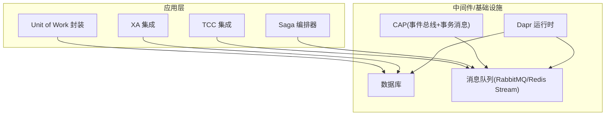
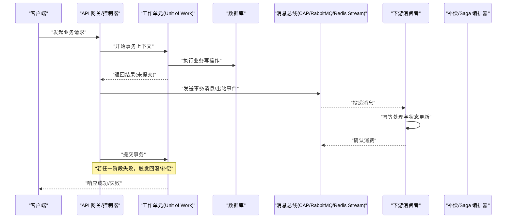
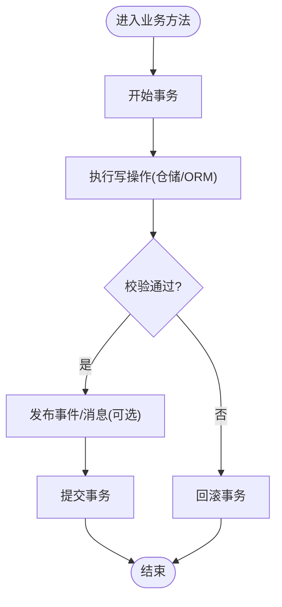
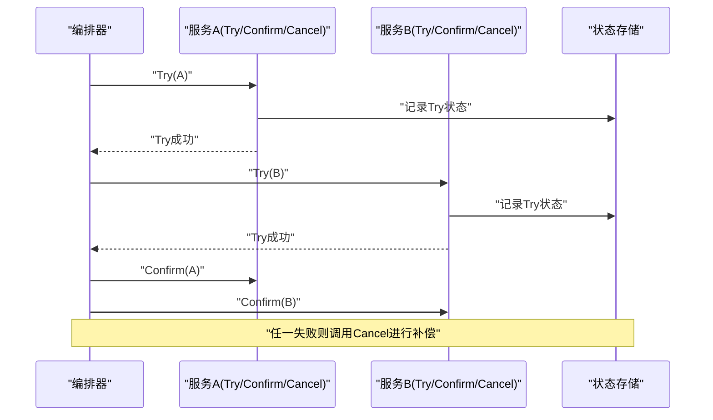
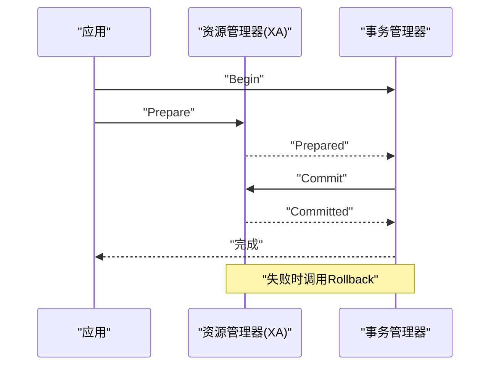
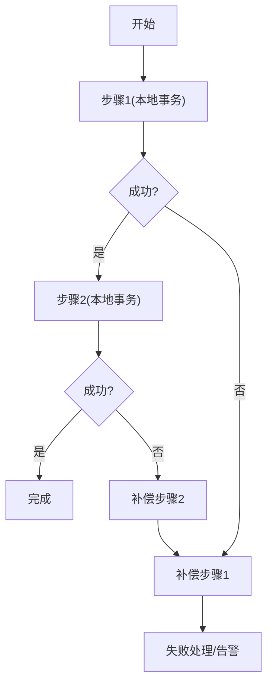
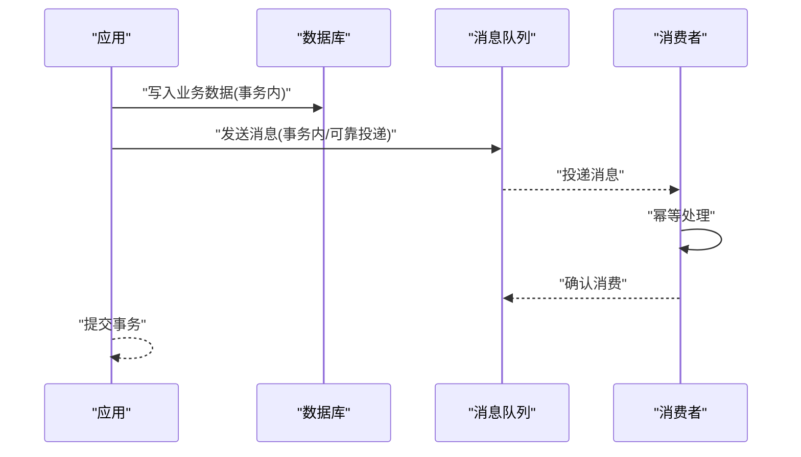
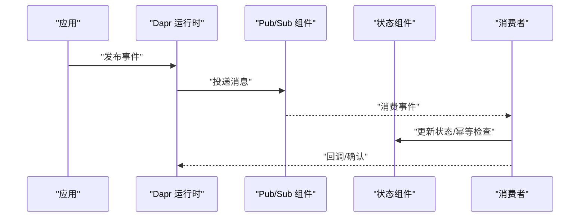
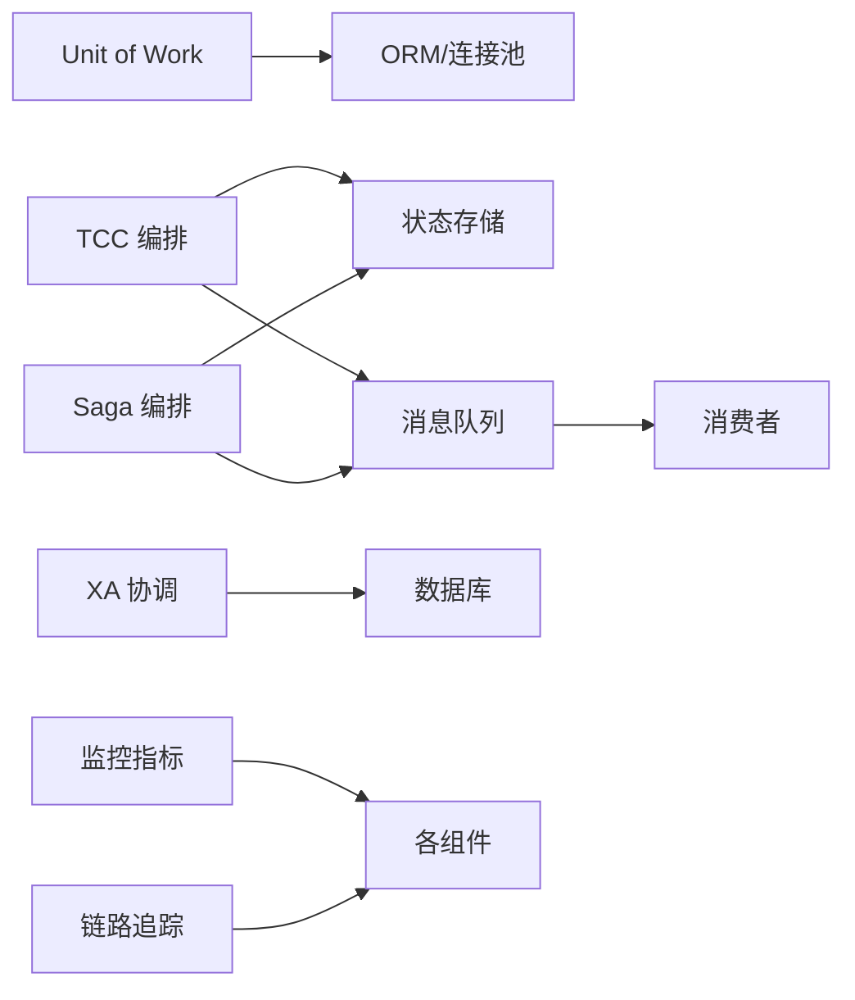

# 事务管理

<cite>
**本文引用的文件**   
- [distributed_transaction.cs](file://distributed_transaction.cs)
- [unitofwork_integration.cs](file://unitofwork_integration.cs)
- [message_persistence.cs](file://message_persistence.cs)
- [saga_orchestrator.cs](file://saga_orchestrator.cs)
- [mediatr_tcc_integration.cs](file://mediatr_tcc_integration.cs)
- [mediatr_xa_integration.cs](file://mediatr_xa_integration.cs)
- [wolverinefx_tcc_integration.cs](file://wolverinefx_tcc_integration.cs)
- [wolverinefx_xa_integration.cs](file://wolverinefx_xa_integration.cs)
- [dapr_integration.cs](file://dapr_integration.cs)
- [cap_redis_integration.cs](file://cap_redis_integration.cs)
- [rabbitmq_production_integration.cs](file://rabbitmq_production_integration.cs)
- [redis_stream_integration.cs](file://redis_stream_integration.cs)
- [dead_letter.cs](file://dead_letter.cs)
- [metrics_monitoring.cs](file://metrics_monitoring.cs)
- [tracing_extension.cs](file://tracing_extension.cs)
</cite>

## 目录
1. [简介](#简介)
2. [项目结构](#项目结构)
3. [核心组件](#核心组件)
4. [架构总览](#架构总览)
5. [详细组件分析](#详细组件分析)
6. [依赖关系分析](#依赖关系分析)
7. [性能考量](#性能考量)
8. [故障排查指南](#故障排查指南)
9. [结论](#结论)
10. [附录](#附录)

## 简介
本文件围绕本地事务与分布式事务的实现原理、使用场景与最佳实践，系统阐述 Unit of Work 模式的应用，并给出跨服务事务协调、补偿机制与最终一致性方案。同时覆盖事务边界划分、隔离级别选择、死锁预防策略，以及分布式事务的性能影响、监控指标与故障恢复机制。最后说明消息持久化与事务的结合使用模式，帮助读者在复杂系统中构建高可靠的事务能力。

## 项目结构
仓库中包含多个与事务相关的示例与集成实现，涵盖：
- 本地事务与 Unit of Work 封装
- 分布式事务（TCC、XA）与编排器（Saga）
- 基于消息队列的最终一致性方案（RabbitMQ、Redis Stream、CAP）
- 与 Dapr 的分布式事务集成
- 死信队列、监控与追踪

[无图表来源，因为该图为概念性结构示意]

## 核心组件
- 本地事务与 Unit of Work
  - 通过统一的工作单元抽象，将同一业务操作内的多次数据访问纳入单一事务边界，确保原子性与一致性。
  - 典型职责：开启/提交/回滚事务、资源生命周期管理、仓储协作、异常处理与重试策略。
- 分布式事务协调
  - TCC：Try-Confirm-Cancel 三阶段，强调幂等与补偿，适用于对性能敏感且可设计预留资源的场景。
  - XA：两阶段提交协议，强一致但开销较大，适合跨多数据源或外部系统的强一致需求。
  - Saga：长事务分解为一系列本地事务与补偿动作，保证最终一致性，适合跨服务编排。
- 消息驱动的最终一致性
  - 以“事务性消息”或“出队即持久化”的模式，将业务变更与消息发布绑定，消费者按幂等消费，达成最终一致。
  - 常见实现：RabbitMQ 事务消息、Redis Stream 事务、CAP 事务消息、Dapr 发布订阅。
- 监控与可观测性
  - 指标：事务耗时、成功率、失败率、重试次数、死信数、补偿执行次数、消息积压等。
  - 追踪：跨服务链路追踪，定位慢点与失败根因。

**章节来源**
- [unitofwork_integration.cs](file://unitofwork_integration.cs)
- [mediatr_tcc_integration.cs](file://mediatr_tcc_integration.cs)
- [mediatr_xa_integration.cs](file://mediatr_xa_integration.cs)
- [wolverinefx_tcc_integration.cs](file://wolverinefx_tcc_integration.cs)
- [wolverinefx_xa_integration.cs](file://wolverinefx_xa_integration.cs)
- [saga_orchestrator.cs](file://saga_orchestrator.cs)
- [cap_redis_integration.cs](file://cap_redis_integration.cs)
- [rabbitmq_production_integration.cs](file://rabbitmq_production_integration.cs)
- [redis_stream_integration.cs](file://redis_stream_integration.cs)
- [dapr_integration.cs](file://dapr_integration.cs)
- [metrics_monitoring.cs](file://metrics_monitoring.cs)
- [tracing_extension.cs](file://tracing_extension.cs)

## 架构总览
下图展示从请求入口到数据落库与消息发布的整体事务流程，包括本地事务、分布式协调与最终一致性路径。

**图表来源**
- [unitofwork_integration.cs](file://unitofwork_integration.cs)
- [cap_redis_integration.cs](file://cap_redis_integration.cs)
- [rabbitmq_production_integration.cs](file://rabbitmq_production_integration.cs)
- [redis_stream_integration.cs](file://redis_stream_integration.cs)
- [saga_orchestrator.cs](file://saga_orchestrator.cs)

## 详细组件分析

### 本地事务与 Unit of Work 模式
- 目标
  - 将一次业务操作内所有数据访问纳入同一事务边界，避免部分成功导致的脏读/不一致。
- 关键设计
  - 统一的 Begin/Commit/Rollback 接口；仓储层透明接入；异常捕获与自动回滚；可选的重试与超时控制。
  - 与 ORM/连接池集成，确保连接复用与事务传播语义清晰。
- 适用场景
  - 单服务内多表/多仓储写入；需要强一致性的聚合根操作。
- 最佳实践
  - 明确事务边界，避免长事务；尽量缩小锁范围；合理设置隔离级别；对幂等写进行去重。
- 复杂度与性能
  - 时间复杂度主要取决于 SQL 执行与锁竞争；空间复杂度与事务缓存/快照相关。
  - 建议配合连接池、批量操作与索引优化降低锁等待与 IO 开销。

**图表来源**
- [unitofwork_integration.cs](file://unitofwork_integration.cs)

**章节来源**
- [unitofwork_integration.cs](file://unitofwork_integration.cs)

### 分布式事务：TCC 模式
- 目标
  - 在不修改现有业务逻辑的前提下，通过预留资源与补偿实现跨服务的一致性。
- 关键设计
  - Try 阶段预留资源并记录状态；Confirm 阶段提交；Cancel 阶段释放资源。
  - 幂等性保障、状态机管理与重试策略。
- 适用场景
  - 支付、库存扣减、订单创建等需要强一致且可设计预留操作的领域。
- 最佳实践
  - 严格幂等；补偿逻辑与正向逻辑对称；失败快速失败与退避重试；监控与告警。
- 复杂度与性能
  - 网络往返增加延迟；需考虑幂等键设计与状态存储开销。

**图表来源**
- [mediatr_tcc_integration.cs](file://mediatr_tcc_integration.cs)
- [wolverinefx_tcc_integration.cs](file://wolverinefx_tcc_integration.cs)
- [saga_orchestrator.cs](file://saga_orchestrator.cs)

**章节来源**
- [mediatr_tcc_integration.cs](file://mediatr_tcc_integration.cs)
- [wolverinefx_tcc_integration.cs](file://wolverinefx_tcc_integration.cs)
- [saga_orchestrator.cs](file://saga_orchestrator.cs)

### 分布式事务：XA 模式
- 目标
  - 通过两阶段提交协议，确保跨数据源/外部系统的强一致。
- 关键设计
  - Prepare 阶段预提交；Commit 阶段真正提交；失败时回滚。
  - 需要支持 XA 的资源管理器（数据库、消息中间件）。
- 适用场景
  - 跨数据库、跨消息队列的强一致写入；对一致性要求极高且可接受较高延迟的场景。
- 最佳实践
  - 最小化参与方数量；缩短事务时间；避免跨进程长事务；监控 prepare/commit 耗时。
- 复杂度与性能
  - 阻塞式协议，锁持有时间长，吞吐受限；需评估可用性风险。

**图表来源**
- [mediatr_xa_integration.cs](file://mediatr_xa_integration.cs)
- [wolverinefx_xa_integration.cs](file://wolverinefx_xa_integration.cs)

**章节来源**
- [mediatr_xa_integration.cs](file://mediatr_xa_integration.cs)
- [wolverinefx_xa_integration.cs](file://wolverinefx_xa_integration.cs)

### Saga 编排与补偿
- 目标
  - 将长事务拆分为多个本地事务步骤，并通过补偿动作保证最终一致性。
- 关键设计
  - 正向步骤与补偿步骤成对定义；编排器维护状态机；失败触发补偿链。
  - 幂等消费与状态持久化是关键。
- 适用场景
  - 跨服务业务流程编排；允许短暂不一致但最终一致的领域。
- 最佳实践
  - 补偿逻辑必须幂等；编排状态持久化；重试与死信处理；可视化追踪。

**图表来源**
- [saga_orchestrator.cs](file://saga_orchestrator.cs)

**章节来源**
- [saga_orchestrator.cs](file://saga_orchestrator.cs)

### 消息持久化与事务结合
- 目标
  - 将业务写与消息发布绑定，确保“要么都成功，要么都失败”，实现最终一致性。
- 关键设计
  - 事务性消息：在数据库事务内写入消息表/队列，异步提交；或采用“先写库再发消息”的可靠投递模式。
  - 消费者幂等：基于唯一键去重；重复消费安全。
- 适用场景
  - 跨服务解耦、异步处理、削峰填谷；允许最终一致的业务。
- 最佳实践
  - 消息表与业务表同事务；出队即持久化；重试与死信；监控积压与延迟。

**图表来源**
- [cap_redis_integration.cs](file://cap_redis_integration.cs)
- [rabbitmq_production_integration.cs](file://rabbitmq_production_integration.cs)
- [redis_stream_integration.cs](file://redis_stream_integration.cs)
- [message_persistence.cs](file://message_persistence.cs)

**章节来源**
- [cap_redis_integration.cs](file://cap_redis_integration.cs)
- [rabbitmq_production_integration.cs](file://rabbitmq_production_integration.cs)
- [redis_stream_integration.cs](file://redis_stream_integration.cs)
- [message_persistence.cs](file://message_persistence.cs)

### 与 Dapr 的分布式事务集成
- 目标
  - 借助 Dapr 的发布订阅与状态管理，简化跨服务事务协调。
- 关键设计
  - 使用 Dapr Pub/Sub 发送事务消息；状态组件保存 Saga/TCC 状态；回调编排补偿。
- 适用场景
  - 微服务架构中，希望以声明式方式实现事件驱动与最终一致性。
- 最佳实践
  - 幂等键与去重；重试策略；监控与追踪；与容器编排集成。

**图表来源**
- [dapr_integration.cs](file://dapr_integration.cs)

**章节来源**
- [dapr_integration.cs](file://dapr_integration.cs)

## 依赖关系分析
- 组件耦合
  - Unit of Work 与 ORM/连接池紧密耦合；分布式协调组件与消息中间件/状态组件耦合。
- 直接依赖
  - TCC/XA 编排器依赖状态存储与消息总线；Saga 编排器依赖持久化与重试机制。
- 间接依赖
  - 监控与追踪贯穿各组件，提供可观测性；死信队列作为失败兜底。
- 潜在循环依赖
  - 应避免编排器与消费者之间的循环调用，通过事件与状态机解耦。

**图表来源**
- [unitofwork_integration.cs](file://unitofwork_integration.cs)
- [mediatr_tcc_integration.cs](file://mediatr_tcc_integration.cs)
- [mediatr_xa_integration.cs](file://mediatr_xa_integration.cs)
- [saga_orchestrator.cs](file://saga_orchestrator.cs)
- [metrics_monitoring.cs](file://metrics_monitoring.cs)
- [tracing_extension.cs](file://tracing_extension.cs)

**章节来源**
- [unitofwork_integration.cs](file://unitofwork_integration.cs)
- [mediatr_tcc_integration.cs](file://mediatr_tcc_integration.cs)
- [mediatr_xa_integration.cs](file://mediatr_xa_integration.cs)
- [saga_orchestrator.cs](file://saga_orchestrator.cs)
- [metrics_monitoring.cs](file://metrics_monitoring.cs)
- [tracing_extension.cs](file://tracing_extension.cs)

## 性能考量
- 本地事务
  - 减少锁粒度与持有时间；合理使用索引与批处理；避免大事务与长查询。
- 分布式事务
  - TCC：预留资源与幂等检查带来额外开销；需优化状态存储与网络往返。
  - XA：两阶段提交阻塞性强，吞吐低；仅在高一致需求下使用。
  - Saga：异步编排提升吞吐，但需关注补偿链路与重试风暴。
- 消息驱动
  - 事务性消息会增加写放大；需平衡可靠性与延迟；监控积压与消费速率。
- 监控指标建议
  - 事务耗时分布、成功率/失败率、重试次数、死信数、补偿执行次数、消息积压、消费者滞后。
- 可观测性
  - 全链路追踪；关键节点埋点；错误码与原因分类；告警阈值设定。

[本节为通用指导，不直接分析具体文件]

## 故障排查指南
- 常见问题
  - 事务超时：检查慢查询、锁竞争、网络延迟。
  - 死锁：分析锁顺序、事务大小与并发度；调整隔离级别与索引。
  - 消息丢失/重复：确认幂等键与去重逻辑；检查消费者确认与重试策略。
  - 补偿风暴：限制重试频率与退避策略；引入熔断与降级。
- 诊断工具
  - 指标采集与可视化；链路追踪定位失败点；日志与审计记录。
- 恢复策略
  - 死信队列人工介入；补偿任务重放；状态修复脚本；灰度回滚。

**章节来源**
- [dead_letter.cs](file://dead_letter.cs)
- [metrics_monitoring.cs](file://metrics_monitoring.cs)
- [tracing_extension.cs](file://tracing_extension.cs)

## 结论
在本仓库中，事务管理覆盖了从本地 Unit of Work 到分布式 TCC/XA/Saga 的全栈方案，并结合消息驱动实现最终一致性。通过合理的边界划分、隔离级别选择与死锁预防，可在保证一致性的同时兼顾性能与可观测性。建议根据业务特性选择合适的协调模式，并建立完善的监控与恢复机制，确保系统在复杂环境下稳定运行。

[本节为总结性内容，不直接分析具体文件]

## 附录
- 术语
  - 事务边界：一次业务操作内所有数据访问的集合。
  - 隔离级别：读未提交、读已提交、可重复读、串行化。
  - 幂等：同一操作多次执行结果一致。
  - 最终一致性：系统在足够长时间后达到一致状态。
- 参考实践
  - 优先使用本地事务与消息驱动；仅在必要时引入分布式事务；持续优化与监控。

[本节为补充信息，不直接分析具体文件]