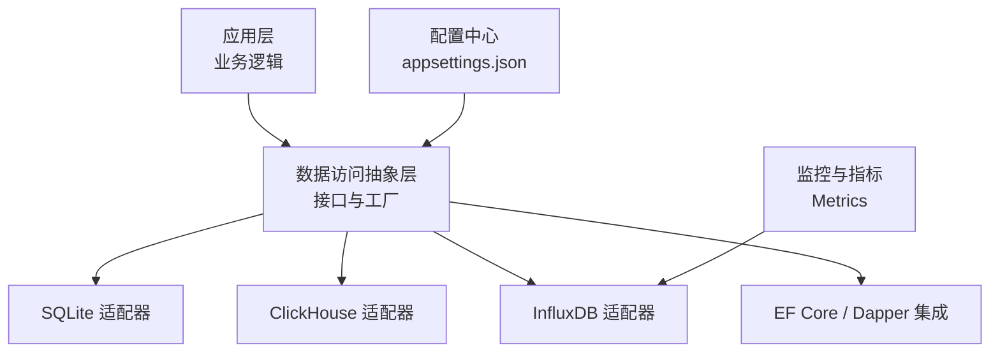
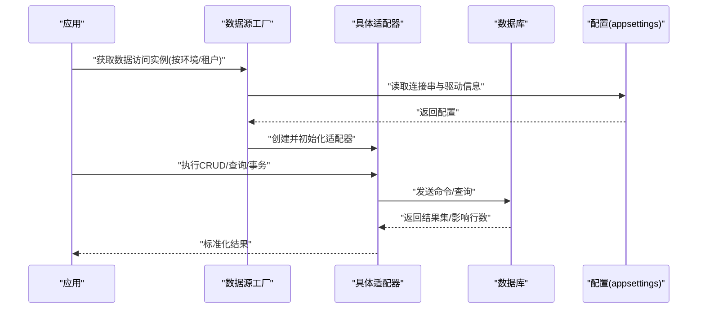
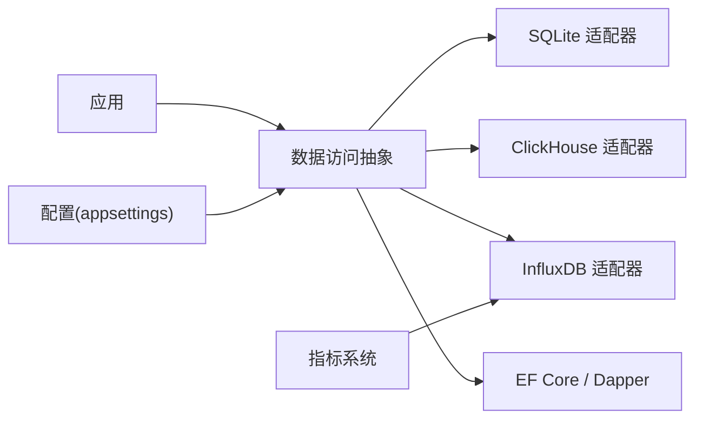

# 多数据库支持

<cite>
**本文引用的文件**   
- [clickhouse_integration.cs](file://clickhouse_integration.cs)
- [influxdb_integration.cs](file://influxdb_integration.cs)
- [sqlite_integration.cs](file://sqlite_integration.cs)
- [metrics_influxdb.cs](file://metrics_influxdb.cs)
- [efcore9_integration.cs](file://efcore9_integration.cs)
- [efcore_dapper_integration.cs](file://efcore_dapper_integration.cs)
- [database_backup_service.cs](file://database_backup_service.cs)
- [mysql_to_sqlite_litedb_sync.cs](file://mysql_to_sqlite_litedb_sync.cs)
- [appsettings.json](file://appsettings.json)
</cite>

## 目录
1. [简介](#简介)
2. [项目结构](#项目结构)
3. [核心组件](#核心组件)
4. [架构总览](#架构总览)
5. [详细组件分析](#详细组件分析)
6. [依赖关系分析](#依赖关系分析)
7. [性能考虑](#性能考虑)
8. [故障排查指南](#故障排查指南)
9. [结论](#结论)
10. [附录](#附录)

## 简介
本文件面向需要在同一项目中同时支持多种数据库后端的开发者，提供基于现有代码库的多数据库支持方案与最佳实践。内容覆盖：
- 抽象层设计与数据访问接口定义
- SQLite、ClickHouse、InfluxDB 等后端的具体适配
- 数据库切换配置、连接字符串管理与驱动注册机制
- 数据同步、迁移策略与兼容性处理
- 不同数据库的特性适配、数据类型映射与查询语法差异处理

## 项目结构
仓库采用“按能力/集成”划分的扁平化组织方式，数据库相关实现以独立文件形式存在，便于按需启用与组合。关键位置包括：
- 各数据库的集成示例与适配器：如 SQLite、ClickHouse、InfluxDB
- EF Core 与 Dapper 的集成示例，用于统一 ORM/微ORM 访问
- 备份服务与跨库同步脚本，支撑迁移与一致性保障
- 应用配置（如 appsettings.json）集中管理连接串与运行时开关

图表来源 
- [sqlite_integration.cs](file://sqlite_integration.cs)
- [clickhouse_integration.cs](file://clickhouse_integration.cs)
- [influxdb_integration.cs](file://influxdb_integration.cs)
- [efcore9_integration.cs](file://efcore9_integration.cs)
- [efcore_dapper_integration.cs](file://efcore_dapper_integration.cs)
- [metrics_influxdb.cs](file://metrics_influxdb.cs)
- [appsettings.json](file://appsettings.json)

章节来源
- [sqlite_integration.cs](file://sqlite_integration.cs)
- [clickhouse_integration.cs](file://clickhouse_integration.cs)
- [influxdb_integration.cs](file://influxdb_integration.cs)
- [efcore9_integration.cs](file://efcore9_integration.cs)
- [efcore_dapper_integration.cs](file://efcore_dapper_integration.cs)
- [metrics_influxdb.cs](file://metrics_influxdb.cs)
- [appsettings.json](file://appsettings.json)

## 核心组件
为实现多数据库支持，建议采用以下分层与模式：
- 数据访问抽象层
  - 定义统一的仓储/上下文接口，屏蔽底层数据库差异
  - 提供类型映射、分页、事务、批量写入等通用能力
- 具体适配器
  - 针对每种数据库实现上述接口，封装连接、命令、结果集转换
- 工厂与注册
  - 根据配置动态选择并注册具体实现
- 配置与连接管理
  - 集中管理连接字符串、超时、重试、池化参数
- 迁移与同步
  - 使用迁移脚本或工具进行结构变更
  - 通过同步任务保证多库一致性

章节来源
- [efcore9_integration.cs](file://efcore9_integration.cs)
- [efcore_dapper_integration.cs](file://efcore_dapper_integration.cs)
- [sqlite_integration.cs](file://sqlite_integration.cs)
- [clickhouse_integration.cs](file://clickhouse_integration.cs)
- [influxdb_integration.cs](file://influxdb_integration.cs)

## 架构总览
下图展示从应用层到多数据库适配器的整体交互流程，以及配置注入与驱动注册的关键路径。

图表来源 
- [appsettings.json](file://appsettings.json)
- [sqlite_integration.cs](file://sqlite_integration.cs)
- [clickhouse_integration.cs](file://clickhouse_integration.cs)
- [influxdb_integration.cs](file://influxdb_integration.cs)

## 详细组件分析

### SQLite 适配器
- 适用场景：嵌入式、单机、轻量级读写
- 特性要点：
  - 单文件存储，适合本地缓存与离线运行
  - 并发写受限，需合理控制连接数与事务粒度
  - 数据类型相对简单，注意时间与时区处理
- 典型用法：
  - 通过连接字符串指定文件路径
  - 结合 EF Core/Dapper 进行模型映射与查询
  - 批量写入时建议使用事务与分块提交

章节来源
- [sqlite_integration.cs](file://sqlite_integration.cs)
- [efcore9_integration.cs](file://efcore9_integration.cs)
- [efcore_dapper_integration.cs](file://efcore_dapper_integration.cs)

### ClickHouse 适配器
- 适用场景：OLAP 分析、时序与日志聚合、高吞吐写入
- 特性要点：
  - 列式存储，适合聚合查询与范围扫描
  - 写入优化：MergeTree 家族表引擎、分区与排序键设计
  - 查询语法与 SQL 方言差异较大，需适配函数与窗口操作
- 典型用法：
  - 使用专用驱动建立连接
  - 将业务模型映射为宽表或物化视图
  - 对高频写入采用批处理与异步合并

章节来源
- [clickhouse_integration.cs](file://clickhouse_integration.cs)

### InfluxDB 适配器
- 适用场景：时序数据、指标采集、监控告警
- 特性要点：
  - 基于行协议与标签索引，写入性能优异
  - 查询语言（Flux/InfluxQL）与关系型 SQL 差异明显
  - 数据保留策略（RPO）与桶（Bucket）管理
- 典型用法：
  - 将指标点映射为测量值与标签
  - 使用客户端 SDK 进行批量写入与查询
  - 结合 Prometheus/Grafana 做可视化

章节来源
- [influxdb_integration.cs](file://influxdb_integration.cs)
- [metrics_influxdb.cs](file://metrics_influxdb.cs)

### EF Core 与 Dapper 集成
- EF Core：
  - 适用于复杂领域模型与关系建模
  - 通过 DbContext 与迁移脚本管理结构演进
  - 可配合 SQLite、ClickHouse（第三方提供器）等
- Dapper：
  - 轻量高效，适合高性能读与简单映射
  - 手写 SQL 更灵活，便于针对不同数据库优化
- 混合使用：
  - 写路径用 EF Core，读路径用 Dapper 提升性能
  - 在适配器层统一封装，对外暴露一致接口

章节来源
- [efcore9_integration.cs](file://efcore9_integration.cs)
- [efcore_dapper_integration.cs](file://efcore_dapper_integration.cs)

### 数据备份与恢复
- 目标：确保数据安全与可恢复性
- 策略：
  - 定期快照（SQLite 文件拷贝）
  - 导出导入（CSV/JSON）
  - 在线备份（ClickHouse 快照/InfluxDB 备份）
- 自动化：
  - 定时任务触发备份
  - 校验与告警机制

章节来源
- [database_backup_service.cs](file://database_backup_service.cs)

### 跨库数据同步
- 场景：MySQL → SQLite/LiteDB 等
- 策略：
  - CDC/变更捕获或轮询增量同步
  - 全量+增量结合，断点续传
  - 冲突解决与幂等写入
- 工具：
  - 自定义同步服务或消息队列中转

章节来源
- [mysql_to_sqlite_litedb_sync.cs](file://mysql_to_sqlite_litedb_sync.cs)

## 依赖关系分析
- 配置驱动
  - 通过配置文件决定启用的数据库与连接参数
- 适配器解耦
  - 抽象接口隔离具体实现，降低耦合度
- 外部依赖
  - 各数据库官方或社区驱动
  - ORM/微ORM 框架（EF Core、Dapper）
  - 监控与指标（Prometheus/Grafana）

图表来源 
- [appsettings.json](file://appsettings.json)
- [sqlite_integration.cs](file://sqlite_integration.cs)
- [clickhouse_integration.cs](file://clickhouse_integration.cs)
- [influxdb_integration.cs](file://influxdb_integration.cs)
- [efcore9_integration.cs](file://efcore9_integration.cs)
- [efcore_dapper_integration.cs](file://efcore_dapper_integration.cs)
- [metrics_influxdb.cs](file://metrics_influxdb.cs)

## 性能考虑
- 连接池与并发
  - SQLite：限制并发写，使用只读副本或 WAL 模式
  - ClickHouse：批写入、避免频繁小事务
  - InfluxDB：批量写入与压缩，合理设置保留策略
- 查询优化
  - 选择合适的索引与分区键
  - 避免全表扫描与大结果集
- 序列化与传输
  - 减少对象分配，使用流式处理
  - 压缩与分页传输

[本节为通用指导，不直接分析具体文件]

## 故障排查指南
- 连接失败
  - 检查连接串格式、网络可达性与端口
  - 确认驱动已正确注册与版本兼容
- 权限问题
  - 文件系统权限（SQLite）
  - 数据库用户权限（ClickHouse/InfluxDB）
- 性能退化
  - 监控慢查询与锁竞争
  - 调整批大小与索引策略
- 数据不一致
  - 核对同步任务的偏移量与幂等性
  - 校验备份与恢复流程

章节来源
- [database_backup_service.cs](file://database_backup_service.cs)
- [mysql_to_sqlite_litedb_sync.cs](file://mysql_to_sqlite_litedb_sync.cs)

## 结论
通过抽象层与适配器模式，可以在同一项目中无缝切换与扩展多种数据库后端。结合配置驱动、连接管理与迁移同步策略，既能满足多样化业务需求，又能保持系统的可维护性与可扩展性。建议在引入新数据库时，优先评估其特性与业务匹配度，并在适配器层做好类型映射与查询适配。

[本节为总结性内容，不直接分析具体文件]

## 附录

### 数据库切换配置与连接字符串管理
- 配置项建议
  - 数据库类型（sqlite/clickhouse/influxdb）
  - 连接字符串（主机、端口、用户名、密码、数据库名、文件路径等）
  - 连接池大小、超时、重试次数
- 运行时切换
  - 通过环境变量或配置中心动态更新
  - 重启或热重载服务以生效

章节来源
- [appsettings.json](file://appsettings.json)

### 驱动注册机制
- 启动阶段
  - 根据配置加载对应驱动
  - 注册到依赖注入容器或工厂
- 健康检查
  - 启动时探测连接可用性
  - 失败时快速失败并告警

章节来源
- [sqlite_integration.cs](file://sqlite_integration.cs)
- [clickhouse_integration.cs](file://clickhouse_integration.cs)
- [influxdb_integration.cs](file://influxdb_integration.cs)

### 数据类型映射与查询语法差异
- 类型映射
  - DateTime/TimeSpan：注意时区与精度
  - 数值类型：整型与浮点在不同数据库中的行为差异
  - 文本与二进制：编码与长度限制
- 查询差异
  - 分页、排序、聚合函数的方言差异
  - JSON/XML 支持与解析函数
- 适配策略
  - 在适配器层进行 SQL 改写或函数替换
  - 使用表达式树或查询构建器统一生成

章节来源
- [efcore9_integration.cs](file://efcore9_integration.cs)
- [efcore_dapper_integration.cs](file://efcore_dapper_integration.cs)
- [clickhouse_integration.cs](file://clickhouse_integration.cs)
- [influxdb_integration.cs](file://influxdb_integration.cs)

### 数据同步与迁移策略
- 迁移
  - 使用迁移脚本或 ORM 迁移工具
  - 灰度发布与回滚策略
- 同步
  - 全量初始 + 增量持续同步
  - 冲突检测与解决（最后写入胜出/合并策略）
- 一致性
  - 幂等写入与去重
  - 校验与补偿任务

章节来源
- [database_backup_service.cs](file://database_backup_service.cs)
- [mysql_to_sqlite_litedb_sync.cs](file://mysql_to_sqlite_litedb_sync.cs)