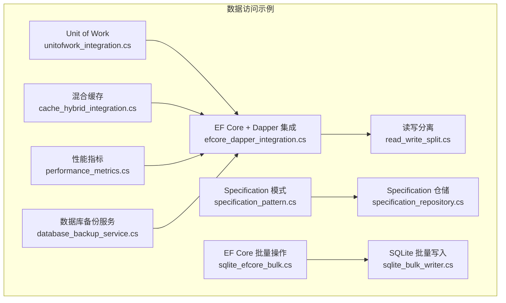
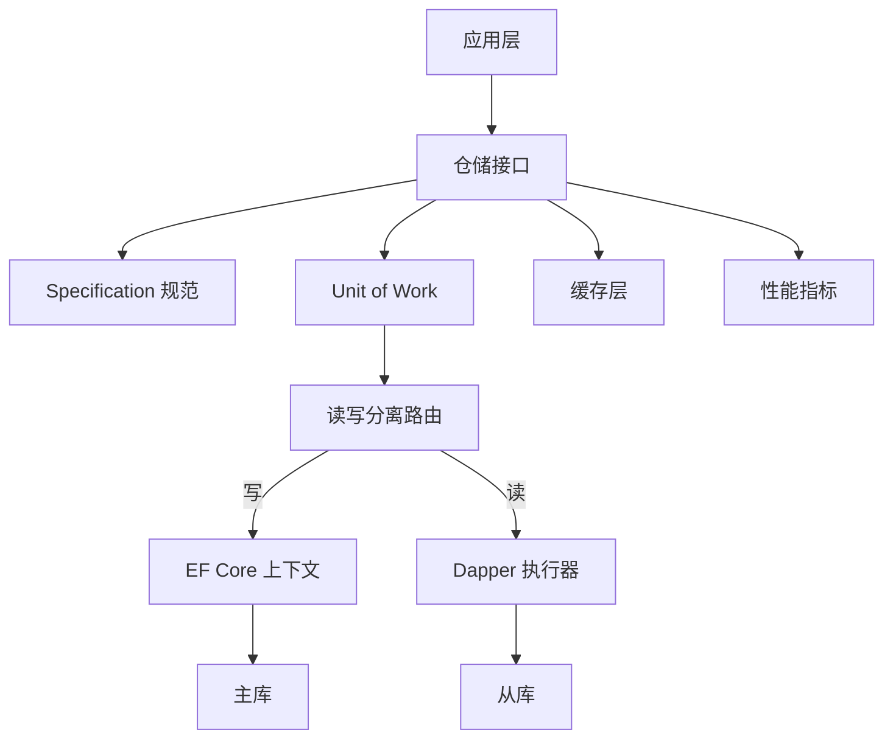
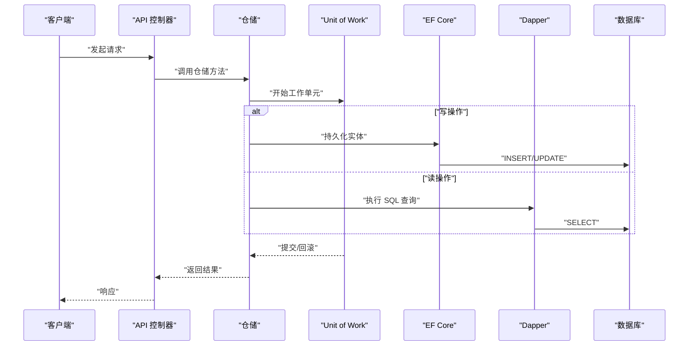
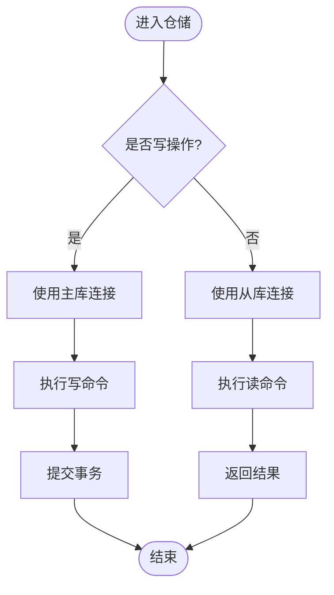
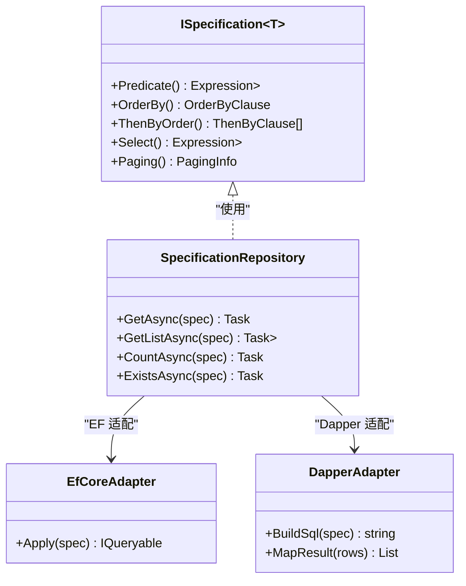
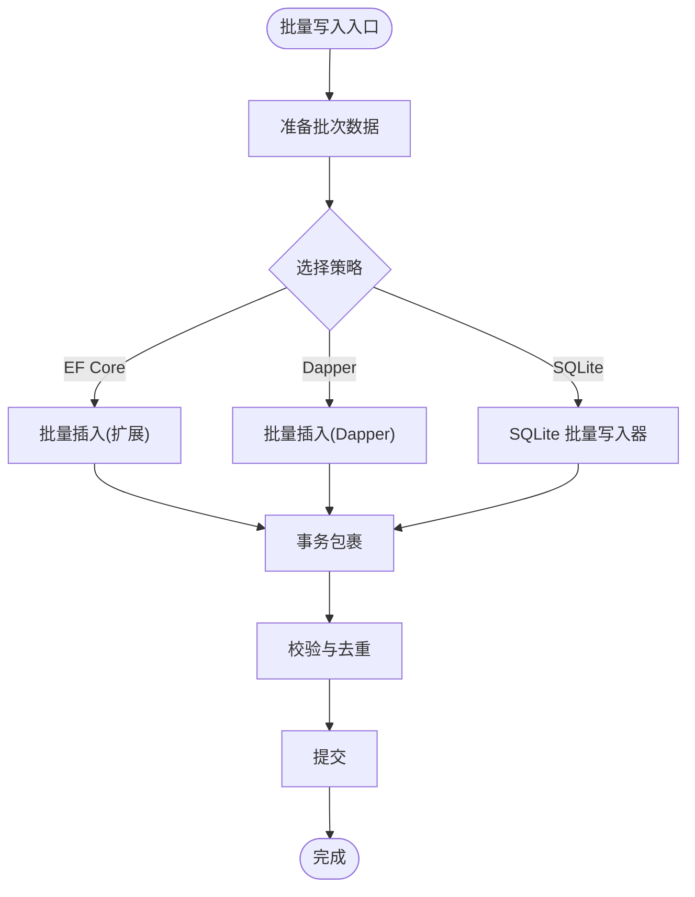
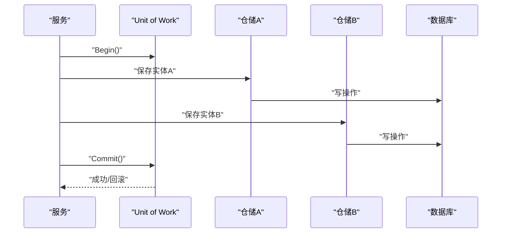
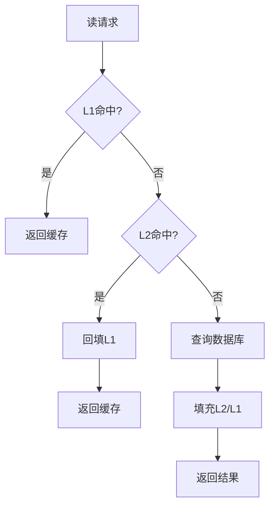
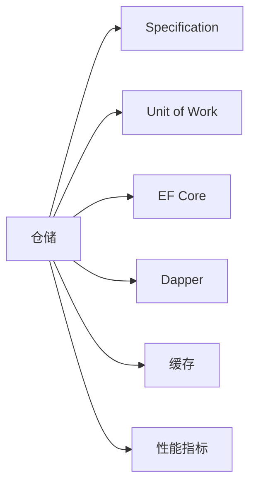

# 数据访问层

<cite>
**本文引用的文件**   
- [efcore_dapper_integration.cs](file://efcore_dapper_integration.cs)
- [read_write_split.cs](file://read_write_split.cs)
- [specification_pattern.cs](file://specification_pattern.cs)
- [specification_repository.cs](file://specification_repository.cs)
- [sqlite_efcore_bulk.cs](file://sqlite_efcore_bulk.cs)
- [sqlite_bulk_writer.cs](file://sqlite_bulk_writer.cs)
- [unitofwork_integration.cs](file://unitofwork_integration.cs)
- [cache_hybrid_integration.cs](file://cache_hybrid_integration.cs)
- [performance_metrics.cs](file://performance_metrics.cs)
- [database_backup_service.cs](file://database_backup_service.cs)
</cite>

## 目录
1. [简介](#简介)
2. [项目结构](#项目结构)
3. [核心组件](#核心组件)
4. [架构总览](#架构总览)
5. [详细组件分析](#详细组件分析)
6. [依赖关系分析](#依赖关系分析)
7. [性能考量](#性能考量)
8. [故障排查指南](#故障排查指南)
9. [结论](#结论)
10. [附录](#附录)

## 简介
本文件面向数据访问层的工程化实践，围绕 Entity Framework Core 与 Dapper 的协同使用、多数据库支持、读写分离、查询优化、事务管理、仓储模式与 Specification 模式、数据迁移、缓存策略与性能调优展开。文档结合仓库中的示例实现，提供可落地的最佳实践与图示说明，帮助读者在复杂业务场景下构建高可用、高性能的数据访问层。

## 项目结构
仓库中包含多个与数据访问相关的示例文件，涵盖 EF Core + Dapper 混合使用、读写分离、Specification 模式、批量写入、Unit of Work、缓存与性能指标等主题。这些文件以“单文件示例”的形式呈现，便于快速理解与复用。

图表来源
- [efcore_dapper_integration.cs](file://efcore_dapper_integration.cs)
- [read_write_split.cs](file://read_write_split.cs)
- [specification_pattern.cs](file://specification_pattern.cs)
- [specification_repository.cs](file://specification_repository.cs)
- [sqlite_efcore_bulk.cs](file://sqlite_efcore_bulk.cs)
- [sqlite_bulk_writer.cs](file://sqlite_bulk_writer.cs)
- [unitofwork_integration.cs](file://unitofwork_integration.cs)
- [cache_hybrid_integration.cs](file://cache_hybrid_integration.cs)
- [performance_metrics.cs](file://performance_metrics.cs)
- [database_backup_service.cs](file://database_backup_service.cs)

章节来源
- [efcore_dapper_integration.cs](file://efcore_dapper_integration.cs)
- [read_write_split.cs](file://read_write_split.cs)
- [specification_pattern.cs](file://specification_pattern.cs)
- [specification_repository.cs](file://specification_repository.cs)
- [sqlite_efcore_bulk.cs](file://sqlite_efcore_bulk.cs)
- [sqlite_bulk_writer.cs](file://sqlite_bulk_writer.cs)
- [unitofwork_integration.cs](file://unitofwork_integration.cs)
- [cache_hybrid_integration.cs](file://cache_hybrid_integration.cs)
- [performance_metrics.cs](file://performance_metrics.cs)
- [database_backup_service.cs](file://database_backup_service.cs)

## 核心组件
- EF Core + Dapper 混合：利用 EF Core 进行建模与变更跟踪，Dapper 用于高性能读取与复杂查询。
- 读写分离：通过连接字符串或路由策略将读请求导向从库，写请求走主库。
- Specification 模式：将查询条件封装为可组合的规范对象，提升查询表达力与复用性。
- 仓储模式：统一数据访问接口，屏蔽底层 ORM/驱动差异。
- Unit of Work：协调多个仓储的提交与回滚，保证一致性。
- 批量操作：针对大吞吐写入场景，采用批量插入/更新减少往返开销。
- 缓存策略：多级缓存（内存+分布式）降低数据库压力。
- 性能指标：采集关键指标（延迟、吞吐、错误率）辅助调优。
- 数据迁移：版本化管理数据库结构变更。
- 备份服务：定期备份与恢复能力保障数据安全。

章节来源
- [efcore_dapper_integration.cs](file://efcore_dapper_integration.cs)
- [read_write_split.cs](file://read_write_split.cs)
- [specification_pattern.cs](file://specification_pattern.cs)
- [specification_repository.cs](file://specification_repository.cs)
- [sqlite_efcore_bulk.cs](file://sqlite_efcore_bulk.cs)
- [sqlite_bulk_writer.cs](file://sqlite_bulk_writer.cs)
- [unitofwork_integration.cs](file://unitofwork_integration.cs)
- [cache_hybrid_integration.cs](file://cache_hybrid_integration.cs)
- [performance_metrics.cs](file://performance_metrics.cs)
- [database_backup_service.cs](file://database_backup_service.cs)

## 架构总览
下图展示数据访问层的核心交互：应用层通过仓储调用 Specification 定义查询；仓储内部根据操作类型选择 EF Core 或 Dapper；读写分离路由决定主从库；缓存层拦截热点读；Unit of Work 统一管理事务边界；性能指标贯穿全链路。

图表来源
- [efcore_dapper_integration.cs](file://efcore_dapper_integration.cs)
- [read_write_split.cs](file://read_write_split.cs)
- [specification_pattern.cs](file://specification_pattern.cs)
- [specification_repository.cs](file://specification_repository.cs)
- [unitofwork_integration.cs](file://unitofwork_integration.cs)
- [cache_hybrid_integration.cs](file://cache_hybrid_integration.cs)
- [performance_metrics.cs](file://performance_metrics.cs)

## 详细组件分析

### EF Core 与 Dapper 的协同
- 适用场景
  - EF Core：实体建模、变更跟踪、复杂关系维护、迁移管理。
  - Dapper：高并发读、复杂 SQL 聚合、跨库报表导出。
- 最佳实践
  - 明确读写边界：写路径使用 EF Core，读路径优先 Dapper。
  - 共享模型：DTO/ViewModel 由 Dapper 映射，Entity 由 EF Core 管理。
  - 连接隔离：分别注册 DbContext 与 Dapper 连接工厂，避免混用。
  - 事务协作：在 UoW 中协调 EF 与 Dapper 的事务边界。

图表来源
- [efcore_dapper_integration.cs](file://efcore_dapper_integration.cs)
- [unitofwork_integration.cs](file://unitofwork_integration.cs)

章节来源
- [efcore_dapper_integration.cs](file://efcore_dapper_integration.cs)
- [unitofwork_integration.cs](file://unitofwork_integration.cs)

### 读写分离
- 设计要点
  - 基于操作类型或标签动态选择连接字符串。
  - 从库只读，主库读写；必要时引入二级路由（按租户/区域）。
  - 监控主从延迟，避免读到过期数据。
- 实现思路
  - 在仓储或中间件层注入路由策略。
  - 对读方法强制走从库，写方法强制走主库。
  - 失败降级：从库不可用时回退到主库（仅读）。

图表来源
- [read_write_split.cs](file://read_write_split.cs)

章节来源
- [read_write_split.cs](file://read_write_split.cs)

### Specification 模式与仓储
- 目标
  - 将查询条件抽象为可组合的 Specification，提高可读性与复用性。
  - 仓储暴露统一的 GetBySpec/Exists/Count 等方法。
- 关键点
  - Specification 包含谓词、排序、分页、投影等元数据。
  - 仓储根据 Specification 生成 EF LINQ 或 Dapper SQL。
  - 支持组合（And/Or/Not）与扩展点（自定义过滤器）。

图表来源
- [specification_pattern.cs](file://specification_pattern.cs)
- [specification_repository.cs](file://specification_repository.cs)

章节来源
- [specification_pattern.cs](file://specification_pattern.cs)
- [specification_repository.cs](file://specification_repository.cs)

### 批量操作与并发控制
- 批量写入
  - 使用 EF Core 批量扩展或 Dapper 批量插入，减少往返次数。
  - SQLite 场景可使用专用批量写入器提升吞吐。
- 并发控制
  - 乐观锁：版本号字段冲突检测。
  - 分布式锁：Redis 或数据库行级锁防止超卖/重复处理。
  - 幂等性：唯一键/去重表确保重试安全。

图表来源
- [sqlite_efcore_bulk.cs](file://sqlite_efcore_bulk.cs)
- [sqlite_bulk_writer.cs](file://sqlite_bulk_writer.cs)

章节来源
- [sqlite_efcore_bulk.cs](file://sqlite_efcore_bulk.cs)
- [sqlite_bulk_writer.cs](file://sqlite_bulk_writer.cs)

### 事务管理与 Unit of Work
- 设计要点
  - 一个 UoW 对应一次业务操作，聚合多个仓储的提交。
  - 异常时整体回滚，保证一致性。
  - 与 EF Core 的 SaveChanges 和 Dapper 的显式事务配合。
- 注意事项
  - 避免长事务，拆分批处理。
  - 分布式场景考虑补偿或 TCC。

图表来源
- [unitofwork_integration.cs](file://unitofwork_integration.cs)

章节来源
- [unitofwork_integration.cs](file://unitofwork_integration.cs)

### 缓存策略
- 多级缓存
  - L1：进程内内存缓存（短 TTL，低延迟）。
  - L2：分布式缓存（Redis/MemoryCache），跨实例共享。
- 失效策略
  - 基于 Key 前缀与版本号。
  - 事件驱动失效（发布/订阅）。
- 穿透/雪崩防护
  - 空值缓存、随机 TTL、限流熔断。

图表来源
- [cache_hybrid_integration.cs](file://cache_hybrid_integration.cs)

章节来源
- [cache_hybrid_integration.cs](file://cache_hybrid_integration.cs)

### 性能指标与监控
- 关键指标
  - 延迟（P50/P95/P99）、吞吐（QPS）、错误率、慢查询数。
  - 连接池状态、缓存命中率、事务耗时。
- 采集方式
  - 中间件/拦截器埋点，Prometheus/Grafana 可视化。
  - 结构化日志与分布式追踪。

章节来源
- [performance_metrics.cs](file://performance_metrics.cs)

### 数据迁移与备份
- 迁移管理
  - 使用 EF Core Migrations 管理版本化变更。
  - 自动化脚本与 CI/CD 集成。
- 备份服务
  - 定时备份、增量备份、异地容灾。
  - 恢复演练与验证。

章节来源
- [database_backup_service.cs](file://database_backup_service.cs)

## 依赖关系分析
仓储与 Specification、UoW、EF/Dapper、缓存、指标之间的依赖如下：

图表来源
- [specification_repository.cs](file://specification_repository.cs)
- [specification_pattern.cs](file://specification_pattern.cs)
- [unitofwork_integration.cs](file://unitofwork_integration.cs)
- [efcore_dapper_integration.cs](file://efcore_dapper_integration.cs)
- [cache_hybrid_integration.cs](file://cache_hybrid_integration.cs)
- [performance_metrics.cs](file://performance_metrics.cs)

章节来源
- [specification_repository.cs](file://specification_repository.cs)
- [specification_pattern.cs](file://specification_pattern.cs)
- [unitofwork_integration.cs](file://unitofwork_integration.cs)
- [efcore_dapper_integration.cs](file://efcore_dapper_integration.cs)
- [cache_hybrid_integration.cs](file://cache_hybrid_integration.cs)
- [performance_metrics.cs](file://performance_metrics.cs)

## 性能考量
- 查询优化
  - 使用 Dapper 执行复杂 SQL，避免 N+1 查询。
  - 合理索引与覆盖索引，减少扫描。
  - 分页与投影，仅拉取必要字段。
- 批量操作
  - 合并小事务为大事务，减少网络往返。
  - 使用批量插入/更新工具，避免逐条循环。
- 连接与线程
  - 合理配置连接池大小与超时。
  - 异步 IO，避免阻塞线程池。
- 缓存与热点
  - 热点数据常驻内存，设置合理 TTL。
  - 防穿透/雪崩/击穿策略。
- 监控与定位
  - 慢查询日志、APM 追踪、指标告警。

[本节为通用指导，不直接分析具体文件]

## 故障排查指南
- 常见问题
  - 主从延迟导致读到旧数据：检查复制延迟与一致性策略。
  - 连接池耗尽：调整池大小、缩短事务时长、排查泄漏。
  - 缓存不一致：确认失效策略与事件传播。
  - 批量失败：分批重试、记录失败明细、补偿机制。
- 诊断手段
  - 启用慢查询日志与 SQL 审计。
  - 使用性能指标与分布式追踪定位瓶颈。
  - 压测与回归测试验证修复效果。

章节来源
- [performance_metrics.cs](file://performance_metrics.cs)
- [database_backup_service.cs](file://database_backup_service.cs)

## 结论
通过 EF Core 与 Dapper 的协同、读写分离、Specification 与仓储模式、UoW 事务管理、批量操作、多级缓存与完善的监控指标，可以构建出高可用、高性能、易维护的数据访问层。建议在生产环境持续压测与观测，结合业务特性迭代优化。

[本节为总结，不直接分析具体文件]

## 附录
- 术语
  - 仓储：数据访问的统一抽象。
  - Specification：可组合的查询规范。
  - UoW：工作单元，协调多个仓储的提交。
  - 读写分离：读从库、写主库的策略。
  - 多级缓存：内存+分布式的分层缓存。
- 参考实现路径
  - EF Core + Dapper：[efcore_dapper_integration.cs](file://efcore_dapper_integration.cs)
  - 读写分离：[read_write_split.cs](file://read_write_split.cs)
  - Specification：[specification_pattern.cs](file://specification_pattern.cs)、[specification_repository.cs](file://specification_repository.cs)
  - 批量写入：[sqlite_efcore_bulk.cs](file://sqlite_efcore_bulk.cs)、[sqlite_bulk_writer.cs](file://sqlite_bulk_writer.cs)
  - UoW：[unitofwork_integration.cs](file://unitofwork_integration.cs)
  - 缓存：[cache_hybrid_integration.cs](file://cache_hybrid_integration.cs)
  - 指标：[performance_metrics.cs](file://performance_metrics.cs)
  - 备份：[database_backup_service.cs](file://database_backup_service.cs)