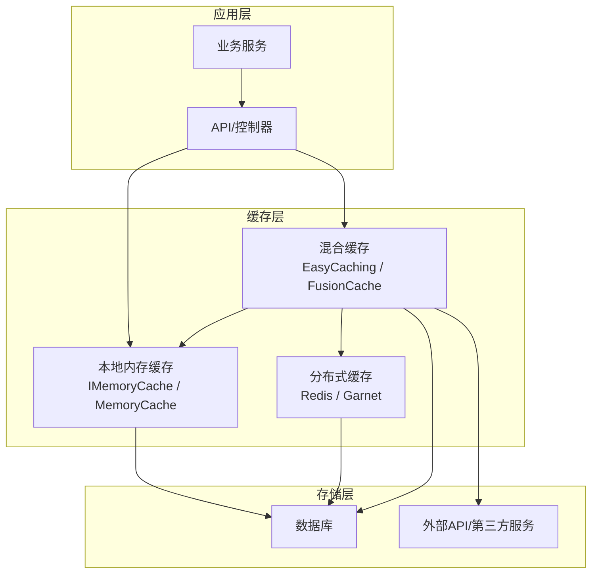
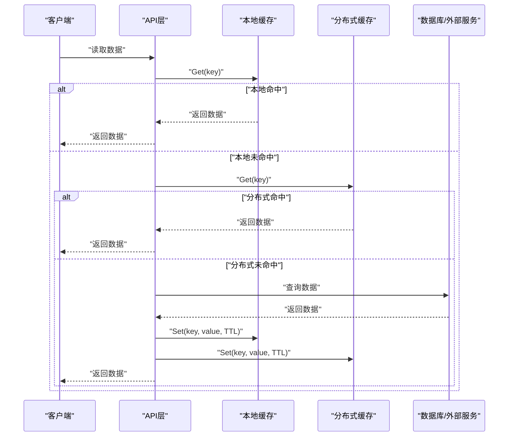
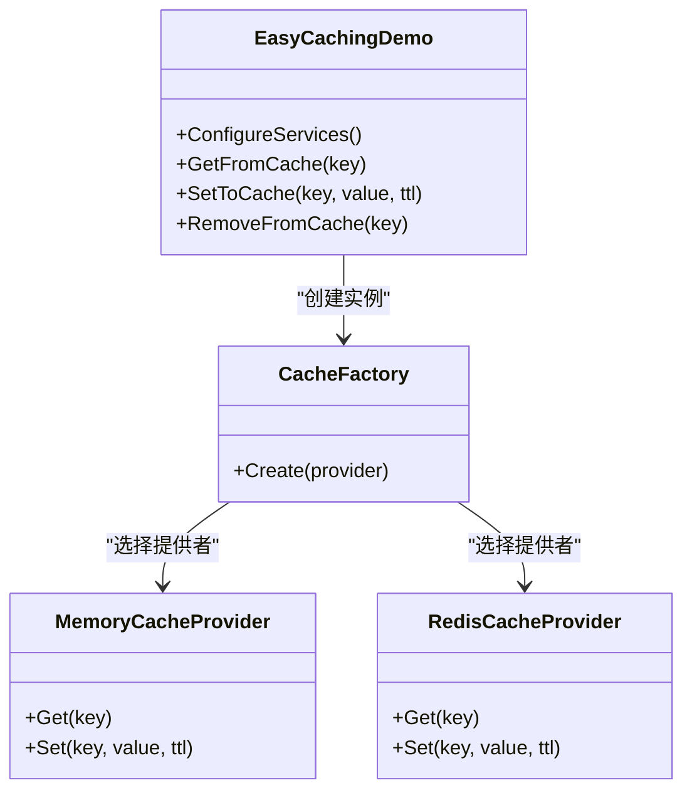
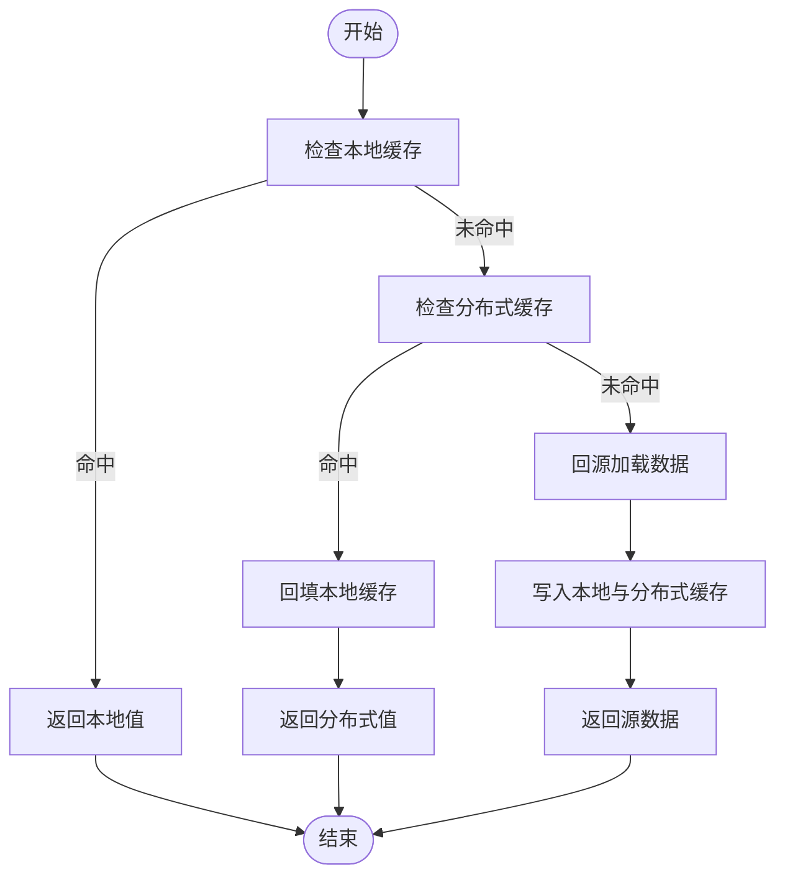
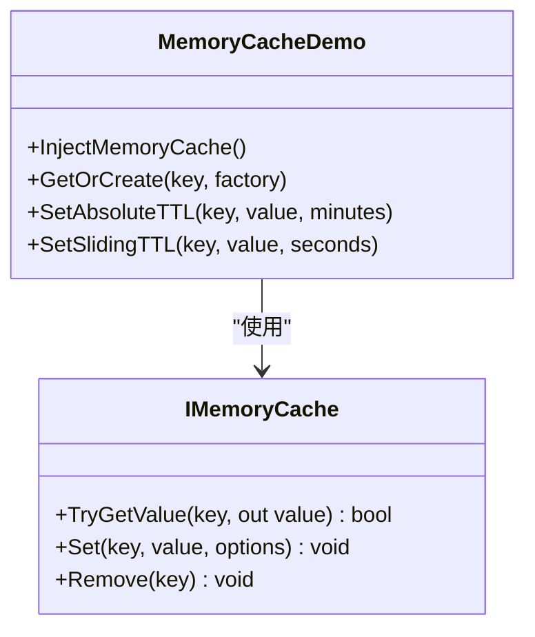
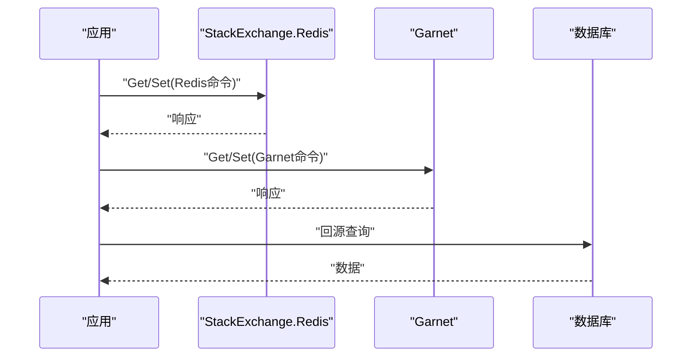
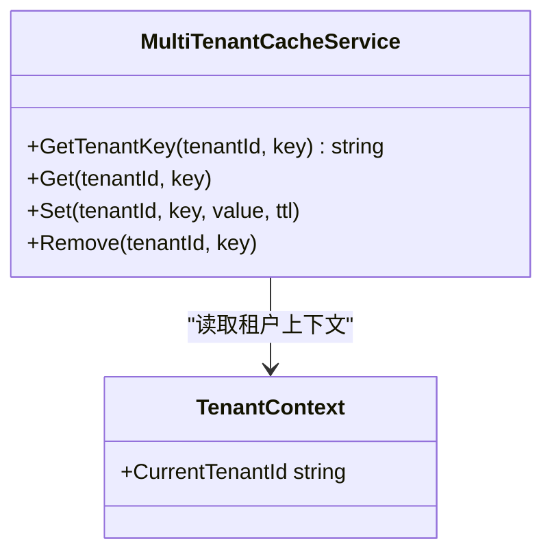
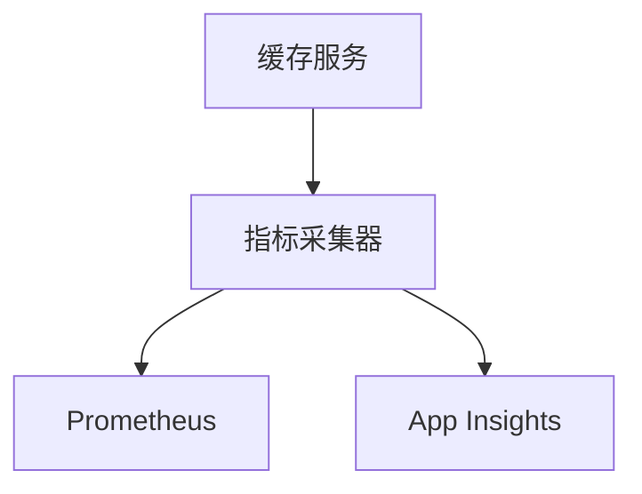
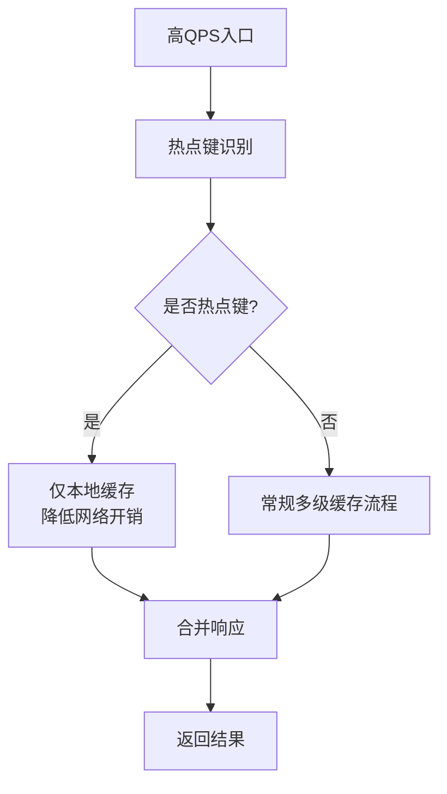
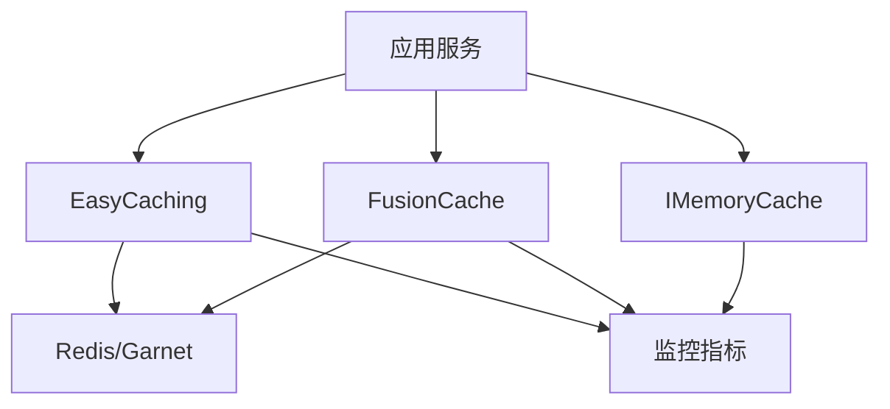

# 缓存策略

<cite>
**本文引用的文件**   
- [easycaching_demo.cs](file://easycaching_demo.cs)
- [fusioncache_demo.cs](file://fusioncache_demo.cs)
- [microsoft_cache_demo.cs](file://microsoft_cache_demo.cs)
- [stackexchange_redis_cache.cs](file://stackexchange_redis_cache.cs)
- [garnet_redis_cache.cs](file://garnet_redis_cache.cs)
- [cache_hybrid_integration.cs](file://cache_hybrid_integration.cs)
- [tiered_memory_integration.cs](file://tiered_memory_integration.cs)
- [litedb_tieredmemory.cs](file://litedb_tieredmemory.cs)
- [kiota_cache.cs](file://kiota_cache.cs)
- [netcore_encrypt_cache.cs](file://netcore_encrypt_cache.cs)
- [multitenant_cache_service.cs](file://multitenant_cache_service.cs)
- [metrics_monitoring.cs](file://metrics_monitoring.cs)
- [prometheus_metrics.cs](file://prometheus_metrics.cs)
- [appinsights_prometheus.cs](file://appinsights_prometheus.cs)
- [high_frequency_1m.cs](file://high_frequency_1m.cs)
- [high_frequency_100k.cs](file://high_frequency_100k.cs)
- [high_frequency_10m.cs](file://high_frequency_10m.cs)
</cite>

## 目录
1. [简介](#简介)
2. [项目结构](#项目结构)
3. [核心组件](#核心组件)
4. [架构总览](#架构总览)
5. [详细组件分析](#详细组件分析)
6. [依赖关系分析](#依赖关系分析)
7. [性能考量](#性能考量)
8. [故障排查指南](#故障排查指南)
9. [结论](#结论)
10. [附录](#附录)

## 简介
本文件围绕多级缓存架构设计，系统讲解内存缓存、Redis分布式缓存与混合缓存策略，覆盖缓存一致性、过期与失效机制、预热与监控指标、热点数据与防穿透/雪崩等关键主题。文档结合仓库中的示例代码，给出EasyCaching、Microsoft.Extensions.Caching与FusionCache的实践要点，并提供可操作的调优建议与排障路径。

## 项目结构
仓库中包含多个与缓存相关的示例与集成文件，涵盖：
- EasyCaching 使用示例
- FusionCache 使用示例
- Microsoft.Extensions.Caching（含 IMemoryCache）示例
- Redis 客户端集成（StackExchange.Redis、Garnet）
- 混合缓存与分层内存缓存实现
- 多租户缓存服务
- 监控与指标采集（Prometheus、App Insights）
- 高并发场景下的缓存实践

图表来源
- [microsoft_cache_demo.cs:1-200](file://microsoft_cache_demo.cs#L1-L200)
- [easycaching_demo.cs:1-200](file://easycaching_demo.cs#L1-L200)
- [fusioncache_demo.cs:1-200](file://fusioncache_demo.cs#L1-L200)
- [stackexchange_redis_cache.cs:1-200](file://stackexchange_redis_cache.cs#L1-L200)
- [garnet_redis_cache.cs:1-200](file://garnet_redis_cache.cs#L1-L200)
- [cache_hybrid_integration.cs:1-200](file://cache_hybrid_integration.cs#L1-L200)

章节来源
- [microsoft_cache_demo.cs:1-200](file://microsoft_cache_demo.cs#L1-L200)
- [easycaching_demo.cs:1-200](file://easycaching_demo.cs#L1-L200)
- [fusioncache_demo.cs:1-200](file://fusioncache_demo.cs#L1-L200)
- [stackexchange_redis_cache.cs:1-200](file://stackexchange_redis_cache.cs#L1-L200)
- [garnet_redis_cache.cs:1-200](file://garnet_redis_cache.cs#L1-L200)
- [cache_hybrid_integration.cs:1-200](file://cache_hybrid_integration.cs#L1-L200)

## 核心组件
- 本地内存缓存（IMemoryCache/MemoryCache）
  - 特点：进程内、极低延迟、容量受限、跨进程不共享
  - 适用：热数据、小对象、短生命周期
  - 参考实现：[microsoft_cache_demo.cs:1-200](file://microsoft_cache_demo.cs#L1-L200)

- 分布式缓存（Redis/Garnet）
  - 特点：跨进程共享、高吞吐、支持复杂数据结构、需网络IO
  - 适用：会话、限流、分布式锁、全局配置、热点数据
  - 参考实现：[stackexchange_redis_cache.cs:1-200](file://stackexchange_redis_cache.cs#L1-L200)、[garnet_redis_cache.cs:1-200](file://garnet_redis_cache.cs#L1-L200)

- 混合缓存（EasyCaching/FusionCache）
  - 特点：多级组合（本地+分布式）、自动回源、降级与熔断、统计与监控
  - 适用：高可用、高吞吐、强一致或最终一致均可
  - 参考实现：[easycaching_demo.cs:1-200](file://easycaching_demo.cs#L1-L200)、[fusioncache_demo.cs:1-200](file://fusioncache_demo.cs#L1-L200)、[cache_hybrid_integration.cs:1-200](file://cache_hybrid_integration.cs#L1-L200)

- 分层内存缓存（Tiered Memory）
  - 特点：进程内多级内存（如大对象池+小对象缓存），减少GC压力
  - 适用：超大对象、序列化开销大的数据
  - 参考实现：[tiered_memory_integration.cs:1-200](file://tiered_memory_integration.cs#L1-L200)、[litedb_tieredmemory.cs:1-200](file://litedb_tieredmemory.cs#L1-L200)

- 多租户缓存隔离
  - 特点：按租户维度隔离键空间与过期策略
  - 适用：SaaS平台、多租户应用
  - 参考实现：[multitenant_cache_service.cs:1-200](file://multitenant_cache_service.cs#L1-L200)

章节来源
- [microsoft_cache_demo.cs:1-200](file://microsoft_cache_demo.cs#L1-L200)
- [stackexchange_redis_cache.cs:1-200](file://stackexchange_redis_cache.cs#L1-L200)
- [garnet_redis_cache.cs:1-200](file://garnet_redis_cache.cs#L1-L200)
- [easycaching_demo.cs:1-200](file://easycaching_demo.cs#L1-L200)
- [fusioncache_demo.cs:1-200](file://fusioncache_demo.cs#L1-L200)
- [cache_hybrid_integration.cs:1-200](file://cache_hybrid_integration.cs#L1-L200)
- [tiered_memory_integration.cs:1-200](file://tiered_memory_integration.cs#L1-L200)
- [litedb_tieredmemory.cs:1-200](file://litedb_tieredmemory.cs#L1-L200)
- [multitenant_cache_service.cs:1-200](file://multitenant_cache_service.cs#L1-L200)

## 架构总览
下图展示典型的多级缓存请求流程：客户端请求进入应用后，优先命中本地缓存；未命中则尝试分布式缓存；仍失败时回源至数据库或外部服务，并将结果回填各级缓存。

图表来源
- [easycaching_demo.cs:1-200](file://easycaching_demo.cs#L1-L200)
- [fusioncache_demo.cs:1-200](file://fusioncache_demo.cs#L1-L200)
- [microsoft_cache_demo.cs:1-200](file://microsoft_cache_demo.cs#L1-L200)
- [stackexchange_redis_cache.cs:1-200](file://stackexchange_redis_cache.cs#L1-L200)
- [garnet_redis_cache.cs:1-200](file://garnet_redis_cache.cs#L1-L200)

## 详细组件分析

### EasyCaching 使用与多级缓存
- 功能要点
  - 统一抽象接口，支持多种后端（内存、Redis、SQLite等）
  - 内置多级缓存链，自动回源与回填
  - 提供统计、健康检查与扩展点
- 典型用法
  - 注册服务与配置后端
  - 通过工厂获取具体缓存实例
  - Get/Set/Remove/Exists 等操作
  - 设置过期策略（绝对/滑动）
- 参考实现
  - [easycaching_demo.cs:1-200](file://easycaching_demo.cs#L1-L200)

图表来源
- [easycaching_demo.cs:1-200](file://easycaching_demo.cs#L1-L200)

章节来源
- [easycaching_demo.cs:1-200](file://easycaching_demo.cs#L1-L200)

### FusionCache 使用与高级特性
- 功能要点
  - 多级缓存（本地+分布式）
  - 软过期、硬过期、刷新策略
  - 熔断、降级、重试、统计与诊断
- 典型用法
  - 配置默认策略与每键策略
  - 使用 GetOrAdd 进行懒加载
  - 监听事件与导出指标
- 参考实现
  - [fusioncache_demo.cs:1-200](file://fusioncache_demo.cs#L1-L200)

图表来源
- [fusioncache_demo.cs:1-200](file://fusioncache_demo.cs#L1-L200)

章节来源
- [fusioncache_demo.cs:1-200](file://fusioncache_demo.cs#L1-L200)

### Microsoft.Extensions.Caching（IMemoryCache）
- 功能要点
  - 进程内缓存，简单高效
  - 支持绝对/滑动过期、优先级、清理策略
  - 适合轻量级、单实例或无状态服务
- 典型用法
  - 注入 IMemoryCache
  - TryGetValue/Set/Remove
  - 配合 IOptions 配置过期时间
- 参考实现
  - [microsoft_cache_demo.cs:1-200](file://microsoft_cache_demo.cs#L1-L200)

图表来源
- [microsoft_cache_demo.cs:1-200](file://microsoft_cache_demo.cs#L1-L200)

章节来源
- [microsoft_cache_demo.cs:1-200](file://microsoft_cache_demo.cs#L1-L200)

### Redis 分布式缓存（StackExchange.Redis 与 Garnet）
- StackExchange.Redis
  - 成熟稳定，生态完善
  - 支持管道、事务、Lua脚本、发布订阅
  - 注意连接池、超时、重试与序列化
  - 参考实现：[stackexchange_redis_cache.cs:1-200](file://stackexchange_redis_cache.cs#L1-L200)
- Garnet
  - 高性能Redis兼容引擎
  - 适合高吞吐、低延迟场景
  - 参考实现：[garnet_redis_cache.cs:1-200](file://garnet_redis_cache.cs#L1-L200)

图表来源
- [stackexchange_redis_cache.cs:1-200](file://stackexchange_redis_cache.cs#L1-L200)
- [garnet_redis_cache.cs:1-200](file://garnet_redis_cache.cs#L1-L200)

章节来源
- [stackexchange_redis_cache.cs:1-200](file://stackexchange_redis_cache.cs#L1-L200)
- [garnet_redis_cache.cs:1-200](file://garnet_redis_cache.cs#L1-L200)

### 混合缓存与分层内存缓存
- 混合缓存
  - 将本地与分布式缓存组合，提升命中率与可用性
  - 参考实现：[cache_hybrid_integration.cs:1-200](file://cache_hybrid_integration.cs#L1-L200)
- 分层内存缓存
  - 在进程内划分不同层级（如大对象池与小对象缓存）
  - 参考实现：[tiered_memory_integration.cs:1-200](file://tiered_memory_integration.cs#L1-L200)、[litedb_tieredmemory.cs:1-200](file://litedb_tieredmemory.cs#L1-L200)

图表来源
- [cache_hybrid_integration.cs:1-200](file://cache_hybrid_integration.cs#L1-L200)
- [tiered_memory_integration.cs:1-200](file://tiered_memory_integration.cs#L1-L200)
- [litedb_tieredmemory.cs:1-200](file://litedb_tieredmemory.cs#L1-L200)

章节来源
- [cache_hybrid_integration.cs:1-200](file://cache_hybrid_integration.cs#L1-L200)
- [tiered_memory_integration.cs:1-200](file://tiered_memory_integration.cs#L1-L200)
- [litedb_tieredmemory.cs:1-200](file://litedb_tieredmemory.cs#L1-L200)

### 多租户缓存服务
- 目标
  - 为每个租户提供独立的键空间与过期策略
  - 避免跨租户数据泄露与资源争用
- 参考实现
  - [multitenant_cache_service.cs:1-200](file://multitenant_cache_service.cs#L1-L200)

图表来源
- [multitenant_cache_service.cs:1-200](file://multitenant_cache_service.cs#L1-L200)

章节来源
- [multitenant_cache_service.cs:1-200](file://multitenant_cache_service.cs#L1-L200)

### 缓存加密与安全
- 目标
  - 对敏感数据进行加密存储与传输
  - 控制密钥管理与轮换
- 参考实现
  - [netcore_encrypt_cache.cs:1-200](file://netcore_encrypt_cache.cs#L1-L200)

章节来源
- [netcore_encrypt_cache.cs:1-200](file://netcore_encrypt_cache.cs#L1-L200)

### 缓存监控与指标
- 目标
  - 采集命中率、延迟、错误率、内存占用等指标
  - 接入 Prometheus/App Insights 进行可视化与告警
- 参考实现
  - [metrics_monitoring.cs:1-200](file://metrics_monitoring.cs#L1-L200)
  - [prometheus_metrics.cs:1-200](file://prometheus_metrics.cs#L1-L200)
  - [appinsights_prometheus.cs:1-200](file://appinsights_prometheus.cs#L1-L200)

图表来源
- [metrics_monitoring.cs:1-200](file://metrics_monitoring.cs#L1-L200)
- [prometheus_metrics.cs:1-200](file://prometheus_metrics.cs#L1-L200)
- [appinsights_prometheus.cs:1-200](file://appinsights_prometheus.cs#L1-L200)

章节来源
- [metrics_monitoring.cs:1-200](file://metrics_monitoring.cs#L1-L200)
- [prometheus_metrics.cs:1-200](file://prometheus_metrics.cs#L1-L200)
- [appinsights_prometheus.cs:1-200](file://appinsights_prometheus.cs#L1-L200)

### 高并发与热点数据处理
- 目标
  - 在高QPS下保持低延迟与高可用
  - 针对热点键进行特殊处理（如本地缓存、批量更新、异步刷新）
- 参考实现
  - [high_frequency_1m.cs:1-200](file://high_frequency_1m.cs#L1-L200)
  - [high_frequency_100k.cs:1-200](file://high_frequency_100k.cs#L1-L200)
  - [high_frequency_10m.cs:1-200](file://high_frequency_10m.cs#L1-L200)

图表来源
- [high_frequency_1m.cs:1-200](file://high_frequency_1m.cs#L1-L200)
- [high_frequency_100k.cs:1-200](file://high_frequency_100k.cs#L1-L200)
- [high_frequency_10m.cs:1-200](file://high_frequency_10m.cs#L1-L200)

章节来源
- [high_frequency_1m.cs:1-200](file://high_frequency_1m.cs#L1-L200)
- [high_frequency_100k.cs:1-200](file://high_frequency_100k.cs#L1-L200)
- [high_frequency_10m.cs:1-200](file://high_frequency_10m.cs#L1-L200)

## 依赖关系分析
- 组件耦合
  - 应用层依赖缓存抽象（EasyCaching/FusionCache/IMemoryCache）
  - 分布式缓存依赖网络与序列化库
  - 监控模块依赖指标框架（Prometheus/App Insights）
- 潜在循环依赖
  - 应避免缓存模块直接依赖业务逻辑，防止循环引用
- 外部依赖
  - Redis/Garnet 服务端配置与集群拓扑
  - 序列化格式（JSON/MessagePack）与压缩策略

图表来源
- [easycaching_demo.cs:1-200](file://easycaching_demo.cs#L1-L200)
- [fusioncache_demo.cs:1-200](file://fusioncache_demo.cs#L1-L200)
- [microsoft_cache_demo.cs:1-200](file://microsoft_cache_demo.cs#L1-L200)
- [stackexchange_redis_cache.cs:1-200](file://stackexchange_redis_cache.cs#L1-L200)
- [garnet_redis_cache.cs:1-200](file://garnet_redis_cache.cs#L1-L200)
- [metrics_monitoring.cs:1-200](file://metrics_monitoring.cs#L1-L200)

章节来源
- [easycaching_demo.cs:1-200](file://easycaching_demo.cs#L1-L200)
- [fusioncache_demo.cs:1-200](file://fusioncache_demo.cs#L1-L200)
- [microsoft_cache_demo.cs:1-200](file://microsoft_cache_demo.cs#L1-L200)
- [stackexchange_redis_cache.cs:1-200](file://stackexchange_redis_cache.cs#L1-L200)
- [garnet_redis_cache.cs:1-200](file://garnet_redis_cache.cs#L1-L200)
- [metrics_monitoring.cs:1-200](file://metrics_monitoring.cs#L1-L200)

## 性能考量
- 缓存预热
  - 启动时预加载热点数据，降低冷启动延迟
  - 结合定时任务与增量更新策略
- 过期与失效
  - 绝对过期 vs 滑动过期
  - 主动失效（删除/更新）与被动过期（TTL）
  - 热点键的长TTL与后台刷新
- 序列化与压缩
  - 选择高效序列化（MessagePack/Protobuf）
  - 大对象压缩以减少带宽与内存占用
- 连接与线程模型
  - Redis连接池大小与超时配置
  - 异步非阻塞调用，避免线程阻塞
- 监控与调优
  - 命中率、延迟分布、错误率
  - 基于指标的阈值告警与自动扩容

章节来源
- [metrics_monitoring.cs:1-200](file://metrics_monitoring.cs#L1-L200)
- [prometheus_metrics.cs:1-200](file://prometheus_metrics.cs#L1-L200)
- [appinsights_prometheus.cs:1-200](file://appinsights_prometheus.cs#L1-L200)

## 故障排查指南
- 常见问题
  - 缓存未命中率高：检查键命名、过期策略与预热
  - 延迟升高：检查序列化、网络抖动与连接池
  - 内存泄漏：检查大对象缓存与未释放的资源
  - 一致性异常：检查写扩散与失效广播机制
- 定位方法
  - 启用详细日志与分布式追踪
  - 采集并分析指标（命中率、P95/P99延迟）
  - 使用压测工具模拟热点与突发流量
- 参考实现
  - 监控与指标：[metrics_monitoring.cs:1-200](file://metrics_monitoring.cs#L1-L200)、[prometheus_metrics.cs:1-200](file://prometheus_metrics.cs#L1-L200)、[appinsights_prometheus.cs:1-200](file://appinsights_prometheus.cs#L1-L200)

章节来源
- [metrics_monitoring.cs:1-200](file://metrics_monitoring.cs#L1-L200)
- [prometheus_metrics.cs:1-200](file://prometheus_metrics.cs#L1-L200)
- [appinsights_prometheus.cs:1-200](file://appinsights_prometheus.cs#L1-L200)

## 结论
多级缓存架构通过本地与分布式缓存的组合，显著提升性能与可用性。选择合适的框架（EasyCaching、FusionCache、IMemoryCache）并结合监控与调优，可有效应对高并发、热点数据与一致性挑战。建议在业务中引入预热、失效广播与熔断降级策略，确保系统在极端情况下依然稳健运行。

## 附录
- 最佳实践清单
  - 明确键命名规范与命名空间隔离
  - 合理设置TTL与过期策略
  - 对热点键采用本地缓存与异步刷新
  - 启用监控与告警，持续优化
- 相关示例文件
  - [kiota_cache.cs:1-200](file://kiota_cache.cs#L1-L200)
  - [netcore_encrypt_cache.cs:1-200](file://netcore_encrypt_cache.cs#L1-L200)
  - [multitenant_cache_service.cs:1-200](file://multitenant_cache_service.cs#L1-L200)