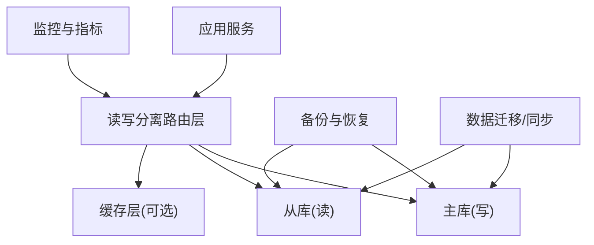
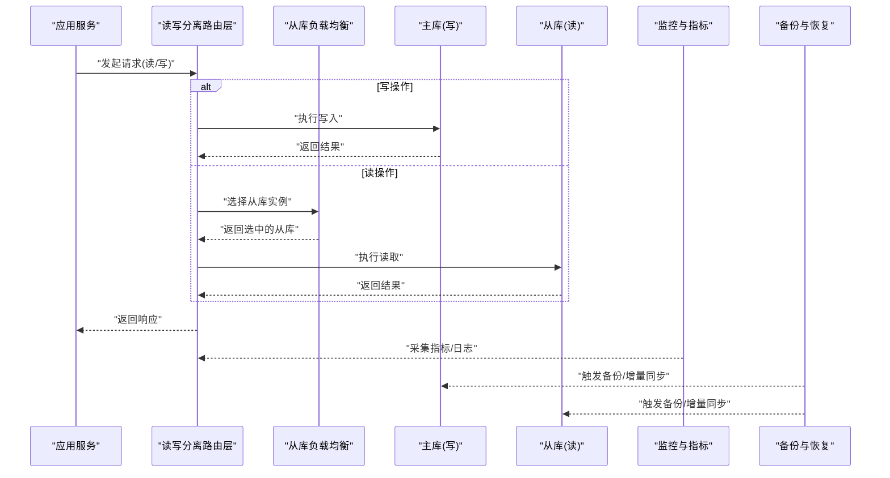
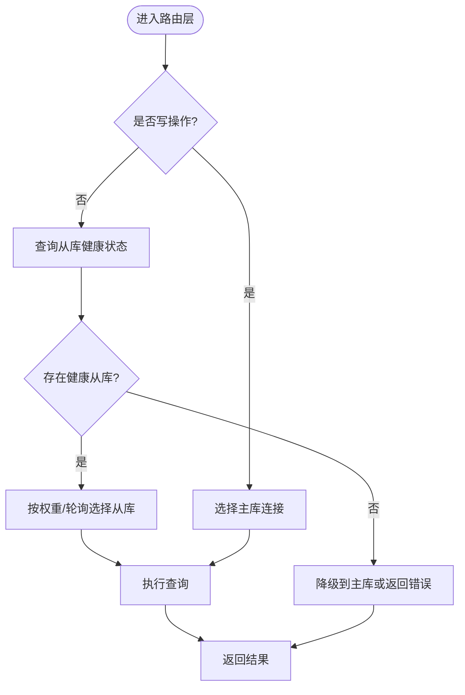
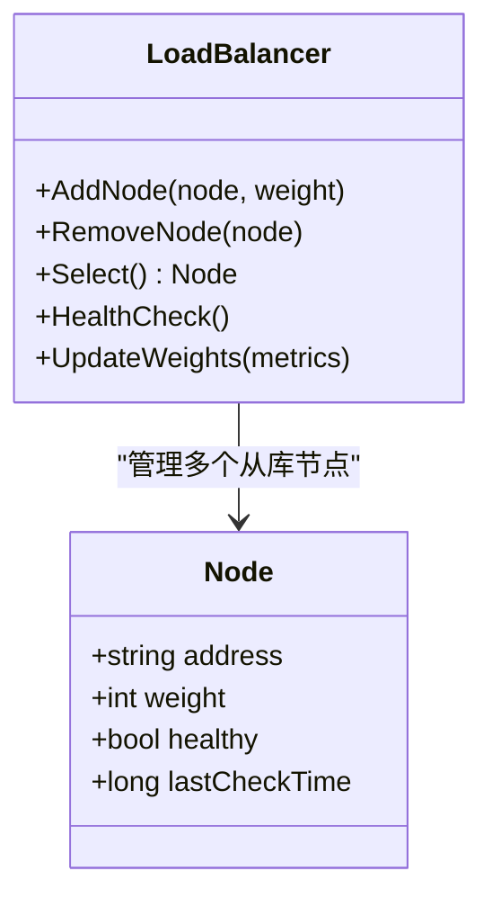
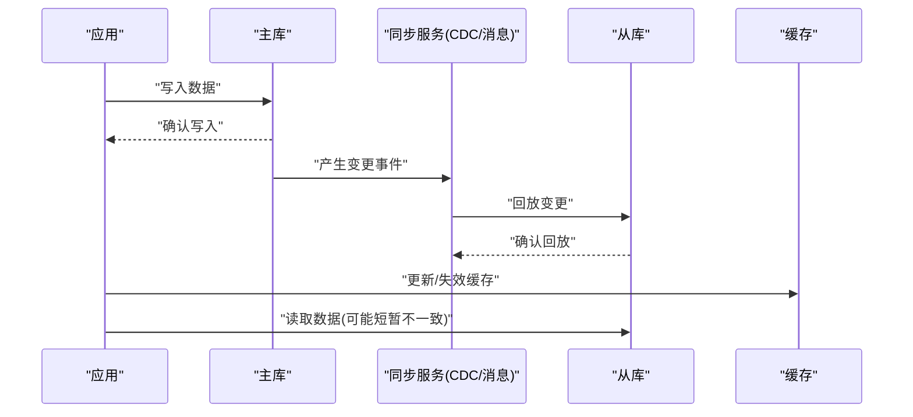
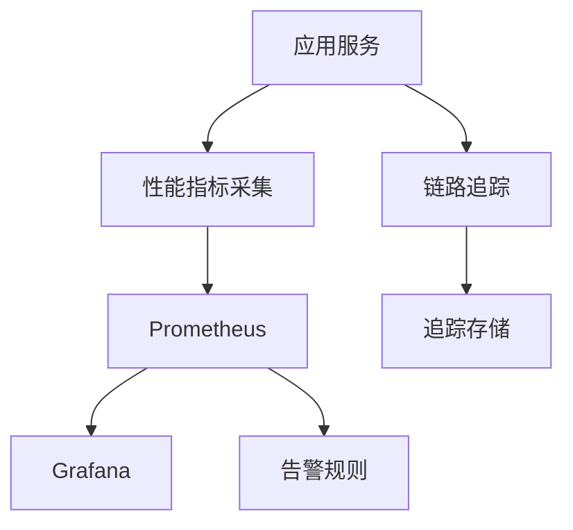
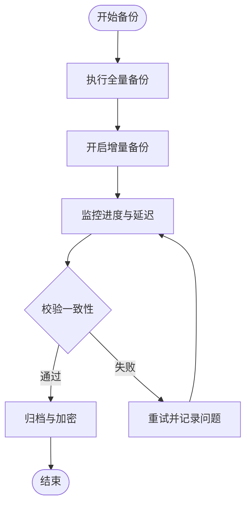
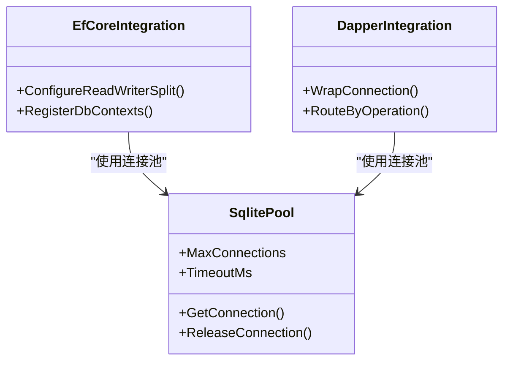
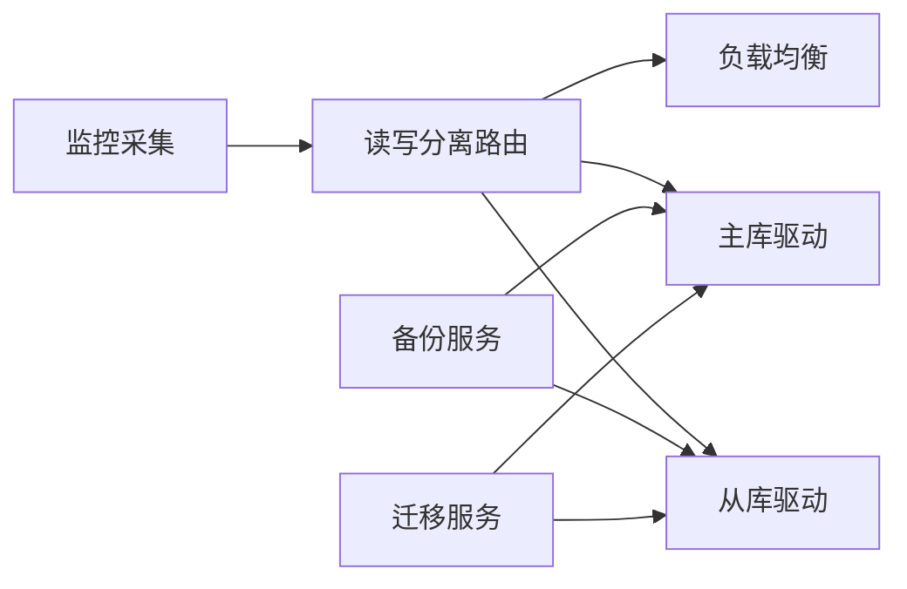

# 读写分离

<cite>
**本文引用的文件**   
- [read_write_split.cs](file://read_write_split.cs)
- [database_backup_service.cs](file://database_backup_service.cs)
- [history_restore_service.cs](file://history_restore_service.cs)
- [incremental_backup.cs](file://incremental_backup.cs)
- [mysql_to_sqlite_litedb_sync.cs](file://mysql_to_sqlite_litedb_sync.cs)
- [load_balancer.cs](file://load_balancer.cs)
- [metrics_monitoring.cs](file://metrics_monitoring.cs)
- [prometheus_metrics.cs](file://prometheus_metrics.cs)
- [datadog_prometheus.cs](file://datadog_prometheus.cs)
- [appinsights_prometheus.cs](file://appinsights_prometheus.cs)
- [performance_metrics.cs](file://performance_metrics.cs)
- [efcore9_integration.cs](file://efcore9_integration.cs)
- [efcore_dapper_integration.cs](file://efcore_dapper_integration.cs)
- [sqlite_connection_pool.cs](file://sqlite_connection_pool.cs)
- [connection_pool_optimization.cs](file://connection_pool_optimization.cs)
</cite>

## 目录
1. [简介](#简介)
2. [项目结构](#项目结构)
3. [核心组件](#核心组件)
4. [架构总览](#架构总览)
5. [详细组件分析](#详细组件分析)
6. [依赖关系分析](#依赖关系分析)
7. [性能考量](#性能考量)
8. [故障排查指南](#故障排查指南)
9. [结论](#结论)
10. [附录](#附录)

## 简介
本文件面向需要在系统中实现“读写分离”的工程师与架构师，围绕主从数据库配置、路由策略、数据同步机制、中间件式数据源切换、负载均衡、一致性保证、延迟处理、故障转移、监控告警、性能分析与容量规划、备份恢复、数据迁移与扩容等主题进行系统化说明。文档以仓库中已有的读写分离示例与相关基础设施为线索，结合通用工程实践给出可落地的方案建议与图示。

## 项目结构
仓库中包含读写分离的核心示例与配套能力：
- 读写分离示例与路由逻辑位于根目录的示例文件中
- 备份与恢复、增量备份、历史恢复服务提供数据保护与回滚能力
- 跨库同步脚本/示例支持异构数据源之间的数据迁移
- 负载均衡器与指标采集组件支撑高可用与可观测性
- EF Core/Dapper/SQLite 连接池等示例展示不同持久化栈的集成方式

[本图为概念图，不直接映射具体源码文件]

## 核心组件
- 读写分离路由与数据源切换：通过中间件或拦截器根据操作类型（读/写）选择目标数据源，并支持按租户、标签、权重等维度扩展路由策略
- 负载均衡与健康检查：对多个从库实例进行健康探测与动态权重调整，避免热点与单点故障
- 数据同步与一致性：基于主从复制、CDC 或消息队列保障最终一致；必要时引入补偿与重试
- 监控告警与性能分析：采集连接池、慢查询、错误率、延迟分位等指标，联动告警规则
- 备份恢复与迁移：全量/增量备份、在线迁移、灰度切换与回滚策略

**章节来源**
- [read_write_split.cs](file://read_write_split.cs)
- [load_balancer.cs](file://load_balancer.cs)
- [metrics_monitoring.cs](file://metrics_monitoring.cs)
- [prometheus_metrics.cs](file://prometheus_metrics.cs)
- [datadog_prometheus.cs](file://datadog_prometheus.cs)
- [appinsights_prometheus.cs](file://appinsights_prometheus.cs)
- [performance_metrics.cs](file://performance_metrics.cs)
- [database_backup_service.cs](file://database_backup_service.cs)
- [history_restore_service.cs](file://history_restore_service.cs)
- [incremental_backup.cs](file://incremental_backup.cs)
- [mysql_to_sqlite_litedb_sync.cs](file://mysql_to_sqlite_litedb_sync.cs)

## 架构总览
下图展示了读写分离的整体架构与关键交互：应用通过路由层将读请求分发到从库集群，写请求定向到主库；监控与指标系统采集运行态数据；备份与迁移服务确保数据安全与可演进。

**图表来源**
- [read_write_split.cs](file://read_write_split.cs)
- [load_balancer.cs](file://load_balancer.cs)
- [metrics_monitoring.cs](file://metrics_monitoring.cs)
- [prometheus_metrics.cs](file://prometheus_metrics.cs)
- [database_backup_service.cs](file://database_backup_service.cs)

**章节来源**
- [read_write_split.cs](file://read_write_split.cs)
- [load_balancer.cs](file://load_balancer.cs)
- [metrics_monitoring.cs](file://metrics_monitoring.cs)
- [prometheus_metrics.cs](file://prometheus_metrics.cs)
- [database_backup_service.cs](file://database_backup_service.cs)

## 详细组件分析

### 读写分离路由与数据源切换
- 路由策略
  - 按操作类型：读走从库，写走主库
  - 按上下文：租户ID、业务域、标签等维度选择数据源
  - 按权重/健康：结合负载均衡器的实时健康状态与权重分配
- 数据源切换
  - 在中间件/拦截器层面完成连接对象或命令对象的替换
  - 支持事务边界内的强制写路径，避免误读未提交数据
- 典型流程

**图表来源**
- [read_write_split.cs](file://read_write_split.cs)
- [load_balancer.cs](file://load_balancer.cs)

**章节来源**
- [read_write_split.cs](file://read_write_split.cs)
- [load_balancer.cs](file://load_balancer.cs)

### 负载均衡与健康检查
- 健康检查
  - 周期性探测从库连通性与延迟阈值
  - 失败次数阈值与熔断退避策略
- 负载策略
  - 轮询、加权轮询、最少连接、延迟感知等
  - 动态权重调整：根据 QPS、CPU、IO 等待等指标调节
- 故障转移
  - 自动剔除不健康节点，恢复后自动加入
  - 灰度切流与快速回滚

**图表来源**
- [load_balancer.cs](file://load_balancer.cs)

**章节来源**
- [load_balancer.cs](file://load_balancer.cs)

### 数据同步与一致性
- 同步机制
  - 主从复制：基于数据库原生复制（如 MySQL Binlog）
  - CDC：捕获变更事件，投递至下游消费端
  - 消息队列：异步解耦，支持重试与死信
- 一致性策略
  - 强一致：写后读强制走主库（影响性能）
  - 最终一致：读从库，配合缓存失效与补偿任务
  - 幂等与去重：基于唯一键与幂等表
- 延迟处理
  - 读超时与重试上限
  - 热点键本地缓存与过期策略
  - 关键读路径可配置“读主”兜底

**图表来源**
- [mysql_to_sqlite_litedb_sync.cs](file://mysql_to_sqlite_litedb_sync.cs)

**章节来源**
- [mysql_to_sqlite_litedb_sync.cs](file://mysql_to_sqlite_litedb_sync.cs)

### 监控告警与性能分析
- 指标采集
  - 连接池使用率、活跃连接数、等待时间
  - 慢查询数量、P95/P99 延迟、错误率
  - 从库复制延迟、主从差异统计
- 可视化与告警
  - Prometheus/Grafana 面板
  - 告警规则：延迟突增、错误率飙升、复制延迟过大
- 链路追踪
  - 分布式追踪标注读写路径与数据源选择原因

**图表来源**
- [metrics_monitoring.cs](file://metrics_monitoring.cs)
- [prometheus_metrics.cs](file://prometheus_metrics.cs)
- [datadog_prometheus.cs](file://datadog_prometheus.cs)
- [appinsights_prometheus.cs](file://appinsights_prometheus.cs)
- [performance_metrics.cs](file://performance_metrics.cs)

**章节来源**
- [metrics_monitoring.cs](file://metrics_monitoring.cs)
- [prometheus_metrics.cs](file://prometheus_metrics.cs)
- [datadog_prometheus.cs](file://datadog_prometheus.cs)
- [appinsights_prometheus.cs](file://appinsights_prometheus.cs)
- [performance_metrics.cs](file://performance_metrics.cs)

### 备份恢复与数据迁移
- 备份策略
  - 全量备份：定期快照，异地多副本
  - 增量备份：基于 Binlog/CDC 的连续归档
- 恢复流程
  - 全量恢复 + 增量回放
  - 验证与演练：自动化校验一致性
- 数据迁移
  - 在线迁移：双写/灰度切流/回滚预案
  - 异构迁移：MySQL -> SQLite/LiteDB 等示例

**图表来源**
- [database_backup_service.cs](file://database_backup_service.cs)
- [history_restore_service.cs](file://history_restore_service.cs)
- [incremental_backup.cs](file://incremental_backup.cs)

**章节来源**
- [database_backup_service.cs](file://database_backup_service.cs)
- [history_restore_service.cs](file://history_restore_service.cs)
- [incremental_backup.cs](file://incremental_backup.cs)
- [mysql_to_sqlite_litedb_sync.cs](file://mysql_to_sqlite_litedb_sync.cs)

### 持久化栈集成示例
- EF Core / Dapper：演示在不同 ORM/微ORM 下接入读写分离
- SQLite 连接池：优化并发与资源占用
- 连接池优化：减少握手开销、复用连接、合理设置超时

**图表来源**
- [efcore9_integration.cs](file://efcore9_integration.cs)
- [efcore_dapper_integration.cs](file://efcore_dapper_integration.cs)
- [sqlite_connection_pool.cs](file://sqlite_connection_pool.cs)
- [connection_pool_optimization.cs](file://connection_pool_optimization.cs)

**章节来源**
- [efcore9_integration.cs](file://efcore9_integration.cs)
- [efcore_dapper_integration.cs](file://efcore_dapper_integration.cs)
- [sqlite_connection_pool.cs](file://sqlite_connection_pool.cs)
- [connection_pool_optimization.cs](file://connection_pool_optimization.cs)

## 依赖关系分析
- 组件耦合
  - 路由层依赖负载均衡器与健康检查模块
  - 监控子系统独立于业务，通过指标接口采集
  - 备份/恢复与迁移服务与数据库驱动解耦
- 外部依赖
  - 数据库驱动（MySQL/PostgreSQL/SQLite 等）
  - 指标平台（Prometheus/Grafana/ADX）
  - 消息队列/CDC 工具（Kafka/Canal/Debezium 等）

**图表来源**
- [read_write_split.cs](file://read_write_split.cs)
- [load_balancer.cs](file://load_balancer.cs)
- [metrics_monitoring.cs](file://metrics_monitoring.cs)
- [database_backup_service.cs](file://database_backup_service.cs)
- [mysql_to_sqlite_litedb_sync.cs](file://mysql_to_sqlite_litedb_sync.cs)

**章节来源**
- [read_write_split.cs](file://read_write_split.cs)
- [load_balancer.cs](file://load_balancer.cs)
- [metrics_monitoring.cs](file://metrics_monitoring.cs)
- [database_backup_service.cs](file://database_backup_service.cs)
- [mysql_to_sqlite_litedb_sync.cs](file://mysql_to_sqlite_litedb_sync.cs)

## 性能考量
- 连接池调优
  - 最大连接数、最小空闲连接、连接超时与获取超时
  - 长事务与短事务混合场景下的池大小估算
- 查询优化
  - 索引与覆盖索引、分页与排序优化
  - 批量操作与合并请求
- 缓存策略
  - 多级缓存（本地+分布式），热点键隔离
  - 缓存穿透/雪崩防护与一致性控制
- 限流与降级
  - 读路径限流、写路径削峰
  - 非关键读降级到只读模式或返回默认值

[本节为通用指导，不直接分析具体文件]

## 故障排查指南
- 常见问题
  - 读不到最新数据：检查复制延迟、缓存失效、读主兜底开关
  - 从库不可用：健康检查失败、网络抖动、权限不足
  - 连接池耗尽：慢查询、长事务、连接泄漏
  - 指标异常：采集端口被占、权限不足、序列化失败
- 定位手段
  - 查看慢查询日志与执行计划
  - 检查连接池指标与线程堆栈
  - 追踪读写路径与数据源选择原因
  - 核对备份/恢复任务的进度与错误日志

**章节来源**
- [metrics_monitoring.cs](file://metrics_monitoring.cs)
- [prometheus_metrics.cs](file://prometheus_metrics.cs)
- [performance_metrics.cs](file://performance_metrics.cs)

## 结论
读写分离通过清晰的路由与负载均衡机制显著提升读吞吐与可用性，同时需要完善的监控、备份与迁移能力保障稳定性与可演进性。建议在实施时遵循“先易后难、逐步演进”的原则：先实现基础路由与监控，再引入健康检查、动态权重、CDC 同步与灰度迁移，最后完善告警与容量规划。

[本节为总结，不直接分析具体文件]

## 附录
- 配置清单（示例项）
  - 主库连接串、从库列表与权重
  - 健康检查间隔、超时与失败阈值
  - 连接池大小、超时与重试策略
  - 监控指标上报地址与采样频率
  - 备份周期、保留策略与加密选项
- 最佳实践
  - 所有写路径必须经过事务边界与审计日志
  - 读路径允许短暂不一致，但需有兜底与补偿
  - 变更操作采用灰度发布与快速回滚
  - 定期演练备份恢复与故障切换

[本节为补充信息，不直接分析具体文件]