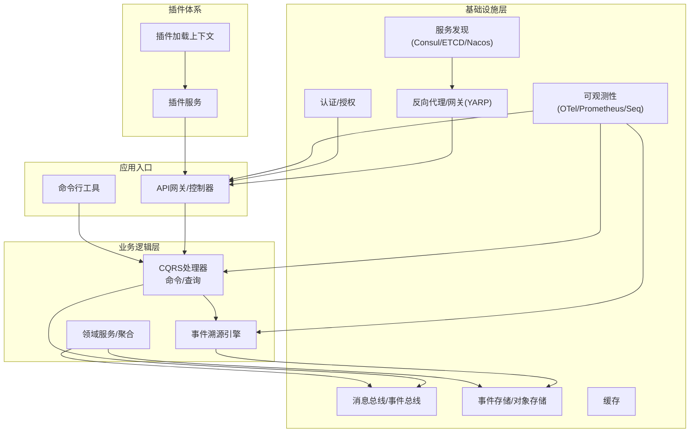
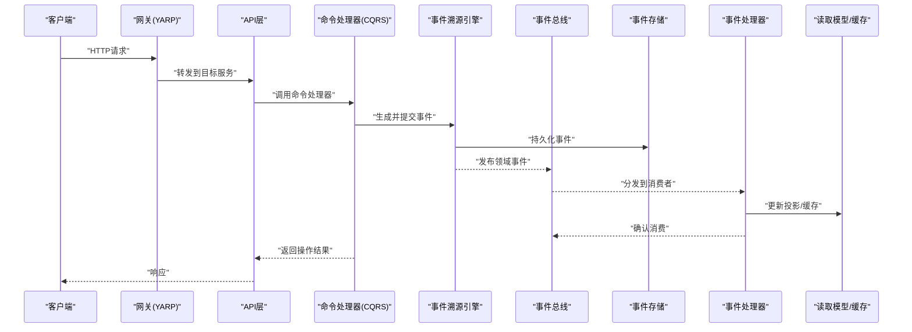
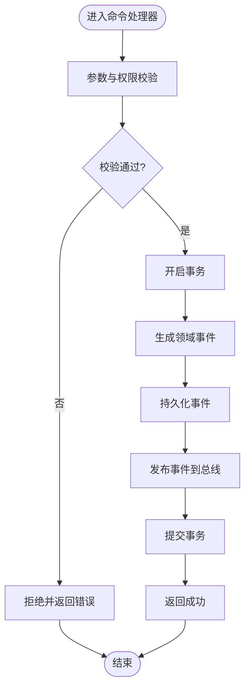
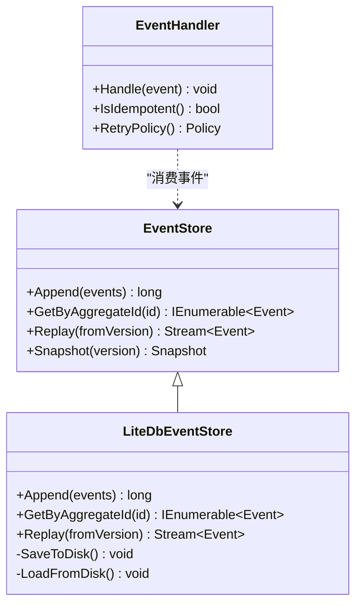
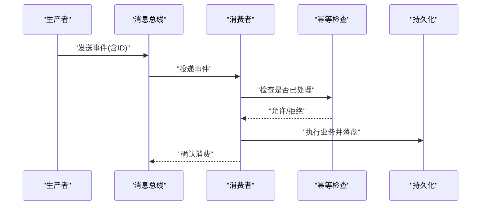
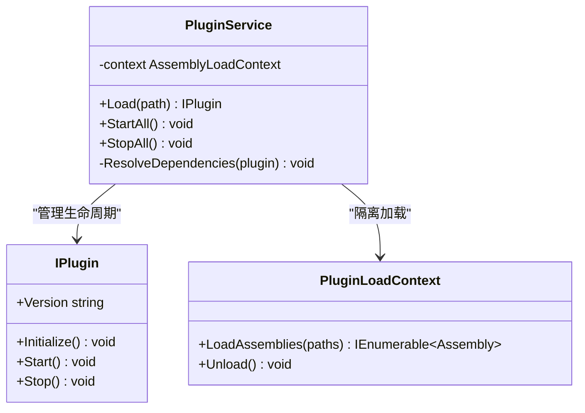
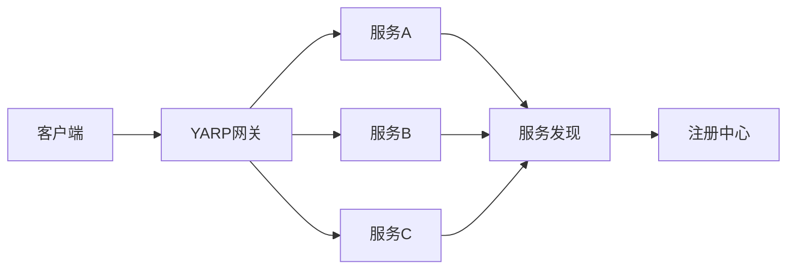
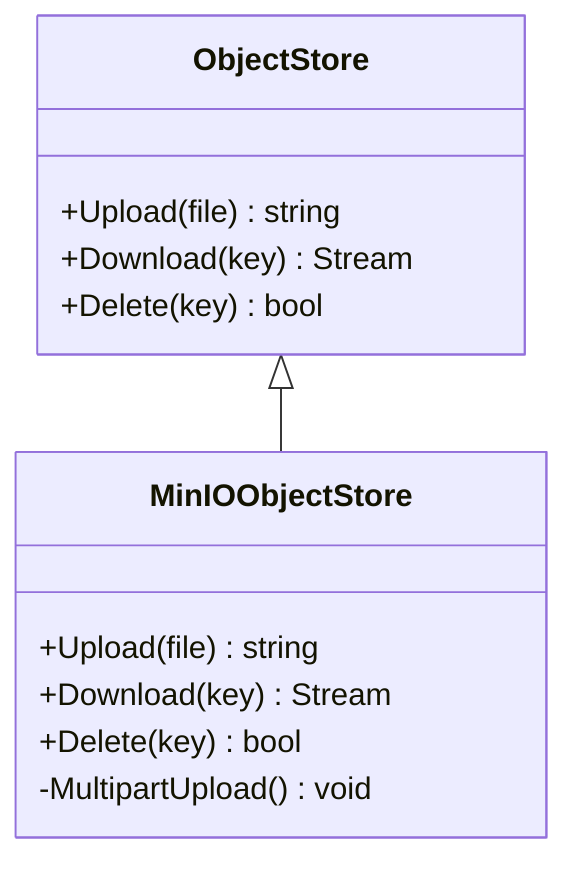
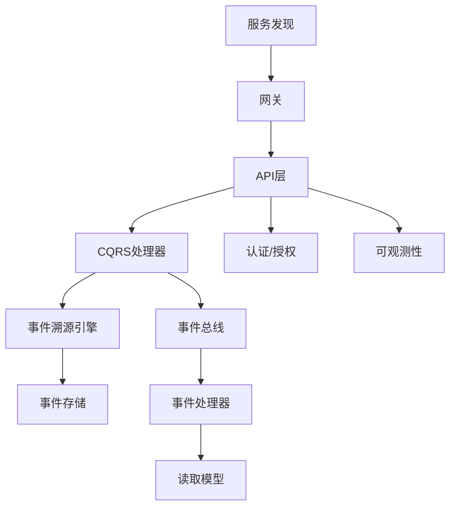

# 架构设计

<cite>
**本文引用的文件**   
- [README.md](file://README.md)
- [Directory.Build.props](file://Directory.Build.props)
- [Directory.Packages.props](file://Directory.Packages.props)
- [global.json](file://global.json)
- [appsettings.json](file://appsettings.json)
- [PluginLoadContext.cs](file://PluginLoadContext.cs)
- [plugin_service.cs](file://plugin_service.cs)
- [vertical_slice_architecture.cs](file://vertical_slice_architecture.cs)
- [cqrs_impl.cs](file://cqrs_impl.cs)
- [cqrs_processor.cs](file://cqrs_processor.cs)
- [event_sourcing_processor.cs](file://event_sourcing_processor.cs)
- [eventsourcing_service.cs](file://eventsourcing_service.cs)
- [eventstore_service.cs](file://eventstore_service.cs)
- [litedb_event_sourcing.cs](file://litedb_event_sourcing.cs)
- [litedb_eventstore.cs](file://litedb_eventstore.cs)
- [litedb_eventbus.cs](file://litedb_eventbus.cs)
- [litedb_eventhandlers.cs](file://litedb_eventhandlers.cs)
- [distributed_bus.cs](file://distributed_bus.cs)
- [masstransit_integration.cs](file://masstransit_integration.cs)
- [wolverine_cqrs.cs](file://wolverine_cqrs.cs)
- [wolverine_event_bus.cs](file://wolverine_event_bus.cs)
- [minio_vsa.cs](file://minio_vsa.cs)
- [database_backup_service.cs](file://database_backup_service.cs)
- [history_restore_service.cs](file://history_restore_service.cs)
- [opentelemetry_integration.cs](file://opentelemetry_integration.cs)
- [prometheus_metrics.cs](file://prometheus_metrics.cs)
- [datadog_logging.cs](file://datadog_logging.cs)
- [serilog_integration.cs](file://serilog_integration.cs)
- [securityheaders_integration.cs](file://securityheaders_integration.cs)
- [auth_integration.cs](file://auth_integration.cs)
- [keycloak_service.cs](file://keycloak_service.cs)
- [openiddict_service.cs](file://openiddict_service.cs)
- [casbin_integration.cs](file://casbin_integration.cs)
- [abac_attribute_based_access.cs](file://abac_attribute_based_access.cs)
- [yarp_integration.cs](file://yarp_integration.cs)
- [service_discovery_integration.cs](file://service_discovery_integration.cs)
- [consul_integration.cs](file://consul_integration.cs)
- [etcd_integration.cs](file://etcd_integration.cs)
- [nacos_integration.cs](file://nacos_integration.cs)
- [resilient_polly_integration.cs](file://resilient_polly_integration.cs)
- [http_resilience_integration.cs](file://http_resilience_integration.cs)
- [rate_limiter.cs](file://rate_limiter.cs)
- [circuit_breaker.cs](file://yarp_circuit_breaker.cs)
</cite>

## 目录
1. [引言](#引言)
2. [项目结构](#项目结构)
3. [核心组件](#核心组件)
4. [架构总览](#架构总览)
5. [详细组件分析](#详细组件分析)
6. [依赖关系分析](#依赖关系分析)
7. [性能考量](#性能考量)
8. [故障排查指南](#故障排查指南)
9. [结论](#结论)
10. [附录](#附录)

## 引言
本架构设计文档面向VSA项目的整体设计与实现，围绕分层架构、模块化与插件化、CQRS与事件溯源、微服务治理等核心主题展开。文档旨在帮助读者快速理解系统上下文、组件职责、数据流向与集成模式，并给出安全性、监控、可观测性与灾难恢复等横切关注点的落地方案与权衡建议。

## 项目结构
VSA采用“以能力为中心”的模块化组织方式，结合垂直切片思想与插件化扩展点，形成清晰的边界与低耦合的协作关系：
- 基础设施层：提供配置、日志、指标、链路追踪、消息总线、存储、缓存、安全认证授权、服务发现与网关等通用能力。
- 业务逻辑层：基于CQRS与事件溯源组织领域能力，通过命令/查询处理器、事件处理器与聚合根驱动业务流程。
- 数据访问层：封装持久化细节（关系型/NoSQL/对象存储），对外暴露仓储与事件存储接口。
- 插件体系：通过自定义加载上下文与插件服务，支持运行时动态装配与隔离。

图表来源
- [vertical_slice_architecture.cs:1-120](file://vertical_slice_architecture.cs#L1-L120)
- [plugin_service.cs:1-120](file://plugin_service.cs#L1-L120)
- [yarp_integration.cs:1-120](file://yarp_integration.cs#L1-L120)
- [service_discovery_integration.cs:1-120](file://service_discovery_integration.cs#L1-L120)

章节来源
- [README.md:1-200](file://README.md#L1-L200)
- [vertical_slice_architecture.cs:1-120](file://vertical_slice_architecture.cs#L1-L120)
- [plugin_service.cs:1-120](file://plugin_service.cs#L1-L120)

## 核心组件
- CQRS处理器：将读/写分离，命令经管道校验、鉴权、事务后写入事件源；查询直接命中优化后的读取模型或缓存。
- 事件溯源引擎：以不可变事件序列作为唯一事实源，支持重放、快照与投影构建。
- 事件总线：统一发布/订阅机制，支持本地与分布式实现，保障至少一次投递与幂等处理。
- 插件服务：定义插件契约、生命周期管理与隔离加载，支持热插拔与版本兼容。
- 存储抽象：事件存储、对象存储与关系型数据库的统一抽象，便于替换与扩展。
- 可观测性：OpenTelemetry、Prometheus、Serilog/Seq等组合，覆盖请求链路、业务指标与结构化日志。
- 安全与权限：JWT/OIDC、ABAC策略、敏感头防护与加密传输。
- 网关与服务发现：YARP反向代理、Consul/ETCD/Nacos注册与发现，配合熔断限流提升韧性。

章节来源
- [cqrs_impl.cs:1-200](file://cqrs_impl.cs#L1-L200)
- [cqrs_processor.cs:1-200](file://cqrs_processor.cs#L1-L200)
- [event_sourcing_processor.cs:1-200](file://event_sourcing_processor.cs#L1-L200)
- [eventsourcing_service.cs:1-200](file://eventsourcing_service.cs#L1-L200)
- [eventstore_service.cs:1-200](file://eventstore_service.cs#L1-L200)
- [litedb_event_sourcing.cs:1-200](file://litedb_event_sourcing.cs#L1-L200)
- [litedb_eventstore.cs:1-200](file://litedb_eventstore.cs#L1-L200)
- [litedb_eventbus.cs:1-200](file://litedb_eventbus.cs#L1-L200)
- [litedb_eventhandlers.cs:1-200](file://litedb_eventhandlers.cs#L1-L200)
- [distributed_bus.cs:1-200](file://distributed_bus.cs#L1-L200)
- [plugin_service.cs:1-200](file://plugin_service.cs#L1-L200)
- [PluginLoadContext.cs:1-200](file://PluginLoadContext.cs#L1-L200)

## 架构总览
下图展示VSA的整体架构与关键交互路径，包括请求进入、命令处理、事件发布、存储落盘与异步消费的全链路。

图表来源
- [cqrs_impl.cs:1-200](file://cqrs_impl.cs#L1-L200)
- [cqrs_processor.cs:1-200](file://cqrs_processor.cs#L1-L200)
- [event_sourcing_processor.cs:1-200](file://event_sourcing_processor.cs#L1-L200)
- [litedb_eventstore.cs:1-200](file://litedb_eventstore.cs#L1-L200)
- [litedb_eventbus.cs:1-200](file://litedb_eventbus.cs#L1-L200)
- [litedb_eventhandlers.cs:1-200](file://litedb_eventhandlers.cs#L1-L200)
- [yarp_integration.cs:1-120](file://yarp_integration.cs#L1-L120)

## 详细组件分析

### CQRS与命令/查询处理
- 命令路径：校验→鉴权→事务→生成事件→持久化→发布事件→返回结果。
- 查询路径：优先命中缓存/物化视图，未命中则回退到数据库并回填缓存。
- 处理器管道：可插拔中间件（审计、限流、重试、幂等）。

图表来源
- [cqrs_impl.cs:1-200](file://cqrs_impl.cs#L1-L200)
- [cqrs_processor.cs:1-200](file://cqrs_processor.cs#L1-L200)

章节来源
- [cqrs_impl.cs:1-200](file://cqrs_impl.cs#L1-L200)
- [cqrs_processor.cs:1-200](file://cqrs_processor.cs#L1-L200)

### 事件溯源与事件存储
- 事件存储：以追加式不可变事件为核心，支持按聚合ID回放、快照压缩与一致性保证。
- LiteDB实现：轻量级嵌入式文档存储，适合单机或小规模场景；生产环境可替换为高性能事件库。
- 事件处理器：解耦副作用，支持幂等、重试与死信队列。

图表来源
- [litedb_eventstore.cs:1-200](file://litedb_eventstore.cs#L1-L200)
- [litedb_event_sourcing.cs:1-200](file://litedb_event_sourcing.cs#L1-L200)
- [litedb_eventhandlers.cs:1-200](file://litedb_eventhandlers.cs#L1-L200)

章节来源
- [event_sourcing_processor.cs:1-200](file://event_sourcing_processor.cs#L1-L200)
- [eventsourcing_service.cs:1-200](file://eventsourcing_service.cs#L1-L200)
- [eventstore_service.cs:1-200](file://eventstore_service.cs#L1-L200)
- [litedb_event_sourcing.cs:1-200](file://litedb_event_sourcing.cs#L1-L200)
- [litedb_eventstore.cs:1-200](file://litedb_eventstore.cs#L1-L200)
- [litedb_eventhandlers.cs:1-200](file://litedb_eventhandlers.cs#L1-L200)

### 事件总线与分布式消息
- 本地总线：内存队列+事件处理器，适用于进程内解耦。
- 分布式总线：基于MassTransit/Kafka/RabbitMQ等，提供可靠投递、顺序性与分区语义。
- 幂等与去重：基于事件ID与幂等表/布隆过滤器避免重复处理。

图表来源
- [distributed_bus.cs:1-200](file://distributed_bus.cs#L1-L200)
- [masstransit_integration.cs:1-200](file://masstransit_integration.cs#L1-L200)
- [litedb_eventbus.cs:1-200](file://litedb_eventbus.cs#L1-L200)

章节来源
- [distributed_bus.cs:1-200](file://distributed_bus.cs#L1-L200)
- [masstransit_integration.cs:1-200](file://masstransit_integration.cs#L1-L200)
- [litedb_eventbus.cs:1-200](file://litedb_eventbus.cs#L1-L200)

### 插件化架构
- 插件契约：定义IPlugin接口与生命周期钩子（初始化、启动、停止）。
- 加载上下文：使用自定义AssemblyLoadContext实现隔离加载与版本管理。
- 插件服务：扫描、实例化、依赖注入与错误隔离，支持热更新与灰度发布。

图表来源
- [plugin_service.cs:1-200](file://plugin_service.cs#L1-L200)
- [PluginLoadContext.cs:1-200](file://PluginLoadContext.cs#L1-L200)

章节来源
- [plugin_service.cs:1-200](file://plugin_service.cs#L1-L200)
- [PluginLoadContext.cs:1-200](file://PluginLoadContext.cs#L1-L200)

### 微服务与网关
- 网关：YARP统一入口，负责路由、鉴权、限流、压缩与链路追踪。
- 服务发现：Consul/ETCD/Nacos动态注册与负载均衡。
- 韧性：Polly重试、熔断、超时与降级策略。

图表来源
- [yarp_integration.cs:1-120](file://yarp_integration.cs#L1-L120)
- [service_discovery_integration.cs:1-120](file://service_discovery_integration.cs#L1-L120)
- [consul_integration.cs:1-120](file://consul_integration.cs#L1-L120)
- [etcd_integration.cs:1-120](file://etcd_integration.cs#L1-L120)
- [nacos_integration.cs:1-120](file://nacos_integration.cs#L1-L120)
- [resilient_polly_integration.cs:1-120](file://resilient_polly_integration.cs#L1-L120)
- [http_resilience_integration.cs:1-120](file://http_resilience_integration.cs#L1-L120)

章节来源
- [yarp_integration.cs:1-120](file://yarp_integration.cs#L1-L120)
- [service_discovery_integration.cs:1-120](file://service_discovery_integration.cs#L1-L120)
- [consul_integration.cs:1-120](file://consul_integration.cs#L1-L120)
- [etcd_integration.cs:1-120](file://etcd_integration.cs#L1-L120)
- [nacos_integration.cs:1-120](file://nacos_integration.cs#L1-L120)
- [resilient_polly_integration.cs:1-120](file://resilient_polly_integration.cs#L1-L120)
- [http_resilience_integration.cs:1-120](file://http_resilience_integration.cs#L1-L120)

### 存储与对象存储
- 事件存储：LiteDB用于原型与小规模；生产可替换为专用事件库。
- 对象存储：MinIO用于文件/二进制对象存取，支持分片上传与进度回调。

图表来源
- [minio_vsa.cs:1-200](file://minio_vsa.cs#L1-L200)

章节来源
- [minio_vsa.cs:1-200](file://minio_vsa.cs#L1-L200)

### Wolverine与CQRS增强
- Wolverine提供内置的消息调度、CQRS管道与可靠性特性，可与现有CQRS实现互补。
- 事件总线与Outbox模式简化分布式事务。

章节来源
- [wolverine_cqrs.cs:1-200](file://wolverine_cqrs.cs#L1-L200)
- [wolverine_event_bus.cs:1-200](file://wolverine_event_bus.cs#L1-L200)

## 依赖关系分析
- 模块内聚：CQRS、事件溯源、事件总线各自职责清晰，依赖方向单一。
- 外部依赖：消息总线、存储、网关、服务发现、可观测性等通过接口抽象，便于替换。
- 潜在循环：插件系统与业务层通过契约解耦，避免直接引用。

图表来源
- [cqrs_impl.cs:1-200](file://cqrs_impl.cs#L1-L200)
- [event_sourcing_processor.cs:1-200](file://event_sourcing_processor.cs#L1-L200)
- [distributed_bus.cs:1-200](file://distributed_bus.cs#L1-L200)
- [yarp_integration.cs:1-120](file://yarp_integration.cs#L1-L120)
- [service_discovery_integration.cs:1-120](file://service_discovery_integration.cs#L1-L120)

章节来源
- [cqrs_impl.cs:1-200](file://cqrs_impl.cs#L1-L200)
- [event_sourcing_processor.cs:1-200](file://event_sourcing_processor.cs#L1-L200)
- [distributed_bus.cs:1-200](file://distributed_bus.cs#L1-L200)
- [yarp_integration.cs:1-120](file://yarp_integration.cs#L1-L120)
- [service_discovery_integration.cs:1-120](file://service_discovery_integration.cs#L1-L120)

## 性能考量
- 读写分离：查询走缓存/物化视图，降低热点库压力。
- 事件批处理：批量写入事件存储，减少IO抖动。
- 连接池与缓冲：数据库、Redis、消息客户端均启用连接池与合理缓冲。
- 序列化：选择高效序列化器（如MessagePack/ZeroFormatter）降低网络开销。
- 并发与背压：消费者侧设置并发上限与背压策略，防止雪崩。

[本节为通用指导，不直接分析具体文件]

## 故障排查指南
- 日志与追踪：集中式日志（Serilog/Seq）、分布式追踪（OpenTelemetry/Jaeger/Zipkin）定位问题。
- 指标与告警：Prometheus抓取关键指标，结合阈值告警与SLO监控。
- 备份与恢复：数据库定时备份与历史恢复服务，确保RTO/RPO达标。
- 安全加固：敏感头防护、HTTPS强制、密钥管理与最小权限原则。
- 韧性策略：重试、熔断、降级、限流与超时配置调优。

章节来源
- [opentelemetry_integration.cs:1-200](file://opentelemetry_integration.cs#L1-L200)
- [prometheus_metrics.cs:1-200](file://prometheus_metrics.cs#L1-L200)
- [datadog_logging.cs:1-200](file://datadog_logging.cs#L1-L200)
- [serilog_integration.cs:1-200](file://serilog_integration.cs#L1-L200)
- [database_backup_service.cs:1-200](file://database_backup_service.cs#L1-L200)
- [history_restore_service.cs:1-200](file://history_restore_service.cs#L1-L200)
- [securityheaders_integration.cs:1-200](file://securityheaders_integration.cs#L1-L200)
- [rate_limiter.cs:1-200](file://rate_limiter.cs#L1-L200)
- [resilient_polly_integration.cs:1-200](file://resilient_polly_integration.cs#L1-L200)
- [http_resilience_integration.cs:1-200](file://http_resilience_integration.cs#L1-L200)

## 结论
VSA以CQRS与事件溯源为核心，结合插件化与微服务治理，构建了高内聚、低耦合、可扩展且具备韧性的系统架构。通过明确的分层与职责划分、标准化的集成模式与完善的横切关注点方案，系统在可维护性、可观测性与弹性方面具备良好基础。后续可在事件存储升级、多活部署与AI能力融合等方面持续演进。

[本节为总结性内容，不直接分析具体文件]

## 附录
- 配置与环境：通过全局包管理与构建属性统一依赖与编译选项，应用配置集中于配置文件。
- 开发规范：代码风格与分析规则由全局配置文件约束，提升一致性与质量。

章节来源
- [Directory.Build.props:1-200](file://Directory.Build.props#L1-L200)
- [Directory.Packages.props:1-200](file://Directory.Packages.props#L1-L200)
- [global.json:1-200](file://global.json#L1-L200)
- [appsettings.json:1-200](file://appsettings.json#L1-L200)