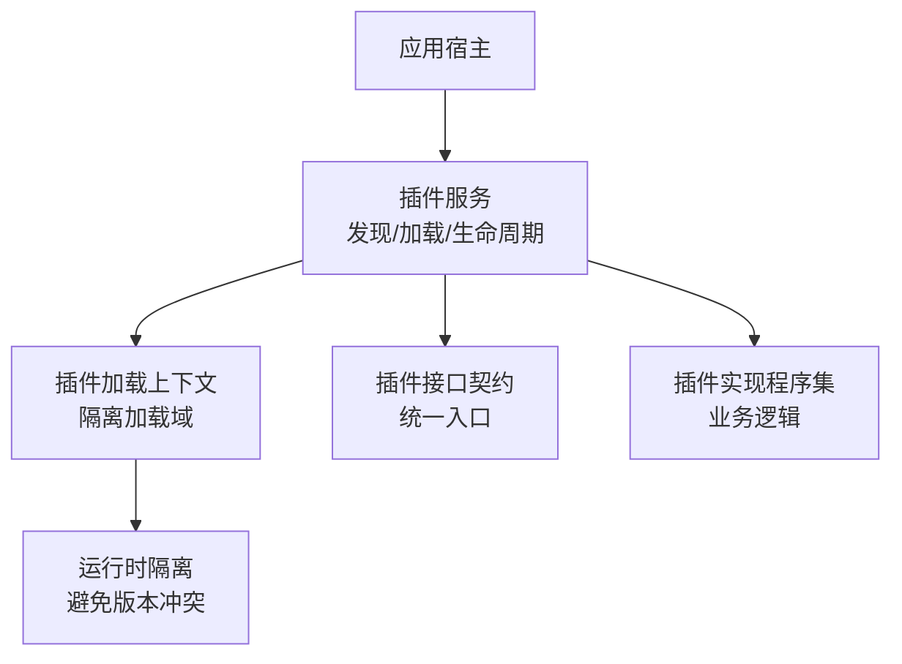
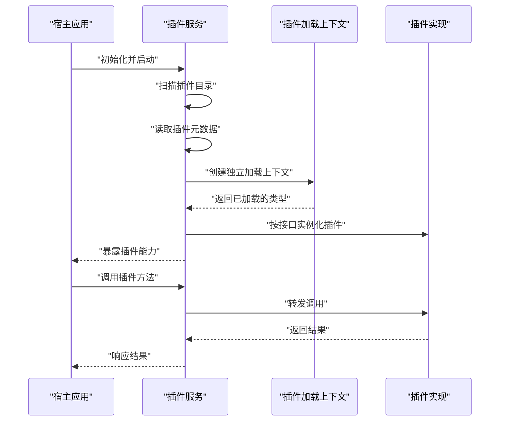
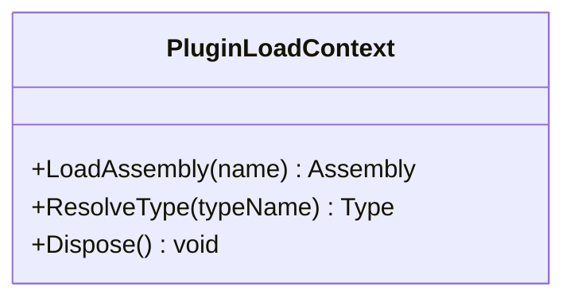
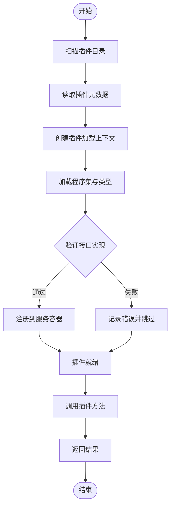
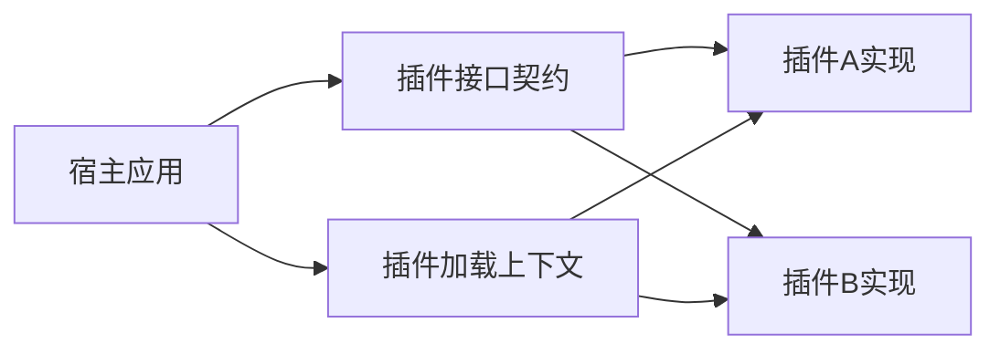

# 模块化设计

<cite>
**本文引用的文件**   
- [PluginLoadContext.cs](file://PluginLoadContext.cs)
- [plugin_service.cs](file://plugin_service.cs)
- [netpro_plugin_service.cs](file://netpro_plugin_service.cs)
- [oqtane_plugin_service.cs](file://oqtane_plugin_service.cs)
- [README.md](file://README.md)
</cite>

## 目录
1. [简介](#简介)
2. [项目结构](#项目结构)
3. [核心组件](#核心组件)
4. [架构总览](#架构总览)
5. [详细组件分析](#详细组件分析)
6. [依赖关系分析](#依赖关系分析)
7. [性能考量](#性能考量)
8. [故障排查指南](#故障排查指南)
9. [结论](#结论)
10. [附录](#附录)

## 简介
本文件围绕VSA项目的模块化与插件化架构进行系统化说明，重点阐述以下方面：
- 插件化设计理念：动态程序集加载、插件生命周期管理、依赖隔离
- 插件接口规范：定义与实现要求
- 插件注册、发现、加载与卸载流程
- 插件间通信机制与数据共享策略
- 可插拔功能模块的开发示例与实践建议

该文档旨在帮助读者快速理解并基于现有基础构建可扩展的插件生态。

## 项目结构
从仓库根目录可见，与插件化相关的核心代码集中在根目录的几个关键文件中，包括：
- 插件加载上下文：用于隔离不同插件的程序集加载环境
- 插件服务：负责插件的发现、生命周期管理与调用编排
- 多种插件框架集成示例：如NetPro、Oqtane等

图表来源
- [plugin_service.cs](file://plugin_service.cs)
- [PluginLoadContext.cs](file://PluginLoadContext.cs)

章节来源
- [README.md](file://README.md)

## 核心组件
- 插件加载上下文（PluginLoadContext）
  - 职责：为每个插件提供独立的程序集加载上下文，避免主应用与插件、插件与插件之间的类型冲突
  - 关键点：自定义解析策略、按需加载、资源隔离
- 插件服务（plugin_service）
  - 职责：扫描插件目录、识别插件元数据、实例化插件、维护生命周期、暴露统一调用入口
  - 关键点：插件发现策略、依赖注入集成、错误处理与回退
- 其他插件框架集成示例
  - NetPro插件服务：展示一种常见的插件容器模式
  - Oqtane插件服务：展示Web场景下的插件模型与生命周期

章节来源
- [PluginLoadContext.cs](file://PluginLoadContext.cs)
- [plugin_service.cs](file://plugin_service.cs)
- [netpro_plugin_service.cs](file://netpro_plugin_service.cs)
- [oqtane_plugin_service.cs](file://oqtane_plugin_service.cs)

## 架构总览
下图展示了插件化系统的高层交互：宿主通过插件服务发现并加载插件，插件在隔离上下文中运行，并通过统一接口与宿主及其他插件协作。

图表来源
- [plugin_service.cs](file://plugin_service.cs)
- [PluginLoadContext.cs](file://PluginLoadContext.cs)

## 详细组件分析

### 插件加载上下文（PluginLoadContext）
- 设计目标
  - 隔离加载：确保插件与其依赖不会污染宿主或其他插件的加载空间
  - 按需解析：仅加载插件声明所需的程序集，减少内存占用
  - 资源安全：限制对宿主资源的直接访问，提升稳定性
- 关键行为
  - 自定义程序集解析路径
  - 拦截默认加载器以控制加载顺序
  - 支持热更新时的上下文重建（视具体实现而定）

图表来源
- [PluginLoadContext.cs](file://PluginLoadContext.cs)

章节来源
- [PluginLoadContext.cs](file://PluginLoadContext.cs)

### 插件服务（plugin_service）
- 设计目标
  - 统一入口：对外暴露一致的插件管理能力
  - 生命周期管理：创建、启动、停止、销毁插件实例
  - 错误隔离：捕获插件异常，防止影响宿主稳定性
- 关键流程
  - 发现：扫描指定目录，识别插件程序集
  - 加载：使用插件加载上下文加载程序集与类型
  - 注册：将插件能力注册到DI或调度器
  - 调用：根据接口路由到对应插件实现
  - 卸载：释放资源，清理状态

图表来源
- [plugin_service.cs](file://plugin_service.cs)

章节来源
- [plugin_service.cs](file://plugin_service.cs)

### 其他插件框架集成示例
- NetPro插件服务（netpro_plugin_service）
  - 特点：面向.NET平台的轻量级插件容器，强调配置驱动与扩展点
  - 适用场景：中小型应用快速集成插件能力
- Oqtane插件服务（oqtane_plugin_service）
  - 特点：面向Web应用的插件模型，包含页面、组件、服务等丰富扩展点
  - 适用场景：Web平台的多租户与多主题扩展

章节来源
- [netpro_plugin_service.cs](file://netpro_plugin_service.cs)
- [oqtane_plugin_service.cs](file://oqtane_plugin_service.cs)

## 依赖关系分析
- 松耦合设计
  - 插件与服务之间通过接口契约解耦，避免强引用
  - 插件加载上下文隔离依赖，降低版本冲突风险
- 可能的循环依赖
  - 插件不应反向依赖宿主内部实现，应通过接口或服务总线通信
- 外部依赖
  - DI容器、日志、序列化等基础设施应由宿主提供，插件仅消费

图表来源
- [plugin_service.cs](file://plugin_service.cs)
- [PluginLoadContext.cs](file://PluginLoadContext.cs)

章节来源
- [plugin_service.cs](file://plugin_service.cs)
- [PluginLoadContext.cs](file://PluginLoadContext.cs)

## 性能考量
- 延迟加载：仅在首次使用时加载插件，减少启动时间
- 缓存类型解析：避免重复反射与查找
- 并发安全：插件实例的生命周期与线程模型需明确
- 资源释放：及时释放文件句柄、内存与托管资源

[本节为通用指导，不直接分析具体文件]

## 故障排查指南
- 常见问题
  - 插件未找到：检查扫描目录与命名约定
  - 类型解析失败：确认接口版本一致且程序集可被加载
  - 依赖冲突：使用插件加载上下文隔离依赖
  - 异常崩溃：捕获插件异常并记录堆栈，避免影响宿主
- 诊断建议
  - 启用详细日志，记录插件发现与加载过程
  - 提供健康检查端点，监控插件状态
  - 使用最小化复现用例定位问题

章节来源
- [plugin_service.cs](file://plugin_service.cs)
- [PluginLoadContext.cs](file://PluginLoadContext.cs)

## 结论
通过插件加载上下文与插件服务的协同，VSA项目实现了高内聚、低耦合的可扩展架构。插件接口契约明确了边界，生命周期管理保障了稳定性，依赖隔离避免了冲突。在此基础上，开发者可以高效地构建可插拔的功能模块，并通过统一的通信机制实现插件间的协作。

[本节为总结性内容，不直接分析具体文件]

## 附录
- 插件开发实践建议
  - 定义清晰的接口契约，保持向后兼容
  - 避免在插件中直接依赖宿主内部类型
  - 使用事件或消息总线进行插件间通信
  - 提供配置项与元数据，便于管理与升级
- 数据共享策略
  - 优先使用不可变对象传递数据
  - 对共享状态加锁或使用并发数据结构
  - 避免长连接与全局单例，降低内存泄漏风险

[本节为通用指导，不直接分析具体文件]