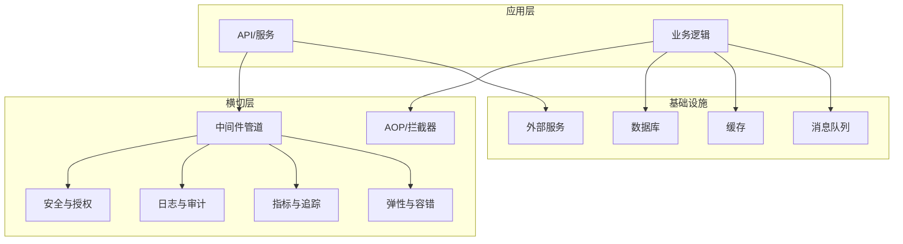
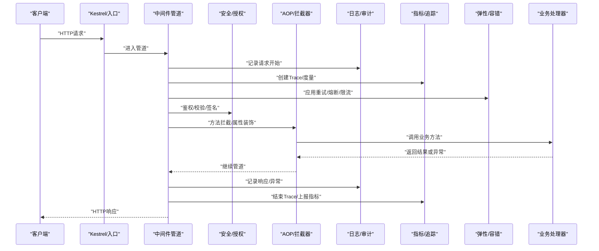
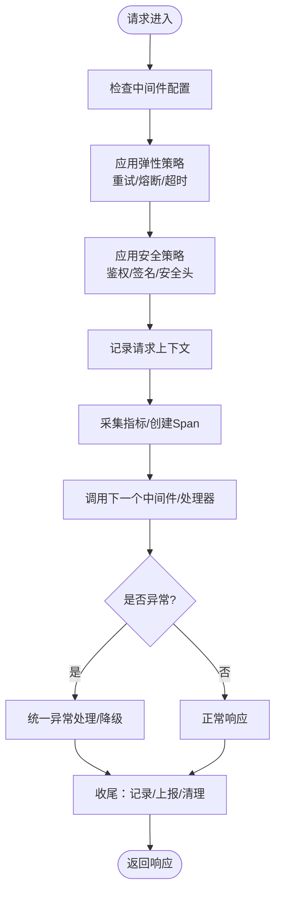
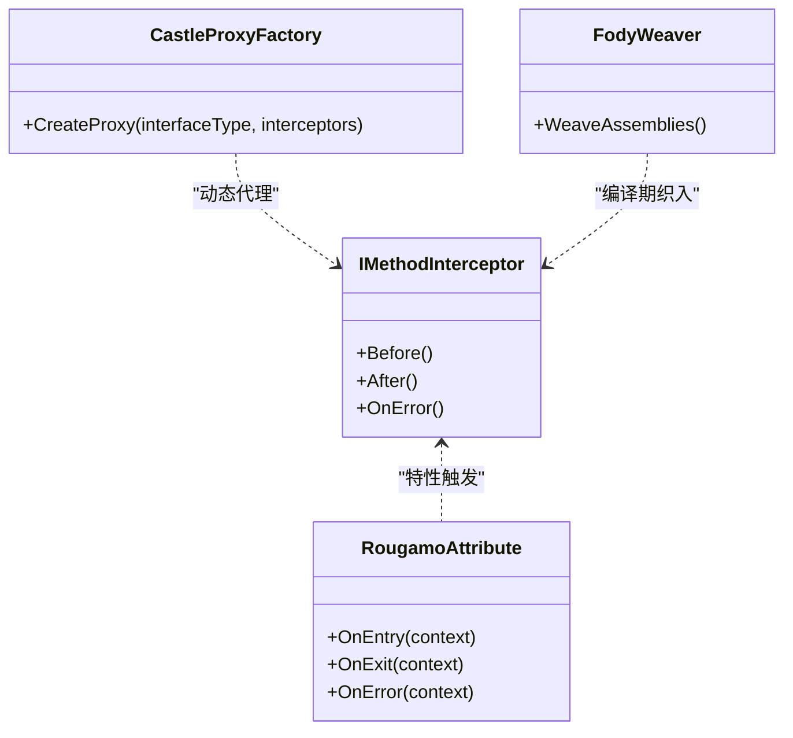
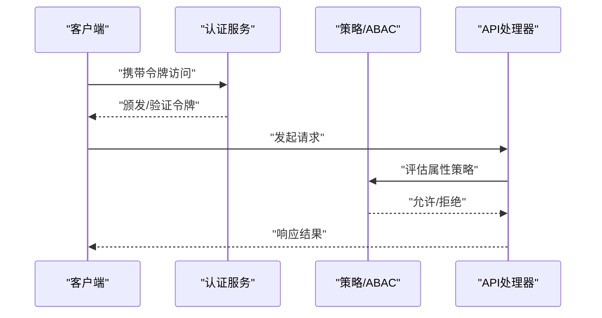
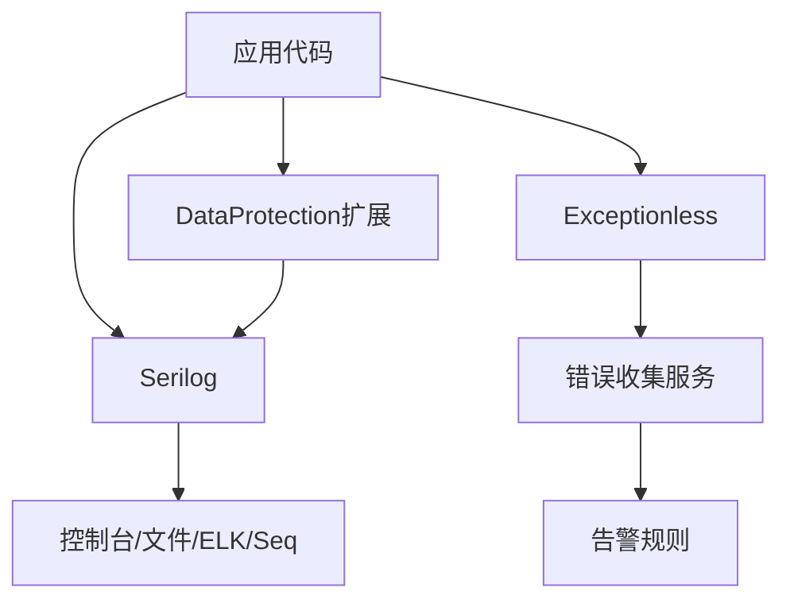
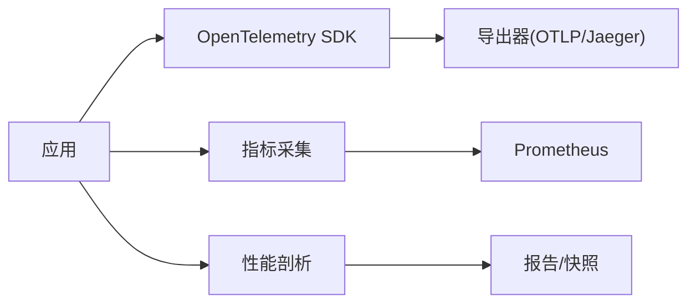
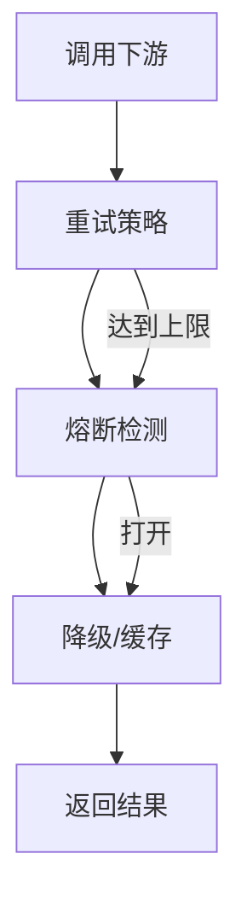
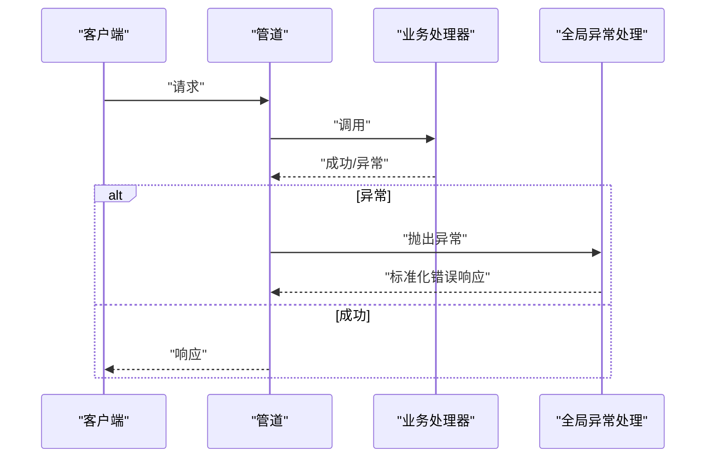
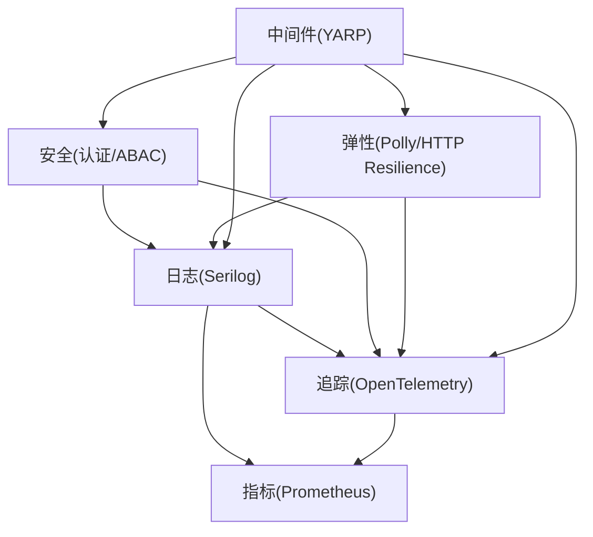

# 横切关注点处理

<cite>
**本文档引用的文件**   
- [README.md](file://README.md)
- [appsettings.json](file://appsettings.json)
- [Directory.Build.props](file://Directory.Build.props)
- [GlobalAnalyzerConfig.globalconfig](file://GlobalAnalyzerConfig.globalconfig)
- [performance_metrics.cs](file://performance_metrics.cs)
- [metrics_monitoring.cs](file://metrics_monitoring.cs)
- [distributed_tracing.cs](file://distributed_tracing.cs)
- [distributed_tracing_enhanced.cs](file://distributed_tracing_enhanced.cs)
- [distributed_tracing_profiler.cs](file://distributed_tracing_profiler.cs)
- [opentelemetry_integration.cs](file://opentelemetry_integration.cs)
- [prometheus_integration.cs](file://prometheus_integration.cs)
- [serilog_integration.cs](file://serilog_integration.cs)
- [logging_dataprotection_extensions.cs](file://logging_dataprotection_extensions.cs)
- [auth_integration.cs](file://auth_integration.cs)
- [securityheaders_integration.cs](file://securityheaders_integration.cs)
- [abac_attribute_based_access.cs](file://abac_attribute_based_access.cs)
- [rate_limiter.cs](file://rate_limiter.cs)
- [resilient_polly_integration.cs](file://resilient_polly_integration.cs)
- [http_resilience_integration.cs](file://http_resilience_integration.cs)
- [webapiclientcore_circuitbreaker.cs](file://webapiclientcore_circuitbreaker.cs)
- [webapiclientcore_circuitbreaker_enhanced.cs](file://webapiclientcore_circuitbreaker_enhanced.cs)
- [yarp_batch_middleware.cs](file://yarp_batch_middleware.cs)
- [yarp_signature_middleware.cs](file://yarp_signature_middleware.cs)
- [yarp_compression_middleware.cs](file://yarp_compression_middleware.cs)
- [yarp_circuit_breaker.cs](file://yarp_circuit_breaker.cs)
- [rougamo_integration.cs](file://rougamo_integration.cs)
- [castle_core_integration.cs](file://castle_core_integration.cs)
- [fody_integration.cs](file://fody_integration.cs)
- [tracing_extension.cs](file://tracing_extension.cs)
- [exceptionless_integration.cs](file://exceptionless_integration.cs)
- [alert_rules.cs](file://alert_rules.cs)
</cite>

## 目录
1. [简介](#简介)
2. [项目结构](#项目结构)
3. [核心组件](#核心组件)
4. [架构总览](#架构总览)
5. [详细组件分析](#详细组件分析)
6. [依赖关系分析](#依赖关系分析)
7. [性能考量](#性能考量)
8. [故障排查指南](#故障排查指南)
9. [结论](#结论)
10. [附录](#附录)

## 简介
本文件聚焦VSA项目的横切关注点（Cross-Cutting Concerns）处理，系统性阐述安全性、日志记录、监控追踪、弹性策略等通用能力的实现方式与扩展机制。文档覆盖中间件管道扩展、AOP方法拦截与属性装饰器、全局异常处理、请求响应拦截、性能监控等关键主题，并提供可视化架构图与流程图，帮助读者快速理解并落地实践。

## 项目结构
VSA仓库采用“示例/集成驱动”的组织方式：大量以“_integration.cs”结尾的文件演示不同技术栈的集成；同时提供若干通用能力文件（如指标、追踪、安全、弹性等）。横切关注点主要分布在以下位置：
- 应用配置与构建：appsettings.json、Directory.Build.props、GlobalAnalyzerConfig.globalconfig
- 日志与审计：Serilog、DataProtection、Exceptionless
- 监控与追踪：OpenTelemetry、Prometheus、自定义指标与分布式追踪
- 安全与访问控制：认证授权、安全头、ABAC
- 弹性与容错：Polly、HTTP Resilience、YARP 中间件
- AOP与拦截：Rougamo、Castle DynamicProxy、Fody

[本图为概念性结构图，不直接映射具体源码文件]

## 核心组件
- 日志与审计
  - Serilog集成：结构化日志、目标输出、过滤与采样
  - DataProtection扩展：日志脱敏、敏感信息保护
  - Exceptionless：集中式错误上报与告警
- 监控与追踪
  - OpenTelemetry：Traces/Metrics/Logs统一采集
  - Prometheus：指标暴露与抓取
  - 自定义指标与性能剖析：耗时统计、吞吐、错误率
- 安全与访问控制
  - 认证授权集成：JWT/OAuth2/OIDC等
  - 安全响应头：HSTS、CSP、X-Frame-Options等
  - ABAC：基于属性的访问控制
- 弹性与容错
  - Polly重试、熔断、退避、超时
  - HTTP Resilience：客户端侧弹性策略
  - YARP中间件：批处理、签名校验、压缩、熔断
- AOP与拦截
  - Rougamo：特性驱动的拦截器
  - Castle DynamicProxy：运行时代理与方法拦截
  - Fody：编译期织入，低开销横切

**章节来源**
- [appsettings.json](file://appsettings.json)
- [Directory.Build.props](file://Directory.Build.props)
- [GlobalAnalyzerConfig.globalconfig](file://GlobalAnalyzerConfig.globalconfig)

## 架构总览
下图展示了横切关注点在请求生命周期中的介入点与数据流向：

**图表来源**
- [yarp_batch_middleware.cs](file://yarp_batch_middleware.cs)
- [yarp_signature_middleware.cs](file://yarp_signature_middleware.cs)
- [yarp_compression_middleware.cs](file://yarp_compression_middleware.cs)
- [yarp_circuit_breaker.cs](file://yarp_circuit_breaker.cs)
- [tracing_extension.cs](file://tracing_extension.cs)
- [metrics_monitoring.cs](file://metrics_monitoring.cs)
- [performance_metrics.cs](file://performance_metrics.cs)

**章节来源**
- [yarp_batch_middleware.cs](file://yarp_batch_middleware.cs)
- [yarp_signature_middleware.cs](file://yarp_signature_middleware.cs)
- [yarp_compression_middleware.cs](file://yarp_compression_middleware.cs)
- [yarp_circuit_breaker.cs](file://yarp_circuit_breaker.cs)
- [tracing_extension.cs](file://tracing_extension.cs)
- [metrics_monitoring.cs](file://metrics_monitoring.cs)
- [performance_metrics.cs](file://performance_metrics.cs)

## 详细组件分析

### 中间件管道与扩展机制
- 设计要点
  - 通过中间件组合实现横切能力，顺序可控、职责单一
  - 支持注册阶段注入、运行时参数化、条件启用
  - 与YARP/Kestrel管道无缝衔接
- 典型中间件
  - 批处理：聚合请求、批量执行、合并响应
  - 签名校验：防重放、完整性校验、时间戳校验
  - 压缩：Gzip/Brotli按需压缩
  - 熔断：下游不可用时快速失败
- 自定义中间件编写与注册
  - 定义中间件类，实现Invoke/InvokeAsync
  - 在启动时按顺序注册，注意前置后置逻辑
  - 使用IConfiguration读取配置，支持热更新

**图表来源**
- [yarp_batch_middleware.cs](file://yarp_batch_middleware.cs)
- [yarp_signature_middleware.cs](file://yarp_signature_middleware.cs)
- [yarp_compression_middleware.cs](file://yarp_compression_middleware.cs)
- [yarp_circuit_breaker.cs](file://yarp_circuit_breaker.cs)

**章节来源**
- [yarp_batch_middleware.cs](file://yarp_batch_middleware.cs)
- [yarp_signature_middleware.cs](file://yarp_signature_middleware.cs)
- [yarp_compression_middleware.cs](file://yarp_compression_middleware.cs)
- [yarp_circuit_breaker.cs](file://yarp_circuit_breaker.cs)

### AOP（面向切面编程）与方法拦截
- 技术选型
  - Rougamo：特性驱动，声明式拦截，适合控制器/服务方法
  - Castle DynamicProxy：运行时代理，适合接口级拦截
  - Fody：编译期织入，零反射开销
- 常见用法
  - 方法计时、参数校验、缓存、幂等、审计
  - 属性装饰器：如[Log]、[Cache]、[Retry]
- 最佳实践
  - 避免在AOP中做重型IO
  - 合理设置拦截粒度，减少过度包装
  - 结合诊断源与OpenTelemetry进行可观测性

**图表来源**
- [rougamo_integration.cs](file://rougamo_integration.cs)
- [castle_core_integration.cs](file://castle_core_integration.cs)
- [fody_integration.cs](file://fody_integration.cs)

**章节来源**
- [rougamo_integration.cs](file://rougamo_integration.cs)
- [castle_core_integration.cs](file://castle_core_integration.cs)
- [fody_integration.cs](file://fody_integration.cs)

### 安全性与访问控制
- 认证与授权
  - 集成主流身份提供方，支持JWT/OAuth2/OIDC
  - 基于角色/策略/资源的授权模型
- 安全响应头
  - HSTS、CSP、X-Frame-Options、Referrer-Policy等
- ABAC（基于属性的访问控制）
  - 将用户、资源、环境属性纳入决策
  - 与策略引擎集成，细粒度权限控制

**图表来源**
- [auth_integration.cs](file://auth_integration.cs)
- [securityheaders_integration.cs](file://securityheaders_integration.cs)
- [abac_attribute_based_access.cs](file://abac_attribute_based_access.cs)

**章节来源**
- [auth_integration.cs](file://auth_integration.cs)
- [securityheaders_integration.cs](file://securityheaders_integration.cs)
- [abac_attribute_based_access.cs](file://abac_attribute_based_access.cs)

### 日志记录与审计
- 结构化日志
  - Serilog：分层、目标、过滤器、采样
  - 敏感信息脱敏：DataProtection扩展
- 集中式错误上报
  - Exceptionless：统一错误收集、告警、回溯
- 审计与合规
  - 关键操作审计、变更追踪、不可篡改存储

**图表来源**
- [serilog_integration.cs](file://serilog_integration.cs)
- [logging_dataprotection_extensions.cs](file://logging_dataprotection_extensions.cs)
- [exceptionless_integration.cs](file://exceptionless_integration.cs)
- [alert_rules.cs](file://alert_rules.cs)

**章节来源**
- [serilog_integration.cs](file://serilog_integration.cs)
- [logging_dataprotection_extensions.cs](file://logging_dataprotection_extensions.cs)
- [exceptionless_integration.cs](file://exceptionless_integration.cs)
- [alert_rules.cs](file://alert_rules.cs)

### 监控追踪与性能剖析
- 分布式追踪
  - OpenTelemetry：跨进程/服务的Trace关联
  - 自定义Span、事件、属性
- 指标与可视化
  - Prometheus：计数器、直方图、仪表盘
  - 自定义指标：QPS、延迟、错误率、资源使用
- 性能剖析
  - 热点定位、GC压力、线程阻塞分析

**图表来源**
- [opentelemetry_integration.cs](file://opentelemetry_integration.cs)
- [prometheus_integration.cs](file://prometheus_integration.cs)
- [distributed_tracing.cs](file://distributed_tracing.cs)
- [distributed_tracing_enhanced.cs](file://distributed_tracing_enhanced.cs)
- [distributed_tracing_profiler.cs](file://distributed_tracing_profiler.cs)
- [metrics_monitoring.cs](file://metrics_monitoring.cs)
- [performance_metrics.cs](file://performance_metrics.cs)
- [tracing_extension.cs](file://tracing_extension.cs)

**章节来源**
- [opentelemetry_integration.cs](file://opentelemetry_integration.cs)
- [prometheus_integration.cs](file://prometheus_integration.cs)
- [distributed_tracing.cs](file://distributed_tracing.cs)
- [distributed_tracing_enhanced.cs](file://distributed_tracing_enhanced.cs)
- [distributed_tracing_profiler.cs](file://distributed_tracing_profiler.cs)
- [metrics_monitoring.cs](file://metrics_monitoring.cs)
- [performance_metrics.cs](file://performance_metrics.cs)
- [tracing_extension.cs](file://tracing_extension.cs)

### 弹性策略与容错
- 客户端弹性
  - Polly：重试、熔断、退避、隔离
  - HTTP Resilience：现代化HTTP弹性库
- 网关弹性
  - YARP熔断、批处理、签名、压缩
- 策略编排
  - 组合策略：先重试后熔断，再限流
  - 动态调整：基于指标/配置热更新

**图表来源**
- [resilient_polly_integration.cs](file://resilient_polly_integration.cs)
- [http_resilience_integration.cs](file://http_resilience_integration.cs)
- [webapiclientcore_circuitbreaker.cs](file://webapiclientcore_circuitbreaker.cs)
- [webapiclientcore_circuitbreaker_enhanced.cs](file://webapiclientcore_circuitbreaker_enhanced.cs)
- [yarp_circuit_breaker.cs](file://yarp_circuit_breaker.cs)

**章节来源**
- [resilient_polly_integration.cs](file://resilient_polly_integration.cs)
- [http_resilience_integration.cs](file://http_resilience_integration.cs)
- [webapiclientcore_circuitbreaker.cs](file://webapiclientcore_circuitbreaker.cs)
- [webapiclientcore_circuitbreaker_enhanced.cs](file://webapiclientcore_circuitbreaker_enhanced.cs)
- [yarp_circuit_breaker.cs](file://yarp_circuit_breaker.cs)

### 全局异常处理与请求响应拦截
- 全局异常
  - 统一异常捕获、标准化响应、错误分类
  - 与日志/追踪/告警联动
- 请求响应拦截
  - 统一加解密、签名验签、审计日志
  - 响应裁剪、字段脱敏、压缩

**图表来源**
- [exceptionless_integration.cs](file://exceptionless_integration.cs)
- [yarp_signature_middleware.cs](file://yarp_signature_middleware.cs)
- [yarp_compression_middleware.cs](file://yarp_compression_middleware.cs)

**章节来源**
- [exceptionless_integration.cs](file://exceptionless_integration.cs)
- [yarp_signature_middleware.cs](file://yarp_signature_middleware.cs)
- [yarp_compression_middleware.cs](file://yarp_compression_middleware.cs)

## 依赖关系分析
横切能力之间的耦合与协作如下：

**图表来源**
- [serilog_integration.cs](file://serilog_integration.cs)
- [opentelemetry_integration.cs](file://opentelemetry_integration.cs)
- [prometheus_integration.cs](file://prometheus_integration.cs)
- [auth_integration.cs](file://auth_integration.cs)
- [abac_attribute_based_access.cs](file://abac_attribute_based_access.cs)
- [resilient_polly_integration.cs](file://resilient_polly_integration.cs)
- [http_resilience_integration.cs](file://http_resilience_integration.cs)
- [yarp_batch_middleware.cs](file://yarp_batch_middleware.cs)

**章节来源**
- [serilog_integration.cs](file://serilog_integration.cs)
- [opentelemetry_integration.cs](file://opentelemetry_integration.cs)
- [prometheus_integration.cs](file://prometheus_integration.cs)
- [auth_integration.cs](file://auth_integration.cs)
- [abac_attribute_based_access.cs](file://abac_attribute_based_access.cs)
- [resilient_polly_integration.cs](file://resilient_polly_integration.cs)
- [http_resilience_integration.cs](file://http_resilience_integration.cs)
- [yarp_batch_middleware.cs](file://yarp_batch_middleware.cs)

## 性能考量
- 日志采样与异步写入，避免阻塞主流程
- 追踪采样与Span精简，降低开销
- 指标采集去抖与批量上报
- AOP拦截最小化，避免重复包装
- 弹性策略参数调优：重试次数、退避间隔、熔断阈值
- 中间件顺序优化：尽早短路、减少不必要处理

[本节为通用指导，不直接分析具体文件]

## 故障排查指南
- 常见问题
  - 追踪断链：检查TraceId传播、跨服务边界
  - 指标缺失：确认Exporter配置、端口暴露
  - 日志丢失：检查目标连接、权限、磁盘空间
  - 熔断误判：调整阈值、观察下游健康状态
  - 授权失败：核对令牌、策略、属性映射
- 定位手段
  - 开启调试日志、增加Trace Span
  - 使用Prometheus/Grafana查看指标趋势
  - 借助Exceptionless错误聚合与告警

**章节来源**
- [exceptionless_integration.cs](file://exceptionless_integration.cs)
- [alert_rules.cs](file://alert_rules.cs)
- [metrics_monitoring.cs](file://metrics_monitoring.cs)
- [performance_metrics.cs](file://performance_metrics.cs)

## 结论
VSA项目在横切关注点上形成了“中间件+AOP+可观测性+弹性”的完整体系。通过声明式特性与中间件组合，实现了高内聚、低耦合的通用能力复用。建议在生产环境中持续优化采样与阈值，完善告警与演练，确保系统稳定与可观测。

[本节为总结性内容，不直接分析具体文件]

## 附录
- 配置参考
  - appsettings.json：日志、追踪、指标、安全、弹性策略
  - Directory.Build.props：全局构建与包版本管理
  - GlobalAnalyzerConfig.globalconfig：静态分析与规范
- 扩展清单
  - 新增中间件：遵循顺序与职责单一原则
  - 新增AOP特性：保持轻量、可测试
  - 新增指标/追踪：命名规范、维度清晰

**章节来源**
- [appsettings.json](file://appsettings.json)
- [Directory.Build.props](file://Directory.Build.props)
- [GlobalAnalyzerConfig.globalconfig](file://GlobalAnalyzerConfig.globalconfig)