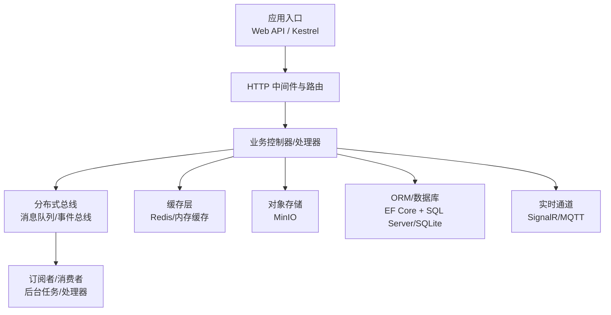
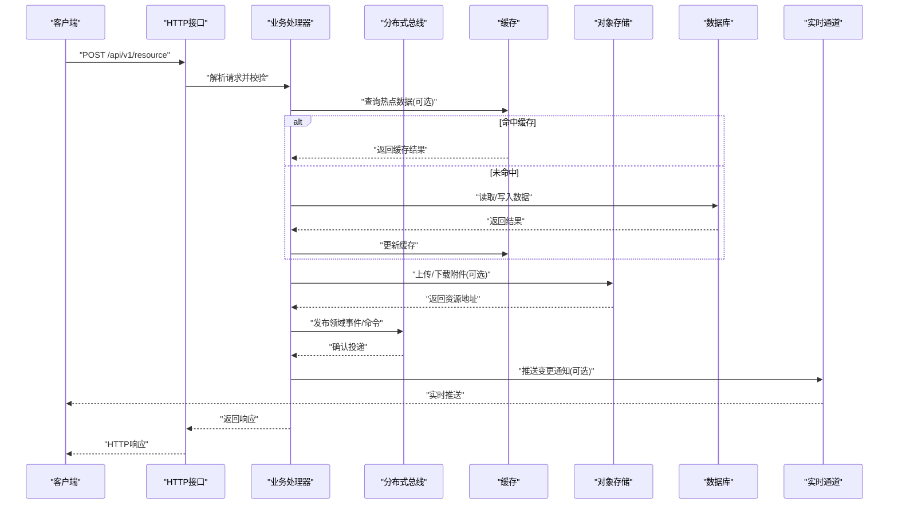
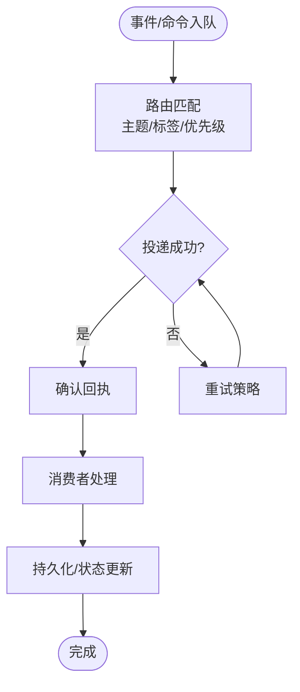
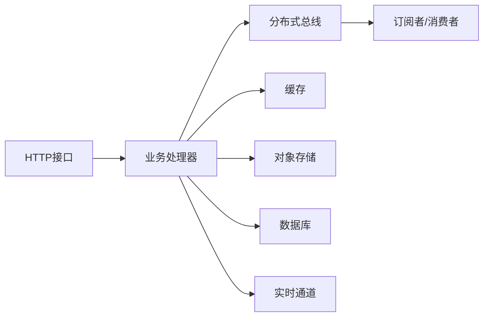

# 组件交互与数据流

<cite>
**本文引用的文件**   
- [README.md](file://README.md)
- [appsettings.json](file://appsettings.json)
- [Directory.Build.props](file://Directory.Build.props)
- [GlobalAnalyzerConfig.globalconfig](file://GlobalAnalyzerConfig.globalconfig)
- [minio_vsa.cs](file://minio_vsa.cs)
- [distributed_bus.cs](file://distributed_bus.cs)
- [signalr_production.cs](file://signalr_production.cs)
- [mqtt_integration.cs](file://mqtt_integration.cs)
- [redis_stream_integration.cs](file://redis_stream_integration.cs)
- [message_queue.cs](file://message_queue.cs)
- [efcore9_integration.cs](file://efcore9_integration.cs)
- [database_backup_service.cs](file://database_backup_service.cs)
</cite>

## 目录
1. [简介](#简介)
2. [项目结构](#项目结构)
3. [核心组件](#核心组件)
4. [架构总览](#架构总览)
5. [详细组件分析](#详细组件分析)
6. [依赖关系分析](#依赖关系分析)
7. [性能考量](#性能考量)
8. [故障排查指南](#故障排查指南)
9. [结论](#结论)
10. [附录](#附录)

## 简介
本文件面向VSA项目的“组件交互与数据流”，聚焦以下目标：
- 梳理系统内各组件的通信模式（同步调用、异步消息、事件驱动）
- 描述从HTTP请求到数据库操作的完整数据链路
- 解释分布式总线的设计原理与消息路由机制
- 阐述实时通信的数据推送模式
- 提供数据流转图与时序图，展示关键业务流程中的协作关系

## 项目结构
仓库采用“示例/集成”为主的扁平化组织方式，根目录下包含大量以“_integration.cs”命名的示例文件，以及若干核心能力实现（如分布式总线、SignalR生产级实现、MinIO VSA集成等）。配置文件集中于根目录，便于统一管理与环境切换。

图表来源
- [appsettings.json](file://appsettings.json)
- [Directory.Build.props](file://Directory.Build.props)

章节来源
- [README.md](file://README.md)
- [appsettings.json](file://appsettings.json)
- [Directory.Build.props](file://Directory.Build.props)

## 核心组件
- HTTP接入层：Kestrel承载API，结合中间件完成鉴权、限流、日志与追踪
- 业务处理层：控制器或端点接收请求，编排领域逻辑，协调下游服务
- 分布式总线：统一的消息发布/订阅与路由，解耦生产者与消费者
- 缓存层：热点数据快速读取，降低数据库压力
- 对象存储：大文件/附件/媒体资源持久化
- ORM与数据库：结构化数据的CRUD与事务
- 实时通道：WebSocket/SSE/MQTT用于低延迟推送

章节来源
- [minio_vsa.cs](file://minio_vsa.cs)
- [distributed_bus.cs](file://distributed_bus.cs)
- [signalr_production.cs](file://signalr_production.cs)
- [mqtt_integration.cs](file://mqtt_integration.cs)
- [redis_stream_integration.cs](file://redis_stream_integration.cs)
- [message_queue.cs](file://message_queue.cs)
- [efcore9_integration.cs](file://efcore9_integration.cs)
- [database_backup_service.cs](file://database_backup_service.cs)

## 架构总览
下图展示了从HTTP请求进入，到业务编排、消息分发、缓存/存储访问、数据库落库与实时推送的整体流程。

图表来源
- [minio_vsa.cs](file://minio_vsa.cs)
- [distributed_bus.cs](file://distributed_bus.cs)
- [signalr_production.cs](file://signalr_production.cs)
- [mqtt_integration.cs](file://mqtt_integration.cs)
- [redis_stream_integration.cs](file://redis_stream_integration.cs)
- [message_queue.cs](file://message_queue.cs)
- [efcore9_integration.cs](file://efcore9_integration.cs)

## 详细组件分析

### HTTP接入与业务编排
- 职责：接收外部请求，参数校验，权限控制，调用业务逻辑，组装响应
- 关键点：
  - 使用中间件进行横切关注点（日志、追踪、异常处理）
  - 通过依赖注入装配服务，保持高内聚低耦合
  - 对耗时操作采用异步编程模型，提升吞吐

章节来源
- [appsettings.json](file://appsettings.json)
- [Directory.Build.props](file://Directory.Build.props)

### 分布式总线与消息路由
- 设计要点：
  - 统一的发布/订阅接口，屏蔽底层消息中间件差异
  - 支持主题/队列路由、重试、死信、幂等处理
  - 与CQRS/事件溯源结合，保证最终一致性
- 典型流程：
  - 生产者发布事件/命令
  - 总线根据路由规则投递至订阅者
  - 订阅者消费并执行业务，必要时回写数据库

图表来源
- [distributed_bus.cs](file://distributed_bus.cs)
- [message_queue.cs](file://message_queue.cs)

章节来源
- [distributed_bus.cs](file://distributed_bus.cs)
- [message_queue.cs](file://message_queue.cs)

### 缓存层与读写路径
- 策略：读多写少场景优先命中缓存；写路径采用失效或双写策略
- 一致性：本地缓存+分布式缓存分层，避免雪崩与穿透
- 监控：命中率、延迟、容量水位指标上报

章节来源
- [redis_stream_integration.cs](file://redis_stream_integration.cs)

### 对象存储（MinIO VSA）
- 用途：图片、视频、文档等大对象存储
- 特性：分片上传、断点续传、签名URL、生命周期管理
- 集成：与业务层解耦，通过SDK/REST访问，返回可分享链接

章节来源
- [minio_vsa.cs](file://minio_vsa.cs)

### 实时通信（SignalR/MQTT）
- SignalR：适用于浏览器/移动端低延迟双向通信
- MQTT：适用于IoT设备与海量连接场景
- 推送模式：服务端主动推送、客户端订阅主题、按用户/房间广播

章节来源
- [signalr_production.cs](file://signalr_production.cs)
- [mqtt_integration.cs](file://mqtt_integration.cs)

### 数据持久化（EF Core）
- 模式：仓储/单元工作模式，结合迁移脚本管理Schema演进
- 优化：分页、投影、批量写入、连接池、读写分离（可选）
- 备份：定时备份与恢复策略保障数据安全

章节来源
- [efcore9_integration.cs](file://efcore9_integration.cs)
- [database_backup_service.cs](file://database_backup_service.cs)

## 依赖关系分析
- 松耦合：通过接口与DI容器解耦具体实现
- 可替换性：消息总线、缓存、存储均可按需替换
- 观测性：全链路追踪、指标采集、结构化日志

图表来源
- [distributed_bus.cs](file://distributed_bus.cs)
- [signalr_production.cs](file://signalr_production.cs)
- [minio_vsa.cs](file://minio_vsa.cs)
- [efcore9_integration.cs](file://efcore9_integration.cs)

章节来源
- [distributed_bus.cs](file://distributed_bus.cs)
- [signalr_production.cs](file://signalr_production.cs)
- [minio_vsa.cs](file://minio_vsa.cs)
- [efcore9_integration.cs](file://efcore9_integration.cs)

## 性能考量
- 并发与吞吐：异步I/O、线程池调优、背压与限流
- 缓存命中：热点键预热、防穿透/雪崩策略
- 消息积压：消费者水平扩展、批处理、幂等去重
- 数据库：索引优化、SQL审计、慢查询治理、连接池上限
- 网络：压缩、HTTP/2、TLS会话复用、CDN加速静态资源

[本节为通用指导，不直接分析具体文件]

## 故障排查指南
- 常见问题定位：
  - 请求失败：检查中间件日志、错误码、上游依赖健康状态
  - 消息丢失：查看总线重试与死信队列，核对幂等键
  - 缓存不一致：比对缓存与数据库值，检查失效策略
  - 实时推送延迟：观察连接数、带宽、服务端CPU/内存
- 工具与建议：
  - 启用分布式追踪，串联跨组件调用链
  - 配置告警阈值（错误率、延迟、队列长度）
  - 定期演练故障恢复与降级预案

章节来源
- [database_backup_service.cs](file://database_backup_service.cs)

## 结论
VSA项目通过清晰的层次划分与标准化集成，实现了高内聚、低耦合的组件交互。分布式总线与实时通道将同步与异步、离线与在线场景有机融合，配合缓存与对象存储形成完整的数据闭环。建议在后续迭代中持续完善可观测性与弹性伸缩能力，确保在高并发与复杂业务下的稳定性与可扩展性。

[本节为总结性内容，不直接分析具体文件]

## 附录
- 配置与环境：统一在配置文件中管理连接串、开关与阈值
- 代码规范：全局分析器与构建属性约束编码风格与质量门禁

章节来源
- [appsettings.json](file://appsettings.json)
- [Directory.Build.props](file://Directory.Build.props)
- [GlobalAnalyzerConfig.globalconfig](file://GlobalAnalyzerConfig.globalconfig)