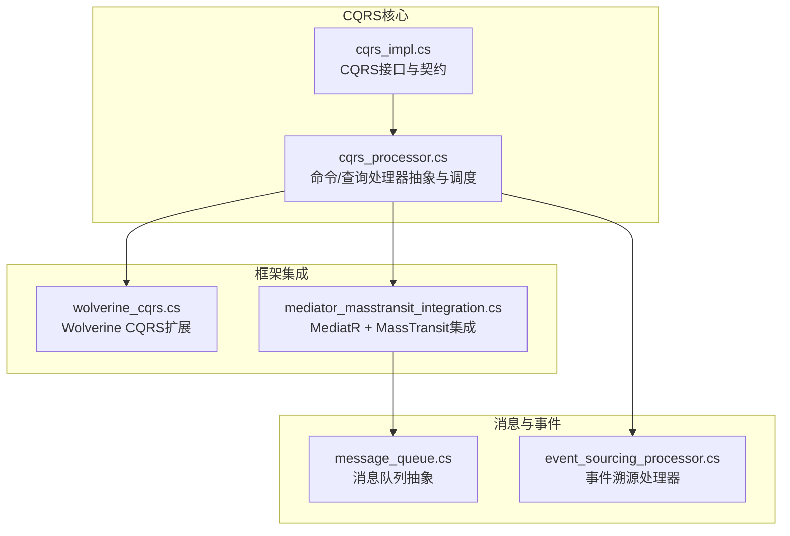
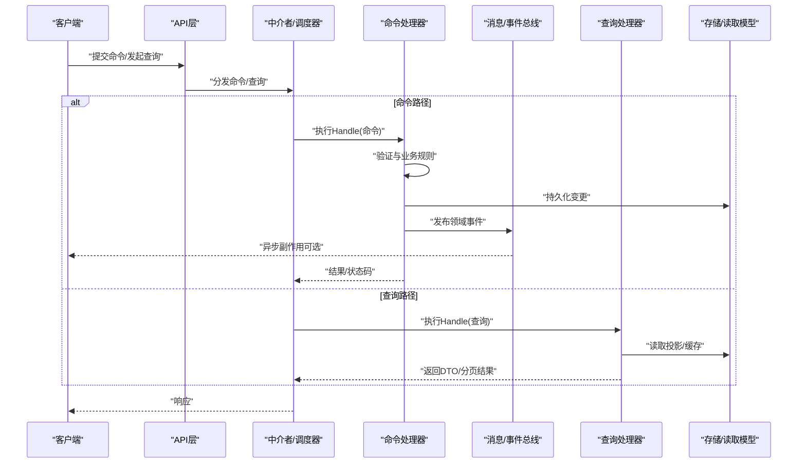
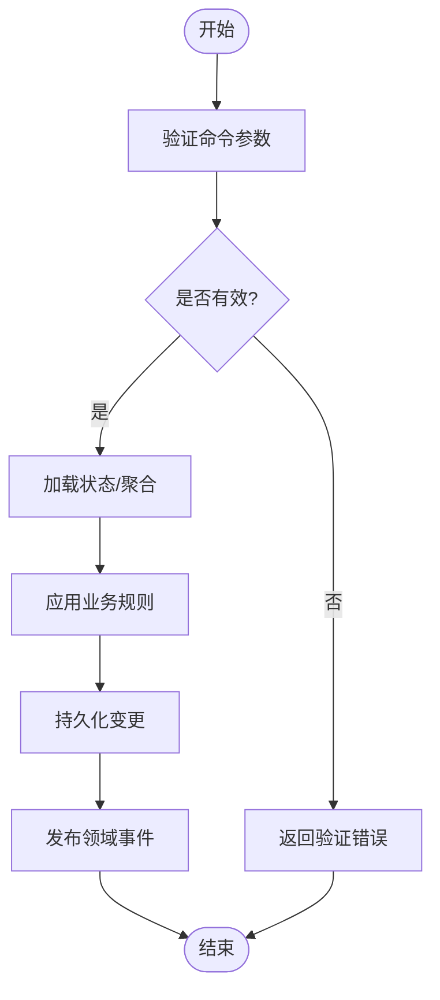
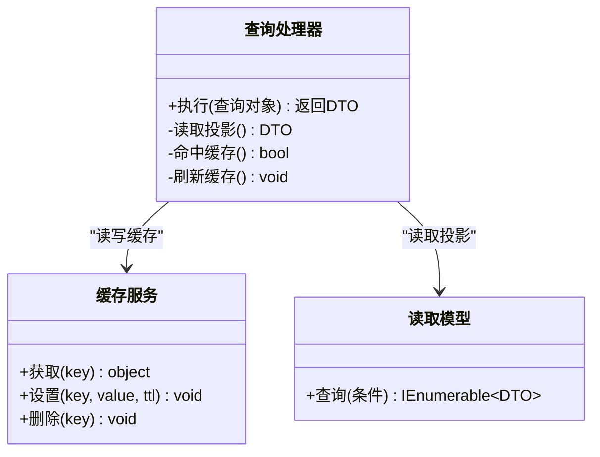
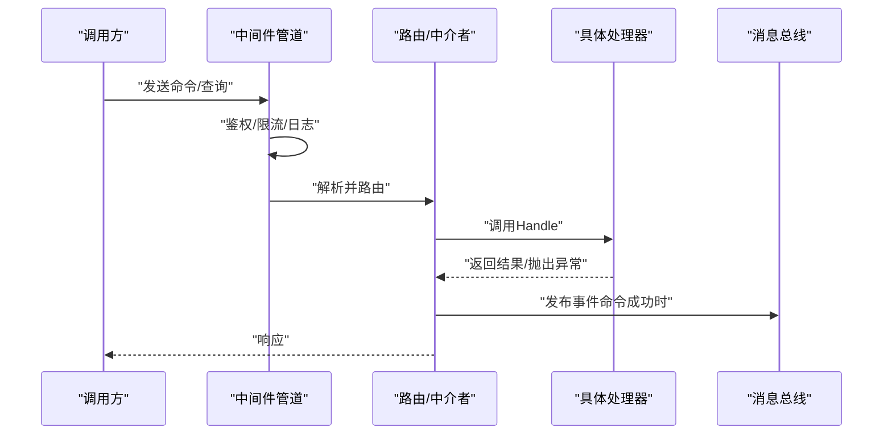
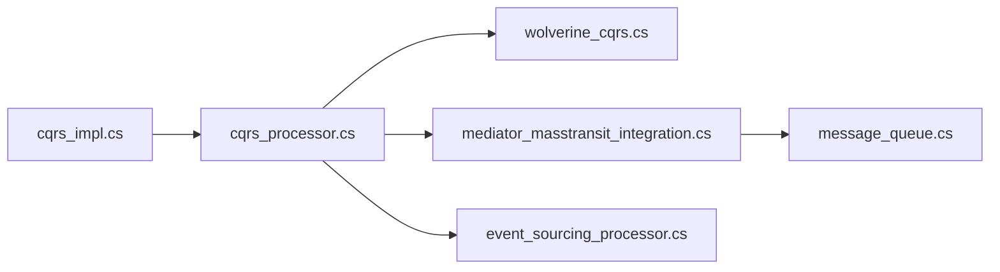

# CQRS模式实现

<cite>
**本文档中引用的文件**
- [cqrs_impl.cs](file://cqrs_impl.cs)
- [cqrs_processor.cs](file://cqrs_processor.cs)
- [wolverine_cqrs.cs](file://wolverine_cqrs.cs)
- [mediator_masstransit_integration.cs](file://mediator_masstransit_integration.cs)
- [message_queue.cs](file://message_queue.cs)
- [event_sourcing_processor.cs](file://event_sourcing_processor.cs)
</cite>

## 目录
1. [简介](#简介)
2. [项目结构](#项目结构)
3. [核心组件](#核心组件)
4. [架构总览](#架构总览)
5. [详细组件分析](#详细组件分析)
6. [依赖关系分析](#依赖关系分析)
7. [性能考虑](#性能考虑)
8. [故障排查指南](#故障排查指南)
9. [结论](#结论)
10. [附录](#附录)

## 简介
本文件围绕VSA项目中CQRS（命令查询职责分离）模式的实现进行系统化说明，重点包括：
- CQRS的核心概念与设计理念
- 命令处理器与查询处理器的职责边界
- 命令生命周期：定义、验证、处理、事件发布
- 查询处理器优化策略：缓存机制、投影模型设计
- 消息路由与中间件管道设计
- 最佳实践与常见陷阱规避

## 项目结构
仓库中包含多个与CQRS相关的示例与集成实现，主要涉及：
- 基础CQRS实现与处理器编排
- 基于Wolverine的CQRS能力
- 通过Mediatror与MassTransit集成的消息化CQRS
- 消息队列与事件溯源处理器

图表来源
- [cqrs_impl.cs](file://cqrs_impl.cs)
- [cqrs_processor.cs](file://cqrs_processor.cs)
- [wolverine_cqrs.cs](file://wolverine_cqrs.cs)
- [mediator_masstransit_integration.cs](file://mediator_masstransit_integration.cs)
- [message_queue.cs](file://message_queue.cs)
- [event_sourcing_processor.cs](file://event_sourcing_processor.cs)

章节来源
- [cqrs_impl.cs](file://cqrs_impl.cs)
- [cqrs_processor.cs](file://cqrs_processor.cs)
- [wolverine_cqrs.cs](file://wolverine_cqrs.cs)
- [mediator_masstransit_integration.cs](file://mediator_masstransit_integration.cs)
- [message_queue.cs](file://message_queue.cs)
- [event_sourcing_processor.cs](file://event_sourcing_processor.cs)

## 核心组件
- 命令与查询契约
  - 命令：不可变对象，表达“要做什么”，不包含业务逻辑
  - 查询：不可变对象，表达“要读什么”，返回只读视图或DTO
- 处理器
  - 命令处理器：负责校验、执行业务规则、持久化变更、发布领域事件
  - 查询处理器：从读取模型或数据库直接读取数据，支持缓存与投影
- 调度器/中介者
  - 将命令/查询分发到对应处理器，可叠加横切关注点（日志、审计、权限等）
- 消息总线/事件总线
  - 解耦命令处理与后续副作用（如通知、索引更新、统计聚合）

章节来源
- [cqrs_impl.cs](file://cqrs_impl.cs)
- [cqrs_processor.cs](file://cqrs_processor.cs)

## 架构总览
下图展示了请求进入后，命令与查询在CQRS中的流转路径，以及事件驱动的后置处理。

图表来源
- [cqrs_processor.cs](file://cqrs_processor.cs)
- [mediator_masstransit_integration.cs](file://mediator_masstransit_integration.cs)
- [message_queue.cs](file://message_queue.cs)

## 详细组件分析

### 命令处理器与生命周期
- 命令定义
  - 使用不可变类型承载输入参数，确保一致性
  - 包含唯一标识（如命令ID），便于幂等与追踪
- 验证
  - 在进入处理器前进行参数校验（长度、格式、业务约束）
  - 失败时快速返回错误，避免无效处理
- 处理
  - 加载必要的读取模型或聚合根
  - 应用领域规则，生成领域事件
  - 持久化变更（事务内）
- 事件发布
  - 将领域事件发布到消息总线，触发下游消费者
  - 支持重试、死信队列与幂等消费

图表来源
- [cqrs_processor.cs](file://cqrs_processor.cs)
- [event_sourcing_processor.cs](file://event_sourcing_processor.cs)

章节来源
- [cqrs_processor.cs](file://cqrs_processor.cs)
- [event_sourcing_processor.cs](file://event_sourcing_processor.cs)

### 查询处理器与优化策略
- 投影模型
  - 为查询场景构建只读投影，减少复杂JOIN与计算
  - 由事件驱动或批量任务维护投影的一致性
- 缓存机制
  - 多级缓存：本地内存缓存 + 分布式缓存
  - 缓存键设计需包含版本/时间戳，避免脏读
  - 失效策略：按实体粒度或热点集合维度失效
- 分页与过滤
  - 服务端分页，避免一次性拉取大量数据
  - 过滤条件下推到读取模型或数据库层

图表来源
- [cqrs_processor.cs](file://cqrs_processor.cs)

章节来源
- [cqrs_processor.cs](file://cqrs_processor.cs)

### 消息路由与中间件管道
- 路由机制
  - 基于命令/查询类型映射到处理器
  - 支持条件路由与多目标分发（广播/订阅）
- 中间件管道
  - 横切关注点：日志、审计、权限、限流、重试、超时
  - 顺序可控，异常统一捕获与转换
- 与MassTransit/MediatR集成
  - 通过中介者封装调用，底层走消息总线
  - 保证跨进程/跨服务的可靠投递

图表来源
- [mediator_masstransit_integration.cs](file://mediator_masstransit_integration.cs)
- [message_queue.cs](file://message_queue.cs)

章节来源
- [mediator_masstransit_integration.cs](file://mediator_masstransit_integration.cs)
- [message_queue.cs](file://message_queue.cs)

### Wolverine CQRS集成
- 特性与能力
  - 声明式命令/查询处理器注册
  - 内置消息路由、重试、去重、Saga编排
- 适用场景
  - 需要强一致性与高吞吐的命令处理
  - 复杂工作流与状态机编排

章节来源
- [wolverine_cqrs.cs](file://wolverine_cqrs.cs)

## 依赖关系分析
- 组件耦合
  - 命令/查询处理器对存储与缓存的依赖应通过接口隔离
  - 中介者与消息总线解耦，便于替换实现
- 外部依赖
  - 消息队列/事件总线用于异步解耦
  - 缓存与读取模型提升查询性能

图表来源
- [cqrs_impl.cs](file://cqrs_impl.cs)
- [cqrs_processor.cs](file://cqrs_processor.cs)
- [wolverine_cqrs.cs](file://wolverine_cqrs.cs)
- [mediator_masstransit_integration.cs](file://mediator_masstransit_integration.cs)
- [message_queue.cs](file://message_queue.cs)
- [event_sourcing_processor.cs](file://event_sourcing_processor.cs)

章节来源
- [cqrs_impl.cs](file://cqrs_impl.cs)
- [cqrs_processor.cs](file://cqrs_processor.cs)
- [wolverine_cqrs.cs](file://wolverine_cqrs.cs)
- [mediator_masstransit_integration.cs](file://mediator_masstransit_integration.cs)
- [message_queue.cs](file://message_queue.cs)
- [event_sourcing_processor.cs](file://event_sourcing_processor.cs)

## 性能考虑
- 命令路径
  - 短事务、最小锁范围；批量写入时使用批处理
  - 事件发布采用异步与背压控制，避免阻塞主流程
- 查询路径
  - 投影先行，避免实时聚合；合理设计索引与覆盖查询
  - 多级缓存命中率监控与预热策略
- 资源管理
  - 连接池、线程池与内存池配置调优
  - 监控关键指标：延迟、吞吐、错误率、缓存命中率

[本节为通用指导，不直接分析具体文件]

## 故障排查指南
- 常见问题
  - 命令重复提交导致非幂等：引入命令ID去重
  - 事件丢失或重复消费：启用可靠投递与幂等消费者
  - 查询缓存不一致：版本号/时间戳失效与回退策略
- 诊断手段
  - 链路追踪：记录命令ID、事件ID、处理耗时
  - 日志与指标：处理器入口/出口、异常堆栈、队列堆积
  - 回放与补偿：事件回放重建状态，补偿操作修复数据

章节来源
- [event_sourcing_processor.cs](file://event_sourcing_processor.cs)
- [message_queue.cs](file://message_queue.cs)

## 结论
CQRS通过命令与查询的职责分离，提升了系统的可维护性、可扩展性与性能。结合消息总线与事件驱动，可实现松耦合与高吞吐。实践中需重视幂等、一致性、缓存与投影设计，并通过完善的监控与诊断保障稳定性。

[本节为总结性内容，不直接分析具体文件]

## 附录
- 最佳实践建议
  - 命令与查询严格分离，禁止在查询中产生副作用
  - 使用不可变对象传递命令/查询参数
  - 事件命名体现领域语义，保持向后兼容
  - 查询优先使用投影与缓存，降低热点压力
- 常见陷阱避免
  - 不要在命令处理器中进行重型I/O或长耗时计算
  - 避免过度拆分命令导致事务边界混乱
  - 谨慎使用全局缓存，防止脏读与雪崩

[本节为通用指导，不直接分析具体文件]