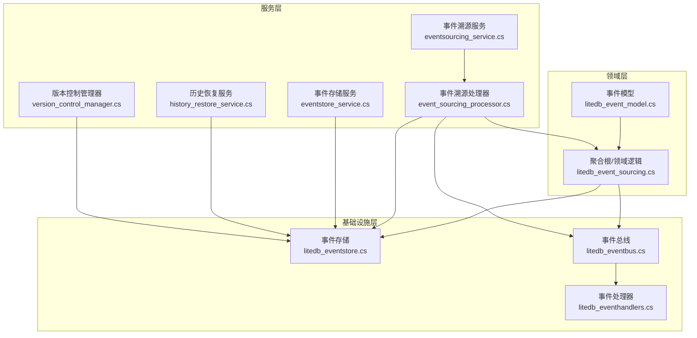
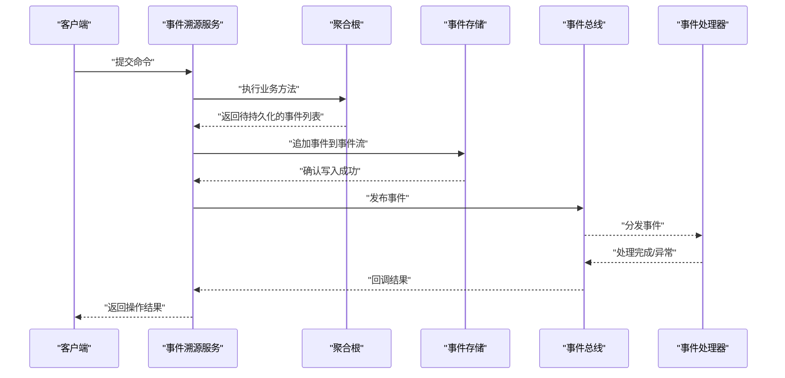
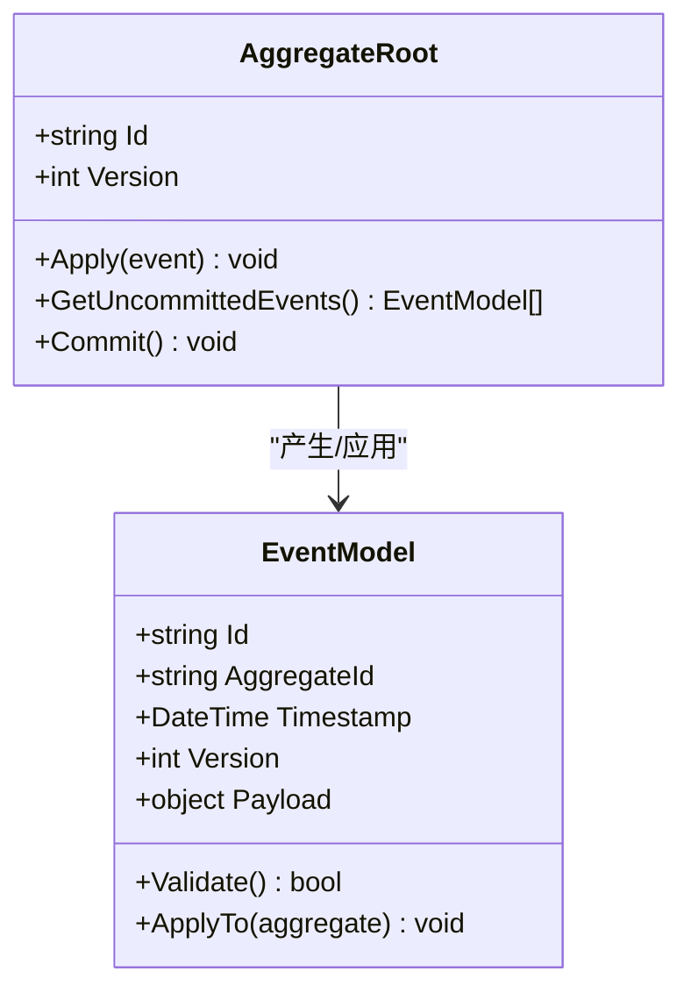
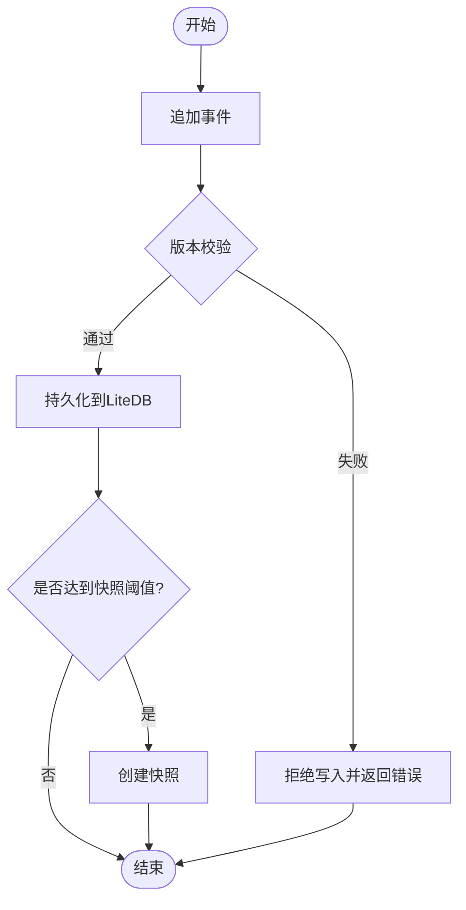
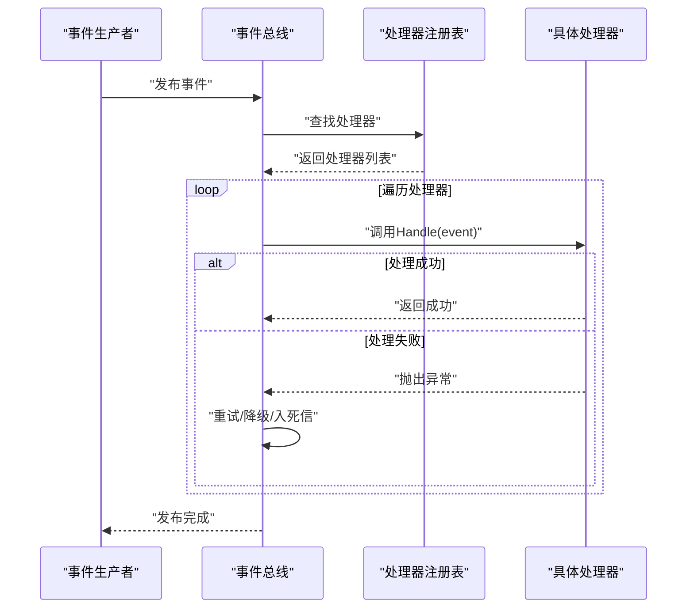
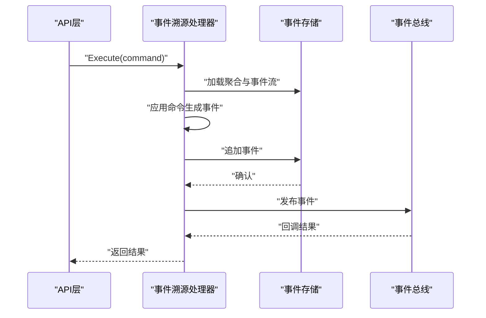
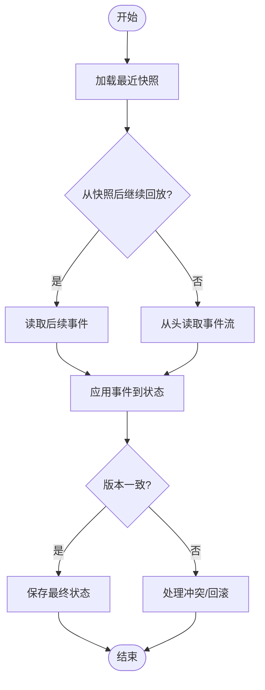
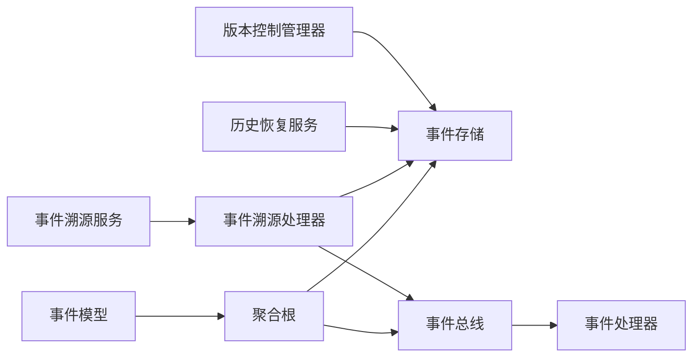

# 事件溯源模式

<cite>
**本文引用的文件**   
- [litedb_event_sourcing.cs](file://litedb_event_sourcing.cs)
- [litedb_eventstore.cs](file://litedb_eventstore.cs)
- [litedb_eventbus.cs](file://litedb_eventbus.cs)
- [litedb_eventhandlers.cs](file://litedb_eventhandlers.cs)
- [litedb_event_model.cs](file://litedb_event_model.cs)
- [event_sourcing_processor.cs](file://event_sourcing_processor.cs)
- [eventsourcing_service.cs](file://eventsourcing_service.cs)
- [eventstore_service.cs](file://eventstore_service.cs)
- [history_restore_service.cs](file://history_restore_service.cs)
- [version_control_manager.cs](file://version_control_manager.cs)
</cite>

## 目录
1. [简介](#简介)
2. [项目结构](#项目结构)
3. [核心组件](#核心组件)
4. [架构总览](#架构总览)
5. [详细组件分析](#详细组件分析)
6. [依赖关系分析](#依赖关系分析)
7. [性能考量](#性能考量)
8. [故障排查指南](#故障排查指南)
9. [结论](#结论)
10. [附录](#附录)

## 简介
本文件面向VSA项目中“事件溯源（Event Sourcing）”模式的实现与使用，系统性阐述以下主题：
- 事件溯源的核心思想：以不可变事件序列作为唯一事实来源，所有状态变更通过事件表达与持久化。
- 事件存储设计：事件持久化、版本控制、快照机制与一致性保障。
- 发布订阅模式：事件总线、消费者注册、错误处理与重试策略。
- 状态重建：从事件流重建实体状态的算法与优化策略。
- 实践示例：事件定义、聚合根、事件处理器等关键代码的组织与用法。
- 高级特性：事件迁移、回溯重放、历史查询与恢复。

## 项目结构
围绕事件溯源的相关代码主要分布在LiteDB集成与通用事件处理模块中，包括事件模型、事件存储、事件总线、事件处理器、服务层以及历史恢复与版本管理工具。整体组织遵循分层与职责分离原则：领域层定义事件与聚合根，基础设施层提供存储与消息总线，服务层编排业务流程并协调事件生命周期。

图表来源
- [litedb_event_model.cs](file://litedb_event_model.cs)
- [litedb_event_sourcing.cs](file://litedb_event_sourcing.cs)
- [litedb_eventstore.cs](file://litedb_eventstore.cs)
- [litedb_eventbus.cs](file://litedb_eventbus.cs)
- [litedb_eventhandlers.cs](file://litedb_eventhandlers.cs)
- [event_sourcing_processor.cs](file://event_sourcing_processor.cs)
- [eventsourcing_service.cs](file://eventsourcing_service.cs)
- [eventstore_service.cs](file://eventstore_service.cs)
- [history_restore_service.cs](file://history_restore_service.cs)
- [version_control_manager.cs](file://version_control_manager.cs)

章节来源
- [litedb_event_sourcing.cs](file://litedb_event_sourcing.cs)
- [litedb_eventstore.cs](file://litedb_eventstore.cs)
- [litedb_eventbus.cs](file://litedb_eventbus.cs)
- [litedb_eventhandlers.cs](file://litedb_eventhandlers.cs)
- [litedb_event_model.cs](file://litedb_event_model.cs)
- [event_sourcing_processor.cs](file://event_sourcing_processor.cs)
- [eventsourcing_service.cs](file://eventsourcing_service.cs)
- [eventstore_service.cs](file://eventstore_service.cs)
- [history_restore_service.cs](file://history_restore_service.cs)
- [version_control_manager.cs](file://version_control_manager.cs)

## 核心组件
- 事件模型：定义不可变事件的契约与元数据，包含事件类型、关联聚合ID、时间戳、版本号等字段，确保事件的可追溯性与幂等性。
- 聚合根：封装业务规则，将状态变更转化为事件并发布到事件总线；在应用层或基础设施层对事件进行持久化。
- 事件存储：负责事件的追加写入、按聚合ID查询、按时间范围过滤、版本控制与快照读写。
- 事件总线：解耦事件生产者与消费者，支持同步/异步分发、失败重试、死信队列与监控指标。
- 事件处理器：针对特定事件类型的消费逻辑，保证幂等与事务边界，必要时触发后续领域行为。
- 服务层：编排事件生命周期，如提交命令、生成事件、持久化、发布与回放；提供历史查询与恢复能力。
- 版本控制与快照：维护事件流版本、聚合快照点，加速状态重建与跨版本兼容。

章节来源
- [litedb_event_model.cs](file://litedb_event_model.cs)
- [litedb_event_sourcing.cs](file://litedb_event_sourcing.cs)
- [litedb_eventstore.cs](file://litedb_eventstore.cs)
- [litedb_eventbus.cs](file://litedb_eventbus.cs)
- [litedb_eventhandlers.cs](file://litedb_eventhandlers.cs)
- [event_sourcing_processor.cs](file://event_sourcing_processor.cs)
- [eventsourcing_service.cs](file://eventsourcing_service.cs)
- [eventstore_service.cs](file://eventstore_service.cs)
- [history_restore_service.cs](file://history_restore_service.cs)
- [version_control_manager.cs](file://version_control_manager.cs)

## 架构总览
事件溯源的整体流程如下：
- 命令进入服务层，调用聚合根执行领域逻辑。
- 聚合根产生新事件，交由事件存储持久化并写入事件流。
- 事件总线将事件分发给已注册的处理器。
- 处理器执行副作用（如通知、索引更新），必要时创建新的子事件。
- 读取端通过事件流重建当前状态，或使用快照快速恢复。

图表来源
- [eventsourcing_service.cs](file://eventsourcing_service.cs)
- [litedb_event_sourcing.cs](file://litedb_event_sourcing.cs)
- [litedb_eventstore.cs](file://litedb_eventstore.cs)
- [litedb_eventbus.cs](file://litedb_eventbus.cs)
- [litedb_eventhandlers.cs](file://litedb_eventhandlers.cs)

## 详细组件分析

### 事件模型与聚合根
- 事件模型强调不可变性与可序列化，包含事件标识、聚合标识、时间戳、版本、负载数据等。
- 聚合根负责业务不变量校验，将状态变更转换为事件集合，避免直接暴露内部状态。
- 聚合根通常不直接访问存储，而是由服务层或处理器在事务边界内完成事件持久化。

图表来源
- [litedb_event_model.cs](file://litedb_event_model.cs)
- [litedb_event_sourcing.cs](file://litedb_event_sourcing.cs)

章节来源
- [litedb_event_model.cs](file://litedb_event_model.cs)
- [litedb_event_sourcing.cs](file://litedb_event_sourcing.cs)

### 事件存储（LiteDB）
- 事件追加写：基于聚合ID的有序追加，保证顺序一致性与幂等写入。
- 版本控制：记录每个事件的版本号，防止重复写入与冲突。
- 快照机制：定期保存聚合快照，减少全量回放开销。
- 查询接口：按聚合ID、时间范围、事件类型筛选，支持分页与投影。

图表来源
- [litedb_eventstore.cs](file://litedb_eventstore.cs)

章节来源
- [litedb_eventstore.cs](file://litedb_eventstore.cs)

### 事件总线与消费者
- 事件总线提供发布/订阅能力，支持同步与异步分发。
- 消费者注册：按事件类型映射处理器，支持优先级与并发控制。
- 错误处理：重试策略、退避算法、死信队列与监控告警。
- 幂等性：基于事件ID去重，避免重复处理。

图表来源
- [litedb_eventbus.cs](file://litedb_eventbus.cs)
- [litedb_eventhandlers.cs](file://litedb_eventhandlers.cs)

章节来源
- [litedb_eventbus.cs](file://litedb_eventbus.cs)
- [litedb_eventhandlers.cs](file://litedb_eventhandlers.cs)

### 事件溯源处理器与服务
- 事件溯源处理器协调命令到事件的转换、事件持久化与发布。
- 服务层提供统一入口，封装事务边界、补偿逻辑与审计记录。
- 历史查询与恢复：支持按时间点或版本号重建状态，用于调试与合规审计。

图表来源
- [event_sourcing_processor.cs](file://event_sourcing_processor.cs)
- [eventsourcing_service.cs](file://eventsourcing_service.cs)
- [litedb_eventstore.cs](file://litedb_eventstore.cs)
- [litedb_eventbus.cs](file://litedb_eventbus.cs)

章节来源
- [event_sourcing_processor.cs](file://event_sourcing_processor.cs)
- [eventsourcing_service.cs](file://eventsourcing_service.cs)

### 历史恢复与版本控制
- 历史恢复服务：根据事件流或快照重建指定时间点的状态，支持增量与全量恢复。
- 版本控制管理器：管理事件流版本、聚合快照版本与迁移脚本，确保向后兼容。
- 回溯重放：从任意事件位置重放事件流，用于修复数据或验证业务逻辑。

图表来源
- [history_restore_service.cs](file://history_restore_service.cs)
- [version_control_manager.cs](file://version_control_manager.cs)
- [litedb_eventstore.cs](file://litedb_eventstore.cs)

章节来源
- [history_restore_service.cs](file://history_restore_service.cs)
- [version_control_manager.cs](file://version_control_manager.cs)

## 依赖关系分析
- 聚合根依赖事件模型，但不直接依赖存储与总线，保持领域纯净。
- 事件存储依赖LiteDB驱动，提供事件追加、查询与快照能力。
- 事件总线依赖处理器注册表，解耦生产与消费。
- 服务层编排处理器、存储与总线，形成完整的事件生命周期。

图表来源
- [litedb_event_model.cs](file://litedb_event_model.cs)
- [litedb_event_sourcing.cs](file://litedb_event_sourcing.cs)
- [litedb_eventstore.cs](file://litedb_eventstore.cs)
- [litedb_eventbus.cs](file://litedb_eventbus.cs)
- [litedb_eventhandlers.cs](file://litedb_eventhandlers.cs)
- [event_sourcing_processor.cs](file://event_sourcing_processor.cs)
- [eventsourcing_service.cs](file://eventsourcing_service.cs)
- [history_restore_service.cs](file://history_restore_service.cs)
- [version_control_manager.cs](file://version_control_manager.cs)

章节来源
- [litedb_event_model.cs](file://litedb_event_model.cs)
- [litedb_event_sourcing.cs](file://litedb_event_sourcing.cs)
- [litedb_eventstore.cs](file://litedb_eventstore.cs)
- [litedb_eventbus.cs](file://litedb_eventbus.cs)
- [litedb_eventhandlers.cs](file://litedb_eventhandlers.cs)
- [event_sourcing_processor.cs](file://event_sourcing_processor.cs)
- [eventsourcing_service.cs](file://eventsourcing_service.cs)
- [history_restore_service.cs](file://history_restore_service.cs)
- [version_control_manager.cs](file://version_control_manager.cs)

## 性能考量
- 事件追加写采用顺序I/O，提升写入吞吐；批量提交减少锁竞争。
- 快照机制降低长事件流的回放成本，建议按聚合活跃度动态调整快照频率。
- 事件总线支持异步分发与并行处理，结合背压与限流避免过载。
- 查询侧使用投影与索引，避免实时回放带来的延迟。
- 内存池与对象复用减少GC压力，尤其在高频事件场景。

## 故障排查指南
- 事件重复处理：检查事件ID去重与幂等性实现，确认总线重试策略与处理器幂等逻辑。
- 版本冲突：核对事件版本与聚合版本一致性，必要时进行冲突解决与回滚。
- 快照损坏：验证快照完整性与兼容性，必要时从头回放重建。
- 处理器异常：查看死信队列与日志，定位失败事件与原因，必要时人工干预。
- 性能瓶颈：监控事件存储I/O、总线分发延迟与处理器耗时，针对性优化。

章节来源
- [litedb_eventstore.cs](file://litedb_eventstore.cs)
- [litedb_eventbus.cs](file://litedb_eventbus.cs)
- [litedb_eventhandlers.cs](file://litedb_eventhandlers.cs)
- [history_restore_service.cs](file://history_restore_service.cs)

## 结论
VSA项目中的事件溯源模式通过清晰的分层与职责分离，实现了高内聚、低耦合的状态管理与扩展性。事件存储、总线与处理器协同工作，提供了可靠的事件生命周期管理能力。配合快照与版本控制，系统在性能与一致性之间取得平衡。历史恢复与回溯重放为调试与合规提供了有力支撑。

## 附录
- 最佳实践
  - 事件命名应反映业务语义，避免技术细节泄露。
  - 聚合根只关注领域不变量，不处理基础设施细节。
  - 处理器幂等性必须保证，避免重复处理导致的数据不一致。
  - 快照策略需结合业务热点与回放成本权衡。
- 常见陷阱
  - 事件版本与聚合版本不同步导致回放失败。
  - 处理器未处理异常导致事件丢失或状态不一致。
  - 快照与事件流版本不一致造成重建错误。