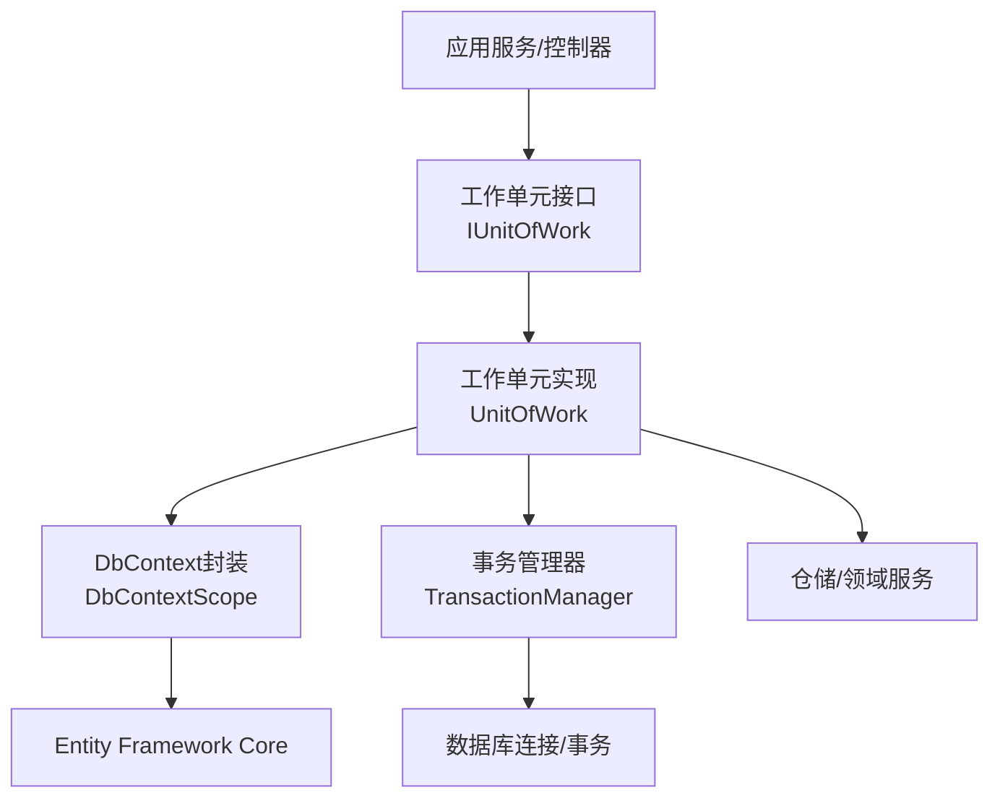
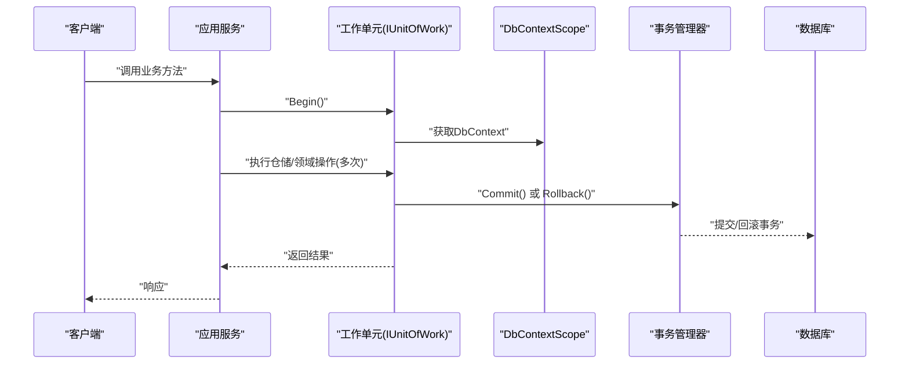
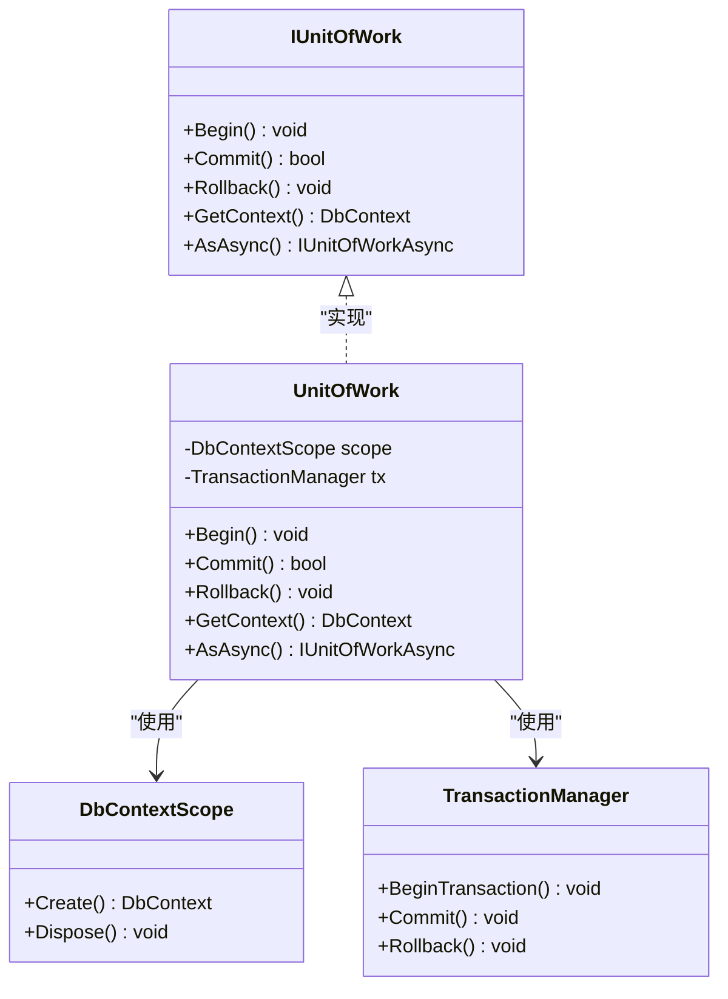
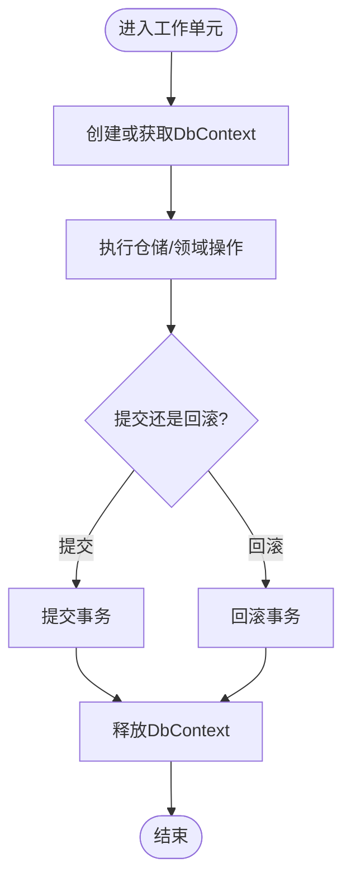
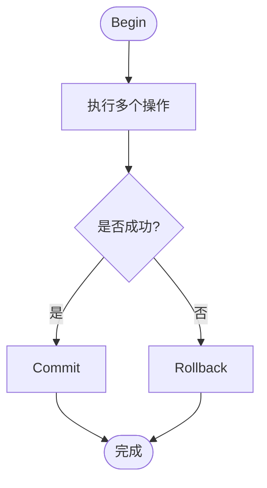
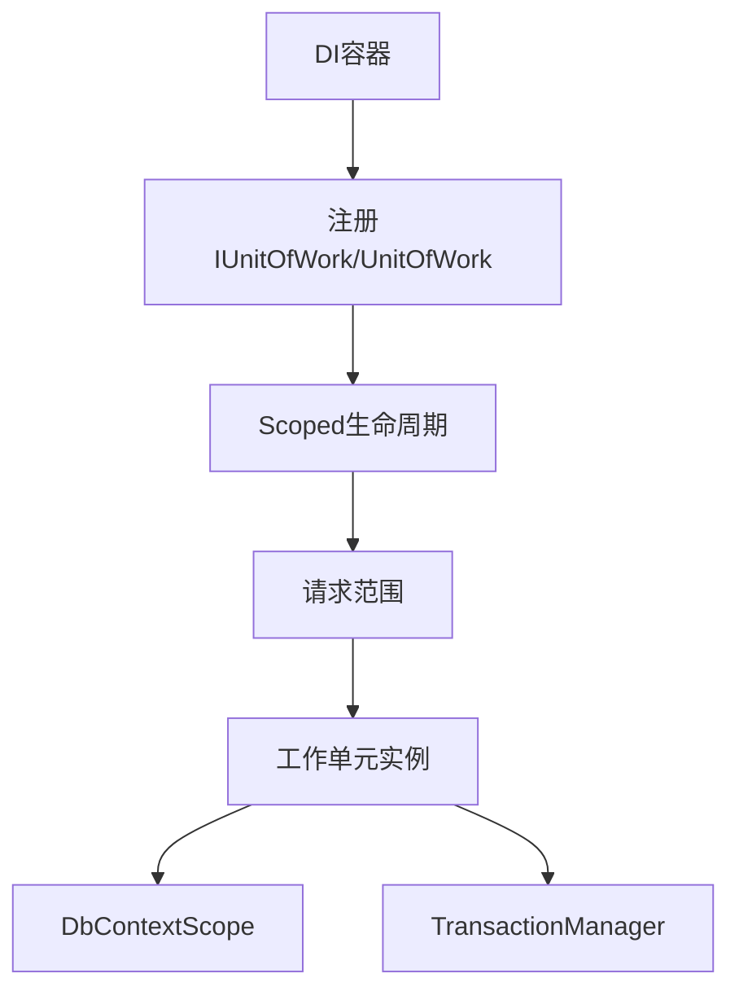
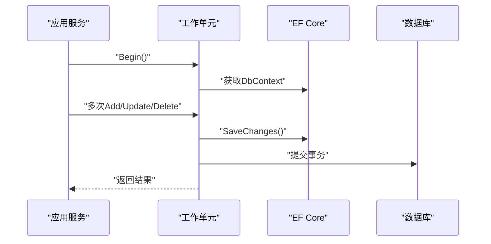
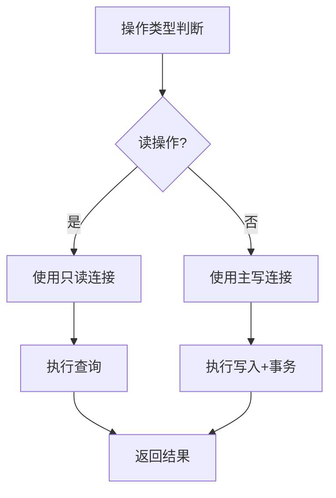
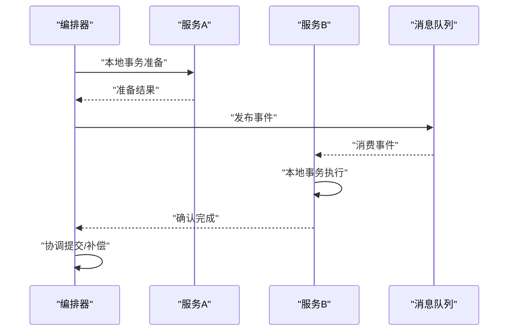
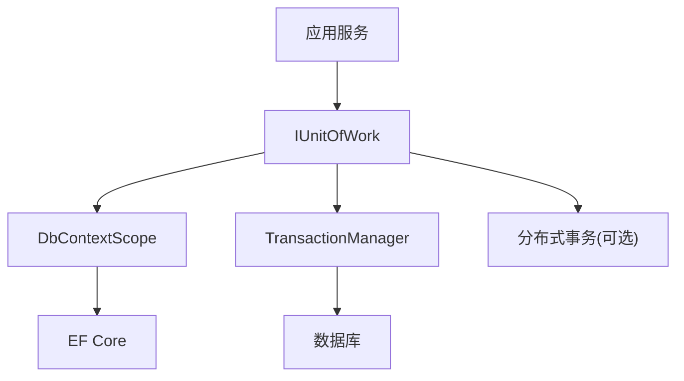

# 工作单元模式

<cite>
**本文引用的文件**   
- [unitofwork_integration.cs](file://unitofwork_integration.cs)
- [efcore9_integration.cs](file://efcore9_integration.cs)
- [dependency_injection_integration.cs](file://dependency_injection_integration.cs)
- [distributed_transaction.cs](file://distributed_transaction.cs)
- [read_write_split.cs](file://read_write_split.cs)
</cite>

## 目录
1. [简介](#简介)
2. [项目结构](#项目结构)
3. [核心组件](#核心组件)
4. [架构总览](#架构总览)
5. [详细组件分析](#详细组件分析)
6. [依赖关系分析](#依赖关系分析)
7. [性能考虑](#性能考虑)
8. [故障排查指南](#故障排查指南)
9. [结论](#结论)
10. [附录](#附录)

## 简介
本文件围绕VSA项目中“工作单元（Unit of Work）”模式的实现与使用进行系统化说明，重点包括：
- 在事务管理中的核心作用：确保多个数据库操作的原子性、一致性与可回滚。
- 抽象设计与具体实现：DbContext封装、事务边界管理、提交/回滚策略。
- 与依赖注入容器的集成：生命周期管理、线程安全注意事项。
- 与Entity Framework Core的集成方式及性能优化技巧。
- 分布式环境下的挑战与解决方案思路。

## 项目结构
本项目将工作单元模式以独立示例文件呈现，并与EF Core、依赖注入、读写分离、分布式事务等主题相互印证，便于理解在不同场景下的组合用法。

图表来源
- [unitofwork_integration.cs](file://unitofwork_integration.cs)
- [efcore9_integration.cs](file://efcore9_integration.cs)

章节来源
- [unitofwork_integration.cs](file://unitofwork_integration.cs)
- [efcore9_integration.cs](file://efcore9_integration.cs)

## 核心组件
- 工作单元接口（IUnitOfWork）
  - 职责：定义事务边界（开始、提交、回滚）、上下文访问、以及可选的异步能力。
  - 设计要点：面向接口编程，便于替换实现与测试。
- 工作单元实现（UnitOfWork）
  - 职责：协调DbContext与事务管理器，统一提交或回滚；暴露仓储或领域服务的访问入口。
  - 设计要点：封装DbContext生命周期，避免外部直接持有DbContext导致事务边界混乱。
- DbContext封装（DbContextScope）
  - 职责：提供DbContext实例的获取与生命周期控制，支持单请求内共享同一上下文。
  - 设计要点：与DI容器生命周期对齐，保证线程安全与并发安全。
- 事务管理器（TransactionManager）
  - 职责：开启、提交、回滚数据库事务；处理异常与状态恢复。
  - 设计要点：与底层数据库驱动解耦，支持同步/异步操作。

章节来源
- [unitofwork_integration.cs](file://unitofwork_integration.cs)
- [efcore9_integration.cs](file://efcore9_integration.cs)

## 架构总览
下图展示了工作单元在请求级事务中的协作关系：应用层通过工作单元发起多个仓储/领域操作，工作单元统一管控DbContext与事务，最终一次性提交或回滚。

图表来源
- [unitofwork_integration.cs](file://unitofwork_integration.cs)
- [efcore9_integration.cs](file://efcore9_integration.cs)

## 详细组件分析

### 工作单元接口与实现
- 接口设计
  - 明确事务边界：Begin/Commit/Rollback。
  - 暴露上下文访问：GetContext()/AsAsync()等，供仓储/领域服务使用。
- 实现要点
  - 内部持有DbContextScope与TransactionManager。
  - 在Begin时创建或复用DbContext，并开启事务。
  - 在Commit/Rollback时统一处理异常与状态清理。
  - 对外不暴露DbContext细节，降低耦合。

图表来源
- [unitofwork_integration.cs](file://unitofwork_integration.cs)

章节来源
- [unitofwork_integration.cs](file://unitofwork_integration.cs)

### DbContext封装与生命周期
- 封装目标
  - 屏蔽DbContext创建与释放细节，避免资源泄漏。
  - 在同一工作单元内共享同一个DbContext，保证变更跟踪一致性。
- 生命周期管理
  - 与DI容器生命周期对齐（通常为Scoped），确保每个请求一个上下文。
  - 支持异步场景下的上下文传递与线程安全。

图表来源
- [unitofwork_integration.cs](file://unitofwork_integration.cs)
- [efcore9_integration.cs](file://efcore9_integration.cs)

章节来源
- [unitofwork_integration.cs](file://unitofwork_integration.cs)
- [efcore9_integration.cs](file://efcore9_integration.cs)

### 事务边界管理与异常处理
- 边界管理
  - Begin：开启事务，绑定DbContext。
  - Commit：在所有操作成功后提交。
  - Rollback：发生异常或业务要求时回滚。
- 异常处理
  - 捕获并记录异常，确保事务正确回滚。
  - 区分可恢复与不可恢复错误，向上抛出清晰语义的错误信息。

图表来源
- [unitofwork_integration.cs](file://unitofwork_integration.cs)

章节来源
- [unitofwork_integration.cs](file://unitofwork_integration.cs)

### 与依赖注入容器的集成
- 注册策略
  - IUnitOfWork与UnitOfWork按Scoped生命周期注册，确保请求级隔离。
  - DbContextScope与TransactionManager也按Scoped注册，避免跨请求共享。
- 线程安全
  - Scoped服务在请求上下文中唯一，避免多线程竞争。
  - 异步调用需保持上下文传播（如使用正确的异步模型）。

图表来源
- [dependency_injection_integration.cs](file://dependency_injection_integration.cs)
- [unitofwork_integration.cs](file://unitofwork_integration.cs)

章节来源
- [dependency_injection_integration.cs](file://dependency_injection_integration.cs)
- [unitofwork_integration.cs](file://unitofwork_integration.cs)

### 与Entity Framework Core的集成
- 集成方式
  - 通过DbContextScope统一管理DbContext实例。
  - 使用TransactionManager封装EF Core的事务API。
- 最佳实践
  - 避免在长事务中持有大量实体，减少内存占用。
  - 合理使用AsNoTracking查询以提升读取性能。
  - 批量写入时使用EF Core批量扩展或分批次提交。

图表来源
- [efcore9_integration.cs](file://efcore9_integration.cs)
- [unitofwork_integration.cs](file://unitofwork_integration.cs)

章节来源
- [efcore9_integration.cs](file://efcore9_integration.cs)
- [unitofwork_integration.cs](file://unitofwork_integration.cs)

### 读写分离与多数据源
- 适用场景
  - 读多写少的高并发系统，通过读写分离提升吞吐。
- 实现思路
  - 在工作单元中根据操作类型选择读写连接。
  - 通过配置切换数据源，保持接口透明。

图表来源
- [read_write_split.cs](file://read_write_split.cs)

章节来源
- [read_write_split.cs](file://read_write_split.cs)

### 分布式环境下的挑战与方案
- 挑战
  - 跨服务/跨数据库的一致性难以保证。
  - 网络延迟与部分失败导致事务边界复杂化。
- 方案
  - 采用分布式事务协议（如TCC、Saga、XA）协调多参与者。
  - 引入消息队列与补偿机制，确保最终一致性。
  - 使用分布式锁与幂等设计防止重复提交。

图表来源
- [distributed_transaction.cs](file://distributed_transaction.cs)

章节来源
- [distributed_transaction.cs](file://distributed_transaction.cs)

## 依赖关系分析
- 组件耦合
  - 工作单元对DbContextScope与TransactionManager存在强依赖，但通过接口隔离，便于替换。
  - 应用服务仅依赖IUnitOfWork，降低与基础设施的耦合。
- 外部依赖
  - Entity Framework Core作为持久化框架。
  - DI容器负责生命周期管理。
  - 分布式事务组件用于跨服务协调。

图表来源
- [unitofwork_integration.cs](file://unitofwork_integration.cs)
- [efcore9_integration.cs](file://efcore9_integration.cs)
- [distributed_transaction.cs](file://distributed_transaction.cs)

章节来源
- [unitofwork_integration.cs](file://unitofwork_integration.cs)
- [efcore9_integration.cs](file://efcore9_integration.cs)
- [distributed_transaction.cs](file://distributed_transaction.cs)

## 性能考虑
- 减少DbContext持有时间：仅在必要时开启事务，尽快提交。
- 查询优化：使用AsNoTracking、投影查询、分页限制。
- 批量写入：分批提交或使用批量扩展，避免单次事务过大。
- 连接池：合理配置最大连接数与超时，避免连接耗尽。
- 监控与度量：采集事务耗时、失败率、慢查询等指标。

## 故障排查指南
- 常见问题
  - 事务未提交：检查是否正确调用Commit，异常路径是否回滚。
  - DbContext泄漏：确保在请求结束时释放上下文。
  - 并发冲突：重试策略与乐观锁配置。
  - 分布式不一致：补偿逻辑与幂等性校验。
- 诊断手段
  - 日志记录关键步骤与异常堆栈。
  - 使用性能分析工具定位慢查询与热点代码。
  - 启用EF Core日志观察SQL生成与执行计划。

章节来源
- [unitofwork_integration.cs](file://unitofwork_integration.cs)
- [efcore9_integration.cs](file://efcore9_integration.cs)

## 结论
工作单元模式通过统一的DbContext与事务管理，为多数据库操作提供了清晰的边界与一致的语义。结合依赖注入、EF Core与分布式事务，可以在单体与微服务环境中构建高可靠的数据访问层。实践中应关注性能优化、异常处理与可观测性，确保系统在复杂场景下稳定运行。

## 附录
- 使用模式建议
  - 在应用服务中注入IUnitOfWork，封装业务方法的事务边界。
  - 仓储/领域服务通过工作单元提供的上下文访问数据进行操作。
  - 对于跨服务一致性，优先采用事件驱动与补偿机制。
- 参考文件
  - 工作单元与EF Core集成示例：[unitofwork_integration.cs](file://unitofwork_integration.cs)、[efcore9_integration.cs](file://efcore9_integration.cs)
  - 依赖注入生命周期：[dependency_injection_integration.cs](file://dependency_injection_integration.cs)
  - 读写分离与分布式事务：[read_write_split.cs](file://read_write_split.cs)、[distributed_transaction.cs](file://distributed_transaction.cs)