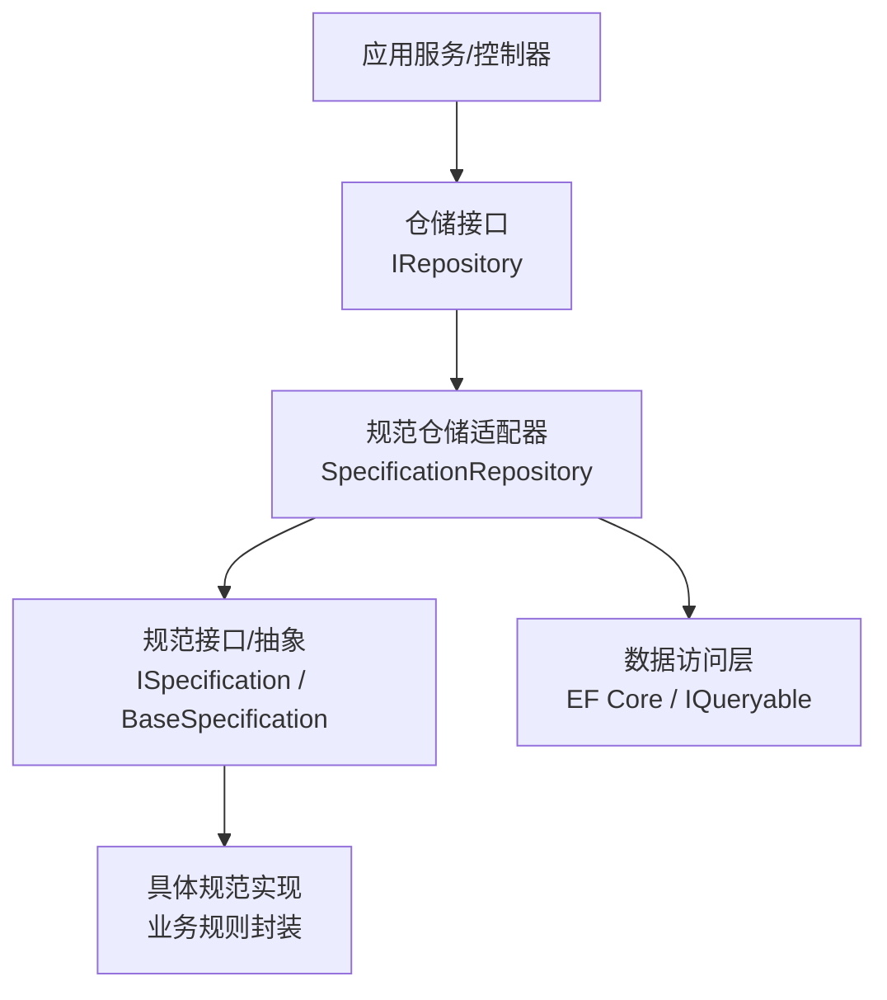
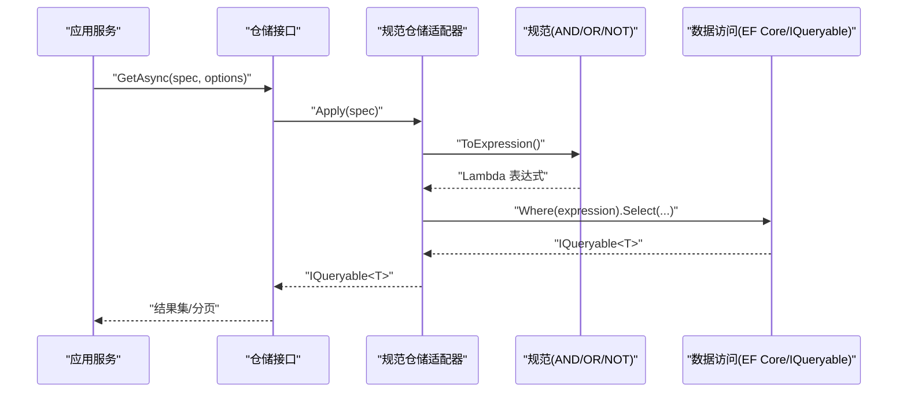
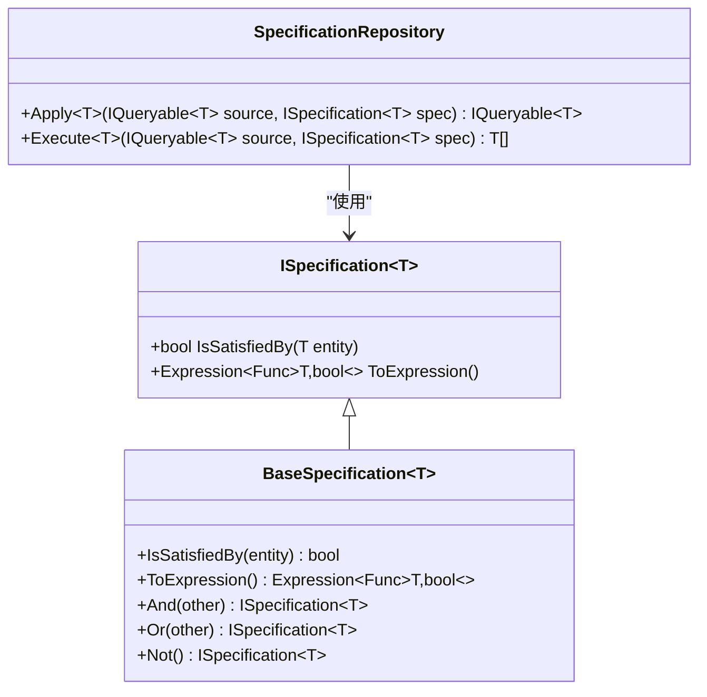
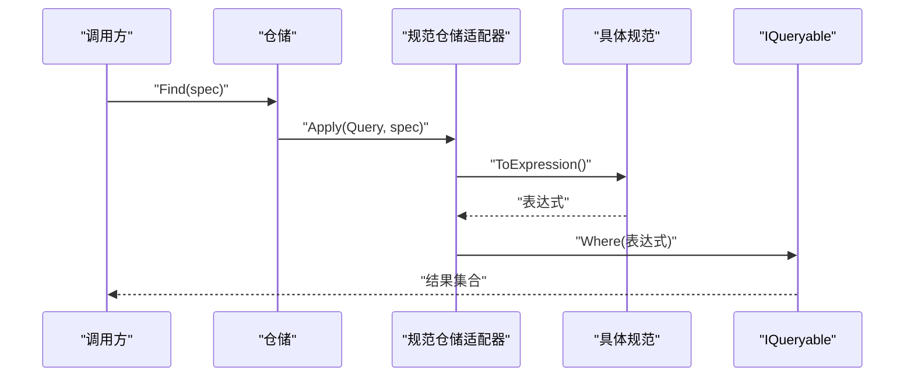
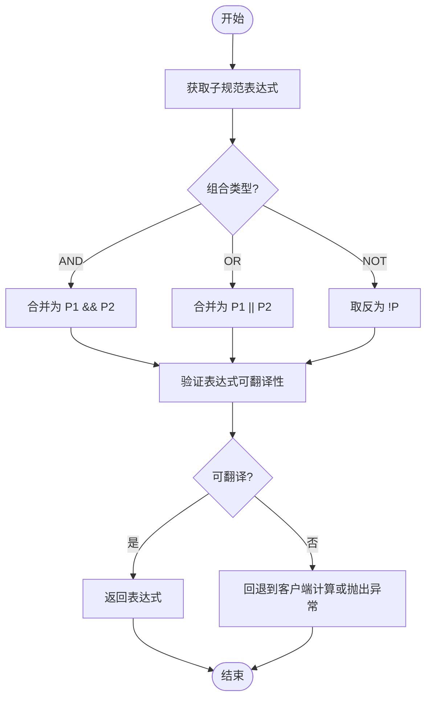
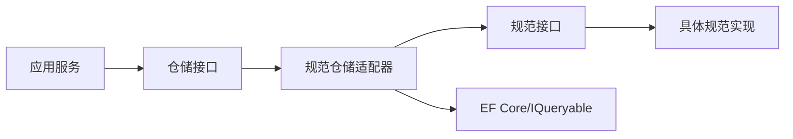

# 规范模式

<cite>
**本文档引用的文件**   
- [specification_pattern.cs](file://specification_pattern.cs)
- [specification_repository.cs](file://specification_repository.cs)
</cite>

## 目录
1. [简介](#简介)
2. [项目结构](#项目结构)
3. [核心组件](#核心组件)
4. [架构总览](#架构总览)
5. [详细组件分析](#详细组件分析)
6. [依赖关系分析](#依赖关系分析)
7. [性能考虑](#性能考虑)
8. [故障排查指南](#故障排查指南)
9. [结论](#结论)
10. [附录](#附录)

## 简介
本文件围绕 VSA 项目中的“规范模式”实现，系统性阐述其设计理念、接口定义、组合方式（AND/OR/NOT）、与仓储模式的集成（LINQ 表达式生成与动态查询构建），以及测试策略与性能优化建议。文档面向不同技术背景的读者，既提供高层概览，也给出代码级分析与图示，帮助在实际业务中声明式表达并复用复杂过滤规则与业务约束。

## 项目结构
VSA 项目中与规范模式相关的核心文件集中在根目录：
- specification_pattern.cs：定义规范接口、基础抽象类及常用逻辑组合器（如 AND、OR、NOT）。
- specification_repository.cs：将规范与仓储层对接，负责把规范转换为 LINQ 表达式并在 EF Core/IQueryable 上执行查询。

图表来源
- [specification_pattern.cs](file://specification_pattern.cs)
- [specification_repository.cs](file://specification_repository.cs)

章节来源
- [specification_pattern.cs](file://specification_pattern.cs)
- [specification_repository.cs](file://specification_repository.cs)

## 核心组件
- 规范接口与抽象基类
  - 职责：定义“是否满足条件”的判定入口，并提供可组合的 LINQ 表达式生成能力。
  - 典型成员：IsSatisfiedBy（对象级判断）、ToExpression（表达式级筛选）。
  - 设计要点：将业务规则从调用方解耦，以“可组合、可测试、可复用”的方式表达。

- 逻辑组合器（AND/OR/NOT）
  - 作用：通过组合多个简单规范形成复杂规则，避免在调用处拼装冗长条件。
  - 实现思路：基于委托或表达式树合并，保证最终生成的 LINQ 表达式可被数据库翻译。

- 规范仓储适配器
  - 职责：接收 ISpecification<T>，将其转换为 IQueryable<T> 过滤器，再交由底层仓储执行。
  - 关键点：表达式拼接顺序、参数化以避免注入、分页与投影的兼容。

章节来源
- [specification_pattern.cs](file://specification_pattern.cs)
- [specification_repository.cs](file://specification_repository.cs)

## 架构总览
下图展示了“应用层 → 规范 → 仓储 → 数据源”的完整链路，强调规范作为“业务规则载体”与“查询表达式生成器”的双重角色。

图表来源
- [specification_pattern.cs](file://specification_pattern.cs)
- [specification_repository.cs](file://specification_repository.cs)

## 详细组件分析

### 规范接口与基础抽象
- 目标：统一“对象判定”和“表达式生成”两个维度，使同一规范既能用于内存过滤，也能用于数据库查询。
- 关键设计
  - IsSatisfiedBy：对单个实体进行布尔判断，便于单元测试与内存场景。
  - ToExpression：返回 Expression<Func<T, bool>>，供 IQueryable 使用。
  - 组合方法：And/Or/Not 等静态或扩展方法，支持链式组合。
- 复杂度与性能
  - 表达式树合并为 O(n)，n 为组合规范数量；合理拆分与缓存可进一步优化。
  - 避免在表达式中使用不可翻译操作，确保 SQL 生成效率。

章节来源
- [specification_pattern.cs](file://specification_pattern.cs)

### 逻辑组合器（AND/OR/NOT）
- 设计要点
  - AND：合并谓词为 x => P1(x) && P2(x)。
  - OR：合并谓词为 x => P1(x) || P2(x)。
  - NOT：取反谓词为 x => !P(x)。
- 注意事项
  - 保持参数名一致，避免重复参数导致表达式树异常。
  - 空规范处理：AND 默认真，OR 默认假，NOT 反转。
  - 短路求值仅适用于内存评估，数据库侧由提供者决定。

章节来源
- [specification_pattern.cs](file://specification_pattern.cs)

### 规范仓储适配器（与仓储集成）
- 职责
  - 将 ISpecification<T>.ToExpression() 应用到 IQueryable<T> 上。
  - 支持分页、排序、投影等常见查询选项。
- 集成流程
  - 接收仓储方法与规范参数。
  - 调用规范生成表达式。
  - 将表达式注入 Where/Select/OrderBy 等链式调用。
  - 返回 IQueryable<T> 或执行后返回结果。
- 常见问题
  - 表达式中包含不可翻译成员会导致客户端计算，影响性能。
  - 参数捕获需序列化或转为常量，避免运行时错误。

章节来源
- [specification_repository.cs](file://specification_repository.cs)

### 类图（代码级关系）

图表来源
- [specification_pattern.cs](file://specification_pattern.cs)
- [specification_repository.cs](file://specification_repository.cs)

### 序列图（查询执行流程）

图表来源
- [specification_pattern.cs](file://specification_pattern.cs)
- [specification_repository.cs](file://specification_repository.cs)

### 流程图（表达式生成与合并）

图表来源
- [specification_pattern.cs](file://specification_pattern.cs)
- [specification_repository.cs](file://specification_repository.cs)

## 依赖关系分析
- 组件耦合
  - 应用层仅依赖 ISpecification<T> 与仓储接口，不感知具体规则实现细节。
  - 规范仓储适配器依赖表达式树与 IQueryable，屏蔽底层数据访问差异。
- 外部依赖
  - EF Core/IQueryable 提供表达式翻译能力。
  - 可选：缓存层用于缓存热点规范表达式以提升性能。
- 潜在循环依赖
  - 规范不应反向依赖仓储；仓储适配器单向依赖规范接口。

图表来源
- [specification_pattern.cs](file://specification_pattern.cs)
- [specification_repository.cs](file://specification_repository.cs)

章节来源
- [specification_pattern.cs](file://specification_pattern.cs)
- [specification_repository.cs](file://specification_repository.cs)

## 性能考虑
- 表达式翻译
  - 尽量使用 EF Core 可翻译的成员与方法，避免客户端计算。
  - 对复杂条件进行拆分与重组，减少单次表达式规模。
- 缓存策略
  - 对热点规范表达式进行缓存（键可为规范类型+参数哈希）。
  - 注意参数变化导致的缓存失效。
- 分页与投影
  - 在 Apply 阶段尽早应用 Where/Select，减少数据传输量。
  - 避免在表达式中进行昂贵计算。
- 并发与线程安全
  - 规范实例应为无状态或只读；组合器返回新实例而非修改原实例。
- 监控与诊断
  - 记录生成的 SQL 与执行计划，定位低效表达式。

[本节为通用指导，不直接分析具体文件]

## 故障排查指南
- 常见问题
  - “无法将 LINQ 表达式转换为 SQL”：检查表达式中是否存在不可翻译成员。
  - “参数未绑定”：确保表达式参数名一致，避免重复捕获。
  - “内存计算导致性能问题”：确认 Where/Select 是否在数据库端执行。
- 排查步骤
  - 打印生成的 SQL，核对 Where/Join/Select 是否符合预期。
  - 逐步简化规范，定位问题片段。
  - 使用 EF Core 日志或第三方工具分析执行计划。
- 修复建议
  - 将不可翻译操作移至内存过滤（明确边界）。
  - 重构表达式，使用可翻译函数与属性。
  - 引入分页与投影，限制返回字段与行数。

章节来源
- [specification_pattern.cs](file://specification_pattern.cs)
- [specification_repository.cs](file://specification_repository.cs)

## 结论
规范模式在 VSA 项目中提供了声明式、可组合的业务规则表达方式，并与仓储层无缝集成，实现了“规则即查询”的能力。通过合理的接口设计与组合器实现，配合良好的测试策略与性能优化，可在复杂过滤与业务验证场景中显著提升代码的可维护性与复用性。

[本节为总结性内容，不直接分析具体文件]

## 附录
- 与其他模式的组合建议
  - 与仓储模式：规范作为查询条件载体，仓储负责执行与映射。
  - 与工厂模式：按配置动态创建规范实例，支持规则热更新。
  - 与策略模式：针对不同数据源切换表达式翻译策略。
  - 与管道模式：将多个规范串联成查询管道，便于中间件增强（如权限过滤）。
- 测试策略
  - 单元测试：针对 IsSatisfiedBy 与 ToExpression 分别覆盖正常与边界情况。
  - 集成测试：验证表达式可翻译性与 SQL 生成正确性。
  - 基准测试：对比不同组合方式的执行时间与 SQL 大小。
- 示例路径（不含代码内容）
  - 基础规范与组合器：[specification_pattern.cs](file://specification_pattern.cs)
  - 规范与仓储集成：[specification_repository.cs](file://specification_repository.cs)

[本节为补充信息，不直接分析具体文件]