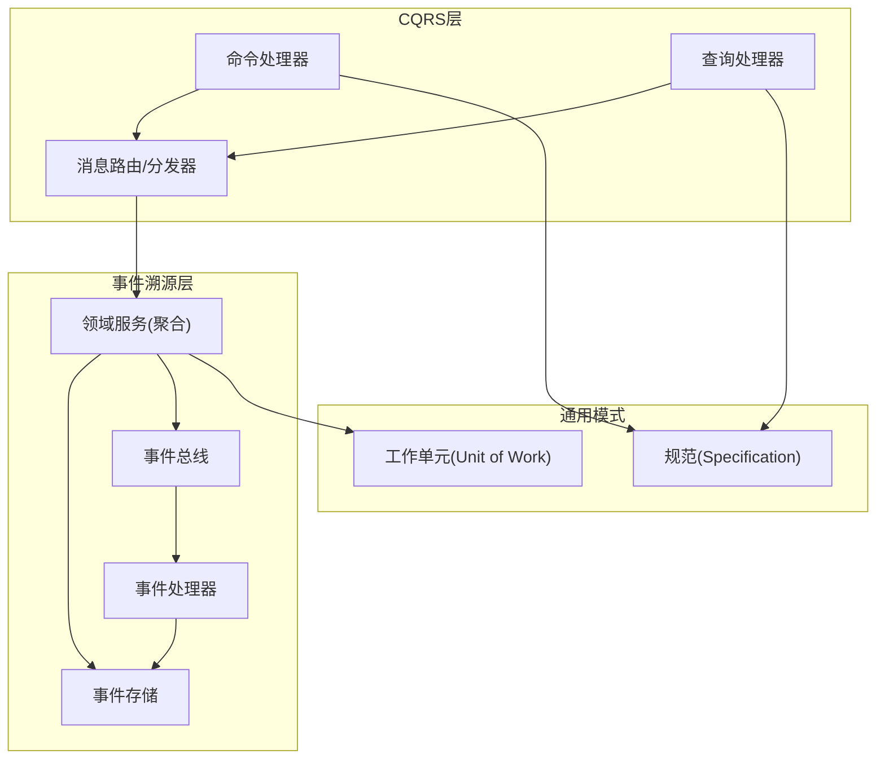
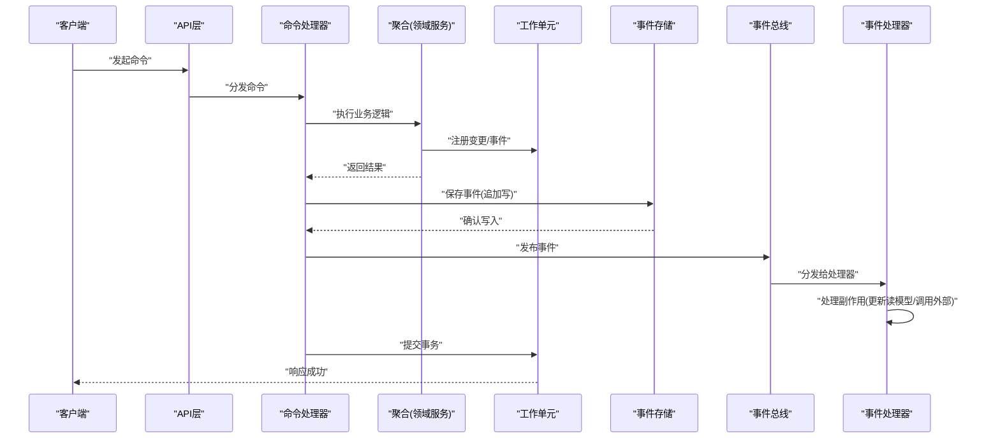
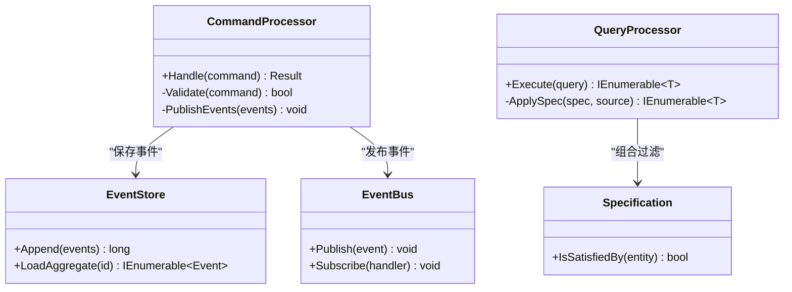
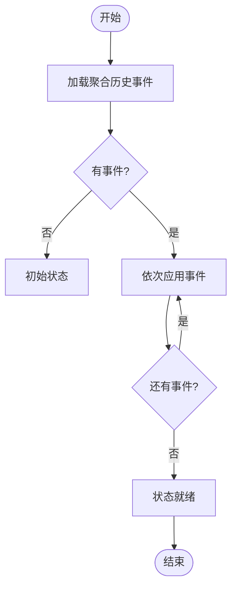
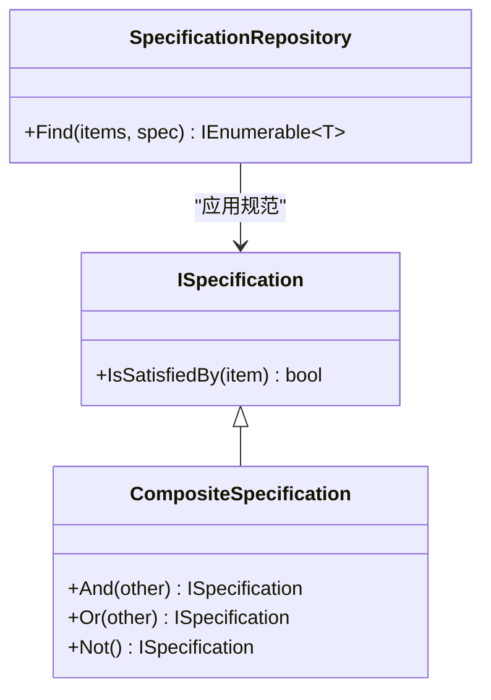
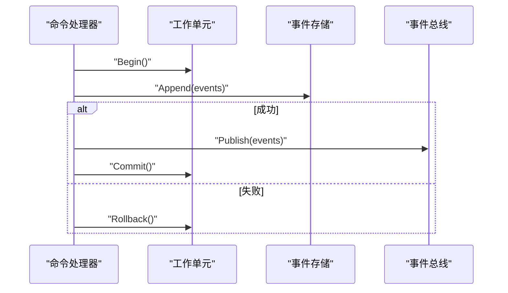
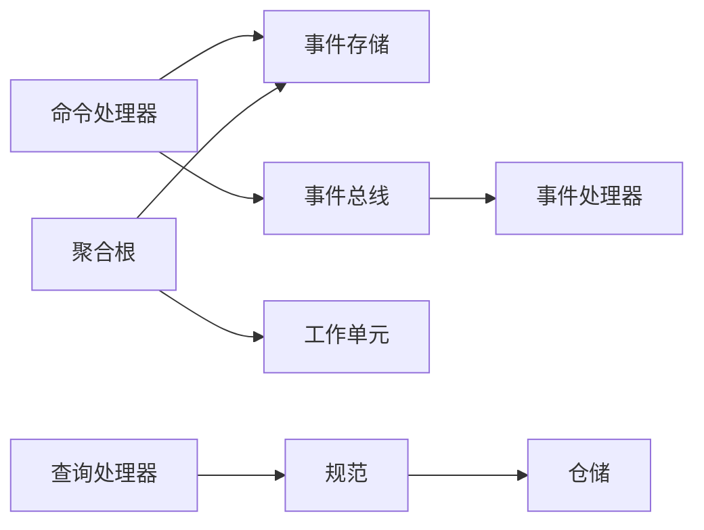

# 设计模式应用

<cite>
**本文引用的文件**   
- [cqrs_impl.cs](file://cqrs_impl.cs)
- [cqrs_processor.cs](file://cqrs_processor.cs)
- [event_sourcing_processor.cs](file://event_sourcing_processor.cs)
- [eventsourcing_service.cs](file://eventsourcing_service.cs)
- [litedb_event_store.cs](file://litedb_event_store.cs)
- [litedb_eventbus.cs](file://litedb_eventbus.cs)
- [litedb_eventhandlers.cs](file://litedb_eventhandlers.cs)
- [specification_pattern.cs](file://specification_pattern.cs)
- [specification_repository.cs](file://specification_repository.cs)
- [unitofwork_integration.cs](file://unitofwork_integration.cs)
</cite>

## 目录
1. [简介](#简介)
2. [项目结构](#项目结构)
3. [核心组件](#核心组件)
4. [架构总览](#架构总览)
5. [详细组件分析](#详细组件分析)
6. [依赖关系分析](#依赖关系分析)
7. [性能考量](#性能考量)
8. [故障排查指南](#故障排查指南)
9. [结论](#结论)
10. [附录](#附录)

## 简介
本文件聚焦VSA项目中设计模式的工程化落地，重点覆盖：
- CQRS（命令查询职责分离）：命令处理器、查询处理器与消息路由机制的设计与协作。
- 事件溯源（Event Sourcing）：事件存储、事件发布订阅、状态重建等关键流程。
- 规范模式（Specification Pattern）：在数据过滤与验证中的统一抽象与组合。
- 工作单元模式（Unit of Work）：在事务管理中的边界控制与一致性保障。

文档通过代码级分析与可视化图示，帮助读者理解各模式的实现要点、交互时序与最佳实践。

## 项目结构
围绕CQRS与事件溯源的核心实现主要分布在以下文件：
- CQRS相关：命令/查询处理器与处理器编排
- 事件溯源相关：事件存储、事件总线、事件处理器与领域服务
- 规范模式：规范定义与仓储集成
- 工作单元：事务边界封装与提交策略

图表来源
- [cqrs_impl.cs:1-200](file://cqrs_impl.cs#L1-L200)
- [cqrs_processor.cs:1-200](file://cqrs_processor.cs#L1-L200)
- [eventsourcing_service.cs:1-200](file://eventsourcing_service.cs#L1-L200)
- [litedb_event_store.cs:1-200](file://litedb_event_store.cs#L1-L200)
- [litedb_eventbus.cs:1-200](file://litedb_eventbus.cs#L1-L200)
- [litedb_eventhandlers.cs:1-200](file://litedb_eventhandlers.cs#L1-L200)
- [specification_pattern.cs:1-200](file://specification_pattern.cs#L1-L200)
- [specification_repository.cs:1-200](file://specification_repository.cs#L1-L200)
- [unitofwork_integration.cs:1-200](file://unitofwork_integration.cs#L1-L200)

章节来源
- [cqrs_impl.cs:1-200](file://cqrs_impl.cs#L1-L200)
- [cqrs_processor.cs:1-200](file://cqrs_processor.cs#L1-L200)
- [eventsourcing_service.cs:1-200](file://eventsourcing_service.cs#L1-L200)
- [litedb_event_store.cs:1-200](file://litedb_event_store.cs#L1-L200)
- [litedb_eventbus.cs:1-200](file://litedb_eventbus.cs#L1-L200)
- [litedb_eventhandlers.cs:1-200](file://litedb_eventhandlers.cs#L1-L200)
- [specification_pattern.cs:1-200](file://specification_pattern.cs#L1-L200)
- [specification_repository.cs:1-200](file://specification_repository.cs#L1-L200)
- [unitofwork_integration.cs:1-200](file://unitofwork_integration.cs#L1-L200)

## 核心组件
- CQRS命令处理器：负责接收命令、执行业务规则、产生领域事件并持久化变更。
- CQRS查询处理器：面向读模型，基于规范或投影进行高效查询。
- 事件存储：以追加写方式记录领域事件，支持按聚合根版本读取与回放。
- 事件总线：解耦事件生产者与消费者，支持同步/异步分发。
- 事件处理器：对特定事件执行副作用（如更新读模型、触发外部系统）。
- 规范：可组合的谓词对象，用于过滤与验证。
- 工作单元：封装一次业务操作内的所有持久化变更，提供统一的提交与回滚。

章节来源
- [cqrs_impl.cs:1-200](file://cqrs_impl.cs#L1-L200)
- [cqrs_processor.cs:1-200](file://cqrs_processor.cs#L1-L200)
- [eventsourcing_service.cs:1-200](file://eventsourcing_service.cs#L1-L200)
- [litedb_event_store.cs:1-200](file://litedb_event_store.cs#L1-L200)
- [litedb_eventbus.cs:1-200](file://litedb_eventbus.cs#L1-L200)
- [litedb_eventhandlers.cs:1-200](file://litedb_eventhandlers.cs#L1-L200)
- [specification_pattern.cs:1-200](file://specification_pattern.cs#L1-L200)
- [specification_repository.cs:1-200](file://specification_repository.cs#L1-L200)
- [unitofwork_integration.cs:1-200](file://unitofwork_integration.cs#L1-L200)

## 架构总览
下图展示了从请求入口到事件落库与后续处理的端到端流程，体现CQRS与事件溯源的协作关系。

图表来源
- [cqrs_impl.cs:1-200](file://cqrs_impl.cs#L1-L200)
- [cqrs_processor.cs:1-200](file://cqrs_processor.cs#L1-L200)
- [eventsourcing_service.cs:1-200](file://eventsourcing_service.cs#L1-L200)
- [litedb_event_store.cs:1-200](file://litedb_event_store.cs#L1-L200)
- [litedb_eventbus.cs:1-200](file://litedb_eventbus.cs#L1-L200)
- [litedb_eventhandlers.cs:1-200](file://litedb_eventhandlers.cs#L1-L200)
- [unitofwork_integration.cs:1-200](file://unitofwork_integration.cs#L1-L200)

## 详细组件分析

### CQRS：命令处理器与查询处理器
- 命令处理器
  - 职责：接收命令、校验输入、驱动聚合根变更、生成领域事件、协调事件持久化与发布。
  - 关键点：与事件存储和事件总线协作；通过工作单元保证事务边界。
- 查询处理器
  - 职责：面向读模型执行查询，常结合规范进行条件过滤与排序分页。
  - 关键点：避免侵入写模型；使用投影或只读仓储提升性能。

图表来源
- [cqrs_impl.cs:1-200](file://cqrs_impl.cs#L1-L200)
- [cqrs_processor.cs:1-200](file://cqrs_processor.cs#L1-L200)
- [litedb_event_store.cs:1-200](file://litedb_event_store.cs#L1-L200)
- [litedb_eventbus.cs:1-200](file://litedb_eventbus.cs#L1-L200)
- [specification_pattern.cs:1-200](file://specification_pattern.cs#L1-L200)

章节来源
- [cqrs_impl.cs:1-200](file://cqrs_impl.cs#L1-L200)
- [cqrs_processor.cs:1-200](file://cqrs_processor.cs#L1-L200)

### 事件溯源：事件存储、发布订阅与状态重建
- 事件存储
  - 追加写语义：每次状态变更以不可变事件形式持久化。
  - 版本控制：支持乐观并发（版本号）与幂等写入。
- 事件发布订阅
  - 事件总线将事件分发给已注册的处理器，支持同步或异步。
- 状态重建
  - 通过重放聚合根的全部历史事件，从零构建当前状态。

图表来源
- [eventsourcing_service.cs:1-200](file://eventsourcing_service.cs#L1-L200)
- [litedb_event_store.cs:1-200](file://litedb_event_store.cs#L1-L200)
- [litedb_eventbus.cs:1-200](file://litedb_eventbus.cs#L1-L200)
- [litedb_eventhandlers.cs:1-200](file://litedb_eventhandlers.cs#L1-L200)

章节来源
- [eventsourcing_service.cs:1-200](file://eventsourcing_service.cs#L1-L200)
- [litedb_event_store.cs:1-200](file://litedb_event_store.cs#L1-L200)
- [litedb_eventbus.cs:1-200](file://litedb_eventbus.cs#L1-L200)
- [litedb_eventhandlers.cs:1-200](file://litedb_eventhandlers.cs#L1-L200)

### 规范模式：数据过滤与验证
- 规范作为可组合的谓词对象，便于复用与组合（AND/OR/NOT）。
- 在查询侧用于过滤集合，在命令侧用于输入验证。
- 与仓储集成，可将规范转换为底层查询表达式。

图表来源
- [specification_pattern.cs:1-200](file://specification_pattern.cs#L1-L200)
- [specification_repository.cs:1-200](file://specification_repository.cs#L1-L200)

章节来源
- [specification_pattern.cs:1-200](file://specification_pattern.cs#L1-L200)
- [specification_repository.cs:1-200](file://specification_repository.cs#L1-L200)

### 工作单元模式：事务管理与一致性
- 工作单元在一次业务操作中收集所有变更，统一提交或回滚。
- 与事件存储协作，确保“事件落库”与“副作用处理”的一致性边界。
- 常见做法：在命令处理器中开启工作单元，捕获异常后回滚，成功后提交。

图表来源
- [unitofwork_integration.cs:1-200](file://unitofwork_integration.cs#L1-L200)
- [litedb_event_store.cs:1-200](file://litedb_event_store.cs#L1-L200)
- [litedb_eventbus.cs:1-200](file://litedb_eventbus.cs#L1-L200)

章节来源
- [unitofwork_integration.cs:1-200](file://unitofwork_integration.cs#L1-L200)

## 依赖关系分析
- CQRS与事件溯源的耦合点：
  - 命令处理器依赖事件存储与事件总线。
  - 聚合根通过工作单元协调持久化与事件发布。
- 规范模式与查询处理器：
  - 查询处理器依赖规范进行过滤，仓储根据规范生成查询。
- 事件处理器与事件存储：
  - 事件处理器可能更新读模型或触发外部系统，通常不直接修改事件流。

图表来源
- [cqrs_impl.cs:1-200](file://cqrs_impl.cs#L1-L200)
- [cqrs_processor.cs:1-200](file://cqrs_processor.cs#L1-L200)
- [eventsourcing_service.cs:1-200](file://eventsourcing_service.cs#L1-L200)
- [litedb_event_store.cs:1-200](file://litedb_event_store.cs#L1-L200)
- [litedb_eventbus.cs:1-200](file://litedb_eventbus.cs#L1-L200)
- [litedb_eventhandlers.cs:1-200](file://litedb_eventhandlers.cs#L1-L200)
- [specification_pattern.cs:1-200](file://specification_pattern.cs#L1-L200)
- [specification_repository.cs:1-200](file://specification_repository.cs#L1-L200)
- [unitofwork_integration.cs:1-200](file://unitofwork_integration.cs#L1-L200)

章节来源
- [cqrs_impl.cs:1-200](file://cqrs_impl.cs#L1-L200)
- [cqrs_processor.cs:1-200](file://cqrs_processor.cs#L1-L200)
- [eventsourcing_service.cs:1-200](file://eventsourcing_service.cs#L1-L200)
- [litedb_event_store.cs:1-200](file://litedb_event_store.cs#L1-L200)
- [litedb_eventbus.cs:1-200](file://litedb_eventbus.cs#L1-L200)
- [litedb_eventhandlers.cs:1-200](file://litedb_eventhandlers.cs#L1-L200)
- [specification_pattern.cs:1-200](file://specification_pattern.cs#L1-L200)
- [specification_repository.cs:1-200](file://specification_repository.cs#L1-L200)
- [unitofwork_integration.cs:1-200](file://unitofwork_integration.cs#L1-L200)

## 性能考量
- 事件存储
  - 追加写优化：批量写入、顺序I/O、分区与归档策略。
  - 版本冲突：采用乐观锁减少锁竞争。
- 事件总线
  - 异步处理：非关键路径副作用异步化，降低主流程延迟。
  - 背压与重试：对下游处理器增加限流、重试与死信队列。
- 查询性能
  - 投影与索引：为高频查询准备只读投影与合适索引。
  - 规范组合：避免过度复杂谓词导致全表扫描。
- 工作单元
  - 合理划分事务边界，避免长事务；必要时拆分跨域操作。

[本节为通用指导，无需引用具体文件]

## 故障排查指南
- 事件丢失或重复
  - 检查事件总线的可靠性与幂等性；确认事件处理器是否具备去重能力。
- 状态不一致
  - 检查工作单元是否正确提交；确认事件落库与副作用处理的顺序。
- 查询结果异常
  - 验证规范的组合逻辑；检查投影是否与事件流一致。
- 性能退化
  - 分析事件回放耗时；评估事件处理器负载与并行度。

章节来源
- [litedb_event_store.cs:1-200](file://litedb_event_store.cs#L1-L200)
- [litedb_eventbus.cs:1-200](file://litedb_eventbus.cs#L1-L200)
- [litedb_eventhandlers.cs:1-200](file://litedb_eventhandlers.cs#L1-L200)
- [specification_pattern.cs:1-200](file://specification_pattern.cs#L1-L200)
- [unitofwork_integration.cs:1-200](file://unitofwork_integration.cs#L1-L200)

## 结论
通过将CQRS、事件溯源、规范模式与工作单元模式有机结合，VSA项目在可维护性、可扩展性与一致性方面取得了良好平衡。命令与查询清晰分离，事件作为唯一事实源，规范提供灵活的过滤与验证，工作单元确保事务边界。建议在生产环境中持续优化事件存储与总线性能，完善监控与可观测性，并加强测试覆盖以确保正确性。

[本节为总结性内容，无需引用具体文件]

## 附录
- 最佳实践建议
  - 事件命名遵循过去时态，明确表达领域变化。
  - 规范尽量保持单一职责，组合时使用明确的复合规范。
  - 工作单元内避免长时间阻塞操作，必要时拆分为后台任务。
  - 对事件处理器实施幂等与重试策略，防止重复消费影响。

[本节为补充说明，无需引用具体文件]