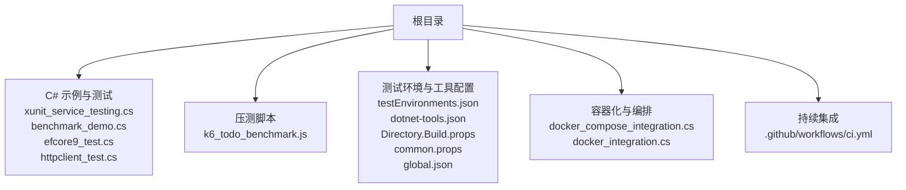
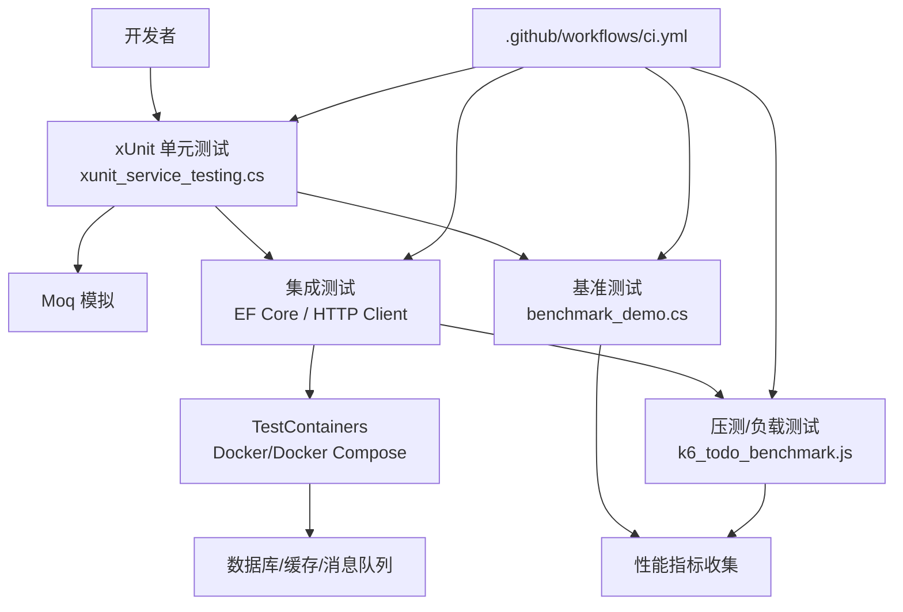
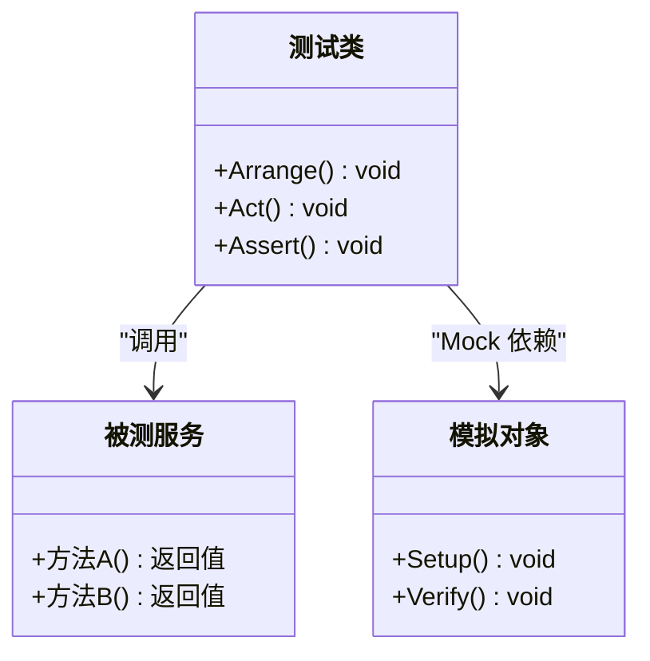
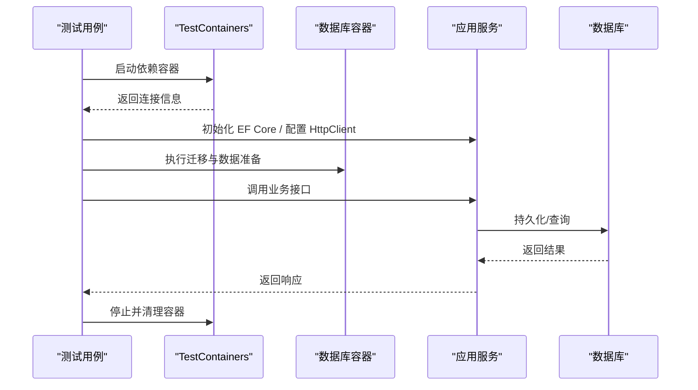
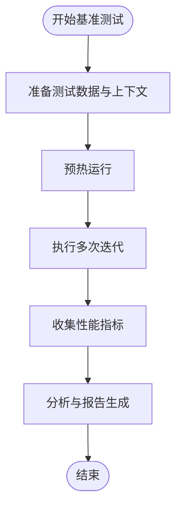
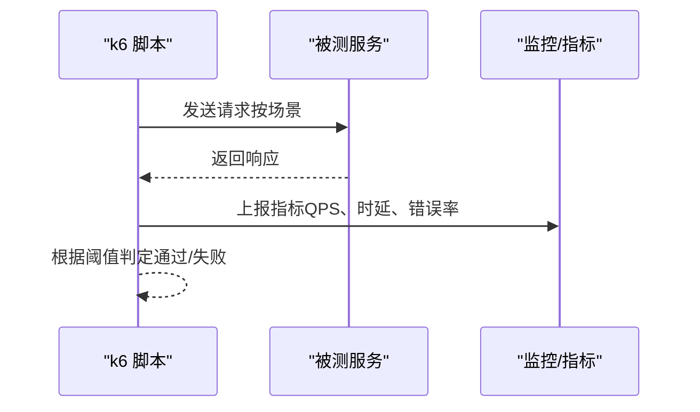
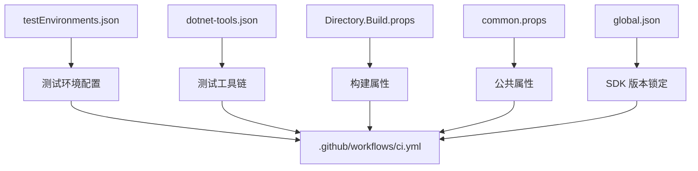
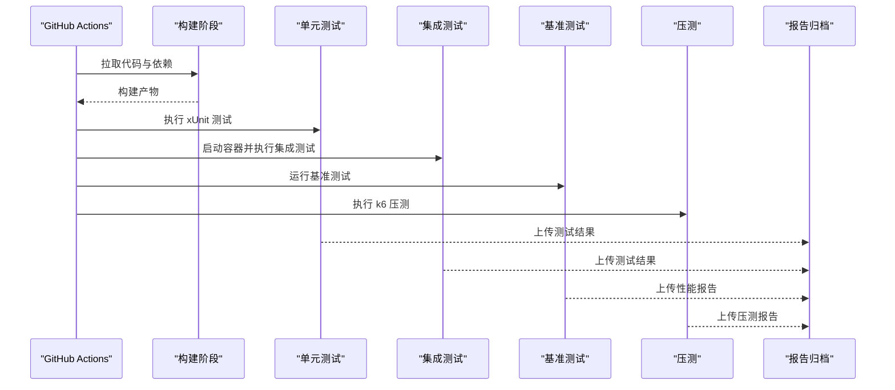
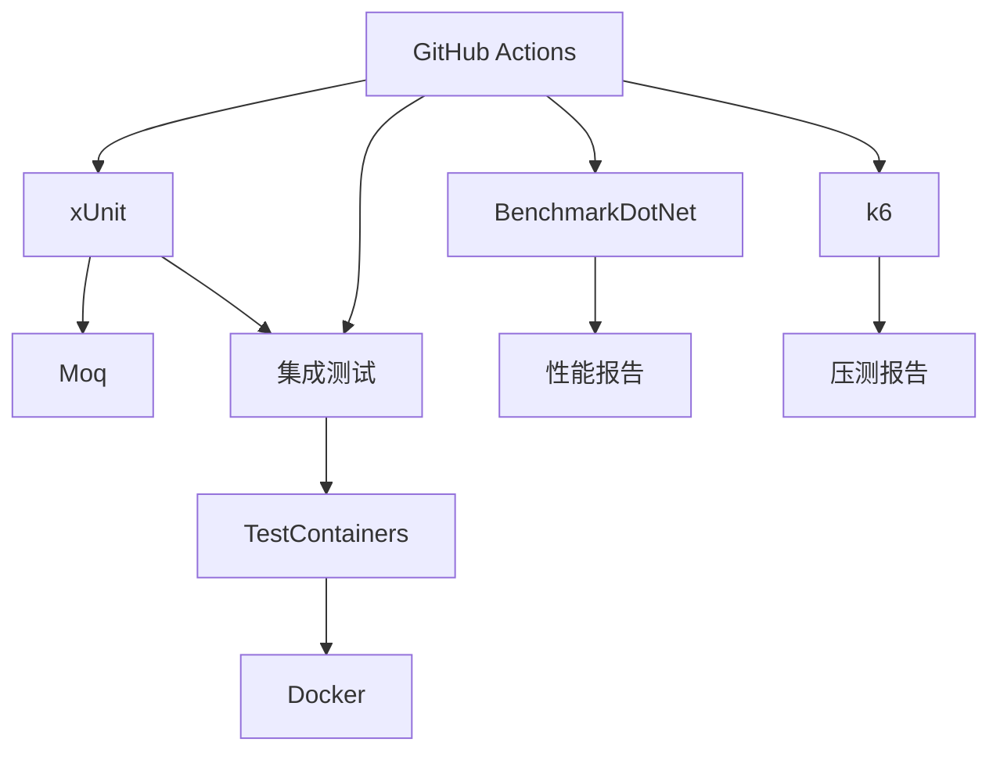

# 测试策略

<cite>
**本文引用的文件**
- [xunit_service_testing.cs](file://xunit_service_testing.cs)
- [benchmark_demo.cs](file://benchmark_demo.cs)
- [k6_todo_benchmark.js](file://k6_todo_benchmark.js)
- [testEnvironments.json](file://testEnvironments.json)
- [Directory.Build.props](file://Directory.Build.props)
- [common.props](file://common.props)
- [global.json](file://global.json)
- [dotnet-tools.json](file://dotnet-tools.json)
- [docker_compose_integration.cs](file://docker_compose_integration.cs)
- [docker_integration.cs](file://docker_integration.cs)
- [efcore9_test.cs](file://efcore9_test.cs)
- [httpclient_test.cs](file://httpclient_test.cs)
- [.github/workflows/ci.yml](file://.github/workflows/ci.yml)
</cite>

## 目录
1. [引言](#引言)
2. [项目结构](#项目结构)
3. [核心组件](#核心组件)
4. [架构总览](#架构总览)
5. [详细组件分析](#详细组件分析)
6. [依赖关系分析](#依赖关系分析)
7. [性能考量](#性能考量)
8. [故障排查指南](#故障排查指南)
9. [结论](#结论)
10. [附录](#附录)

## 引言
本测试策略文档面向本仓库的单元测试、集成测试、性能测试与端到端测试，覆盖以下关键主题：
- xUnit 测试框架的使用规范与最佳实践
- Moq 模拟框架在单元测试中的应用
- TestContainers 容器化测试（通过 Docker/Docker Compose）
- 基准测试、压力测试与负载测试的配置与执行
- 测试数据管理、测试环境搭建与持续集成中的自动化

本仓库包含大量示例与集成代码，其中与测试直接相关的实现与配置包括 xUnit 服务测试、基准测试、k6 压测脚本、Docker/TestContainers 相关示例以及 CI 工作流。本文将基于这些现有材料，给出可落地的测试策略与实施指南。

## 项目结构
从仓库根目录可见，测试相关内容主要分布在以下位置：
- 根级 C# 示例文件：xunit_service_testing.cs、benchmark_demo.cs、efcore9_test.cs、httpclient_test.cs 等
- 压测脚本：k6_todo_benchmark.js
- 测试环境与工具配置：testEnvironments.json、dotnet-tools.json、Directory.Build.props、common.props、global.json
- 容器化与编排：docker_compose_integration.cs、docker_integration.cs
- 持续集成：.github/workflows/ci.yml

图表来源
- [xunit_service_testing.cs](file://xunit_service_testing.cs)
- [benchmark_demo.cs](file://benchmark_demo.cs)
- [k6_todo_benchmark.js](file://k6_todo_benchmark.js)
- [testEnvironments.json](file://testEnvironments.json)
- [Directory.Build.props](file://Directory.Build.props)
- [common.props](file://common.props)
- [global.json](file://global.json)
- [dotnet-tools.json](file://dotnet-tools.json)
- [docker_compose_integration.cs](file://docker_compose_integration.cs)
- [docker_integration.cs](file://docker_integration.cs)
- [.github/workflows/ci.yml](file://.github/workflows/ci.yml)

章节来源
- [xunit_service_testing.cs](file://xunit_service_testing.cs)
- [benchmark_demo.cs](file://benchmark_demo.cs)
- [k6_todo_benchmark.js](file://k6_todo_benchmark.js)
- [testEnvironments.json](file://testEnvironments.json)
- [Directory.Build.props](file://Directory.Build.props)
- [common.props](file://common.props)
- [global.json](file://global.json)
- [dotnet-tools.json](file://dotnet-tools.json)
- [docker_compose_integration.cs](file://docker_compose_integration.cs)
- [docker_integration.cs](file://docker_integration.cs)
- [.github/workflows/ci.yml](file://.github/workflows/ci.yml)

## 核心组件
围绕测试策略的核心组件如下：
- 单元测试框架：xUnit（参考 xunit_service_testing.cs）
- 模拟框架：Moq（用于隔离外部依赖，配合 xUnit）
- 容器化测试：TestContainers（通过 Docker/Docker Compose 启动数据库/消息队列等依赖）
- 基准测试：BenchmarkDotNet（参考 benchmark_demo.cs）
- 压测与负载测试：k6（参考 k6_todo_benchmark.js）
- 测试数据与环境：testEnvironments.json、dotnet-tools.json、Directory.Build.props、common.props、global.json
- 持续集成：GitHub Actions（参考 .github/workflows/ci.yml）

章节来源
- [xunit_service_testing.cs](file://xunit_service_testing.cs)
- [benchmark_demo.cs](file://benchmark_demo.cs)
- [k6_todo_benchmark.js](file://k6_todo_benchmark.js)
- [testEnvironments.json](file://testEnvironments.json)
- [Directory.Build.props](file://Directory.Build.props)
- [common.props](file://common.props)
- [global.json](file://global.json)
- [dotnet-tools.json](file://dotnet-tools.json)
- [.github/workflows/ci.yml](file://.github/workflows/ci.yml)

## 架构总览
下图展示了测试策略的整体架构与交互关系：开发者编写 xUnit 单测与 Moq 模拟；集成测试使用 TestContainers 拉起真实依赖；基准测试使用 BenchmarkDotNet；压测使用 k6；CI 流水线统一触发各类测试并产出报告。

图表来源
- [xunit_service_testing.cs](file://xunit_service_testing.cs)
- [benchmark_demo.cs](file://benchmark_demo.cs)
- [k6_todo_benchmark.js](file://k6_todo_benchmark.js)
- [docker_compose_integration.cs](file://docker_compose_integration.cs)
- [docker_integration.cs](file://docker_integration.cs)
- [.github/workflows/ci.yml](file://.github/workflows/ci.yml)

## 详细组件分析

### 单元测试（xUnit + Moq）
- 目标：快速、稳定地验证业务逻辑与接口契约，隔离外部依赖。
- 实践要点：
  - 使用 xUnit 组织测试用例，遵循 Arrange-Act-Assert 模式。
  - 使用 Moq 对接口进行模拟，避免访问真实 I/O 或网络。
  - 将测试数据内联生成或使用轻量工厂，保持测试独立与可重复。
  - 针对异常路径与边界条件编写断言，确保健壮性。
- 参考实现：xunit_service_testing.cs

图表来源
- [xunit_service_testing.cs](file://xunit_service_testing.cs)

章节来源
- [xunit_service_testing.cs](file://xunit_service_testing.cs)

### 集成测试（TestContainers + EF Core / HTTP Client）
- 目标：验证组件之间的协作与外部依赖交互的正确性。
- 实践要点：
  - 使用 TestContainers 在测试过程中动态启动数据库、缓存、消息队列等容器。
  - 通过 EF Core 连接容器中的数据库，执行迁移与数据准备。
  - 使用 HttpClient 发起真实 HTTP 请求，验证 API 行为。
  - 测试完成后清理容器资源，保证环境干净。
- 参考实现：docker_compose_integration.cs、docker_integration.cs、efcore9_test.cs、httpclient_test.cs

图表来源
- [docker_compose_integration.cs](file://docker_compose_integration.cs)
- [docker_integration.cs](file://docker_integration.cs)
- [efcore9_test.cs](file://efcore9_test.cs)
- [httpclient_test.cs](file://httpclient_test.cs)

章节来源
- [docker_compose_integration.cs](file://docker_compose_integration.cs)
- [docker_integration.cs](file://docker_integration.cs)
- [efcore9_test.cs](file://efcore9_test.cs)
- [httpclient_test.cs](file://httpclient_test.cs)

### 基准测试（BenchmarkDotNet）
- 目标：量化代码性能，识别热点与回归。
- 实践要点：
  - 使用 BenchmarkDotNet 标注基准方法，设置合适的迭代次数与预热。
  - 隔离 GC 与系统噪声，确保结果稳定。
  - 输出详细报告，对比不同实现的吞吐与时延。
- 参考实现：benchmark_demo.cs

图表来源
- [benchmark_demo.cs](file://benchmark_demo.cs)

章节来源
- [benchmark_demo.cs](file://benchmark_demo.cs)

### 压测与负载测试（k6）
- 目标：评估系统在真实流量下的稳定性与容量。
- 实践要点：
  - 使用 k6 脚本定义用户场景、并发与持续时间。
  - 配置阈值与告警，监控错误率与延迟。
  - 结合 CI 自动执行，记录趋势与回归。
- 参考实现：k6_todo_benchmark.js

图表来源
- [k6_todo_benchmark.js](file://k6_todo_benchmark.js)

章节来源
- [k6_todo_benchmark.js](file://k6_todo_benchmark.js)

### 测试数据管理与环境搭建
- 目标：提供稳定、可重复的测试数据与环境。
- 实践要点：
  - 使用 testEnvironments.json 管理多环境配置（开发、测试、预发）。
  - 使用 dotnet-tools.json 声明测试工具链（如 xUnit 运行器、BenchmarkDotNet 等）。
  - 通过 Directory.Build.props 与 common.props 统一构建与测试属性。
  - global.json 锁定 SDK 版本，确保一致性。
- 参考实现：testEnvironments.json、dotnet-tools.json、Directory.Build.props、common.props、global.json

图表来源
- [testEnvironments.json](file://testEnvironments.json)
- [dotnet-tools.json](file://dotnet-tools.json)
- [Directory.Build.props](file://Directory.Build.props)
- [common.props](file://common.props)
- [global.json](file://global.json)
- [.github/workflows/ci.yml](file://.github/workflows/ci.yml)

章节来源
- [testEnvironments.json](file://testEnvironments.json)
- [dotnet-tools.json](file://dotnet-tools.json)
- [Directory.Build.props](file://Directory.Build.props)
- [common.props](file://common.props)
- [global.json](file://global.json)

### 持续集成中的测试自动化
- 目标：在 CI 中自动执行单元测试、集成测试、基准测试与压测，并产出报告。
- 实践要点：
  - 在 .github/workflows/ci.yml 中定义步骤：安装依赖、构建、运行测试、收集报告。
  - 使用缓存加速依赖下载与构建。
  - 并行执行测试任务，缩短反馈时间。
  - 上传测试结果与覆盖率报告，便于回溯与分析。
- 参考实现：.github/workflows/ci.yml

图表来源
- [.github/workflows/ci.yml](file://.github/workflows/ci.yml)

章节来源
- [.github/workflows/ci.yml](file://.github/workflows/ci.yml)

## 依赖关系分析
测试策略涉及的依赖关系如下：
- xUnit 与 Moq：单元测试层依赖
- TestContainers 与 Docker：集成测试层依赖
- BenchmarkDotNet：基准测试层依赖
- k6：压测与负载测试层依赖
- CI（GitHub Actions）：协调各层测试的执行与报告

图表来源
- [xunit_service_testing.cs](file://xunit_service_testing.cs)
- [docker_compose_integration.cs](file://docker_compose_integration.cs)
- [benchmark_demo.cs](file://benchmark_demo.cs)
- [k6_todo_benchmark.js](file://k6_todo_benchmark.js)
- [.github/workflows/ci.yml](file://.github/workflows/ci.yml)

章节来源
- [xunit_service_testing.cs](file://xunit_service_testing.cs)
- [docker_compose_integration.cs](file://docker_compose_integration.cs)
- [benchmark_demo.cs](file://benchmark_demo.cs)
- [k6_todo_benchmark.js](file://k6_todo_benchmark.js)
- [.github/workflows/ci.yml](file://.github/workflows/ci.yml)

## 性能考量
- 基准测试应关注吞吐、时延与内存分配，避免 GC 抖动影响结果。
- 压测需合理设置并发与持续时间，逐步增加负载以发现瓶颈。
- 集成测试应避免冷启动开销，必要时复用容器或连接池。
- 在 CI 中限制测试时长，避免阻塞流水线。

[本节为通用指导，不直接分析具体文件]

## 故障排查指南
- 单元测试失败：检查 Mock 配置是否正确，断言是否匹配预期。
- 集成测试失败：确认 TestContainers 启动成功，数据库迁移是否执行，网络连接是否正常。
- 基准测试不稳定：调整迭代次数与预热，排除系统干扰。
- 压测失败：检查阈值配置与服务健康状态，查看错误日志与指标。
- CI 失败：核对依赖安装、环境变量与权限，查看构建与测试日志。

章节来源
- [xunit_service_testing.cs](file://xunit_service_testing.cs)
- [docker_compose_integration.cs](file://docker_compose_integration.cs)
- [benchmark_demo.cs](file://benchmark_demo.cs)
- [k6_todo_benchmark.js](file://k6_todo_benchmark.js)
- [.github/workflows/ci.yml](file://.github/workflows/ci.yml)

## 结论
本测试策略以 xUnit 与 Moq 为基础，结合 TestContainers 实现可靠的集成测试；通过 BenchmarkDotNet 与 k6 完成性能与压测；借助 CI 实现全流程自动化。建议团队遵循本策略，持续提升代码质量与系统稳定性。

[本节为总结，不直接分析具体文件]

## 附录
- 推荐实践清单：
  - 每个公共接口至少有一个正向与一个异常用例
  - 集成测试覆盖关键外部依赖（数据库、HTTP、消息队列）
  - 基准测试纳入回归检测，定期对比历史数据
  - 压测脚本随功能变更同步更新
  - CI 中并行执行测试，缩短反馈时间

[本节为补充说明，不直接分析具体文件]