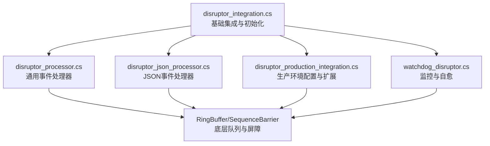
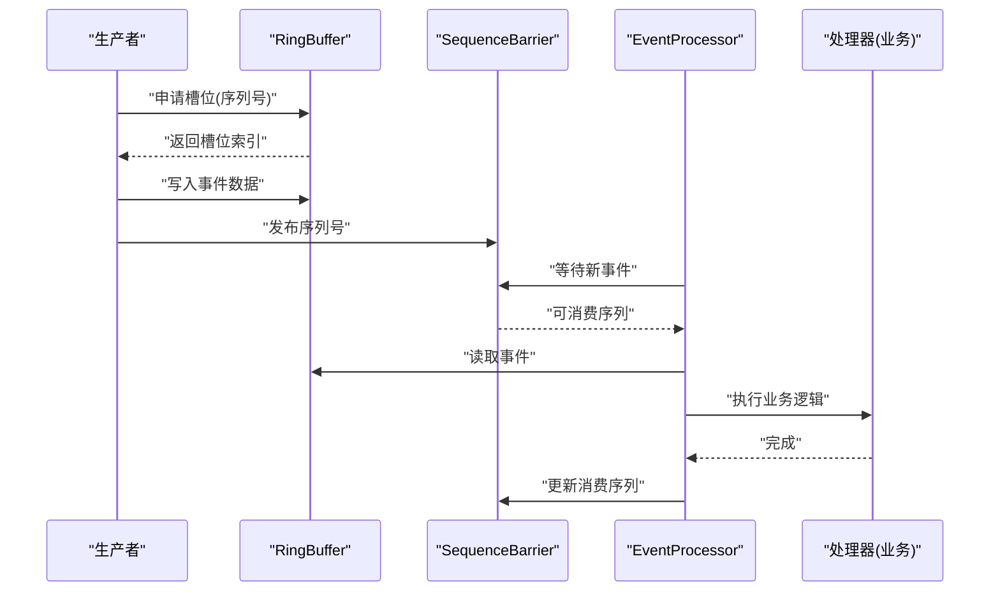
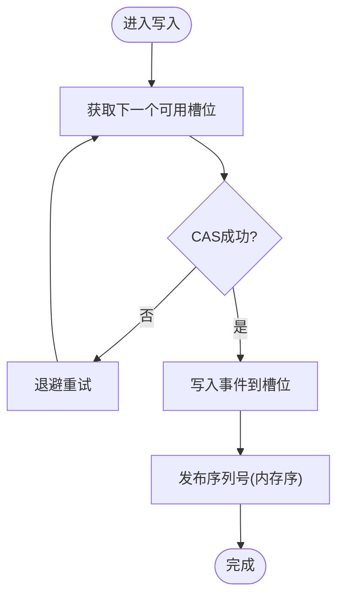
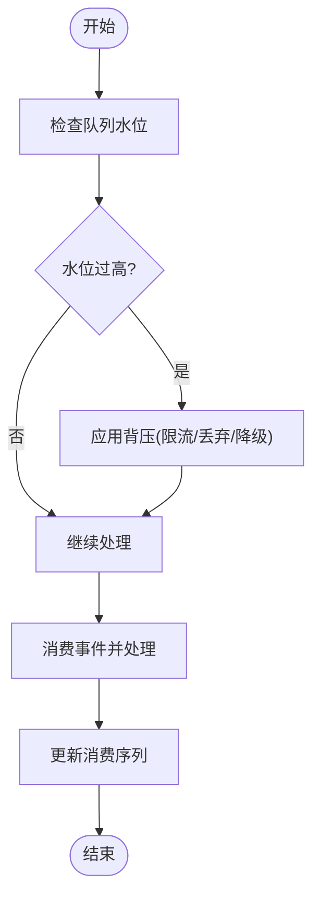
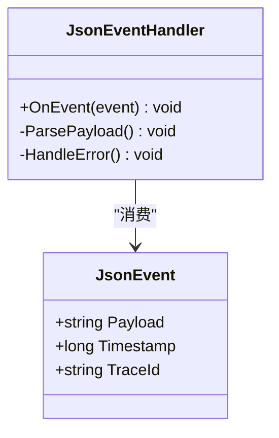
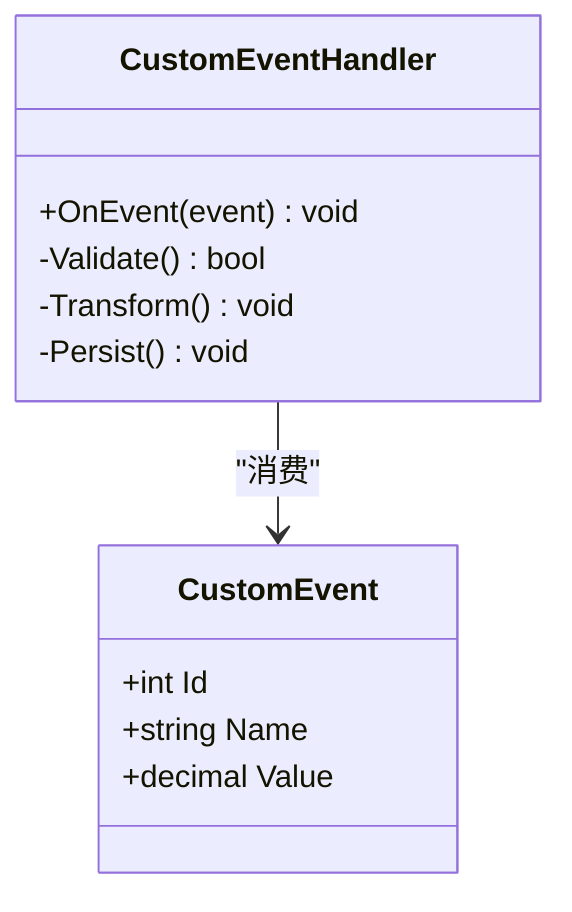
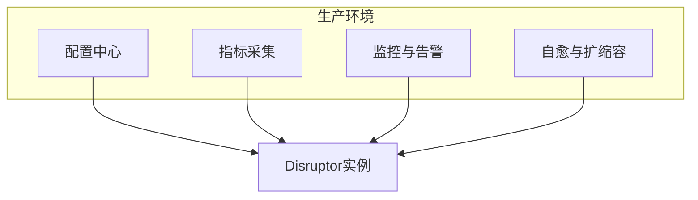
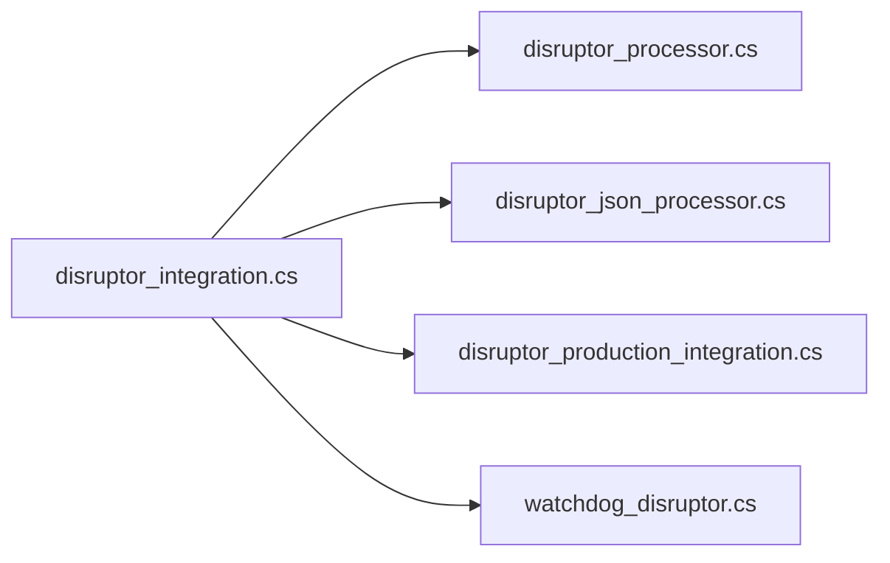

# Disruptor高性能队列

<cite>
**本文引用的文件**   
- [disruptor_integration.cs](file://disruptor_integration.cs)
- [disruptor_json_processor.cs](file://disruptor_json_processor.cs)
- [disruptor_processor.cs](file://disruptor_processor.cs)
- [disruptor_production_integration.cs](file://disruptor_production_integration.cs)
- [watchdog_disruptor.cs](file://watchdog_disruptor.cs)
</cite>

## 目录
1. [简介](#简介)
2. [项目结构](#项目结构)
3. [核心组件](#核心组件)
4. [架构总览](#架构总览)
5. [详细组件分析](#详细组件分析)
6. [依赖关系分析](#依赖关系分析)
7. [性能考量](#性能考量)
8. [故障排查指南](#故障排查指南)
9. [结论](#结论)
10. [附录](#附录)

## 简介
本文件面向.NET开发者，系统性阐述Disruptor高性能无锁队列的原理与工程实践。内容涵盖Ring Buffer内存布局、CAS原子操作与无锁设计思想；在.NET中实现高吞吐消息处理的关键步骤；队列参数调优、内存布局优化与CPU缓存友好设计；JSON处理器与自定义对象处理器的完整示例路径；生产者-消费者模式、背压与流量控制机制；以及与.NET异步编程模型的集成方式和性能基准测试方法。

## 项目结构
仓库中与Disruptor相关的核心代码集中在根目录的几个C#文件中，分别负责基础集成、JSON处理、通用处理器、生产环境集成以及监控守护进程集成。下图展示了这些文件的职责划分与相互关系。

图表来源
- [disruptor_integration.cs](file://disruptor_integration.cs)
- [disruptor_processor.cs](file://disruptor_processor.cs)
- [disruptor_json_processor.cs](file://disruptor_json_processor.cs)
- [disruptor_production_integration.cs](file://disruptor_production_integration.cs)
- [watchdog_disruptor.cs](file://watchdog_disruptor.cs)

章节来源
- [disruptor_integration.cs](file://disruptor_integration.cs)
- [disruptor_processor.cs](file://disruptor_processor.cs)
- [disruptor_json_processor.cs](file://disruptor_json_processor.cs)
- [disruptor_production_integration.cs](file://disruptor_production_integration.cs)
- [watchdog_disruptor.cs](file://watchdog_disruptor.cs)

## 核心组件
- Ring Buffer（环形缓冲区）：固定大小数组，按序列号顺序写入与消费，避免动态分配与锁竞争。
- Sequence（序列号）：每个线程维护一个单调递增的序列号，用于定位槽位。
- SequenceBarrier（屏障）：协调生产者与消费者的可见性与发布顺序。
- EventProcessor（事件处理器）：消费者侧循环拉取事件并执行业务逻辑。
- Producer（生产者）：通过CAS或内存序保证安全写入下一个可用槽位。
- WaitStrategy（等待策略）：决定消费者如何高效等待新事件（如阻塞、自旋、让步等）。

章节来源
- [disruptor_integration.cs](file://disruptor_integration.cs)
- [disruptor_processor.cs](file://disruptor_processor.cs)
- [disruptor_json_processor.cs](file://disruptor_json_processor.cs)
- [disruptor_production_integration.cs](file://disruptor_production_integration.cs)

## 架构总览
下图展示了一个典型的生产者-消费者流水线：生产者将事件放入Ring Buffer，消费者通过EventProcessor读取并处理，WaitStrategy决定等待行为，SequenceBarrier确保可见性。

图表来源
- [disruptor_integration.cs](file://disruptor_integration.cs)
- [disruptor_processor.cs](file://disruptor_processor.cs)
- [disruptor_json_processor.cs](file://disruptor_json_processor.cs)
- [disruptor_production_integration.cs](file://disruptor_production_integration.cs)

## 详细组件分析

### Ring Buffer原理与无锁设计
- 固定大小数组+序列号：通过幂次大小的容量便于位运算寻址，减少取模开销。
- 单写多读：生产者独占写入当前槽位，多个消费者并发读取已发布的事件。
- CAS与内存序：使用比较交换与内存屏障保证可见性与顺序，避免互斥锁。
- 伪共享规避：关键字段（如序列号）进行填充对齐，降低跨核缓存行污染。

图表来源
- [disruptor_integration.cs](file://disruptor_integration.cs)
- [disruptor_production_integration.cs](file://disruptor_production_integration.cs)

章节来源
- [disruptor_integration.cs](file://disruptor_integration.cs)
- [disruptor_production_integration.cs](file://disruptor_production_integration.cs)

### 生产者-消费者模式与背压
- 生产者：批量申请槽位，减少同步开销；遇到队列满时采用背压策略（阻塞、丢弃、降级）。
- 消费者：轮询或阻塞等待新事件；根据负载调整批处理大小与并行度。
- 背压与流量控制：通过限制生产者速率、消费者批处理、超时与重试策略，维持系统稳定。

图表来源
- [disruptor_integration.cs](file://disruptor_integration.cs)
- [disruptor_production_integration.cs](file://disruptor_production_integration.cs)

章节来源
- [disruptor_integration.cs](file://disruptor_integration.cs)
- [disruptor_production_integration.cs](file://disruptor_production_integration.cs)

### JSON处理器实现要点
- 事件模型：定义轻量级JSON事件结构，避免频繁GC。
- 序列化策略：使用零拷贝或池化缓冲，减少分配与拷贝。
- 解析流程：在消费者端按需反序列化，结合批处理提升吞吐。
- 错误处理：捕获解析异常并路由至死信队列或告警通道。

图表来源
- [disruptor_json_processor.cs](file://disruptor_json_processor.cs)

章节来源
- [disruptor_json_processor.cs](file://disruptor_json_processor.cs)

### 自定义对象处理器实现要点
- 事件复用：预分配事件对象并在槽位间复用，避免GC抖动。
- 类型安全：强类型事件模型，编译期校验数据结构。
- 管道化：将复杂处理拆分为多个阶段，每阶段独立处理器。
- 资源管理：对IO、数据库连接等资源进行池化与生命周期管理。

图表来源
- [disruptor_processor.cs](file://disruptor_processor.cs)

章节来源
- [disruptor_processor.cs](file://disruptor_processor.cs)

### 生产环境集成与监控
- 配置项：队列长度、等待策略、处理器数量、批大小、超时与重试。
- 指标采集：吞吐、延迟分布、背压触发次数、错误率。
- 自愈机制：监控队列水位与处理器健康状态，自动扩容或重启。
- 日志与追踪：结构化日志与分布式追踪ID贯穿事件生命周期。

图表来源
- [disruptor_production_integration.cs](file://disruptor_production_integration.cs)
- [watchdog_disruptor.cs](file://watchdog_disruptor.cs)

章节来源
- [disruptor_production_integration.cs](file://disruptor_production_integration.cs)
- [watchdog_disruptor.cs](file://watchdog_disruptor.cs)

## 依赖关系分析
- disruptor_integration.cs：负责Disruptor实例的创建、配置与生命周期管理，串联其他组件。
- disruptor_processor.cs：提供通用事件处理模板，供具体业务处理器继承或组合。
- disruptor_json_processor.cs：专注JSON事件的解析与处理，体现零拷贝与批处理优化。
- disruptor_production_integration.cs：封装生产环境所需的配置、指标、监控与自愈逻辑。
- watchdog_disruptor.cs：守护进程监控Disruptor运行状态，处理异常与恢复。

图表来源
- [disruptor_integration.cs](file://disruptor_integration.cs)
- [disruptor_processor.cs](file://disruptor_processor.cs)
- [disruptor_json_processor.cs](file://disruptor_json_processor.cs)
- [disruptor_production_integration.cs](file://disruptor_production_integration.cs)
- [watchdog_disruptor.cs](file://watchdog_disruptor.cs)

章节来源
- [disruptor_integration.cs](file://disruptor_integration.cs)
- [disruptor_processor.cs](file://disruptor_processor.cs)
- [disruptor_json_processor.cs](file://disruptor_json_processor.cs)
- [disruptor_production_integration.cs](file://disruptor_production_integration.cs)
- [watchdog_disruptor.cs](file://watchdog_disruptor.cs)

## 性能考量
- 队列长度选择：通常为2的幂次，兼顾吞吐与内存占用；过大增加延迟，过小导致频繁背压。
- 等待策略：低延迟场景用自旋或让步策略，高吞吐场景用阻塞策略平衡CPU使用。
- 批处理大小：增大批处理可降低同步开销，但会增加端到端延迟；需权衡。
- 内存布局：事件结构紧凑、避免虚引用链；关键字段对齐以减少伪共享。
- CPU亲和：将生产者与消费者绑定到不同核心，减少缓存一致性开销。
- GC压力：事件复用、对象池、避免装箱；使用Span/Memory减少拷贝。
- 背压策略：根据下游处理能力动态调整上游速率，防止雪崩。

[本节为通用指导，不直接分析具体文件]

## 故障排查指南
- 常见症状：吞吐下降、延迟尖刺、OOM、CPU飙升。
- 排查步骤：
  - 检查队列水位与背压触发频率。
  - 查看处理器耗时分布与异常堆栈。
  - 确认等待策略与批大小是否合理。
  - 验证事件结构与序列化是否引发过多GC。
- 自愈措施：自动重启卡死的消费者、动态扩容处理器、降级非关键路径。

章节来源
- [watchdog_disruptor.cs](file://watchdog_disruptor.cs)
- [disruptor_production_integration.cs](file://disruptor_production_integration.cs)

## 结论
Disruptor通过Ring Buffer与无锁设计在.NET中实现了极高吞吐与极低延迟的消息处理能力。正确配置队列参数、优化内存布局、选择合适的等待策略与批处理大小，并结合背压与监控自愈机制，可在生产环境中获得稳定且高效的性能表现。JSON与自定义对象处理器的示例提供了从简单到复杂的落地路径，建议在实际项目中结合业务特征持续调优。

[本节为总结，不直接分析具体文件]

## 附录
- 术语表：
  - Ring Buffer：环形缓冲区，固定大小数组实现的无锁队列。
  - Sequence：线程级单调递增序列号，用于定位槽位。
  - SequenceBarrier：协调生产者与消费者的可见性与顺序。
  - WaitStrategy：消费者等待新事件的策略。
- 参考实践：
  - 低延迟场景优先自旋/让步等待策略。
  - 高吞吐场景优先阻塞等待策略与较大批处理。
  - 事件结构尽量紧凑，避免虚引用与装箱。
  - 使用对象池与零拷贝技术降低GC压力。

[本节为概念性内容，不直接分析具体文件]