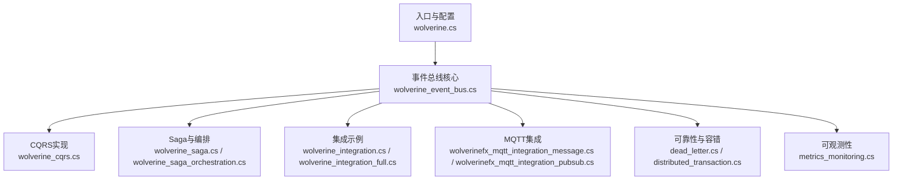
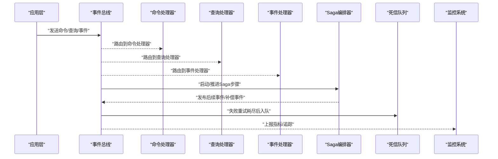
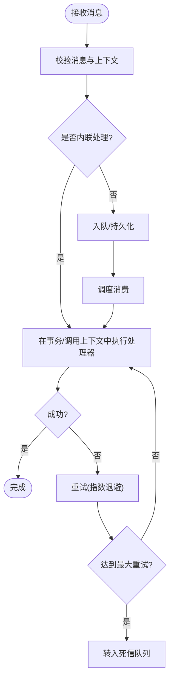
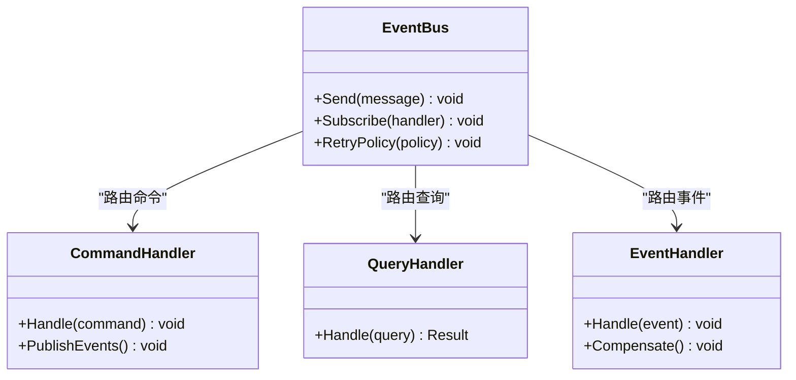
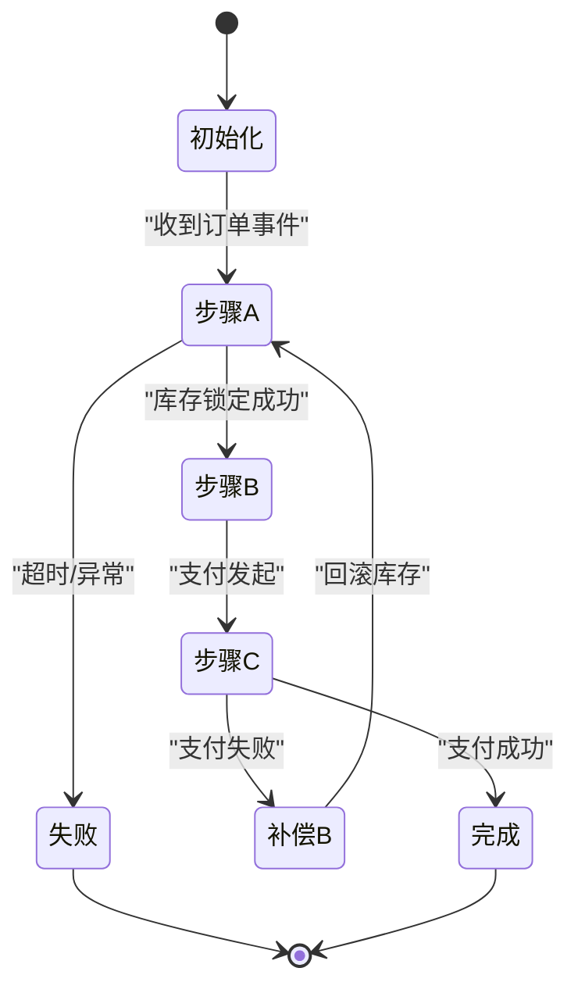
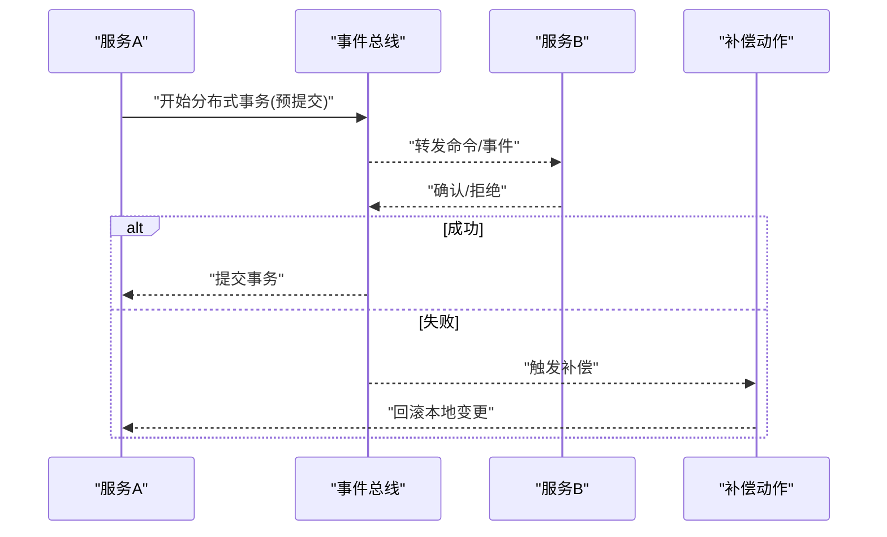
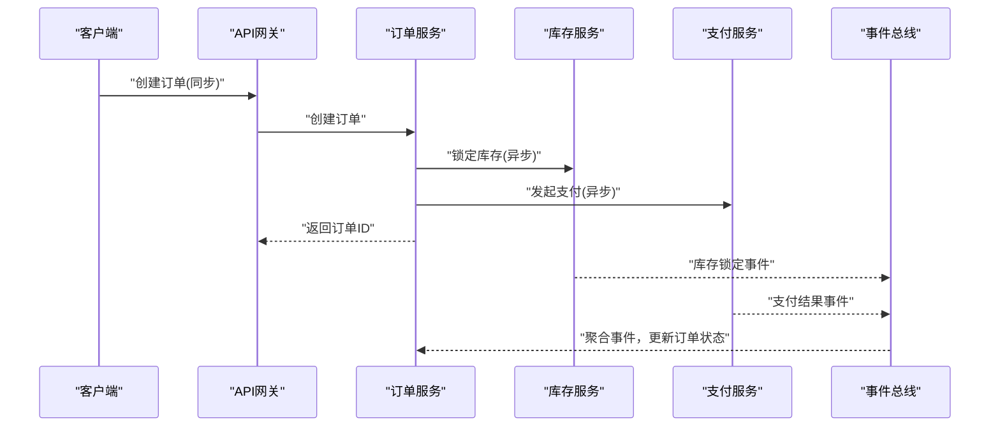
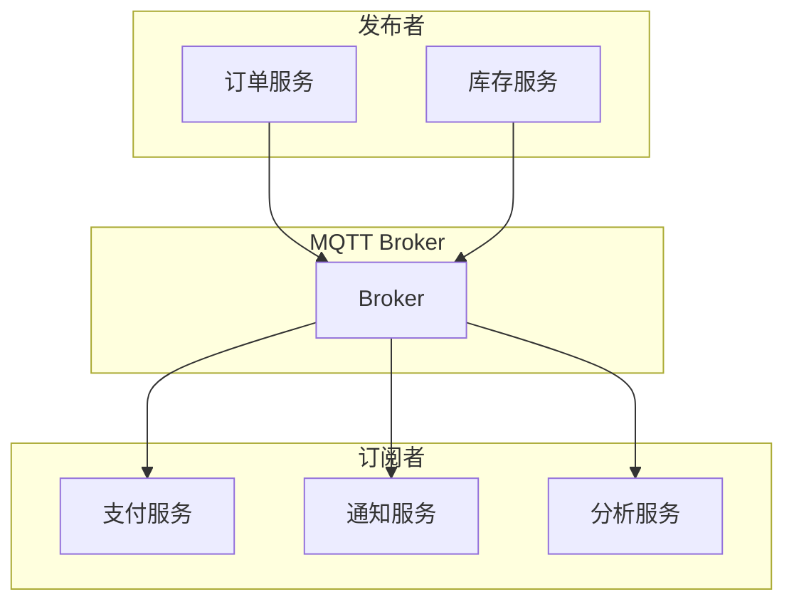
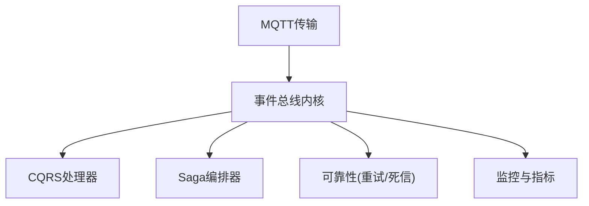

# Wolverine事件总线

<cite>
**本文档引用的文件**   
- [wolverine.cs](file://wolverine.cs)
- [wolverine_event_bus.cs](file://wolverine_event_bus.cs)
- [wolverine_cqrs.cs](file://wolverine_cqrs.cs)
- [wolverine_saga.cs](file://wolverine_saga.cs)
- [wolverine_saga_orchestration.cs](file://wolverine_saga_orchestration.cs)
- [wolverine_integration.cs](file://wolverine_integration.cs)
- [wolverine_integration_full.cs](file://wolverine_integration_full.cs)
- [wolverinefx_mqtt_integration_message.cs](file://wolverinefx_mqtt_integration_message.cs)
- [wolverinefx_mqtt_integration_pubsub.cs](file://wolverinefx_mqtt_integration_pubsub.cs)
- [dead_letter.cs](file://dead_letter.cs)
- [distributed_transaction.cs](file://distributed_transaction.cs)
- [saga_orchestrator.cs](file://saga_orchestrator.cs)
- [metrics_monitoring.cs](file://metrics_monitoring.cs)
</cite>

## 目录
1. [简介](#简介)
2. [项目结构](#项目结构)
3. [核心组件](#核心组件)
4. [架构总览](#架构总览)
5. [详细组件分析](#详细组件分析)
6. [依赖关系分析](#依赖关系分析)
7. [性能考量](#性能考量)
8. [故障排查指南](#故障排查指南)
9. [结论](#结论)
10. [附录](#附录)

## 简介
本文件面向希望使用Wolverine构建现代化消息传递系统的开发者，系统性阐述其作为事件总线的关键能力：内联消息处理、自动重试、死信队列与分布式事务支持。同时覆盖CQRS在Wolverine中的落地方式（命令处理器、查询处理器、事件处理器），以及Saga编排与工作流管理、补偿事务的实现思路。文档还包含微服务间通信的完整示例（同步调用、异步消息、事件驱动），并给出性能监控、错误处理与调试技巧，帮助读者快速上手并稳定生产。

## 项目结构
围绕Wolverine的事件总线与相关模式，仓库中提供了多组示例与集成代码，涵盖基础用法、CQRS、Saga编排、MQTT集成、死信队列、分布式事务与监控等主题。整体组织以“按主题分文件”的方式呈现，便于按需查阅与对照实现。

图表来源
- [wolverine.cs](file://wolverine.cs)
- [wolverine_event_bus.cs](file://wolverine_event_bus.cs)
- [wolverine_cqrs.cs](file://wolverine_cqrs.cs)
- [wolverine_saga.cs](file://wolverine_saga.cs)
- [wolverine_saga_orchestration.cs](file://wolverine_saga_orchestration.cs)
- [wolverine_integration.cs](file://wolverine_integration.cs)
- [wolverine_integration_full.cs](file://wolverine_integration_full.cs)
- [wolverinefx_mqtt_integration_message.cs](file://wolverinefx_mqtt_integration_message.cs)
- [wolverinefx_mqtt_integration_pubsub.cs](file://wolverinefx_mqtt_integration_pubsub.cs)
- [dead_letter.cs](file://dead_letter.cs)
- [distributed_transaction.cs](file://distributed_transaction.cs)
- [metrics_monitoring.cs](file://metrics_monitoring.cs)

章节来源
- [wolverine.cs](file://wolverine.cs)
- [wolverine_event_bus.cs](file://wolverine_event_bus.cs)
- [wolverine_cqrs.cs](file://wolverine_cqrs.cs)
- [wolverine_saga.cs](file://wolverine_saga.cs)
- [wolverine_saga_orchestration.cs](file://wolverine_saga_orchestration.cs)
- [wolverine_integration.cs](file://wolverine_integration.cs)
- [wolverine_integration_full.cs](file://wolverine_integration_full.cs)
- [wolverinefx_mqtt_integration_message.cs](file://wolverinefx_mqtt_integration_message.cs)
- [wolverinefx_mqtt_integration_pubsub.cs](file://wolverinefx_mqtt_integration_pubsub.cs)
- [dead_letter.cs](file://dead_letter.cs)
- [distributed_transaction.cs](file://distributed_transaction.cs)
- [metrics_monitoring.cs](file://metrics_monitoring.cs)

## 核心组件
- 事件总线内核：负责消息路由、分发、持久化与重试策略，提供内联处理与异步执行两种模式。
- CQRS处理器：命令处理器用于写操作，查询处理器用于读操作，事件处理器响应领域事件，三者职责清晰、解耦。
- Saga编排器：通过状态机或工作流定义跨服务的长事务，支持补偿动作与失败恢复。
- 可靠性机制：自动重试、退避策略、死信队列与事务边界控制。
- 可观测性与监控：指标采集、链路追踪与诊断日志。

章节来源
- [wolverine_event_bus.cs](file://wolverine_event_bus.cs)
- [wolverine_cqrs.cs](file://wolverine_cqrs.cs)
- [wolverine_saga_orchestration.cs](file://wolverine_saga_orchestration.cs)
- [dead_letter.cs](file://dead_letter.cs)
- [distributed_transaction.cs](file://distributed_transaction.cs)
- [metrics_monitoring.cs](file://metrics_monitoring.cs)

## 架构总览
下图展示Wolverine事件总线在微服务场景中的典型交互：应用层通过命令/查询接口触发处理，事件总线将消息路由到对应处理器；Saga编排器协调跨服务流程，必要时触发补偿；所有关键路径具备重试与死信机制，并通过监控上报指标。

图表来源
- [wolverine_event_bus.cs](file://wolverine_event_bus.cs)
- [wolverine_cqrs.cs](file://wolverine_cqrs.cs)
- [wolverine_saga_orchestration.cs](file://wolverine_saga_orchestration.cs)
- [dead_letter.cs](file://dead_letter.cs)
- [metrics_monitoring.cs](file://metrics_monitoring.cs)

## 详细组件分析

### 事件总线与内联处理
- 内联消息处理：在事务或调用上下文中直接执行业务逻辑，减少网络往返与序列化开销，提升吞吐与一致性。
- 自动重试与退避：对瞬态错误进行指数退避重试，避免雪崩；可配置最大重试次数与间隔。
- 死信队列：当重试耗尽或不可恢复错误发生时，消息进入死信队列以便人工干预与审计。
- 事务边界：与数据库或外部系统的事务保持一致，确保最终一致性。

图表来源
- [wolverine_event_bus.cs](file://wolverine_event_bus.cs)
- [dead_letter.cs](file://dead_letter.cs)

章节来源
- [wolverine_event_bus.cs](file://wolverine_event_bus.cs)
- [dead_letter.cs](file://dead_letter.cs)

### CQRS模式实现
- 命令处理器：处理写操作，通常伴随副作用与事件发布；强调幂等与事务边界。
- 查询处理器：纯读操作，无副作用，适合缓存与优化。
- 事件处理器：响应领域事件，驱动下游系统更新或触发Saga步骤。

图表来源
- [wolverine_cqrs.cs](file://wolverine_cqrs.cs)
- [wolverine_event_bus.cs](file://wolverine_event_bus.cs)

章节来源
- [wolverine_cqrs.cs](file://wolverine_cqrs.cs)
- [wolverine_event_bus.cs](file://wolverine_event_bus.cs)

### Saga编排与工作流管理
- 编排器：维护Saga状态机，按事件驱动推进步骤，支持并发与超时。
- 补偿事务：为每个正向步骤定义补偿动作，失败时回滚已完成的副作用。
- 工作流：将复杂业务拆分为多个子流程，通过事件串联，提高可维护性与可测试性。

图表来源
- [wolverine_saga_orchestration.cs](file://wolverine_saga_orchestration.cs)
- [wolverine_saga.cs](file://wolverine_saga.cs)

章节来源
- [wolverine_saga_orchestration.cs](file://wolverine_saga_orchestration.cs)
- [wolverine_saga.cs](file://wolverine_saga.cs)

### 分布式事务支持
- 两阶段提交/补偿：在跨服务场景中，通过Saga或TCC模式保证一致性。
- 事务边界：明确本地事务与分布式事务的边界，避免长事务与锁竞争。
- 幂等与去重：通过消息ID或业务键实现幂等，防止重复处理。

图表来源
- [distributed_transaction.cs](file://distributed_transaction.cs)
- [wolverine_event_bus.cs](file://wolverine_event_bus.cs)

章节来源
- [distributed_transaction.cs](file://distributed_transaction.cs)
- [wolverine_event_bus.cs](file://wolverine_event_bus.cs)

### 微服务间通信示例
- 同步调用：通过HTTP/gRPC等协议进行请求-响应式调用，适用于强一致与低延迟场景。
- 异步消息：基于事件总线进行解耦通信，提升吞吐与弹性。
- 事件驱动：以领域事件驱动下游系统更新，实现最终一致性。

图表来源
- [wolverine_integration.cs](file://wolverine_integration.cs)
- [wolverine_integration_full.cs](file://wolverine_integration_full.cs)
- [wolverine_event_bus.cs](file://wolverine_event_bus.cs)

章节来源
- [wolverine_integration.cs](file://wolverine_integration.cs)
- [wolverine_integration_full.cs](file://wolverine_integration_full.cs)
- [wolverine_event_bus.cs](file://wolverine_event_bus.cs)

### MQTT集成与发布订阅
- 消息通道：通过MQTT作为传输层，实现轻量级发布订阅。
- 主题路由：按业务域划分主题，结合QoS保障消息投递。
- 离线与重连：客户端断线自动重连，支持消息持久化与回溯。

图表来源
- [wolverinefx_mqtt_integration_message.cs](file://wolverinefx_mqtt_integration_message.cs)
- [wolverinefx_mqtt_integration_pubsub.cs](file://wolverinefx_mqtt_integration_pubsub.cs)

章节来源
- [wolverinefx_mqtt_integration_message.cs](file://wolverinefx_mqtt_integration_message.cs)
- [wolverinefx_mqtt_integration_pubsub.cs](file://wolverinefx_mqtt_integration_pubsub.cs)

## 依赖关系分析
Wolverine事件总线与各组件之间的依赖关系如下：事件总线为核心，CQRS处理器、Saga编排器、可靠性机制与监控模块均与其交互。MQTT集成作为可选传输层，增强跨服务通信能力。

图表来源
- [wolverine_event_bus.cs](file://wolverine_event_bus.cs)
- [wolverine_cqrs.cs](file://wolverine_cqrs.cs)
- [wolverine_saga_orchestration.cs](file://wolverine_saga_orchestration.cs)
- [dead_letter.cs](file://dead_letter.cs)
- [metrics_monitoring.cs](file://metrics_monitoring.cs)
- [wolverinefx_mqtt_integration_message.cs](file://wolverinefx_mqtt_integration_message.cs)
- [wolverinefx_mqtt_integration_pubsub.cs](file://wolverinefx_mqtt_integration_pubsub.cs)

章节来源
- [wolverine_event_bus.cs](file://wolverine_event_bus.cs)
- [wolverine_cqrs.cs](file://wolverine_cqrs.cs)
- [wolverine_saga_orchestration.cs](file://wolverine_saga_orchestration.cs)
- [dead_letter.cs](file://dead_letter.cs)
- [metrics_monitoring.cs](file://metrics_monitoring.cs)
- [wolverinefx_mqtt_integration_message.cs](file://wolverinefx_mqtt_integration_message.cs)
- [wolverinefx_mqtt_integration_pubsub.cs](file://wolverinefx_mqtt_integration_pubsub.cs)

## 性能考量
- 内联处理优先：在事务或调用上下文中直接执行处理器，减少序列化与网络开销。
- 批量与批处理：合并小消息批量处理，降低I/O压力。
- 背压与限流：在高负载下限制消费者速率，避免资源耗尽。
- 缓存与只读优化：查询处理器配合缓存，降低数据库压力。
- 连接池与资源复用：合理配置连接池大小与超时，避免连接泄漏。

[本节为通用指导，不直接分析具体文件]

## 故障排查指南
- 死信队列分析：检查失败消息内容、错误堆栈与重试历史，定位根因。
- 重试策略调优：调整最大重试次数与退避间隔，避免过度重试导致雪崩。
- 事务与一致性：核对事务边界与幂等键，避免重复处理或数据不一致。
- 监控与追踪：利用指标与链路追踪定位瓶颈与异常路径。
- 日志与诊断：开启详细日志，记录关键上下文与中间状态。

章节来源
- [dead_letter.cs](file://dead_letter.cs)
- [metrics_monitoring.cs](file://metrics_monitoring.cs)
- [wolverine_event_bus.cs](file://wolverine_event_bus.cs)

## 结论
Wolverine事件总线通过内联处理、自动重试、死信队列与分布式事务等特性，为微服务架构提供了高可靠、高性能的消息传递能力。结合CQRS与Saga编排，能够有效解耦系统、提升可维护性与可扩展性。在生产环境中，建议配合完善的监控与调试手段，持续优化性能与稳定性。

[本节为总结性内容，不直接分析具体文件]

## 附录
- 最佳实践清单：
  - 明确命令、查询与事件的边界，保持处理器单一职责。
  - 设计幂等处理器与唯一消息ID，避免重复处理。
  - 合理设置重试与退避策略，避免放大故障。
  - 使用Saga编排复杂业务流程，定义清晰的补偿动作。
  - 启用监控与追踪，建立告警与自愈机制。
- 参考示例：
  - 同步调用与异步消息混合场景：参见集成示例文件。
  - MQTT发布订阅与主题路由：参见MQTT集成文件。
  - 死信队列与重试策略：参见可靠性相关文件。

[本节为补充信息，不直接分析具体文件]