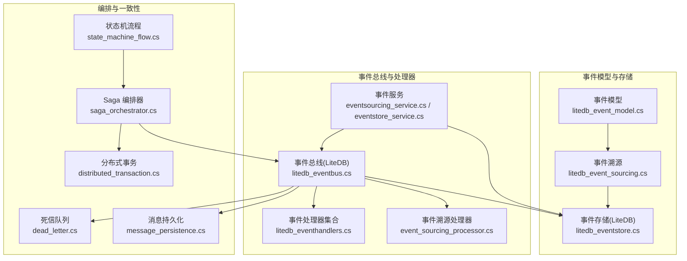
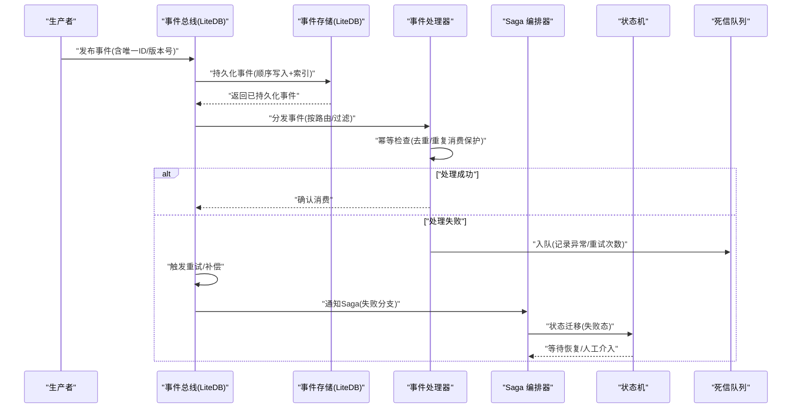
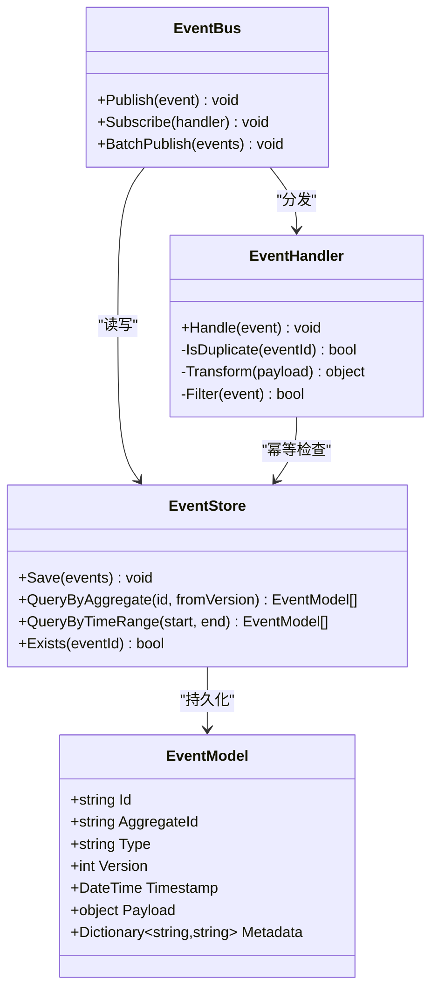
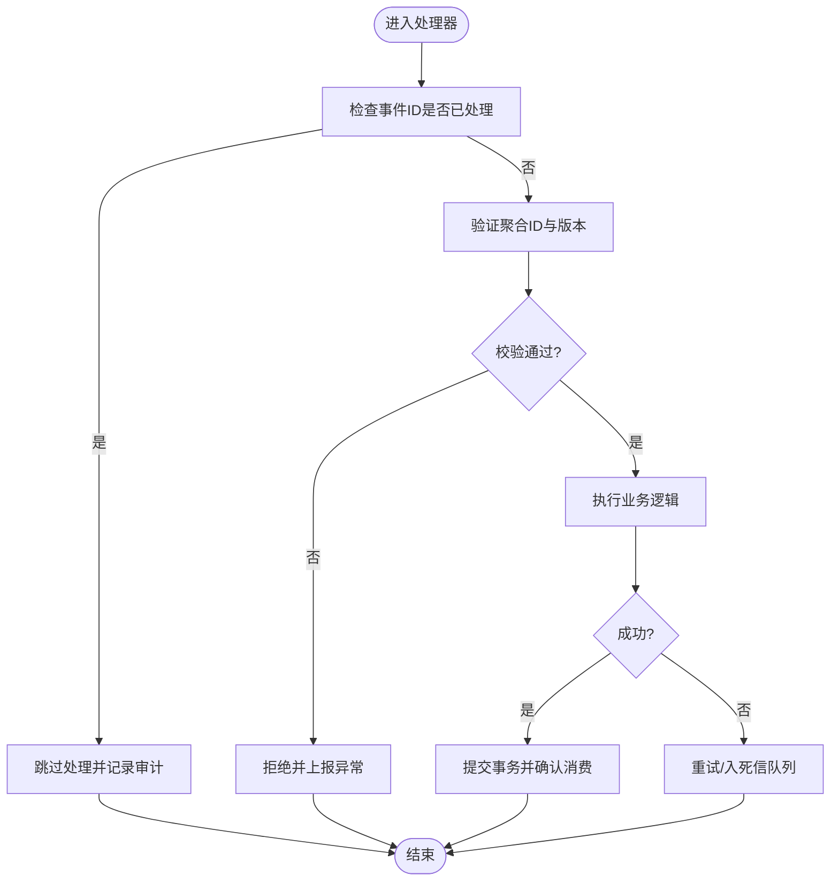
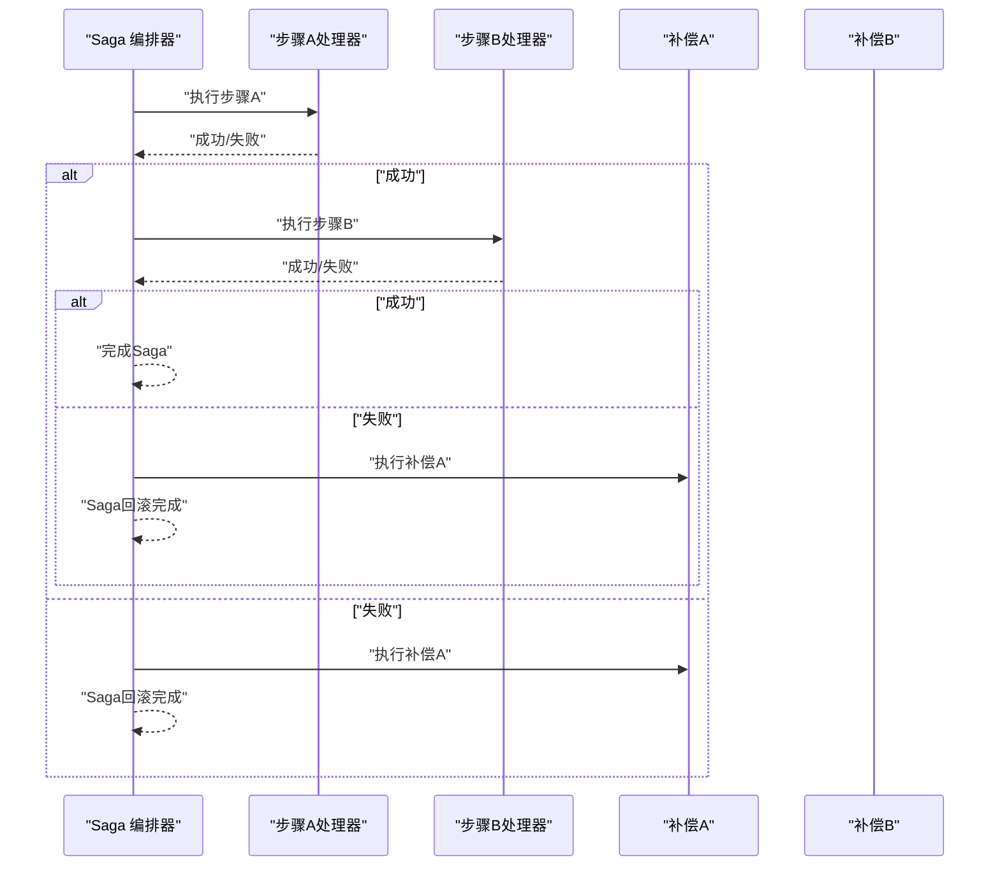
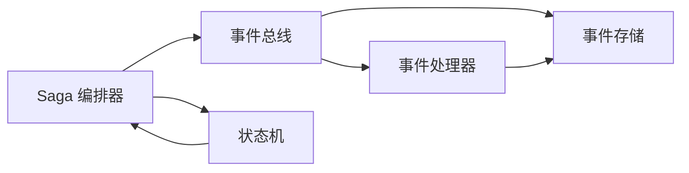

# 事件处理器设计

<cite>
**本文引用的文件**   
- [litedb_event_model.cs](file://litedb_event_model.cs)
- [litedb_event_sourcing.cs](file://litedb_event_sourcing.cs)
- [litedb_eventbus.cs](file://litedb_eventbus.cs)
- [litedb_eventhandlers.cs](file://litedb_eventhandlers.cs)
- [litedb_eventstore.cs](file://litedb_eventstore.cs)
- [event_sourcing_processor.cs](file://event_sourcing_processor.cs)
- [eventsourcing_service.cs](file://eventsourcing_service.cs)
- [eventstore_service.cs](file://eventstore_service.cs)
- [saga_orchestrator.cs](file://saga_orchestrator.cs)
- [state_machine_flow.cs](file://state_machine_flow.cs)
- [wolverinefx_saga_integration.cs](file://wolverinefx_saga_integration.cs)
- [wolverine_saga.cs](file://wolverine_saga.cs)
- [wolverine_saga_orchestration.cs](file://wolverine_saga_orchestration.cs)
- [dead_letter.cs](file://dead_letter.cs)
- [message_persistence.cs](file://message_persistence.cs)
- [distributed_transaction.cs](file://distributed_transaction.cs)
</cite>

## 目录
1. [简介](#简介)
2. [项目结构](#项目结构)
3. [核心组件](#核心组件)
4. [架构总览](#架构总览)
5. [详细组件分析](#详细组件分析)
6. [依赖关系分析](#依赖关系分析)
7. [性能考量](#性能考量)
8. [故障排查指南](#故障排查指南)
9. [结论](#结论)
10. [附录](#附录)

## 简介
本指南围绕“事件处理器”的设计与实现，系统性阐述职责分离、幂等性保证、错误处理策略，以及基于 LiteDB 的事件处理器落地方案。内容涵盖事件排序与去重、复杂业务流程编排（Saga、状态机、长事务）、事件过滤/路由/转换最佳实践、测试策略与模拟环境、分布式一致性保障与冲突解决机制。读者可据此构建高内聚、低耦合、可观测、可回滚且具备强一致性的事件驱动系统。

## 项目结构
仓库包含大量集成示例与能力片段，其中与事件处理直接相关的核心文件集中在根目录的若干 .cs 文件中，包括：
- 事件模型与事件溯源：litedb_event_model.cs、litedb_event_sourcing.cs
- 事件总线与存储：litedb_eventbus.cs、litedb_eventstore.cs
- 事件处理器与编排：litedb_eventhandlers.cs、event_sourcing_processor.cs、eventsourcing_service.cs、eventstore_service.cs
- Saga 与状态机：saga_orchestrator.cs、state_machine_flow.cs、wolverinefx_saga_integration.cs、wolverine_saga.cs、wolverine_saga_orchestration.cs
- 可靠性与一致性：dead_letter.cs、message_persistence.cs、distributed_transaction.cs

**图表来源** 
- [litedb_event_model.cs](file://litedb_event_model.cs)
- [litedb_event_sourcing.cs](file://litedb_event_sourcing.cs)
- [litedb_eventbus.cs](file://litedb_eventbus.cs)
- [litedb_eventstore.cs](file://litedb_eventstore.cs)
- [litedb_eventhandlers.cs](file://litedb_eventhandlers.cs)
- [event_sourcing_processor.cs](file://event_sourcing_processor.cs)
- [eventsourcing_service.cs](file://eventsourcing_service.cs)
- [eventstore_service.cs](file://eventstore_service.cs)
- [saga_orchestrator.cs](file://saga_orchestrator.cs)
- [state_machine_flow.cs](file://state_machine_flow.cs)
- [dead_letter.cs](file://dead_letter.cs)
- [message_persistence.cs](file://message_persistence.cs)
- [distributed_transaction.cs](file://distributed_transaction.cs)

**章节来源**
- [litedb_event_model.cs](file://litedb_event_model.cs)
- [litedb_event_sourcing.cs](file://litedb_event_sourcing.cs)
- [litedb_eventbus.cs](file://litedb_eventbus.cs)
- [litedb_eventstore.cs](file://litedb_eventstore.cs)
- [litedb_eventhandlers.cs](file://litedb_eventhandlers.cs)
- [event_sourcing_processor.cs](file://event_sourcing_processor.cs)
- [eventsourcing_service.cs](file://eventsourcing_service.cs)
- [eventstore_service.cs](file://eventstore_service.cs)
- [saga_orchestrator.cs](file://saga_orchestrator.cs)
- [state_machine_flow.cs](file://state_machine_flow.cs)
- [dead_letter.cs](file://dead_letter.cs)
- [message_persistence.cs](file://message_persistence.cs)
- [distributed_transaction.cs](file://distributed_transaction.cs)

## 核心组件
- 事件模型与事件溯源
  - 定义事件类型、版本、时间戳、关联上下文与聚合标识，确保事件不可变与可追溯。
  - 通过事件溯源将业务状态变化以事件序列形式持久化，便于回放与审计。
- 事件总线与存储
  - 基于 LiteDB 提供本地或嵌入式事件总线，支持顺序写入、幂等投递与基础查询。
  - 事件存储负责事件落盘、索引与分页读取，为处理器提供稳定数据源。
- 事件处理器集合
  - 按领域划分处理器，每个处理器专注单一职责，避免跨域副作用。
  - 支持过滤器、转换器与路由规则，实现细粒度控制。
- 事件溯源处理器与服务
  - 统一消费事件流，维护投影与聚合状态，提供查询接口。
  - 封装重试、补偿与异常上报逻辑，提升健壮性。
- Saga 编排器与状态机
  - 使用 Saga 协调多步骤业务流程，保证最终一致性。
  - 状态机驱动流程推进，明确状态转移与补偿动作。
- 可靠性与一致性
  - 死信队列捕获失败消息，支持人工干预与自动重试。
  - 消息持久化确保不丢消息；分布式事务用于跨边界一致性。

**章节来源**
- [litedb_event_model.cs](file://litedb_event_model.cs)
- [litedb_event_sourcing.cs](file://litedb_event_sourcing.cs)
- [litedb_eventbus.cs](file://litedb_eventbus.cs)
- [litedb_eventstore.cs](file://litedb_eventstore.cs)
- [litedb_eventhandlers.cs](file://litedb_eventhandlers.cs)
- [event_sourcing_processor.cs](file://event_sourcing_processor.cs)
- [eventsourcing_service.cs](file://eventsourcing_service.cs)
- [eventstore_service.cs](file://eventstore_service.cs)
- [saga_orchestrator.cs](file://saga_orchestrator.cs)
- [state_machine_flow.cs](file://state_machine_flow.cs)
- [dead_letter.cs](file://dead_letter.cs)
- [message_persistence.cs](file://message_persistence.cs)
- [distributed_transaction.cs](file://distributed_transaction.cs)

## 架构总览
下图展示从事件产生到处理、编排与落盘的端到端流程，强调幂等、排序、去重与错误处理的关键点。

**图表来源** 
- [litedb_eventbus.cs](file://litedb_eventbus.cs)
- [litedb_eventstore.cs](file://litedb_eventstore.cs)
- [litedb_eventhandlers.cs](file://litedb_eventhandlers.cs)
- [saga_orchestrator.cs](file://saga_orchestrator.cs)
- [state_machine_flow.cs](file://state_machine_flow.cs)
- [dead_letter.cs](file://dead_letter.cs)

**章节来源**
- [litedb_eventbus.cs](file://litedb_eventbus.cs)
- [litedb_eventstore.cs](file://litedb_eventstore.cs)
- [litedb_eventhandlers.cs](file://litedb_eventhandlers.cs)
- [saga_orchestrator.cs](file://saga_orchestrator.cs)
- [state_machine_flow.cs](file://state_machine_flow.cs)
- [dead_letter.cs](file://dead_letter.cs)

## 详细组件分析

### 基于 LiteDB 的事件处理器实现
- 事件模型
  - 字段包含事件类型、全局唯一 ID、聚合 ID、版本号、时间戳、负载与扩展元数据。
  - 通过不可变设计与强类型序列化保障一致性。
- 事件存储
  - 使用 LiteDB 表存储事件，建立唯一键与时间索引，支持按聚合与时间范围查询。
  - 写入采用事务包裹，确保原子性与顺序性。
- 事件总线
  - 提供发布/订阅接口，内部调用事件存储进行持久化与分发。
  - 支持批量提交与延迟投递，降低锁竞争。
- 事件处理器
  - 每个处理器实现单一职责，接收事件后执行领域逻辑。
  - 内置幂等校验（基于事件 ID 与聚合 ID），避免重复处理。
  - 支持过滤器（按类型/标签）与转换器（载荷映射）。

**图表来源** 
- [litedb_event_model.cs](file://litedb_event_model.cs)
- [litedb_eventstore.cs](file://litedb_eventstore.cs)
- [litedb_eventbus.cs](file://litedb_eventbus.cs)
- [litedb_eventhandlers.cs](file://litedb_eventhandlers.cs)

**章节来源**
- [litedb_event_model.cs](file://litedb_event_model.cs)
- [litedb_eventstore.cs](file://litedb_eventstore.cs)
- [litedb_eventbus.cs](file://litedb_eventbus.cs)
- [litedb_eventhandlers.cs](file://litedb_eventhandlers.cs)

### 事件排序与去重机制
- 排序
  - 基于时间戳与版本号双重排序，确保同一聚合的顺序性。
  - 在事件存储层建立复合索引，支持高效范围扫描。
- 去重
  - 使用事件全局唯一 ID 作为幂等键，结合聚合 ID 做二次校验。
  - 在处理器入口进行重复检测，命中则跳过处理并记录审计日志。
- 一致性
  - 写入采用事务，读路径使用快照或一致性游标，避免脏读。

**图表来源** 
- [litedb_eventhandlers.cs](file://litedb_eventhandlers.cs)
- [litedb_eventstore.cs](file://litedb_eventstore.cs)

**章节来源**
- [litedb_eventhandlers.cs](file://litedb_eventhandlers.cs)
- [litedb_eventstore.cs](file://litedb_eventstore.cs)

### 复杂业务流程编排：Saga、状态机与长事务
- Saga 模式
  - 将长流程拆分为多个步骤，每步对应一个事件与补偿动作。
  - 编排器维护 Saga 实例状态，处理成功与失败分支。
- 状态机设计
  - 明确状态集合与转移条件，禁止非法跳转。
  - 状态变更由事件驱动，保证可回放与可审计。
- 长事务管理
  - 使用 Saga 替代传统 ACID 事务，通过补偿达成最终一致性。
  - 对关键操作引入分布式事务或两阶段协议（如适用）。

**图表来源** 
- [saga_orchestrator.cs](file://saga_orchestrator.cs)
- [state_machine_flow.cs](file://state_machine_flow.cs)
- [wolverinefx_saga_integration.cs](file://wolverinefx_saga_integration.cs)
- [wolverine_saga.cs](file://wolverine_saga.cs)
- [wolverine_saga_orchestration.cs](file://wolverine_saga_orchestration.cs)

**章节来源**
- [saga_orchestrator.cs](file://saga_orchestrator.cs)
- [state_machine_flow.cs](file://state_machine_flow.cs)
- [wolverinefx_saga_integration.cs](file://wolverinefx_saga_integration.cs)
- [wolverine_saga.cs](file://wolverine_saga.cs)
- [wolverine_saga_orchestration.cs](file://wolverine_saga_orchestration.cs)

### 事件过滤、路由与转换最佳实践
- 过滤
  - 基于事件类型、标签与元数据进行粗粒度过滤，减少无关处理器负载。
  - 在总线层实现短路过滤，避免无效分发。
- 路由
  - 按领域或聚合维度路由，确保处理器职责单一。
  - 支持动态路由规则，便于热更新与灰度发布。
- 转换
  - 在处理器入口处进行载荷转换，保持领域模型纯净。
  - 使用映射器或生成器减少样板代码，提高可读性。

**章节来源**
- [litedb_eventbus.cs](file://litedb_eventbus.cs)
- [litedb_eventhandlers.cs](file://litedb_eventhandlers.cs)

### 事件处理器的测试策略与模拟环境
- 单元测试
  - 针对处理器逻辑编写用例，覆盖正常、异常与边界场景。
  - 使用内存事件存储与总线模拟真实行为。
- 集成测试
  - 搭建完整链路，验证事件流转、幂等与补偿。
  - 注入死信队列与监控指标，观察失败路径。
- 模拟环境
  - 使用轻量级容器或进程内模拟外部依赖（数据库、消息中间件）。
  - 提供种子数据与回放脚本，复现历史问题。

**章节来源**
- [litedb_eventstore.cs](file://litedb_eventstore.cs)
- [litedb_eventbus.cs](file://litedb_eventbus.cs)
- [dead_letter.cs](file://dead_letter.cs)

### 分布式环境下的一致性保证与冲突解决
- 一致性
  - 通过事件溯源与幂等键保证最终一致性。
  - 使用 Saga 协调跨服务操作，补偿失败分支。
- 冲突解决
  - 基于版本号与乐观锁避免并发写冲突。
  - 引入冲突检测与合并策略（如最后写入胜出或自定义合并函数）。
- 容错
  - 死信队列与重试策略提升鲁棒性。
  - 监控告警与可观测性辅助快速定位问题。

**章节来源**
- [distributed_transaction.cs](file://distributed_transaction.cs)
- [message_persistence.cs](file://message_persistence.cs)
- [dead_letter.cs](file://dead_letter.cs)

## 依赖关系分析
- 组件耦合
  - 事件总线依赖事件存储，处理器依赖总线与存储。
  - Saga 编排器依赖总线与状态机，形成编排闭环。
- 外部依赖
  - LiteDB 作为嵌入式数据库，提供高性能读写与简单 API。
  - 可选集成分布式事务与消息中间件，增强一致性。
- 循环依赖
  - 通过接口抽象与依赖注入避免循环引用。

**图表来源** 
- [litedb_eventbus.cs](file://litedb_eventbus.cs)
- [litedb_eventstore.cs](file://litedb_eventstore.cs)
- [litedb_eventhandlers.cs](file://litedb_eventhandlers.cs)
- [saga_orchestrator.cs](file://saga_orchestrator.cs)
- [state_machine_flow.cs](file://state_machine_flow.cs)

**章节来源**
- [litedb_eventbus.cs](file://litedb_eventbus.cs)
- [litedb_eventstore.cs](file://litedb_eventstore.cs)
- [litedb_eventhandlers.cs](file://litedb_eventhandlers.cs)
- [saga_orchestrator.cs](file://saga_orchestrator.cs)
- [state_machine_flow.cs](file://state_machine_flow.cs)

## 性能考量
- 写入优化
  - 批量提交事件，减少事务开销。
  - 使用无锁队列或内存池缓冲热点事件。
- 读取优化
  - 建立复合索引，按聚合与时间范围查询。
  - 使用分页与游标避免全量扫描。
- 并发控制
  - 按聚合分片并行处理，避免全局锁。
  - 合理设置线程池大小与背压策略。
- 资源管理
  - 连接池与对象池复用，减少 GC 压力。
  - 监控 CPU、内存与 I/O 指标，及时扩容或降级。

[本节为通用指导，无需特定文件来源]

## 故障排查指南
- 常见问题
  - 事件丢失：检查消息持久化与事务提交。
  - 重复处理：确认幂等键与去重逻辑。
  - 处理失败：查看死信队列与异常日志。
- 诊断工具
  - 启用追踪与指标采集，定位瓶颈。
  - 使用回放脚本重现问题，逐步缩小范围。
- 恢复策略
  - 从最近快照重建状态，避免长时间回放。
  - 人工介入修复数据，重新触发补偿。

**章节来源**
- [dead_letter.cs](file://dead_letter.cs)
- [message_persistence.cs](file://message_persistence.cs)

## 结论
通过职责分离、幂等性保证与完善的错误处理策略，结合 LiteDB 的高效存储与事件溯源，可以构建可靠、可扩展且易于维护的事件驱动系统。Saga 与状态机为复杂流程编排提供了清晰框架，配合分布式一致性机制与性能优化手段，能够在生产环境中稳定运行。建议在实践中持续完善监控、测试与文档，确保系统演进的可控性与可观测性。

[本节为总结性内容，无需特定文件来源]

## 附录
- 术语表
  - 事件溯源：以事件序列表示状态变化的设计模式。
  - Saga：通过一系列本地事务与补偿动作实现最终一致性的编排模式。
  - 幂等性：多次执行相同操作结果一致的特性。
  - 死信队列：存放无法处理的消息以便后续处理的队列。
- 参考实现
  - 事件模型与存储：litedb_event_model.cs、litedb_eventstore.cs
  - 事件总线与处理器：litedb_eventbus.cs、litedb_eventhandlers.cs
  - 编排与一致性：saga_orchestrator.cs、state_machine_flow.cs、dead_letter.cs

[本节为补充信息，无需特定文件来源]