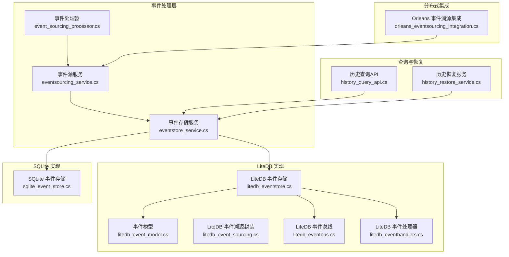
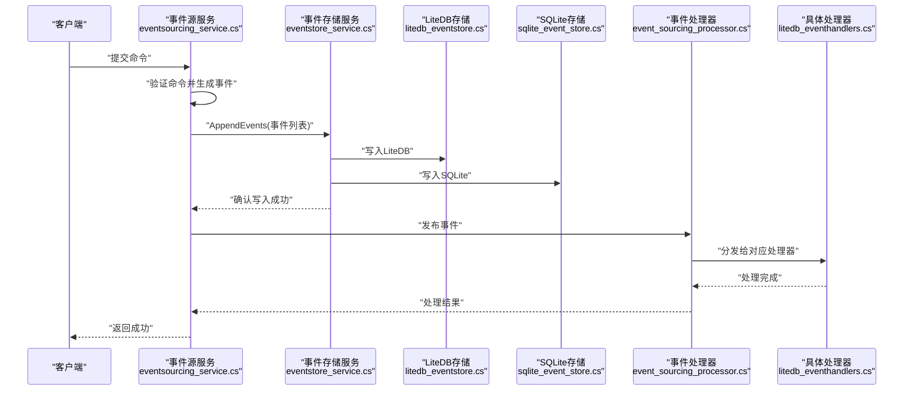
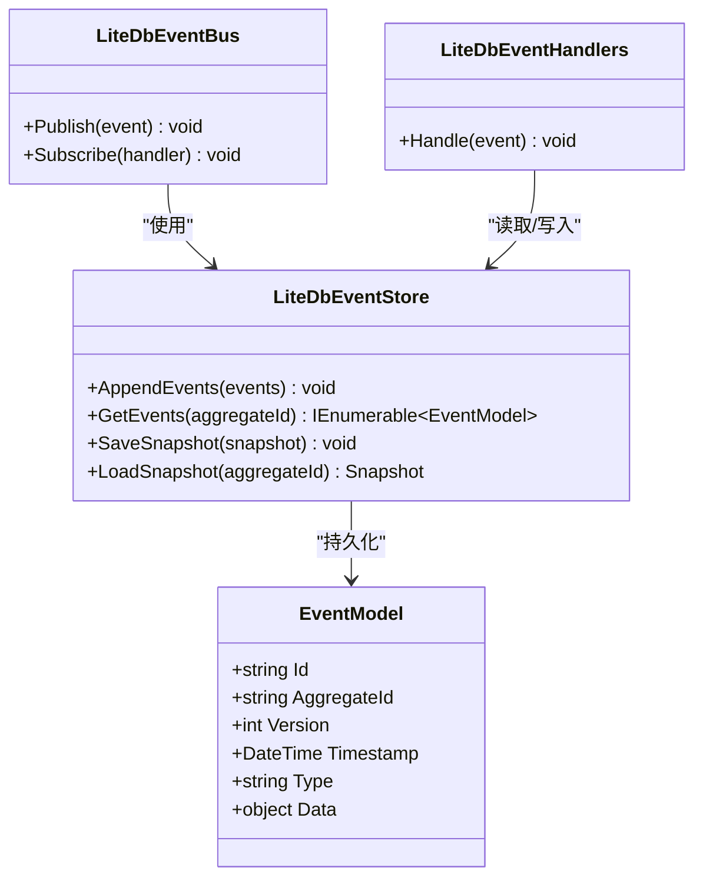
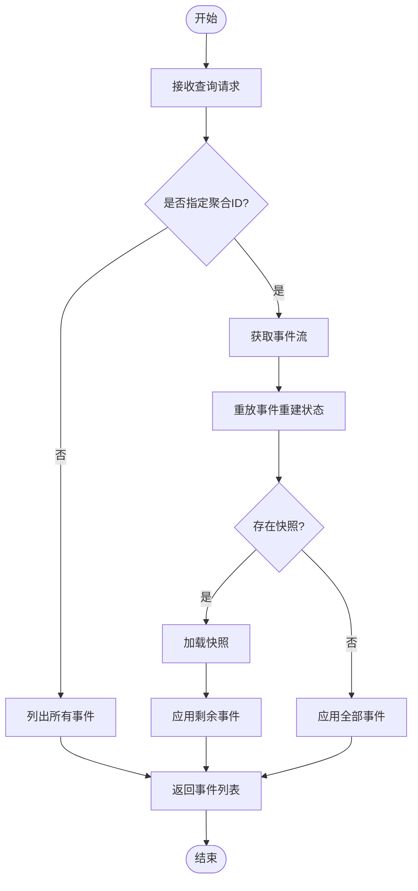
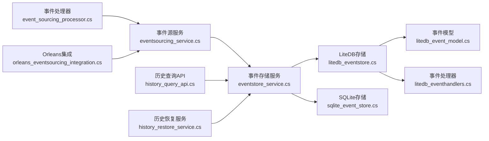

# 事件溯源模式

<cite>
**本文引用的文件**   
- [event_sourcing_processor.cs](file://event_sourcing_processor.cs)
- [eventsourcing_service.cs](file://eventsourcing_service.cs)
- [eventstore_service.cs](file://eventstore_service.cs)
- [litedb_event_model.cs](file://litedb_event_model.cs)
- [litedb_event_sourcing.cs](file://litedb_event_sourcing.cs)
- [litedb_eventstore.cs](file://litedb_eventstore.cs)
- [litedb_eventbus.cs](file://litedb_eventbus.cs)
- [litedb_eventhandlers.cs](file://litedb_eventhandlers.cs)
- [sqlite_event_store.cs](file://sqlite_event_store.cs)
- [history_query_api.cs](file://history_query_api.cs)
- [history_restore_service.cs](file://history_restore_service.cs)
- [orleans_eventsourcing_integration.cs](file://orleans_eventsourcing_integration.cs)
</cite>

## 目录
1. [简介](#简介)
2. [项目结构](#项目结构)
3. [核心组件](#核心组件)
4. [架构总览](#架构总览)
5. [详细组件分析](#详细组件分析)
6. [依赖关系分析](#依赖关系分析)
7. [性能考量](#性能考量)
8. [故障排查指南](#故障排查指南)
9. [结论](#结论)
10. [附录](#附录)

## 简介
本文件围绕“事件溯源”（Event Sourcing）模式，系统化阐述其核心思想与实践方法：以不可变事件序列记录状态变更，通过重放事件重建聚合状态。文档结合仓库中的事件处理、事件存储与查询恢复等实现，给出聚合根设计原则、事件生成机制、状态重建流程、版本管理与迁移策略、以及与传统CRUD的对比与适用场景。同时提供LiteDB与SQLite两种事件存储选型建议与优化技巧，帮助读者在复杂业务中正确落地事件溯源。

## 项目结构
仓库中与事件溯源相关的代码主要分布在以下位置：
- 事件处理与服务编排：event_sourcing_processor.cs、eventsourcing_service.cs、eventstore_service.cs
- LiteDB 事件模型与存储：litedb_event_model.cs、litedb_event_sourcing.cs、litedb_eventstore.cs、litedb_eventbus.cs、litedb_eventhandlers.cs
- SQLite 事件存储：sqlite_event_store.cs
- 历史查询与恢复：history_query_api.cs、history_restore_service.cs
- 分布式/进程内事件溯源集成示例：orleans_eventsourcing_integration.cs

**图表来源** 
- [event_sourcing_processor.cs](file://event_sourcing_processor.cs)
- [eventsourcing_service.cs](file://eventsourcing_service.cs)
- [eventstore_service.cs](file://eventstore_service.cs)
- [litedb_event_model.cs](file://litedb_event_model.cs)
- [litedb_event_sourcing.cs](file://litedb_event_sourcing.cs)
- [litedb_eventstore.cs](file://litedb_eventstore.cs)
- [litedb_eventbus.cs](file://litedb_eventbus.cs)
- [litedb_eventhandlers.cs](file://litedb_eventhandlers.cs)
- [sqlite_event_store.cs](file://sqlite_event_store.cs)
- [history_query_api.cs](file://history_query_api.cs)
- [history_restore_service.cs](file://history_restore_service.cs)
- [orleans_eventsourcing_integration.cs](file://orleans_eventsourcing_integration.cs)

**章节来源**
- [event_sourcing_processor.cs](file://event_sourcing_processor.cs)
- [eventsourcing_service.cs](file://eventsourcing_service.cs)
- [eventstore_service.cs](file://eventstore_service.cs)
- [litedb_event_model.cs](file://litedb_event_model.cs)
- [litedb_event_sourcing.cs](file://litedb_event_sourcing.cs)
- [litedb_eventstore.cs](file://litedb_eventstore.cs)
- [litedb_eventbus.cs](file://litedb_eventbus.cs)
- [litedb_eventhandlers.cs](file://litedb_eventhandlers.cs)
- [sqlite_event_store.cs](file://sqlite_event_store.cs)
- [history_query_api.cs](file://history_query_api.cs)
- [history_restore_service.cs](file://history_restore_service.cs)
- [orleans_eventsourcing_integration.cs](file://orleans_eventsourcing_integration.cs)

## 核心组件
- 事件处理器（Event Processor）：负责订阅并分发领域事件到对应处理器，确保事件处理的幂等性与顺序性。
- 事件源服务（Event Sourcing Service）：协调命令到事件的转换、持久化与后续处理编排。
- 事件存储服务（Event Store Service）：抽象事件写入与读取接口，屏蔽底层存储差异（LiteDB/SQLite）。
- LiteDB 事件模型与存储：定义事件实体、快照与元数据，提供轻量级嵌入式存储能力。
- SQLite 事件存储：基于关系型数据库的事件追加式存储，适合强一致与事务场景。
- 历史查询与恢复：提供按时间线或聚合ID查询事件流，支持从任意时间点重建状态。
- Orleans 集成：在分布式Actor模型下使用事件溯源，保证状态一致性与时序。

**章节来源**
- [event_sourcing_processor.cs](file://event_sourcing_processor.cs)
- [eventsourcing_service.cs](file://eventsourcing_service.cs)
- [eventstore_service.cs](file://eventstore_service.cs)
- [litedb_event_model.cs](file://litedb_event_model.cs)
- [litedb_event_sourcing.cs](file://litedb_event_sourcing.cs)
- [litedb_eventstore.cs](file://litedb_eventstore.cs)
- [sqlite_event_store.cs](file://sqlite_event_store.cs)
- [history_query_api.cs](file://history_query_api.cs)
- [history_restore_service.cs](file://history_restore_service.cs)
- [orleans_eventsourcing_integration.cs](file://orleans_eventsourcing_integration.cs)

## 架构总览
事件溯源的整体调用链如下：命令进入后由事件源服务转换为事件，写入事件存储；事件处理器订阅事件并执行副作用（如更新投影、触发外部系统）；查询服务通过重放事件流重建当前状态或历史快照。

**图表来源** 
- [eventsourcing_service.cs](file://eventsourcing_service.cs)
- [eventstore_service.cs](file://eventstore_service.cs)
- [litedb_eventstore.cs](file://litedb_eventstore.cs)
- [sqlite_event_store.cs](file://sqlite_event_store.cs)
- [event_sourcing_processor.cs](file://event_sourcing_processor.cs)
- [litedb_eventhandlers.cs](file://litedb_eventhandlers.cs)

## 详细组件分析

### 事件处理器（Event Processor）
职责：
- 订阅事件流，按聚合ID或事件类型路由到具体处理器。
- 保证幂等性：同一事件可重复处理而不产生副作用。
- 顺序性：对同一聚合的事件保持严格顺序。

关键点：
- 事件去重与重试策略。
- 异步批处理提升吞吐。
- 错误隔离与死信队列。

**章节来源**
- [event_sourcing_processor.cs](file://event_sourcing_processor.cs)
- [litedb_eventhandlers.cs](file://litedb_eventhandlers.cs)

### 事件源服务（Event Sourcing Service）
职责：
- 将命令转换为领域事件。
- 协调事件持久化与后续处理。
- 暴露统一的API供上层调用。

关键点：
- 事件版本控制：为每个事件分配单调递增版本号。
- 事务边界：确保事件写入与后续处理的原子性。
- 扩展点：允许注入自定义事件转换器。

**章节来源**
- [eventsourcing_service.cs](file://eventsourcing_service.cs)

### 事件存储服务（Event Store Service）
职责：
- 抽象事件追加与读取接口。
- 屏蔽不同存储后端（LiteDB/SQLite）的差异。
- 提供批量操作与分页查询。

关键点：
- 并发写入冲突检测（乐观锁）。
- 事件压缩与归档策略。
- 读写分离与缓存层。

**章节来源**
- [eventstore_service.cs](file://eventstore_service.cs)

### LiteDB 事件模型与存储
- 事件模型：定义事件实体、元数据（时间戳、聚合ID、版本）、序列化格式。
- 事件溯源封装：提供聚合级别的事件追加、重放与快照功能。
- 事件总线：基于LiteDB的内存/文件事件通道，用于进程内事件分发。
- 事件处理器：针对LiteDB存储的特定处理逻辑（如索引优化）。

**图表来源** 
- [litedb_event_model.cs](file://litedb_event_model.cs)
- [litedb_eventstore.cs](file://litedb_eventstore.cs)
- [litedb_eventbus.cs](file://litedb_eventbus.cs)
- [litedb_eventhandlers.cs](file://litedb_eventhandlers.cs)

**章节来源**
- [litedb_event_model.cs](file://litedb_event_model.cs)
- [litedb_event_sourcing.cs](file://litedb_event_sourcing.cs)
- [litedb_eventstore.cs](file://litedb_eventstore.cs)
- [litedb_eventbus.cs](file://litedb_eventbus.cs)
- [litedb_eventhandlers.cs](file://litedb_eventhandlers.cs)

### SQLite 事件存储
特点：
- 基于关系型表结构，支持事务与强一致。
- 适合需要复杂查询与审计的场景。
- 可通过索引优化事件查询性能。

优化建议：
- 使用追加式写入避免更新热点。
- 定期归档历史事件至冷存储。
- 连接池与批量插入提升吞吐。

**章节来源**
- [sqlite_event_store.cs](file://sqlite_event_store.cs)

### 历史查询与恢复
- 历史查询API：支持按聚合ID、时间范围、事件类型过滤。
- 恢复服务：从事件流重建聚合状态，支持快照加速。

**图表来源** 
- [history_query_api.cs](file://history_query_api.cs)
- [history_restore_service.cs](file://history_restore_service.cs)

**章节来源**
- [history_query_api.cs](file://history_query_api.cs)
- [history_restore_service.cs](file://history_restore_service.cs)

### Orleans 事件溯源集成
在分布式环境中，使用Orleans Actor模型管理聚合状态，结合事件溯源保证状态一致性。

优势：
- 自动序列化与网络传输。
- 容错与重启恢复。
- 水平扩展能力。

**章节来源**
- [orleans_eventsourcing_integration.cs](file://orleans_eventsourcing_integration.cs)

## 依赖关系分析

**图表来源** 
- [event_sourcing_processor.cs](file://event_sourcing_processor.cs)
- [eventsourcing_service.cs](file://eventsourcing_service.cs)
- [eventstore_service.cs](file://eventstore_service.cs)
- [litedb_eventstore.cs](file://litedb_eventstore.cs)
- [litedb_event_model.cs](file://litedb_event_model.cs)
- [litedb_eventhandlers.cs](file://litedb_eventhandlers.cs)
- [sqlite_event_store.cs](file://sqlite_event_store.cs)
- [history_query_api.cs](file://history_query_api.cs)
- [history_restore_service.cs](file://history_restore_service.cs)
- [orleans_eventsourcing_integration.cs](file://orleans_eventsourcing_integration.cs)

**章节来源**
- [event_sourcing_processor.cs](file://event_sourcing_processor.cs)
- [eventsourcing_service.cs](file://eventsourcing_service.cs)
- [eventstore_service.cs](file://eventstore_service.cs)
- [litedb_eventstore.cs](file://litedb_eventstore.cs)
- [litedb_event_model.cs](file://litedb_event_model.cs)
- [litedb_eventhandlers.cs](file://litedb_eventhandlers.cs)
- [sqlite_event_store.cs](file://sqlite_event_store.cs)
- [history_query_api.cs](file://history_query_api.cs)
- [history_restore_service.cs](file://history_restore_service.cs)
- [orleans_eventsourcing_integration.cs](file://orleans_eventsourcing_integration.cs)

## 性能考量
- 事件追加优化：批量写入、减少锁竞争。
- 快照策略：定期保存聚合快照，缩短重放时间。
- 索引设计：为聚合ID、时间戳建立索引，加速查询。
- 存储选择：LiteDB适合单机轻量场景，SQLite适合强一致与复杂查询。
- 异步处理：事件处理器异步执行，避免阻塞主流程。
- 压缩与归档：历史事件压缩存储，降低I/O压力。

[本节为通用指导，不直接分析具体文件]

## 故障排查指南
常见问题与解决方案：
- 事件版本冲突：检查并发写入逻辑，确保乐观锁正确实现。
- 事件丢失：验证事件存储的事务边界与重试机制。
- 状态重建缓慢：增加快照频率，优化事件处理器性能。
- 查询延迟高：检查索引是否命中，考虑读写分离。
- 处理器异常：启用日志与监控，设置死信队列处理失败事件。

**章节来源**
- [event_sourcing_processor.cs](file://event_sourcing_processor.cs)
- [eventstore_service.cs](file://eventstore_service.cs)
- [litedb_eventstore.cs](file://litedb_eventstore.cs)
- [sqlite_event_store.cs](file://sqlite_event_store.cs)

## 结论
事件溯源模式通过事件序列记录状态变更，提供了强大的审计、回溯与重构能力。结合LiteDB与SQLite等存储方案，可在不同场景下平衡性能与一致性。合理设计聚合根、事件处理器与存储策略，能够有效支撑复杂业务需求。在实际应用中，应注重版本管理、向后兼容与迁移策略，确保系统的长期演进能力。

[本节为总结性内容，不直接分析具体文件]

## 附录
- 最佳实践：
  - 事件不可变性：事件一旦创建不应修改。
  - 聚合边界清晰：避免跨聚合的复杂事务。
  - 事件命名规范：使用过去时态描述已发生的事实。
  - 快照策略：根据聚合大小与访问频率调整快照间隔。
- 适用场景：
  - 需要完整审计轨迹的业务（金融、医疗）。
  - 状态频繁变更且需回溯的场景（订单、库存）。
  - 分布式系统中需要状态一致性的模块（工作流、Saga）。

[本节为补充信息，不直接分析具体文件]