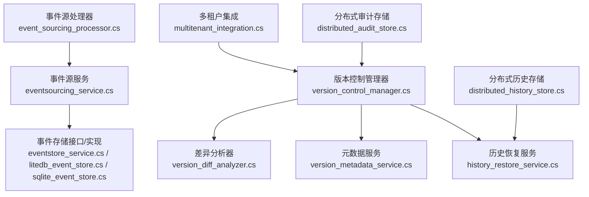
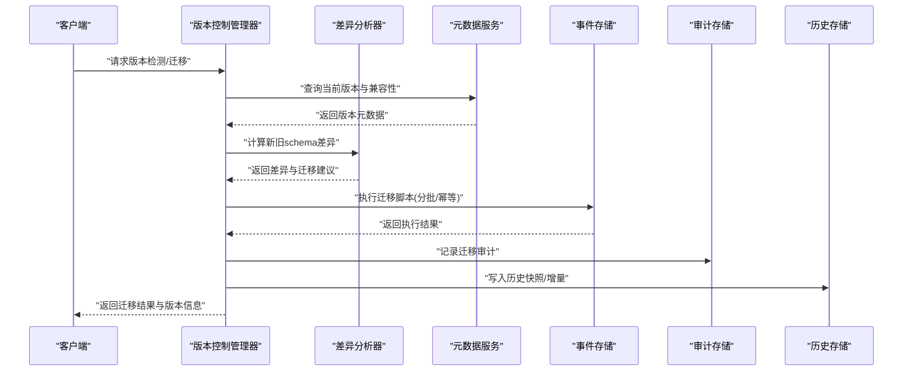
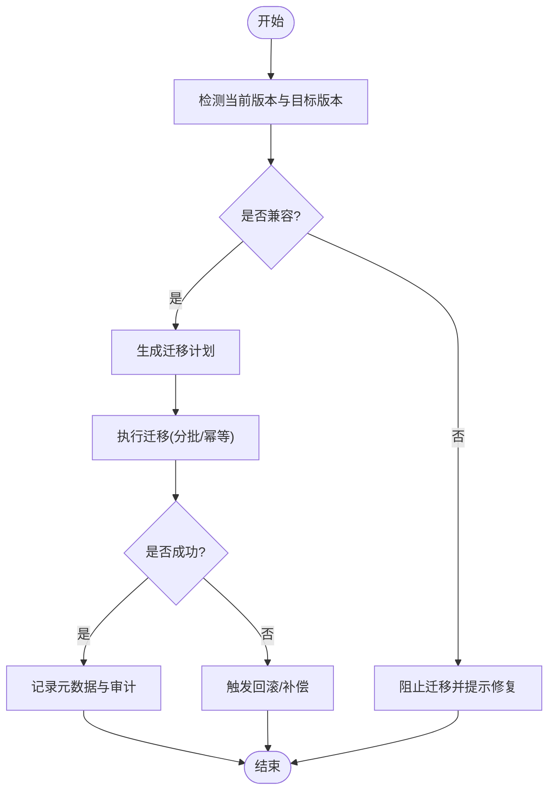
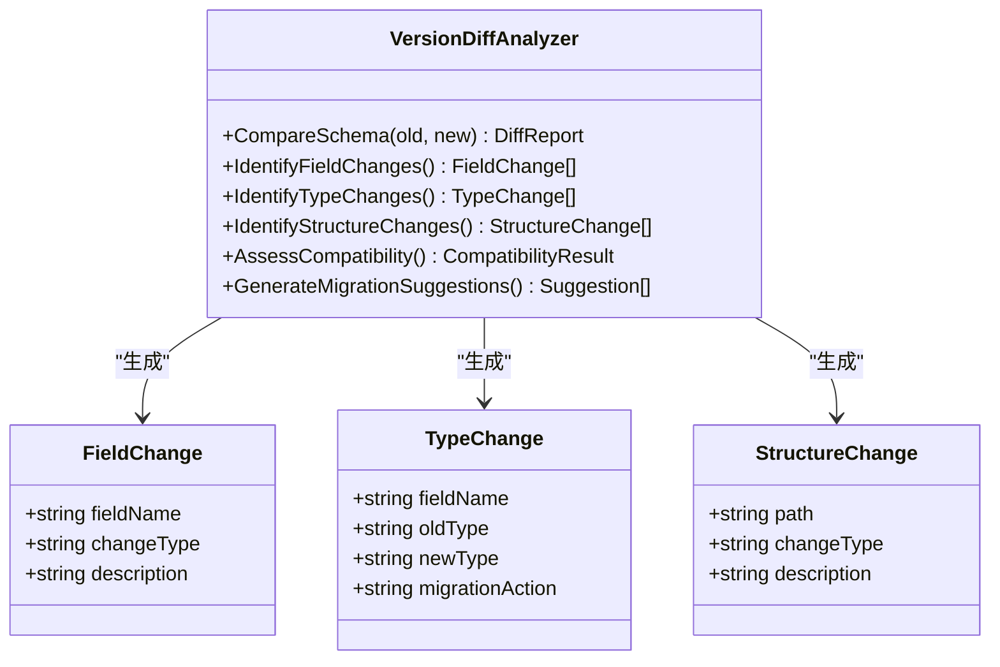
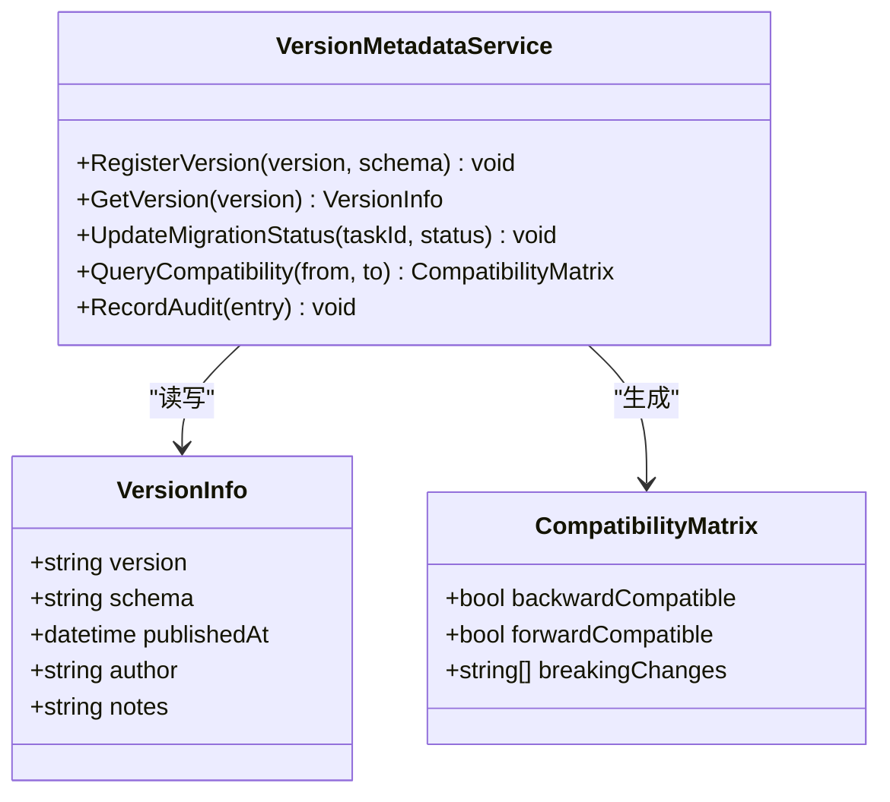
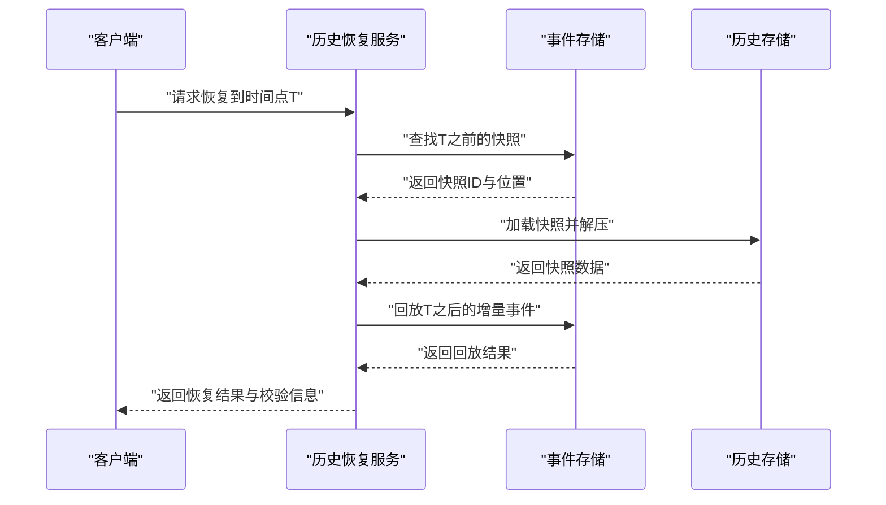
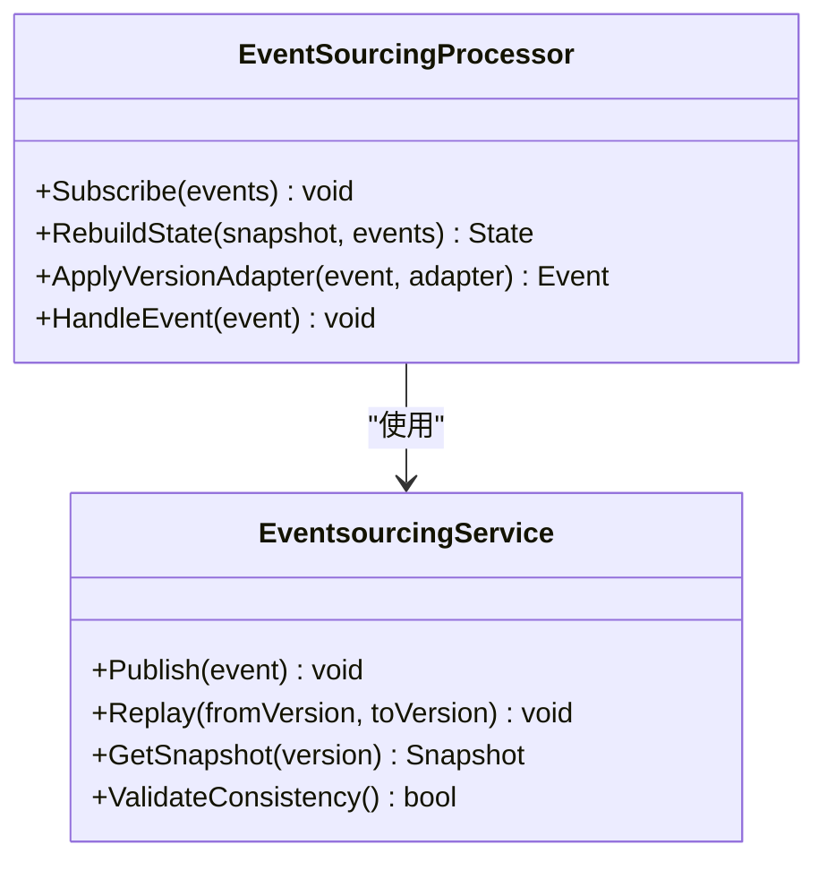
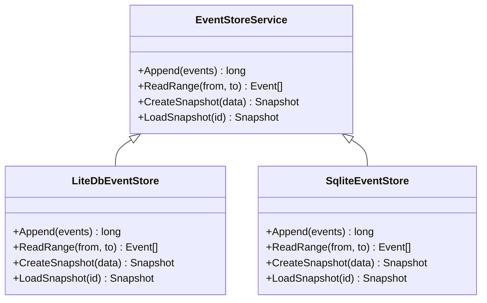
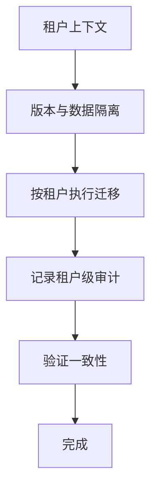
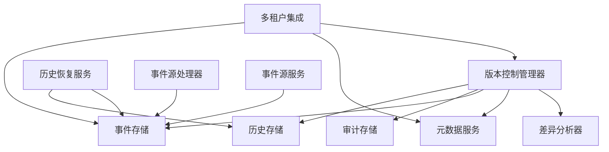

# 事件版本管理

<cite>
**本文引用的文件**   
- [version_control_manager.cs](file://version_control_manager.cs)
- [version_diff_analyzer.cs](file://version_diff_analyzer.cs)
- [version_metadata_service.cs](file://version_metadata_service.cs)
- [history_restore_service.cs](file://history_restore_service.cs)
- [event_sourcing_processor.cs](file://event_sourcing_processor.cs)
- [eventsourcing_service.cs](file://eventsourcing_service.cs)
- [eventstore_service.cs](file://eventstore_service.cs)
- [litedb_event_store.cs](file://litedb_event_store.cs)
- [sqlite_event_store.cs](file://sqlite_event_store.cs)
- [multitenant_integration.cs](file://multitenant_integration.cs)
- [distributed_audit_store.cs](file://distributed_audit_store.cs)
- [distributed_history_store.cs](file://distributed_history_store.cs)
</cite>

## 目录
1. [简介](#简介)
2. [项目结构](#项目结构)
3. [核心组件](#核心组件)
4. [架构总览](#架构总览)
5. [详细组件分析](#详细组件分析)
6. [依赖关系分析](#依赖关系分析)
7. [性能考虑](#性能考虑)
8. [故障排查指南](#故障排查指南)
9. [结论](#结论)
10. [附录](#附录)

## 简介
本文件围绕“事件版本管理”展开，系统阐述事件schema演进策略、向后/向前兼容性设计、版本控制管理器实现（版本检测、迁移脚本执行与回滚）、事件差异分析工具、自动化迁移流程与灰度发布策略。同时覆盖事件重构最佳实践（字段重命名、类型变更、结构重组）、历史数据恢复、事件回放与审计追踪，以及多租户环境下的版本隔离与数据迁移策略。文档面向不同技术背景的读者，提供从概念到实现的渐进式说明与可视化图示。

## 项目结构
本项目在根目录下提供了与事件版本管理相关的多个独立示例文件，涵盖版本控制、差异分析、元数据服务、历史恢复、事件源处理与存储等关键能力。整体组织方式以“功能文件即模块”的扁平化结构呈现，便于快速定位与理解各职责边界。

**图表来源** 
- [version_control_manager.cs](file://version_control_manager.cs)
- [version_diff_analyzer.cs](file://version_diff_analyzer.cs)
- [version_metadata_service.cs](file://version_metadata_service.cs)
- [history_restore_service.cs](file://history_restore_service.cs)
- [event_sourcing_processor.cs](file://event_sourcing_processor.cs)
- [eventsourcing_service.cs](file://eventsourcing_service.cs)
- [eventstore_service.cs](file://eventstore_service.cs)
- [litedb_event_store.cs](file://litedb_event_store.cs)
- [sqlite_event_store.cs](file://sqlite_event_store.cs)
- [multitenant_integration.cs](file://multitenant_integration.cs)
- [distributed_audit_store.cs](file://distributed_audit_store.cs)
- [distributed_history_store.cs](file://distributed_history_store.cs)

**章节来源**
- [version_control_manager.cs](file://version_control_manager.cs)
- [version_diff_analyzer.cs](file://version_diff_analyzer.cs)
- [version_metadata_service.cs](file://version_metadata_service.cs)
- [history_restore_service.cs](file://history_restore_service.cs)
- [event_sourcing_processor.cs](file://event_sourcing_processor.cs)
- [eventsourcing_service.cs](file://eventsourcing_service.cs)
- [eventstore_service.cs](file://eventstore_service.cs)
- [litedb_event_store.cs](file://litedb_event_store.cs)
- [sqlite_event_store.cs](file://sqlite_event_store.cs)
- [multitenant_integration.cs](file://multitenant_integration.cs)
- [distributed_audit_store.cs](file://distributed_audit_store.cs)
- [distributed_history_store.cs](file://distributed_history_store.cs)

## 核心组件
- 版本控制管理器：负责事件版本的检测、迁移脚本编排与执行、回滚策略与一致性保障。
- 差异分析器：对两个事件schema进行对比，识别新增、删除、重命名字段与类型变更，生成迁移建议或脚本。
- 元数据服务：维护事件schema的版本元数据、兼容性与迁移状态，支持查询与更新。
- 历史恢复服务：基于快照与增量日志进行历史数据恢复，支持时间点恢复与回放。
- 事件源处理器与服务：将事件流转换为领域状态，支持按版本适配与回放。
- 事件存储：提供持久化能力（如LiteDB、SQLite），保证事件追加写与顺序读取。
- 多租户集成：为每个租户隔离事件版本与迁移状态，避免跨租户污染。
- 分布式审计与历史存储：记录版本变更、迁移执行轨迹与审计信息，支撑合规与回溯。

**章节来源**
- [version_control_manager.cs](file://version_control_manager.cs)
- [version_diff_analyzer.cs](file://version_diff_analyzer.cs)
- [version_metadata_service.cs](file://version_metadata_service.cs)
- [history_restore_service.cs](file://history_restore_service.cs)
- [event_sourcing_processor.cs](file://event_sourcing_processor.cs)
- [eventsourcing_service.cs](file://eventsourcing_service.cs)
- [eventstore_service.cs](file://eventstore_service.cs)
- [litedb_event_store.cs](file://litedb_event_store.cs)
- [sqlite_event_store.cs](file://sqlite_event_store.cs)
- [multitenant_integration.cs](file://multitenant_integration.cs)
- [distributed_audit_store.cs](file://distributed_audit_store.cs)
- [distributed_history_store.cs](file://distributed_history_store.cs)

## 架构总览
事件版本管理的整体架构由“版本控制层 + 差异分析层 + 元数据层 + 存储层 + 审计与历史层”构成。版本控制管理器作为协调者，驱动差异分析器生成迁移计划，通过元数据服务校验兼容性并记录状态，最终调用事件存储完成数据迁移与回放。多租户集成确保各租户的schema与迁移状态隔离，审计与历史存储提供可追溯性。

**图表来源** 
- [version_control_manager.cs](file://version_control_manager.cs)
- [version_diff_analyzer.cs](file://version_diff_analyzer.cs)
- [version_metadata_service.cs](file://version_metadata_service.cs)
- [eventstore_service.cs](file://eventstore_service.cs)
- [litedb_event_store.cs](file://litedb_event_store.cs)
- [sqlite_event_store.cs](file://sqlite_event_store.cs)
- [distributed_audit_store.cs](file://distributed_audit_store.cs)
- [distributed_history_store.cs](file://distributed_history_store.cs)

## 详细组件分析

### 版本控制管理器（Version Control Manager）
- 职责：版本检测、迁移脚本编排与执行、回滚机制、事务与一致性保障、错误重试与补偿。
- 关键流程：
  - 版本检测：读取当前事件schema版本与目标版本，结合元数据服务判断兼容性。
  - 迁移执行：按依赖顺序执行迁移脚本，支持分批、幂等与断点续跑。
  - 回滚机制：记录迁移前快照与操作日志，失败时自动回滚或触发补偿脚本。
  - 灰度发布：支持按租户或流量比例逐步推进迁移，降低风险。
- 兼容性策略：
  - 向后兼容：新消费者能消费旧事件（默认字段存在且语义不变）。
  - 向前兼容：旧消费者能消费新事件（忽略未知字段，默认值安全）。
- 错误处理：捕获异常、记录审计、触发告警与人工干预入口。

**图表来源** 
- [version_control_manager.cs](file://version_control_manager.cs)
- [version_metadata_service.cs](file://version_metadata_service.cs)
- [distributed_audit_store.cs](file://distributed_audit_store.cs)

**章节来源**
- [version_control_manager.cs](file://version_control_manager.cs)
- [version_metadata_service.cs](file://version_metadata_service.cs)
- [distributed_audit_store.cs](file://distributed_audit_store.cs)

### 差异分析器（Version Diff Analyzer）
- 职责：对比两个事件schema，识别字段增删改、类型变更、结构重组，输出差异报告与迁移建议。
- 关键能力：
  - 字段级差异：新增、删除、重命名、必填性变化。
  - 类型级差异：数值精度、时间格式、枚举扩展等。
  - 结构级差异：嵌套对象拆分/合并、数组元素类型变更。
  - 兼容性评估：标注破坏性变更与非破坏性变更。
- 输出：差异清单、迁移脚本模板、风险评估与建议。

**图表来源** 
- [version_diff_analyzer.cs](file://version_diff_analyzer.cs)

**章节来源**
- [version_diff_analyzer.cs](file://version_diff_analyzer.cs)

### 元数据服务（Version Metadata Service）
- 职责：维护事件schema版本、兼容性矩阵、迁移状态与审计信息。
- 关键能力：
  - 版本注册：记录schema版本、发布时间、作者与备注。
  - 兼容性矩阵：定义vN与vN+1之间的兼容规则。
  - 迁移状态：跟踪已执行/待执行/失败的迁移任务。
  - 查询接口：供版本控制管理器与其他组件查询。

**图表来源** 
- [version_metadata_service.cs](file://version_metadata_service.cs)

**章节来源**
- [version_metadata_service.cs](file://version_metadata_service.cs)

### 历史恢复服务（History Restore Service）
- 职责：基于快照与增量日志进行历史数据恢复，支持时间点恢复与事件回放。
- 关键能力：
  - 快照管理：定期生成全量快照，支持压缩与分片。
  - 增量日志：记录事件追加与变更，支持按版本过滤。
  - 恢复策略：选择最近快照+增量回放，保证一致性。
  - 验证机制：恢复后校验状态一致性，失败则回退。

**图表来源** 
- [history_restore_service.cs](file://history_restore_service.cs)
- [eventstore_service.cs](file://eventstore_service.cs)
- [distributed_history_store.cs](file://distributed_history_store.cs)

**章节来源**
- [history_restore_service.cs](file://history_restore_service.cs)
- [distributed_history_store.cs](file://distributed_history_store.cs)

### 事件源处理器与服务（Event Sourcing Processor & Service）
- 职责：将事件流转换为领域状态，支持按版本适配与回放。
- 关键能力：
  - 事件订阅：监听事件流，按版本路由到对应处理器。
  - 状态重建：从头回放事件，构建一致状态。
  - 版本适配：根据事件版本选择解析器与转换器。
  - 幂等处理：防止重复事件导致状态不一致。

**图表来源** 
- [event_sourcing_processor.cs](file://event_sourcing_processor.cs)
- [eventsourcing_service.cs](file://eventsourcing_service.cs)

**章节来源**
- [event_sourcing_processor.cs](file://event_sourcing_processor.cs)
- [eventsourcing_service.cs](file://eventsourcing_service.cs)

### 事件存储（Event Store）
- 职责：提供事件追加写与顺序读取，支持LiteDB与SQLite实现。
- 关键能力：
  - 追加写：保证事件不可变与顺序性。
  - 范围查询：按版本、时间戳与租户过滤。
  - 快照支持：定期快照减少回放开销。
  - 事务与一致性：保证批量写入原子性。

**图表来源** 
- [eventstore_service.cs](file://eventstore_service.cs)
- [litedb_event_store.cs](file://litedb_event_store.cs)
- [sqlite_event_store.cs](file://sqlite_event_store.cs)

**章节来源**
- [eventstore_service.cs](file://eventstore_service.cs)
- [litedb_event_store.cs](file://litedb_event_store.cs)
- [sqlite_event_store.cs](file://sqlite_event_store.cs)

### 多租户集成（Multitenant Integration）
- 职责：为每个租户隔离事件版本、迁移状态与数据。
- 关键能力：
  - 租户上下文：注入租户标识，影响查询与写入。
  - 版本隔离：每个租户独立维护schema版本与迁移状态。
  - 迁移策略：支持按租户灰度发布与回滚。
  - 资源隔离：数据库表或索引级别隔离。

**图表来源** 
- [multitenant_integration.cs](file://multitenant_integration.cs)

**章节来源**
- [multitenant_integration.cs](file://multitenant_integration.cs)

## 依赖关系分析
- 版本控制管理器依赖差异分析器、元数据服务、事件存储、审计与历史存储。
- 差异分析器无外部依赖，专注于schema对比逻辑。
- 元数据服务可能依赖持久化存储（如SQLite/LiteDB）以保存版本与迁移状态。
- 历史恢复服务依赖事件存储与历史存储，用于快照与增量回放。
- 事件源处理器与服务依赖事件存储，实现状态重建与回放。
- 多租户集成贯穿各组件，确保租户级隔离。

**图表来源** 
- [version_control_manager.cs](file://version_control_manager.cs)
- [version_diff_analyzer.cs](file://version_diff_analyzer.cs)
- [version_metadata_service.cs](file://version_metadata_service.cs)
- [eventstore_service.cs](file://eventstore_service.cs)
- [litedb_event_store.cs](file://litedb_event_store.cs)
- [sqlite_event_store.cs](file://sqlite_event_store.cs)
- [distributed_audit_store.cs](file://distributed_audit_store.cs)
- [distributed_history_store.cs](file://distributed_history_store.cs)
- [history_restore_service.cs](file://history_restore_service.cs)
- [event_sourcing_processor.cs](file://event_sourcing_processor.cs)
- [eventsourcing_service.cs](file://eventsourcing_service.cs)
- [multitenant_integration.cs](file://multitenant_integration.cs)

**章节来源**
- [version_control_manager.cs](file://version_control_manager.cs)
- [version_diff_analyzer.cs](file://version_diff_analyzer.cs)
- [version_metadata_service.cs](file://version_metadata_service.cs)
- [eventstore_service.cs](file://eventstore_service.cs)
- [litedb_event_store.cs](file://litedb_event_store.cs)
- [sqlite_event_store.cs](file://sqlite_event_store.cs)
- [distributed_audit_store.cs](file://distributed_audit_store.cs)
- [distributed_history_store.cs](file://distributed_history_store.cs)
- [history_restore_service.cs](file://history_restore_service.cs)
- [event_sourcing_processor.cs](file://event_sourcing_processor.cs)
- [eventsourcing_service.cs](file://eventsourcing_service.cs)
- [multitenant_integration.cs](file://multitenant_integration.cs)

## 性能考虑
- 批量写入与分页回放：事件存储应支持批量追加与分页读取，减少IO开销。
- 快照优化：定期生成压缩快照，缩短回放时间。
- 幂等与去重：避免重复事件导致的重复处理。
- 缓存热点：对频繁访问的schema元数据进行缓存。
- 异步执行：迁移脚本与回放任务异步执行，提升吞吐。
- 资源隔离：多租户场景下限制单租户资源占用，防止雪崩。

[本节为通用指导，不直接分析具体文件]

## 故障排查指南
- 版本检测失败：检查元数据服务中版本信息与schema一致性。
- 迁移脚本执行失败：查看审计日志，确认幂等性与依赖顺序。
- 回放不一致：验证快照完整性与增量事件顺序。
- 多租户污染：检查租户上下文注入与数据隔离策略。
- 性能瓶颈：监控事件存储IO与CPU使用率，调整批大小与并发。

**章节来源**
- [distributed_audit_store.cs](file://distributed_audit_store.cs)
- [version_metadata_service.cs](file://version_metadata_service.cs)
- [history_restore_service.cs](file://history_restore_service.cs)
- [multitenant_integration.cs](file://multitenant_integration.cs)

## 结论
事件版本管理是复杂系统演进的核心能力。通过版本控制管理器、差异分析器、元数据服务、事件存储与审计历史存储的协同，可实现安全的schema演进、可靠的迁移与回放、以及多租户环境下的隔离与治理。遵循向后/向前兼容原则、灰度发布与回滚策略，能有效降低变更风险，保障系统稳定性与可观测性。

[本节为总结性内容，不直接分析具体文件]

## 附录
- 事件重构最佳实践：
  - 字段重命名：保留旧字段并标记弃用，逐步迁移消费者。
  - 类型变更：优先采用兼容类型转换，避免破坏性变更。
  - 结构重组：拆分子对象时保持父对象稳定，逐步迁移。
- 灰度发布策略：
  - 按租户比例逐步放量，监控错误率与延迟。
  - 支持快速回滚与热修复。
- 审计追踪：
  - 记录所有版本变更、迁移执行与回放操作。
  - 支持按租户与时间范围查询。

[本节为补充性内容，不直接分析具体文件]