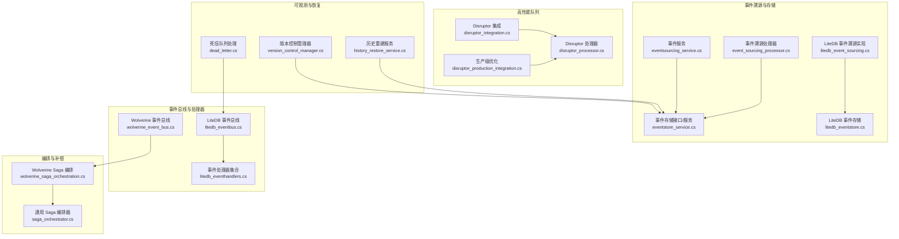
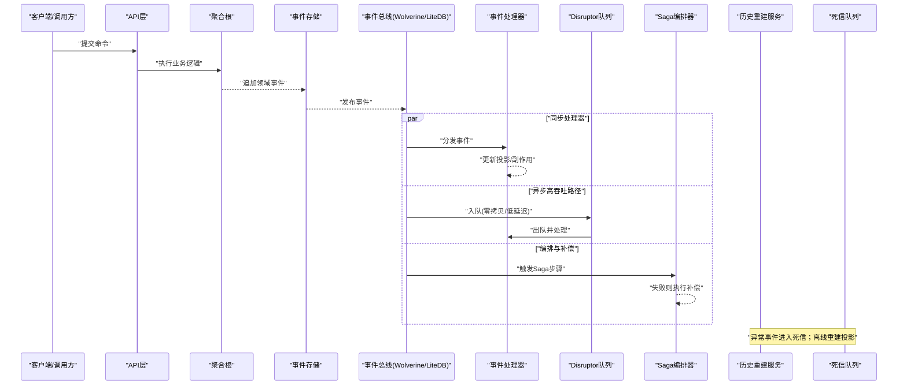
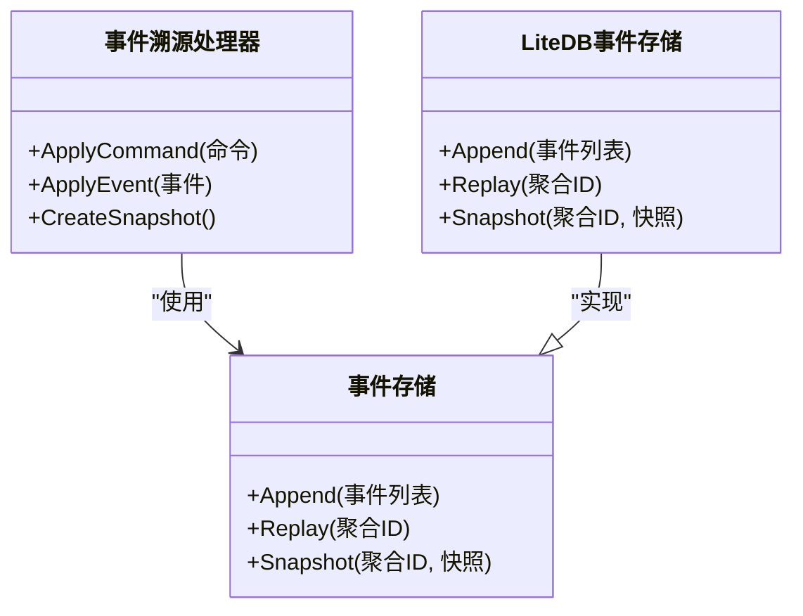
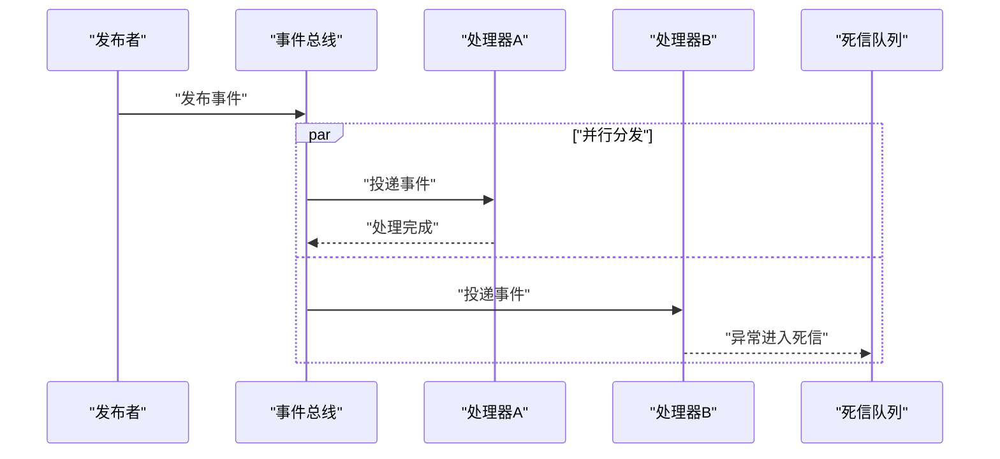
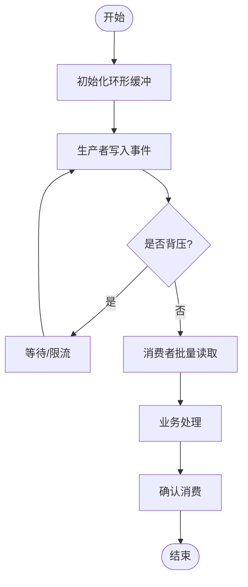
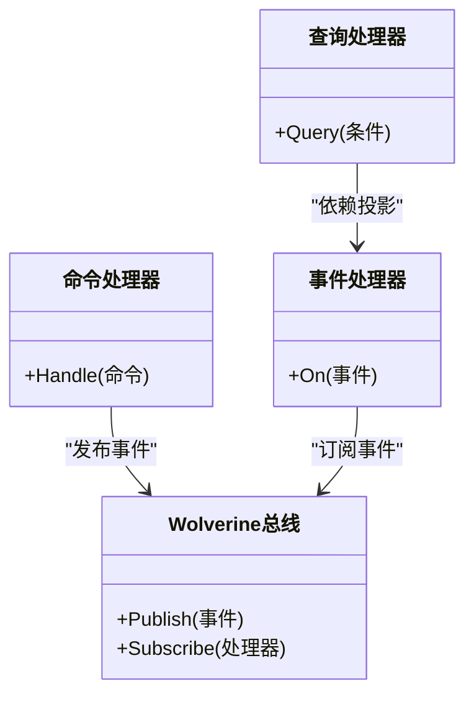
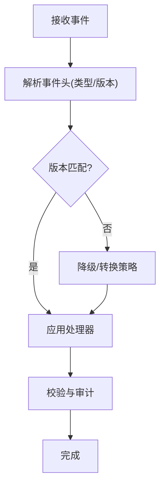
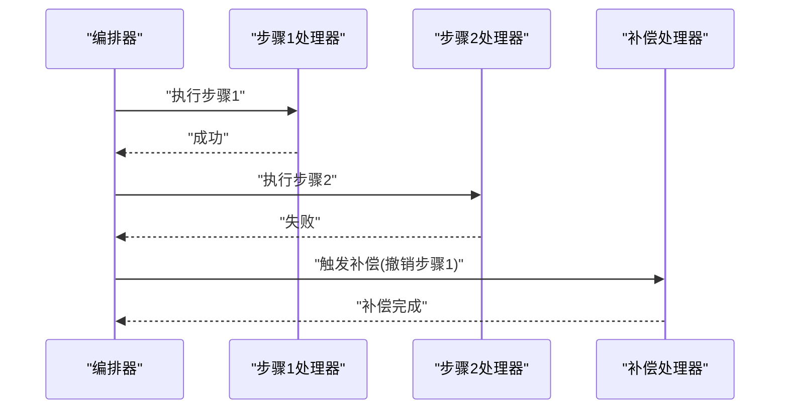
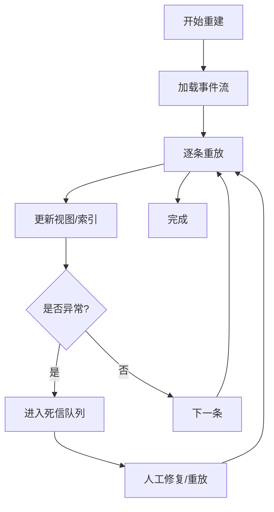
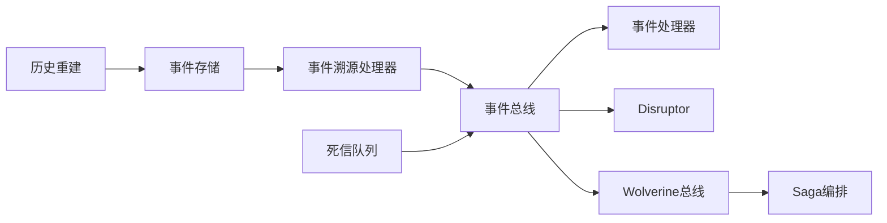

# 事件驱动架构

<cite>
**本文引用的文件**   
- [event_sourcing_processor.cs](file://event_sourcing_processor.cs)
- [eventsourcing_service.cs](file://eventsourcing_service.cs)
- [eventstore_service.cs](file://eventstore_service.cs)
- [litedb_event_sourcing.cs](file://litedb_event_sourcing.cs)
- [litedb_eventstore.cs](file://litedb_eventstore.cs)
- [litedb_eventbus.cs](file://litedb_eventbus.cs)
- [litedb_eventhandlers.cs](file://litedb_eventhandlers.cs)
- [wolverine_event_bus.cs](file://wolverine_event_bus.cs)
- [wolverine_cqrs.cs](file://wolverine_cqrs.cs)
- [wolverine_saga_orchestration.cs](file://wolverine_saga_orchestration.cs)
- [disruptor_integration.cs](file://disruptor_integration.cs)
- [disruptor_processor.cs](file://disruptor_processor.cs)
- [disruptor_production_integration.cs](file://disruptor_production_integration.cs)
- [history_restore_service.cs](file://history_restore_service.cs)
- [dead_letter.cs](file://dead_letter.cs)
- [saga_orchestrator.cs](file://saga_orchestrator.cs)
- [version_control_manager.cs](file://version_control_manager.cs)
</cite>

## 目录
1. [简介](#简介)
2. [项目结构](#项目结构)
3. [核心组件](#核心组件)
4. [架构总览](#架构总览)
5. [详细组件分析](#详细组件分析)
6. [依赖关系分析](#依赖关系分析)
7. [性能考量](#性能考量)
8. [故障排查指南](#故障排查指南)
9. [结论](#结论)
10. [附录](#附录)

## 简介
本文件围绕事件驱动架构（EDA）与事件溯源（Event Sourcing）在代码库中的实现进行系统化说明，涵盖：
- 事件存储、事件处理器与聚合根设计模式
- Disruptor 高性能队列的使用场景与优化策略
- Wolverine 事件总线与 CQRS 模式的结合
- 事件版本管理、向后兼容性与故障恢复机制
- 复杂业务编排与补偿事务（Saga）实践

目标是帮助读者快速理解并落地高吞吐、可演进、可观测的事件驱动系统。

## 项目结构
仓库中包含大量“集成示例”风格的单文件实现，聚焦于不同技术栈与模式。与事件驱动相关的关键文件包括：
- 事件溯源与事件存储：event_sourcing_processor.cs、eventsourcing_service.cs、eventstore_service.cs、litedb_event_sourcing.cs、litedb_eventstore.cs
- 事件总线与处理器：litedb_eventbus.cs、litedb_eventhandlers.cs、wolverine_event_bus.cs
- 高性能队列：disruptor_integration.cs、disruptor_processor.cs、disruptor_production_integration.cs
- 编排与补偿：wolverine_saga_orchestration.cs、saga_orchestrator.cs
- 历史重建与死信处理：history_restore_service.cs、dead_letter.cs
- 版本控制：version_control_manager.cs

图表来源
- [event_sourcing_processor.cs](file://event_sourcing_processor.cs)
- [eventsourcing_service.cs](file://eventsourcing_service.cs)
- [eventstore_service.cs](file://eventstore_service.cs)
- [litedb_event_sourcing.cs](file://litedb_event_sourcing.cs)
- [litedb_eventstore.cs](file://litedb_eventstore.cs)
- [litedb_eventbus.cs](file://litedb_eventbus.cs)
- [litedb_eventhandlers.cs](file://litedb_eventhandlers.cs)
- [wolverine_event_bus.cs](file://wolverine_event_bus.cs)
- [disruptor_integration.cs](file://disruptor_integration.cs)
- [disruptor_processor.cs](file://disruptor_processor.cs)
- [disruptor_production_integration.cs](file://disruptor_production_integration.cs)
- [wolverine_saga_orchestration.cs](file://wolverine_saga_orchestration.cs)
- [saga_orchestrator.cs](file://saga_orchestrator.cs)
- [history_restore_service.cs](file://history_restore_service.cs)
- [dead_letter.cs](file://dead_letter.cs)
- [version_control_manager.cs](file://version_control_manager.cs)

章节来源
- [event_sourcing_processor.cs](file://event_sourcing_processor.cs)
- [eventsourcing_service.cs](file://eventsourcing_service.cs)
- [eventstore_service.cs](file://eventstore_service.cs)
- [litedb_event_sourcing.cs](file://litedb_event_sourcing.cs)
- [litedb_eventstore.cs](file://litedb_eventstore.cs)
- [litedb_eventbus.cs](file://litedb_eventbus.cs)
- [litedb_eventhandlers.cs](file://litedb_eventhandlers.cs)
- [wolverine_event_bus.cs](file://wolverine_event_bus.cs)
- [disruptor_integration.cs](file://disruptor_integration.cs)
- [disruptor_processor.cs](file://disruptor_processor.cs)
- [disruptor_production_integration.cs](file://disruptor_production_integration.cs)
- [wolverine_saga_orchestration.cs](file://wolverine_saga_orchestration.cs)
- [saga_orchestrator.cs](file://saga_orchestrator.cs)
- [history_restore_service.cs](file://history_restore_service.cs)
- [dead_letter.cs](file://dead_letter.cs)
- [version_control_manager.cs](file://version_control_manager.cs)

## 核心组件
- 事件存储（Event Store）
  - 职责：持久化不可变事件序列，提供追加写入、按聚合ID重放、快照能力。
  - 关键实现：eventstore_service.cs 定义接口与服务；litedb_eventstore.cs 基于 LiteDB 的轻量实现。
- 事件溯源处理器（Event Sourcing Processor）
  - 职责：将命令转换为领域事件，维护聚合状态，支持快照与一致性边界。
  - 关键实现：event_sourcing_processor.cs、eventsourcing_service.cs、litedb_event_sourcing.cs。
- 事件总线与处理器（Event Bus & Handlers）
  - 职责：解耦发布/订阅，路由事件到对应处理器，支持本地与分布式。
  - 关键实现：litedb_eventbus.cs、litedb_eventhandlers.cs、wolverine_event_bus.cs。
- 高性能队列（Disruptor）
  - 职责：无锁环形缓冲，低延迟高吞吐事件分发。
  - 关键实现：disruptor_integration.cs、disruptor_processor.cs、disruptor_production_integration.cs。
- 编排与补偿（Saga）
  - 职责：跨多个聚合或服务的长事务编排，失败时执行补偿动作。
  - 关键实现：wolverine_saga_orchestration.cs、saga_orchestrator.cs。
- 历史重建与死信（History Restore & Dead Letter）
  - 职责：从事件流重建投影/视图，异常事件进入死信队列以便人工干预。
  - 关键实现：history_restore_service.cs、dead_letter.cs。
- 版本控制（Version Control）
  - 职责：事件版本管理与兼容性策略，确保向前/向后兼容。
  - 关键实现：version_control_manager.cs。

章节来源
- [eventstore_service.cs](file://eventstore_service.cs)
- [litedb_eventstore.cs](file://litedb_eventstore.cs)
- [event_sourcing_processor.cs](file://event_sourcing_processor.cs)
- [eventsourcing_service.cs](file://eventsourcing_service.cs)
- [litedb_event_sourcing.cs](file://litedb_event_sourcing.cs)
- [litedb_eventbus.cs](file://litedb_eventbus.cs)
- [litedb_eventhandlers.cs](file://litedb_eventhandlers.cs)
- [wolverine_event_bus.cs](file://wolverine_event_bus.cs)
- [disruptor_integration.cs](file://disruptor_integration.cs)
- [disruptor_processor.cs](file://disruptor_processor.cs)
- [disruptor_production_integration.cs](file://disruptor_production_integration.cs)
- [wolverine_saga_orchestration.cs](file://wolverine_saga_orchestration.cs)
- [saga_orchestrator.cs](file://saga_orchestrator.cs)
- [history_restore_service.cs](file://history_restore_service.cs)
- [dead_letter.cs](file://dead_letter.cs)
- [version_control_manager.cs](file://version_control_manager.cs)

## 架构总览
下图展示了事件驱动架构中各组件的交互关系：命令进入聚合根，产生领域事件；事件被持久化并通过总线分发；处理器消费事件更新投影或触发下游流程；Disruptor 用于高吞吐路径；Saga 负责跨域编排与补偿；历史重建服务用于离线重建；死信队列兜底异常事件。

图表来源
- [eventsourcing_service.cs](file://eventsourcing_service.cs)
- [eventstore_service.cs](file://eventstore_service.cs)
- [litedb_eventbus.cs](file://litedb_eventbus.cs)
- [litedb_eventhandlers.cs](file://litedb_eventhandlers.cs)
- [wolverine_event_bus.cs](file://wolverine_event_bus.cs)
- [disruptor_integration.cs](file://disruptor_integration.cs)
- [disruptor_processor.cs](file://disruptor_processor.cs)
- [wolverine_saga_orchestration.cs](file://wolverine_saga_orchestration.cs)
- [saga_orchestrator.cs](file://saga_orchestrator.cs)
- [history_restore_service.cs](file://history_restore_service.cs)
- [dead_letter.cs](file://dead_letter.cs)

## 详细组件分析

### 事件存储与事件溯源处理器
- 事件存储
  - 提供 Append、Replay、Snapshot 等能力，保证事件顺序与幂等性。
  - LiteDB 实现适合单机/嵌入式场景，便于开发与测试。
- 事件溯源处理器
  - 将命令转换为领域事件，应用事件到聚合状态，必要时生成快照减少重放成本。
  - 通过版本号控制一致性，避免并发冲突。

图表来源
- [eventstore_service.cs](file://eventstore_service.cs)
- [litedb_eventstore.cs](file://litedb_eventstore.cs)
- [event_sourcing_processor.cs](file://event_sourcing_processor.cs)
- [litedb_event_sourcing.cs](file://litedb_event_sourcing.cs)

章节来源
- [eventstore_service.cs](file://eventstore_service.cs)
- [litedb_eventstore.cs](file://litedb_eventstore.cs)
- [event_sourcing_processor.cs](file://event_sourcing_processor.cs)
- [litedb_event_sourcing.cs](file://litedb_event_sourcing.cs)

### 事件总线与处理器（Wolverine 与 LiteDB）
- LiteDB 事件总线
  - 本地内存/文件型总线，适合单体或开发环境。
  - 处理器注册与路由清晰，易于调试。
- Wolverine 事件总线
  - 支持分布式消息、重试、死信、管道拦截等特性。
  - 与 CQRS 天然契合，命令与查询分离。

图表来源
- [litedb_eventbus.cs](file://litedb_eventbus.cs)
- [litedb_eventhandlers.cs](file://litedb_eventhandlers.cs)
- [wolverine_event_bus.cs](file://wolverine_event_bus.cs)
- [dead_letter.cs](file://dead_letter.cs)

章节来源
- [litedb_eventbus.cs](file://litedb_eventbus.cs)
- [litedb_eventhandlers.cs](file://litedb_eventhandlers.cs)
- [wolverine_event_bus.cs](file://wolverine_event_bus.cs)
- [dead_letter.cs](file://dead_letter.cs)

### Disruptor 高性能队列
- 使用场景
  - 高吞吐、低延迟的事件处理路径，如指标采集、日志聚合、实时计算。
- 优化策略
  - 预分配缓冲区、零拷贝序列化、批量处理、背压控制。
  - 生产者/消费者隔离，避免 GC 抖动。

图表来源
- [disruptor_integration.cs](file://disruptor_integration.cs)
- [disruptor_processor.cs](file://disruptor_processor.cs)
- [disruptor_production_integration.cs](file://disruptor_production_integration.cs)

章节来源
- [disruptor_integration.cs](file://disruptor_integration.cs)
- [disruptor_processor.cs](file://disruptor_processor.cs)
- [disruptor_production_integration.cs](file://disruptor_production_integration.cs)

### Wolverine 与 CQRS 的结合
- CQRS 分离
  - 命令侧写路径：聚合根验证与变更，事件落盘。
  - 查询侧读路径：投影/视图由事件驱动更新，支持独立优化。
- Wolverine 优势
  - 声明式路由、管道拦截、重试与死信、端到端追踪。

图表来源
- [wolverine_cqrs.cs](file://wolverine_cqrs.cs)
- [wolverine_event_bus.cs](file://wolverine_event_bus.cs)

章节来源
- [wolverine_cqrs.cs](file://wolverine_cqrs.cs)
- [wolverine_event_bus.cs](file://wolverine_event_bus.cs)

### 事件版本管理与向后兼容
- 版本策略
  - 事件类型+版本号，处理器根据版本选择解析策略。
  - 新增字段默认值、弃用字段保留兼容。
- 迁移与回滚
  - 通过版本控制管理器协调迁移脚本与数据校验。

图表来源
- [version_control_manager.cs](file://version_control_manager.cs)

章节来源
- [version_control_manager.cs](file://version_control_manager.cs)

### 复杂业务编排与补偿事务（Saga）
- 编排模型
  - 将长事务拆分为多步事件驱动步骤，每步成功继续，失败触发补偿。
- 实现要点
  - 状态持久化、幂等性、超时与重试、死信兜底。

图表来源
- [wolverine_saga_orchestration.cs](file://wolverine_saga_orchestration.cs)
- [saga_orchestrator.cs](file://saga_orchestrator.cs)

章节来源
- [wolverine_saga_orchestration.cs](file://wolverine_saga_orchestration.cs)
- [saga_orchestrator.cs](file://saga_orchestrator.cs)

### 历史重建与死信处理
- 历史重建
  - 从事件流重放构建投影/视图，支持增量与全量重建。
- 死信处理
  - 异常事件进入死信队列，支持人工介入与修复后重新投递。

图表来源
- [history_restore_service.cs](file://history_restore_service.cs)
- [dead_letter.cs](file://dead_letter.cs)

章节来源
- [history_restore_service.cs](file://history_restore_service.cs)
- [dead_letter.cs](file://dead_letter.cs)

## 依赖关系分析
- 耦合度
  - 事件存储与处理器松耦合，通过事件契约通信。
  - Wolverine 总线屏蔽底层传输细节，提升可替换性。
- 外部依赖
  - LiteDB（轻量存储）、Disruptor（高性能队列）、Wolverine（消息框架）。
- 潜在循环依赖
  - 处理器之间应避免直接调用，通过事件解耦。

图表来源
- [eventstore_service.cs](file://eventstore_service.cs)
- [event_sourcing_processor.cs](file://event_sourcing_processor.cs)
- [litedb_eventbus.cs](file://litedb_eventbus.cs)
- [litedb_eventhandlers.cs](file://litedb_eventhandlers.cs)
- [wolverine_event_bus.cs](file://wolverine_event_bus.cs)
- [disruptor_integration.cs](file://disruptor_integration.cs)
- [wolverine_saga_orchestration.cs](file://wolverine_saga_orchestration.cs)
- [history_restore_service.cs](file://history_restore_service.cs)
- [dead_letter.cs](file://dead_letter.cs)

章节来源
- [eventstore_service.cs](file://eventstore_service.cs)
- [event_sourcing_processor.cs](file://event_sourcing_processor.cs)
- [litedb_eventbus.cs](file://litedb_eventbus.cs)
- [litedb_eventhandlers.cs](file://litedb_eventhandlers.cs)
- [wolverine_event_bus.cs](file://wolverine_event_bus.cs)
- [disruptor_integration.cs](file://disrupter_integration.cs)
- [wolverine_saga_orchestration.cs](file://wolverine_saga_orchestration.cs)
- [history_restore_service.cs](file://history_restore_service.cs)
- [dead_letter.cs](file://dead_letter.cs)

## 性能考量
- 事件存储
  - 批量追加、快照降低重放开销、读写分离。
- 事件总线
  - 异步处理、批处理、背压与限流。
- Disruptor
  - 预分配内存、零拷贝、CPU亲和、避免GC停顿。
- 处理器
  - 幂等性、去重、缓存热点数据、连接池复用。
- 监控与度量
  - 埋点追踪、延迟与吞吐指标、告警阈值。

[本节为通用指导，不直接分析具体文件]

## 故障排查指南
- 常见问题
  - 事件重复消费：确保幂等键与去重表。
  - 处理器阻塞：检查下游依赖、超时与重试策略。
  - 死信堆积：定位异常原因，修复后批量重放。
  - 版本不兼容：升级处理器与迁移脚本，灰度发布。
- 诊断手段
  - 启用端到端追踪、记录事件轨迹、导出死信样本。
  - 使用历史重建服务验证投影一致性。

章节来源
- [dead_letter.cs](file://dead_letter.cs)
- [history_restore_service.cs](file://history_restore_service.cs)
- [wolverine_event_bus.cs](file://wolverine_event_bus.cs)

## 结论
本仓库提供了完整的事件驱动架构实践素材：从事件存储、处理器到高性能队列与分布式总线，再到编排与恢复机制。通过清晰的模块划分与松耦合设计，可实现高吞吐、可演进、可观测的系统。建议在生产环境中优先采用 Wolverine 作为事件总线，配合 Disruptor 处理高吞吐路径，并使用 Saga 保障跨域一致性。

[本节为总结性内容，不直接分析具体文件]

## 附录
- 最佳实践清单
  - 事件不可变、命名清晰、版本化管理。
  - 处理器幂等、可重试、可观测。
  - 使用快照与投影分离读写。
  - 建立完善的监控与告警体系。
- 参考实现路径
  - 事件存储：[eventstore_service.cs](file://eventstore_service.cs)、[litedb_eventstore.cs](file://litedb_eventstore.cs)
  - 事件溯源：[event_sourcing_processor.cs](file://event_sourcing_processor.cs)、[litedb_event_sourcing.cs](file://litedb_event_sourcing.cs)
  - 事件总线：[litedb_eventbus.cs](file://litedb_eventbus.cs)、[wolverine_event_bus.cs](file://wolverine_event_bus.cs)
  - 高性能队列：[disruptor_integration.cs](file://disruptor_integration.cs)、[disruptor_processor.cs](file://disruptor_processor.cs)
  - 编排与补偿：[wolverine_saga_orchestration.cs](file://wolverine_saga_orchestration.cs)、[saga_orchestrator.cs](file://saga_orchestrator.cs)
  - 恢复与死信：[history_restore_service.cs](file://history_restore_service.cs)、[dead_letter.cs](file://dead_letter.cs)
  - 版本控制：[version_control_manager.cs](file://version_control_manager.cs)

[本节为附录信息，不直接分析具体文件]