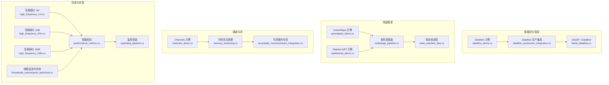
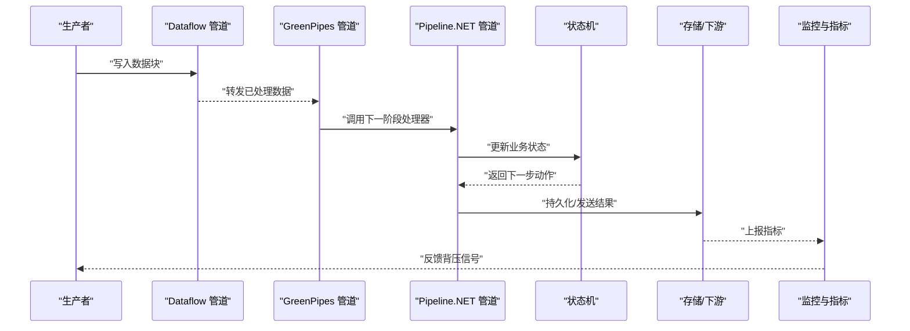
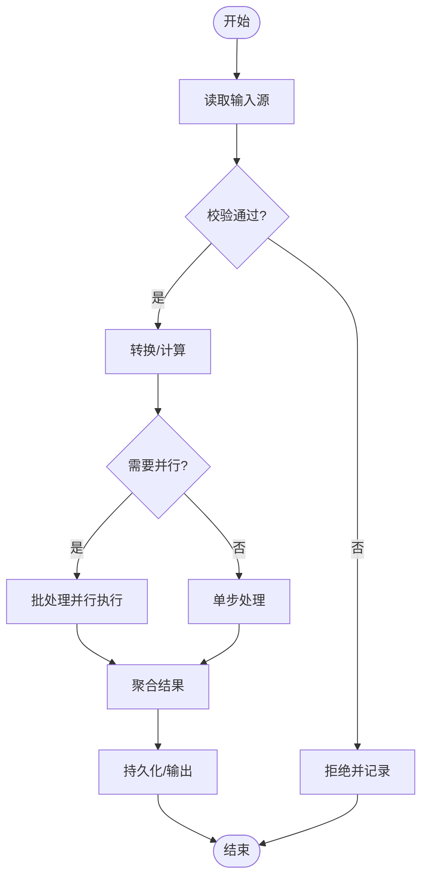
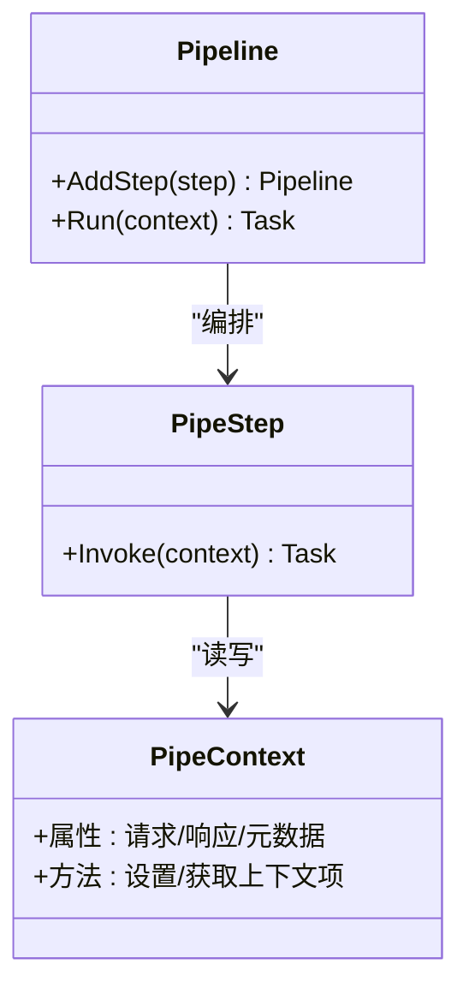
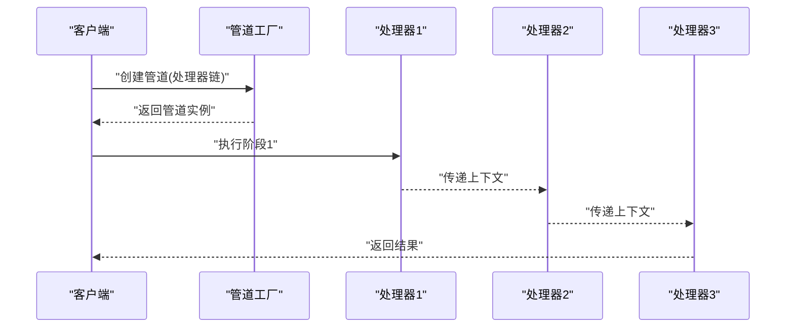
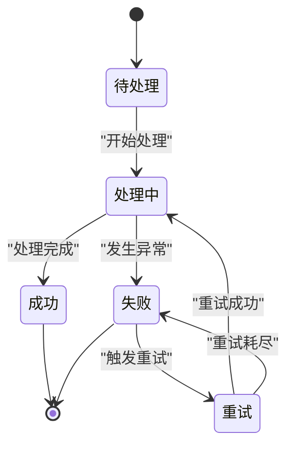
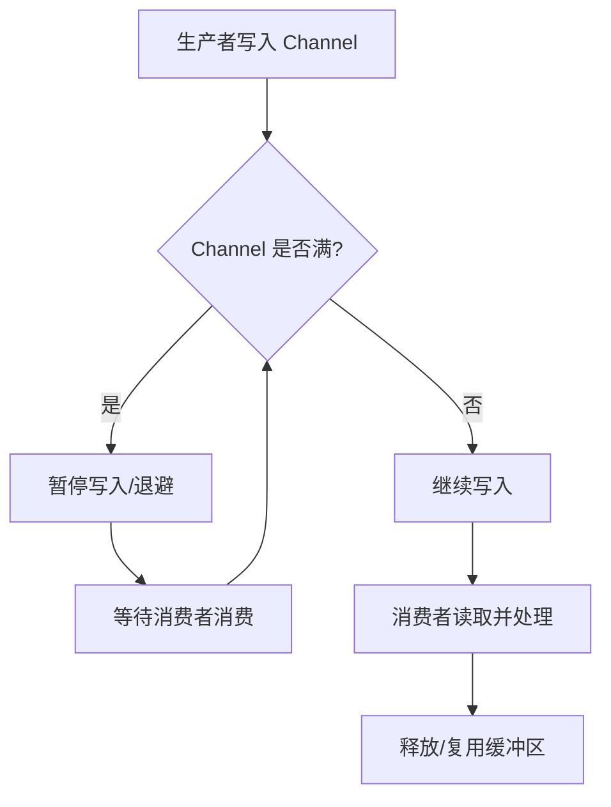
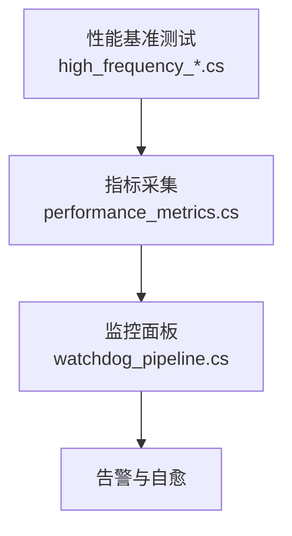
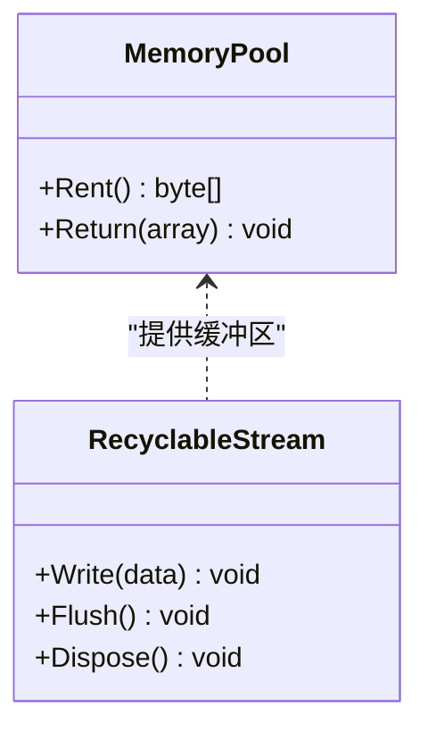

# 异步处理模式

<cite>
**本文引用的文件**   
- [dataflow_demo.cs](file://dataflow_demo.cs)
- [dataflow_pipeline.cs](file://dataflow_pipeline.cs)
- [dataflow_production_integration.cs](file://dataflow_production_integration.cs)
- [greenpipes_demo.cs](file://greenpipes_demo.cs)
- [pipelinenet_demo.cs](file://pipelinenet_demo.cs)
- [multistage_pipeline.cs](file://multistage_pipeline.cs)
- [state_machine_flow.cs](file://state_machine_flow.cs)
- [channels_demo.cs](file://channels_demo.cs)
- [high_frequency_1m.cs](file://high_frequency_1m.cs)
- [high_frequency_10m.cs](file://high_frequency_10m.cs)
- [high_frequency_100k.cs](file://high_frequency_100k.cs)
- [performance_metrics.cs](file://performance_metrics.cs)
- [memory_streaming.cs](file://memory_streaming.cs)
- [recyclable_memorystream_integration.cs](file://recyclable_memorystream_integration.cs)
- [threadsafe_memorypool_optimized.cs](file://threadsafe_memorypool_optimized.cs)
- [litedb_dataflow.cs](file://litedb_dataflow.cs)
- [watchdog_pipeline.cs](file://watchdog_pipeline.cs)
</cite>

## 目录
1. [简介](#简介)
2. [项目结构](#项目结构)
3. [核心组件](#核心组件)
4. [架构总览](#架构总览)
5. [详细组件分析](#详细组件分析)
6. [依赖关系分析](#依赖关系分析)
7. [性能考量](#性能考量)
8. [故障排查指南](#故障排查指南)
9. [结论](#结论)
10. [附录](#附录)

## 简介
本文件围绕“异步处理模式”展开，聚焦于 Dataflow 管道、GreenPipes、Pipeline.NET 等框架在 .NET 中的使用与实践。内容涵盖：
- 状态机流程控制与多阶段数据处理
- 背压（Backpressure）机制与流量控制
- 异步编程最佳实践、异常处理与资源管理
- 高并发场景下的性能优化、内存管理与线程同步策略
- 实际业务场景中的异步处理模式应用案例

本仓库提供了大量示例与集成代码，可作为学习与实践的参考实现。

## 项目结构
仓库采用“按主题/能力组织”的文件命名方式，每个文件通常对应一个具体的集成或演示。与异步处理相关的核心文件包括：
- Dataflow 系列：dataflow_demo.cs、dataflow_pipeline.cs、dataflow_production_integration.cs、litedb_dataflow.cs
- GreenPipes：greenpipes_demo.cs
- Pipeline.NET：pipelinenet_demo.cs
- 多阶段与状态机：multistage_pipeline.cs、state_machine_flow.cs
- 通道与流式处理：channels_demo.cs、memory_streaming.cs、recyclable_memorystream_integration.cs
- 高并发与性能：high_frequency_1m.cs、high_frequency_10m.cs、high_frequency_100k.cs、performance_metrics.cs
- 内存池与线程安全：threadsafe_memorypool_optimized.cs
- 监控与可观测性：watchdog_pipeline.cs

图表来源
- [dataflow_demo.cs](file://dataflow_demo.cs)
- [dataflow_production_integration.cs](file://dataflow_production_integration.cs)
- [litedb_dataflow.cs](file://litedb_dataflow.cs)
- [greenpipes_demo.cs](file://greenpipes_demo.cs)
- [pipelinenet_demo.cs](file://pipelinenet_demo.cs)
- [multistage_pipeline.cs](file://multistage_pipeline.cs)
- [state_machine_flow.cs](file://state_machine_flow.cs)
- [channels_demo.cs](file://channels_demo.cs)
- [memory_streaming.cs](file://memory_streaming.cs)
- [recyclable_memorystream_integration.cs](file://recyclable_memorystream_integration.cs)
- [high_frequency_1m.cs](file://high_frequency_1m.cs)
- [high_frequency_10m.cs](file://high_frequency_10m.cs)
- [high_frequency_100k.cs](file://high_frequency_100k.cs)
- [performance_metrics.cs](file://performance_metrics.cs)
- [threadsafe_memorypool_optimized.cs](file://threadsafe_memorypool_optimized.cs)
- [watchdog_pipeline.cs](file://watchdog_pipeline.cs)

章节来源
- [dataflow_demo.cs](file://dataflow_demo.cs)
- [dataflow_pipeline.cs](file://dataflow_pipeline.cs)
- [dataflow_production_integration.cs](file://dataflow_production_integration.cs)
- [greenpipes_demo.cs](file://greenpipes_demo.cs)
- [pipelinenet_demo.cs](file://pipelinenet_demo.cs)
- [multistage_pipeline.cs](file://multistage_pipeline.cs)
- [state_machine_flow.cs](file://state_machine_flow.cs)
- [channels_demo.cs](file://channels_demo.cs)
- [high_frequency_1m.cs](file://high_frequency_1m.cs)
- [high_frequency_10m.cs](file://high_frequency_10m.cs)
- [high_frequency_100k.cs](file://high_frequency_100k.cs)
- [performance_metrics.cs](file://performance_metrics.cs)
- [memory_streaming.cs](file://memory_streaming.cs)
- [recyclable_memorystream_integration.cs](file://recyclable_memorystream_integration.cs)
- [threadsafe_memorypool_optimized.cs](file://threadsafe_memorypool_optimized.cs)
- [litedb_dataflow.cs](file://litedb_dataflow.cs)
- [watchdog_pipeline.cs](file://watchdog_pipeline.cs)

## 核心组件
- Dataflow 管道：通过块（Block）组合构建有向图，支持并行度、缓冲与取消；适合 CPU 密集与 I/O 混合的多阶段处理。
- GreenPipes：以“管道+阶段”的方式编排异步处理，天然支持背压、错误传播与重试。
- Pipeline.NET：轻量级管道模型，便于串联多个处理器并统一异常与日志。
- Channels 与流式处理：基于 System.Threading.Channels 的高性能消息通道，配合 Memory/MemoryStream 实现零拷贝与低分配。
- 状态机流程：将复杂业务流转抽象为状态与转换，保证一致性与可恢复性。
- 性能与资源：内存池、可回收内存流、指标采集与监控，确保高吞吐与低延迟。

章节来源
- [dataflow_demo.cs](file://dataflow_demo.cs)
- [dataflow_pipeline.cs](file://dataflow_pipeline.cs)
- [dataflow_production_integration.cs](file://dataflow_production_integration.cs)
- [greenpipes_demo.cs](file://greenpipes_demo.cs)
- [pipelinenet_demo.cs](file://pipelinenet_demo.cs)
- [multistage_pipeline.cs](file://multistage_pipeline.cs)
- [state_machine_flow.cs](file://state_machine_flow.cs)
- [channels_demo.cs](file://channels_demo.cs)
- [memory_streaming.cs](file://memory_streaming.cs)
- [recyclable_memorystream_integration.cs](file://recyclable_memorystream_integration.cs)
- [threadsafe_memorypool_optimized.cs](file://threadsafe_memorypool_optimized.cs)
- [performance_metrics.cs](file://performance_metrics.cs)
- [watchdog_pipeline.cs](file://watchdog_pipeline.cs)

## 架构总览
下图展示了一个典型的多阶段异步处理架构：生产者通过 Dataflow 或 Channels 产生数据，进入由多个处理器组成的管道（GreenPipes/Pipeline.NET），中间包含验证、转换、聚合、持久化等阶段，最终输出到下游系统。状态机用于控制关键业务流程，指标与监控贯穿全链路。

图表来源
- [dataflow_production_integration.cs](file://dataflow_production_integration.cs)
- [greenpipes_demo.cs](file://greenpipes_demo.cs)
- [pipelinenet_demo.cs](file://pipelinenet_demo.cs)
- [state_machine_flow.cs](file://state_machine_flow.cs)
- [performance_metrics.cs](file://performance_metrics.cs)

## 详细组件分析

### Dataflow 管道
- 设计要点
  - 使用 TransformMany/TransformAsync 进行多阶段转换
  - 通过 MaxDegreeOfParallelism 控制并发度
  - 使用 BufferBlock 作为缓冲与解耦点
  - 结合 CancellationToken 实现优雅取消
- 背压策略
  - 限制目标块的容量，避免内存膨胀
  - 上游根据下游消费速率动态调整写入频率
- 异常处理
  - 捕获阶段异常并路由到死信队列或重试逻辑
  - 记录上下文以便定位问题

图表来源
- [dataflow_demo.cs](file://dataflow_demo.cs)
- [dataflow_pipeline.cs](file://dataflow_pipeline.cs)
- [dataflow_production_integration.cs](file://dataflow_production_integration.cs)

章节来源
- [dataflow_demo.cs](file://dataflow_demo.cs)
- [dataflow_pipeline.cs](file://dataflow_pipeline.cs)
- [dataflow_production_integration.cs](file://dataflow_production_integration.cs)

### GreenPipes 管道
- 设计要点
  - 定义管道阶段（PipeStep），每个阶段负责单一职责
  - 使用上下文对象传递请求/响应与元数据
  - 内置重试、超时、熔断等横切关注点
- 背压与限流
  - 通过管道配置限制并发与缓冲
  - 结合外部限速器实现端到端流量控制
- 错误处理
  - 阶段内异常向上冒泡，统一拦截处理
  - 支持降级与补偿逻辑

图表来源
- [greenpipes_demo.cs](file://greenpipes_demo.cs)

章节来源
- [greenpipes_demo.cs](file://greenpipes_demo.cs)

### Pipeline.NET 管道
- 设计要点
  - 使用 IProcessor<TIn, TOut> 定义处理器
  - 通过管道工厂组装处理器链
  - 统一的异常与日志注入点
- 适用场景
  - 简单线性处理链
  - 快速原型与小型服务

图表来源
- [pipelinenet_demo.cs](file://pipelinenet_demo.cs)

章节来源
- [pipelinenet_demo.cs](file://pipelinenet_demo.cs)

### 多阶段管道与状态机
- 多阶段管道
  - 将复杂处理拆分为多个独立阶段，便于测试与扩展
  - 每阶段可独立配置并发、超时与重试
- 状态机流程
  - 明确定义状态集合与转换规则
  - 支持事件驱动的状态迁移与补偿

图表来源
- [multistage_pipeline.cs](file://multistage_pipeline.cs)
- [state_machine_flow.cs](file://state_machine_flow.cs)

章节来源
- [multistage_pipeline.cs](file://multistage_pipeline.cs)
- [state_machine_flow.cs](file://state_machine_flow.cs)

### 通道与流式处理
- Channels 的使用
  - 使用 BoundedChannel 实现背压
  - 结合 async/await 实现非阻塞消费
- 流式处理
  - 使用 Stream/Memory 减少分配与拷贝
  - 配合可回收内存流提升 GC 表现

图表来源
- [channels_demo.cs](file://channels_demo.cs)
- [memory_streaming.cs](file://memory_streaming.cs)
- [recyclable_memorystream_integration.cs](file://recyclable_memorystream_integration.cs)

章节来源
- [channels_demo.cs](file://channels_demo.cs)
- [memory_streaming.cs](file://memory_streaming.cs)
- [recyclable_memorystream_integration.cs](file://recyclable_memorystream_integration.cs)

### 高并发与性能优化
- 吞吐优化
  - 合理设置并行度与批大小
  - 使用内存池与零拷贝技术
- 指标与监控
  - 采集延迟、吞吐、错误率等关键指标
  - 结合 WatchDog 进行健康检查与告警

图表来源
- [high_frequency_1m.cs](file://high_frequency_1m.cs)
- [high_frequency_10m.cs](file://high_frequency_10m.cs)
- [high_frequency_100k.cs](file://high_frequency_100k.cs)
- [performance_metrics.cs](file://performance_metrics.cs)
- [watchdog_pipeline.cs](file://watchdog_pipeline.cs)

章节来源
- [high_frequency_1m.cs](file://high_frequency_1m.cs)
- [high_frequency_10m.cs](file://high_frequency_10m.cs)
- [high_frequency_100k.cs](file://high_frequency_100k.cs)
- [performance_metrics.cs](file://performance_metrics.cs)
- [watchdog_pipeline.cs](file://watchdog_pipeline.cs)

### 内存管理与线程同步
- 内存池
  - 使用线程安全内存池减少分配压力
  - 合理选择池大小与生命周期
- 可回收内存流
  - 复用缓冲区降低 GC 频率
  - 注意边界条件与并发访问安全

图表来源
- [threadsafe_memorypool_optimized.cs](file://threadsafe_memorypool_optimized.cs)
- [recyclable_memorystream_integration.cs](file://recyclable_memorystream_integration.cs)

章节来源
- [threadsafe_memorypool_optimized.cs](file://threadsafe_memorypool_optimized.cs)
- [recyclable_memorystream_integration.cs](file://recyclable_memorystream_integration.cs)

### 数据持久化集成（LiteDB + Dataflow）
- 设计要点
  - Dataflow 负责解析与转换
  - LiteDB 作为嵌入式存储，简化部署
  - 批量写入提升吞吐
- 注意事项
  - 控制并发写以避免锁竞争
  - 事务与一致性保障

章节来源
- [litedb_dataflow.cs](file://litedb_dataflow.cs)

## 依赖关系分析
- 组件耦合
  - Dataflow 与 Channels 作为数据源与缓冲层，松耦合连接上层管道
  - GreenPipes/Pipeline.NET 作为处理层，屏蔽底层实现差异
  - 状态机与持久化作为业务层，关注领域逻辑
- 外部依赖
  - 指标与监控依赖 Prometheus/OpenTelemetry（示例中体现为指标采集）
  - 存储依赖 LiteDB/SQLite（示例中体现为嵌入式数据库）

图表来源
- [dataflow_production_integration.cs](file://dataflow_production_integration.cs)
- [greenpipes_demo.cs](file://greenpipes_demo.cs)
- [pipelinenet_demo.cs](file://pipelinenet_demo.cs)
- [state_machine_flow.cs](file://state_machine_flow.cs)
- [performance_metrics.cs](file://performance_metrics.cs)

章节来源
- [dataflow_production_integration.cs](file://dataflow_production_integration.cs)
- [greenpipes_demo.cs](file://greenpipes_demo.cs)
- [pipelinenet_demo.cs](file://pipelinenet_demo.cs)
- [state_machine_flow.cs](file://state_machine_flow.cs)
- [performance_metrics.cs](file://performance_metrics.cs)

## 性能考量
- 背压与流量控制
  - 使用有界通道与缓冲块防止内存溢出
  - 根据下游处理能力动态调整上游速率
- 并发与并行
  - 合理设置 MaxDegreeOfParallelism
  - 避免热点锁与争用
- 内存与 GC
  - 使用内存池与可回收流减少分配
  - 避免大对象堆（LOH）频繁分配
- 指标与调优
  - 采集关键路径的延迟与吞吐
  - 基于指标进行容量规划与参数调优

[本节为通用指导，不直接分析具体文件]

## 故障排查指南
- 常见问题
  - 背压失效导致 OOM：检查缓冲大小与消费速率
  - 死锁与饥饿：检查锁粒度与任务调度
  - 异常未捕获：确保全局异常处理器与重试策略
- 诊断手段
  - 启用详细日志与追踪
  - 使用性能计数器与指标面板定位瓶颈
  - 模拟高负载进行回归测试

章节来源
- [performance_metrics.cs](file://performance_metrics.cs)
- [watchdog_pipeline.cs](file://watchdog_pipeline.cs)

## 结论
通过 Dataflow、GreenPipes、Pipeline.NET 等框架的组合，可以构建高吞吐、低延迟、可扩展的异步处理系统。关键在于：
- 合理的管道设计与阶段划分
- 有效的背压与流量控制
- 完善的异常处理与资源管理
- 持续的指标采集与性能调优

[本节为总结性内容，不直接分析具体文件]

## 附录
- 推荐实践
  - 优先使用无锁数据结构与通道
  - 将 I/O 与 CPU 密集型任务分离
  - 使用结构化日志与分布式追踪
- 参考实现
  - 查看各示例文件的注释与用法，理解具体实现细节

[本节为补充信息，不直接分析具体文件]