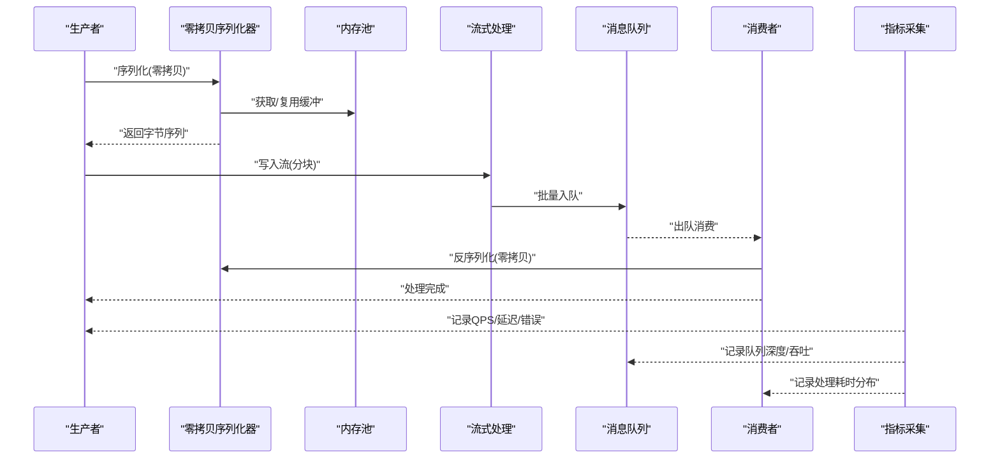
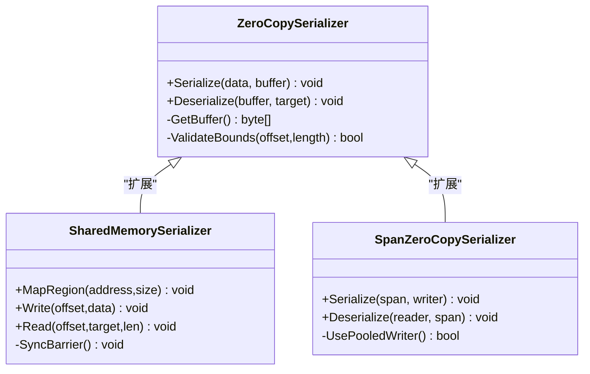
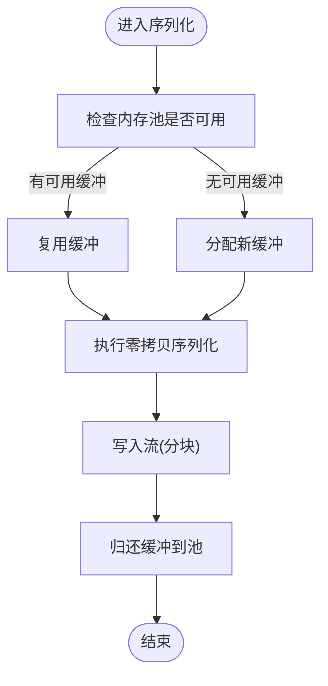
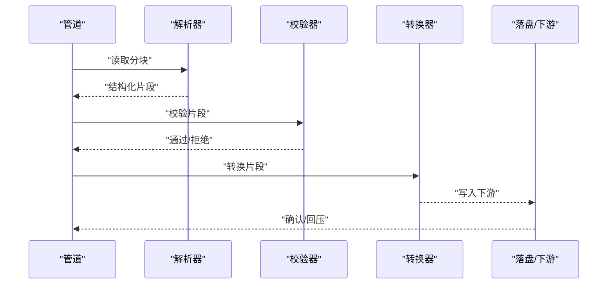
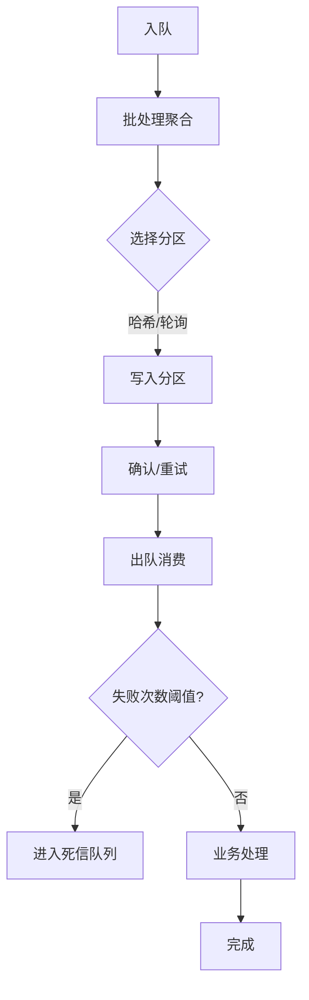
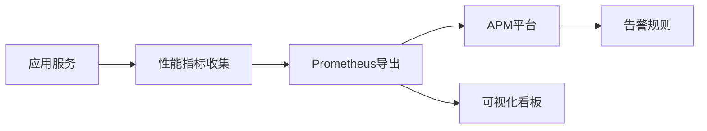
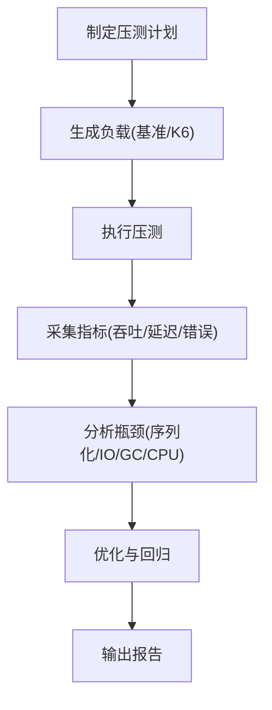
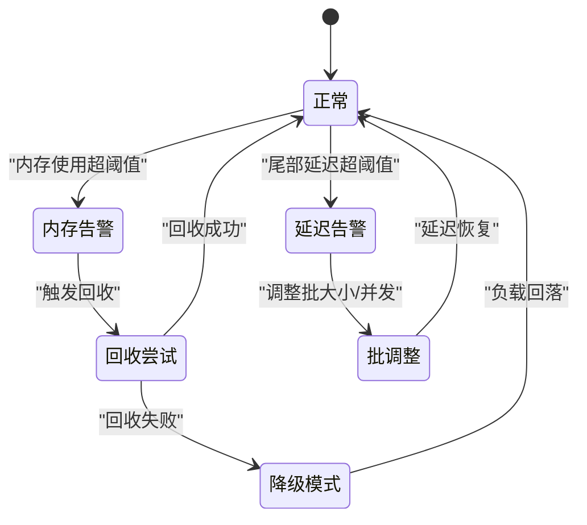
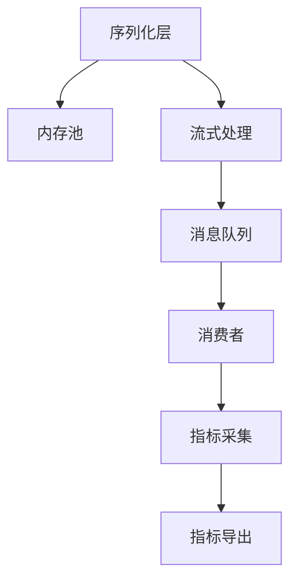

# 性能优化与监控

<cite>
**本文档引用的文件**   
- [zero_copy_serializer.cs](file://zero_copy_serializer.cs)
- [zero_copy_messagepack.cs](file://zero_copy_messagepack.cs)
- [span_zero_copy_serializer.cs](file://span_zero_copy_serializer.cs)
- [threadsafe_memorypool_optimized.cs](file://threadsafe_memorypool_optimized.cs)
- [threadsafe_memorypool_serializer.cs](file://threadsafe_memorypool_serializer.cs)
- [recyclable_memorystream.cs](file://recyclable_memorystream.cs)
- [memory_streaming.cs](file://memory_streaming.cs)
- [pipe_streaming_serializer.cs](file://pipe_streaming_serializer.cs)
- [message_queue.cs](file://message_queue.cs)
- [message_queue_enhanced.cs](file://message_queue_enhanced.cs)
- [performance_metrics.cs](file://performance_metrics.cs)
- [metrics_monitoring.cs](file://metrics_monitoring.cs)
- [prometheus_metrics.cs](file://prometheus_metrics.cs)
- [appinsights_prometheus.cs](file://appinsights_prometheus.cs)
- [opentelemetry_prometheus.cs](file://opentelemetry_prometheus.cs)
- [benchmark_demo.cs](file://benchmark_demo.cs)
- [k6_todo_benchmark.js](file://k6_todo_benchmark.js)
- [high_frequency_10m.cs](file://high_frequency_10m.cs)
- [high_frequency_1m.cs](file://high_frequency_1m.cs)
- [high_frequency_100k.cs](file://high_frequency_100k.cs)
- [watchdog_memory.cs](file://watchdog_memory.cs)
- [memory_leak_detection.cs](file://memory_leak_detection.cs)
- [tail_latency_optimizer.cs](file://tail_latency_optimizer.cs)
- [tiered_memory_integration.cs](file://tiered_memory_integration.cs)
- [tiered_memory_processor.cs](file://tiered_memory_processor.cs)
- [shared_memory_serializer.cs](file://shared_memory_serializer.cs)
- [shared_memory_messagepack.cs](file://shared_memory_messagepack.cs)
</cite>

## 目录
1. [简介](#简介)
2. [项目结构](#项目结构)
3. [核心组件](#核心组件)
4. [架构总览](#架构总览)
5. [详细组件分析](#详细组件分析)
6. [依赖关系分析](#依赖关系分析)
7. [性能考量](#性能考量)
8. [故障排查指南](#故障排查指南)
9. [结论](#结论)
10. [附录](#附录)

## 简介
本文件面向高吞吐消息系统的性能优化与监控，聚焦零拷贝序列化、内存池优化、流式处理等关键技术，并结合指标采集、瓶颈分析与调优策略。文档同时覆盖垃圾回收优化、内存泄漏检测、CPU使用率优化方法，以及分布式环境下的性能测试方法与基准工具，最后给出生产环境的监控告警与容量规划建议。

## 项目结构
仓库中包含大量与高性能消息、序列化、内存管理、监控与基准测试相关的示例与实现。围绕“性能优化与监控”主题，关键文件按功能域组织如下：
- 零拷贝序列化与共享内存：zero_copy_serializer.cs、zero_copy_messagepack.cs、span_zero_copy_serializer.cs、shared_memory_serializer.cs、shared_memory_messagepack.cs
- 内存池与可复用缓冲：threadsafe_memorypool_optimized.cs、threadsafe_memorypool_serializer.cs、recyclable_memorystream.cs
- 流式处理与管道：memory_streaming.cs、pipe_streaming_serializer.cs
- 消息队列与增强：message_queue.cs、message_queue_enhanced.cs
- 指标与监控：performance_metrics.cs、metrics_monitoring.cs、prometheus_metrics.cs、appinsights_prometheus.cs、opentelemetry_prometheus.cs
- 基准与压测：benchmark_demo.cs、k6_todo_benchmark.js、high_frequency_10m.cs、high_frequency_1m.cs、high_frequency_100k.cs
- 内存与尾部延迟治理：watchdog_memory.cs、memory_leak_detection.cs、tail_latency_optimizer.cs、tiered_memory_integration.cs、tiered_memory_processor.cs

```mermaid
graph TB
subgraph "序列化与传输"
ZCS["零拷贝序列化<br/>zero_copy_serializer.cs"]
ZCMP["零拷贝MessagePack<br/>zero_copy_messagepack.cs"]
SZCS["Span零拷贝序列化<br/>span_zero_copy_serializer.cs"]
SMS["共享内存序列化<br/>shared_memory_serializer.cs"]
SMMP["共享内存MessagePack<br/>shared_memory_messagepack.cs"]
end
subgraph "内存与流式"
TMP["线程安全内存池<br/>threadsafe_memorypool_optimized.cs"]
TMPS["内存池序列化器<br/>threadsafe_memorypool_serializer.cs"]
RMS["可复用MemoryStream<br/>recyclable_memorystream.cs"]
MS["内存流式处理<br/>memory_streaming.cs"]
PPS["管道流式序列化<br/>pipe_streaming_serializer.cs"]
end
subgraph "消息与队列"
MQ["消息队列<br/>message_queue.cs"]
MQE["增强消息队列<br/>message_queue_enhanced.cs"]
end
subgraph "监控与指标"
PM["性能指标<br/>performance_metrics.cs"]
MM["指标监控<br/>metrics_monitoring.cs"]
PRM["Prometheus指标<br/>prometheus_metrics.cs"]
AIP["AppInsights+Prometheus<br/>appinsights_prometheus.cs"]
OTP["OpenTelemetry+Prometheus<br/>opentelemetry_prometheus.cs"]
end
subgraph "基准与压测"
BMD["基准演示<br/>benchmark_demo.cs"]
K6["K6脚本<br/>k6_todo_benchmark.js"]
HF10M["高频10M<br/>high_frequency_10m.cs"]
HF1M["高频1M<br/>high_frequency_1m.cs"]
HF100K["高频100K<br/>high_frequency_100k.cs"]
end
subgraph "内存与延迟治理"
WM["内存守护<br/>watchdog_memory.cs"]
MLD["内存泄漏检测<br/>memory_leak_detection.cs"]
TLO["尾部延迟优化<br/>tail_latency_optimizer.cs"]
TMI["分层内存集成<br/>tiered_memory_integration.cs"]
TMPR["分层内存处理器<br/>tiered_memory_processor.cs"]
end
ZCS --> MQ
ZCMP --> MQ
SZCS --> MQ
SMS --> MQ
SMMP --> MQ
TMP --> ZCS
TMP --> ZCMP
TMP --> SMS
TMP --> SMMP
TMPS --> ZCS
TMPS --> ZCMP
RMS --> MS
PPS --> MS
MS --> MQ
PPS --> MQ
MQ --> PM
MQ --> MM
PM --> PRM
MM --> PRM
PRM --> AIP
PRM --> OTP
BMD --> MQ
K6 --> MQ
HF10M --> MQ
HF1M --> MQ
HF100K --> MQ
WM --> MQ
MLD --> MQ
TLO --> MQ
TMI --> MQ
TMPR --> MQ
```

**图表来源** 
- [zero_copy_serializer.cs](file://zero_copy_serializer.cs)
- [zero_copy_messagepack.cs](file://zero_copy_messagepack.cs)
- [span_zero_copy_serializer.cs](file://span_zero_copy_serializer.cs)
- [shared_memory_serializer.cs](file://shared_memory_serializer.cs)
- [shared_memory_messagepack.cs](file://shared_memory_messagepack.cs)
- [threadsafe_memorypool_optimized.cs](file://threadsafe_memorypool_optimized.cs)
- [threadsafe_memorypool_serializer.cs](file://threadsafe_memorypool_serializer.cs)
- [recyclable_memorystream.cs](file://recyclable_memorystream.cs)
- [memory_streaming.cs](file://memory_streaming.cs)
- [pipe_streaming_serializer.cs](file://pipe_streaming_serializer.cs)
- [message_queue.cs](file://message_queue.cs)
- [message_queue_enhanced.cs](file://message_queue_enhanced.cs)
- [performance_metrics.cs](file://performance_metrics.cs)
- [metrics_monitoring.cs](file://metrics_monitoring.cs)
- [prometheus_metrics.cs](file://prometheus_metrics.cs)
- [appinsights_prometheus.cs](file://appinsights_prometheus.cs)
- [opentelemetry_prometheus.cs](file://opentelemetry_prometheus.cs)
- [benchmark_demo.cs](file://benchmark_demo.cs)
- [k6_todo_benchmark.js](file://k6_todo_benchmark.js)
- [high_frequency_10m.cs](file://high_frequency_10m.cs)
- [high_frequency_1m.cs](file://high_frequency_1m.cs)
- [high_frequency_100k.cs](file://high_frequency_100k.cs)
- [watchdog_memory.cs](file://watchdog_memory.cs)
- [memory_leak_detection.cs](file://memory_leak_detection.cs)
- [tail_latency_optimizer.cs](file://tail_latency_optimizer.cs)
- [tiered_memory_integration.cs](file://tiered_memory_integration.cs)
- [tiered_memory_processor.cs](file://tiered_memory_processor.cs)

**章节来源**
- [zero_copy_serializer.cs](file://zero_copy_serializer.cs)
- [zero_copy_messagepack.cs](file://zero_copy_messagepack.cs)
- [span_zero_copy_serializer.cs](file://span_zero_copy_serializer.cs)
- [threadsafe_memorypool_optimized.cs](file://threadsafe_memorypool_optimized.cs)
- [threadsafe_memorypool_serializer.cs](file://threadsafe_memorypool_serializer.cs)
- [recyclable_memorystream.cs](file://recyclable_memorystream.cs)
- [memory_streaming.cs](file://memory_streaming.cs)
- [pipe_streaming_serializer.cs](file://pipe_streaming_serializer.cs)
- [message_queue.cs](file://message_queue.cs)
- [message_queue_enhanced.cs](file://message_queue_enhanced.cs)
- [performance_metrics.cs](file://performance_metrics.cs)
- [metrics_monitoring.cs](file://metrics_monitoring.cs)
- [prometheus_metrics.cs](file://prometheus_metrics.cs)
- [appinsights_prometheus.cs](file://appinsights_prometheus.cs)
- [opentelemetry_prometheus.cs](file://opentelemetry_prometheus.cs)
- [benchmark_demo.cs](file://benchmark_demo.cs)
- [k6_todo_benchmark.js](file://k6_todo_benchmark.js)
- [high_frequency_10m.cs](file://high_frequency_10m.cs)
- [high_frequency_1m.cs](file://high_frequency_1m.cs)
- [high_frequency_100k.cs](file://high_frequency_100k.cs)
- [watchdog_memory.cs](file://watchdog_memory.cs)
- [memory_leak_detection.cs](file://memory_leak_detection.cs)
- [tail_latency_optimizer.cs](file://tail_latency_optimizer.cs)
- [tiered_memory_integration.cs](file://tiered_memory_integration.cs)
- [tiered_memory_processor.cs](file://tiered_memory_processor.cs)

## 核心组件
- 零拷贝序列化器：通过Span/ReadOnlySpan与缓冲区复用，避免中间对象分配，降低GC压力并提升吞吐。
- 共享内存序列化：进程内或跨进程共享内存直接读写，减少数据复制与上下文切换开销。
- 线程安全内存池：提供无锁或低锁争用的对象/缓冲复用，适配高并发场景。
- 可复用MemoryStream：避免频繁创建/销毁流对象，结合预分配缓冲降低分配热点。
- 流式处理与管道：以流式方式处理大消息，避免一次性加载到内存，降低峰值内存占用。
- 消息队列与增强：支持背压、批处理、分区与重试，提高系统稳定性与吞吐。
- 指标与监控：统一采集QPS、延迟分布、错误率、内存与CPU指标，对接Prometheus与APM。
- 基准与压测：内置基准与外部K6脚本，用于端到端性能验证与回归测试。
- 内存与延迟治理：内存守护、泄漏检测、尾部延迟优化与分层内存策略，保障稳定运行。

**章节来源**
- [zero_copy_serializer.cs](file://zero_copy_serializer.cs)
- [zero_copy_messagepack.cs](file://zero_copy_messagepack.cs)
- [span_zero_copy_serializer.cs](file://span_zero_copy_serializer.cs)
- [shared_memory_serializer.cs](file://shared_memory_serializer.cs)
- [shared_memory_messagepack.cs](file://shared_memory_messagepack.cs)
- [threadsafe_memorypool_optimized.cs](file://threadsafe_memorypool_optimized.cs)
- [threadsafe_memorypool_serializer.cs](file://threadsafe_memorypool_serializer.cs)
- [recyclable_memorystream.cs](file://recyclable_memorystream.cs)
- [memory_streaming.cs](file://memory_streaming.cs)
- [pipe_streaming_serializer.cs](file://pipe_streaming_serializer.cs)
- [message_queue.cs](file://message_queue.cs)
- [message_queue_enhanced.cs](file://message_queue_enhanced.cs)
- [performance_metrics.cs](file://performance_metrics.cs)
- [metrics_monitoring.cs](file://metrics_monitoring.cs)
- [prometheus_metrics.cs](file://prometheus_metrics.cs)
- [appinsights_prometheus.cs](file://appinsights_prometheus.cs)
- [opentelemetry_prometheus.cs](file://opentelemetry_prometheus.cs)
- [benchmark_demo.cs](file://benchmark_demo.cs)
- [k6_todo_benchmark.js](file://k6_todo_benchmark.js)
- [high_frequency_10m.cs](file://high_frequency_10m.cs)
- [high_frequency_1m.cs](file://high_frequency_1m.cs)
- [high_frequency_100k.cs](file://high_frequency_100k.cs)
- [watchdog_memory.cs](file://watchdog_memory.cs)
- [memory_leak_detection.cs](file://memory_leak_detection.cs)
- [tail_latency_optimizer.cs](file://tail_latency_optimizer.cs)
- [tiered_memory_integration.cs](file://tiered_memory_integration.cs)
- [tiered_memory_processor.cs](file://tiered_memory_processor.cs)

## 架构总览
下图展示从生产者到消费者的高吞吐消息处理链路，包括零拷贝序列化、内存池、流式处理与指标采集的关键节点。

**图表来源** 
- [zero_copy_serializer.cs](file://zero_copy_serializer.cs)
- [threadsafe_memorypool_optimized.cs](file://threadsafe_memorypool_optimized.cs)
- [memory_streaming.cs](file://memory_streaming.cs)
- [message_queue.cs](file://message_queue.cs)
- [performance_metrics.cs](file://performance_metrics.cs)

## 详细组件分析

### 零拷贝序列化组件
- 设计要点：基于Span/ReadOnlySpan的只读视图，避免中间对象分配；与内存池配合，复用底层缓冲；对大消息采用分块序列化，降低峰值内存。
- 适用场景：高吞吐RPC、事件总线、日志聚合、实时数据管道。
- 复杂度与权衡：序列化时间接近O(n)，空间复用显著降低GC压力；需关注边界检查与越界访问风险。

**图表来源** 
- [zero_copy_serializer.cs](file://zero_copy_serializer.cs)
- [shared_memory_serializer.cs](file://shared_memory_serializer.cs)
- [span_zero_copy_serializer.cs](file://span_zero_copy_serializer.cs)

**章节来源**
- [zero_copy_serializer.cs](file://zero_copy_serializer.cs)
- [zero_copy_messagepack.cs](file://zero_copy_messagepack.cs)
- [span_zero_copy_serializer.cs](file://span_zero_copy_serializer.cs)
- [shared_memory_serializer.cs](file://shared_memory_serializer.cs)
- [shared_memory_messagepack.cs](file://shared_memory_messagepack.cs)

### 内存池与可复用缓冲
- 设计要点：线程安全的对象/缓冲池，支持按需扩容与回收；与序列化器协作，减少分配热点；结合可复用MemoryStream，避免重复创建流对象。
- 适用场景：高频短生命周期对象、网络I/O缓冲、批处理临时存储。
- 复杂度与权衡：池化带来常数级开销，但大幅降低GC频率；需合理设置池大小与超时策略，避免内存膨胀。

**图表来源** 
- [threadsafe_memorypool_optimized.cs](file://threadsafe_memorypool_optimized.cs)
- [threadsafe_memorypool_serializer.cs](file://threadsafe_memorypool_serializer.cs)
- [recyclable_memorystream.cs](file://recyclable_memorystream.cs)

**章节来源**
- [threadsafe_memorypool_optimized.cs](file://threadsafe_memorypool_optimized.cs)
- [threadsafe_memorypool_serializer.cs](file://threadsafe_memorypool_serializer.cs)
- [recyclable_memorystream.cs](file://recyclable_memorystream.cs)

### 流式处理与管道
- 设计要点：以流式方式处理大消息，避免一次性加载；结合管道模型进行分阶段处理（解析、校验、转换、落盘）；支持背压与批处理。
- 适用场景：大文件上传、实时日志采集、ETL流水线。
- 复杂度与权衡：流式降低峰值内存，但增加调度复杂度；需平衡批大小与延迟目标。

**图表来源** 
- [memory_streaming.cs](file://memory_streaming.cs)
- [pipe_streaming_serializer.cs](file://pipe_streaming_serializer.cs)

**章节来源**
- [memory_streaming.cs](file://memory_streaming.cs)
- [pipe_streaming_serializer.cs](file://pipe_streaming_serializer.cs)

### 消息队列与增强
- 设计要点：支持分区、批处理、重试与死信；提供背压控制与限流；与序列化器解耦，便于替换不同协议。
- 适用场景：事件驱动架构、微服务间通信、实时数据处理。
- 复杂度与权衡：增强功能引入额外状态与同步开销；需根据负载特性调整分区数与批大小。

**图表来源** 
- [message_queue.cs](file://message_queue.cs)
- [message_queue_enhanced.cs](file://message_queue_enhanced.cs)

**章节来源**
- [message_queue.cs](file://message_queue.cs)
- [message_queue_enhanced.cs](file://message_queue_enhanced.cs)

### 指标与监控
- 设计要点：统一采集QPS、延迟分布、错误率、内存与CPU指标；对接Prometheus与APM；支持自定义指标与告警规则。
- 适用场景：生产环境监控、容量规划、问题定位。
- 复杂度与权衡：指标采集存在一定开销；需合理采样与降采样策略。

**图表来源** 
- [performance_metrics.cs](file://performance_metrics.cs)
- [metrics_monitoring.cs](file://metrics_monitoring.cs)
- [prometheus_metrics.cs](file://prometheus_metrics.cs)
- [appinsights_prometheus.cs](file://appinsights_prometheus.cs)
- [opentelemetry_prometheus.cs](file://opentelemetry_prometheus.cs)

**章节来源**
- [performance_metrics.cs](file://performance_metrics.cs)
- [metrics_monitoring.cs](file://metrics_monitoring.cs)
- [prometheus_metrics.cs](file://prometheus_metrics.cs)
- [appinsights_prometheus.cs](file://appinsights_prometheus.cs)
- [opentelemetry_prometheus.cs](file://opentelemetry_prometheus.cs)

### 基准与压测
- 设计要点：内置基准用例与外部K6脚本，覆盖端到端吞吐与延迟；支持多场景压测（小消息高频、大消息低频）。
- 适用场景：性能回归、容量评估、版本对比。
- 复杂度与权衡：压测需模拟真实负载特征；注意网络与资源隔离。

**图表来源** 
- [benchmark_demo.cs](file://benchmark_demo.cs)
- [k6_todo_benchmark.js](file://k6_todo_benchmark.js)
- [high_frequency_10m.cs](file://high_frequency_10m.cs)
- [high_frequency_1m.cs](file://high_frequency_1m.cs)
- [high_frequency_100k.cs](file://high_frequency_100k.cs)

**章节来源**
- [benchmark_demo.cs](file://benchmark_demo.cs)
- [k6_todo_benchmark.js](file://k6_todo_benchmark.js)
- [high_frequency_10m.cs](file://high_frequency_10m.cs)
- [high_frequency_1m.cs](file://high_frequency_1m.cs)
- [high_frequency_100k.cs](file://high_frequency_100k.cs)

### 内存与尾部延迟治理
- 设计要点：内存守护与泄漏检测，定期扫描与告警；尾部延迟优化（如尾延迟感知调度、批大小自适应）；分层内存策略（热/冷数据分离）。
- 适用场景：长时运行的消息服务、实时性敏感的业务。
- 复杂度与权衡：治理机制引入额外监控与调度开销；需结合业务SLA设定阈值。

**图表来源** 
- [watchdog_memory.cs](file://watchdog_memory.cs)
- [memory_leak_detection.cs](file://memory_leak_detection.cs)
- [tail_latency_optimizer.cs](file://tail_latency_optimizer.cs)
- [tiered_memory_integration.cs](file://tiered_memory_integration.cs)
- [tiered_memory_processor.cs](file://tiered_memory_processor.cs)

**章节来源**
- [watchdog_memory.cs](file://watchdog_memory.cs)
- [memory_leak_detection.cs](file://memory_leak_detection.cs)
- [tail_latency_optimizer.cs](file://tail_latency_optimizer.cs)
- [tiered_memory_integration.cs](file://tiered_memory_integration.cs)
- [tiered_memory_processor.cs](file://tiered_memory_processor.cs)

## 依赖关系分析
- 序列化与内存池强耦合：零拷贝序列化依赖内存池提供的缓冲，避免分配热点。
- 流式处理与队列解耦：流式模块仅负责数据流转，队列负责持久化与可靠性。
- 指标采集贯穿全链路：在序列化、入队、出队、消费各阶段埋点，形成完整观测链。
- 基准与压测独立于业务：通过外部脚本与基准用例验证性能，不侵入核心逻辑。

**图表来源** 
- [zero_copy_serializer.cs](file://zero_copy_serializer.cs)
- [threadsafe_memorypool_optimized.cs](file://threadsafe_memorypool_optimized.cs)
- [memory_streaming.cs](file://memory_streaming.cs)
- [message_queue.cs](file://message_queue.cs)
- [performance_metrics.cs](file://performance_metrics.cs)

**章节来源**
- [zero_copy_serializer.cs](file://zero_copy_serializer.cs)
- [threadsafe_memorypool_optimized.cs](file://threadsafe_memorypool_optimized.cs)
- [memory_streaming.cs](file://memory_streaming.cs)
- [message_queue.cs](file://message_queue.cs)
- [performance_metrics.cs](file://performance_metrics.cs)

## 性能考量
- 零拷贝序列化：优先使用Span/ReadOnlySpan与只读视图，减少对象分配与GC停顿。
- 内存池优化：合理设置池大小与回收策略，避免过度增长；结合可复用流降低峰值内存。
- 流式处理：分块处理大消息，结合背压控制，防止内存尖峰。
- 指标与监控：采集关键路径指标，建立SLO与告警；使用Prometheus与APM进行可视化与根因分析。
- 基准与压测：覆盖典型负载场景，持续回归；结合K6进行端到端验证。
- 内存与延迟治理：定期泄漏检测与内存快照分析；尾部延迟优化与分层内存策略提升稳定性。

[本节为通用指导，无需特定文件引用]

## 故障排查指南
- 内存泄漏检测：利用内存守护与泄漏检测工具，定位未释放对象与异常增长区域。
- GC压力分析：观察GC次数与停顿时间，结合序列化与内存池配置优化。
- CPU热点识别：通过性能剖析定位序列化、编解码与I/O热点。
- 尾部延迟定位：分析队列深度、批大小与消费者处理能力，调整并发与批策略。
- 指标异常诊断：结合Prometheus与APM，追踪请求链路，定位瓶颈环节。

**章节来源**
- [watchdog_memory.cs](file://watchdog_memory.cs)
- [memory_leak_detection.cs](file://memory_leak_detection.cs)
- [performance_metrics.cs](file://performance_metrics.cs)
- [metrics_monitoring.cs](file://metrics_monitoring.cs)
- [prometheus_metrics.cs](file://prometheus_metrics.cs)

## 结论
通过零拷贝序列化、内存池优化与流式处理等技术，结合完善的指标采集与基准压测，可显著提升高吞吐消息系统的性能与稳定性。生产环境中应持续监控关键指标，结合内存与延迟治理策略，确保系统在负载波动下仍保持SLA。

[本节为总结性内容，无需特定文件引用]

## 附录
- 分布式环境性能测试方法：使用容器编排与弹性扩缩容模拟多节点负载；结合分布式追踪定位跨服务瓶颈。
- 容量规划建议：基于历史指标与压测结果，估算CPU、内存与带宽需求；预留冗余应对突发流量。
- 告警策略：设置多级阈值（警告、严重），结合动态基线避免误报；联动自动化修复与降级策略。

[本节为通用指导，无需特定文件引用]