# 消息路由与转换

<cite>
**本文引用的文件**   
- [conditional_routing.cs](file://conditional_routing.cs)
- [dynamic_router.cs](file://dynamic_router.cs)
- [message_compression.cs](file://message_compression.cs)
- [hybrid_protocol_advanced.cs](file://hybrid_protocol_advanced.cs)
- [hybrid_serializer.cs](file://hybrid_serializer.cs)
- [inproc_json_serializer.cs](file://inproc_json_serializer.cs)
- [inproc_messagepack_serializer.cs](file://inproc_messagepack_serializer.cs)
- [shared_memory_serializer.cs](file://shared_memory_serializer.cs)
- [zero_copy_serializer.cs](file://zero_copy_serializer.cs)
- [brotli_compression_integration.cs](file://brotli_compression_integration.cs)
- [lz4_integration.cs](file://lz4_integration.cs)
- [zstd_compression_integration.cs](file://zstd_compression_integration.cs)
- [aes_gcm_encryption_integration.cs](file://aes_gcm_encryption_integration.cs)
- [rsa_encryption_integration.cs](file://rsa_encryption_integration.cs)
- [sm_crypto_integration.cs](file://sm_crypto_integration.cs)
- [message_queue.cs](file://message_queue.cs)
- [message_queue_enhanced.cs](file://message_queue_enhanced.cs)
- [dead_letter.cs](file://dead_letter.cs)
- [metrics_monitoring.cs](file://metrics_monitoring.cs)
- [opentelemetry_integration.cs](file://opentelemetry_integration.cs)
</cite>

## 目录
1. [引言](#引言)
2. [项目结构](#项目结构)
3. [核心组件](#核心组件)
4. [架构总览](#架构总览)
5. [详细组件分析](#详细组件分析)
6. [依赖关系分析](#依赖关系分析)
7. [性能考量](#性能考量)
8. [故障排查指南](#故障排查指南)
9. [结论](#结论)
10. [附录](#附录)

## 引言
本文件围绕“消息路由与转换”主题，系统阐述条件路由、动态路由的实现原理与配置方法；覆盖消息格式转换、协议适配、序列化优化；解释压缩传输、加密处理与安全验证机制；并给出消息过滤、分片、聚合等高级能力的设计思路。同时提供路由规则设计原则、性能优化策略，以及在复杂路由场景下的调试与监控方法。

## 项目结构
仓库中包含大量与消息处理相关的示例与集成实现，其中与本主题直接相关的关键文件包括：
- 路由与规则：条件路由、动态路由
- 序列化与协议：混合协议、多种序列化器（JSON、MessagePack、共享内存、零拷贝）
- 压缩与安全：Brotli/LZ4/Zstd 压缩，AES-GCM/RSA/国密加密
- 队列与可靠性：消息队列、增强队列、死信队列
- 可观测性：指标监控、OpenTelemetry 集成

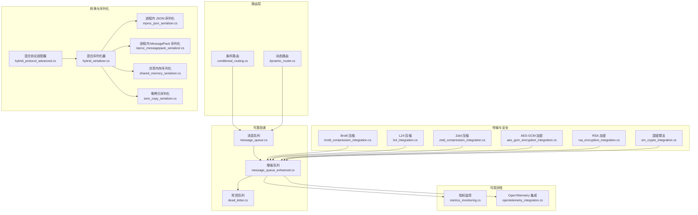

**图表来源** 
- [conditional_routing.cs](file://conditional_routing.cs)
- [dynamic_router.cs](file://dynamic_router.cs)
- [hybrid_protocol_advanced.cs](file://hybrid_protocol_advanced.cs)
- [hybrid_serializer.cs](file://hybrid_serializer.cs)
- [inproc_json_serializer.cs](file://inproc_json_serializer.cs)
- [inproc_messagepack_serializer.cs](file://inproc_messagepack_serializer.cs)
- [shared_memory_serializer.cs](file://shared_memory_serializer.cs)
- [zero_copy_serializer.cs](file://zero_copy_serializer.cs)
- [brotli_compression_integration.cs](file://brotli_compression_integration.cs)
- [lz4_integration.cs](file://lz4_integration.cs)
- [zstd_compression_integration.cs](file://zstd_compression_integration.cs)
- [aes_gcm_encryption_integration.cs](file://aes_gcm_encryption_integration.cs)
- [rsa_encryption_integration.cs](file://rsa_encryption_integration.cs)
- [sm_crypto_integration.cs](file://sm_crypto_integration.cs)
- [message_queue.cs](file://message_queue.cs)
- [message_queue_enhanced.cs](file://message_queue_enhanced.cs)
- [dead_letter.cs](file://dead_letter.cs)
- [metrics_monitoring.cs](file://metrics_monitoring.cs)
- [opentelemetry_integration.cs](file://opentelemetry_integration.cs)

**章节来源**
- [conditional_routing.cs](file://conditional_routing.cs)
- [dynamic_router.cs](file://dynamic_router.cs)
- [hybrid_protocol_advanced.cs](file://hybrid_protocol_advanced.cs)
- [hybrid_serializer.cs](file://hybrid_serializer.cs)
- [inproc_json_serializer.cs](file://inproc_json_serializer.cs)
- [inproc_messagepack_serializer.cs](file://inproc_messagepack_serializer.cs)
- [shared_memory_serializer.cs](file://shared_memory_serializer.cs)
- [zero_copy_serializer.cs](file://zero_copy_serializer.cs)
- [brotli_compression_integration.cs](file://brotli_compression_integration.cs)
- [lz4_integration.cs](file://lz4_integration.cs)
- [zstd_compression_integration.cs](file://zstd_compression_integration.cs)
- [aes_gcm_encryption_integration.cs](file://aes_gcm_encryption_integration.cs)
- [rsa_encryption_integration.cs](file://rsa_encryption_integration.cs)
- [sm_crypto_integration.cs](file://sm_crypto_integration.cs)
- [message_queue.cs](file://message_queue.cs)
- [message_queue_enhanced.cs](file://message_queue_enhanced.cs)
- [dead_letter.cs](file://dead_letter.cs)
- [metrics_monitoring.cs](file://metrics_monitoring.cs)
- [opentelemetry_integration.cs](file://opentelemetry_integration.cs)

## 核心组件
- 条件路由：基于消息属性或内容表达式进行匹配，将消息分发到不同目标通道或处理器。
- 动态路由：根据运行时上下文（如租户、设备类型、负载状态）动态选择路由目标，支持热更新与权重分配。
- 协议适配：统一多协议输入（HTTP/MQTT/gRPC/自定义），转换为内部消息模型。
- 序列化器：提供 JSON、MessagePack、共享内存、零拷贝等多种序列化策略，按场景切换。
- 压缩与安全：在传输前后按需启用 Brotli/LZ4/Zstd 压缩，以及 AES-GCM/RSA/国密加密。
- 队列与可靠性：通过消息队列承载路由后的消息，结合增强队列与死信队列保障可靠性。
- 可观测性：采集关键指标与分布式追踪，支撑问题定位与容量规划。

**章节来源**
- [conditional_routing.cs](file://conditional_routing.cs)
- [dynamic_router.cs](file://dynamic_router.cs)
- [hybrid_protocol_advanced.cs](file://hybrid_protocol_advanced.cs)
- [hybrid_serializer.cs](file://hybrid_serializer.cs)
- [inproc_json_serializer.cs](file://inproc_json_serializer.cs)
- [inproc_messagepack_serializer.cs](file://inproc_messagepack_serializer.cs)
- [shared_memory_serializer.cs](file://shared_memory_serializer.cs)
- [zero_copy_serializer.cs](file://zero_copy_serializer.cs)
- [brotli_compression_integration.cs](file://brotli_compression_integration.cs)
- [lz4_integration.cs](file://lz4_integration.cs)
- [zstd_compression_integration.cs](file://zstd_compression_integration.cs)
- [aes_gcm_encryption_integration.cs](file://aes_gcm_encryption_integration.cs)
- [rsa_encryption_integration.cs](file://rsa_encryption_integration.cs)
- [sm_crypto_integration.cs](file://sm_crypto_integration.cs)
- [message_queue.cs](file://message_queue.cs)
- [message_queue_enhanced.cs](file://message_queue_enhanced.cs)
- [dead_letter.cs](file://dead_letter.cs)
- [metrics_monitoring.cs](file://metrics_monitoring.cs)
- [opentelemetry_integration.cs](file://opentelemetry_integration.cs)

## 架构总览
下图展示从协议接入、条件/动态路由、序列化与压缩、安全校验到队列投递与可观测性的端到端流程。

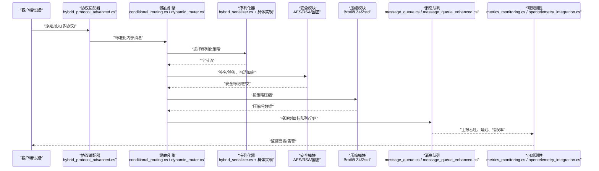

**图表来源** 
- [hybrid_protocol_advanced.cs](file://hybrid_protocol_advanced.cs)
- [conditional_routing.cs](file://conditional_routing.cs)
- [dynamic_router.cs](file://dynamic_router.cs)
- [hybrid_serializer.cs](file://hybrid_serializer.cs)
- [inproc_json_serializer.cs](file://inproc_json_serializer.cs)
- [inproc_messagepack_serializer.cs](file://inproc_messagepack_serializer.cs)
- [shared_memory_serializer.cs](file://shared_memory_serializer.cs)
- [zero_copy_serializer.cs](file://zero_copy_serializer.cs)
- [aes_gcm_encryption_integration.cs](file://aes_gcm_encryption_integration.cs)
- [rsa_encryption_integration.cs](file://rsa_encryption_integration.cs)
- [sm_crypto_integration.cs](file://sm_crypto_integration.cs)
- [brotli_compression_integration.cs](file://brotli_compression_integration.cs)
- [lz4_integration.cs](file://lz4_integration.cs)
- [zstd_compression_integration.cs](file://zstd_compression_integration.cs)
- [message_queue.cs](file://message_queue.cs)
- [message_queue_enhanced.cs](file://message_queue_enhanced.cs)
- [metrics_monitoring.cs](file://metrics_monitoring.cs)
- [opentelemetry_integration.cs](file://opentelemetry_integration.cs)

## 详细组件分析

### 条件路由
- 功能要点
  - 基于消息字段、头部或内容表达式进行匹配。
  - 支持优先级与短路规则，避免不必要的计算。
  - 可与过滤器组合，实现先过滤再路由。
- 典型流程
  - 解析消息元数据 → 评估规则集 → 命中则选择目标 → 未命中走默认分支或进入死信。
- 适用场景
  - 按设备类型、业务域、租户维度分流。
  - 按消息大小、时间窗口、阈值进行差异化处理。

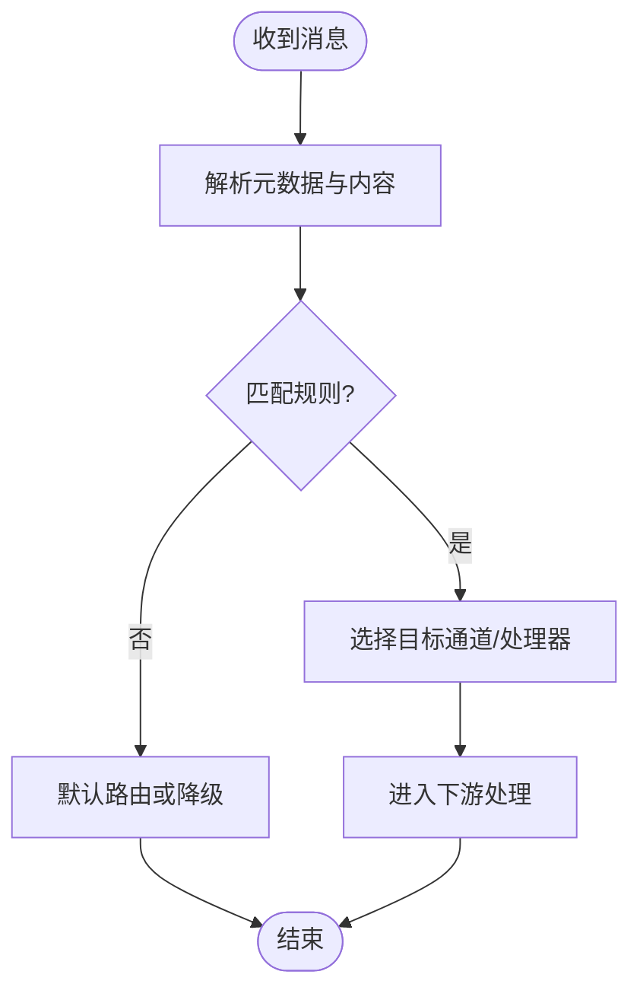

**图表来源** 
- [conditional_routing.cs](file://conditional_routing.cs)

**章节来源**
- [conditional_routing.cs](file://conditional_routing.cs)

### 动态路由
- 功能要点
  - 运行时根据上下文（租户、地域、负载、健康度）决定目标。
  - 支持权重、灰度、回滚与热更新。
  - 可与服务发现/配置中心联动，实现无侵入扩缩容。
- 典型流程
  - 收集上下文 → 查询路由表/策略 → 计算目标 → 记录决策日志 → 投递。
- 适用场景
  - 多活数据中心、A/B 流量切分、热点隔离。

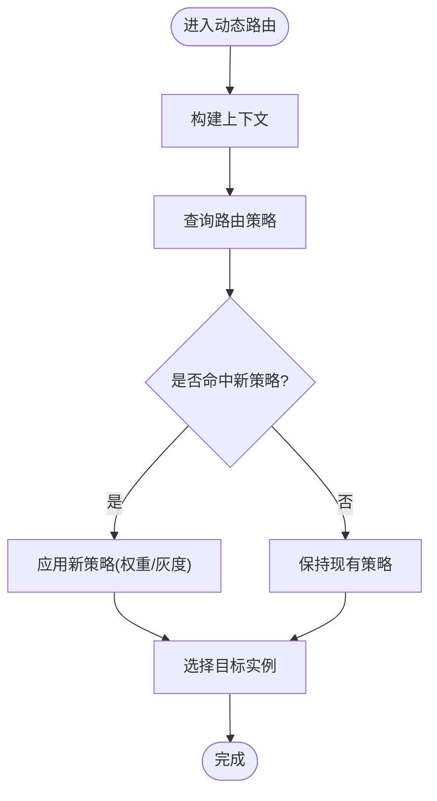

**图表来源** 
- [dynamic_router.cs](file://dynamic_router.cs)

**章节来源**
- [dynamic_router.cs](file://dynamic_router.cs)

### 协议适配与消息格式转换
- 协议适配
  - 统一 HTTP/MQTT/gRPC/自定义协议为内部消息模型。
  - 支持版本协商、字段映射与兼容层。
- 格式转换
  - 字段级映射、类型转换、缺失字段默认值。
  - 批量转换与流式转换，降低内存峰值。

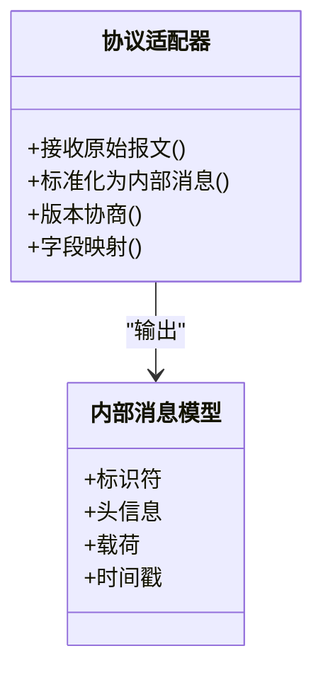

**图表来源** 
- [hybrid_protocol_advanced.cs](file://hybrid_protocol_advanced.cs)

**章节来源**
- [hybrid_protocol_advanced.cs](file://hybrid_protocol_advanced.cs)

### 序列化与数据交换优化
- 序列化器选择
  - JSON：通用、可读性强，适合跨语言与调试。
  - MessagePack：高性能二进制，适合高吞吐场景。
  - 共享内存：进程内零拷贝路径，极致低延迟。
  - 零拷贝序列化：减少中间对象创建，降低 GC 压力。
- 策略切换
  - 按消息类型、大小、目标消费者能力动态选择。
  - 缓存序列化器实例，避免重复初始化开销。

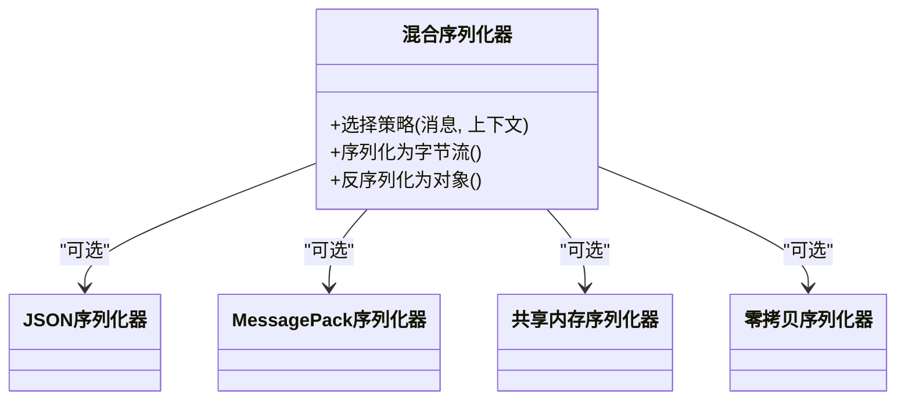

**图表来源** 
- [hybrid_serializer.cs](file://hybrid_serializer.cs)
- [inproc_json_serializer.cs](file://inproc_json_serializer.cs)
- [inproc_messagepack_serializer.cs](file://inproc_messagepack_serializer.cs)
- [shared_memory_serializer.cs](file://shared_memory_serializer.cs)
- [zero_copy_serializer.cs](file://zero_copy_serializer.cs)

**章节来源**
- [hybrid_serializer.cs](file://hybrid_serializer.cs)
- [inproc_json_serializer.cs](file://inproc_json_serializer.cs)
- [inproc_messagepack_serializer.cs](file://inproc_messagepack_serializer.cs)
- [shared_memory_serializer.cs](file://shared_memory_serializer.cs)
- [zero_copy_serializer.cs](file://zero_copy_serializer.cs)

### 压缩传输
- 压缩算法
  - Brotli：高压缩比，适合文本与 JSON。
  - LZ4：极速解压，适合实时流。
  - Zstd：平衡压缩比与速度。
- 策略建议
  - 小消息禁用压缩，避免 CPU 浪费。
  - 大消息或带宽受限链路优先启用。
  - 对 CPU 敏感场景选择 LZ4/Zstd。

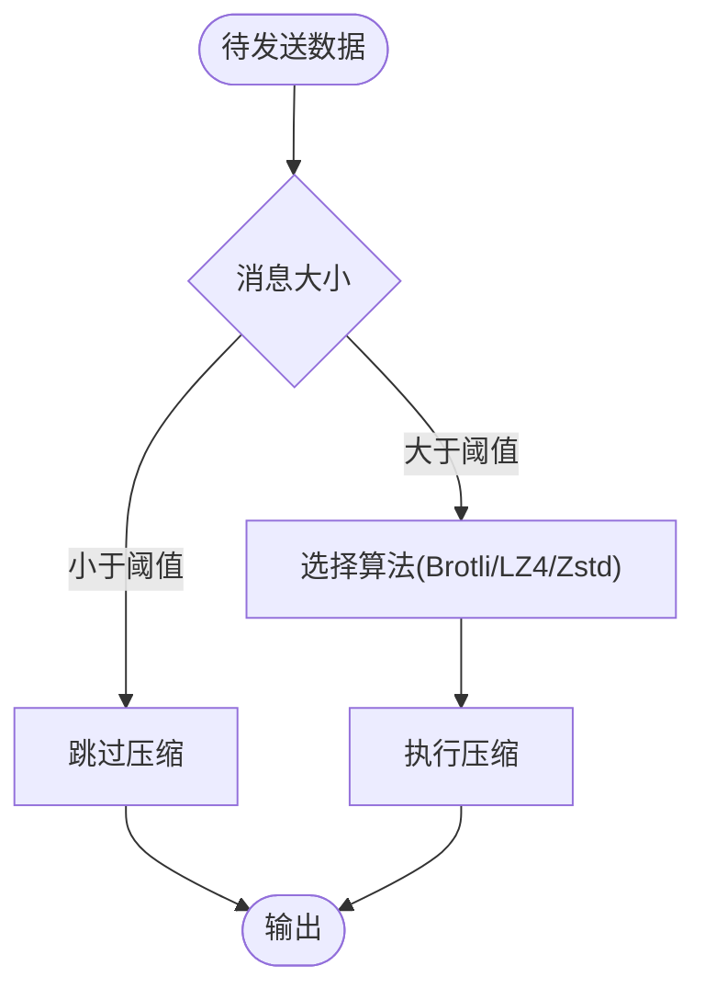

**图表来源** 
- [brotli_compression_integration.cs](file://brotli_compression_integration.cs)
- [lz4_integration.cs](file://lz4_integration.cs)
- [zstd_compression_integration.cs](file://zstd_compression_integration.cs)

**章节来源**
- [brotli_compression_integration.cs](file://brotli_compression_integration.cs)
- [lz4_integration.cs](file://lz4_integration.cs)
- [zstd_compression_integration.cs](file://zstd_compression_integration.cs)

### 加密处理与安全验证
- 对称加密
  - AES-GCM：高效且带完整性校验，适合大数据量。
- 非对称加密
  - RSA：用于密钥交换或小数据加密。
- 国密算法
  - 满足合规要求，适用于国内监管场景。
- 安全验证
  - 数字签名、时间戳、重放防护、白名单校验。

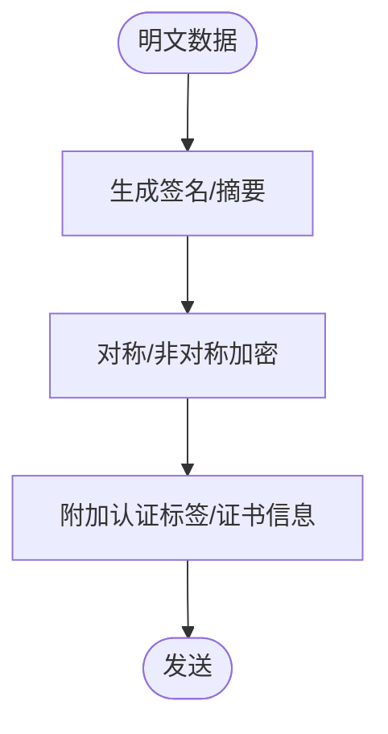

**图表来源** 
- [aes_gcm_encryption_integration.cs](file://aes_gcm_encryption_integration.cs)
- [rsa_encryption_integration.cs](file://rsa_encryption_integration.cs)
- [sm_crypto_integration.cs](file://sm_crypto_integration.cs)

**章节来源**
- [aes_gcm_encryption_integration.cs](file://aes_gcm_encryption_integration.cs)
- [rsa_encryption_integration.cs](file://rsa_encryption_integration.cs)
- [sm_crypto_integration.cs](file://sm_crypto_integration.cs)

### 消息队列与可靠性
- 基础队列
  - 入队/出队、持久化、重试与退避。
- 增强队列
  - 分片、负载均衡、背压控制、幂等投递。
- 死信队列
  - 失败消息归档、二次消费、告警与人工干预。

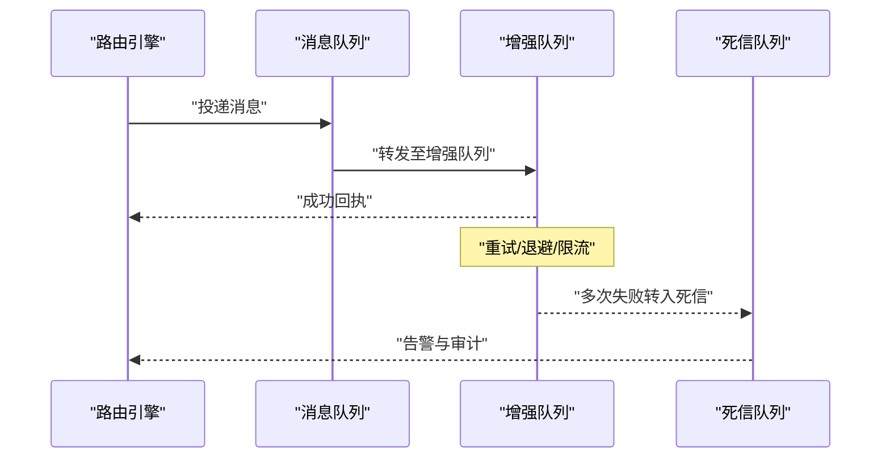

**图表来源** 
- [message_queue.cs](file://message_queue.cs)
- [message_queue_enhanced.cs](file://message_queue_enhanced.cs)
- [dead_letter.cs](file://dead_letter.cs)

**章节来源**
- [message_queue.cs](file://message_queue.cs)
- [message_queue_enhanced.cs](file://message_queue_enhanced.cs)
- [dead_letter.cs](file://dead_letter.cs)

### 高级功能：过滤、分片与聚合
- 过滤
  - 基于字段、正则、黑名单/白名单快速丢弃无效消息。
- 分片
  - 按键哈希或范围分片，保证顺序性与并行度。
- 聚合
  - 时间窗口聚合、去重、统计指标汇总。

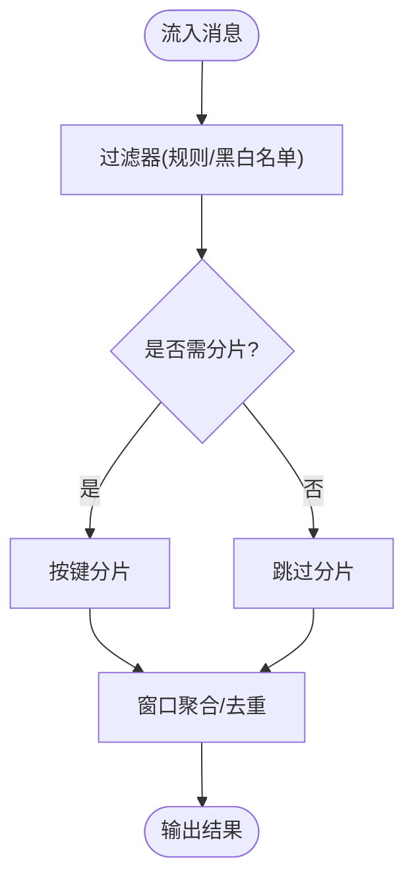

[此图为概念流程图，不直接映射具体源码文件]

### 路由规则设计原则
- 明确性与可测试性：规则应简洁、可单元测试覆盖。
- 可扩展性：新增规则无需修改核心逻辑，采用插件化注册。
- 优先级与短路：高频规则前置，减少评估成本。
- 可观测性：记录命中路径、耗时与错误码。
- 灰度与回滚：支持逐步放量与快速回滚。

[本节为通用设计指导，不直接分析具体文件]

### 性能优化策略
- 序列化
  - 优先使用 MessagePack/零拷贝；复用序列化器实例；避免频繁装箱拆箱。
- 压缩
  - 小消息禁用压缩；大消息选择合适算法；预热压缩器。
- 路由
  - 预编译规则表达式；缓存路由决策；减少锁竞争。
- 队列
  - 合理设置批大小与并发；背压与限流；幂等与去重。
- 资源
  - 线程池隔离；内存池与对象池；GC 友好数据结构。

[本节为通用优化建议，不直接分析具体文件]

### 调试与监控方法
- 指标采集
  - 吞吐、延迟、错误率、队列长度、压缩比、CPU/内存占用。
- 分布式追踪
  - 全链路 TraceID，跨组件传播，采样策略调优。
- 日志与审计
  - 结构化日志，脱敏敏感字段；关键操作审计留痕。
- 可视化与告警
  - 仪表盘、阈值告警、根因分析。

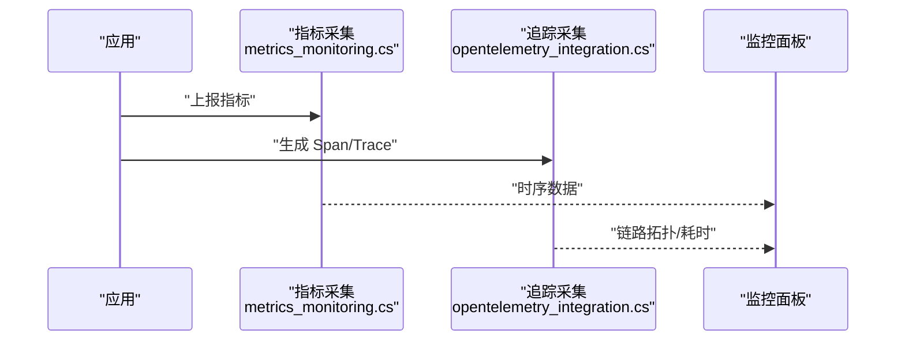

**图表来源** 
- [metrics_monitoring.cs](file://metrics_monitoring.cs)
- [opentelemetry_integration.cs](file://opentelemetry_integration.cs)

**章节来源**
- [metrics_monitoring.cs](file://metrics_monitoring.cs)
- [opentelemetry_integration.cs](file://opentelemetry_integration.cs)

## 依赖关系分析
- 路由层依赖协议适配与序列化器，确保消息正确转换与高效编码。
- 安全与压缩作为横切关注点，贯穿入站与出站路径。
- 队列与增强队列提供可靠投递与扩展能力，死信队列兜底异常。
- 可观测性贯穿全流程，支撑运维与排障。

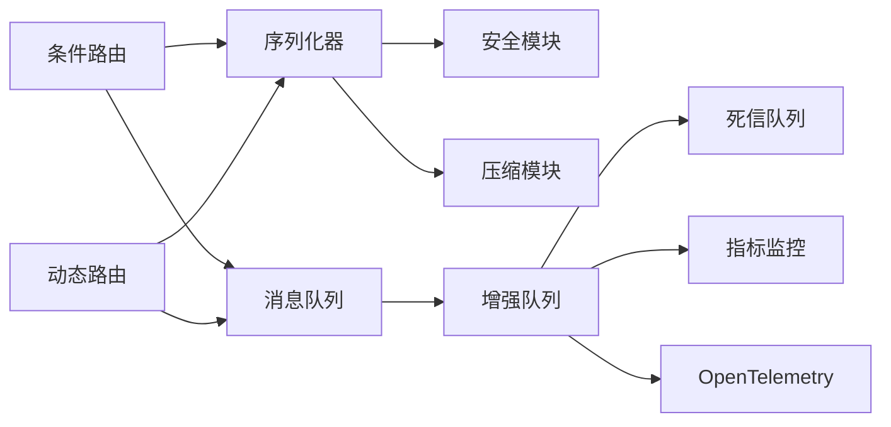

**图表来源** 
- [conditional_routing.cs](file://conditional_routing.cs)
- [dynamic_router.cs](file://dynamic_router.cs)
- [hybrid_serializer.cs](file://hybrid_serializer.cs)
- [aes_gcm_encryption_integration.cs](file://aes_gcm_encryption_integration.cs)
- [brotli_compression_integration.cs](file://brotli_compression_integration.cs)
- [message_queue.cs](file://message_queue.cs)
- [message_queue_enhanced.cs](file://message_queue_enhanced.cs)
- [dead_letter.cs](file://dead_letter.cs)
- [metrics_monitoring.cs](file://metrics_monitoring.cs)
- [opentelemetry_integration.cs](file://opentelemetry_integration.cs)

**章节来源**
- [conditional_routing.cs](file://conditional_routing.cs)
- [dynamic_router.cs](file://dynamic_router.cs)
- [hybrid_serializer.cs](file://hybrid_serializer.cs)
- [aes_gcm_encryption_integration.cs](file://aes_gcm_encryption_integration.cs)
- [brotli_compression_integration.cs](file://brotli_compression_integration.cs)
- [message_queue.cs](file://message_queue.cs)
- [message_queue_enhanced.cs](file://message_queue_enhanced.cs)
- [dead_letter.cs](file://dead_letter.cs)
- [metrics_monitoring.cs](file://metrics_monitoring.cs)
- [opentelemetry_integration.cs](file://opentelemetry_integration.cs)

## 性能考量
- 序列化与反序列化是热点路径，应优先选择高性能序列化器并复用实例。
- 压缩应在带宽瓶颈或大消息场景启用，避免 CPU 成为瓶颈。
- 路由规则应预编译与缓存，减少运行时计算。
- 队列批处理与并发度需根据硬件与下游处理能力调优。
- 监控与采样策略要平衡精度与开销。

[本节为通用性能指导，不直接分析具体文件]

## 故障排查指南
- 常见问题
  - 路由未命中：检查规则优先级与表达式语法。
  - 序列化失败：确认目标消费者支持的格式与版本。
  - 压缩膨胀：调整阈值与算法。
  - 加密失败：核对密钥、证书与算法一致性。
  - 队列堆积：检查消费者速率与死信比例。
- 定位手段
  - 开启结构化日志与 TraceID 追踪。
  - 查看指标与告警，定位瓶颈环节。
  - 回放死信消息，复现问题。

**章节来源**
- [dead_letter.cs](file://dead_letter.cs)
- [metrics_monitoring.cs](file://metrics_monitoring.cs)
- [opentelemetry_integration.cs](file://opentelemetry_integration.cs)

## 结论
通过条件路由与动态路由的组合，配合灵活的协议适配、高效的序列化与压缩、完善的安全机制与可靠的队列体系，可实现高吞吐、低延迟、强一致的消息路由与转换。借助完善的可观测性与故障排查手段，可在复杂场景中稳定运行并持续优化。

[本节为总结性内容，不直接分析具体文件]

## 附录
- 配置建议
  - 路由规则集中管理，版本化与灰度发布。
  - 序列化与压缩策略按环境区分配置。
  - 安全密钥轮换与最小权限原则。
- 最佳实践
  - 幂等设计与去重键。
  - 超时与熔断保护。
  - 容量规划与弹性伸缩。

[本节为补充性内容，不直接分析具体文件]