# 消息队列与事件驱动

<cite>
**本文引用的文件**   
- [masstransit_integration.cs](file://masstransit_integration.cs)
- [masstransit_inmemory_integration.cs](file://masstransit_inmemory_integration.cs)
- [masstransit_litedb_integration.cs](file://masstransit_litedb_integration.cs)
- [masstransit_mqttnet_integration.cs](file://masstransit_mqttnet_integration.cs)
- [masstransit_production_integration.cs](file://masstransit_production_integration.cs)
- [rabbitmq_production_integration.cs](file://rabbitmq_production_integration.cs)
- [mediatr_kafka_integration.cs](file://mediatr_kafka_integration.cs)
- [librdkafka_integration.cs](file://librdkafka_integration.cs)
- [message_queue.cs](file://message_queue.cs)
- [message_queue_enhanced.cs](file://message_queue_enhanced.cs)
- [dead_letter.cs](file://dead_letter.cs)
- [event_sourcing_processor.cs](file://event_sourcing_processor.cs)
- [litedb_event_store.cs](file://litedb_event_store.cs)
- [litedb_eventbus.cs](file://litedb_eventbus.cs)
- [litedb_eventhandlers.cs](file://litedb_eventhandlers.cs)
- [sqlite_event_store.cs](file://sqlite_event_store.cs)
- [redis_stream_integration.cs](file://redis_stream_integration.cs)
- [distributed_bus.cs](file://distributed_bus.cs)
- [wolverine_event_bus.cs](file://wolverine_event_bus.cs)
- [wolverinefx_kafka_integration.cs](file://wolverinefx_kafka_integration.cs)
- [cqrs_impl.cs](file://cqrs_impl.cs)
- [cqrs_processor.cs](file://cqrs_processor.cs)
- [saga_orchestrator.cs](file://saga_orchestrator.cs)
- [high_frequency_1m.cs](file://high_frequency_1m.cs)
- [performance_metrics.cs](file://performance_metrics.cs)
</cite>

## 目录
1. [简介](#简介)
2. [项目结构](#项目结构)
3. [核心组件](#核心组件)
4. [架构总览](#架构总览)
5. [详细组件分析](#详细组件分析)
6. [依赖关系分析](#依赖关系分析)
7. [性能考量](#性能考量)
8. [故障排查指南](#故障排查指南)
9. [结论](#结论)
10. [附录](#附录)

## 简介
本文件面向消息队列与事件驱动架构的落地实践，围绕 MassTransit、RabbitMQ、Kafka 等中间件的集成与使用，系统阐述异步处理模式、事件总线实现、消息持久化与死信队列处理；并解释事件溯源、命令查询分离（CQRS）的实现模式。同时覆盖消息路由、转换、过滤与重试机制，以及高吞吐场景下的性能优化与故障恢复策略。文档以仓库中的示例代码为依据，提供可追溯的文件来源与图示说明，帮助读者快速理解与实践。

## 项目结构
仓库采用“按主题/能力”组织的大量独立示例文件，便于按需查阅与复用。与消息队列和事件驱动相关的核心文件包括：
- 中间件集成：MassTransit、RabbitMQ、Kafka、Redis Stream、LiteDB/SQLite 事件存储
- 事件总线与分布式总线：内置总线、Wolverine 事件总线
- CQRS 与事件溯源：处理器、事件存储、事件处理器
- 可靠性与容错：死信队列、SAGA 编排、重试与幂等
- 性能与监控：高吞吐基准、指标采集

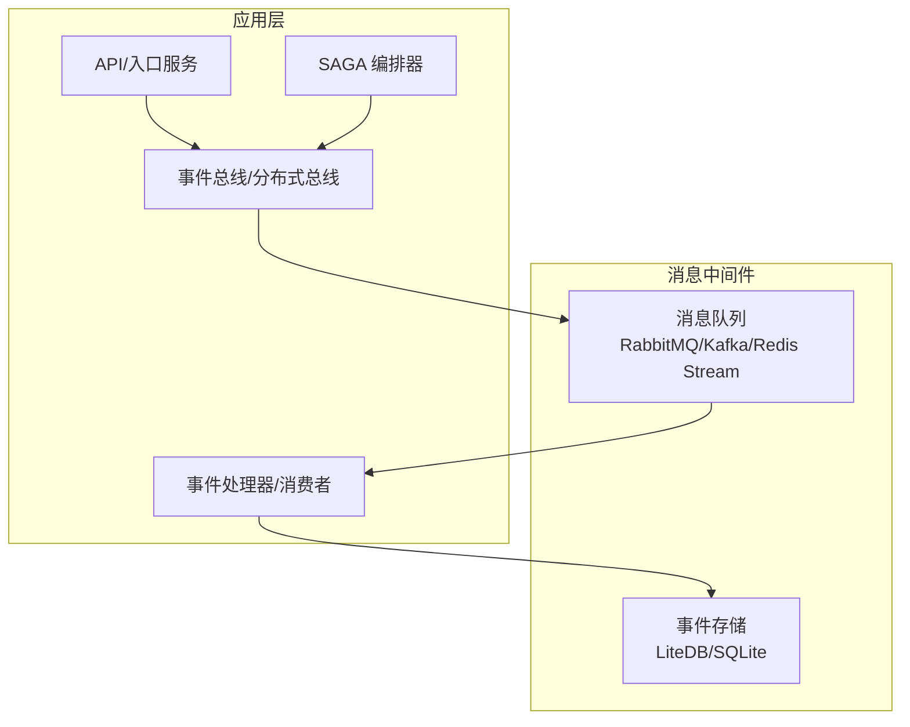

[本图为概念性结构图，不直接映射具体源码文件]

## 核心组件
- 事件总线与分布式总线
  - 基于 MassTransit 的事件总线封装与生产环境配置
  - 基于 Wolverine 的事件总线与 Kafka 集成
  - 轻量级分布式总线抽象
- 消息中间件集成
  - RabbitMQ 生产环境集成
  - Kafka 集成（MediatR + librdkafka）
  - Redis Stream 集成
  - LiteDB/SQLite 作为事件存储
- 可靠性与容错
  - 死信队列处理
  - SAGA 编排器
  - 重试与幂等控制
- CQRS 与事件溯源
  - 命令/查询处理器
  - 事件流存储与回放
  - 事件处理器与投影更新

**章节来源**
- [distributed_bus.cs](file://distributed_bus.cs)
- [wolverine_event_bus.cs](file://wolverine_event_bus.cs)
- [rabbitmq_production_integration.cs](file://rabbitmq_production_integration.cs)
- [mediatr_kafka_integration.cs](file://mediatr_kafka_integration.cs)
- [librdkafka_integration.cs](file://librdkafka_integration.cs)
- [redis_stream_integration.cs](file://redis_stream_integration.cs)
- [litedb_event_store.cs](file://litedb_event_store.cs)
- [sqlite_event_store.cs](file://sqlite_event_store.cs)
- [dead_letter.cs](file://dead_letter.cs)
- [saga_orchestrator.cs](file://saga_orchestrator.cs)
- [cqrs_impl.cs](file://cqrs_impl.cs)
- [cqrs_processor.cs](file://cqrs_processor.cs)
- [event_sourcing_processor.cs](file://event_sourcing_processor.cs)

## 架构总览
下图展示典型的消息驱动架构：生产者通过事件总线发布消息，中间件负责持久化与路由，消费者订阅并处理事件，必要时将状态变更写入事件存储或下游系统。SAGA 编排器协调跨服务的长事务流程，死信队列兜底失败消息。

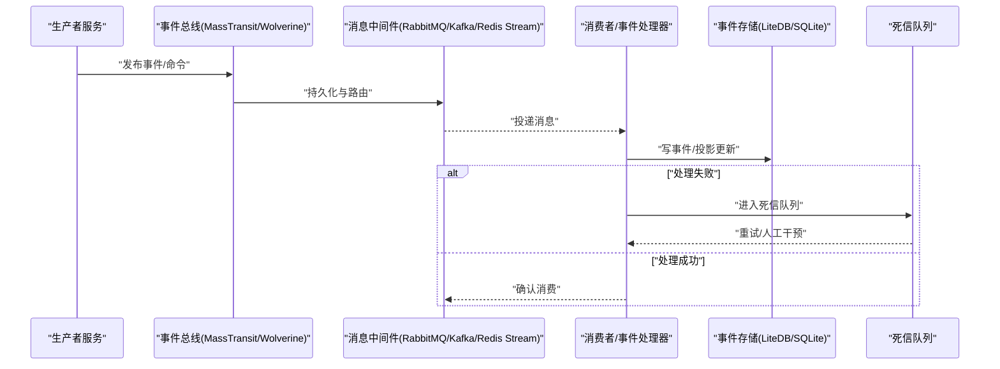

**图表来源**
- [masstransit_production_integration.cs](file://masstransit_production_integration.cs)
- [rabbitmq_production_integration.cs](file://rabbitmq_production_integration.cs)
- [mediatr_kafka_integration.cs](file://mediatr_kafka_integration.cs)
- [redis_stream_integration.cs](file://redis_stream_integration.cs)
- [litedb_event_store.cs](file://litedb_event_store.cs)
- [sqlite_event_store.cs](file://sqlite_event_store.cs)
- [dead_letter.cs](file://dead_letter.cs)

## 详细组件分析

### MassTransit 事件总线与中间件集成
- 功能要点
  - 在内存、LiteDB、MQTTNet 等不同后端上的集成示例
  - 生产环境配置（连接池、重试、超时、并发、限流）
  - 事件路由、消息转换与过滤
- 关键流程
  - 注册总线与端点
  - 定义事件与处理器
  - 配置重试与死信队列
  - 发布/订阅生命周期管理

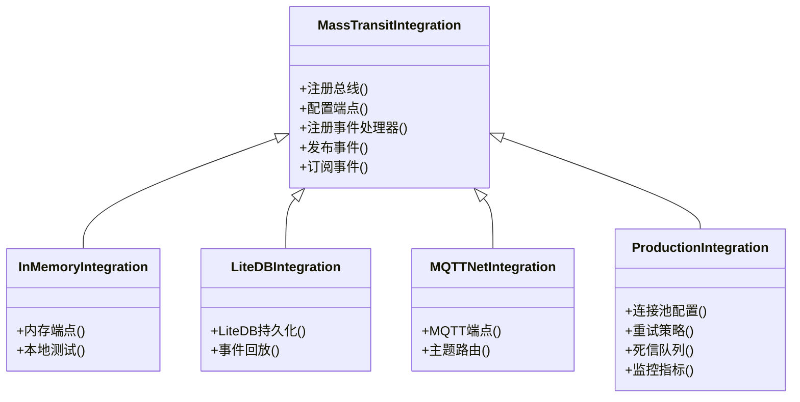

**图表来源**
- [masstransit_inmemory_integration.cs](file://masstransit_inmemory_integration.cs)
- [masstransit_litedb_integration.cs](file://masstransit_litedb_integration.cs)
- [masstransit_mqttnet_integration.cs](file://masstransit_mqttnet_integration.cs)
- [masstransit_production_integration.cs](file://masstransit_production_integration.cs)

**章节来源**
- [masstransit_integration.cs](file://masstransit_integration.cs)
- [masstransit_inmemory_integration.cs](file://masstransit_inmemory_integration.cs)
- [masstransit_litedb_integration.cs](file://masstransit_litedb_integration.cs)
- [masstransit_mqttnet_integration.cs](file://masstransit_mqttnet_integration.cs)
- [masstransit_production_integration.cs](file://masstransit_production_integration.cs)

### RabbitMQ 生产环境集成
- 功能要点
  - 连接与通道管理、交换器与队列声明
  - 消息持久化、ACK/NACK 与重试
  - 死信队列与延迟队列
  - 监控与告警
- 关键流程
  - 初始化连接工厂与交换机
  - 声明队列与绑定规则
  - 发布消息与消费者回调
  - 错误处理与降级

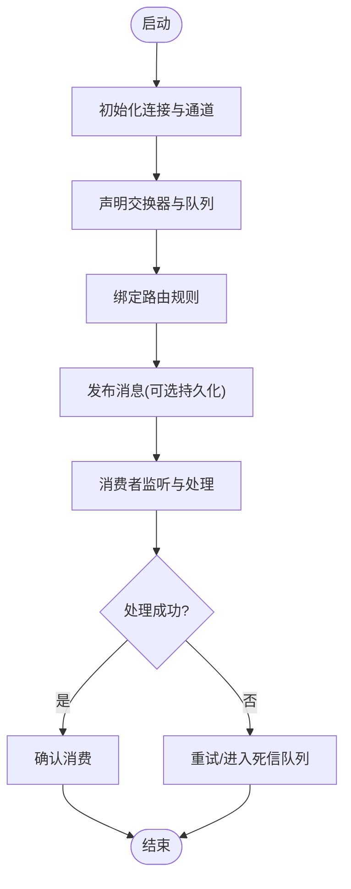

**图表来源**
- [rabbitmq_production_integration.cs](file://rabbitmq_production_integration.cs)

**章节来源**
- [rabbitmq_production_integration.cs](file://rabbitmq_production_integration.cs)

### Kafka 集成（MediatR + librdkafka）
- 功能要点
  - MediatR 管道与 Kafka 传输桥接
  - 分区键与顺序保证
  - 批量发送与背压控制
  - 消费者组与偏移量管理
- 关键流程
  - 配置 Kafka 客户端与序列化器
  - 定义事件与处理器
  - 发布到主题与订阅消费
  - 错误处理与重试

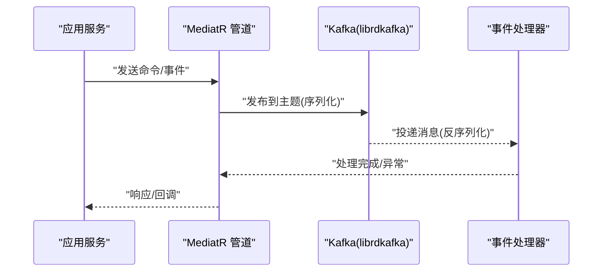

**图表来源**
- [mediatr_kafka_integration.cs](file://mediatr_kafka_integration.cs)
- [librdkafka_integration.cs](file://librdkafka_integration.cs)

**章节来源**
- [mediatr_kafka_integration.cs](file://mediatr_kafka_integration.cs)
- [librdkafka_integration.cs](file://librdkafka_integration.cs)

### 事件总线与分布式总线
- 功能要点
  - 统一事件总线抽象，屏蔽底层中间件差异
  - 支持内存、RabbitMQ、Kafka、Redis Stream 等多种后端
  - 提供消息路由、转换、过滤与重试
- 关键流程
  - 注册总线与处理器
  - 发布事件与订阅处理
  - 错误处理与死信队列

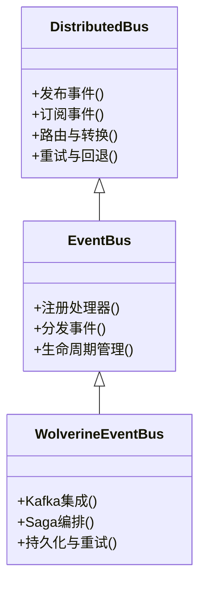

**图表来源**
- [distributed_bus.cs](file://distributed_bus.cs)
- [wolverine_event_bus.cs](file://wolverine_event_bus.cs)

**章节来源**
- [distributed_bus.cs](file://distributed_bus.cs)
- [wolverine_event_bus.cs](file://wolverine_event_bus.cs)

### 消息队列基础与增强
- 功能要点
  - 基础队列操作：入队、出队、持久化、ACK
  - 增强特性：批处理、压缩、序列化、监控
- 关键流程
  - 初始化队列与连接
  - 发送与接收消息
  - 错误处理与重试

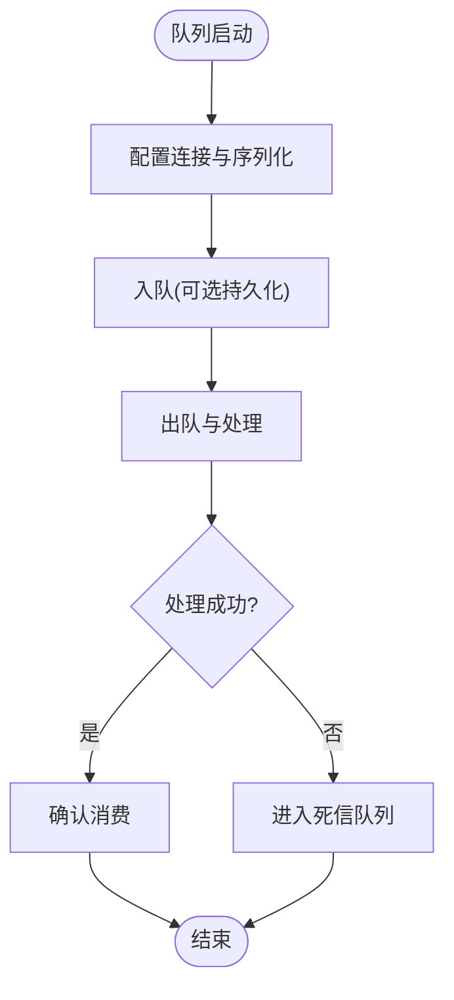

**图表来源**
- [message_queue.cs](file://message_queue.cs)
- [message_queue_enhanced.cs](file://message_queue_enhanced.cs)

**章节来源**
- [message_queue.cs](file://message_queue.cs)
- [message_queue_enhanced.cs](file://message_queue_enhanced.cs)

### 死信队列处理
- 功能要点
  - 失败消息自动转入死信队列
  - 死信消息的重试策略与人工干预
  - 监控与告警
- 关键流程
  - 配置死信队列与路由
  - 消费者异常捕获与转发
  - 死信消费与修复

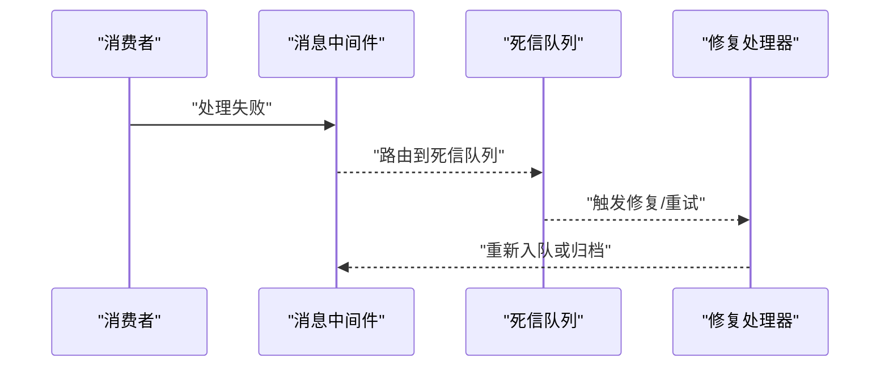

**图表来源**
- [dead_letter.cs](file://dead_letter.cs)

**章节来源**
- [dead_letter.cs](file://dead_letter.cs)

### 事件溯源与事件存储
- 功能要点
  - 事件追加式存储与版本控制
  - 事件回放与投影重建
  - 读写分离与一致性模型
- 关键流程
  - 记录事件到事件存储
  - 订阅事件并更新投影
  - 回放事件以重建状态

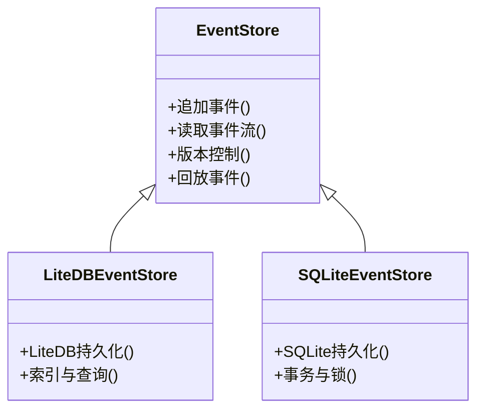

**图表来源**
- [litedb_event_store.cs](file://litedb_event_store.cs)
- [sqlite_event_store.cs](file://sqlite_event_store.cs)

**章节来源**
- [event_sourcing_processor.cs](file://event_sourcing_processor.cs)
- [litedb_event_store.cs](file://litedb_event_store.cs)
- [sqlite_event_store.cs](file://sqlite_event_store.cs)

### CQRS 与处理器
- 功能要点
  - 命令处理器与查询处理器分离
  - 事件处理器与投影更新
  - 读写模型优化与缓存
- 关键流程
  - 接收命令并执行领域逻辑
  - 发布领域事件
  - 查询处理器读取投影数据

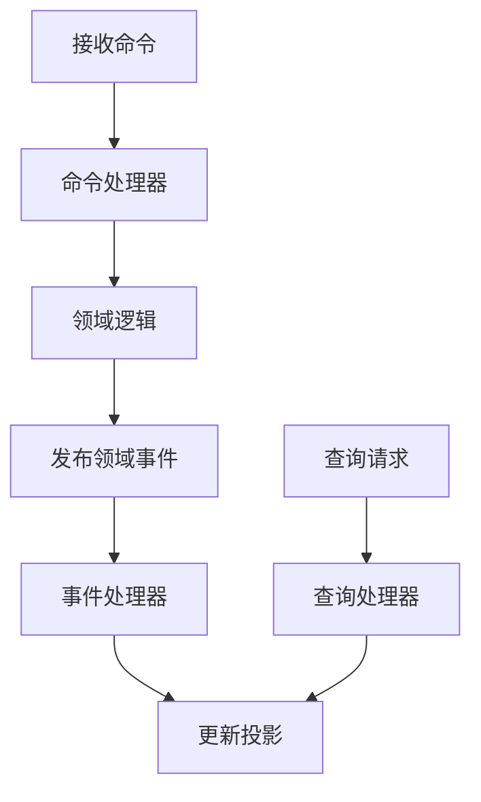

**图表来源**
- [cqrs_impl.cs](file://cqrs_impl.cs)
- [cqrs_processor.cs](file://cqrs_processor.cs)
- [litedb_eventhandlers.cs](file://litedb_eventhandlers.cs)

**章节来源**
- [cqrs_impl.cs](file://cqrs_impl.cs)
- [cqrs_processor.cs](file://cqrs_processor.cs)
- [litedb_eventhandlers.cs](file://litedb_eventhandlers.cs)

### SAGA 编排器
- 功能要点
  - 长事务编排与补偿
  - 状态机与事件驱动
  - 重试与回滚
- 关键流程
  - 定义步骤与补偿动作
  - 根据事件推进状态
  - 失败时执行补偿

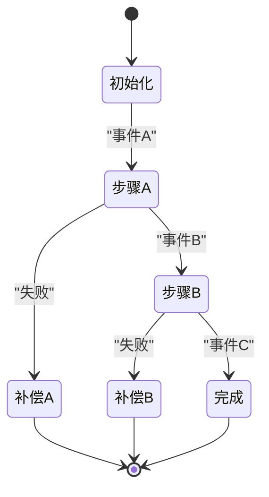

**图表来源**
- [saga_orchestrator.cs](file://saga_orchestrator.cs)

**章节来源**
- [saga_orchestrator.cs](file://saga_orchestrator.cs)

## 依赖关系分析
- 组件耦合
  - 事件总线与中间件解耦，通过适配器或配置切换后端
  - 事件存储与业务逻辑分离，支持多种持久化
- 外部依赖
  - RabbitMQ、Kafka、Redis Stream 等中间件
  - LiteDB、SQLite 等嵌入式数据库
- 潜在循环依赖
  - 避免处理器之间直接调用，通过事件通信

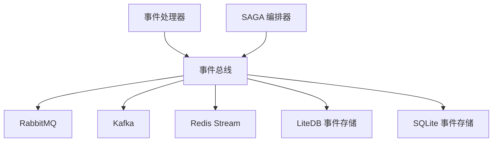

**图表来源**
- [distributed_bus.cs](file://distributed_bus.cs)
- [rabbitmq_production_integration.cs](file://rabbitmq_production_integration.cs)
- [mediatr_kafka_integration.cs](file://mediatr_kafka_integration.cs)
- [redis_stream_integration.cs](file://redis_stream_integration.cs)
- [litedb_event_store.cs](file://litedb_event_store.cs)
- [sqlite_event_store.cs](file://sqlite_event_store.cs)

**章节来源**
- [distributed_bus.cs](file://distributed_bus.cs)
- [rabbitmq_production_integration.cs](file://rabbitmq_production_integration.cs)
- [mediatr_kafka_integration.cs](file://mediatr_kafka_integration.cs)
- [redis_stream_integration.cs](file://redis_stream_integration.cs)
- [litedb_event_store.cs](file://litedb_event_store.cs)
- [sqlite_event_store.cs](file://sqlite_event_store.cs)

## 性能考量
- 高吞吐优化
  - 批量发送与消费
  - 连接池与线程池调优
  - 序列化与压缩策略
- 监控与指标
  - 采集延迟、吞吐、错误率
  - 告警与容量规划
- 基准测试
  - 高频率消息处理基准

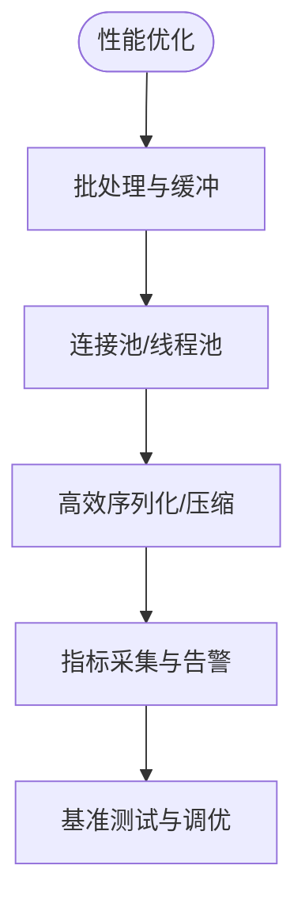

**图表来源**
- [high_frequency_1m.cs](file://high_frequency_1m.cs)
- [performance_metrics.cs](file://performance_metrics.cs)

**章节来源**
- [high_frequency_1m.cs](file://high_frequency_1m.cs)
- [performance_metrics.cs](file://performance_metrics.cs)

## 故障排查指南
- 常见问题
  - 连接失败与重连策略
  - 消息堆积与消费者滞后
  - 死信队列积压与修复
- 调试方法
  - 启用详细日志与追踪
  - 检查中间件健康状态
  - 回放事件定位问题

**章节来源**
- [dead_letter.cs](file://dead_letter.cs)
- [performance_metrics.cs](file://performance_metrics.cs)

## 结论
本仓库提供了丰富的消息队列与事件驱动架构实践示例，涵盖主流中间件集成、可靠性保障、CQRS 与事件溯源、以及高吞吐优化。通过模块化设计与清晰的职责划分，读者可以快速构建可扩展、可维护的事件驱动系统。建议在生产环境中结合监控与告警，持续优化性能与稳定性。

## 附录
- 术语表
  - 事件总线：用于服务间异步通信的中介
  - 死信队列：存放处理失败的消息
  - 事件溯源：以事件序列表示状态变更
  - CQRS：命令与查询职责分离
- 参考文件
  - 中间件集成：RabbitMQ、Kafka、Redis Stream
  - 事件存储：LiteDB、SQLite
  - 可靠性：死信队列、SAGA、重试
  - 性能：基准测试、指标采集

[本节为概念性内容，不直接分析具体文件]