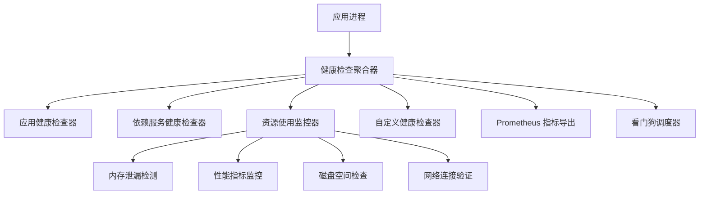
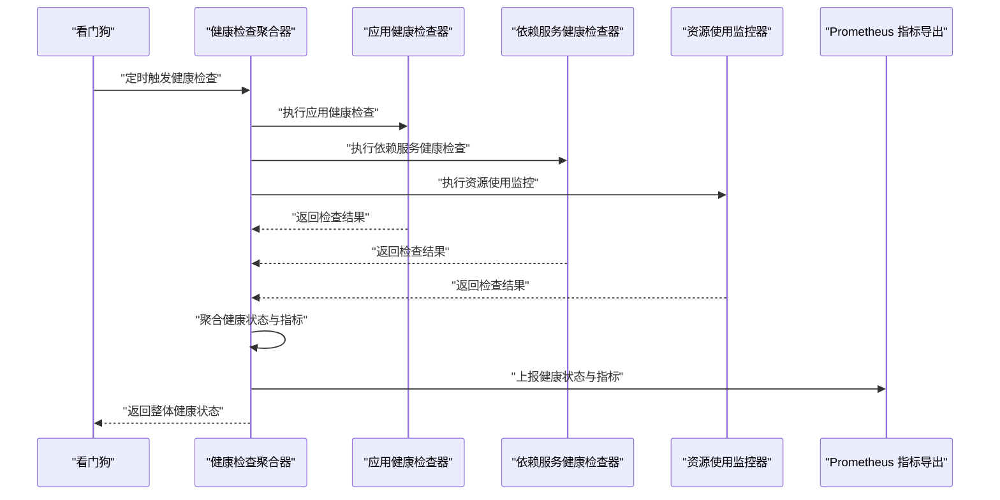
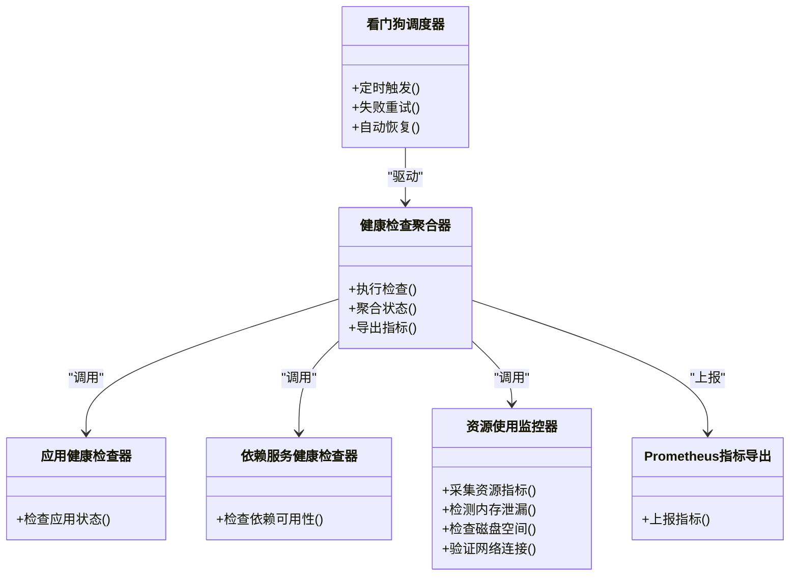

# 健康检查

<cite>
**本文引用的文件**   
- [memory_leak_detection.cs](file://memory_leak_detection.cs)
- [metrics_monitoring.cs](file://metrics_monitoring.cs)
- [prometheus_metrics.cs](file://prometheus_metrics.cs)
- [performance_metrics.cs](file://performance_metrics.cs)
- [watchdog_integration.cs](file://watchdog_integration.cs)
- [appsettings.json](file://appsettings.json)
</cite>

## 目录
1. [简介](#简介)
2. [项目结构](#项目结构)
3. [核心组件](#核心组件)
4. [架构总览](#架构总览)
5. [详细组件分析](#详细组件分析)
6. [依赖关系分析](#依赖关系分析)
7. [性能考量](#性能考量)
8. [故障排查指南](#故障排查指南)
9. [结论](#结论)
10. [附录](#附录)

## 简介
本文件面向“健康检查系统”的设计与实现，覆盖应用健康状态检测、依赖服务健康检查、资源使用监控与自定义健康检查器。文档重点包括：
- 健康端点配置与聚合策略
- 检查间隔与失败重试机制
- 内存泄漏检测、性能指标监控、磁盘空间检查与网络连接验证
- 健康检查策略、降级处理与自动恢复机制

该仓库包含多个与健康检查和可观测性相关的示例与集成代码，本文基于这些文件进行系统化梳理与说明。

## 项目结构
健康检查相关能力分布在以下文件中：
- 内存泄漏检测：memory_leak_detection.cs
- 指标监控与采集：metrics_monitoring.cs、prometheus_metrics.cs、performance_metrics.cs
- 看门狗/守护进程式健康巡检：watchdog_integration.cs
- 配置入口：appsettings.json

图表来源
- [memory_leak_detection.cs](file://memory_leak_detection.cs)
- [metrics_monitoring.cs](file://metrics_monitoring.cs)
- [prometheus_metrics.cs](file://prometheus_metrics.cs)
- [performance_metrics.cs](file://performance_metrics.cs)
- [watchdog_integration.cs](file://watchdog_integration.cs)

章节来源
- [memory_leak_detection.cs](file://memory_leak_detection.cs)
- [metrics_monitoring.cs](file://metrics_monitoring.cs)
- [prometheus_metrics.cs](file://prometheus_metrics.cs)
- [performance_metrics.cs](file://performance_metrics.cs)
- [watchdog_integration.cs](file://watchdog_integration.cs)
- [appsettings.json](file://appsettings.json)

## 核心组件
- 健康检查聚合器：统一编排各类健康检查项，输出整体健康状态与明细。
- 应用健康检查器：校验应用自身关键运行条件（如启动完成、关键配置就绪）。
- 依赖服务健康检查器：探测数据库、缓存、消息队列、外部API等依赖的可用性。
- 资源使用监控器：采集CPU、内存、GC、句柄、磁盘、网络等指标。
- 自定义健康检查器：允许业务扩展特定检查逻辑（如业务幂等性、数据一致性）。
- 指标导出器：将健康状态与指标暴露给Prometheus或外部监控系统。
- 看门狗调度器：周期性触发健康检查、失败重试与自动恢复。

章节来源
- [metrics_monitoring.cs](file://metrics_monitoring.cs)
- [prometheus_metrics.cs](file://prometheus_metrics.cs)
- [performance_metrics.cs](file://performance_metrics.cs)
- [watchdog_integration.cs](file://watchdog_integration.cs)

## 架构总览
健康检查系统的典型调用流程如下：
- 看门狗按配置周期触发健康检查
- 聚合器并行执行各检查器
- 收集结果并计算整体健康状态
- 通过Prometheus端点暴露指标
- 对失败项执行重试与降级策略

图表来源
- [watchdog_integration.cs](file://watchdog_integration.cs)
- [metrics_monitoring.cs](file://metrics_monitoring.cs)
- [prometheus_metrics.cs](file://prometheus_metrics.cs)

## 详细组件分析

### 内存泄漏检测
- 目标：持续跟踪对象分配与释放，识别异常增长趋势，辅助定位内存泄漏。
- 关键点：
  - 采样与统计：记录分配数量、峰值、回收率、大对象堆占比等。
  - 阈值告警：当分配速率或峰值超过阈值时标记不健康。
  - 诊断信息：输出堆快照摘要、热点类型分布。
- 集成方式：作为资源使用监控的一部分，由聚合器在健康检查中调用。

章节来源
- [memory_leak_detection.cs](file://memory_leak_detection.cs)

### 性能指标监控
- 目标：采集与应用性能相关的核心指标，支撑容量规划与问题定位。
- 关键点：
  - 指标维度：请求延迟、吞吐、错误率、线程池、GC、句柄数、磁盘IO、网络IO。
  - 采集频率：根据负载动态调整，避免过度采样影响性能。
  - 存储与导出：本地聚合后导出至Prometheus或其他后端。
- 集成方式：通过指标监控模块统一采集与导出。

章节来源
- [performance_metrics.cs](file://performance_metrics.cs)
- [metrics_monitoring.cs](file://metrics_monitoring.cs)

### Prometheus 指标导出
- 目标：将健康状态与性能指标以标准格式暴露给监控系统。
- 关键点：
  - 指标命名规范：遵循领域前缀与维度标签约定。
  - 端点安全：支持鉴权与限流，防止滥用。
  - 增量更新：仅推送变更指标，降低带宽与CPU开销。
- 集成方式：健康检查完成后，聚合器调用导出器更新指标。

章节来源
- [prometheus_metrics.cs](file://prometheus_metrics.cs)

### 看门狗与健康巡检调度
- 目标：周期性执行健康检查、失败重试与自动恢复。
- 关键点：
  - 调度策略：固定间隔、指数退避、抖动随机化。
  - 失败重试：设置最大重试次数与退避时间。
  - 自动恢复：对临时故障进行自愈尝试（如重连、重启子任务）。
- 集成方式：作为健康检查的驱动层，协调各检查器执行。

章节来源
- [watchdog_integration.cs](file://watchdog_integration.cs)

### 健康端点与配置
- 目标：提供HTTP端点用于外部系统查询健康状态与指标。
- 关键点：
  - 端点路径：/health、/healthz、/metrics 等。
  - 响应格式：JSON，包含整体状态与各检查项明细。
  - 配置项：检查间隔、超时、重试次数、是否启用某类检查。
- 集成方式：读取配置文件，动态启停检查项。

章节来源
- [appsettings.json](file://appsettings.json)

## 依赖关系分析
健康检查系统内部组件之间的依赖关系如下：

图表来源
- [metrics_monitoring.cs](file://metrics_monitoring.cs)
- [prometheus_metrics.cs](file://prometheus_metrics.cs)
- [performance_metrics.cs](file://performance_metrics.cs)
- [watchdog_integration.cs](file://watchdog_integration.cs)

章节来源
- [metrics_monitoring.cs](file://metrics_monitoring.cs)
- [prometheus_metrics.cs](file://prometheus_metrics.cs)
- [performance_metrics.cs](file://performance_metrics.cs)
- [watchdog_integration.cs](file://watchdog_integration.cs)

## 性能考量
- 采样与批处理：批量采集指标，减少锁竞争与I/O压力。
- 异步与并行：健康检查项并行执行，缩短整体耗时。
- 阈值与降级：对慢依赖采用快速失败与降级策略，避免级联阻塞。
- 资源隔离：为健康检查分配独立线程池或进程，避免影响主业务。
- 指标精简：仅上报必要指标，控制体积与传输成本。

[本节为通用指导，不直接分析具体文件]

## 故障排查指南
- 健康状态持续不健康：
  - 查看各检查项明细，定位失败原因（依赖不可用、资源不足、配置缺失）。
  - 检查看门狗的重试与退避策略是否合理。
- 指标未更新：
  - 确认Prometheus端点可达且未被限流。
  - 检查指标导出器的连接与权限。
- 内存持续增长：
  - 结合内存泄漏检测结果，关注大对象堆与频繁分配类型。
  - 必要时生成堆快照进行深度分析。
- 磁盘空间不足：
  - 检查日志与临时文件清理策略。
  - 评估写入频率与保留策略。
- 网络连接不稳定：
  - 检查DNS解析、防火墙规则与负载均衡健康探针。
  - 增加重试与熔断保护。

章节来源
- [watchdog_integration.cs](file://watchdog_integration.cs)
- [prometheus_metrics.cs](file://prometheus_metrics.cs)
- [memory_leak_detection.cs](file://memory_leak_detection.cs)

## 结论
健康检查系统是保障应用稳定性的关键基础设施。通过聚合多类检查器、统一调度与指标导出，可实现对应用、依赖与资源的全面监控。配合合理的策略、降级与自动恢复机制，可在复杂环境中提升系统的韧性与可维护性。建议在生产环境逐步引入并完善各项检查项，持续优化阈值与策略，确保健康检查既灵敏又稳健。

[本节为总结性内容，不直接分析具体文件]

## 附录
- 健康检查策略建议：
  - 分层检查：应用层、依赖层、资源层分别定义健康条件。
  - 分级响应：不同级别的不健康采取不同动作（告警、限流、降级、重启）。
  - 灰度发布：在新版本上线期间加强健康检查频率与范围。
- 自动恢复机制：
  - 对瞬时故障进行指数退避重试。
  - 对持久故障触发熔断与切换备用依赖。
  - 对资源耗尽进行扩容或限流。

[本节为概念性内容，不直接分析具体文件]