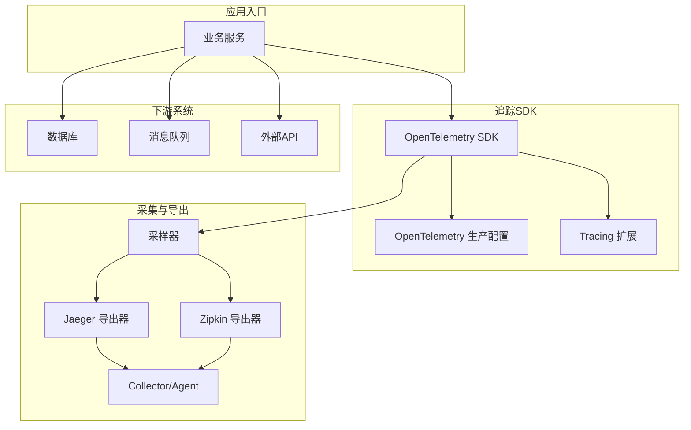
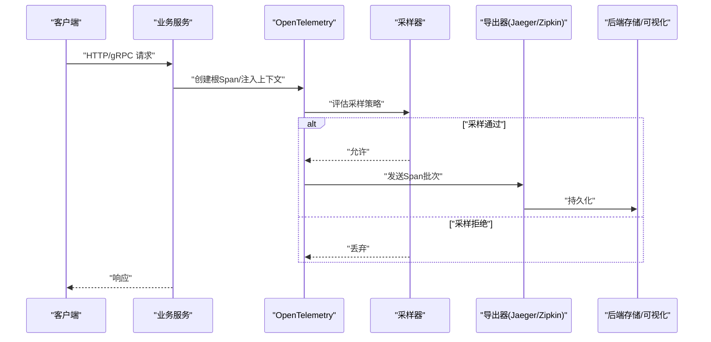
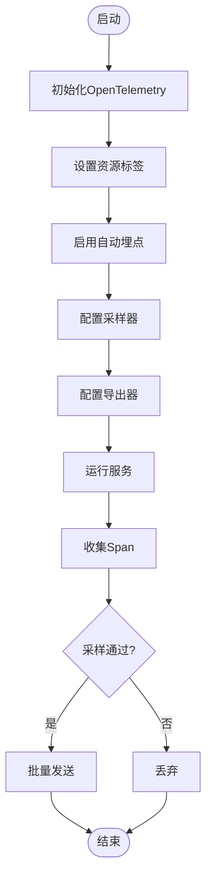
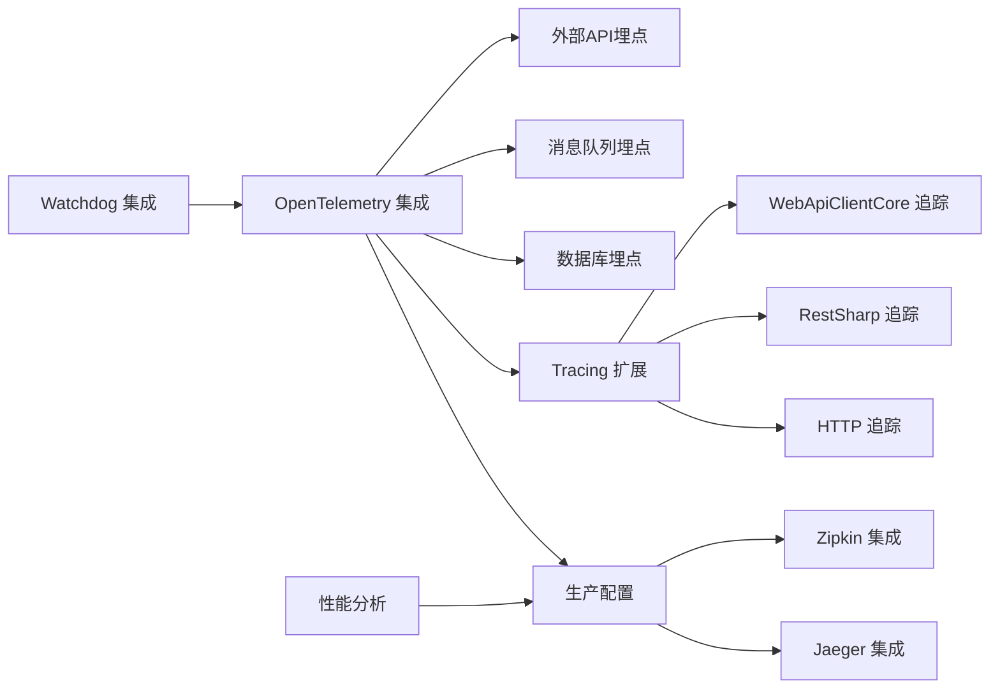

# 分布式追踪

<cite>
**本文引用的文件**   
- [distributed_tracing.cs](file://distributed_tracing.cs)
- [distributed_tracing_enhanced.cs](file://distributed_tracing_enhanced.cs)
- [distributed_tracing_profiler.cs](file://distributed_tracing_profiler.cs)
- [opentelemetry_integration.cs](file://opentelemetry_integration.cs)
- [opentelemetry_production.cs](file://opentelemetry_production.cs)
- [jaeger_integration.cs](file://jaeger_integration.cs)
- [zipkin_integration.cs](file://zipkin_integration.cs)
- [tracing_extension.cs](file://tracing_extension.cs)
- [httprepl_tracing.cs](file://httprepl_tracing.cs)
- [restsharp_tracing.cs](file://restsharp_tracing.cs)
- [webapiclientcore_tracing.cs](file://webapiclientcore_tracing.cs)
- [webapiclientcore_tracing_enhanced.cs](file://webapiclientcore_tracing_enhanced.cs)
- [watchdog_distributed_tracing.cs](file://watchdog_distributed_tracing.cs)
</cite>

## 目录
1. [简介](#简介)
2. [项目结构](#项目结构)
3. [核心组件](#核心组件)
4. [架构总览](#架构总览)
5. [详细组件分析](#详细组件分析)
6. [依赖关系分析](#依赖关系分析)
7. [性能考量](#性能考量)
8. [故障排查指南](#故障排查指南)
9. [结论](#结论)
10. [附录](#附录)

## 简介
本文件面向在微服务与分布式系统中实现可观测性的工程师，系统性阐述基于 OpenTelemetry 的分布式追踪方案，并给出与 Jaeger、Zipkin 的集成实践。内容覆盖 Span 创建、上下文传播、采样策略、链路数据收集与可视化，以及微服务间调用、数据库操作、消息队列与外部 API 调用的追踪要点。同时提供故障定位、性能瓶颈分析与调用链优化的方法，帮助读者快速落地并持续优化。

## 项目结构
仓库中包含多个与分布式追踪相关的示例与集成文件，涵盖：
- OpenTelemetry 基础与生产配置
- Jaeger/Zipkin 导出器集成
- HTTP、gRPC、HTTPClient、REST 客户端等自动注入追踪
- 自定义扩展与增强（采样、Span 属性、异步边界）
- 监控与诊断辅助（Watchdog 集成）

图表来源 
- [opentelemetry_integration.cs](file://opentelemetry_integration.cs)
- [opentelemetry_production.cs](file://opentelemetry_production.cs)
- [jaeger_integration.cs](file://jaeger_integration.cs)
- [zipkin_integration.cs](file://zipkin_integration.cs)
- [tracing_extension.cs](file://tracing_extension.cs)

章节来源
- [distributed_tracing.cs](file://distributed_tracing.cs)
- [distributed_tracing_enhanced.cs](file://distributed_tracing_enhanced.cs)
- [distributed_tracing_profiler.cs](file://distributed_tracing_profiler.cs)
- [opentelemetry_integration.cs](file://opentelemetry_integration.cs)
- [opentelemetry_production.cs](file://opentelemetry_production.cs)
- [jaeger_integration.cs](file://jaeger_integration.cs)
- [zipkin_integration.cs](file://zipkin_integration.cs)
- [tracing_extension.cs](file://tracing_extension.cs)

## 核心组件
- OpenTelemetry 初始化与资源定义：服务名、版本、实例ID、环境标签等
- 处理器管道：HTTP、gRPC、HttpClient、数据库、消息队列等自动埋点
- 采样器：基于比例、动态或按规则采样，平衡开销与覆盖率
- 导出器：将 Span 批量发送到 Jaeger/Zipkin 或兼容后端
- 上下文传播：跨进程/线程/异步任务传递 TraceId/SpanId/Baggage
- 自定义扩展：为关键业务逻辑添加 Span、属性与事件

章节来源
- [opentelemetry_integration.cs](file://opentelemetry_integration.cs)
- [opentelemetry_production.cs](file://opentelemetry_production.cs)
- [tracing_extension.cs](file://tracing_extension.cs)

## 架构总览
下图展示从请求进入服务到链路数据落库的整体流程，包括自动注入、采样决策、导出与可视化。

图表来源 
- [opentelemetry_integration.cs](file://opentelemetry_integration.cs)
- [opentelemetry_production.cs](file://opentelemetry_production.cs)
- [jaeger_integration.cs](file://jaeger_integration.cs)
- [zipkin_integration.cs](file://zipkin_integration.cs)

## 详细组件分析

### OpenTelemetry 集成与生产配置
- 目标：统一接入 OpenTelemetry，启用常用自动埋点，配置资源与导出器
- 关键点：
  - 设置服务名、版本、实例标识与环境标签
  - 启用 HTTP、gRPC、HttpClient、数据库、消息队列等自动埋点
  - 配置采样器（固定比例、动态采样、按规则）
  - 配置导出器（Jaeger/Zipkin），设置端点、认证、批处理参数
  - 使用生产配置优化内存与网络开销（批大小、超时、重试）

图表来源 
- [opentelemetry_integration.cs](file://opentelemetry_integration.cs)
- [opentelemetry_production.cs](file://opentelemetry_production.cs)

章节来源
- [opentelemetry_integration.cs](file://opentelemetry_integration.cs)
- [opentelemetry_production.cs](file://opentelemetry_production.cs)

### Jaeger 集成
- 目标：将 Span 导出至 Jaeger，便于链路可视化与检索
- 关键点：
  - 配置 Jaeger 导出器（端点、协议、认证）
  - 设置采样策略（如基于比例的采样）
  - 调整批处理参数（批大小、超时、重试）
  - 在服务中注入 TracerProvider，确保自动埋点生效

章节来源
- [jaeger_integration.cs](file://jaeger_integration.cs)

### Zipkin 集成
- 目标：将 Span 导出至 Zipkin，支持链路查询与性能分析
- 关键点：
  - 配置 Zipkin 导出器（端点、编码格式、认证）
  - 与采样器配合控制上报量
  - 结合业务标签提升查询效率

章节来源
- [zipkin_integration.cs](file://zipkin_integration.cs)

### 上下文传播与 Span 创建
- 目标：保证跨进程/线程/异步任务的链路连续性
- 关键点：
  - 在 HTTP/gRPC 入站处提取上下文，出站时注入
  - 在异步边界（Task、I/O 等待）保持上下文
  - 为关键业务步骤创建 Span，附加属性与事件
  - 避免重复创建根 Span 或丢失父级关系

章节来源
- [tracing_extension.cs](file://tracing_extension.cs)
- [distributed_tracing.cs](file://distributed_tracing.cs)

### HTTP 与 REST 客户端追踪
- 目标：对 HTTP 请求进行自动埋点，记录状态码、耗时、URL 等
- 关键点：
  - 使用 HttpClient 自动埋点，避免手动埋点遗漏
  - 配置 RestSharp、WebApiClientCore 等客户端的追踪中间件
  - 过滤敏感信息（Header、Body），避免泄露

章节来源
- [httprepl_tracing.cs](file://httprepl_tracing.cs)
- [restsharp_tracing.cs](file://restsharp_tracing.cs)
- [webapiclientcore_tracing.cs](file://webapiclientcore_tracing.cs)
- [webapiclientcore_tracing_enhanced.cs](file://webapiclientcore_tracing_enhanced.cs)

### 数据库操作追踪
- 目标：记录 SQL/NoSQL 操作，包含语句、耗时、错误
- 关键点：
  - 启用 ORM/驱动自动埋点（如 EF Core、Dapper、Redis）
  - 脱敏参数与连接字符串
  - 聚合慢查询与错误率

章节来源
- [opentelemetry_integration.cs](file://opentelemetry_integration.cs)
- [opentelemetry_production.cs](file://opentelemetry_production.cs)

### 消息队列追踪
- 目标：记录消息发布/消费过程，关联生产者与消费者链路
- 关键点：
  - 在发送前注入上下文，消费时提取并续接
  - 记录队列名、路由键、消息 ID、重试次数
  - 避免死信队列中的重复上报

章节来源
- [opentelemetry_integration.cs](file://opentelemetry_integration.cs)
- [opentelemetry_production.cs](file://opentelemetry_production.cs)

### 外部 API 调用追踪
- 目标：记录第三方 API 调用，识别外部依赖延迟与失败
- 关键点：
  - 使用自动埋点或中间件包裹调用
  - 记录域名、路径、状态码、重试
  - 对超时与熔断进行标记

章节来源
- [webapiclientcore_tracing.cs](file://webapiclientcore_tracing.cs)
- [webapiclientcore_tracing_enhanced.cs](file://webapiclientcore_tracing_enhanced.cs)

### 采样策略与性能分析
- 目标：在保证可观测性的前提下降低开销
- 关键点：
  - 固定比例采样 vs 动态采样（按延迟、错误率、流量）
  - 针对关键路径强制采样，其他路径按比例
  - 调整批处理大小、超时、重试，减少网络与序列化开销

章节来源
- [distributed_tracing_profiler.cs](file://distributed_tracing_profiler.cs)
- [opentelemetry_production.cs](file://opentelemetry_production.cs)

### Watchdog 集成与可视化
- 目标：结合 Watchdog 能力进行链路监控与可视化
- 关键点：
  - 将追踪数据与 Watchdog 指标联动
  - 在异常与慢调用时触发告警
  - 提供可视化面板与趋势分析

章节来源
- [watchdog_distributed_tracing.cs](file://watchdog_distributed_tracing.cs)

## 依赖关系分析
下图展示各追踪相关文件的依赖关系与职责划分。

图表来源 
- [opentelemetry_integration.cs](file://opentelemetry_integration.cs)
- [opentelemetry_production.cs](file://opentelemetry_production.cs)
- [tracing_extension.cs](file://tracing_extension.cs)
- [jaeger_integration.cs](file://jaeger_integration.cs)
- [zipkin_integration.cs](file://zipkin_integration.cs)
- [httprepl_tracing.cs](file://httprepl_tracing.cs)
- [restsharp_tracing.cs](file://restsharp_tracing.cs)
- [webapiclientcore_tracing.cs](file://webapiclientcore_tracing.cs)
- [webapiclientcore_tracing_enhanced.cs](file://webapiclientcore_tracing_enhanced.cs)
- [distributed_tracing_profiler.cs](file://distributed_tracing_profiler.cs)
- [watchdog_distributed_tracing.cs](file://watchdog_distributed_tracing.cs)

章节来源
- [opentelemetry_integration.cs](file://opentelemetry_integration.cs)
- [opentelemetry_production.cs](file://opentelemetry_production.cs)
- [tracing_extension.cs](file://tracing_extension.cs)
- [jaeger_integration.cs](file://jaeger_integration.cs)
- [zipkin_integration.cs](file://zipkin_integration.cs)
- [httprepl_tracing.cs](file://httprepl_tracing.cs)
- [restsharp_tracing.cs](file://restsharp_tracing.cs)
- [webapiclientcore_tracing.cs](file://webapiclientcore_tracing.cs)
- [webapiclientcore_tracing_enhanced.cs](file://webapiclientcore_tracing_enhanced.cs)
- [distributed_tracing_profiler.cs](file://distributed_tracing_profiler.cs)
- [watchdog_distributed_tracing.cs](file://watchdog_distributed_tracing.cs)

## 性能考量
- 采样策略选择：高流量场景优先使用动态采样，结合错误率与延迟阈值
- 批处理优化：增大批大小、合理设置超时与重试，避免频繁网络调用
- 属性精简：仅上报必要属性，避免大对象与敏感信息
- 异步边界：确保 Task/I/O 等待期间不阻塞 Span 生命周期
- 资源清理：及时释放 TracerProvider、导出器与缓冲
- 监控与告警：对导出失败、采样丢弃率、慢调用进行监控

[本节为通用指导，无需特定文件引用]

## 故障排查指南
- 链路断裂：检查上下文传播是否正确（HTTP/gRPC 入出站、异步边界）
- 缺失 Span：确认自动埋点是否启用，是否存在被过滤的请求类型
- 采样过多/过少：调整采样器策略，观察上报量与覆盖率
- 导出失败：检查导出器端点、认证、网络连通性与批处理参数
- 性能下降：分析 Span 数量、属性大小、批处理频率与网络开销
- 数据污染：核对服务名、实例ID、环境标签是否正确

章节来源
- [distributed_tracing.cs](file://distributed_tracing.cs)
- [distributed_tracing_enhanced.cs](file://distributed_tracing_enhanced.cs)
- [distributed_tracing_profiler.cs](file://distributed_tracing_profiler.cs)
- [opentelemetry_integration.cs](file://opentelemetry_integration.cs)
- [opentelemetry_production.cs](file://opentelemetry_production.cs)
- [jaeger_integration.cs](file://jaeger_integration.cs)
- [zipkin_integration.cs](file://zipkin_integration.cs)
- [tracing_extension.cs](file://tracing_extension.cs)
- [httprepl_tracing.cs](file://httprepl_tracing.cs)
- [restsharp_tracing.cs](file://restsharp_tracing.cs)
- [webapiclientcore_tracing.cs](file://webapiclientcore_tracing.cs)
- [webapiclientcore_tracing_enhanced.cs](file://webapiclientcore_tracing_enhanced.cs)
- [watchdog_distributed_tracing.cs](file://watchdog_distributed_tracing.cs)

## 结论
通过统一的 OpenTelemetry 接入与 Jaeger/Zipkin 导出，可实现端到端的分布式追踪。结合合理的采样策略、完善的上下文传播与自动埋点，能够高效定位问题、分析性能瓶颈并优化调用链。建议在生产环境中持续监控导出质量与采样效果，逐步完善业务 Span 与属性，提升可观测性价值。

[本节为总结性内容，无需特定文件引用]

## 附录
- 最佳实践清单：
  - 明确服务名与实例标识，统一环境标签
  - 启用关键自动埋点（HTTP、gRPC、DB、MQ、HTTPClient）
  - 配置合适的采样策略与导出器参数
  - 脱敏敏感信息，精简属性
  - 建立监控与告警，持续优化

[本节为补充说明，无需特定文件引用]