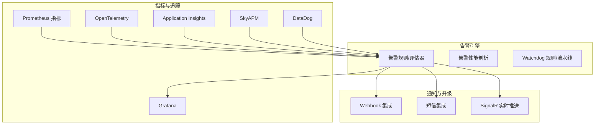
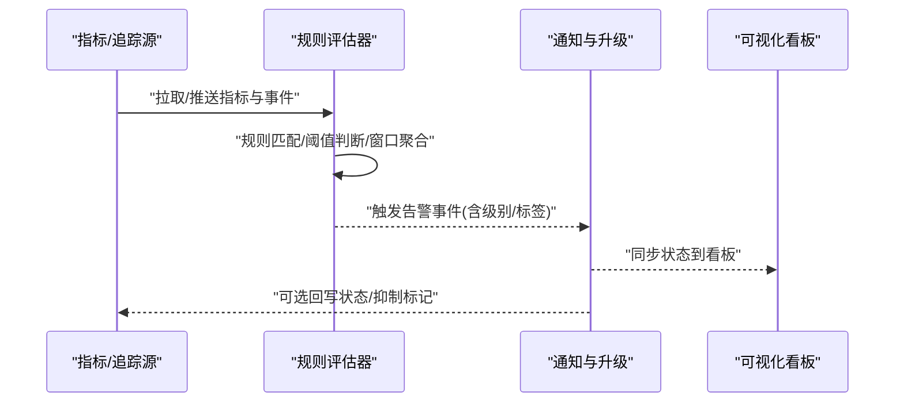
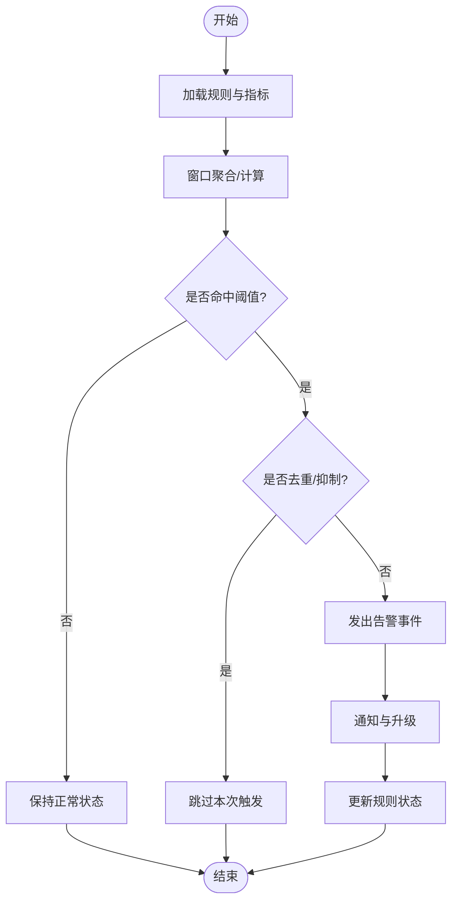
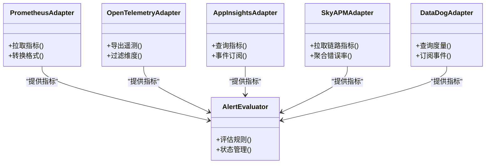
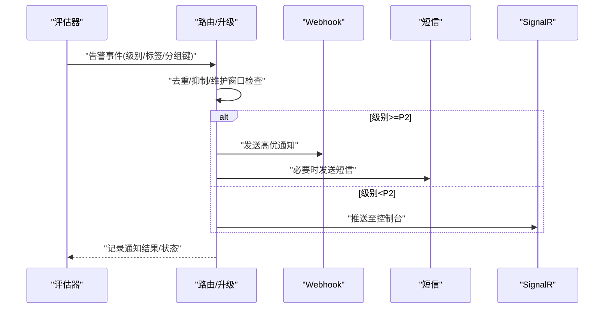
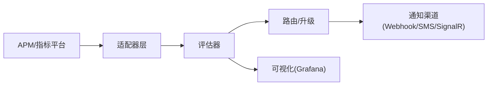

# 告警系统

<cite>
**本文引用的文件**   
- [alert_rules.cs](file://alert_rules.cs)
- [alerting_profiler.cs](file://alerting_profiler.cs)
- [appinsights_alerting.cs](file://appinsights_alerting.cs)
- [datadog_alerting.cs](file://datadog_alerting.cs)
- [httpreports_alerts.cs](file://httpreports_alerts.cs)
- [opentelemetry_alerting.cs](file://opentelemetry_alerting.cs)
- [skyapm_alerting.cs](file://skyapm_alerting.cs)
- [watchdog_alert_rules.cs](file://watchdog_alert_rules.cs)
- [prometheus_metrics.cs](file://prometheus_metrics.cs)
- [metrics_monitoring.cs](file://metrics_monitoring.cs)
- [performance_metrics.cs](file://performance_metrics.cs)
- [signalr_advanced_monitoring.cs](file://signalr_advanced_monitoring.cs)
- [webhook_integration.cs](file://webhook_integration.cs)
- [sms_integration.cs](file://sms_integration.cs)
- [grafana_integration.cs](file://grafana_integration.cs)
</cite>

## 目录
1. [简介](#简介)
2. [项目结构](#项目结构)
3. [核心组件](#核心组件)
4. [架构总览](#架构总览)
5. [详细组件分析](#详细组件分析)
6. [依赖关系分析](#依赖关系分析)
7. [性能考量](#性能考量)
8. [故障排查指南](#故障排查指南)
9. [结论](#结论)
10. [附录](#附录)

## 简介
本文件面向告警系统的综合文档，覆盖告警规则配置、阈值设置、通知渠道集成与告警升级策略；涵盖应用异常告警、性能指标告警、业务指标告警与基础设施告警；并给出告警去重、抑制机制、维护窗口与值班排班的实践建议。同时提供告警有效性评估、误报处理与避免告警疲劳的方法论。

## 项目结构
仓库中包含多个与“告警”相关的示例与集成实现，主要分布在根目录的若干 .cs 文件中，涉及：
- 规则与评估：告警规则定义、评估器与性能剖析
- 指标采集与上报：Prometheus、OpenTelemetry、AppInsights、SkyAPM、DataDog、Grafana
- 通知与升级：Webhook、短信、SignalR 实时推送
- 监控面板与可视化：Grafana 集成
- 守护进程与规则引擎：Watchdog 相关规则与流水线

图表来源 
- [prometheus_metrics.cs](file://prometheus_metrics.cs)
- [opentelemetry_alerting.cs](file://opentelemetry_alerting.cs)
- [appinsights_alerting.cs](file://appinsights_alerting.cs)
- [skyapm_alerting.cs](file://skyapm_alerting.cs)
- [datadog_alerting.cs](file://datadog_alerting.cs)
- [grafana_integration.cs](file://grafana_integration.cs)
- [alert_rules.cs](file://alert_rules.cs)
- [alerting_profiler.cs](file://alerting_profiler.cs)
- [watchdog_alert_rules.cs](file://watchdog_alert_rules.cs)

章节来源
- [alert_rules.cs](file://alert_rules.cs)
- [alerting_profiler.cs](file://alerting_profiler.cs)
- [prometheus_metrics.cs](file://prometheus_metrics.cs)
- [opentelemetry_alerting.cs](file://opentelemetry_alerting.cs)
- [appinsights_alerting.cs](file://appinsights_alerting.cs)
- [skyapm_alerting.cs](file://skyapm_alerting.cs)
- [datadog_alerting.cs](file://datadog_alerting.cs)
- [grafana_integration.cs](file://grafana_integration.cs)
- [watchdog_alert_rules.cs](file://watchdog_alert_rules.cs)

## 核心组件
- 告警规则与评估器
  - 负责定义规则（条件、阈值、时间窗口、标签）、计算触发状态、输出事件。
  - 典型职责：规则解析、指标聚合、窗口计算、状态机管理（正常/警告/严重）。
- 告警性能剖析
  - 对规则评估链路进行耗时统计、热点定位，辅助优化评估频率与批处理。
- 指标与追踪接入
  - Prometheus、OpenTelemetry、AppInsights、SkyAPM、DataDog 等作为数据源或平台。
- 通知与升级
  - Webhook、短信、SignalR 等通道；支持按级别路由、升级策略（如从 P3→P2→P1）。
- 可视化与看板
  - Grafana 集成用于展示指标与告警状态，便于快速定位问题。
- 守护与调度
  - Watchdog 相关模块用于周期性执行规则评估与流水线编排。

章节来源
- [alert_rules.cs](file://alert_rules.cs)
- [alerting_profiler.cs](file://alerting_profiler.cs)
- [prometheus_metrics.cs](file://prometheus_metrics.cs)
- [opentelemetry_alerting.cs](file://opentelemetry_alerting.cs)
- [appinsights_alerting.cs](file://appinsights_alerting.cs)
- [skyapm_alerting.cs](file://skyapm_alerting.cs)
- [datadog_alerting.cs](file://datadog_alerting.cs)
- [grafana_integration.cs](file://grafana_integration.cs)
- [watchdog_alert_rules.cs](file://watchdog_alert_rules.cs)

## 架构总览
整体采用“指标/追踪 → 规则评估 → 通知/升级 → 可视化”的分层架构。各子系统通过标准化接口解耦，便于扩展新的数据源与通知渠道。

图表来源 
- [alert_rules.cs](file://alert_rules.cs)
- [prometheus_metrics.cs](file://prometheus_metrics.cs)
- [opentelemetry_alerting.cs](file://opentelemetry_alerting.cs)
- [appinsights_alerting.cs](file://appinsights_alerting.cs)
- [skyapm_alerting.cs](file://skyapm_alerting.cs)
- [datadog_alerting.cs](file://datadog_alerting.cs)
- [grafana_integration.cs](file://grafana_integration.cs)
- [webhook_integration.cs](file://webhook_integration.cs)
- [sms_integration.cs](file://sms_integration.cs)
- [signalr_advanced_monitoring.cs](file://signalr_advanced_monitoring.cs)

## 详细组件分析

### 告警规则与评估器
- 功能要点
  - 规则模型：包含指标名、表达式、阈值、时间窗口、标签、级别、分组键等。
  - 评估流程：周期拉取指标 → 聚合计算 → 匹配规则 → 生成告警事件。
  - 状态管理：维持每条规则的当前状态，避免抖动与重复触发。
- 设计模式
  - 策略模式：不同指标类型（CPU、内存、错误率、延迟）对应不同评估策略。
  - 观察者模式：规则触发后发布事件，通知订阅者（通知/升级/持久化）。
- 复杂度与优化
  - 评估复杂度与规则数量、指标粒度、窗口大小相关；可通过批处理、增量计算、缓存降频优化。

图表来源 
- [alert_rules.cs](file://alert_rules.cs)
- [alerting_profiler.cs](file://alerting_profiler.cs)

章节来源
- [alert_rules.cs](file://alert_rules.cs)
- [alerting_profiler.cs](file://alerting_profiler.cs)

### 指标与追踪接入（Prometheus/OpenTelemetry/AppInsights/SkyAPM/DataDog）
- 角色分工
  - Prometheus：拉取时序指标，适合服务内部暴露的 HTTP 指标。
  - OpenTelemetry：统一埋点与分布式追踪，跨语言/框架。
  - AppInsights/SkyAPM/DataDog：SaaS 或企业级 APM，提供现成告警能力与可视化。
- 集成要点
  - 指标命名规范、标签维度设计、采样与保留策略。
  - 与规则评估器的对接方式（拉取 vs 推送）。
  - 多源融合：将不同来源的指标归一化为统一模型供评估器使用。

图表来源 
- [prometheus_metrics.cs](file://prometheus_metrics.cs)
- [opentelemetry_alerting.cs](file://opentelemetry_alerting.cs)
- [appinsights_alerting.cs](file://appinsights_alerting.cs)
- [skyapm_alerting.cs](file://skyapm_alerting.cs)
- [datadog_alerting.cs](file://datadog_alerting.cs)

章节来源
- [prometheus_metrics.cs](file://prometheus_metrics.cs)
- [opentelemetry_alerting.cs](file://opentelemetry_alerting.cs)
- [appinsights_alerting.cs](file://appinsights_alerting.cs)
- [skyapm_alerting.cs](file://skyapm_alerting.cs)
- [datadog_alerting.cs](file://datadog_alerting.cs)

### 通知与升级（Webhook/短信/SignalR）
- 通知渠道
  - Webhook：通用回调，可对接企业微信、钉钉、飞书、Slack、PagerDuty 等。
  - 短信：关键告警兜底触达。
  - SignalR：实时推送至前端控制台或大屏。
- 升级策略
  - 基于级别（P3/P2/P1）与持续时间自动升级。
  - 未响应升级：N 分钟未确认则升级至更高级别或扩大受众。
- 抑制与去重
  - 相同规则+相同分组键在冷却期内不重复触发。
  - 维护窗口内抑制非关键告警。

图表来源 
- [webhook_integration.cs](file://webhook_integration.cs)
- [sms_integration.cs](file://sms_integration.cs)
- [signalr_advanced_monitoring.cs](file://signalr_advanced_monitoring.cs)
- [alert_rules.cs](file://alert_rules.cs)

章节来源
- [webhook_integration.cs](file://webhook_integration.cs)
- [sms_integration.cs](file://sms_integration.cs)
- [signalr_advanced_monitoring.cs](file://signalr_advanced_monitoring.cs)
- [alert_rules.cs](file://alert_rules.cs)

### 可视化与看板（Grafana）
- 作用
  - 集中展示指标、告警状态、趋势与根因线索。
- 集成方式
  - 通过数据源（Prometheus/OTLP/APM）与告警联动，实现点击跳转与下钻。
- 最佳实践
  - 统一命名与标签；分层看板（全局/服务/实例）；关键指标置顶。

章节来源
- [grafana_integration.cs](file://grafana_integration.cs)

### 守护与调度（Watchdog）
- 职责
  - 周期性调度规则评估、流水线编排、资源监控与自愈动作。
- 特点
  - 轻量、可扩展、可与消息队列/任务调度结合。

章节来源
- [watchdog_alert_rules.cs](file://watchdog_alert_rules.cs)

## 依赖关系分析
- 低耦合高内聚
  - 指标适配器与评估器解耦；评估器与通知渠道解耦。
- 外部依赖
  - 各 APM/指标平台 SDK；消息通道（HTTP/短信网关/WebSocket）。
- 潜在风险
  - 多源指标不一致导致误判；通知通道失败需重试与降级；评估器过载需限流与批处理。

图表来源 
- [prometheus_metrics.cs](file://prometheus_metrics.cs)
- [opentelemetry_alerting.cs](file://opentelemetry_alerting.cs)
- [appinsights_alerting.cs](file://appinsights_alerting.cs)
- [skyapm_alerting.cs](file://skyapm_alerting.cs)
- [datadog_alerting.cs](file://datadog_alerting.cs)
- [alert_rules.cs](file://alert_rules.cs)
- [webhook_integration.cs](file://webhook_integration.cs)
- [sms_integration.cs](file://sms_integration.cs)
- [signalr_advanced_monitoring.cs](file://signalr_advanced_monitoring.cs)
- [grafana_integration.cs](file://grafana_integration.cs)

章节来源
- [prometheus_metrics.cs](file://prometheus_metrics.cs)
- [opentelemetry_alerting.cs](file://opentelemetry_alerting.cs)
- [appinsights_alerting.cs](file://appinsights_alerting.cs)
- [skyapm_alerting.cs](file://skyapm_alerting.cs)
- [datadog_alerting.cs](file://datadog_alerting.cs)
- [alert_rules.cs](file://alert_rules.cs)
- [webhook_integration.cs](file://webhook_integration.cs)
- [sms_integration.cs](file://sms_integration.cs)
- [signalr_advanced_monitoring.cs](file://signalr_advanced_monitoring.cs)
- [grafana_integration.cs](file://grafana_integration.cs)

## 性能考量
- 评估频率与批处理
  - 合理设置轮询间隔，批量拉取与计算，降低 I/O 压力。
- 指标采样与聚合
  - 在高吞吐场景启用采样与预聚合，减少传输与存储成本。
- 去重与抑制
  - 使用分组键与冷却期，避免风暴式告警。
- 异步与背压
  - 通知通道异步化，失败重试与退避；评估器过载时丢弃低优先级告警。
- 观测性
  - 通过性能剖析与指标监控评估器自身健康度。

[本节为通用指导，无需特定文件引用]

## 故障排查指南
- 常见问题
  - 指标缺失或延迟：检查数据采集端、网络与权限。
  - 误报频发：调整阈值、增加稳定窗口、完善标签维度。
  - 通知失败：校验渠道配置、重试策略与配额限制。
  - 评估器过载：扩容、分片、限流与降级。
- 诊断步骤
  - 查看评估器日志与耗时分布；核对规则表达式与标签；回放指标曲线定位拐点。
  - 使用看板下钻到具体实例/调用链，验证根因。
- 恢复策略
  - 临时抑制非关键告警；切换只读模式；回滚变更；启用备用通道。

章节来源
- [alerting_profiler.cs](file://alerting_profiler.cs)
- [alert_rules.cs](file://alert_rules.cs)
- [prometheus_metrics.cs](file://prometheus_metrics.cs)
- [opentelemetry_alerting.cs](file://opentelemetry_alerting.cs)
- [appinsights_alerting.cs](file://appinsights_alerting.cs)
- [skyapm_alerting.cs](file://skyapm_alerting.cs)
- [datadog_alerting.cs](file://datadog_alerting.cs)
- [webhook_integration.cs](file://webhook_integration.cs)
- [sms_integration.cs](file://sms_integration.cs)
- [signalr_advanced_monitoring.cs](file://signalr_advanced_monitoring.cs)

## 结论
本告警系统以“指标/追踪 → 规则评估 → 通知/升级 → 可视化”为核心链路，具备多源接入、灵活规则、智能升级与多渠道通知能力。通过合理的阈值与窗口设计、去重抑制与维护窗口，可有效降低误报与告警疲劳，提升运维效率与稳定性。

[本节为总结性内容，无需特定文件引用]

## 附录

### 告警规则配置与阈值设置
- 规则要素
  - 指标名、表达式、阈值、时间窗口、标签、级别、分组键、静默/抑制策略。
- 阈值设定原则
  - 基于历史基线与 SLO；区分瞬时尖刺与持续异常；考虑业务时段差异。
- 示例类别
  - 应用异常：错误率、异常堆栈、依赖失败。
  - 性能指标：CPU、内存、GC、线程池、I/O 等待、延迟分位。
  - 业务指标：订单失败率、支付成功率、库存不足、用户注册失败。
  - 基础设施：节点宕机、磁盘满、网络丢包、证书过期。

章节来源
- [alert_rules.cs](file://alert_rules.cs)
- [performance_metrics.cs](file://performance_metrics.cs)
- [metrics_monitoring.cs](file://metrics_monitoring.cs)

### 通知渠道集成与升级策略
- 渠道选择
  - 日常：Webhook/IM；关键：短信/电话；实时：SignalR/大屏。
- 升级策略
  - 按级别与持续时间自动升级；未响应升级；扩面通知。
- 抑制与去重
  - 同规则+同分组键冷却期；维护窗口抑制；关联告警合并。

章节来源
- [webhook_integration.cs](file://webhook_integration.cs)
- [sms_integration.cs](file://sms_integration.cs)
- [signalr_advanced_monitoring.cs](file://signalr_advanced_monitoring.cs)
- [alert_rules.cs](file://alert_rules.cs)

### 维护窗口与值班排班
- 维护窗口
  - 计划内变更期间抑制非关键告警；灰度发布逐步放量。
- 值班排班
  - 基于团队日历与技能矩阵；明确升级路径与联系人；演练与复盘。

[本节为通用实践，无需特定文件引用]

### 告警有效性评估与误报处理
- 有效性指标
  - 告警命中率、平均修复时间（MTTR）、无效告警占比、升级率。
- 误报处理
  - 定期回顾与调参；引入更多上下文标签；A/B 对比阈值。
- 避免告警疲劳
  - 精简规则、合并相似告警、分级降噪、自动化自愈。

[本节为通用实践，无需特定文件引用]