# 指标监控

<cite>
**本文引用的文件**   
- [prometheus_integration.cs](file://prometheus_integration.cs)
- [prometheus_metrics.cs](file://prometheus_metrics.cs)
- [metrics_monitoring.cs](file://metrics_monitoring.cs)
- [metrics_enhanced.cs](file://metrics_enhanced.cs)
- [metrics_influxdb.cs](file://metrics_influxdb.cs)
- [grafana_integration.cs](file://grafana_integration.cs)
- [appinsights_prometheus.cs](file://appinsights_prometheus.cs)
- [datadog_prometheus.cs](file://datadog_prometheus.cs)
- [skyapm_prometheus.cs](file://skyapm_prometheus.cs)
- [opentelemetry_prometheus.cs](file://opentelemetry_prometheus.cs)
- [httpreports_prometheus.cs](file://httpreports_prometheus.cs)
- [performance_metrics.cs](file://performance_metrics.cs)
- [signalr_advanced_monitoring.cs](file://signalr_advanced_monitoring.cs)
- [signalr_monitoring.cs](file://signalr_monitoring.cs)
- [watchdog_visualization.cs](file://watchdog_visualization.cs)
- [realtime_analytics.cs](file://realtime_analytics.cs)
- [alert_rules.cs](file://alert_rules.cs)
- [high_frequency_100k.cs](file://high_frequency_100k.cs)
- [high_frequency_1m.cs](file://high_frequency_1m.cs)
- [high_frequency_10m.cs](file://high_frequency_10m.cs)
</cite>

## 目录
1. [简介](#简介)
2. [项目结构](#项目结构)
3. [核心组件](#核心组件)
4. [架构总览](#架构总览)
5. [详细组件分析](#详细组件分析)
6. [依赖关系分析](#依赖关系分析)
7. [性能考虑](#性能考虑)
8. [故障排查指南](#故障排查指南)
9. [结论](#结论)
10. [附录](#附录)

## 简介
本文件面向“指标监控系统”的落地与使用，覆盖Prometheus指标采集、自定义指标定义、Grafana仪表板配置与时序数据库集成。文档同时给出应用性能指标、业务指标、基础设施指标的采集与展示方法，并总结指标命名规范、标签设计、聚合策略与存储优化实践。此外，提供容量规划、趋势分析与异常检测的实现思路，帮助团队构建可观测性体系。

## 项目结构
仓库中包含多个与指标和可视化相关的示例与集成文件，主要分布在根目录下的若干C#文件中，涵盖：
- Prometheus导出器与中间件集成
- 自定义指标定义与增强采集
- Grafana数据源与仪表板对接
- 多后端时序存储（Prometheus、InfluxDB）
- 与OpenTelemetry、SkyAPM、AppInsights、Datadog等生态的桥接
- 高性能场景下的高频指标采集示例
- 实时分析与告警规则示例

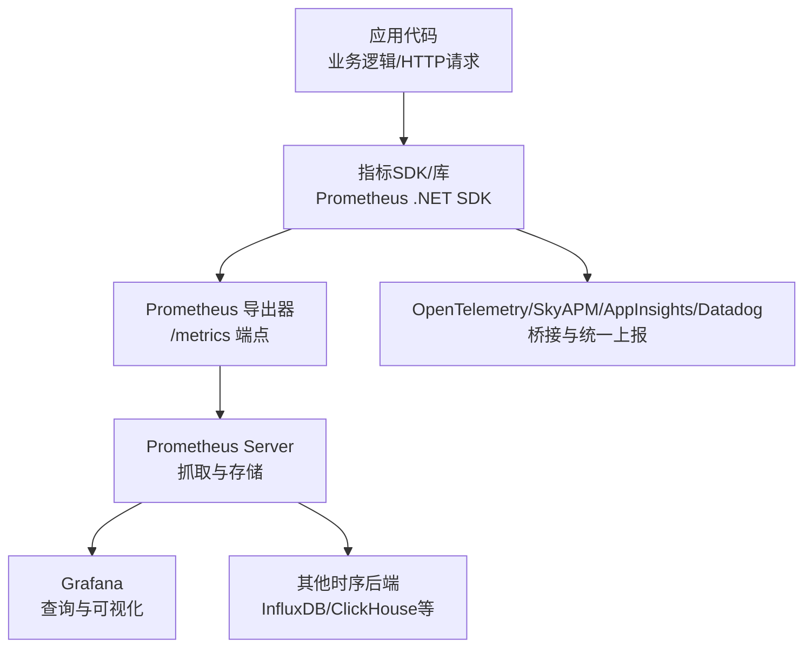

图表来源
- [prometheus_integration.cs:1-200](file://prometheus_integration.cs#L1-L200)
- [prometheus_metrics.cs:1-200](file://prometheus_metrics.cs#L1-L200)
- [grafana_integration.cs:1-200](file://grafana_integration.cs#L1-L200)

章节来源
- [prometheus_integration.cs:1-200](file://prometheus_integration.cs#L1-L200)
- [prometheus_metrics.cs:1-200](file://prometheus_metrics.cs#L1-L200)
- [grafana_integration.cs:1-200](file://grafana_integration.cs#L1-L200)

## 核心组件
- Prometheus导出器与中间件：负责在应用中注册/metrics端点，暴露Prometheus格式指标，支持HTTP中间件自动埋点。
- 自定义指标定义：Counter、Gauge、Histogram、Summary等类型的使用与最佳实践。
- 时序存储集成：Prometheus抓取与长期存储；可选InfluxDB等后端。
- 可视化与仪表板：Grafana数据源配置与常用面板模板。
- 生态桥接：OpenTelemetry、SkyAPm、AppInsights、Datadog与Prometheus的互操作。
- 高频采集与性能优化：针对高吞吐场景的采样与批处理策略。
- 实时分析与告警：基于PromQL的查询与告警规则示例。

章节来源
- [prometheus_integration.cs:1-200](file://prometheus_integration.cs#L1-L200)
- [prometheus_metrics.cs:1-200](file://prometheus_metrics.cs#L1-L200)
- [metrics_monitoring.cs:1-200](file://metrics_monitoring.cs#L1-L200)
- [metrics_enhanced.cs:1-200](file://metrics_enhanced.cs#L1-L200)
- [metrics_influxdb.cs:1-200](file://metrics_influxdb.cs#L1-L200)
- [grafana_integration.cs:1-200](file://grafana_integration.cs#L1-L200)

## 架构总览
下图展示了从应用到可视化的端到端流程，包括指标采集、导出、抓取、存储与查询展示。

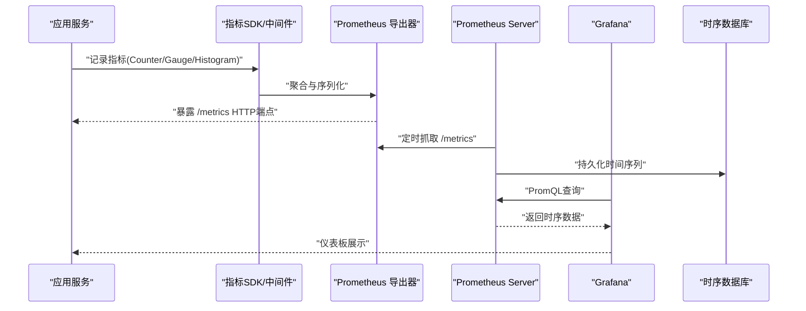

图表来源
- [prometheus_integration.cs:1-200](file://prometheus_integration.cs#L1-L200)
- [prometheus_metrics.cs:1-200](file://prometheus_metrics.cs#L1-L200)
- [grafana_integration.cs:1-200](file://grafana_integration.cs#L1-L200)

## 详细组件分析

### Prometheus导出器与中间件
- 职责：在ASP.NET Core中注册/metrics端点，自动收集框架级指标（如请求数、延迟、错误率），并提供扩展点用于业务指标注入。
- 关键点：中间件生命周期、指标刷新策略、标签规范化、避免高基数标签。
- 典型用法：在服务启动时添加中间件，在业务关键路径调用计数器或直方图记录事件。

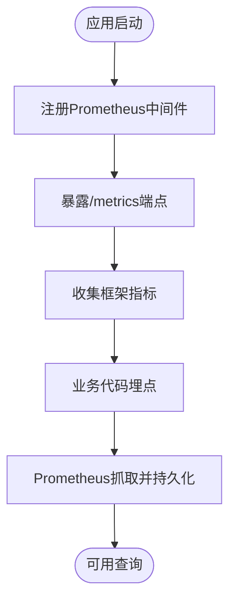

图表来源
- [prometheus_integration.cs:1-200](file://prometheus_integration.cs#L1-L200)

章节来源
- [prometheus_integration.cs:1-200](file://prometheus_integration.cs#L1-L200)

### 自定义指标定义与最佳实践
- Counter：累计计数（如请求总数、错误数）。
- Gauge：瞬时值（如内存使用、队列长度）。
- Histogram/Summary：分布统计（如请求延迟分位）。
- 命名规范：采用小写下划线分隔，包含单位与维度说明，避免歧义。
- 标签设计：仅保留必要维度，控制基数，避免动态ID作为标签。

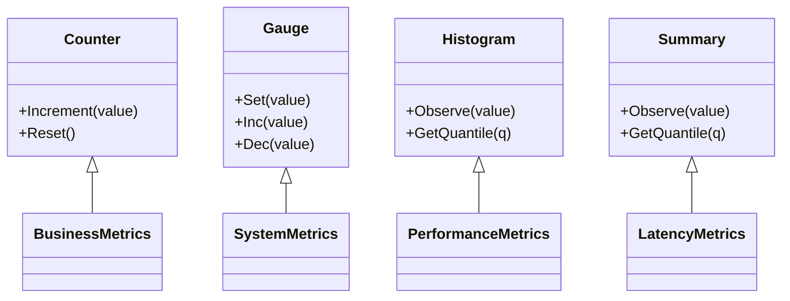

图表来源
- [prometheus_metrics.cs:1-200](file://prometheus_metrics.cs#L1-L200)
- [metrics_enhanced.cs:1-200](file://metrics_enhanced.cs#L1-L200)

章节来源
- [prometheus_metrics.cs:1-200](file://prometheus_metrics.cs#L1-L200)
- [metrics_enhanced.cs:1-200](file://metrics_enhanced.cs#L1-L200)

### Grafana仪表板配置
- 数据源：添加Prometheus数据源，配置服务器地址与抓取间隔。
- 面板模板：常用面板包括QPS、延迟分位、错误率、资源使用率、业务转化率等。
- 变量与过滤：通过变量实现环境、服务实例、租户等维度切换。
- 联动与告警：面板内联告警规则，结合Prometheus Alertmanager进行通知。

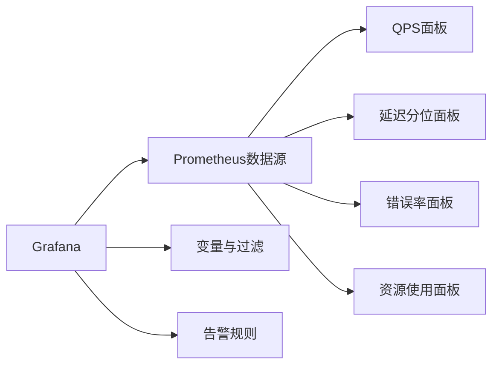

图表来源
- [grafana_integration.cs:1-200](file://grafana_integration.cs#L1-L200)

章节来源
- [grafana_integration.cs:1-200](file://grafana_integration.cs#L1-L200)

### 时序数据库集成（Prometheus与InfluxDB）
- Prometheus：原生抓取与存储，适合短期至中期历史查询与告警。
- InfluxDB：写入优化与压缩，适合长周期存储与大规模时序数据。
- 迁移与双写：根据需求选择单一或混合存储，注意标签与字段映射。

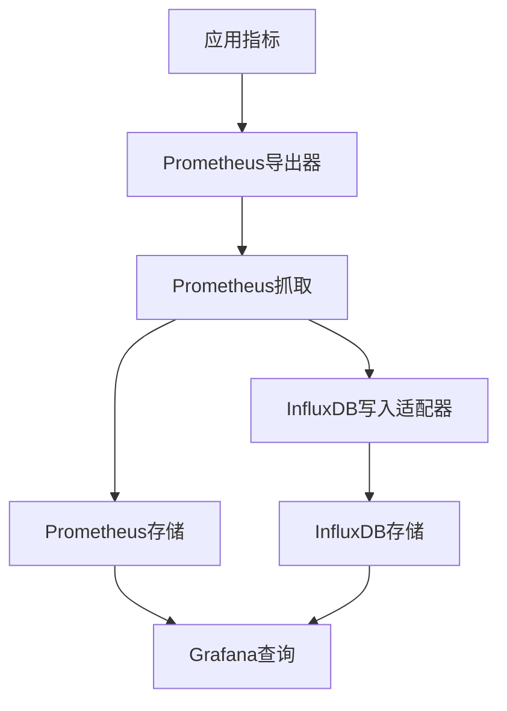

图表来源
- [metrics_influxdb.cs:1-200](file://metrics_influxdb.cs#L1-L200)
- [prometheus_integration.cs:1-200](file://prometheus_integration.cs#L1-L200)

章节来源
- [metrics_influxdb.cs:1-200](file://metrics_influxdb.cs#L1-L200)

### 生态桥接（OpenTelemetry、SkyAPM、AppInsights、Datadog）
- OpenTelemetry：统一遥测模型，将Tracing/Metrics/Logs标准化后导出到Prometheus或其他后端。
- SkyAPm/AppInsights/Datadog：通过各自SDK或桥接层将指标与追踪数据转换为Prometheus兼容格式。
- 优势：跨平台、跨语言的可观测性统一，减少重复埋点。

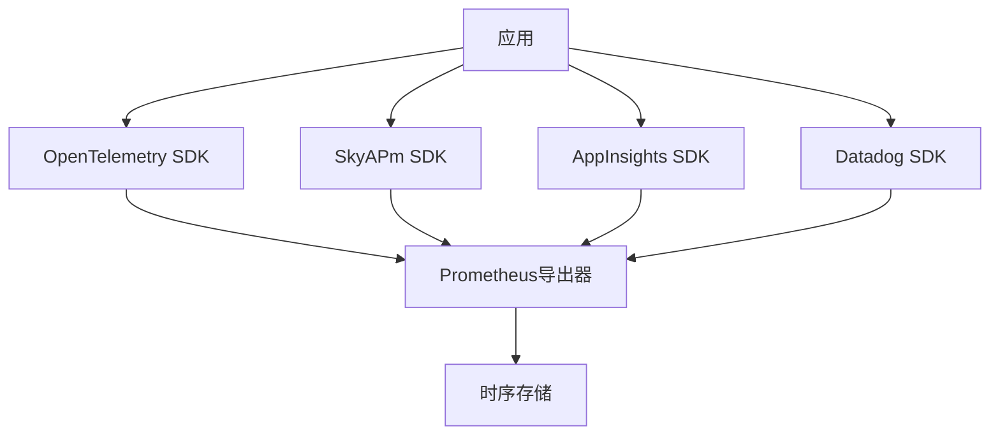

图表来源
- [opentelemetry_prometheus.cs:1-200](file://opentelemetry_prometheus.cs#L1-L200)
- [skyapm_prometheus.cs:1-200](file://skyapm_prometheus.cs#L1-L200)
- [appinsights_prometheus.cs:1-200](file://appinsights_prometheus.cs#L1-L200)
- [datadog_prometheus.cs:1-200](file://datadog_prometheus.cs#L1-L200)

章节来源
- [opentelemetry_prometheus.cs:1-200](file://opentelemetry_prometheus.cs#L1-L200)
- [skyapm_prometheus.cs:1-200](file://skyapm_prometheus.cs#L1-L200)
- [appinsights_prometheus.cs:1-200](file://appinsights_prometheus.cs#L1-L200)
- [datadog_prometheus.cs:1-200](file://datadog_prometheus.cs#L1-L200)

### 高性能指标采集（高频场景）
- 目标：在高吞吐（如每秒十万级）场景下保持低开销与稳定输出。
- 策略：批量写入、采样降频、避免锁竞争、使用线程局部缓存。
- 示例：高频计数器与直方图的优化实现。

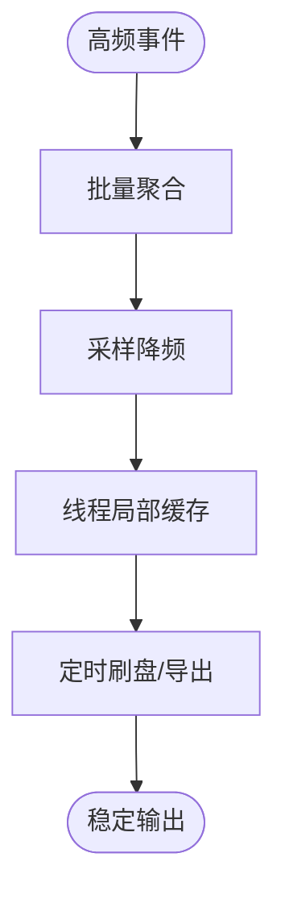

图表来源
- [high_frequency_100k.cs:1-200](file://high_frequency_100k.cs#L1-L200)
- [high_frequency_1m.cs:1-200](file://high_frequency_1m.cs#L1-L200)
- [high_frequency_10m.cs:1-200](file://high_frequency_10m.cs#L1-L200)

章节来源
- [high_frequency_100k.cs:1-200](file://high_frequency_100k.cs#L1-L200)
- [high_frequency_1m.cs:1-200](file://high_frequency_1m.cs#L1-L200)
- [high_frequency_10m.cs:1-200](file://high_frequency_10m.cs#L1-L200)

### 实时分析与告警
- 实时分析：基于PromQL对窗口数据进行滑动计算，如移动平均、速率变化。
- 告警规则：定义阈值与持续时间，触发告警并推送至通知渠道。
- 示例：错误率突增、延迟P99超标、资源使用率接近上限。

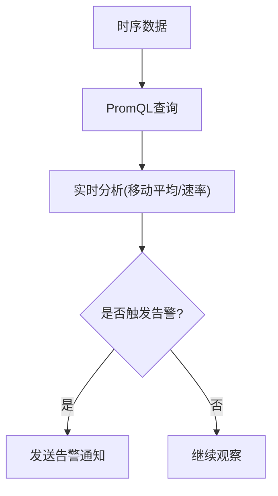

图表来源
- [realtime_analytics.cs:1-200](file://realtime_analytics.cs#L1-L200)
- [alert_rules.cs:1-200](file://alert_rules.cs#L1-L200)

章节来源
- [realtime_analytics.cs:1-200](file://realtime_analytics.cs#L1-L200)
- [alert_rules.cs:1-200](file://alert_rules.cs#L1-L200)

### 应用与基础设施指标
- 应用性能指标：请求数、延迟分位、错误率、吞吐量、并发连接数。
- 业务指标：订单量、转化率、用户活跃度、库存水位。
- 基础设施指标：CPU、内存、磁盘I/O、网络带宽、容器Pod状态。
- 采集方式：框架中间件、SDK埋点、系统探针、日志解析。

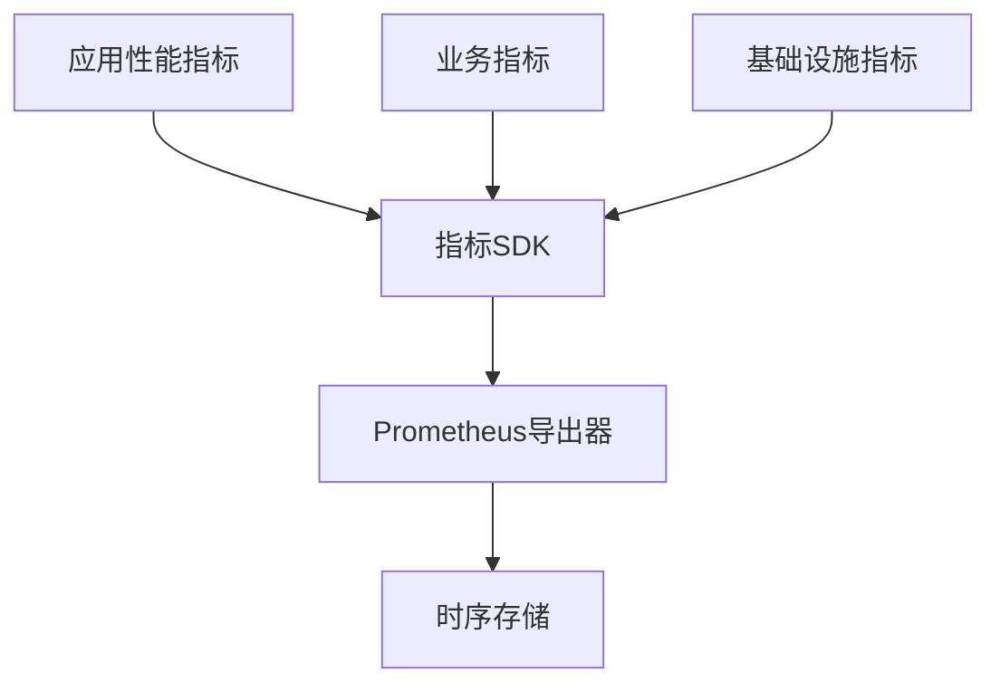

图表来源
- [performance_metrics.cs:1-200](file://performance_metrics.cs#L1-L200)
- [signalr_advanced_monitoring.cs:1-200](file://signalr_advanced_monitoring.cs#L1-L200)
- [signalr_monitoring.cs:1-200](file://signalr_monitoring.cs#L1-L200)

章节来源
- [performance_metrics.cs:1-200](file://performance_metrics.cs#L1-L200)
- [signalr_advanced_monitoring.cs:1-200](file://signalr_advanced_monitoring.cs#L1-L200)
- [signalr_monitoring.cs:1-200](file://signalr_monitoring.cs#L1-L200)

## 依赖关系分析
- 组件耦合：应用代码依赖指标SDK与导出器；导出器依赖Prometheus抓取机制；Grafana依赖Prometheus数据源。
- 外部依赖：OpenTelemetry、SkyAPm、AppInsights、Datadog等遥测生态；时序存储（Prometheus、InfluxDB）。
- 潜在循环：应避免在指标记录逻辑中引入业务依赖，防止循环引用与性能退化。

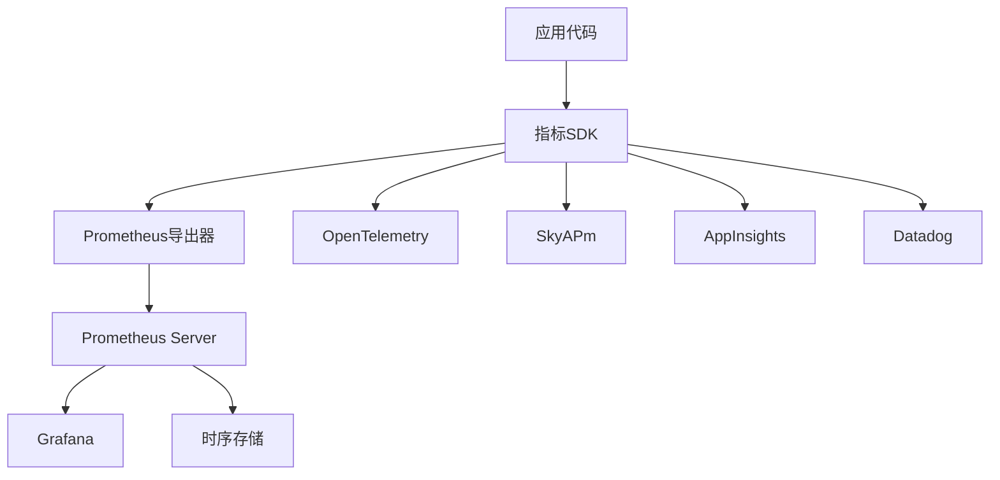

图表来源
- [prometheus_integration.cs:1-200](file://prometheus_integration.cs#L1-L200)
- [prometheus_metrics.cs:1-200](file://prometheus_metrics.cs#L1-L200)
- [grafana_integration.cs:1-200](file://grafana_integration.cs#L1-L200)

章节来源
- [prometheus_integration.cs:1-200](file://prometheus_integration.cs#L1-L200)
- [prometheus_metrics.cs:1-200](file://prometheus_metrics.cs#L1-L200)
- [grafana_integration.cs:1-200](file://grafana_integration.cs#L1-L200)

## 性能考虑
- 指标基数控制：限制标签数量与取值范围，避免高基数导致存储膨胀与查询缓慢。
- 采样与批处理：在高吞吐场景下采用采样与批量写入，降低锁竞争与GC压力。
- 存储优化：合理设置Prometheus的保留期与压缩策略；InfluxDB使用合适的保留策略与分区键。
- 查询优化：在Grafana中使用预聚合与变量过滤，减少查询复杂度。

[本节为通用指导，不直接分析具体文件]

## 故障排查指南
- 常见问题：/metrics端点不可访问、指标未更新、标签爆炸、抓取失败。
- 排查步骤：检查中间件注册、端口与防火墙、标签基数、Prometheus抓取日志。
- 工具与技巧：使用PromQL快速定位异常指标；结合Grafana面板与告警规则进行问题定位。

章节来源
- [metrics_monitoring.cs:1-200](file://metrics_monitoring.cs#L1-L200)
- [watchdog_visualization.cs:1-200](file://watchdog_visualization.cs#L1-L200)

## 结论
通过Prometheus与Grafana的组合，结合OpenTelemetry等生态桥接，可以构建统一的指标监控体系。遵循指标命名与标签设计规范，实施高频场景的性能优化与存储策略，能够有效支撑应用性能、业务与基础设施的全面可观测性。配合实时分析与告警规则，可实现容量规划、趋势预测与异常检测，保障系统稳定性与用户体验。

[本节为总结性内容，不直接分析具体文件]

## 附录
- 指标命名规范建议：采用领域前缀+功能+度量单位的组合，如 http_requests_total、cpu_usage_percent。
- 标签设计原则：仅保留必要维度，避免动态ID；使用枚举值而非字符串。
- 聚合策略：按服务、实例、租户等维度进行分组聚合，便于横向对比与定位。
- 存储优化：Prometheus保留期与压缩策略；InfluxDB保留策略与分区键设计。
- 容量规划：估算指标数量、标签基数、抓取频率与存储增长，制定扩容计划。
- 趋势分析：使用移动平均、指数平滑等方法识别趋势变化。
- 异常检测：基于阈值、同比环比、机器学习方法进行异常识别与告警。

[本节为补充信息，不直接分析具体文件]