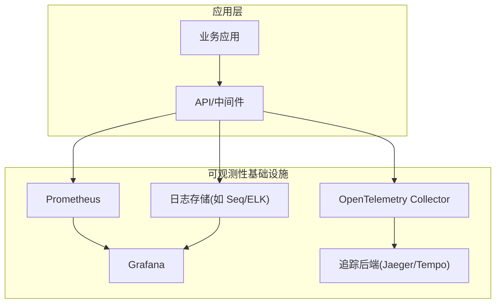
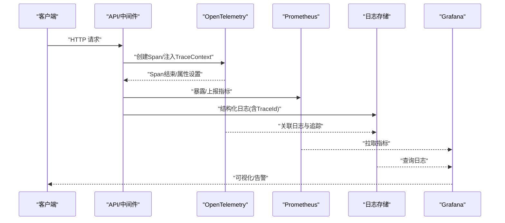
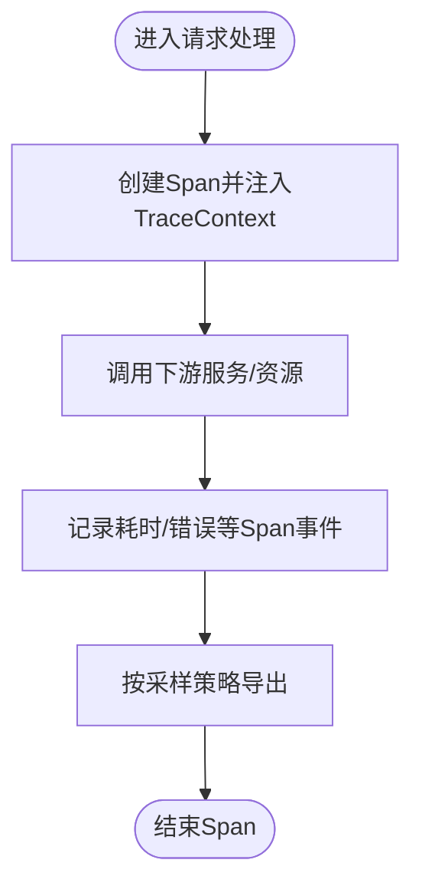
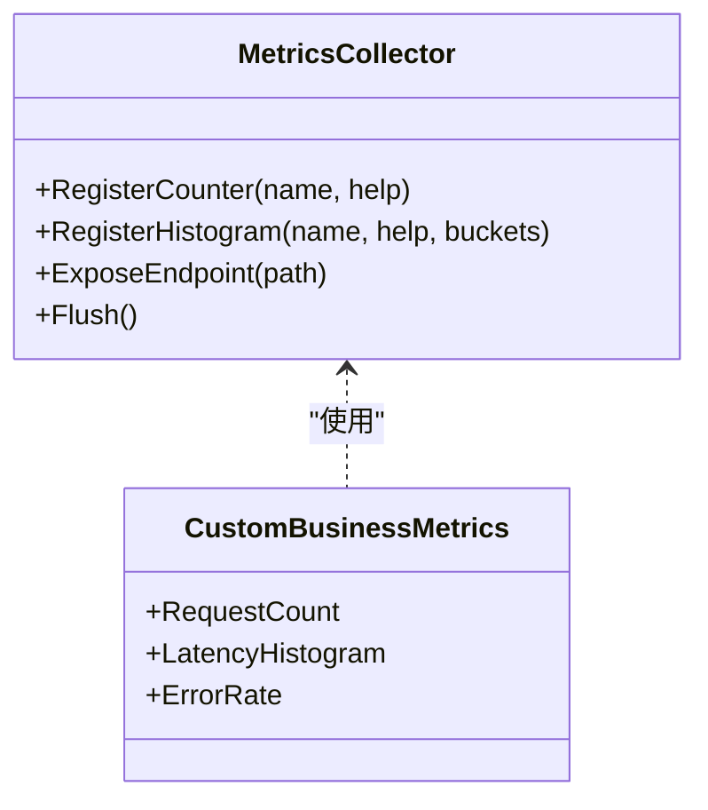
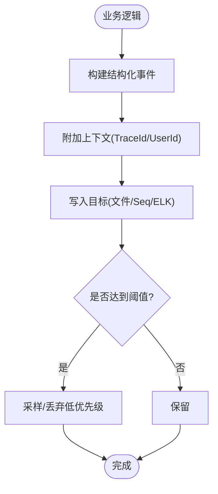
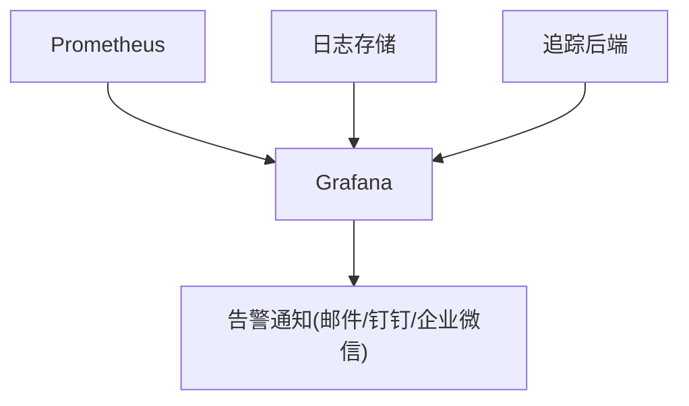
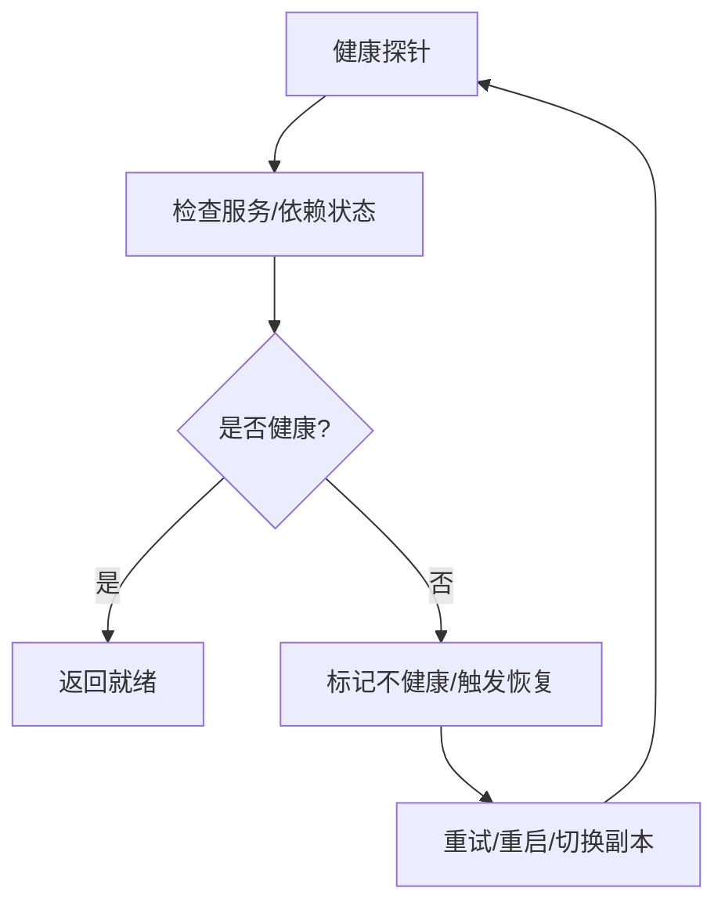
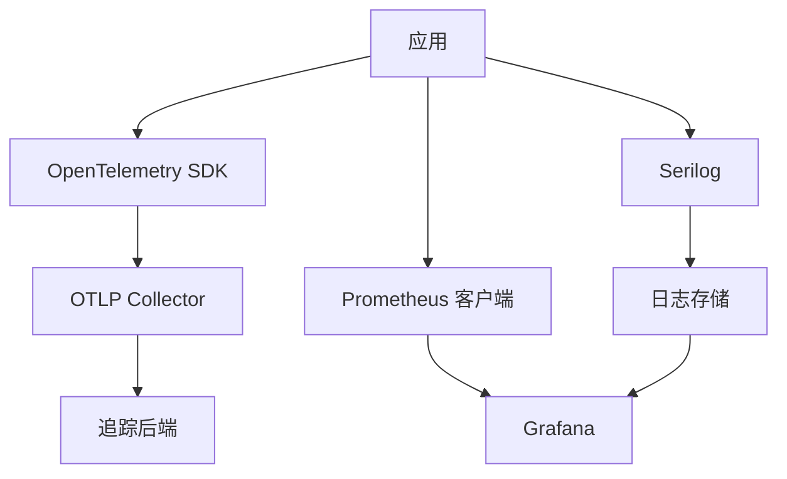

# 监控与可观测性

<cite>
**本文引用的文件**   
- [opentelemetry_integration.cs](file://opentelemetry_integration.cs)
- [opentelemetry_production.cs](file://opentelemetry_production.cs)
- [opentelemetry_prometheus.cs](file://opentelemetry_prometheus.cs)
- [prometheus_metrics.cs](file://prometheus_metrics.cs)
- [prometheus_integration.cs](file://prometheus_integration.cs)
- [serilog_integration.cs](file://serilog_integration.cs)
- [grafana_integration.cs](file://grafana_integration.cs)
- [alert_rules.cs](file://alert_rules.cs)
- [metrics_monitoring.cs](file://metrics_monitoring.cs)
- [performance_metrics.cs](file://performance_metrics.cs)
- [tracing_extension.cs](file://tracing_extension.cs)
- [appsettings.json](file://appsettings.json)
</cite>

## 目录
1. [简介](#简介)
2. [项目结构](#项目结构)
3. [核心组件](#核心组件)
4. [架构总览](#架构总览)
5. [详细组件分析](#详细组件分析)
6. [依赖关系分析](#依赖关系分析)
7. [性能考量](#性能考量)
8. [故障排查指南](#故障排查指南)
9. [结论](#结论)
10. [附录](#附录)

## 简介
本文件面向生产环境的监控与可观测性体系建设，围绕 OpenTelemetry 分布式追踪、Prometheus 指标采集、Serilog 结构化日志三大支柱，结合 APM、健康检查、告警规则配置与日志聚合，给出端到端方案。文档同时覆盖 Grafana 可视化仪表板、异常检测与性能瓶颈定位方法，并提供容量规划与故障排查策略，帮助团队在复杂微服务环境中快速定位问题、保障稳定性与性能。

## 项目结构
仓库中包含大量与可观测性相关的示例与集成代码，重点涉及：
- OpenTelemetry 集成与生产化配置（追踪、日志、指标）
- Prometheus 指标暴露与采集
- Serilog 结构化日志记录与输出
- Grafana 可视化与告警联动
- 性能指标与健康检查

[本图为概念性架构图，不直接映射具体源码文件]

## 核心组件
- OpenTelemetry 分布式追踪：统一埋点、跨进程链路传播、采样与导出
- Prometheus 指标收集：HTTP 指标端点、自定义业务指标、系统与应用指标
- Serilog 结构化日志：按级别、上下文、相关ID进行结构化输出
- Grafana 可视化：指标、日志、追踪的统一视图与告警
- 健康检查与告警：服务可用性探针、阈值告警、异常检测

**章节来源**
- [opentelemetry_integration.cs:1-200](file://opentelemetry_integration.cs#L1-L200)
- [prometheus_metrics.cs:1-200](file://prometheus_metrics.cs#L1-L200)
- [serilog_integration.cs:1-200](file://serilog_integration.cs#L1-L200)
- [grafana_integration.cs:1-200](file://grafana_integration.cs#L1-L200)

## 架构总览
下图展示从应用请求到指标、日志、追踪的完整数据流，以及 Grafana 的统一可视化和告警闭环。

**图表来源**
- [opentelemetry_integration.cs:1-200](file://opentelemetry_integration.cs#L1-L200)
- [prometheus_metrics.cs:1-200](file://prometheus_metrics.cs#L1-L200)
- [serilog_integration.cs:1-200](file://serilog_integration.cs#L1-L200)
- [grafana_integration.cs:1-200](file://grafana_integration.cs#L1-L200)

## 详细组件分析

### OpenTelemetry 分布式追踪
- 功能要点
  - 自动/手动埋点：HTTP、数据库、消息队列等常见组件
  - TraceContext 传播：跨服务链路关联
  - 采样策略：降低开销的同时保留关键路径
  - 导出器：OTLP 协议对接 Collector 或直连后端
- 生产建议
  - 启用基于百分比与阈值的混合采样
  - 为关键业务操作添加自定义 Span 与属性
  - 避免在高频路径中写入过多 Span 属性

**图表来源**
- [opentelemetry_integration.cs:1-200](file://opentelemetry_integration.cs#L1-L200)
- [tracing_extension.cs:1-200](file://tracing_extension.cs#L1-L200)

**章节来源**
- [opentelemetry_integration.cs:1-200](file://opentelemetry_integration.cs#L1-L200)
- [opentelemetry_production.cs:1-200](file://opentelemetry_production.cs#L1-L200)
- [tracing_extension.cs:1-200](file://tracing_extension.cs#L1-L200)

### Prometheus 指标收集
- 功能要点
  - HTTP 指标端点：默认 /metrics
  - 内置指标：运行时、HTTP、线程池、GC 等
  - 自定义指标：计数器、直方图、摘要、仪表盘
- 生产建议
  - 合理设置标签维度，避免高基数导致内存膨胀
  - 使用直方图记录延迟分布，分位数用于 SLO
  - 定期评估指标体积与抓取频率

**图表来源**
- [prometheus_metrics.cs:1-200](file://prometheus_metrics.cs#L1-L200)
- [prometheus_integration.cs:1-200](file://prometheus_integration.cs#L1-L200)

**章节来源**
- [prometheus_metrics.cs:1-200](file://prometheus_metrics.cs#L1-L200)
- [prometheus_integration.cs:1-200](file://prometheus_integration.cs#L1-L200)
- [metrics_monitoring.cs:1-200](file://metrics_monitoring.cs#L1-L200)

### Serilog 结构化日志
- 功能要点
  - 结构化字段：用户、租户、TraceId、SpanId 等
  - 分级输出：Debug/Information/Warning/Error/Critical
  - 多目标输出：控制台、文件、Seq/ELK、远程服务
- 生产建议
  - 避免敏感信息入日志；对大对象进行脱敏
  - 使用 CorrelationId 串联日志与追踪
  - 控制日志级别与采样，减少 I/O 压力

**图表来源**
- [serilog_integration.cs:1-200](file://serilog_integration.cs#L1-L200)

**章节来源**
- [serilog_integration.cs:1-200](file://serilog_integration.cs#L1-L200)

### Grafana 可视化与告警
- 功能要点
  - 数据源接入：Prometheus、日志存储、追踪后端
  - 仪表板：APM 概览、服务健康、延迟分布、错误率
  - 告警规则：阈值、变化率、异常检测
- 生产建议
  - 分层设计：全局、服务、实例级仪表板
  - 告警收敛：去重、抑制、升级策略
  - 将追踪 ID 嵌入日志与指标，实现一键下钻

**图表来源**
- [grafana_integration.cs:1-200](file://grafana_integration.cs#L1-L200)

**章节来源**
- [grafana_integration.cs:1-200](file://grafana_integration.cs#L1-L200)
- [alert_rules.cs:1-200](file://alert_rules.cs#L1-L200)

### 健康检查与 APM
- 功能要点
  - 健康检查端点：存活(liveness)、就绪(readiness)
  - APM 指标：QPS、延迟、错误率、饱和度
  - 自愈策略：重启、降级、熔断
- 生产建议
  - 健康检查需轻量且准确，避免误报
  - 结合外部依赖状态（DB、缓存、消息队列）
  - 通过编排平台自动恢复

**图表来源**
- [performance_metrics.cs:1-200](file://performance_metrics.cs#L1-L200)

**章节来源**
- [performance_metrics.cs:1-200](file://performance_metrics.cs#L1-L200)

## 依赖关系分析
- 组件耦合
  - 应用通过中间件/SDK 接入 OpenTelemetry、Prometheus、Serilog
  - Grafana 作为消费端，依赖 Prometheus、日志存储、追踪后端
- 外部依赖
  - OTLP Collector、Prometheus、日志存储、追踪后端
  - 告警通道（邮件、IM）

**图表来源**
- [opentelemetry_integration.cs:1-200](file://opentelemetry_integration.cs#L1-L200)
- [prometheus_metrics.cs:1-200](file://prometheus_metrics.cs#L1-L200)
- [serilog_integration.cs:1-200](file://serilog_integration.cs#L1-L200)
- [grafana_integration.cs:1-200](file://grafana_integration.cs#L1-L200)

**章节来源**
- [opentelemetry_integration.cs:1-200](file://opentelemetry_integration.cs#L1-L200)
- [prometheus_metrics.cs:1-200](file://prometheus_metrics.cs#L1-L200)
- [serilog_integration.cs:1-200](file://serilog_integration.cs#L1-L200)
- [grafana_integration.cs:1-200](file://grafana_integration.cs#L1-L200)

## 性能考量
- 追踪开销
  - 采样率与 Span 属性数量直接影响 CPU/内存
  - 避免在热路径中频繁创建 Span
- 指标体积
  - 控制标签基数，避免高基数导致内存增长
  - 选择合适的统计类型（计数器/直方图/摘要）
- 日志 I/O
  - 异步写入、批量落盘、限流与采样
  - 脱敏与压缩以减少带宽与存储

[本节为通用指导，不直接分析具体文件]

## 故障排查指南
- 快速定位
  - 通过 TraceId 串联日志与追踪，快速还原调用链
  - 使用 Grafana 查看错误率、延迟分布与资源占用
- 常见问题
  - 指标缺失：检查 /metrics 端点与抓取配置
  - 追踪丢失：确认 TraceContext 传播与采样策略
  - 日志丢失：检查写入目标与权限、磁盘空间
- 告警联动
  - 定义关键 SLO 告警（错误率、延迟、饱和度）
  - 告警收敛与升级，避免告警风暴

**章节来源**
- [alert_rules.cs:1-200](file://alert_rules.cs#L1-L200)
- [metrics_monitoring.cs:1-200](file://metrics_monitoring.cs#L1-L200)

## 结论
通过 OpenTelemetry、Prometheus、Serilog 与 Grafana 的组合，可以构建覆盖追踪、指标、日志的一体化可观测性体系。在生产环境中，应重视采样与基数控制、健康检查与自愈、告警收敛与演练，确保系统在复杂场景下的稳定性与可维护性。

[本节为总结性内容，不直接分析具体文件]

## 附录
- 配置参考
  - appsettings.json：包含连接字符串、采样率、日志级别等关键配置项
- 最佳实践清单
  - 统一 TraceId 贯穿全链路
  - 指标标签规范化与命名约定
  - 日志模板标准化与脱敏策略
  - 告警规则分层与验证

**章节来源**
- [appsettings.json:1-200](file://appsettings.json#L1-L200)