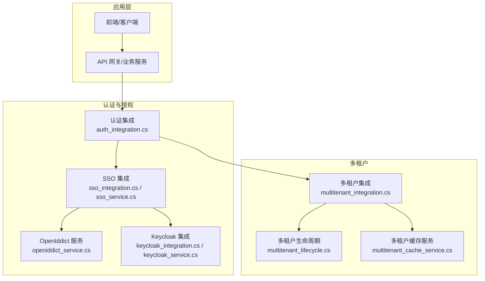
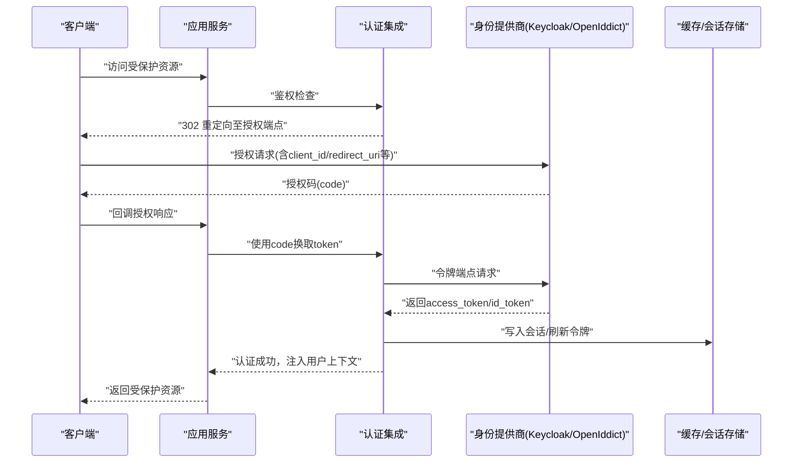
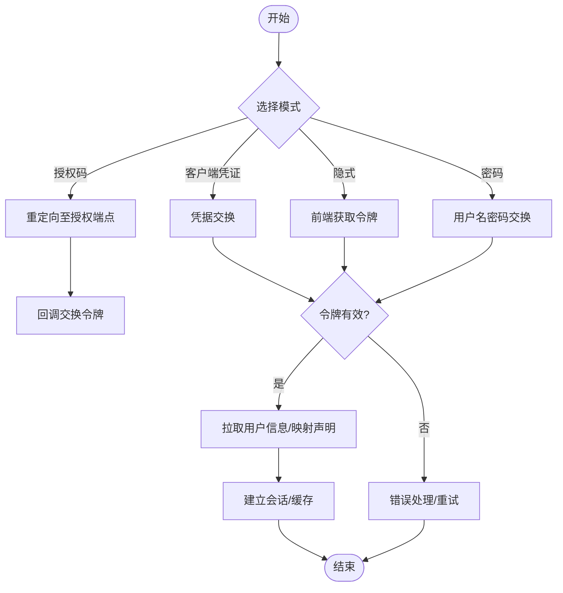
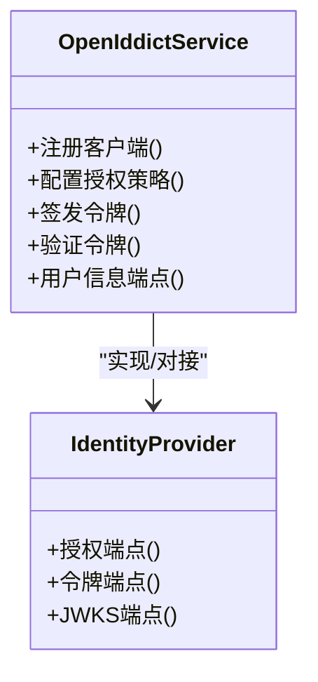
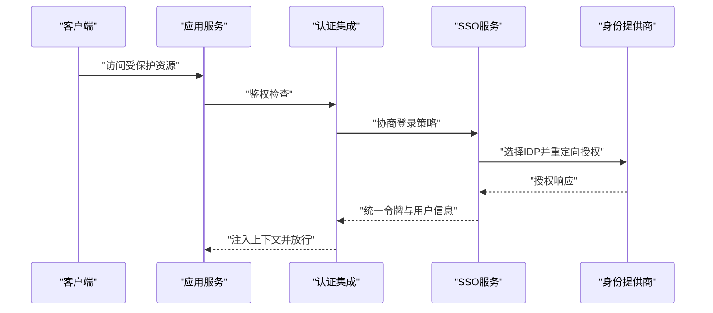
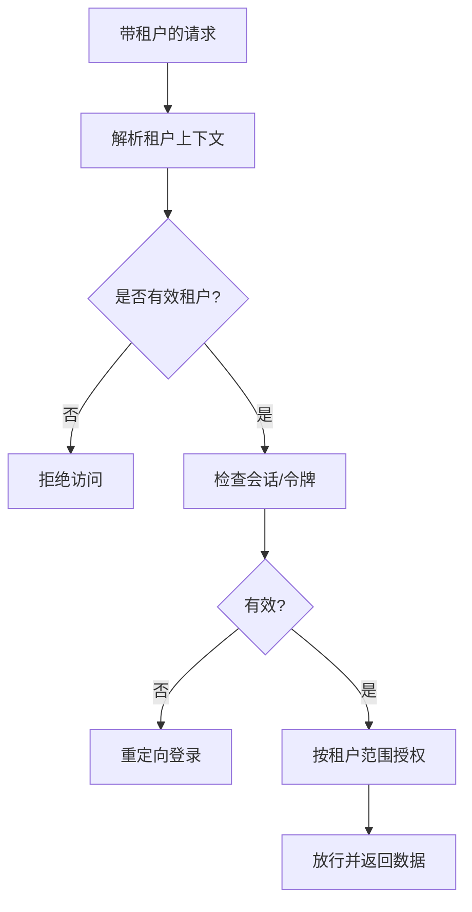
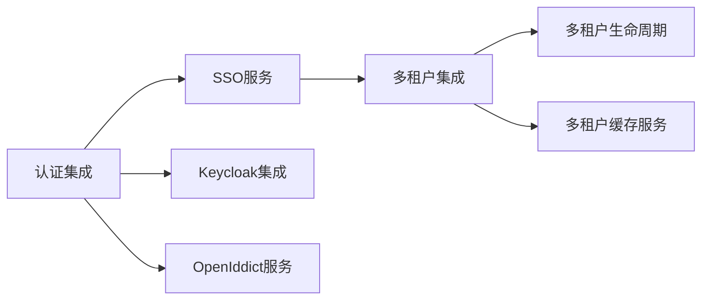

# OAuth2/OIDC协议集成

<cite>
**本文引用的文件**   
- [keycloak_integration.cs](file://keycloak_integration.cs)
- [keycloak_service.cs](file://keycloak_service.cs)
- [openiddict_service.cs](file://openiddict_service.cs)
- [auth_integration.cs](file://auth_integration.cs)
- [identity_integration.cs](file://identity_integration.cs)
- [sso_integration.cs](file://sso_integration.cs)
- [sso_service.cs](file://sso_service.cs)
- [multitenant_integration.cs](file://multitenant_integration.cs)
- [multitenant_lifecycle.cs](file://multitenant_lifecycle.cs)
- [multitenant_cache_service.cs](file://multitenant_cache_service.cs)
</cite>

## 目录
1. [简介](#简介)
2. [项目结构](#项目结构)
3. [核心组件](#核心组件)
4. [架构总览](#架构总览)
5. [详细组件分析](#详细组件分析)
6. [依赖关系分析](#依赖关系分析)
7. [性能考虑](#性能考虑)
8. [故障排查指南](#故障排查指南)
9. [结论](#结论)
10. [附录](#附录)

## 简介
本文件面向在 .NET 应用中集成 OAuth2 与 OpenID Connect（OIDC）的开发者，提供从协议模式、身份提供商（Keycloak、IdentityServer/OpenIddict）配置到多租户隔离、会话管理、错误处理与安全最佳实践的系统化说明。文档基于仓库中已有的认证与身份相关实现进行提炼与归纳，帮助读者快速落地生产级方案。

## 项目结构
围绕 OAuth2/OIDC 的集成点主要分布在以下文件：
- Keycloak 集成与服务封装
- OpenIddict（IdentityServer 替代/兼容）服务
- 通用认证集成与 SSO 能力
- 身份扩展与声明映射
- 多租户上下文与会话隔离

图表来源
- [auth_integration.cs](file://auth_integration.cs)
- [sso_integration.cs](file://sso_integration.cs)
- [sso_service.cs](file://sso_service.cs)
- [openiddict_service.cs](file://openiddict_service.cs)
- [keycloak_integration.cs](file://keycloak_integration.cs)
- [keycloak_service.cs](file://keycloak_service.cs)
- [multitenant_integration.cs](file://multitenant_integration.cs)
- [multitenant_lifecycle.cs](file://multitenant_lifecycle.cs)
- [multitenant_cache_service.cs](file://multitenant_cache_service.cs)

章节来源
- [auth_integration.cs](file://auth_integration.cs)
- [sso_integration.cs](file://sso_integration.cs)
- [openiddict_service.cs](file://openiddict_service.cs)
- [keycloak_integration.cs](file://keycloak_integration.cs)
- [multitenant_integration.cs](file://multitenant_integration.cs)

## 核心组件
- 认证集成模块：统一接入 OAuth2/OIDC 流程，负责授权端点、令牌校验、用户信息获取与声明映射。
- SSO 集成与服务：抽象跨域/跨应用的单点登录流程，支持多种身份提供商适配。
- OpenIddict 服务：本地或内网部署的身份提供者，承载客户端注册、策略与令牌签发。
- Keycloak 集成：对接外部 Keycloak 实例，完成发现、授权码交换、签名验证与用户信息拉取。
- 多租户能力：按租户隔离身份上下文、会话与缓存，确保权限与数据边界清晰。

章节来源
- [auth_integration.cs](file://auth_integration.cs)
- [sso_integration.cs](file://sso_integration.cs)
- [sso_service.cs](file://sso_service.cs)
- [openiddict_service.cs](file://openiddict_service.cs)
- [keycloak_integration.cs](file://keycloak_integration.cs)
- [keycloak_service.cs](file://keycloak_service.cs)
- [multitenant_integration.cs](file://multitenant_integration.cs)

## 架构总览
下图展示典型请求流：客户端通过浏览器或后端服务发起访问，应用侧认证中间件将未认证请求重定向至身份提供商；完成授权后回调应用，交换令牌并建立会话；后续请求携带令牌由应用侧校验并注入用户上下文。

图表来源
- [auth_integration.cs](file://auth_integration.cs)
- [sso_service.cs](file://sso_service.cs)
- [keycloak_service.cs](file://keycloak_service.cs)
- [openiddict_service.cs](file://openiddict_service.cs)

## 详细组件分析

### Keycloak 集成
- 功能要点
  - 动态发现元数据（/.well-known/openid-configuration）
  - 授权码模式与隐式模式的客户端配置
  - 客户端凭证模式用于服务间调用
  - 密码模式（谨慎使用，仅限可信内部场景）
  - JWK 公钥缓存与签名校验
  - 用户信息端点与自定义声明映射
- 关键流程
  - 授权码模式：重定向授权 -> 回调交换令牌 -> 拉取用户信息 -> 建立会话
  - 客户端凭证模式：直接凭据交换 -> 获取访问令牌 -> 调用下游 API
  - 隐式模式：前端直接获取令牌（不推荐，优先使用授权码+PKCE）
  - 密码模式：用户名密码直换令牌（需严格限制）
- 安全建议
  - 强制 HTTPS、启用 PKCE、最小权限范围
  - 校验 token 签名与过期时间，缓存 JWK
  - 对敏感操作二次确认与审计

图表来源
- [keycloak_integration.cs](file://keycloak_integration.cs)
- [keycloak_service.cs](file://keycloak_service.cs)

章节来源
- [keycloak_integration.cs](file://keycloak_integration.cs)
- [keycloak_service.cs](file://keycloak_service.cs)

### OpenIddict（IdentityServer）服务
- 功能要点
  - 客户端注册、授权策略与范围定义
  - 支持授权码、隐式、客户端凭证、密码等模式
  - 自定义声明与用户信息端点扩展
  - 与 ASP.NET Core 认证管线集成
- 关键流程
  - 服务端启动时加载客户端与策略
  - 授权端点处理请求并签发令牌
  - 资源服务器校验令牌并解析用户上下文
- 安全建议
  - 严格限定 redirect_uri、scope
  - 启用强加密算法与密钥轮换
  - 记录审计日志与异常告警

图表来源
- [openiddict_service.cs](file://openiddict_service.cs)

章节来源
- [openiddict_service.cs](file://openiddict_service.cs)

### 认证集成与 SSO
- 认证集成
  - 统一入口处理不同 IDP 的授权流程
  - 标准化令牌校验、声明映射与用户上下文构建
  - 支持 Cookie 会话与无状态 JWT 混合模式
- SSO 集成
  - 跨应用/跨域的单点登录协调
  - 会话桥接与注销传播
  - 多 IDP 路由与回退策略

图表来源
- [auth_integration.cs](file://auth_integration.cs)
- [sso_integration.cs](file://sso_integration.cs)
- [sso_service.cs](file://sso_service.cs)

章节来源
- [auth_integration.cs](file://auth_integration.cs)
- [sso_integration.cs](file://sso_integration.cs)
- [sso_service.cs](file://sso_service.cs)

### 多租户身份隔离与会话管理
- 身份隔离
  - 基于租户标识区分用户、角色与权限
  - 按租户隔离令牌、会话与缓存键空间
- 会话管理
  - 支持分布式会话与本地缓存结合
  - 会话续期、并发控制与注销广播
- 缓存策略
  - 租户级缓存隔离与失效策略
  - 高频读取数据的本地缓存与一致性保障

图表来源
- [multitenant_integration.cs](file://multitenant_integration.cs)
- [multitenant_lifecycle.cs](file://multitenant_lifecycle.cs)
- [multitenant_cache_service.cs](file://multitenant_cache_service.cs)

章节来源
- [multitenant_integration.cs](file://multitenant_integration.cs)
- [multitenant_lifecycle.cs](file://multitenant_lifecycle.cs)
- [multitenant_cache_service.cs](file://multitenant_cache_service.cs)

## 依赖关系分析
- 组件耦合
  - 认证集成依赖 SSO 服务与具体 IDP 适配器（Keycloak/OpenIddict）
  - SSO 服务依赖认证集成与租户上下文
  - 多租户能力贯穿认证与会话层，影响缓存与存储键空间
- 外部依赖
  - Keycloak 元数据与 JWKS 端点
  - OpenIddict 授权与令牌端点
  - 缓存/会话存储（内存、Redis 等）

图表来源
- [auth_integration.cs](file://auth_integration.cs)
- [sso_integration.cs](file://sso_integration.cs)
- [sso_service.cs](file://sso_service.cs)
- [keycloak_integration.cs](file://keycloak_integration.cs)
- [openiddict_service.cs](file://openiddict_service.cs)
- [multitenant_integration.cs](file://multitenant_integration.cs)
- [multitenant_lifecycle.cs](file://multitenant_lifecycle.cs)
- [multitenant_cache_service.cs](file://multitenant_cache_service.cs)

章节来源
- [auth_integration.cs](file://auth_integration.cs)
- [sso_integration.cs](file://sso_integration.cs)
- [keycloak_integration.cs](file://keycloak_integration.cs)
- [openiddict_service.cs](file://openiddict_service.cs)
- [multitenant_integration.cs](file://multitenant_integration.cs)

## 性能考虑
- 令牌与元数据缓存
  - 缓存 JWKS、发现文档与用户信息，降低网络开销
  - 设置合理 TTL 与失效策略，避免雪崩
- 会话与缓存
  - 使用分布式会话与本地缓存分层
  - 按租户隔离键空间，减少锁竞争
- 并发与限流
  - 令牌端点与用户信息端点加限流与熔断
  - 异步 IO 与连接池优化
- 监控与追踪
  - 指标采集（延迟、错误率、QPS）
  - 链路追踪定位瓶颈

[本节为通用指导，无需特定文件引用]

## 故障排查指南
- 常见问题
  - 授权回调失败：检查 redirect_uri、state 校验与 CSRF
  - 令牌无效：核对签名、过期时间与受众
  - 用户信息缺失：确认 scope 与声明映射
  - 多租户冲突：检查租户上下文与缓存键隔离
- 调试步骤
  - 启用详细日志与审计
  - 抓包分析授权与令牌端点交互
  - 逐步禁用缓存与中间件定位问题
- 恢复策略
  - 自动重试与指数退避
  - 降级到备用 IDP 或只读模式
  - 清理异常会话与缓存

章节来源
- [auth_integration.cs](file://auth_integration.cs)
- [sso_service.cs](file://sso_service.cs)
- [keycloak_service.cs](file://keycloak_service.cs)

## 结论
通过统一的认证集成与 SSO 服务，结合 Keycloak 与 OpenIddict 的能力，可在 .NET 应用中实现稳定、安全的 OAuth2/OIDC 集成。配合多租户隔离与会话管理，满足企业级复杂场景需求。遵循安全最佳实践与性能优化策略，可显著提升系统的可靠性与用户体验。

[本节为总结性内容，无需特定文件引用]

## 附录
- 协议模式速查
  - 授权码模式：推荐用于 Web 与移动端，结合 PKCE
  - 隐式模式：仅前端直接获取令牌（不推荐）
  - 客户端凭证模式：服务间调用，最小权限
  - 密码模式：谨慎使用，仅限可信内部
- 标准扩展与自定义声明
  - 使用标准 claim（sub、name、email 等）
  - 自定义声明映射到应用模型
  - 用户信息端点按需扩展
- 多租户最佳实践
  - 租户标识不可信输入，必须校验
  - 会话与缓存键前缀隔离
  - 权限与数据作用域按租户限定

[本节为概念性内容，无需特定文件引用]