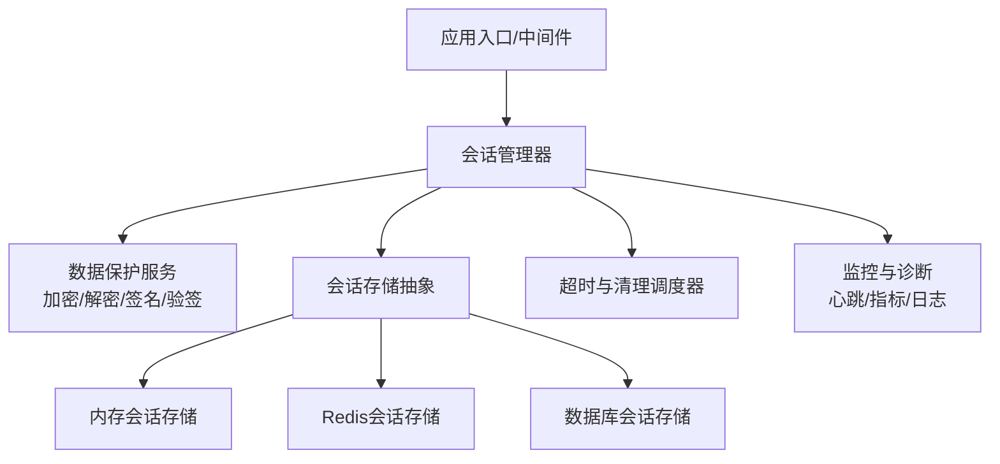
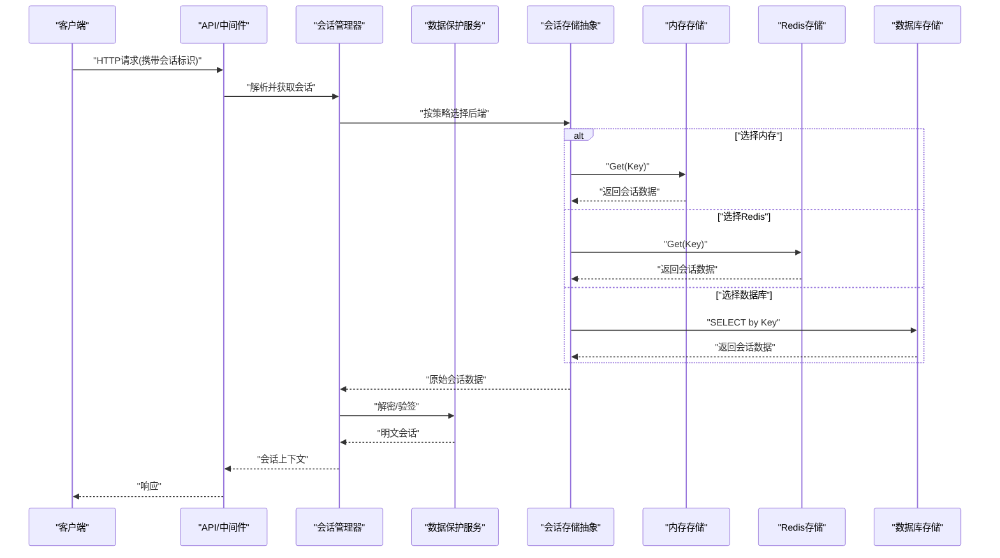
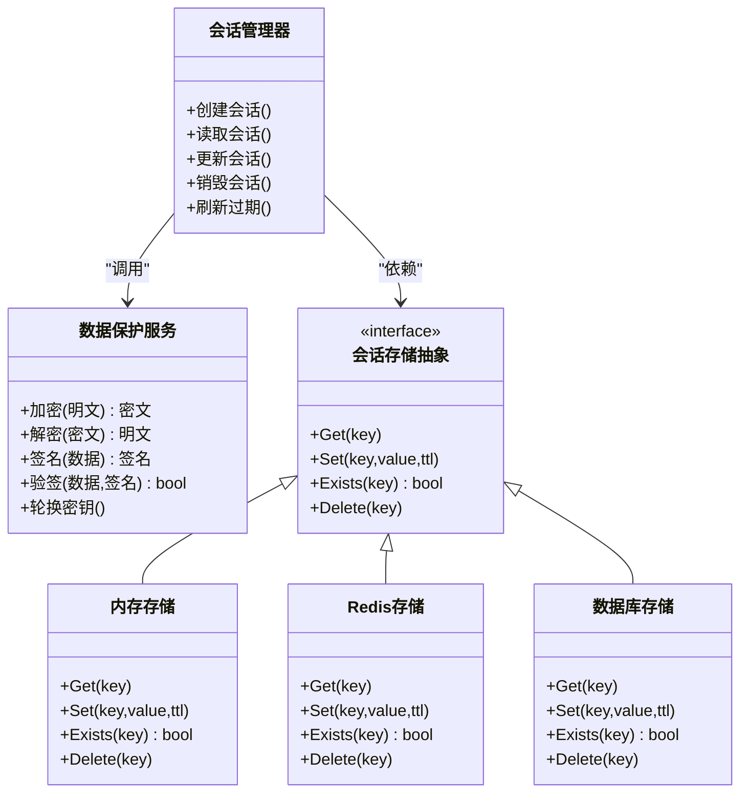

# 会话管理与状态持久化

<cite>
**本文引用的文件**   
- [README.md](file://README.md)
- [appsettings.json](file://appsettings.json)
- [dataprotection_integration.cs](file://dataprotection_integration.cs)
- [distributed_memory.cs](file://distributed_memory.cs)
- [stackexchange_redis_cache.cs](file://stackexchange_redis_cache.cs)
- [signalr_production.cs](file://signalr_production.cs)
- [cache_heartbeat_integration.cs](file://cache_heartbeat_integration.cs)
- [memory_leak_detection.cs](file://memory_leak_detection.cs)
</cite>

## 目录
1. [简介](#简介)
2. [项目结构](#项目结构)
3. [核心组件](#核心组件)
4. [架构总览](#架构总览)
5. [详细组件分析](#详细组件分析)
6. [依赖关系分析](#依赖关系分析)
7. [性能考量](#性能考量)
8. [故障排查指南](#故障排查指南)
9. [结论](#结论)
10. [附录](#附录)

## 简介
本文件围绕“会话管理与状态持久化”展开，聚焦以下目标：
- 服务端会话存储与共享（内存、Redis、数据库）
- 分布式会话一致性、并发控制与清理策略
- 会话安全机制（加密、防篡改、密钥轮换）
- 超时管理、迁移升级与故障恢复
- 结合数据保护API实现会话数据的机密性与完整性保障

本仓库为示例集合型工程，包含多种集成方案。本文将基于现有代码片段与配置，给出可落地的架构设计与实施建议，并标注具体源码位置以便进一步查阅。

## 项目结构
从仓库结构看，会话与状态相关能力分布在多个独立示例文件中，涵盖：
- 数据保护与加密：用于会话加密与签名
- 分布式缓存与会话后端：内存、Redis等
- SignalR生产级配置：用于在线会话与连接状态
- 心跳与健康检查：用于会话存活检测与清理
- 内存泄漏检测：辅助定位会话对象未释放问题

图表来源
- [dataprotection_integration.cs](file://dataprotection_integration.cs)
- [distributed_memory.cs](file://distributed_memory.cs)
- [stackexchange_redis_cache.cs](file://stackexchange_redis_cache.cs)
- [signalr_production.cs](file://signalr_production.cs)
- [cache_heartbeat_integration.cs](file://cache_heartbeat_integration.cs)
- [memory_leak_detection.cs](file://memory_leak_detection.cs)

章节来源
- [README.md](file://README.md)
- [appsettings.json](file://appsettings.json)

## 核心组件
- 会话管理器：统一封装会话创建、读取、更新、销毁；协调存储后端与安全层；处理超时与并发控制。
- 数据保护服务：提供对称加密、非对称签名、密钥版本与轮换，确保会话载荷的机密性与完整性。
- 会话存储抽象：定义Get/Set/Exists/Delete等接口，支持多后端（内存、Redis、数据库）。
- 存储后端实现：
  - 内存会话：进程内字典+过期时间，适合单机或无状态节点本地缓存。
  - Redis会话：跨进程共享，支持TTL、原子操作与高吞吐。
  - 数据库会话：强一致持久化，适合审计与合规场景。
- 超时与清理：基于滑动过期与惰性失效，配合定时任务扫描清理。
- 监控与诊断：心跳上报、健康检查、指标采集与告警。

章节来源
- [dataprotection_integration.cs](file://dataprotection_integration.cs)
- [distributed_memory.cs](file://distributed_memory.cs)
- [stackexchange_redis_cache.cs](file://stackexchange_redis_cache.cs)
- [signalr_production.cs](file://signalr_production.cs)
- [cache_heartbeat_integration.cs](file://cache_heartbeat_integration.cs)
- [memory_leak_detection.cs](file://memory_leak_detection.cs)

## 架构总览
下图展示请求进入后，会话读写在安全层与各存储后端之间的交互流程。

图表来源
- [signalr_production.cs](file://signalr_production.cs)
- [dataprotection_integration.cs](file://dataprotection_integration.cs)
- [distributed_memory.cs](file://distributed_memory.cs)
- [stackexchange_redis_cache.cs](file://stackexchange_redis_cache.cs)

## 详细组件分析

### 数据保护与会话安全
- 功能要点
  - 使用数据保护API对会话载荷进行加密与签名，防止泄露与篡改。
  - 支持密钥版本与轮换，保证历史会话仍可解密或平滑过渡。
  - 将敏感字段最小化暴露，必要时分片加密。
- 关键实现参考
  - 数据保护集成示例：[dataprotection_integration.cs](file://dataprotection_integration.cs)
- 设计建议
  - 会话ID与载荷分离：ID仅做索引，载荷由数据保护服务加密封装。
  - 签名校验失败立即拒绝，避免回退到明文路径。
  - 密钥轮换期间允许双读双写，逐步淘汰旧密钥。

章节来源
- [dataprotection_integration.cs](file://dataprotection_integration.cs)

### 内存会话存储
- 适用场景
  - 单实例部署、开发调试、低延迟读多写少。
- 特性
  - 进程内字典+过期时间，简单高效。
  - 需配合外部注册表或粘性会话实现水平扩展。
- 关键实现参考
  - 分布式内存示例（可作为本地会话容器）：[distributed_memory.cs](file://distributed_memory.cs)
- 并发与一致性
  - 使用线程安全的并发字典与细粒度锁，避免热点键竞争。
  - 惰性失效优先，定期后台扫描清理过期项。

章节来源
- [distributed_memory.cs](file://distributed_memory.cs)

### Redis分布式会话
- 适用场景
  - 多实例共享会话、需要高可用与横向扩展。
- 特性
  - 利用Redis原子操作与TTL实现高吞吐与自动过期。
  - 支持集群与哨兵模式，提升可用性。
- 关键实现参考
  - StackExchange.Redis缓存示例：[stackexchange_redis_cache.cs](file://stackexchange_redis_cache.cs)
- 并发与一致性
  - 使用Lua脚本保证复合操作的原子性。
  - 读写分离时注意主从延迟导致的短暂不一致。

章节来源
- [stackexchange_redis_cache.cs](file://stackexchange_redis_cache.cs)

### 数据库会话存储
- 适用场景
  - 需要强一致、审计追踪与合规归档。
- 特性
  - 通过事务保证写入一致性，支持分页查询与归档。
  - 适合低频写入、高频读的场景，可通过缓存层加速。
- 设计建议
  - 会话表设计：主键（会话ID）、用户ID、载荷密文、签名、过期时间、更新时间戳。
  - 索引优化：会话ID唯一索引，过期时间+更新时间联合索引便于清理。
  - 读写分离：读走只读副本，写走主库。

章节来源
- [signalr_production.cs](file://signalr_production.cs)

### 会话超时与清理策略
- 超时模型
  - 绝对过期：固定生存时间，适合短时会话。
  - 滑动过期：每次访问刷新过期时间，适合长会话。
- 清理策略
  - 惰性失效：首次访问时检查并删除过期项。
  - 定时扫描：周期性扫描过期键并批量删除。
  - 分层清理：先删内存再删持久层，减少IO压力。
- 关键实现参考
  - 心跳与健康检查示例（可用于会话存活探测）：[cache_heartbeat_integration.cs](file://cache_heartbeat_integration.cs)

章节来源
- [cache_heartbeat_integration.cs](file://cache_heartbeat_integration.cs)

### 并发控制与幂等性
- 并发控制
  - 使用分布式锁保护热点会话的写路径，避免覆盖写。
  - 读路径采用乐观锁或版本号比较，冲突时重试。
- 幂等性
  - 会话更新操作附带幂等键，防止重复提交导致状态错乱。
- 关键实现参考
  - 分布式锁与缓存示例：[stackexchange_redis_cache.cs](file://stackexchange_redis_cache.cs)

章节来源
- [stackexchange_redis_cache.cs](file://stackexchange_redis_cache.cs)

### 信号R在线会话与连接状态
- 适用场景
  - 实时通信场景下的在线用户状态、房间成员、消息路由。
- 特性
  - 连接生命周期管理、组播与广播、断线重连。
- 关键实现参考
  - SignalR生产级配置示例：[signalr_production.cs](file://signalr_production.cs)

章节来源
- [signalr_production.cs](file://signalr_production.cs)

### 内存泄漏检测与会话对象治理
- 目标
  - 识别未释放的会话对象、事件订阅未取消、闭包引用等问题。
- 方法
  - 采样堆快照、对象计数趋势、弱引用跟踪。
- 关键实现参考
  - 内存泄漏检测示例：[memory_leak_detection.cs](file://memory_leak_detection.cs)

章节来源
- [memory_leak_detection.cs](file://memory_leak_detection.cs)

## 依赖关系分析
- 组件耦合
  - 会话管理器依赖数据保护服务与会话存储抽象，降低与具体实现的耦合。
  - 存储后端通过接口隔离，便于替换与测试。
- 外部依赖
  - Redis客户端、数据库驱动、SignalR运行时等。
- 潜在循环依赖
  - 避免会话管理器直接依赖具体存储实现，应通过抽象层注入。

图表来源
- [dataprotection_integration.cs](file://dataprotection_integration.cs)
- [distributed_memory.cs](file://distributed_memory.cs)
- [stackexchange_redis_cache.cs](file://stackexchange_redis_cache.cs)

章节来源
- [dataprotection_integration.cs](file://dataprotection_integration.cs)
- [distributed_memory.cs](file://distributed_memory.cs)
- [stackexchange_redis_cache.cs](file://stackexchange_redis_cache.cs)

## 性能考量
- 存储选型
  - 内存：极低延迟，但不可共享；适合本地热数据。
  - Redis：高吞吐、低延迟，适合分布式共享。
  - 数据库：强一致，适合审计与归档，读路径建议缓存。
- 序列化与压缩
  - 选择高效序列化器（如MessagePack），对大负载启用压缩。
- 缓存策略
  - 多级缓存：本地缓存+分布式缓存，命中优先。
- 连接池与限流
  - Redis/DB连接池合理配置，避免连接耗尽。
  - 对热点会话读写进行限流与降级。
- 监控与观测
  - 采集命中率、延迟分布、错误率与资源使用率。

## 故障排查指南
- 常见问题
  - 会话丢失：检查过期策略、清理任务、网络分区与主从延迟。
  - 解密失败：核对密钥版本、算法参数与签名校验逻辑。
  - 性能抖动：关注锁竞争、序列化开销与慢查询。
  - 内存增长：定位未释放会话、事件订阅与闭包引用。
- 排查步骤
  - 查看心跳与健康检查指标，确认会话存活。
  - 抓取Redis/DB慢查询与连接池状态。
  - 使用内存泄漏检测工具定位异常对象。
- 关键实现参考
  - 心跳与健康检查：[cache_heartbeat_integration.cs](file://cache_heartbeat_integration.cs)
  - 内存泄漏检测：[memory_leak_detection.cs](file://memory_leak_detection.cs)

章节来源
- [cache_heartbeat_integration.cs](file://cache_heartbeat_integration.cs)
- [memory_leak_detection.cs](file://memory_leak_detection.cs)

## 结论
通过统一的会话管理器、数据保护服务与多后端存储抽象，可在不同部署形态下实现稳定、安全、高性能的会话管理。结合超时清理、并发控制与监控诊断，能够支撑从单机到分布式、从短时到长时的多样化业务需求。建议在上线前完成容量规划、压测验证与应急预案演练。

## 附录
- 配置建议
  - 在应用配置中集中管理Redis连接串、数据库连接串、数据保护密钥集与过期策略。
  - 参考配置文件样例：[appsettings.json](file://appsettings.json)
- 迁移与升级
  - 灰度切换存储后端，双写校验一致性后再切读。
  - 密钥轮换期间保持兼容，逐步淘汰旧版本。
- 故障恢复
  - 会话数据备份与恢复策略，结合审计日志回放。
  - 降级策略：当Redis不可用时回退至内存或数据库，限制功能范围。

章节来源
- [appsettings.json](file://appsettings.json)