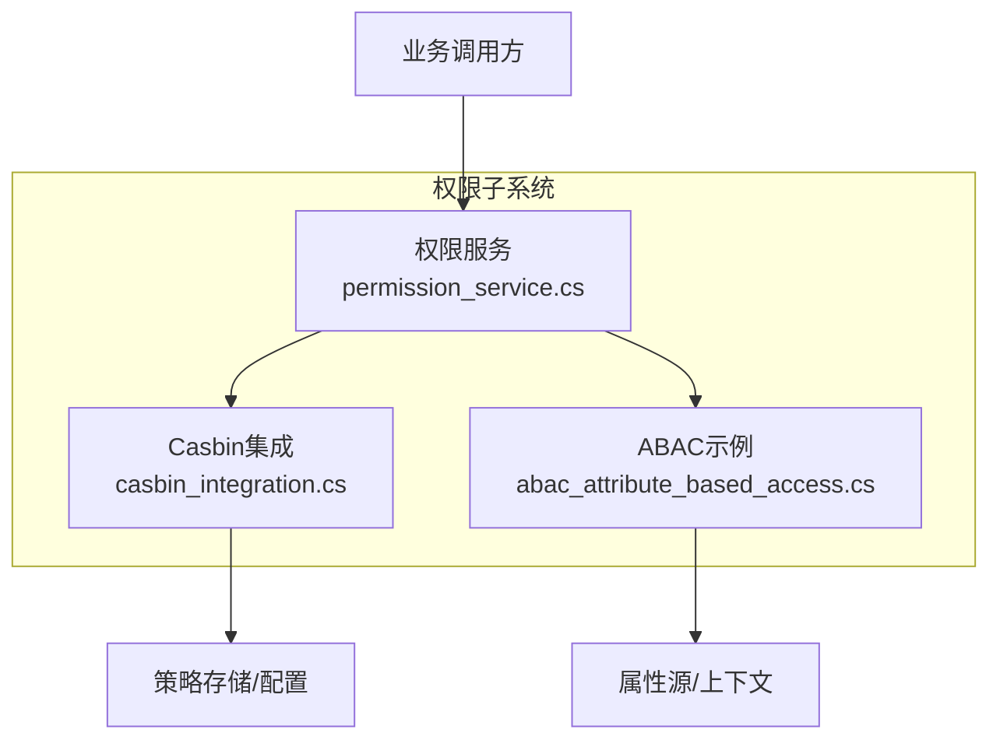
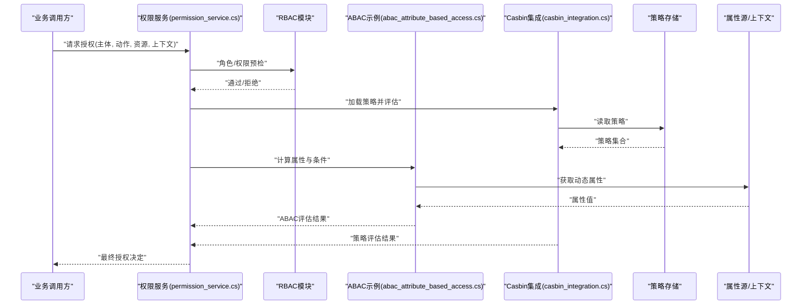
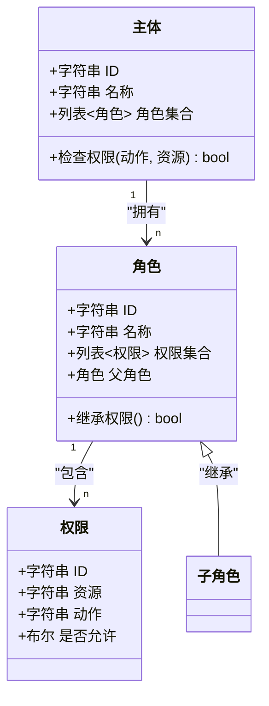
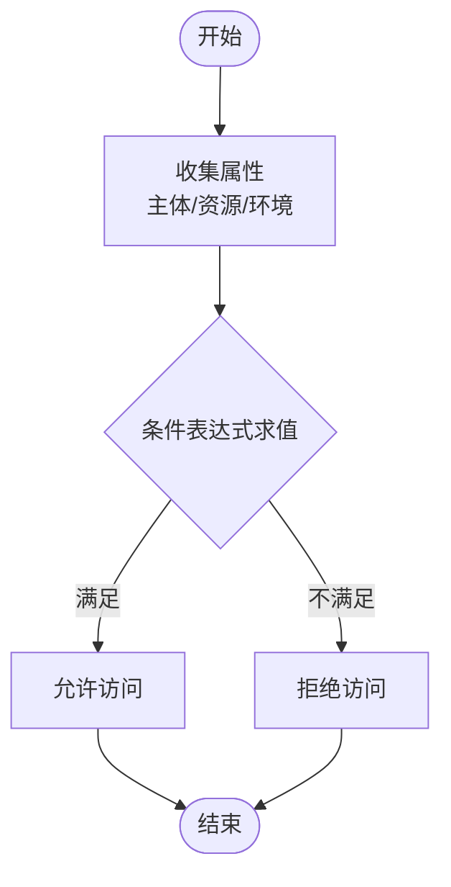
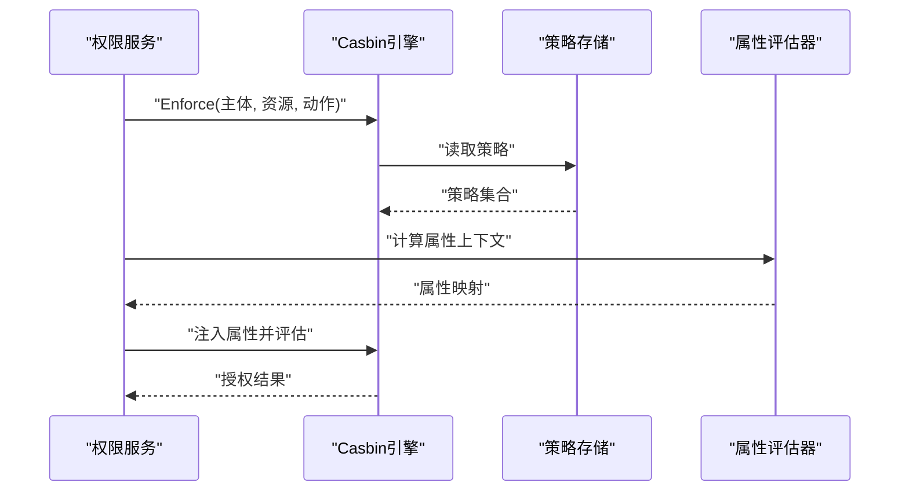
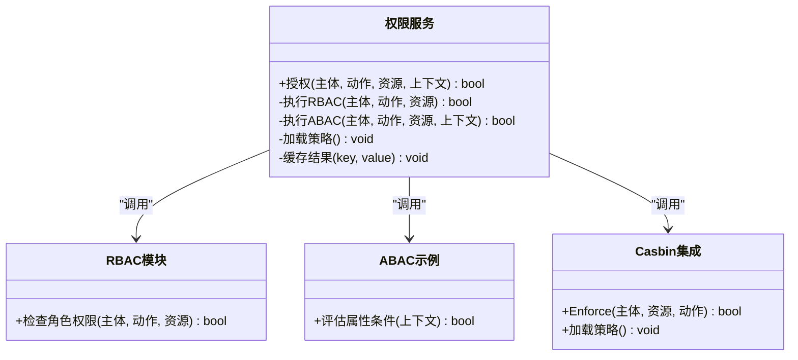
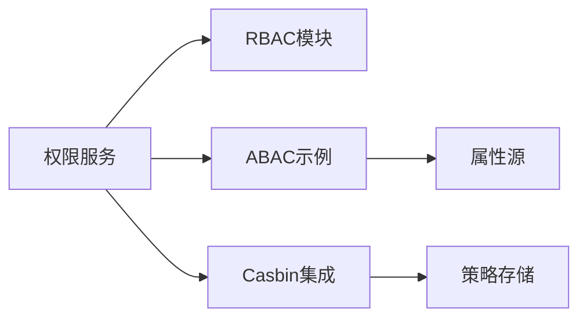

# 基于角色的访问控制(RBAC)与基于属性的访问控制(ABAC)

<cite>
**本文引用的文件**
- [abac_attribute_based_access.cs](file://abac_attribute_based_access.cs)
- [casbin_integration.cs](file://casbin_integration.cs)
- [permission_service.cs](file://permission_service.cs)
</cite>

## 目录
1. [简介](#简介)
2. [项目结构](#项目结构)
3. [核心组件](#核心组件)
4. [架构总览](#架构总览)
5. [详细组件分析](#详细组件分析)
6. [依赖关系分析](#依赖关系分析)
7. [性能考虑](#性能考虑)
8. [故障排查指南](#故障排查指南)
9. [结论](#结论)
10. [附录](#附录)

## 简介
本文件面向需要在系统中实现灵活、可扩展的权限控制的读者，系统性阐述基于角色的访问控制（RBAC）与基于属性的访问控制（ABAC）的设计与实践。内容涵盖角色定义、权限分配、资源访问控制、动态属性评估、复杂条件判断、Casbin策略引擎集成、权限继承与角色层次结构、细粒度授权策略，以及缓存优化与性能调优建议。文档力求在保持技术深度的同时，提供易于理解的说明与可视化图示，帮助不同背景的读者快速掌握并落地实施。

## 项目结构
本项目围绕权限控制提供了三类关键实现：
- ABAC示例实现：展示如何基于对象属性进行动态授权决策。
- Casbin集成：通过策略引擎实现灵活的规则管理与评估。
- 权限服务：封装统一的授权能力，供业务层调用。

**图表来源**
- [abac_attribute_based_access.cs](file://abac_attribute_based_access.cs)
- [casbin_integration.cs](file://casbin_integration.cs)
- [permission_service.cs](file://permission_service.cs)

**章节来源**
- [abac_attribute_based_access.cs](file://abac_attribute_based_access.cs)
- [casbin_integration.cs](file://casbin_integration.cs)
- [permission_service.cs](file://permission_service.cs)

## 核心组件
- ABAC示例：演示如何通过对象的属性与上下文进行动态授权判断，支持复杂条件组合与表达式求值。
- Casbin集成：将策略规则与评估逻辑解耦，便于集中管理、热更新与审计。
- 权限服务：统一入口，聚合RBAC与ABAC能力，对外暴露一致的授权接口，屏蔽内部实现差异。

**章节来源**
- [abac_attribute_based_access.cs](file://abac_attribute_based_access.cs)
- [casbin_integration.cs](file://casbin_integration.cs)
- [permission_service.cs](file://permission_service.cs)

## 架构总览
下图展示了RBAC与ABAC在系统中的协作方式：业务请求进入权限服务后，优先尝试基于角色的粗粒度校验，再结合基于属性的细粒度策略进行最终判定；策略由Casbin统一管理，属性来源于运行时上下文或外部数据源。

**图表来源**
- [permission_service.cs](file://permission_service.cs)
- [abac_attribute_based_access.cs](file://abac_attribute_based_access.cs)
- [casbin_integration.cs](file://casbin_integration.cs)

## 详细组件分析

### 基于角色的访问控制（RBAC）设计
- 角色定义：以“角色”为基本单位，将一组权限抽象为可复用的集合，便于批量授予与撤销。
- 权限分配：支持用户到角色的多对多映射，角色到权限的多对多映射，形成清晰的职责边界。
- 资源访问控制：在资源维度上定义操作类型（如读、写、删除），并通过角色权限集进行匹配。
- 权限继承与层次结构：通过角色层级实现权限继承，减少重复配置，提升可维护性。
- 细粒度授权：在RBAC基础上叠加ABAC，实现更精细的条件控制。

**图表来源**
- [permission_service.cs](file://permission_service.cs)

**章节来源**
- [permission_service.cs](file://permission_service.cs)

### 基于属性的访问控制（ABAC）策略
- 动态属性评估：从请求上下文、资源对象、环境信息中抽取属性，进行实时计算。
- 复杂条件判断：支持逻辑组合、范围比较、时间窗口、IP白名单等条件。
- 策略与代码解耦：将条件表达式与评估器分离，便于扩展与维护。
- 与RBAC协同：先做角色层面的粗过滤，再用ABAC进行细粒度裁决。

**图表来源**
- [abac_attribute_based_access.cs](file://abac_attribute_based_access.cs)

**章节来源**
- [abac_attribute_based_access.cs](file://abac_attribute_based_access.cs)

### Casbin策略引擎集成
- 策略模型：采用标准策略格式，定义主体、资源、动作及是否允许的三元组。
- 策略存储：支持内存、文件、数据库等多种后端，便于持久化与热更新。
- 评估流程：在权限服务中调用Casbin进行策略匹配，结合ABAC属性注入进行动态评估。
- 审计与监控：记录策略变更与评估结果，便于问题定位与合规审计。

**图表来源**
- [casbin_integration.cs](file://casbin_integration.cs)
- [permission_service.cs](file://permission_service.cs)

**章节来源**
- [casbin_integration.cs](file://casbin_integration.cs)
- [permission_service.cs](file://permission_service.cs)

### 权限服务（统一授权入口）
- 职责：聚合RBAC与ABAC能力，提供一致的授权API；负责策略加载、属性注入、结果合并与缓存。
- 设计要点：
  - 分层评估：先RBAC后ABAC，提高命中率与性能。
  - 错误处理：对策略缺失、属性异常等情况进行兜底与告警。
  - 可观测性：输出评估耗时、命中策略、失败原因等指标。

**图表来源**
- [permission_service.cs](file://permission_service.cs)
- [abac_attribute_based_access.cs](file://abac_attribute_based_access.cs)
- [casbin_integration.cs](file://casbin_integration.cs)

**章节来源**
- [permission_service.cs](file://permission_service.cs)
- [abac_attribute_based_access.cs](file://abac_attribute_based_access.cs)
- [casbin_integration.cs](file://casbin_integration.cs)

## 依赖关系分析
- 松耦合：权限服务作为门面，RBAC、ABAC、Casbin之间通过接口交互，降低耦合度。
- 可扩展：新增属性或策略时，无需改动权限服务主流程。
- 潜在循环：确保RBAC与ABAC不互相依赖，避免循环引用。
- 外部依赖：Casbin策略存储可能依赖文件系统或数据库，需保证可用性。

**图表来源**
- [permission_service.cs](file://permission_service.cs)
- [abac_attribute_based_access.cs](file://abac_attribute_based_access.cs)
- [casbin_integration.cs](file://casbin_integration.cs)

**章节来源**
- [permission_service.cs](file://permission_service.cs)
- [abac_attribute_based_access.cs](file://abac_attribute_based_access.cs)
- [casbin_integration.cs](file://casbin_integration.cs)

## 性能考虑
- 缓存策略：
  - 结果缓存：对高频请求的授权结果进行短期缓存，键包含主体、动作、资源与关键属性摘要。
  - 策略缓存：策略变更后失效相关缓存，避免脏读。
  - 局部缓存：按租户或业务域划分缓存空间，减少冲突。
- 评估顺序：
  - 先RBAC后ABAC，利用角色快速排除大量非法请求。
  - 将高命中率的ABAC条件前置，减少表达式求值开销。
- 异步与批处理：
  - 非关键路径的属性采集可异步进行。
  - 批量授权场景下合并评估，减少重复计算。
- 资源限制：
  - 设置表达式求值超时与复杂度上限，防止恶意构造导致DoS。
  - 限制属性源查询频率与并发，避免雪崩。
- 监控与调优：
  - 统计授权耗时分布、命中率、失败率。
  - 针对热点策略与属性进行专项优化。

[本节为通用指导，不直接分析具体文件]

## 故障排查指南
- 常见问题：
  - 策略未生效：检查策略加载与缓存失效逻辑。
  - 属性缺失：确认属性源可用性与默认值处理。
  - 性能退化：查看评估链路与缓存命中率。
- 诊断步骤：
  - 开启详细日志，记录策略ID、属性快照、评估分支。
  - 使用最小化用例复现问题，逐步缩小范围。
  - 对比不同环境的策略与属性差异。
- 恢复措施：
  - 回滚策略版本，恢复稳定状态。
  - 临时降级为仅RBAC模式，保障基本可用性。
  - 修复属性源连接与限流策略。

**章节来源**
- [permission_service.cs](file://permission_service.cs)
- [casbin_integration.cs](file://casbin_integration.cs)
- [abac_attribute_based_access.cs](file://abac_attribute_based_access.cs)

## 结论
通过将RBAC与ABAC有机结合，并以Casbin为核心策略引擎，系统实现了既清晰又灵活的授权体系。RBAC提供稳定的角色与权限框架，ABAC赋予动态与细粒度的控制能力，二者协同满足复杂业务场景。配合合理的缓存与监控策略，可在保证安全性的前提下获得良好的性能表现。建议在持续演进中完善策略治理与审计能力，确保授权体系的可持续性与可追溯性。

[本节为总结性内容，不直接分析具体文件]

## 附录
- 最佳实践：
  - 明确角色边界，避免过度细分导致维护成本上升。
  - ABAC条件尽量幂等与可测试，便于回归验证。
  - 策略变更走评审与灰度发布流程。
- 扩展方向：
  - 引入策略版本管理与A/B测试。
  - 增加策略影响面分析与自动回归。
  - 结合身份治理平台实现自动化授权生命周期管理。

[本节为补充内容，不直接分析具体文件]