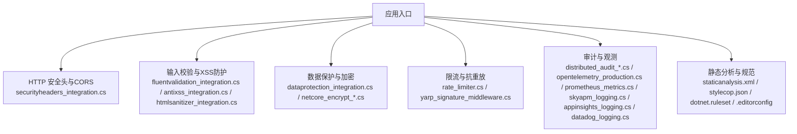
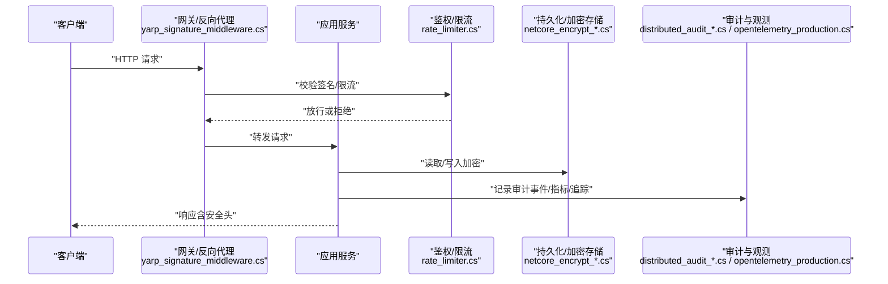
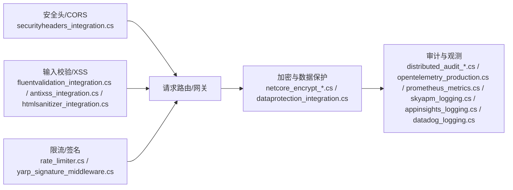

# 安全最佳实践

<cite>
**本文档引用的文件**   
- [securityheaders_config.json](file://securityheaders_config.json)
- [securityheaders_integration.cs](file://securityheaders_integration.cs)
- [appsettings.json](file://appsettings.json)
- [dataprotection_integration.cs](file://dataprotection_integration.cs)
- [netcore_encrypt_integration.cs](file://netcore_encrypt_integration.cs)
- [netcore_encrypt_advanced.cs](file://netcore_encrypt_advanced.cs)
- [aes_gcm_encryption_integration.cs](file://aes_gcm_encryption_integration.cs)
- [rsa_encryption_integration.cs](file://rsa_encryption_integration.cs)
- [sm_crypto_integration.cs](file://sm_crypto_integration.cs)
- [quantum_crypto_integration.cs](file://quantum_crypto_integration.cs)
- [bouncycastle_integration.cs](file://bouncycastle_integration.cs)
- [antixss_integration.cs](file://antixss_integration.cs)
- [htmlsanitizer_integration.cs](file://htmlsanitizer_integration.cs)
- [fluentvalidation_integration.cs](file://fluentvalidation_integration.cs)
- [fv_fluent_validation.cs](file://fv_fluent_validation.cs)
- [rate_limiter.cs](file://rate_limiter.cs)
- [yarp_signature_middleware.cs](file://yarp_signature_middleware.cs)
- [http_resilience_integration.cs](file://http_resilience_integration.cs)
- [http_resilience_advanced_integration.cs](file://http_resilience_advanced_integration.cs)
- [distributed_audit_store.cs](file://distributed_audit_store.cs)
- [distributed_audit_enhanced.cs](file://distributed_audit_enhanced.cs)
- [audit_encryption.cs](file://audit_encryption.cs)
- [audit_integration.cs](file://audit_integration.cs)
- [audit_analysis_pipeline.cs](file://audit_analysis_pipeline.cs)
- [audit_query_endpoint.cs](file://audit_query_endpoint.cs)
- [appinsights_logging.cs](file://appinsights_logging.cs)
- [prometheus_metrics.cs](file://prometheus_metrics.cs)
- [opentelemetry_production.cs](file://opentelemetry_production.cs)
- [skyapm_logging.cs](file://skyapm_logging.cs)
- [datadog_logging.cs](file://datadog_logging.cs)
- [alert_rules.cs](file://alert_rules.cs)
- [watchdog_alert_rules.cs](file://watchdog_alert_rules.cs)
- [staticanalysis.xml](file://staticanalysis.xml)
- [stylecop.json](file://stylecop.json)
- [dotnet.ruleset](file://dotnet.ruleset)
- [.editorconfig](file://.editorconfig)
</cite>

## 目录
1. [简介](#简介)
2. [项目结构](#项目结构)
3. [核心组件](#核心组件)
4. [架构总览](#架构总览)
5. [详细组件分析](#详细组件分析)
6. [依赖关系分析](#依赖关系分析)
7. [性能考量](#性能考量)
8. [故障排查指南](#故障排查指南)
9. [结论](#结论)
10. [附录](#附录)

## 简介
本指南面向在 .NET 生态中构建高安全性的 Web 与微服务系统，聚焦以下主题：
- HTTP 安全头配置、CORS 策略与 CSRF 防护
- 密码学算法选择、密钥管理与加密数据存储
- 常见攻击防护：SQL 注入、XSS、重放攻击等
- 安全审计日志、异常监控与威胁检测
- 合规性要求、安全测试与漏洞扫描集成

本仓库提供了大量可复用的集成示例与配置文件，可作为落地实践的参考。

## 项目结构
本项目采用“按能力/主题组织”的扁平化结构，安全相关能力以独立文件形式提供，便于按需引入与组合。与安全直接相关的要点包括：
- 安全头与中间件：通过配置与中间件统一注入响应头、CORS、签名校验等
- 数据保护与加密：基于 DataProtection、BouncyCastle、国密与量子安全示例
- 输入校验与 XSS 防护：FluentValidation、AntiXSS、HTMLSanitizer
- 限流与抗重放：速率限制、请求签名、幂等键
- 审计与观测：分布式审计存储、OpenTelemetry、Prometheus、SkyAPM、AppInsights、DataDog
- 静态分析与规范：StyleCop、EditorConfig、Ruleset、静态分析规则

**图表来源** 
- [securityheaders_integration.cs](file://securityheaders_integration.cs)
- [fluentvalidation_integration.cs](file://fluentvalidation_integration.cs)
- [antixss_integration.cs](file://antixss_integration.cs)
- [htmlsanitizer_integration.cs](file://htmlsanitizer_integration.cs)
- [dataprotection_integration.cs](file://dataprotection_integration.cs)
- [netcore_encrypt_integration.cs](file://netcore_encrypt_integration.cs)
- [rate_limiter.cs](file://rate_limiter.cs)
- [yarp_signature_middleware.cs](file://yarp_signature_middleware.cs)
- [distributed_audit_store.cs](file://distributed_audit_store.cs)
- [opentelemetry_production.cs](file://opentelemetry_production.cs)
- [prometheus_metrics.cs](file://prometheus_metrics.cs)
- [skyapm_logging.cs](file://skyapm_logging.cs)
- [appinsights_logging.cs](file://appinsights_logging.cs)
- [datadog_logging.cs](file://datadog_logging.cs)
- [staticanalysis.xml](file://staticanalysis.xml)
- [stylecop.json](file://stylecop.json)
- [dotnet.ruleset](file://dotnet.ruleset)
- [.editorconfig](file://.editorconfig)

**章节来源**
- [securityheaders_config.json](file://securityheaders_config.json)
- [securityheaders_integration.cs](file://securityheaders_integration.cs)
- [appsettings.json](file://appsettings.json)

## 核心组件
- HTTP 安全头与CORS：集中式配置与中间件，确保默认安全响应头与跨域策略最小化开放
- 输入校验与XSS防护：强类型验证 + 输出编码/净化，阻断注入与脚本执行
- 数据保护与加密：使用平台原生 DataProtection 与成熟加密库，结合密钥管理
- 限流与抗重放：令牌桶/滑动窗口限流，请求签名与幂等键防重放
- 审计与观测：结构化审计日志、指标与追踪，支持告警与可视化
- 静态分析与规范：代码级安全规则与风格约束，降低人为失误

**章节来源**
- [securityheaders_integration.cs](file://securityheaders_integration.cs)
- [fluentvalidation_integration.cs](file://fluentvalidation_integration.cs)
- [antixss_integration.cs](file://antixss_integration.cs)
- [htmlsanitizer_integration.cs](file://htmlsanitizer_integration.cs)
- [dataprotection_integration.cs](file://dataprotection_integration.cs)
- [netcore_encrypt_integration.cs](file://netcore_encrypt_integration.cs)
- [rate_limiter.cs](file://rate_limiter.cs)
- [yarp_signature_middleware.cs](file://yarp_signature_middleware.cs)
- [distributed_audit_store.cs](file://distributed_audit_store.cs)
- [opentelemetry_production.cs](file://opentelemetry_production.cs)
- [prometheus_metrics.cs](file://prometheus_metrics.cs)
- [skyapm_logging.cs](file://skyapm_logging.cs)
- [appinsights_logging.cs](file://appinsights_logging.cs)
- [datadog_logging.cs](file://datadog_logging.cs)

## 架构总览
下图展示从请求进入网关到业务处理、安全控制、审计与观测的整体流程。

**图表来源** 
- [yarp_signature_middleware.cs](file://yarp_signature_middleware.cs)
- [rate_limiter.cs](file://rate_limiter.cs)
- [netcore_encrypt_integration.cs](file://netcore_encrypt_integration.cs)
- [distributed_audit_store.cs](file://distributed_audit_store.cs)
- [opentelemetry_production.cs](file://opentelemetry_production.cs)

## 详细组件分析

### HTTP 安全头与CORS策略
- 目标：设置严格的安全响应头（如 CSP、HSTS、X-Frame-Options、Referrer-Policy 等），并最小化 CORS 白名单
- 实现要点：
  - 通过配置驱动（JSON）集中管理头部字段
  - 在中间件层统一注入，避免遗漏
  - CORS 仅允许受信任的来源与方法
- 建议：
  - 生产环境强制 HTTPS 与 HSTS
  - 禁用不必要的公开端点
  - 对前端资源启用内容安全策略

**章节来源**
- [securityheaders_config.json](file://securityheaders_config.json)
- [securityheaders_integration.cs](file://securityheaders_integration.cs)

### CSRF 防护机制
- 目标：防止跨站请求伪造，确保状态变更操作来自同源且受控
- 实现要点：
  - 表单提交携带一次性令牌（Synchronizer Token Pattern）
  - 自定义 Header 校验（SameSite Cookie + X-CSRF-Token）
  - 敏感接口增加双重提交校验或 SameSite=Strict/Lax
- 建议：
  - 所有写操作均需 CSRF 校验
  - 将 CSRF 令牌与用户会话绑定，短生命周期

[本节为概念性说明，不直接分析具体文件]

### SQL 注入防护
- 目标：杜绝拼接 SQL，使用参数化查询与 ORM 安全特性
- 实现要点：
  - 优先使用 EF Core/Dapper 的参数化 API
  - 对自由文本输入进行白名单校验
  - 数据库账户最小权限原则
- 建议：
  - 开启 SQL 审计日志
  - 定期扫描与回归测试

[本节为概念性说明，不直接分析具体文件]

### XSS 防护
- 目标：阻止恶意脚本注入与执行
- 实现要点：
  - 输入侧：FluentValidation 强校验
  - 输出侧：AntiXSS 编码与 HTMLSanitizer 净化
- 建议：
  - 对所有用户可控内容进行编码/净化
  - 避免 innerHTML 等危险 API

**章节来源**
- [fluentvalidation_integration.cs](file://fluentvalidation_integration.cs)
- [fv_fluent_validation.cs](file://fv_fluent_validation.cs)
- [antixss_integration.cs](file://antixss_integration.cs)
- [htmlsanitizer_integration.cs](file://htmlsanitizer_integration.cs)

### 重放攻击防护
- 目标：防止同一请求被重复提交
- 实现要点：
  - 请求签名（时间戳 + 随机数 + 签名）
  - 幂等键（Idempotency Key）
  - 网关层签名校验与去重
- 建议：
  - 短时效时间戳窗口
  - 服务端维护已消费的非空集合（带过期）

**章节来源**
- [yarp_signature_middleware.cs](file://yarp_signature_middleware.cs)
- [rate_limiter.cs](file://rate_limiter.cs)

### 密码学算法选择与密钥管理
- 目标：选择现代、安全的算法与合适的密钥长度，妥善管理密钥生命周期
- 推荐算法：
  - 对称加密：AES-GCM（认证加密）
  - 非对称加密：RSA-OAEP、ECDSA
  - 哈希：SHA-256/SHA-3（视场景）
  - 国密：SM2/SM3/SM4（合规场景）
  - 后量子：PQC 示例（前瞻性）
- 密钥管理：
  - 使用 DataProtection 体系或 KMS/HSM
  - 密钥轮换、版本化与最小权限访问
  - 禁止硬编码密钥

**章节来源**
- [aes_gcm_encryption_integration.cs](file://aes_gcm_encryption_integration.cs)
- [rsa_encryption_integration.cs](file://rsa_encryption_integration.cs)
- [sm_crypto_integration.cs](file://sm_crypto_integration.cs)
- [quantum_crypto_integration.cs](file://quantum_crypto_integration.cs)
- [bouncycastle_integration.cs](file://bouncycastle_integration.cs)
- [dataprotection_integration.cs](file://dataprotection_integration.cs)
- [netcore_encrypt_integration.cs](file://netcore_encrypt_integration.cs)
- [netcore_encrypt_advanced.cs](file://netcore_encrypt_advanced.cs)

### 加密数据存储
- 目标：对敏感数据进行静态加密与传输加密
- 实现要点：
  - 数据库列级加密或透明加密（TDE）
  - 对象存储加密（服务端/客户端）
  - 备份与归档数据的加密与脱敏
- 建议：
  - 区分数据分类分级
  - 定期评估加密强度与密钥轮换策略

**章节来源**
- [audit_encryption.cs](file://audit_encryption.cs)
- [netcore_encrypt_integration.cs](file://netcore_encrypt_integration.cs)

### 安全审计日志、异常监控与威胁检测
- 目标：全链路记录关键事件，实时监测异常与潜在威胁
- 实现要点：
  - 结构化审计日志（谁、何时、何地、做了什么、结果）
  - 指标与追踪（OpenTelemetry/Prometheus/SkyAPM/AppInsights/DataDog）
  - 告警规则与阈值（高频失败、异常模式）
- 建议：
  - 审计不可篡改与长期留存
  - 隐私数据脱敏
  - 建立 SOC 联动流程

**章节来源**
- [distributed_audit_store.cs](file://distributed_audit_store.cs)
- [distributed_audit_enhanced.cs](file://distributed_audit_enhanced.cs)
- [audit_integration.cs](file://audit_integration.cs)
- [audit_analysis_pipeline.cs](file://audit_analysis_pipeline.cs)
- [audit_query_endpoint.cs](file://audit_query_endpoint.cs)
- [appinsights_logging.cs](file://appinsights_logging.cs)
- [prometheus_metrics.cs](file://prometheus_metrics.cs)
- [opentelemetry_production.cs](file://opentelemetry_production.cs)
- [skyapm_logging.cs](file://skyapm_logging.cs)
- [datadog_logging.cs](file://datadog_logging.cs)
- [alert_rules.cs](file://alert_rules.cs)
- [watchdog_alert_rules.cs](file://watchdog_alert_rules.cs)

### 合规性要求、安全测试与漏洞扫描集成
- 合规性：
  - 遵循 OWASP Top 10、NIST、ISO 27001 等框架
  - 数据分类分级与隐私保护（PII 脱敏）
- 安全测试：
  - SAST/DAST 集成（静态分析、动态扫描）
  - 依赖漏洞扫描（SBOM 生成与更新）
  - 渗透测试与红蓝对抗演练
- 工具与规范：
  - StyleCop/.editorConfig/Ruleset 保障代码质量
  - 静态分析 XML 规则集
  - CI/CD 流水线嵌入安全检查

**章节来源**
- [staticanalysis.xml](file://staticanalysis.xml)
- [stylecop.json](file://stylecop.json)
- [dotnet.ruleset](file://dotnet.ruleset)
- [.editorconfig](file://.editorconfig)

## 依赖关系分析
安全能力之间相互协作，形成“前置校验—核心处理—后置审计”的闭环。

**图表来源** 
- [securityheaders_integration.cs](file://securityheaders_integration.cs)
- [fluentvalidation_integration.cs](file://fluentvalidation_integration.cs)
- [antixss_integration.cs](file://antixss_integration.cs)
- [htmlsanitizer_integration.cs](file://htmlsanitizer_integration.cs)
- [rate_limiter.cs](file://rate_limiter.cs)
- [yarp_signature_middleware.cs](file://yarp_signature_middleware.cs)
- [netcore_encrypt_integration.cs](file://netcore_encrypt_integration.cs)
- [dataprotection_integration.cs](file://dataprotection_integration.cs)
- [distributed_audit_store.cs](file://distributed_audit_store.cs)
- [opentelemetry_production.cs](file://opentelemetry_production.cs)
- [prometheus_metrics.cs](file://prometheus_metrics.cs)
- [skyapm_logging.cs](file://skyapm_logging.cs)
- [appinsights_logging.cs](file://appinsights_logging.cs)
- [datadog_logging.cs](file://datadog_logging.cs)

**章节来源**
- [securityheaders_integration.cs](file://securityheaders_integration.cs)
- [rate_limiter.cs](file://rate_limiter.cs)
- [yarp_signature_middleware.cs](file://yarp_signature_middleware.cs)
- [netcore_encrypt_integration.cs](file://netcore_encrypt_integration.cs)
- [distributed_audit_store.cs](file://distributed_audit_store.cs)

## 性能考量
- 安全头与CORS：尽量在边缘层（网关/CDN）设置，减少应用开销
- 限流与签名：使用高效数据结构（滑动窗口、布隆过滤器）与缓存
- 加密解密：合理选择算法与密钥长度，批量处理时注意内存与CPU占用
- 审计与观测：异步落盘、采样与批处理，避免阻塞主路径
- 建议：
  - 对热点路径做基准测试与压测
  - 监控关键指标（延迟、错误率、吞吐）

[本节为通用指导，不直接分析具体文件]

## 故障排查指南
- 常见问题定位：
  - 安全头未生效：检查中间件顺序与配置加载
  - CORS 报错：核对来源、方法与预检请求
  - CSRF 失败：确认令牌生成与校验逻辑一致
  - 加密失败：检查密钥版本、权限与格式
  - 审计缺失：确认异步管道与存储可用性
- 诊断手段：
  - 查看 OpenTelemetry 追踪链
  - 检索 Prometheus 指标与 SkyAPM/AppInsights/DataDog 面板
  - 审计查询端点与日志聚合

**章节来源**
- [audit_query_endpoint.cs](file://audit_query_endpoint.cs)
- [opentelemetry_production.cs](file://opentelemetry_production.cs)
- [prometheus_metrics.cs](file://prometheus_metrics.cs)
- [skyapm_logging.cs](file://skyapm_logging.cs)
- [appinsights_logging.cs](file://appinsights_logging.cs)
- [datadog_logging.cs](file://datadog_logging.cs)

## 结论
通过“配置驱动的安全头与CORS、严格的输入校验与XSS防护、健壮的加密与密钥管理、完善的限流与签名、以及全面的审计与观测”，可在 .NET 应用中构建纵深防御体系。配合静态分析与合规流程，持续降低安全风险并满足监管要求。

## 附录
- 快速清单：
  - 启用 HSTS、CSP、X-Frame-Options、Referrer-Policy
  - 最小化 CORS 白名单
  - 所有写操作启用 CSRF 校验
  - 参数化查询与输入白名单
  - 输出编码与 HTML 净化
  - AES-GCM/ECDSA/SHA-256 等现代算法
  - DataProtection/KMS 管理密钥
  - 网关签名与幂等键
  - 结构化审计与指标追踪
  - 接入 SAST/DAST 与 SBOM
- 参考文件：
  - [securityheaders_config.json](file://securityheaders_config.json)
  - [securityheaders_integration.cs](file://securityheaders_integration.cs)
  - [appsettings.json](file://appsettings.json)
  - [dataprotection_integration.cs](file://dataprotection_integration.cs)
  - [netcore_encrypt_integration.cs](file://netcore_encrypt_integration.cs)
  - [aes_gcm_encryption_integration.cs](file://aes_gcm_encryption_integration.cs)
  - [rsa_encryption_integration.cs](file://rsa_encryption_integration.cs)
  - [sm_crypto_integration.cs](file://sm_crypto_integration.cs)
  - [quantum_crypto_integration.cs](file://quantum_crypto_integration.cs)
  - [bouncycastle_integration.cs](file://bouncycastle_integration.cs)
  - [antixss_integration.cs](file://antixss_integration.cs)
  - [htmlsanitizer_integration.cs](file://htmlsanitizer_integration.cs)
  - [fluentvalidation_integration.cs](file://fluentvalidation_integration.cs)
  - [fv_fluent_validation.cs](file://fv_fluent_validation.cs)
  - [rate_limiter.cs](file://rate_limiter.cs)
  - [yarp_signature_middleware.cs](file://yarp_signature_middleware.cs)
  - [distributed_audit_store.cs](file://distributed_audit_store.cs)
  - [distributed_audit_enhanced.cs](file://distributed_audit_enhanced.cs)
  - [audit_encryption.cs](file://audit_encryption.cs)
  - [audit_integration.cs](file://audit_integration.cs)
  - [audit_analysis_pipeline.cs](file://audit_analysis_pipeline.cs)
  - [audit_query_endpoint.cs](file://audit_query_endpoint.cs)
  - [appinsights_logging.cs](file://appinsights_logging.cs)
  - [prometheus_metrics.cs](file://prometheus_metrics.cs)
  - [opentelemetry_production.cs](file://opentelemetry_production.cs)
  - [skyapm_logging.cs](file://skyapm_logging.cs)
  - [datadog_logging.cs](file://datadog_logging.cs)
  - [alert_rules.cs](file://alert_rules.cs)
  - [watchdog_alert_rules.cs](file://watchdog_alert_rules.cs)
  - [staticanalysis.xml](file://staticanalysis.xml)
  - [stylecop.json](file://stylecop.json)
  - [dotnet.ruleset](file://dotnet.ruleset)
  - [.editorconfig](file://.editorconfig)