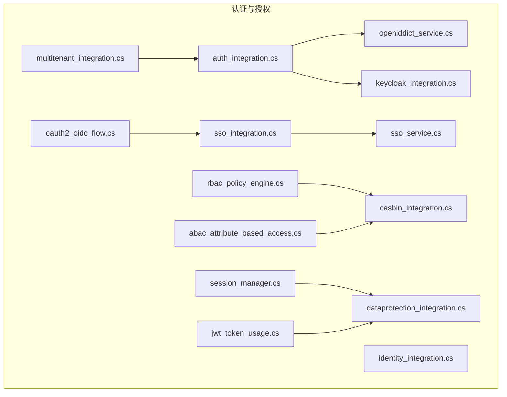
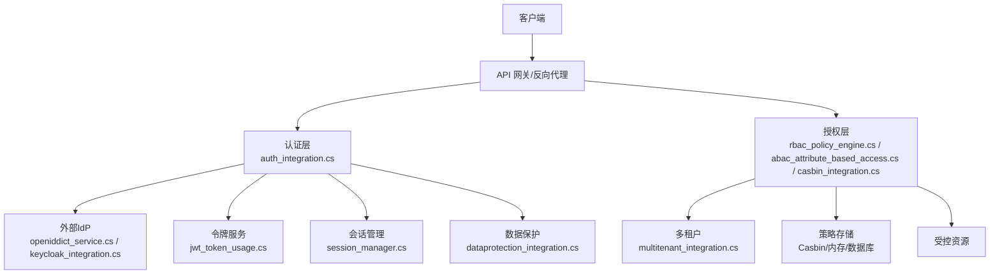
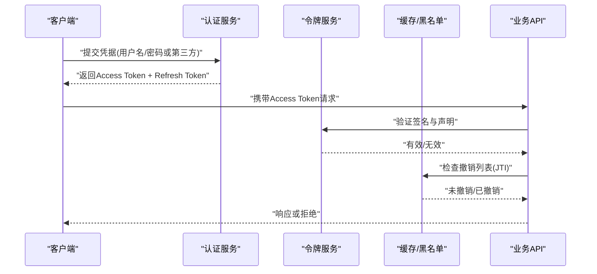
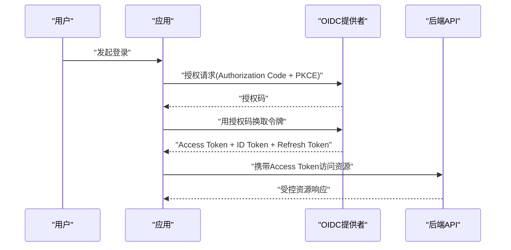
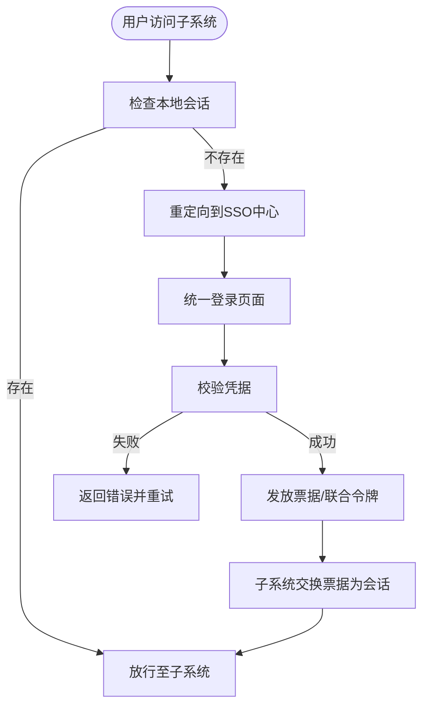
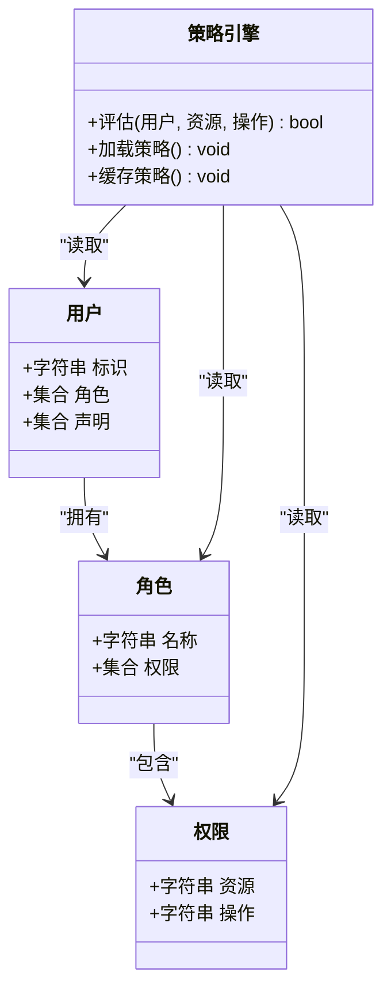
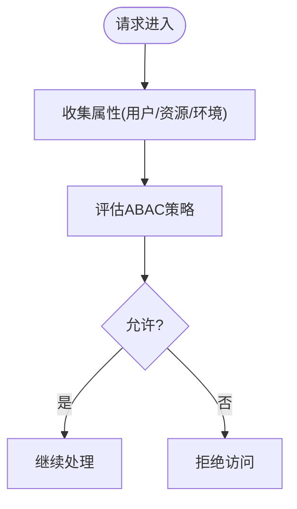
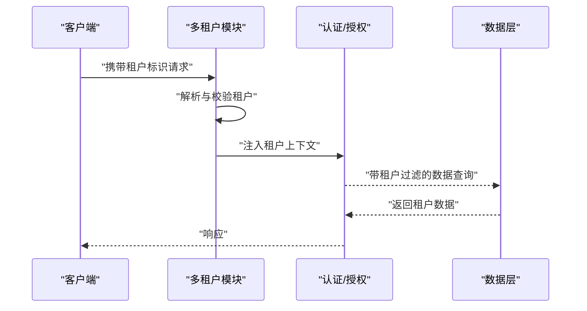
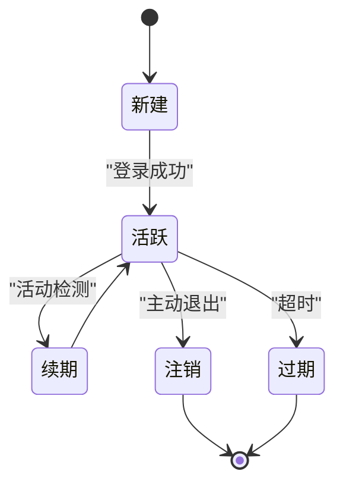
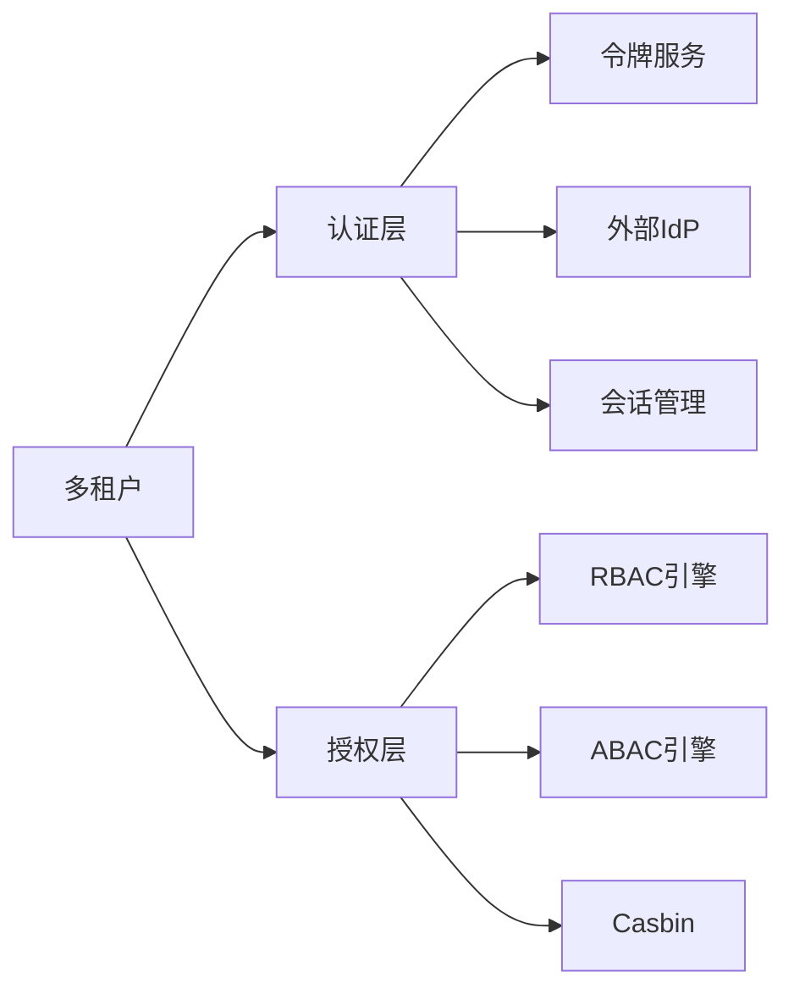

# 认证与授权

<cite>
**本文引用的文件**   
- [auth_integration.cs](file://auth_integration.cs)
- [abac_attribute_based_access.cs](file://abac_attribute_based_access.cs)
- [sso_integration.cs](file://sso_integration.cs)
- [sso_service.cs](file://sso_service.cs)
- [multitenant_integration.cs](file://multitenant_integration.cs)
- [openiddict_service.cs](file://openiddict_service.cs)
- [keycloak_integration.cs](file://keycloak_integration.cs)
- [casbin_integration.cs](file://casbin_integration.cs)
- [identity_integration.cs](file://identity_integration.cs)
- [dataprotection_integration.cs](file://dataprotection_integration.cs)
- [jwt_token_usage.cs](file://jwt_token_usage.cs)
- [oauth2_oidc_flow.cs](file://oauth2_oidc_flow.cs)
- [rbac_policy_engine.cs](file://rbac_policy_engine.cs)
- [session_manager.cs](file://session_manager.cs)
</cite>

## 目录
1. [简介](#简介)
2. [项目结构](#项目结构)
3. [核心组件](#核心组件)
4. [架构总览](#架构总览)
5. [详细组件分析](#详细组件分析)
6. [依赖关系分析](#依赖关系分析)
7. [性能考量](#性能考量)
8. [故障排查指南](#故障排查指南)
9. [结论](#结论)
10. [附录](#附录)

## 简介
本文件面向认证与授权系统的设计与实现，覆盖以下关键主题：
- JWT 令牌生命周期、签发与校验
- OAuth2/OIDC 协议集成（含单点登录 SSO）
- 基于角色的访问控制（RBAC）与基于属性的访问控制（ABAC）
- 多租户隔离与会话管理
- 权限模型设计、资源访问控制与细粒度策略
- 安全最佳实践、密码学算法选择与防攻击措施

本仓库提供了多种认证/授权的集成示例与参考实现，包括 OpenIddict、Keycloak、IdentityServer、CAS、DataProtection、JWT、OAuth2/OIDC、RBAC/ABAC 等。下文将结合这些文件进行系统化说明。

## 项目结构
从仓库根目录可见大量以“_integration.cs”结尾的示例文件，它们分别演示不同技术栈在认证与授权方面的集成方式。与认证授权相关的核心文件包括但不限于：
- 认证与身份：auth_integration.cs、identity_integration.cs、openiddict_service.cs、keycloak_integration.cs
- 协议与SSO：oauth2_oidc_flow.cs、sso_integration.cs、sso_service.cs
- 授权策略：rbac_policy_engine.cs、abac_attribute_based_access.cs、casbin_integration.cs
- 会话与安全：session_manager.cs、dataprotection_integration.cs、jwt_token_usage.cs
- 多租户：multitenant_integration.cs

图表来源 
- [auth_integration.cs](file://auth_integration.cs)
- [identity_integration.cs](file://identity_integration.cs)
- [openiddict_service.cs](file://openiddict_service.cs)
- [keycloak_integration.cs](file://keycloak_integration.cs)
- [oauth2_oidc_flow.cs](file://oauth2_oidc_flow.cs)
- [sso_integration.cs](file://sso_integration.cs)
- [sso_service.cs](file://sso_service.cs)
- [rbac_policy_engine.cs](file://rbac_policy_engine.cs)
- [abac_attribute_based_access.cs](file://abac_attribute_based_access.cs)
- [casbin_integration.cs](file://casbin_integration.cs)
- [session_manager.cs](file://session_manager.cs)
- [dataprotection_integration.cs](file://dataprotection_integration.cs)
- [jwt_token_usage.cs](file://jwt_token_usage.cs)
- [multitenant_integration.cs](file://multitenant_integration.cs)

章节来源
- [auth_integration.cs](file://auth_integration.cs)
- [identity_integration.cs](file://identity_integration.cs)
- [openiddict_service.cs](file://openiddict_service.cs)
- [keycloak_integration.cs](file://keycloak_integration.cs)
- [oauth2_oidc_flow.cs](file://oauth2_oidc_flow.cs)
- [sso_integration.cs](file://sso_integration.cs)
- [sso_service.cs](file://sso_service.cs)
- [rbac_policy_engine.cs](file://rbac_policy_engine.cs)
- [abac_attribute_based_access.cs](file://abac_attribute_based_access.cs)
- [casbin_integration.cs](file://casbin_integration.cs)
- [session_manager.cs](file://session_manager.cs)
- [dataprotection_integration.cs](file://dataprotection_integration.cs)
- [jwt_token_usage.cs](file://jwt_token_usage.cs)
- [multitenant_integration.cs](file://multitenant_integration.cs)

## 核心组件
- 认证入口与身份服务
  - auth_integration.cs：统一认证接入点，聚合多种身份源（本地、外部IdP、企业IdP）。
  - identity_integration.cs：基于 ASP.NET Core Identity 的用户、角色、声明管理。
  - openiddict_service.cs：OpenIddict 配置与令牌端点、客户端注册、Scope/Claim映射。
  - keycloak_integration.cs：Keycloak 作为外部 OIDC 提供者的集成与回调处理。

- 协议与单点登录
  - oauth2_oidc_flow.cs：OAuth2/OIDC 流程编排（授权码、隐式、客户端凭证、刷新令牌）。
  - sso_integration.cs / sso_service.cs：SSO 网关、跨域信任、票据交换与上下文传播。

- 授权策略引擎
  - rbac_policy_engine.cs：基于角色的访问控制策略评估与缓存。
  - abac_attribute_based_access.cs：基于属性的访问控制，支持动态属性计算与策略组合。
  - casbin_integration.cs：Casbin 策略引擎集成，支持 RBAC/ABAC/ReBAC 混合策略。

- 会话与安全
  - session_manager.cs：会话创建、续期、失效与并发控制。
  - dataprotection_integration.cs：数据保护、Cookie 加密、签名与密钥轮换。
  - jwt_token_usage.cs：JWT 签发、验证、刷新与撤销策略。

- 多租户
  - multitenant_integration.cs：租户识别、隔离、策略作用域与资源路由。

章节来源
- [auth_integration.cs](file://auth_integration.cs)
- [identity_integration.cs](file://identity_integration.cs)
- [openiddict_service.cs](file://openiddict_service.cs)
- [keycloak_integration.cs](file://keycloak_integration.cs)
- [oauth2_oidc_flow.cs](file://oauth2_oidc_flow.cs)
- [sso_integration.cs](file://sso_integration.cs)
- [sso_service.cs](file://sso_service.cs)
- [rbac_policy_engine.cs](file://rbac_policy_engine.cs)
- [abac_attribute_based_access.cs](file://abac_attribute_based_access.cs)
- [casbin_integration.cs](file://casbin_integration.cs)
- [session_manager.cs](file://session_manager.cs)
- [dataprotection_integration.cs](file://dataprotection_integration.cs)
- [jwt_token_usage.cs](file://jwt_token_usage.cs)
- [multitenant_integration.cs](file://multitenant_integration.cs)

## 架构总览
下图展示了认证与授权的整体架构：客户端通过 API 网关进入应用，认证层负责身份核验与令牌签发/校验，授权层根据 RBAC/ABAC 策略决定资源访问权限，多租户模块确保数据与策略隔离，会话与数据保护贯穿全链路。

图表来源 
- [auth_integration.cs](file://auth_integration.cs)
- [openiddict_service.cs](file://openiddict_service.cs)
- [keycloak_integration.cs](file://keycloak_integration.cs)
- [jwt_token_usage.cs](file://jwt_token_usage.cs)
- [session_manager.cs](file://session_manager.cs)
- [dataprotection_integration.cs](file://dataprotection_integration.cs)
- [rbac_policy_engine.cs](file://rbac_policy_engine.cs)
- [abac_attribute_based_access.cs](file://abac_attribute_based_access.cs)
- [casbin_integration.cs](file://casbin_integration.cs)
- [multitenant_integration.cs](file://multitenant_integration.cs)

## 详细组件分析

### JWT 令牌实现
- 签发与校验
  - 使用对称或非对称算法（如 RS256/ES256），建议优先非对称以提升安全性。
  - 令牌包含必要声明（用户标识、租户、角色、Scope、过期时间等），避免敏感信息。
  - 支持短生命周期 Access Token + Refresh Token 模式，Refresh Token 需安全存储并具备撤销能力。
- 撤销与黑名单
  - 通过令牌指纹或JTI去重，配合分布式缓存或数据库实现快速撤销。
- 安全加固
  - 强制HTTPS、启用CSP、严格SameSite Cookie策略、最小化Cookie范围。
  - 对令牌载荷进行签名与可选加密（JWE），防止篡改与泄露。

图表来源 
- [jwt_token_usage.cs](file://jwt_token_usage.cs)
- [dataprotection_integration.cs](file://dataprotection_integration.cs)
- [session_manager.cs](file://session_manager.cs)

章节来源
- [jwt_token_usage.cs](file://jwt_token_usage.cs)
- [dataprotection_integration.cs](file://dataprotection_integration.cs)
- [session_manager.cs](file://session_manager.cs)

### OAuth2/OIDC 协议集成
- 支持的授权流
  - 授权码流（Authorization Code）：适用于Web与移动端，推荐PKCE。
  - 客户端凭证流（Client Credentials）：适用于服务间调用。
  - 隐式流（Implicit）：不推荐，仅兼容旧客户端。
  - 刷新令牌：用于无感续期。
- 外部IdP集成
  - OpenIddict：本地OIDC提供者，支持自定义Claim映射、Scope定义、设备流。
  - Keycloak：企业级IdP，支持SAML/OIDC、LDAP/AD集成、策略与审计。
- 安全要点
  - 强制State参数防CSRF、严格Redirect URI白名单、最小Scope原则。
  - 使用HTTPS、HSTS、CORS严格配置、防重放攻击。

图表来源 
- [oauth2_oidc_flow.cs](file://oauth2_oidc_flow.cs)
- [openiddict_service.cs](file://openiddict_service.cs)
- [keycloak_integration.cs](file://keycloak_integration.cs)

章节来源
- [oauth2_oidc_flow.cs](file://oauth2_oidc_flow.cs)
- [openiddict_service.cs](file://openiddict_service.cs)
- [keycloak_integration.cs](file://keycloak_integration.cs)

### 单点登录（SSO）
- 架构要点
  - 中央认证中心统一鉴权，各子系统共享信任。
  - 使用票据（Ticket）或联合令牌（SAML/OIDC）进行跨域信任。
  - 会话状态同步与注销广播（Back-Channel Logout）。
- 实现路径
  - sso_integration.cs：网关级SSO入口，统一登录态与跳转。
  - sso_service.cs：票据交换、上下文传播、租户隔离。

图表来源 
- [sso_integration.cs](file://sso_integration.cs)
- [sso_service.cs](file://sso_service.cs)

章节来源
- [sso_integration.cs](file://sso_integration.cs)
- [sso_service.cs](file://sso_service.cs)

### 基于角色的访问控制（RBAC）
- 模型设计
  - 用户-角色-权限三元组，支持继承与组合。
  - 资源与操作维度划分，按Controller/Action或GraphQL字段级别控制。
- 策略评估
  - 预编译策略树，结合缓存提升性能。
  - 支持动态加载与热更新。
- 集成方案
  - rbac_policy_engine.cs：内置策略引擎。
  - casbin_integration.cs：Casbin策略语言，灵活扩展。

图表来源 
- [rbac_policy_engine.cs](file://rbac_policy_engine.cs)
- [casbin_integration.cs](file://casbin_integration.cs)

章节来源
- [rbac_policy_engine.cs](file://rbac_policy_engine.cs)
- [casbin_integration.cs](file://casbin_integration.cs)

### 基于属性的访问控制（ABAC）
- 属性来源
  - 用户属性（部门、职级、地域）、资源属性（分类、密级）、环境属性（时间、IP、设备）。
- 策略表达
  - 使用表达式或规则引擎（如Casbin）组合条件，支持AND/OR/NOT。
- 动态评估
  - 运行时计算属性值，避免硬编码；引入缓存减少重复计算。

图表来源 
- [abac_attribute_based_access.cs](file://abac_attribute_based_access.cs)
- [casbin_integration.cs](file://casbin_integration.cs)

章节来源
- [abac_attribute_based_access.cs](file://abac_attribute_based_access.cs)
- [casbin_integration.cs](file://casbin_integration.cs)

### 多租户支持与隔离
- 租户识别
  - 域名、子域、请求头、JWT声明中的租户标识。
- 数据隔离
  - 行级过滤、Schema隔离、独立数据库。
- 策略与作用域
  - 策略按租户隔离，避免越权访问。

图表来源 
- [multitenant_integration.cs](file://multitenant_integration.cs)

章节来源
- [multitenant_integration.cs](file://multitenant_integration.cs)

### 会话管理机制
- 会话生命周期
  - 创建、续期、滑动过期、并发限制、注销。
- 存储与一致性
  - 内存/Redis/数据库持久化，分布式环境下保证一致性与高可用。
- 安全特性
  - 绑定设备/IP、防会话固定、强随机会话ID。

图表来源 
- [session_manager.cs](file://session_manager.cs)
- [dataprotection_integration.cs](file://dataprotection_integration.cs)

章节来源
- [session_manager.cs](file://session_manager.cs)
- [dataprotection_integration.cs](file://dataprotection_integration.cs)

## 依赖关系分析
- 组件耦合
  - 认证层依赖令牌服务与外部IdP；授权层依赖RBAC/ABAC/Casbin；多租户贯穿认证与授权。
- 外部依赖
  - OpenIddict、Keycloak、IdentityServer、Casbin、Redis/数据库等。
- 潜在循环依赖
  - 应避免授权层直接依赖认证层的具体实现，通过接口抽象解耦。

图表来源 
- [auth_integration.cs](file://auth_integration.cs)
- [jwt_token_usage.cs](file://jwt_token_usage.cs)
- [openiddict_service.cs](file://openiddict_service.cs)
- [keycloak_integration.cs](file://keycloak_integration.cs)
- [session_manager.cs](file://session_manager.cs)
- [rbac_policy_engine.cs](file://rbac_policy_engine.cs)
- [abac_attribute_based_access.cs](file://abac_attribute_based_access.cs)
- [casbin_integration.cs](file://casbin_integration.cs)
- [multitenant_integration.cs](file://multitenant_integration.cs)

章节来源
- [auth_integration.cs](file://auth_integration.cs)
- [jwt_token_usage.cs](file://jwt_token_usage.cs)
- [openiddict_service.cs](file://openiddict_service.cs)
- [keycloak_integration.cs](file://keycloak_integration.cs)
- [session_manager.cs](file://session_manager.cs)
- [rbac_policy_engine.cs](file://rbac_policy_engine.cs)
- [abac_attribute_based_access.cs](file://abac_attribute_based_access.cs)
- [casbin_integration.cs](file://casbin_integration.cs)
- [multitenant_integration.cs](file://multitenant_integration.cs)

## 性能考量
- 令牌校验
  - 使用非对称算法与本地公钥缓存，减少网络开销。
  - 对常见声明做索引与缓存，加速授权评估。
- 策略评估
  - 预编译策略树，命中缓存；复杂ABAC策略引入增量计算。
- 会话存储
  - 使用高性能缓存（如Redis）与连接池，避免热点键倾斜。
- 多租户
  - 租户识别尽量前置，减少后续处理成本；数据查询加租户过滤索引。

[本节为通用指导，无需特定文件引用]

## 故障排查指南
- 常见问题
  - 令牌签名失败：检查算法与密钥一致性、时钟同步。
  - 授权拒绝：确认角色/属性/策略是否正确加载与生效。
  - 会话丢失：检查Cookie设置、跨域配置、存储可用性。
  - 多租户越权：核对租户上下文注入与数据过滤。
- 诊断步骤
  - 启用详细日志与追踪，定位失败阶段。
  - 使用调试工具模拟请求，逐步缩小问题范围。
  - 检查外部IdP连通性与证书有效性。

章节来源
- [auth_integration.cs](file://auth_integration.cs)
- [jwt_token_usage.cs](file://jwt_token_usage.cs)
- [session_manager.cs](file://session_manager.cs)
- [multitenant_integration.cs](file://multitenant_integration.cs)

## 结论
本仓库提供了完整的认证与授权集成示例，涵盖JWT、OAuth2/OIDC、SSO、RBAC/ABAC、多租户与会话管理等关键能力。通过合理的架构设计与安全加固，可实现高可用、可扩展且安全的身份与访问控制系统。建议在落地时结合业务场景选择合适的策略与组件，并持续优化性能与安全性。

[本节为总结性内容，无需特定文件引用]

## 附录
- 安全最佳实践
  - 强制HTTPS、启用HSTS、严格CORS与CSP。
  - 最小权限原则、最小Scope、按需声明。
  - 定期轮换密钥、启用审计与告警。
- 密码学算法
  - 签名：RS256/ES256；哈希：SHA-256/SHA-384；对称加密：AES-GCM。
- 防攻击措施
  - CSRF防护、XSS过滤、SQL注入防护、速率限制与熔断。
  - 令牌撤销、会话固定防护、重放攻击防护。

[本节为通用指导，无需特定文件引用]