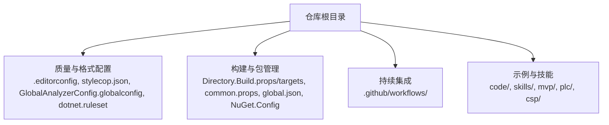
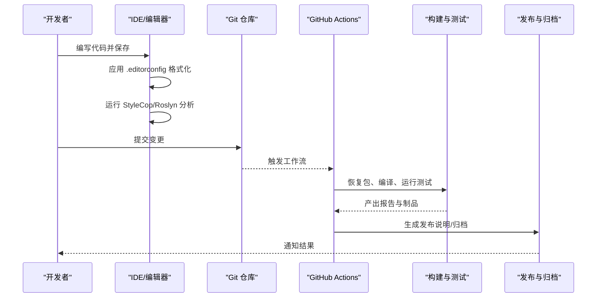
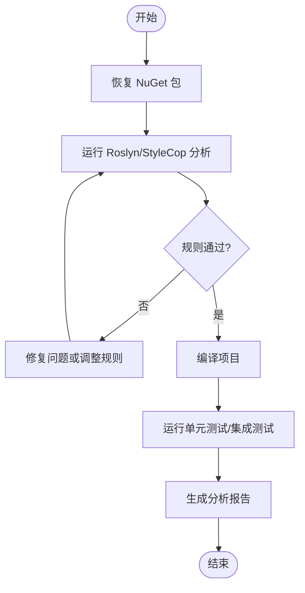
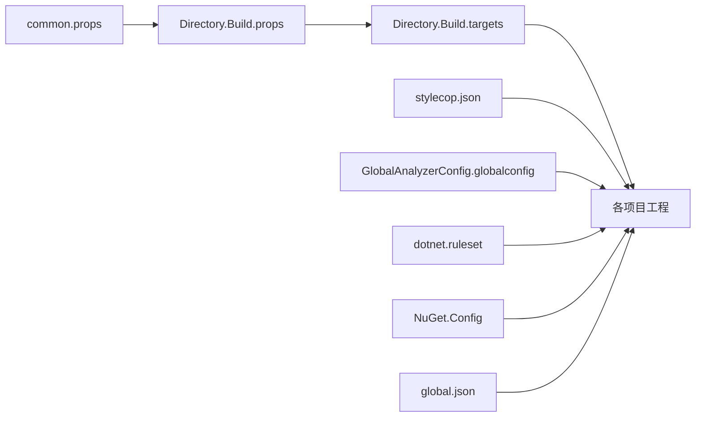

# 贡献指南

<cite>
**本文档引用的文件**
- [README.md](file://README.md)
- [.editorconfig](file://.editorconfig)
- [stylecop.json](file://stylecop.json)
- [GlobalAnalyzerConfig.globalconfig](file://GlobalAnalyzerConfig.globalconfig)
- [dotnet.ruleset](file://dotnet.ruleset)
- [Directory.Build.props](file://Directory.Build.props)
- [Directory.Build.targets](file://Directory.Build.targets)
- [common.props](file://common.props)
- [build.cake](file://build.cake)
- [global.json](file://global.json)
- [NuGet.Config](file://NuGet.Config)
- [.github/workflows/](file://.github/workflows/)
</cite>

## 目录
1. [简介](#简介)
2. [项目结构](#项目结构)
3. [核心组件](#核心组件)
4. [架构总览](#架构总览)
5. [详细组件分析](#详细组件分析)
6. [依赖分析](#依赖分析)
7. [性能考虑](#性能考虑)
8. [故障排查指南](#故障排查指南)
9. [结论](#结论)
10. [附录](#附录)

## 简介
本贡献指南面向所有参与代码库的开发者，统一代码规范、提交流程、分支管理策略与代码审查标准。内容涵盖 StyleCop 静态分析、代码质量检查、格式化规则与命名约定；明确测试要求、文档更新规范与版本发布流程；并提供开发环境配置、构建脚本使用与持续集成说明，帮助新成员快速上手并高效协作。

## 项目结构
仓库采用多示例与多技能（skills）并存的组织方式，根目录包含全局构建与质量配置文件，子目录按功能或示例划分。关键目录与文件：
- 根级构建与质量配置：.editorconfig、stylecop.json、GlobalAnalyzerConfig.globalconfig、dotnet.ruleset、Directory.Build.props/targets、common.props、global.json、NuGet.Config
- 构建编排：build.cake
- 持续集成：.github/workflows/
- 示例与技能：code/、skills/、mvp/、plc/、csp/ 等

图表来源
- [.editorconfig:1-200](file://.editorconfig#L1-L200)
- [stylecop.json:1-200](file://stylecop.json#L1-L200)
- [GlobalAnalyzerConfig.globalconfig:1-200](file://GlobalAnalyzerConfig.globalconfig#L1-L200)
- [dotnet.ruleset:1-200](file://dotnet.ruleset#L1-L200)
- [Directory.Build.props:1-200](file://Directory.Build.props#L1-L200)
- [Directory.Build.targets:1-200](file://Directory.Build.targets#L1-L200)
- [common.props:1-200](file://common.props#L1-L200)
- [global.json:1-200](file://global.json#L1-L200)
- [NuGet.Config:1-200](file://NuGet.Config#L1-L200)
- [.github/workflows/:1-200](file://.github/workflows/#L1-L200)

章节来源
- [README.md:1-200](file://README.md#L1-L200)

## 核心组件
本节聚焦于代码质量与构建体系的核心配置，确保全仓一致的编码风格与构建行为。

- 编辑器与格式化
  - .editorconfig：定义缩进、行尾、UTF-8、插入空格等统一格式规则，IDE 与 CLI 均遵循。
  - stylecop.json：StyleCop 规则集，控制 C# 样式与布局（如命名、顺序、间距、注释等）。
  - GlobalAnalyzerConfig.globalconfig：启用/禁用 Roslyn 分析器与规则集，统一静态分析行为。
  - dotnet.ruleset：MSBuild 内置规则集，控制代码分析与警告级别。

- 构建与包管理
  - Directory.Build.props/targets：集中设置目标框架、公共属性、打包选项、分析器引用等，保证各工程一致。
  - common.props：共享包版本、分析器版本、输出路径等通用属性。
  - global.json：锁定 SDK 版本与工具链，确保跨平台一致性。
  - NuGet.Config：私有源与包还原配置。

- 构建编排
  - build.cake：Cake 脚本用于清理、编译、测试、打包、发布等流水线任务。

章节来源
- [.editorconfig:1-200](file://.editorconfig#L1-L200)
- [stylecop.json:1-200](file://stylecop.json#L1-L200)
- [GlobalAnalyzerConfig.globalconfig:1-200](file://GlobalAnalyzerConfig.globalconfig#L1-L200)
- [dotnet.ruleset:1-200](file://dotnet.ruleset#L1-L200)
- [Directory.Build.props:1-200](file://Directory.Build.props#L1-L200)
- [Directory.Build.targets:1-200](file://Directory.Build.targets#L1-L200)
- [common.props:1-200](file://common.props#L1-L200)
- [global.json:1-200](file://global.json#L1-L200)
- [NuGet.Config:1-200](file://NuGet.Config#L1-L200)
- [build.cake:1-200](file://build.cake#L1-L200)

## 架构总览
下图展示从本地开发到持续集成的整体流程：开发者在 IDE 中依据 .editorconfig 与 StyleCop 进行格式化与静态检查；提交后触发 GitHub Actions；CI 执行构建、测试与质量门禁；通过后进入发布阶段。

图表来源
- [.github/workflows/:1-200](file://.github/workflows/#L1-L200)
- [build.cake:1-200](file://build.cake#L1-L200)
- [.editorconfig:1-200](file://.editorconfig#L1-L200)
- [stylecop.json:1-200](file://stylecop.json#L1-L200)

## 详细组件分析

### 代码规范与命名约定
- 编辑器与格式
  - 使用 UTF-8 编码、CRLF/LF 由平台决定，缩进为空格，禁止混合制表符。
  - 文件末尾保留空行，避免多余空白。
- StyleCop 规则
  - 命名：类型、方法、属性、字段、参数等遵循 POCO/C# 惯例（如 PascalCase、camelCase）。
  - 顺序：using、namespace、class/struct、成员声明顺序需符合默认规则。
  - 注释：XML 文档注释与行内注释保持清晰与必要。
- Roslyn 与规则集
  - 通过 GlobalAnalyzerConfig.globalconfig 启用/禁用分析器与规则集。
  - dotnet.ruleset 统一警告等级与严重性。

章节来源
- [.editorconfig:1-200](file://.editorconfig#L1-L200)
- [stylecop.json:1-200](file://stylecop.json#L1-L200)
- [GlobalAnalyzerConfig.globalconfig:1-200](file://GlobalAnalyzerConfig.globalconfig#L1-L200)
- [dotnet.ruleset:1-200](file://dotnet.ruleset#L1-L200)

### 静态分析与代码质量检查
- StyleCop：基于 stylecop.json 的规则集，提供 C# 样式与布局检查。
- Roslyn 分析器：通过 globalconfig 与 ruleset 控制启用与严重性。
- MSBuild 集成：Directory.Build.props/targets 与 common.props 注入分析器与规则集，确保全仓一致。

图表来源
- [Directory.Build.props:1-200](file://Directory.Build.props#L1-L200)
- [Directory.Build.targets:1-200](file://Directory.Build.targets#L1-L200)
- [common.props:1-200](file://common.props#L1-L200)
- [stylecop.json:1-200](file://stylecop.json#L1-L200)
- [GlobalAnalyzerConfig.globalconfig:1-200](file://GlobalAnalyzerConfig.globalconfig#L1-L200)
- [dotnet.ruleset:1-200](file://dotnet.ruleset#L1-L200)

章节来源
- [Directory.Build.props:1-200](file://Directory.Build.props#L1-L200)
- [Directory.Build.targets:1-200](file://Directory.Build.targets#L1-L200)
- [common.props:1-200](file://common.props#L1-L200)
- [stylecop.json:1-200](file://stylecop.json#L1-L200)
- [GlobalAnalyzerConfig.globalconfig:1-200](file://GlobalAnalyzerConfig.globalconfig#L1-L200)
- [dotnet.ruleset:1-200](file://dotnet.ruleset#L1-L200)

### 构建脚本使用
- 使用 Cake 编排构建流程，常见任务包括清理、编译、测试、打包、发布。
- 建议在本地安装 Cake 工具后执行相应目标，或在 CI 中调用相同目标以保证一致性。

章节来源
- [build.cake:1-200](file://build.cake#L1-L200)

### 测试要求
- 覆盖范围：新增或修改的功能应补充单测；涉及外部依赖的模块建议提供隔离测试或模拟。
- 执行方式：通过 dotnet test 或 Cake 目标执行；确保测试可重复且稳定。
- 报告：CI 应收集测试结果与覆盖率报告，作为合并门禁的一部分。

章节来源
- [build.cake:1-200](file://build.cake#L1-L200)

### 文档更新规范
- 代码变更若影响 API、行为或配置，需要同步更新相关文档与示例。
- README 与示例说明应保持最新，便于使用者理解与复现。

章节来源
- [README.md:1-200](file://README.md#L1-L200)

### 版本发布流程
- 版本号管理：遵循语义化版本（主版本.次版本.修订号），在 common.props 或构建脚本中统一管理。
- 发布步骤：构建成功 → 生成制品 → 创建发布标签 → 上传产物 → 记录变更日志。
- 回滚策略：保留历史制品与标签，支持快速回滚。

章节来源
- [common.props:1-200](file://common.props#L1-L200)
- [build.cake:1-200](file://build.cake#L1-L200)

### 开发环境配置
- SDK 锁定：global.json 指定 SDK 版本，确保跨平台一致。
- 包源：NuGet.Config 配置企业或私有源，加速还原。
- 编辑器：安装 .editorconfig 插件或使用原生支持；启用 StyleCop 与 Roslyn 分析器。

章节来源
- [global.json:1-200](file://global.json#L1-L200)
- [NuGet.Config:1-200](file://NuGet.Config#L1-L200)
- [.editorconfig:1-200](file://.editorconfig#L1-L200)

### 持续集成配置说明
- 触发条件：push/PR 事件触发工作流。
- 任务：恢复包、编译、运行测试、质量门禁、制品归档。
- 缓存：对 NuGet 包与构建产物进行缓存，提升速度。

章节来源
- [.github/workflows/:1-200](file://.github/workflows/#L1-L200)

## 依赖分析
- 内部依赖
  - Directory.Build.props/targets 与 common.props 被各工程继承，统一构建与分析行为。
  - stylecop.json、GlobalAnalyzerConfig.globalconfig、dotnet.ruleset 在全仓生效。
- 外部依赖
  - NuGet 包源与版本由 NuGet.Config 与 common.props 管理。
  - SDK 版本由 global.json 锁定。

图表来源
- [common.props:1-200](file://common.props#L1-L200)
- [Directory.Build.props:1-200](file://Directory.Build.props#L1-L200)
- [Directory.Build.targets:1-200](file://Directory.Build.targets#L1-L200)
- [stylecop.json:1-200](file://stylecop.json#L1-L200)
- [GlobalAnalyzerConfig.globalconfig:1-200](file://GlobalAnalyzerConfig.globalconfig#L1-L200)
- [dotnet.ruleset:1-200](file://dotnet.ruleset#L1-L200)
- [NuGet.Config:1-200](file://NuGet.Config#L1-L200)
- [global.json:1-200](file://global.json#L1-L200)

章节来源
- [common.props:1-200](file://common.props#L1-L200)
- [Directory.Build.props:1-200](file://Directory.Build.props#L1-L200)
- [Directory.Build.targets:1-200](file://Directory.Build.targets#L1-L200)
- [stylecop.json:1-200](file://stylecop.json#L1-L200)
- [GlobalAnalyzerConfig.globalconfig:1-200](file://GlobalAnalyzerConfig.globalconfig#L1-L200)
- [dotnet.ruleset:1-200](file://dotnet.ruleset#L1-L200)
- [NuGet.Config:1-200](file://NuGet.Config#L1-L200)
- [global.json:1-200](file://global.json#L1-L200)

## 性能考虑
- 构建优化：启用 NuGet 包缓存与增量编译；避免不必要的重建。
- 分析器开销：合理配置分析器与规则集，减少无关警告带来的干扰。
- 测试并行：在 CI 中启用测试并行以提升吞吐，同时保证稳定性。

[本节为通用指导，不直接分析具体文件]

## 故障排查指南
- 构建失败
  - 检查 SDK 版本是否与 global.json 一致。
  - 确认 NuGet 源可达且凭据正确。
- 分析失败
  - 查看 StyleCop 与 Roslyn 报告，定位具体问题。
  - 必要时临时调整规则集以区分“必须修复”和“可选优化”。
- 测试失败
  - 隔离外部依赖，使用模拟或内存实现。
  - 检查环境变量与配置项是否齐全。

章节来源
- [build.cake:1-200](file://build.cake#L1-L200)
- [stylecop.json:1-200](file://stylecop.json#L1-L200)
- [GlobalAnalyzerConfig.globalconfig:1-200](file://GlobalAnalyzerConfig.globalconfig#L1-L200)
- [dotnet.ruleset:1-200](file://dotnet.ruleset#L1-L200)

## 结论
本贡献指南明确了统一的代码规范、质量检查、构建与发布流程，以及开发与 CI 配置要点。遵循本指南有助于提升代码质量、降低协作成本，并确保交付的稳定性和可维护性。

[本节为总结，不直接分析具体文件]

## 附录
- 常用命令
  - 恢复包：dotnet restore
  - 编译：dotnet build
  - 测试：dotnet test
  - 使用 Cake：dotnet cake
- 参考文件
  - 编辑器与格式：.editorconfig
  - 样式与布局：stylecop.json
  - 分析器与规则：GlobalAnalyzerConfig.globalconfig、dotnet.ruleset
  - 构建与包：Directory.Build.props/targets、common.props、global.json、NuGet.Config
  - 构建编排：build.cake
  - 持续集成：.github/workflows/

章节来源
- [.editorconfig:1-200](file://.editorconfig#L1-L200)
- [stylecop.json:1-200](file://stylecop.json#L1-L200)
- [GlobalAnalyzerConfig.globalconfig:1-200](file://GlobalAnalyzerConfig.globalconfig#L1-L200)
- [dotnet.ruleset:1-200](file://dotnet.ruleset#L1-L200)
- [Directory.Build.props:1-200](file://Directory.Build.props#L1-L200)
- [Directory.Build.targets:1-200](file://Directory.Build.targets#L1-L200)
- [common.props:1-200](file://common.props#L1-L200)
- [global.json:1-200](file://global.json#L1-L200)
- [NuGet.Config:1-200](file://NuGet.Config#L1-L200)
- [build.cake:1-200](file://build.cake#L1-L200)
- [.github/workflows/:1-200](file://.github/workflows/#L1-L200)