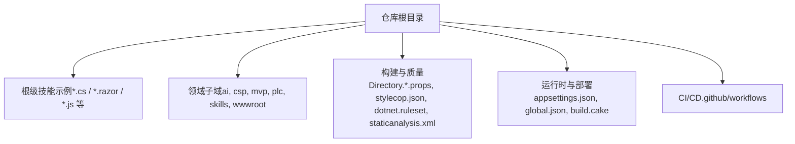
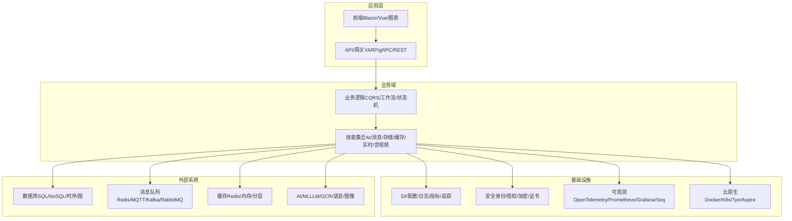
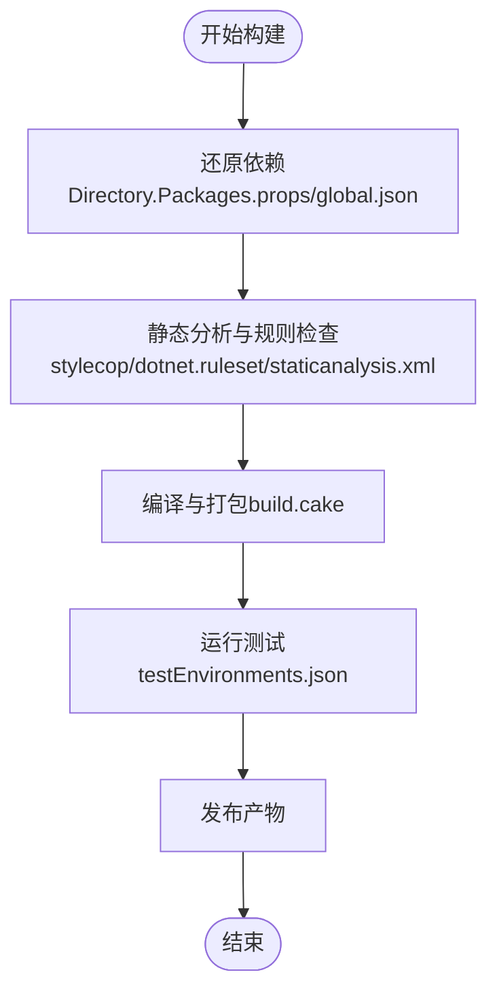
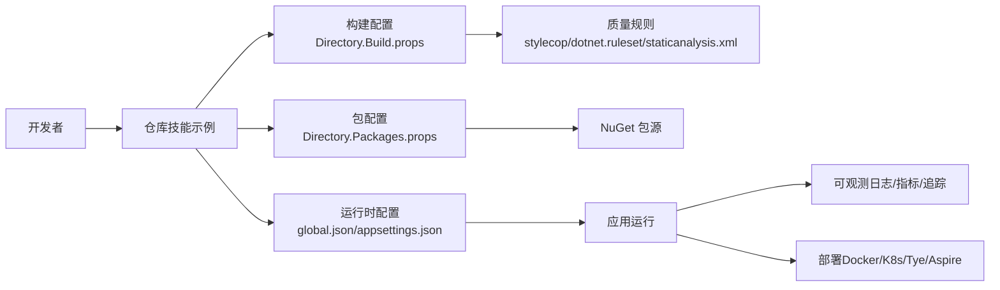

# 项目概述

<cite>
**本文档引用的文件**   
- [README.md](file://README.md)
- [Directory.Build.props](file://Directory.Build.props)
- [Directory.Packages.props](file://Directory.Packages.props)
- [global.json](file://global.json)
- [appsettings.json](file://appsettings.json)
- [build.cake](file://build.cake)
- [dotnet.ruleset](file://dotnet.ruleset)
- [stylecop.json](file://stylecop.json)
- [staticanalysis.xml](file://staticanalysis.xml)
- [testEnvironments.json](file://testEnvironments.json)
- [DotNet8UbuntuSolution.md](file://dotnet8_ubuntu_solution.md)
</cite>

## 目录
1. [简介](#简介)
2. [项目结构](#项目结构)
3. [核心组件](#核心组件)
4. [架构总览](#架构总览)
5. [详细组件分析](#详细组件分析)
6. [依赖关系分析](#依赖关系分析)
7. [性能考量](#性能考量)
8. [故障排查指南](#故障排查指南)
9. [结论](#结论)
10. [附录](#附录)

## 简介
VSA 是一个大型 .NET 技术集成示例项目，旨在以“技能（Skill）”为最小单元，系统性地展示 100+ 种主流技术与框架在真实场景中的组合与落地。项目覆盖微服务架构、AI 集成、实时通信、数据处理、分布式事务、可观测性、安全与合规、云原生与容器化等关键特性，帮助开发者快速掌握现代 .NET 生态的最佳实践与工程化方法。

核心价值
- 一站式技术图谱：将分散的 .NET 生态能力以统一的结构组织起来，降低学习成本与选型风险。
- 实战导向：每个“技能”都是可独立运行或组合运行的示例，便于按需裁剪与二次开发。
- 工程化完备：统一的构建、质量、发布与运维脚本，确保从开发到生产的一致性。
- 可扩展与可演进：以模块化与插件化设计支撑持续扩展新技术栈。

目标读者
- 初学者：通过概念性概述与快速开始，建立整体认知并快速上手。
- 有经验的开发者：深入理解架构模式、技术选型与实现细节，指导企业级落地。

[本节不直接分析具体文件]

## 项目结构
仓库采用“根级技能 + 领域子域”的组织方式：
- 根目录包含大量以“技能”命名的示例文件，按主题划分（如 AI、消息、缓存、数据库、前端、音视频、监控等）。
- 专用目录承载特定领域或工具链（如 ai、csp、mvp、plc、skills、wwwroot 等）。
- 构建与质量配置集中在根目录（Directory.*.props、stylecop.json、dotnet.ruleset、staticanalysis.xml 等）。
- 运行时与部署相关配置（appsettings.json、global.json、build.cake、.github/workflows 等）。

图示来源
- [Directory.Build.props](file://Directory.Build.props)
- [Directory.Packages.props](file://Directory.Packages.props)
- [global.json](file://global.json)
- [appsettings.json](file://appsettings.json)
- [build.cake](file://build.cake)

章节来源
- [README.md](file://README.md)
- [Directory.Build.props](file://Directory.Build.props)
- [Directory.Packages.props](file://Directory.Packages.props)
- [global.json](file://global.json)
- [appsettings.json](file://appsettings.json)
- [build.cake](file://build.cake)

## 核心组件
- 技能（Skill）：以单一职责的文件或小型模块为单位，演示某项技术的用法与最佳实践。例如：
  - 微服务与网关：YARP、gRPC、HTTP 客户端弹性与链路追踪等。
  - 消息与事件：MassTransit、MQTT、Redis Stream、Kafka 等。
  - 数据访问：EF Core、Dapper、LiteDB、SQLite、ClickHouse、InfluxDB 等。
  - 缓存与序列化：EasyCaching、FusionCache、MessagePack、SpanJson、ZeroFormatter 等。
  - 实时通信：SignalR、WebRTC、SIP/SORCS、流媒体处理等。
  - AI 与机器学习：Semantic Kernel、OllamaSharp、TensorFlowSharp、PaddleOCR、语音/图像/视频处理等。
  - 可观测性与治理：OpenTelemetry、Prometheus、Grafana、Seq、AppInsights、SkyAPM、Jaeger 等。
  - 安全与身份：IdentityServer/OpenIddict、Keycloak、CAS、JWT、国密算法、ACME 证书等。
  - 任务调度与工作流：Hangfire、Elsa、Coravel、FluentScheduler 等。
  - 前端与可视化：Blazor、Vue、ECharts、Highcharts、TailwindCSS 等。
  - 云原生与容器：Docker、Kubernetes、Tye、Aspire、Podman、K3s 等。
- 共享基础设施：
  - 构建与包管理：Directory.Build.props、Directory.Packages.props、global.json。
  - 代码质量：StyleCop、Roslyn Ruleset、静态分析规则。
  - 测试环境：testEnvironments.json。
  - 文档与平台适配：dotnet8_ubuntu_solution.md。

章节来源
- [Directory.Build.props](file://Directory.Build.props)
- [Directory.Packages.props](file://Directory.Packages.props)
- [global.json](file://global.json)
- [stylecop.json](file://stylecop.json)
- [dotnet.ruleset](file://dotnet.ruleset)
- [staticanalysis.xml](file://staticanalysis.xml)
- [testEnvironments.json](file://testEnvironments.json)
- [DotNet8UbuntuSolution.md](file://dotnet8_ubuntu_solution.md)

## 架构总览
VSA 采用“技能即示例”的扁平化架构，辅以领域子域进行归类。整体遵循以下原则：
- 模块化与高内聚低耦合：每个技能独立可测、可运行、可替换。
- 面向接口与抽象：通过约定与适配器模式屏蔽底层差异。
- 可观测性与可维护性：内置日志、指标、追踪与告警示例。
- 云原生优先：容器化、编排与服务发现示例齐全。
- 安全左移：认证授权、加密、审计与合规贯穿全链路。

图示来源
- [Directory.Build.props](file://Directory.Build.props)
- [Directory.Packages.props](file://Directory.Packages.props)
- [global.json](file://global.json)
- [appsettings.json](file://appsettings.json)
- [build.cake](file://build.cake)

## 详细组件分析
### 技能组织与命名规范
- 命名风格统一，便于检索与自动化处理。
- 每个技能文件通常包含：
  - 功能入口（注册、配置、示例调用）
  - 可选的中间件/处理器/管道
  - 测试与基准用例（部分）
- 建议：新增技能时保持单一职责，提供最小可运行示例与必要注释。

章节来源
- [Directory.Build.props](file://Directory.Build.props)
- [Directory.Packages.props](file://Directory.Packages.props)

### 构建与质量保障
- 构建：使用 Cake 脚本统一打包、发布与测试流程。
- 质量：StyleCop 规则、Roslyn Ruleset、静态分析 XML 约束代码风格与安全性。
- 包管理：集中式包版本管理，避免冲突与升级困难。
- 平台适配：提供 Ubuntu 下的 .NET 8 解决方案说明。

图示来源
- [build.cake](file://build.cake)
- [Directory.Packages.props](file://Directory.Packages.props)
- [global.json](file://global.json)
- [stylecop.json](file://stylecop.json)
- [dotnet.ruleset](file://dotnet.ruleset)
- [staticanalysis.xml](file://staticanalysis.xml)
- [testEnvironments.json](file://testEnvironments.json)

章节来源
- [build.cake](file://build.cake)
- [Directory.Packages.props](file://Directory.Packages.props)
- [global.json](file://global.json)
- [stylecop.json](file://stylecop.json)
- [dotnet.ruleset](file://dotnet.ruleset)
- [staticanalysis.xml](file://staticanalysis.xml)
- [testEnvironments.json](file://testEnvironments.json)

### 运行时与配置
- 全局运行时：global.json 指定 SDK/运行时版本与包源策略。
- 应用配置：appsettings.json 提供默认配置项与示例值。
- 多环境：可通过环境变量与配置文件覆盖，支持本地/测试/生产差异化。

章节来源
- [global.json](file://global.json)
- [appsettings.json](file://appsettings.json)

### 快速开始指南
- 前置条件：安装 .NET 8 SDK，确保平台兼容（参考 Ubuntu 方案说明）。
- 克隆与恢复：拉取仓库后执行依赖还原。
- 运行示例：选择某个技能文件作为入口，按 README 指引启动。
- 调试与测试：使用 IDE 或命令行运行测试与基准用例。
- 发布与部署：通过构建脚本生成制品，结合 Docker/K8s 部署。

章节来源
- [README.md](file://README.md)
- [DotNet8UbuntuSolution.md](file://dotnet8_ubuntu_solution.md)

## 依赖关系分析
- 包管理与版本治理：
  - Directory.Packages.props 集中声明公共包版本，减少不一致。
  - global.json 锁定 SDK/运行时与包源，保证构建稳定性。
- 构建与质量：
  - Directory.Build.props 统一 MSBuild 属性与目标，提升一致性。
  - StyleCop/Roslyn/静态分析确保代码质量与安全基线。
- 运行时与可观测：
  - appsettings.json 提供默认配置；日志、指标、追踪在各技能中复用。
- 云原生与编排：
  - Docker/K8s/Tye/Aspire 示例覆盖常见部署形态。

图示来源
- [Directory.Build.props](file://Directory.Build.props)
- [Directory.Packages.props](file://Directory.Packages.props)
- [global.json](file://global.json)
- [appsettings.json](file://appsettings.json)
- [stylecop.json](file://stylecop.json)
- [dotnet.ruleset](file://dotnet.ruleset)
- [staticanalysis.xml](file://staticanalysis.xml)

章节来源
- [Directory.Build.props](file://Directory.Build.props)
- [Directory.Packages.props](file://Directory.Packages.props)
- [global.json](file://global.json)
- [appsettings.json](file://appsettings.json)
- [stylecop.json](file://stylecop.json)
- [dotnet.ruleset](file://dotnet.ruleset)
- [staticanalysis.xml](file://staticanalysis.xml)

## 性能考量
- 序列化与传输：优先使用高性能序列化（MessagePack、SpanJson、ZeroFormatter），配合 HTTP/3、QUIC、压缩（Brotli/Zstd）优化网络。
- 缓存策略：多级缓存（内存/分布式/分层）与热点数据保护，合理设置过期与回源策略。
- 并发与异步：充分利用异步 I/O 与 Channel/DataFlow，避免阻塞线程池。
- 数据库与查询：读写分离、连接池、批量操作、索引优化与慢查询分析。
- 可观测性驱动优化：基于指标与追踪定位瓶颈，持续调优。

[本节为通用指导，不直接分析具体文件]

## 故障排查指南
- 常见问题定位：
  - 构建失败：检查 SDK/运行时版本与包源，确认 global.json 与 Directory.Packages.props 一致。
  - 运行异常：核对 appsettings.json 与环境变量，确认依赖服务可用。
  - 性能问题：查看指标与追踪，定位热点路径与资源争用。
  - 安全合规：检查证书、密钥与权限配置，确保符合策略。
- 调试建议：
  - 启用详细日志与结构化输出，结合 Seq/ELK 聚合分析。
  - 使用 Prometheus/Grafana 监控关键指标，设置告警阈值。
  - 利用 OpenTelemetry 进行端到端追踪，识别跨服务问题。

章节来源
- [appsettings.json](file://appsettings.json)
- [global.json](file://global.json)
- [testEnvironments.json](file://testEnvironments.json)

## 结论
VSA 以“技能”为核心单元，系统化整合了 .NET 生态的主流技术与框架，提供了从开发、测试、构建、发布到运维的全链路示例。其模块化、工程化与可观测性的设计理念，使其成为学习与落地的优质参考。建议团队根据业务需求选择性引入相关技能，并结合自身规范进行定制与扩展。

[本节为总结性内容，不直接分析具体文件]

## 附录
- 术语表
  - 技能（Skill）：演示某项技术的独立示例模块。
  - 可观测性：日志、指标、追踪的统一采集与分析能力。
  - 云原生：以容器、编排、服务网格为核心的现代应用架构范式。
- 参考文档
  - README.md：项目介绍与使用说明。
  - dotnet8_ubuntu_solution.md：Ubuntu 平台下的 .NET 8 解决方案说明。

章节来源
- [README.md](file://README.md)
- [DotNet8UbuntuSolution.md](file://dotnet8_ubuntu_solution.md)