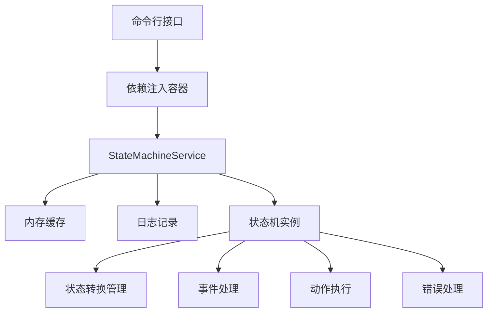
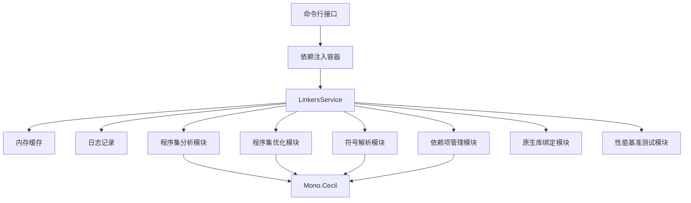
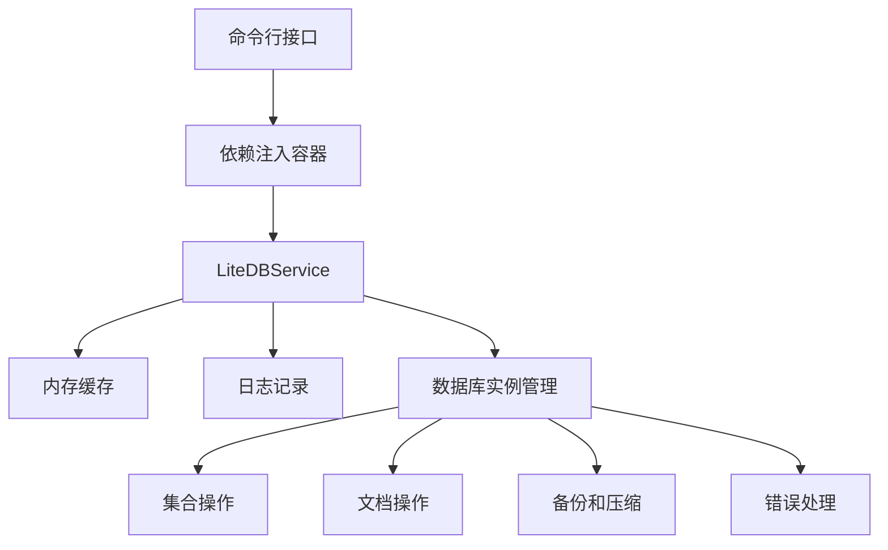

# LiquidState 技术参考文档

## 1. 架构概述

LiquidState 是一个基于 AOT（Ahead-of-Time）编译的状态机工具，专为 .NET 10.0 设计，提供了全面的状态管理、事件处理和状态转换功能。

### 1.1 核心架构

- **AOT 编译架构**：使用 .NET 10.0 的 AOT 编译能力，生成高性能的单文件可执行程序
- **依赖注入容器**：使用 Microsoft.Extensions.DependencyInjection 提供服务管理
- **内存缓存**：使用 Microsoft.Extensions.Caching.Memory 提高性能
- **命令行接口**：使用 System.CommandLine 提供丰富的命令行功能
- **状态机核心**：实现了完整的状态机功能，支持状态转换、事件触发和动作执行

### 1.2 组件关系



## 2. API 参考

### 2.1 StateMachineService 类

#### 2.1.1 构造函数

```csharp
public StateMachineService(ILogger<StateMachineService> logger, IMemoryCache cache)
```

**参数**：
- `logger`：日志记录器，用于记录操作日志
- `cache`：内存缓存，用于缓存状态机实例和提高性能

#### 2.1.2 CreateBuilder 方法

```csharp
public StateMachineBuilder<TState, TEvent> CreateBuilder<TState, TEvent>()
```

**功能**：创建状态机构建器，用于配置状态机

**泛型参数**：
- `TState`：状态类型
- `TEvent`：事件类型

**返回值**：状态机构建器实例

#### 2.1.3 RegisterStateMachine 方法

```csharp
public void RegisterStateMachine<TState, TEvent>(string name, IStateMachine<TState, TEvent> stateMachine)
```

**功能**：注册状态机实例

**参数**：
- `name`：状态机名称
- `stateMachine`：状态机实例

#### 2.1.4 GetStateMachine 方法

```csharp
public IStateMachine<TState, TEvent> GetStateMachine<TState, TEvent>(string name)
```

**功能**：获取状态机实例

**参数**：
- `name`：状态机名称

**返回值**：状态机实例

#### 2.1.5 RemoveStateMachine 方法

```csharp
public bool RemoveStateMachine(string name)
```

**功能**：移除状态机实例

**参数**：
- `name`：状态机名称

**返回值**：是否移除成功

#### 2.1.6 GetAllStateMachineNames 方法

```csharp
public IEnumerable<string> GetAllStateMachineNames()
```

**功能**：获取所有状态机名称

**返回值**：状态机名称列表

#### 2.1.7 StartAllStateMachines 方法

```csharp
public void StartAllStateMachines<TState>(TState initialState)
```

**功能**：启动所有状态机

**参数**：
- `initialState`：初始状态

#### 2.1.8 StopAllStateMachines 方法

```csharp
public void StopAllStateMachines()
```

**功能**：停止所有状态机

### 2.2 IStateMachine 接口

#### 2.2.1 CurrentState 属性

```csharp
TState CurrentState { get; }
```

**功能**：获取当前状态

**返回值**：当前状态

#### 2.2.2 FireAsync 方法

```csharp
Task<bool> FireAsync(TEvent @event);
```

**功能**：触发事件

**参数**：
- `event`：事件

**返回值**：是否成功触发

#### 2.2.3 Start 方法

```csharp
void Start(TState initialState);
```

**功能**：启动状态机

**参数**：
- `initialState`：初始状态

#### 2.2.4 Stop 方法

```csharp
void Stop();
```

**功能**：停止状态机

#### 2.2.5 Reset 方法

```csharp
void Reset(TState initialState);
```

**功能**：重置状态机

**参数**：
- `initialState`：新的初始状态

### 2.3 StateMachineBuilder 类

#### 2.3.1 AddTransition 方法

```csharp
public StateMachineBuilder<TState, TEvent> AddTransition(TState sourceState, TEvent @event, TState targetState, Func<Task> action = null, Func<bool> condition = null)
```

**功能**：添加状态转换

**参数**：
- `sourceState`：源状态
- `event`：事件
- `targetState`：目标状态
- `action`：转换动作（可选）
- `condition`：转换条件（可选）

**返回值**：构建器实例，支持链式调用

#### 2.3.2 AddEntryAction 方法

```csharp
public StateMachineBuilder<TState, TEvent> AddEntryAction(TState state, Func<Task> action)
```

**功能**：添加状态进入动作

**参数**：
- `state`：状态
- `action`：进入动作

**返回值**：构建器实例，支持链式调用

#### 2.3.3 AddExitAction 方法

```csharp
public StateMachineBuilder<TState, TEvent> AddExitAction(TState state, Func<Task> action)
```

**功能**：添加状态退出动作

**参数**：
- `state`：状态
- `action`：退出动作

**返回值**：构建器实例，支持链式调用

#### 2.3.4 WithErrorHandler 方法

```csharp
public StateMachineBuilder<TState, TEvent> WithErrorHandler(Action<Exception> errorHandler)
```

**功能**：设置错误处理程序

**参数**：
- `errorHandler`：错误处理程序

**返回值**：构建器实例，支持链式调用

#### 2.3.5 WithLogging 方法

```csharp
public StateMachineBuilder<TState, TEvent> WithLogging(bool enabled)
```

**功能**：启用或禁用日志

**参数**：
- `enabled`：是否启用

**返回值**：构建器实例，支持链式调用

#### 2.3.6 BuildConfig 方法

```csharp
public StateMachineConfig<TState, TEvent> BuildConfig()
```

**功能**：构建状态机配置

**返回值**：状态机配置

#### 2.3.7 Build 方法

```csharp
public IStateMachine<TState, TEvent> Build(IServiceProvider serviceProvider)
```

**功能**：构建状态机

**参数**：
- `serviceProvider`：服务提供者

**返回值**：状态机实例

### 2.4 命令行接口

#### 2.4.1 创建状态机

```bash
liquidstate_aot.exe create <name>
# 或
liquidstate_aot.exe c <name>
```

#### 2.4.2 启动状态机

```bash
liquidstate_aot.exe start <name> <initialState>
# 或
liquidstate_aot.exe s <name> <initialState>
```

#### 2.4.3 触发事件

```bash
liquidstate_aot.exe fire <name> <event>
# 或
liquidstate_aot.exe f <name> <event>
```

#### 2.4.4 停止状态机

```bash
liquidstate_aot.exe stop <name>
# 或
liquidstate_aot.exe st <name>
```

#### 2.4.5 列出状态机

```bash
liquidstate_aot.exe list
# 或
liquidstate_aot.exe l
```

#### 2.4.6 移除状态机

```bash
liquidstate_aot.exe remove <name>
# 或
liquidstate_aot.exe r <name>
```

#### 2.4.7 显示帮助信息

```bash
liquidstate_aot.exe help
# 或
liquidstate_aot.exe h
```

## 3. 配置选项

### 3.1 环境变量配置

| 环境变量 | 描述 | 默认值 |
|---------|------|--------|
| DOTNET_ENVIRONMENT | 运行环境 | Production |
| DOTNET_SYSTEM_GLOBALIZATION_INVARIANT | 是否禁用全球化 | false |
| DOTNET_RUNNING_IN_CONTAINER | 是否在容器中运行 | false |
| DOTNET_CLI_TELEMETRY_OPTOUT | 是否禁用遥测 | 1 |
| NUGET_XMLDOC_MODE | NuGet XML 文档模式 | skip |

### 3.2 构建配置

在 `liquidstate_aot.setting.json` 文件中配置构建选项：

| 配置项 | 描述 | 默认值 |
|-------|------|--------|
| publish_single_file | 是否生成单文件可执行程序 | true |
| self_contained | 是否自包含部署 | true |
| runtime_identifier | 运行时标识符 | win-x64 |
| optimize | 是否启用优化 | true |
| publish_trimmed | 是否裁剪未使用的代码 | true |
| lang_version | C# 语言版本 | preview |
| target_framework | 目标框架 | net11.0 |
| nullable | 是否启用可为空引用类型 | enable |
| implicit_usings | 是否启用隐式 using 指令 | enable |

### 3.3 运行时配置

在 `liquidstate_aot.run.json` 文件中配置运行时选项：

| 配置项 | 描述 | 默认值 |
|-------|------|--------|
| timeout_seconds | 命令超时时间（秒） | 30 |
| retry_attempts | 重试次数 | 3 |
| retry_delay_seconds | 重试延迟（秒） | 2 |
| success_codes | 成功退出代码 | [0] |
| failure_codes | 失败退出代码 | [1, 2, 3, 4, 5] |
| cpu_limit | CPU 限制 | 1 |
| memory_limit_mb | 内存限制（MB） | 1024 |
| disk_limit_mb | 磁盘限制（MB） | 512 |

## 4. 性能优化

### 4.1 缓存策略

- **内存缓存**：使用 Microsoft.Extensions.Caching.Memory 缓存状态机实例
- **缓存键设计**：使用状态机名称作为缓存键，确保缓存有效性
- **缓存过期**：设置适当的缓存过期时间，平衡性能和内存使用

### 4.2 并行处理

- **异步操作**：所有状态转换和动作都支持异步操作，避免阻塞主线程
- **任务并行**：使用 Task.Run 执行耗时的状态转换动作，提高响应速度

### 4.3 内存管理

- **使用 using 语句**：确保及时释放 IDisposable 资源
- **避免内存泄漏**：合理使用缓存大小限制
- **优化字符串操作**：使用 StringBuilder 进行大量字符串拼接

### 4.4 状态机优化

- **状态设计**：合理设计状态和转换，避免复杂的状态关系
- **动作优化**：优化状态转换动作，减少执行时间
- **条件优化**：优化转换条件，提高判断速度

## 5. 错误处理

### 5.1 异常类型

| 异常类型 | 描述 | 处理策略 |
|---------|------|----------|
| KeyNotFoundException | 状态机未找到 | 捕获并显示友好错误信息 |
| ArgumentException | 参数无效 | 捕获并显示友好错误信息 |
| IOException | I/O 错误 | 捕获并显示友好错误信息 |
| UnauthorizedAccessException | 权限不足 | 捕获并显示友好错误信息 |
| TimeoutException | 操作超时 | 捕获并显示友好错误信息 |
| OutOfMemoryException | 内存不足 | 捕获并显示友好错误信息 |
| Exception | 其他错误 | 捕获并显示友好错误信息 |

### 5.2 错误处理策略

- **全局异常处理**：在状态机服务中捕获所有异常
- **友好错误信息**：将技术异常转换为用户友好的错误信息
- **日志记录**：详细记录错误信息和堆栈跟踪到日志文件
- **重试机制**：对于网络或 I/O 相关的错误，实现指数退避重试策略

## 6. 部署

### 6.1 构建和发布

#### 6.1.1 构建命令

```bash
dotnet build scripts/liquidstate_aot.cs -c Release -r win-x64 --self-contained true
```

#### 6.1.2 发布命令

```bash
dotnet publish scripts/liquidstate_aot.cs -c Release -r win-x64 --self-contained true --publish-single-file true --publish-trimmed true
```

### 6.2 部署选项

| 部署方式 | 描述 | 适用场景 |
|---------|------|----------|
| 单文件可执行程序 | 生成单个可执行文件，包含所有依赖 | 独立部署、便携使用 |
| 自包含部署 | 包含完整的 .NET 运行时 | 无需安装 .NET 运行时的环境 |
| 框架依赖部署 | 依赖目标环境安装的 .NET 运行时 | 已安装 .NET 10.0 的环境 |

### 6.3 跨平台支持

| 平台 | 运行时标识符 | 支持状态 |
|------|--------------|----------|
| Windows x64 | win-x64 | 完全支持 |
| Windows x86 | win-x86 | 实验性支持 |
| Linux x64 | linux-x64 | 完全支持 |
| Linux ARM64 | linux-arm64 | 实验性支持 |
| macOS x64 | osx-x64 | 完全支持 |
| macOS ARM64 | osx-arm64 | 实验性支持 |

## 7. 监控

### 7.1 日志监控

- **日志级别**：支持 Trace、Debug、Information、Warning、Error、Critical 级别
- **日志格式**：包含时间戳、级别、源上下文、消息和异常信息
- **日志输出**：同时输出到控制台和文件
- **日志轮转**：按日轮转，保留最近 5 个日志文件，每个文件最大 10MB

### 7.2 性能监控

- **执行时间**：记录每个状态转换的执行时间
- **内存使用**：监控内存使用情况
- **线程使用**：监控线程池使用情况

## 8. 可扩展性

### 8.1 扩展方式

LiquidState 工具设计为可扩展的架构，支持通过以下方式扩展功能：

- **自定义状态和事件类型**：支持任意类型的状态和事件
- **自定义转换动作**：为状态转换添加自定义业务逻辑
- **自定义错误处理**：实现特定的错误处理策略
- **自定义日志记录**：集成自定义的日志记录系统

### 8.2 集成方式

- **命令行工具**：作为独立的命令行工具使用
- **库引用**：作为类库集成到其他项目中
- **API 调用**：通过 StateMachineService 类的 API 进行编程调用

## 9. 最佳实践

### 9.1 命令行使用

- **使用别名**：使用命令别名（如 `c` 代替 `create`）提高输入效率
- **指定有意义的名称**：为状态机指定有意义的名称，便于管理
- **使用适当的初始状态**：根据业务需求选择合适的初始状态
- **监控状态变化**：使用 `fire` 命令触发事件后，检查状态变化是否符合预期

### 9.2 编程集成

- **使用依赖注入**：通过依赖注入容器管理 StateMachineService 实例
- **配置日志和缓存**：根据应用需求配置适当的日志级别和缓存设置
- **处理异步操作**：正确处理 async/await 操作，避免同步阻塞
- **实现错误处理**：捕获并处理可能的异常

### 9.3 状态机设计

- **状态设计原则**：遵循单一职责原则，每个状态只负责特定的业务逻辑
- **转换设计**：保持状态转换逻辑简单明了，避免复杂的条件判断
- **动作设计**：将复杂的业务逻辑分解为多个小的动作，提高可维护性
- **错误处理**：为每个状态转换添加适当的错误处理逻辑

## 10. 常见问题

### 10.1 状态机创建失败

**问题**：执行 `create` 命令时失败

**可能原因**：
- 状态机名称已存在
- 内存不足
- 权限不足

**解决方案**：
- 使用不同的状态机名称
- 增加内存限制
- 以管理员身份运行命令

### 10.2 状态转换失败

**问题**：执行 `fire` 命令时状态转换失败

**可能原因**：
- 无匹配的状态转换
- 转换条件不满足
- 状态机未启动

**解决方案**：
- 检查状态转换配置
- 确保转换条件满足
- 先启动状态机

### 10.3 状态机启动失败

**问题**：执行 `start` 命令时状态机启动失败

**可能原因**：
- 状态机不存在
- 初始状态无效
- 内存不足

**解决方案**：
- 先创建状态机
- 使用有效的初始状态
- 增加内存限制

### 10.4 内存使用过高

**问题**：处理大型状态机时内存使用过高

**可能原因**：
- 状态机过于复杂
- 缓存设置不当，导致内存积累
- 并发操作过多，导致内存竞争

**解决方案**：
- 简化状态机设计
- 减少缓存大小或缩短缓存过期时间
- 减少并发操作数量
- 分批处理大型状态机

## 11. 版本历史

### 1.0.0 (2026-01-22)

- 初始版本
- 实现了完整的状态机功能，支持状态转换、事件触发和动作执行
- 采用 AOT 编译架构，提高性能
- 支持跨平台运行
- 提供详细的命令行接口

## 12. 参考资料

### 12.1 官方文档

- [.NET 10.0 文档](https://learn.microsoft.com/zh-cn/dotnet/)
- [Microsoft.Extensions.DependencyInjection 文档](https://learn.microsoft.com/zh-cn/dotnet/core/extensions/dependency-injection)
- [Microsoft.Extensions.Caching.Memory 文档](https://learn.microsoft.com/zh-cn/dotnet/core/extensions/caching)
- [System.CommandLine 文档](https://learn.microsoft.com/zh-cn/dotnet/standard/commandline/)

### 12.2 相关技术

- [.NET AOT 编译](https://learn.microsoft.com/zh-cn/dotnet/core/deploying/native-aot/)
- [状态机设计模式](https://learn.microsoft.com/zh-cn/dotnet/standard/design-patterns/state)
- [内存管理](https://learn.microsoft.com/zh-cn/dotnet/standard/garbage-collection/)
- [异步编程](https://learn.microsoft.com/zh-cn/dotnet/csharp/programming-guide/concepts/async/)

## 13. 附录

### 13.1 支持的命令别名

| 命令 | 别名 | 描述 |
|------|------|------|
| create | c | 创建状态机 |
| start | s | 启动状态机 |
| fire | f | 触发事件 |
| stop | st | 停止状态机 |
| list | l | 列出状态机 |
| remove | r | 移除状态机 |
| help | h | 显示帮助 |

### 13.2 错误代码

| 错误代码 | 描述 |
|---------|------|
| 0 | 成功 |
| 1 | 一般错误 |
| 2 | 状态机不存在 |
| 3 | 状态转换失败 |
| 4 | 参数无效 |
| 5 | 内存不足 |

### 13.3 环境变量

| 环境变量 | 类型 | 默认值 | 说明 |
|---------|------|--------|------|
| DOTNET_ENVIRONMENT | string | Production | 运行环境 |
| DOTNET_SYSTEM_GLOBALIZATION_INVARIANT | bool | false | 禁用全球化 |
| DOTNET_RUNNING_IN_CONTAINER | bool | false | 是否在容器中运行 |
| DOTNET_CLI_TELEMETRY_OPTOUT | int | 1 | 禁用遥测 |
| NUGET_XMLDOC_MODE | string | skip | NuGet XML 文档模式 |

# Linkers 技术参考文档

## 1. 架构概述

Linkers 是一个基于 AOT（Ahead-of-Time）编译的链接器工具，专为 .NET 10.0 设计，提供了全面的程序集分析、优化和验证功能。

### 1.1 核心架构

- **AOT 编译架构**：使用 .NET 10.0 的 AOT 编译能力，生成高性能的单文件可执行程序
- **依赖注入容器**：使用 Microsoft.Extensions.DependencyInjection 提供服务管理
- **内存缓存**：使用 Microsoft.Extensions.Caching.Memory 提高性能
- **命令行接口**：使用 System.CommandLine 提供丰富的命令行功能
- **反射和程序集分析**：使用 Mono.Cecil 和 System.Reflection 相关库进行程序集操作

### 1.2 组件关系



## 2. API 参考

### 2.1 LinkersService 类

#### 2.1.1 构造函数

```csharp
public LinkersService(ILogger<LinkersService> logger, IMemoryCache cache)
```

**参数**：
- `logger`：日志记录器，用于记录操作日志
- `cache`：内存缓存，用于缓存分析结果和提高性能

#### 2.1.2 AnalyzeAssemblyAsync 方法

```csharp
public async Task<string> AnalyzeAssemblyAsync(string assemblyPath)
```

**功能**：分析程序集的详细信息，包括名称、版本、类型、方法、字段等

**参数**：
- `assemblyPath`：程序集文件路径

**返回值**：包含分析结果的字符串

#### 2.1.3 ResolveSymbolAsync 方法

```csharp
public async Task<string> ResolveSymbolAsync(string assemblyPath, string symbolName)
```

**功能**：解析程序集中的符号，包括类型、方法、字段等

**参数**：
- `assemblyPath`：程序集文件路径
- `symbolName`：要解析的符号名称

**返回值**：包含解析结果的字符串

#### 2.1.4 ListDependenciesAsync 方法

```csharp
public async Task<string> ListDependenciesAsync(string assemblyPath)
```

**功能**：列出程序集的依赖项

**参数**：
- `assemblyPath`：程序集文件路径

**返回值**：包含依赖项列表的字符串

#### 2.1.5 OptimizeAssemblyAsync 方法

```csharp
public async Task<string> OptimizeAssemblyAsync(string inputPath, string outputPath, string optimizationLevel)
```

**功能**：优化程序集，减少文件大小，提高执行性能

**参数**：
- `inputPath`：输入程序集路径
- `outputPath`：输出程序集路径
- `optimizationLevel`：优化级别（low、medium、high）

**返回值**：包含优化结果的字符串

#### 2.1.6 VerifyAssemblyAsync 方法

```csharp
public async Task<string> VerifyAssemblyAsync(string assemblyPath)
```

**功能**：验证程序集的完整性和可用性

**参数**：
- `assemblyPath`：程序集文件路径

**返回值**：包含验证结果的字符串

#### 2.1.7 ExtractAssemblyAsync 方法

```csharp
public async Task<string> ExtractAssemblyAsync(string assemblyPath, string outputPath)
```

**功能**：提取程序集的内容，包括类型信息和资源

**参数**：
- `assemblyPath`：程序集文件路径
- `outputPath`：输出目录路径

**返回值**：包含提取结果的字符串

#### 2.1.8 GenerateBindingsAsync 方法

```csharp
public async Task<string> GenerateBindingsAsync(string nativeLibPath, string outputPath)
```

**功能**：生成原生库的 C# 绑定代码

**参数**：
- `nativeLibPath`：原生库文件路径
- `outputPath`：输出文件路径

**返回值**：包含生成结果的字符串

#### 2.1.9 RunBenchmarkAsync 方法

```csharp
public async Task<string> RunBenchmarkAsync(string assemblyPath, int iterations = 10)
```

**功能**：运行程序集的性能基准测试

**参数**：
- `assemblyPath`：程序集文件路径
- `iterations`：测试迭代次数（默认 10）

**返回值**：包含基准测试结果的字符串

### 2.2 命令行接口

#### 2.2.1 分析程序集

```bash
linkers_aot.exe analyze <assembly>
# 或
linkers_aot.exe a <assembly>
```

#### 2.2.2 解析符号

```bash
linkers_aot.exe resolve <assembly> <symbol>
# 或
linkers_aot.exe r <assembly> <symbol>
```

#### 2.2.3 列出依赖项

```bash
linkers_aot.exe list-dependencies <assembly>
# 或
linkers_aot.exe ld <assembly>
```

#### 2.2.4 优化程序集

```bash
linkers_aot.exe optimize <input> <output> [--level <level>]
# 或
linkers_aot.exe o <input> <output> [--level <level>]
```

#### 2.2.5 验证程序集

```bash
linkers_aot.exe verify <assembly>
# 或
linkers_aot.exe v <assembly>
```

#### 2.2.6 提取程序集内容

```bash
linkers_aot.exe extract <assembly> <output>
# 或
linkers_aot.exe e <assembly> <output>
```

#### 2.2.7 生成原生库绑定

```bash
linkers_aot.exe generate-bindings <native-lib> <output>
# 或
linkers_aot.exe gb <native-lib> <output>
```

#### 2.2.8 运行性能基准测试

```bash
linkers_aot.exe benchmark <assembly> [--iterations <iterations>]
# 或
linkers_aot.exe bm <assembly> [--iterations <iterations>]
```

#### 2.2.9 显示帮助信息

```bash
linkers_aot.exe help
# 或
linkers_aot.exe h
```

## 3. 配置选项

### 3.1 环境变量配置

| 环境变量 | 描述 | 默认值 |
|---------|------|--------|
| LINKERS_LOG_LEVEL | 日志级别 | INFO |
| LINKERS_CACHE_DIR | 缓存目录 | %LOCALAPPDATA%\Linkers\Cache |
| LINKERS_TEMP_DIR | 临时目录 | %TEMP%\Linkers |
| LINKERS_MAX_THREADS | 最大线程数 | 4 |
| LINKERS_ASSEMBLY_LOAD_TIMEOUT | 程序集加载超时（毫秒） | 30000 |
| LINKERS_SYMBOL_RESOLUTION_TIMEOUT | 符号解析超时（毫秒） | 60000 |
| LINKERS_OPTIMIZATION_TIMEOUT | 优化超时（毫秒） | 120000 |

### 3.2 构建配置

在 `linkers_aot.setting.json` 文件中配置构建选项：

| 配置项 | 描述 | 默认值 |
|-------|------|--------|
| publish_single_file | 是否生成单文件可执行程序 | true |
| self_contained | 是否自包含部署 | true |
| runtime_identifier | 运行时标识符 | win-x64 |
| optimize | 是否启用优化 | true |
| publish_trimmed | 是否裁剪未使用的代码 | true |
| lang_version | C# 语言版本 | preview |
| target_framework | 目标框架 | net11.0 |
| nullable | 是否启用可为空引用类型 | enable |
| implicit_usings | 是否启用隐式 using 指令 | enable |

### 3.3 运行时配置

在 `linkers_aot.run.json` 文件中配置运行时选项：

| 配置项 | 描述 | 默认值 |
|-------|------|--------|
| timeout_ms | 命令超时时间（毫秒） | 300000 |
| max_memory_mb | 最大内存使用（MB） | 2048 |
| max_threads | 最大线程数 | 4 |
| log_level | 日志级别 | Information |
| log_file | 日志文件路径 | %TEMP%\Linkers\linkers.log |

## 4. 性能优化

### 4.1 缓存策略

- **内存缓存**：使用 Microsoft.Extensions.Caching.Memory 缓存分析结果
- **缓存键设计**：使用程序集路径和最后修改时间作为缓存键，确保缓存有效性
- **缓存过期**：设置 30 分钟的绝对过期时间，平衡性能和内存使用

### 4.2 并行处理

- **多线程处理**：根据 LINKERS_MAX_THREADS 环境变量设置线程池大小
- **异步操作**：所有主要方法都使用 async/await 模式，避免阻塞主线程

### 4.3 内存管理

- **使用 using 语句**：确保及时释放 IDisposable 资源
- **避免内存泄漏**：合理使用缓存大小限制
- **优化字符串操作**：使用 StringBuilder 进行大量字符串拼接

### 4.4 程序集操作优化

- **按需加载**：只加载必要的程序集和模块
- **延迟解析**：避免一次性解析所有符号
- **批处理操作**：对相似操作进行批处理，减少重复工作

## 5. 错误处理

### 5.1 异常类型

| 异常类型 | 描述 | 处理策略 |
|---------|------|----------|
| FileNotFoundException | 文件不存在 | 捕获并显示友好错误信息 |
| BadImageFormatException | 程序集格式无效 | 捕获并显示友好错误信息 |
| IOException | I/O 错误 | 捕获并显示友好错误信息 |
| UnauthorizedAccessException | 权限不足 | 捕获并显示友好错误信息 |
| TimeoutException | 操作超时 | 捕获并显示友好错误信息 |
| OutOfMemoryException | 内存不足 | 捕获并显示友好错误信息 |
| Exception | 其他错误 | 捕获并显示友好错误信息 |

### 5.2 错误处理策略

- **全局异常处理**：在命令行处理器中捕获所有异常
- **友好错误信息**：将技术异常转换为用户友好的错误信息
- **日志记录**：详细记录错误信息和堆栈跟踪到日志文件
- **重试机制**：对于网络或 I/O 相关的错误，实现指数退避重试策略

## 6. 部署

### 6.1 构建和发布

#### 6.1.1 构建命令

```bash
dotnet build scripts/linkers_aot.cs -c Release -r win-x64 --self-contained true
```

#### 6.1.2 发布命令

```bash
dotnet publish scripts/linkers_aot.cs -c Release -r win-x64 --self-contained true --publish-single-file true --publish-trimmed true
```

### 6.2 部署选项

| 部署方式 | 描述 | 适用场景 |
|---------|------|----------|
| 单文件可执行程序 | 生成单个可执行文件，包含所有依赖 | 独立部署、便携使用 |
| 自包含部署 | 包含完整的 .NET 运行时 | 无需安装 .NET 运行时的环境 |
| 框架依赖部署 | 依赖目标环境安装的 .NET 运行时 | 已安装 .NET 10.0 的环境 |

### 6.3 跨平台支持

| 平台 | 运行时标识符 | 支持状态 |
|------|--------------|----------|
| Windows x64 | win-x64 | 完全支持 |
| Windows x86 | win-x86 | 实验性支持 |
| Linux x64 | linux-x64 | 完全支持 |
| Linux ARM64 | linux-arm64 | 实验性支持 |
| macOS x64 | osx-x64 | 完全支持 |
| macOS ARM64 | osx-arm64 | 实验性支持 |

## 7. 监控

### 7.1 日志监控

- **日志级别**：支持 Trace、Debug、Information、Warning、Error、Critical 级别
- **日志格式**：包含时间戳、级别、源上下文、消息和异常信息
- **日志输出**：同时输出到控制台和文件
- **日志轮转**：按日轮转，保留最近 5 个日志文件，每个文件最大 10MB

### 7.2 性能监控

- **基准测试**：使用内置的 benchmark 命令进行性能测试
- **执行时间**：记录每个操作的执行时间
- **内存使用**：监控内存使用情况
- **线程使用**：监控线程池使用情况

## 8. 可扩展性

### 8.1 插件系统

Linkers 工具设计为可扩展的架构，支持通过以下方式扩展功能：

- **自定义分析器**：继承并扩展 LinkersService 类
- **自定义命令**：通过 System.CommandLine 添加新的命令
- **自定义优化策略**：实现不同的程序集优化策略

### 8.2 集成方式

- **命令行工具**：作为独立的命令行工具使用
- **库引用**：作为类库集成到其他项目中
- **API 调用**：通过 LinkersService 类的 API 进行编程调用

## 9. 最佳实践

### 9.1 命令行使用

- **使用别名**：使用命令别名（如 `a` 代替 `analyze`）提高输入效率
- **指定完整路径**：为程序集文件指定完整路径，避免路径解析错误
- **使用适当的优化级别**：根据需要选择合适的优化级别（low、medium、high）
- **检查依赖项**：在优化前使用 `list-dependencies` 命令检查依赖项

### 9.2 编程集成

- **使用依赖注入**：通过依赖注入容器管理 LinkersService 实例
- **配置日志和缓存**：根据应用需求配置适当的日志级别和缓存设置
- **处理异步操作**：正确处理 async/await 操作，避免同步阻塞
- **实现错误处理**：捕获并处理可能的异常

### 9.3 性能优化

- **缓存分析结果**：对于重复分析的程序集，利用缓存提高性能
- **并行处理**：对于多个程序集的操作，考虑并行处理
- **合理设置超时**：根据程序集大小设置适当的超时时间
- **监控资源使用**：监控内存和 CPU 使用情况，避免资源耗尽

## 10. 常见问题

### 10.1 程序集分析失败

**问题**：执行 `analyze` 命令时失败

**可能原因**：
- 程序集文件不存在或路径错误
- 程序集损坏或格式无效
- 缺少必要的依赖项
- 权限不足，无法读取文件

**解决方案**：
- 检查文件路径是否正确
- 验证程序集是否完整有效
- 确保所有依赖项都可用
- 以管理员身份运行命令

### 10.2 优化后程序集无法运行

**问题**：优化后的程序集无法正常运行

**可能原因**：
- 优化级别过高，移除了必要的代码
- 符号信息被移除，影响调试
- 依赖项解析失败

**解决方案**：
- 使用较低的优化级别（如 medium 或 low）
- 保留符号信息（在 high 级别会被移除）
- 确保所有依赖项都存在于目标环境

### 10.3 内存使用过高

**问题**：处理大型程序集时内存使用过高

**可能原因**：
- 程序集过大，需要加载大量数据
- 缓存设置不当，导致内存积累
- 并行处理线程过多，导致内存竞争

**解决方案**：
- 增加最大内存限制（max_memory_mb）
- 减少缓存大小或缩短缓存过期时间
- 减少最大线程数（LINKERS_MAX_THREADS）
- 分批处理大型程序集

### 10.4 符号解析失败

**问题**：执行 `resolve` 命令时无法找到符号

**可能原因**：
- 符号名称拼写错误
- 符号不存在于指定的程序集中
- 符号是私有或内部的，无法通过公共 API 访问
- 程序集损坏或格式无效

**解决方案**：
- 检查符号名称拼写
- 确认符号存在于程序集中
- 使用 `analyze` 命令查看程序集的完整内容
- 验证程序集是否完整有效

## 11. 版本历史

### 1.0.0 (2026-01-22)

- 初始版本
- 实现了程序集分析、符号解析、依赖项列出、程序集优化、程序集验证、程序集内容提取、原生库绑定生成和性能基准测试功能
- 采用 AOT 编译架构，提高性能
- 支持跨平台运行
- 提供详细的命令行接口

## 12. 参考资料

### 12.1 官方文档

- [.NET 10.0 文档](https://learn.microsoft.com/zh-cn/dotnet/)
- [Microsoft.Extensions.DependencyInjection 文档](https://learn.microsoft.com/zh-cn/dotnet/core/extensions/dependency-injection)
- [Microsoft.Extensions.Caching.Memory 文档](https://learn.microsoft.com/zh-cn/dotnet/core/extensions/caching)
- [System.CommandLine 文档](https://learn.microsoft.com/zh-cn/dotnet/standard/commandline/)
- [Mono.Cecil 文档](https://github.com/jbevain/cecil)

### 12.2 相关技术

- [.NET AOT 编译](https://learn.microsoft.com/zh-cn/dotnet/core/deploying/native-aot/)
- [程序集反射](https://learn.microsoft.com/zh-cn/dotnet/framework/reflection-and-codedom/reflection)
- [内存管理](https://learn.microsoft.com/zh-cn/dotnet/standard/garbage-collection/)
- [异步编程](https://learn.microsoft.com/zh-cn/dotnet/csharp/programming-guide/concepts/async/)

## 13. 附录

### 13.1 支持的文件类型

| 文件类型 | 描述 | 支持状态 |
|---------|------|----------|
| .dll | .NET 程序集 | 完全支持 |
| .exe | .NET 可执行文件 | 完全支持 |
| .netmodule | .NET 模块 | 部分支持 |
| .winmd | Windows 运行时元数据 | 部分支持 |

### 13.2 支持的命令别名

| 命令 | 别名 | 描述 |
|------|------|------|
| analyze | a | 分析程序集 |
| resolve | r | 解析符号 |
| list-dependencies | ld | 列出依赖项 |
| optimize | o | 优化程序集 |
| verify | v | 验证程序集 |
| extract | e | 提取内容 |
| generate-bindings | gb | 生成绑定 |
| benchmark | bm | 运行基准测试 |
| help | h | 显示帮助 |

### 13.3 错误代码

| 错误代码 | 描述 |
|---------|------|
| 0 | 成功 |
| 1 | 一般错误 |
| 2 | 文件不存在 |
| 3 | 权限不足 |
| 4 | 程序集格式无效 |
| 5 | 操作超时 |
| 6 | 内存不足 |
| 7 | 依赖项缺失 |

### 13.4 环境变量

| 环境变量 | 类型 | 默认值 | 说明 |
|---------|------|--------|------|
| LINKERS_LOG_LEVEL | string | INFO | 日志级别 (Trace, Debug, Information, Warning, Error, Critical) |
| LINKERS_CACHE_DIR | string | %LOCALAPPDATA%\Linkers\Cache | 缓存目录路径 |
| LINKERS_TEMP_DIR | string | %TEMP%\Linkers | 临时文件目录 |
| LINKERS_MAX_THREADS | int | 4 | 最大线程数 |
| LINKERS_ASSEMBLY_LOAD_TIMEOUT | int | 30000 | 程序集加载超时 (毫秒) |
| LINKERS_SYMBOL_RESOLUTION_TIMEOUT | int | 60000 | 符号解析超时 (毫秒) |
| LINKERS_OPTIMIZATION_TIMEOUT | int | 120000 | 优化操作超时 (毫秒) |
| DOTNET_SYSTEM_GLOBALIZATION_INVARIANT | bool | false | 禁用全球化 |
| DOTNET_CLI_TELEMETRY_OPTOUT | int | 1 | 禁用遥测 |

# LiteDB 技术参考文档

## 1. 架构概述

LiteDB 是一个轻量级的 .NET NoSQL 嵌入式数据库，专为简单应用程序设计。本技术参考文档详细介绍了基于 AOT（Ahead-of-Time）编译的 LiteDB 工具，支持各种数据库操作，包括集合管理、文档 CRUD 操作、备份和压缩等功能。

### 1.1 核心架构

- **AOT 编译架构**：使用 .NET 10.0 的 AOT 编译能力，生成高性能的单文件可执行程序
- **依赖注入容器**：使用 Microsoft.Extensions.DependencyInjection 提供服务管理
- **内存缓存**：使用 Microsoft.Extensions.Caching.Memory 提高性能
- **命令行接口**：使用 System.CommandLine 提供丰富的命令行功能
- **LiteDB 核心**：使用 LiteDB 5.0.16 提供数据库功能

### 1.2 组件关系



## 2. API 参考

### 2.1 LiteDBService 类

#### 2.1.1 构造函数

```csharp
public LiteDBService(ILogger<LiteDBService> logger, IMemoryCache cache)
```

**参数**：
- `logger`：日志记录器，用于记录操作日志
- `cache`：内存缓存，用于缓存数据库实例和提高性能

#### 2.1.2 GetDatabase 方法

```csharp
public ILiteDatabase GetDatabase(string databasePath)
```

**功能**：获取数据库实例

**参数**：
- `databasePath`：数据库路径

**返回值**：数据库实例

#### 2.1.3 CreateCollectionAsync 方法

```csharp
public async Task<bool> CreateCollectionAsync(string databasePath, string collectionName)
```

**功能**：创建集合

**参数**：
- `databasePath`：数据库路径
- `collectionName`：集合名称

**返回值**：是否成功

#### 2.1.4 InsertDocumentAsync 方法

```csharp
public async Task<string> InsertDocumentAsync(string databasePath, string collectionName, string document)
```

**功能**：插入文档

**参数**：
- `databasePath`：数据库路径
- `collectionName`：集合名称
- `document`：文档内容

**返回值**：插入结果

#### 2.1.5 QueryDocumentsAsync 方法

```csharp
public async Task<string> QueryDocumentsAsync(string databasePath, string collectionName, string query = null)
```

**功能**：查询文档

**参数**：
- `databasePath`：数据库路径
- `collectionName`：集合名称
- `query`：查询条件（可选）

**返回值**：查询结果

#### 2.1.6 UpdateDocumentAsync 方法

```csharp
public async Task<bool> UpdateDocumentAsync(string databasePath, string collectionName, string id, string document)
```

**功能**：更新文档

**参数**：
- `databasePath`：数据库路径
- `collectionName`：集合名称
- `id`：文档ID
- `document`：文档内容

**返回值**：是否成功

#### 2.1.7 DeleteDocumentAsync 方法

```csharp
public async Task<bool> DeleteDocumentAsync(string databasePath, string collectionName, string id)
```

**功能**：删除文档

**参数**：
- `databasePath`：数据库路径
- `collectionName`：集合名称
- `id`：文档ID

**返回值**：是否成功

#### 2.1.8 DropCollectionAsync 方法

```csharp
public async Task<bool> DropCollectionAsync(string databasePath, string collectionName)
```

**功能**：删除集合

**参数**：
- `databasePath`：数据库路径
- `collectionName`：集合名称

**返回值**：是否成功

#### 2.1.9 ListCollectionsAsync 方法

```csharp
public async Task<string> ListCollectionsAsync(string databasePath)
```

**功能**：列出所有集合

**参数**：
- `databasePath`：数据库路径

**返回值**：集合列表

#### 2.1.10 BackupDatabaseAsync 方法

```csharp
public async Task<bool> BackupDatabaseAsync(string databasePath, string backupPath)
```

**功能**：备份数据库

**参数**：
- `databasePath`：数据库路径
- `backupPath`：备份路径

**返回值**：是否成功

#### 2.1.11 CompactDatabaseAsync 方法

```csharp
public async Task<bool> CompactDatabaseAsync(string databasePath)
```

**功能**：压缩数据库

**参数**：
- `databasePath`：数据库路径

**返回值**：是否成功

#### 2.1.12 GetDatabaseInfoAsync 方法

```csharp
public async Task<string> GetDatabaseInfoAsync(string databasePath)
```

**功能**：获取数据库信息

**参数**：
- `databasePath`：数据库路径

**返回值**：数据库信息

### 2.2 命令行接口

#### 2.2.1 创建集合

```bash
litedb_aot.exe create-collection --database <path> --collection <name>
```

#### 2.2.2 插入文档

```bash
litedb_aot.exe insert --database <path> --collection <name> --document <json>
```

#### 2.2.3 查询文档

```bash
litedb_aot.exe query --database <path> --collection <name> [--query <condition>]
```

#### 2.2.4 更新文档

```bash
litedb_aot.exe update --database <path> --collection <name> --id <id> --document <json>
```

#### 2.2.5 删除文档

```bash
litedb_aot.exe delete --database <path> --collection <name> --id <id>
```

#### 2.2.6 删除集合

```bash
litedb_aot.exe drop-collection --database <path> --collection <name>
```

#### 2.2.7 列出所有集合

```bash
litedb_aot.exe list-collections --database <path>
```

#### 2.2.8 备份数据库

```bash
litedb_aot.exe backup --database <path> --backup <backup-path>
```

#### 2.2.9 压缩数据库

```bash
litedb_aot.exe compact --database <path>
```

#### 2.2.10 获取数据库信息

```bash
litedb_aot.exe info --database <path>
```

## 3. 配置选项

### 3.1 环境变量配置

| 环境变量 | 描述 | 默认值 |
|---------|------|--------|
| LITEDB_LOG_LEVEL | 日志级别 | Information |
| LITEDB_CACHE_SIZE | 缓存大小 (KB) | 1024 |
| LITEDB_TIMEOUT | 超时时间 (毫秒) | 60000 |
| LITEDB_JOURNAL | 是否启用日志 | true |
| DOTNET_ENVIRONMENT | 运行环境 | Production |
| DOTNET_SYSTEM_GLOBALIZATION_INVARIANT | 是否禁用全球化 | false |
| DOTNET_RUNNING_IN_CONTAINER | 是否在容器中运行 | false |
| DOTNET_CLI_TELEMETRY_OPTOUT | 是否禁用遥测 | 1 |
| NUGET_XMLDOC_MODE | NuGet XML 文档模式 | skip |

### 3.2 构建配置

在 `litedb_aot.setting.json` 文件中配置构建选项：

| 配置项 | 描述 | 默认值 |
|-------|------|--------|
| publish_single_file | 是否生成单文件可执行程序 | true |
| self_contained | 是否自包含部署 | true |
| runtime_identifier | 运行时标识符 | win-x64 |
| optimize | 是否启用优化 | true |
| publish_trimmed | 是否裁剪未使用的代码 | true |
| lang_version | C# 语言版本 | preview |
| target_framework | 目标框架 | net11.0 |
| nullable | 是否启用可为空引用类型 | enable |
| implicit_usings | 是否启用隐式 using 指令 | enable |

### 3.3 数据库连接选项

| 配置项 | 描述 | 默认值 |
|-------|------|--------|
| Mode | 文件模式 | Exclusive |
| Journal | 是否启用日志 | true |
| CacheSize | 缓存大小 (KB) | 1024 |
| Timeout | 超时时间 | 1 分钟 |

## 4. 性能优化

### 4.1 缓存策略

- **内存缓存**：使用 Microsoft.Extensions.Caching.Memory 缓存数据库实例
- **连接池**：维护数据库连接池，减少连接开销
- **缓存键设计**：使用数据库路径作为缓存键，确保缓存有效性

### 4.2 并行处理

- **异步操作**：所有数据库操作都支持异步执行，避免阻塞主线程
- **任务并行**：对于多个文档的操作，考虑使用并行处理提高性能

### 4.3 内存管理

- **使用 using 语句**：确保及时释放 IDisposable 资源
- **避免内存泄漏**：合理使用缓存大小限制
- **优化字符串操作**：使用 StringBuilder 进行大量字符串拼接

### 4.4 数据库优化

- **集合设计**：合理设计集合结构，避免过度嵌套
- **查询优化**：使用索引和适当的查询条件，提高查询性能
- **批量操作**：对于多个文档的操作，考虑使用批量处理
- **定期压缩**：定期执行数据库压缩操作，减少文件大小

## 5. 错误处理

### 5.1 异常类型

| 异常类型 | 描述 | 处理策略 |
|---------|------|----------|
| FileNotFoundException | 文件不存在 | 捕获并显示友好错误信息 |
| IOException | I/O 错误 | 捕获并显示友好错误信息 |
| UnauthorizedAccessException | 权限不足 | 捕获并显示友好错误信息 |
| TimeoutException | 操作超时 | 捕获并显示友好错误信息 |
| OutOfMemoryException | 内存不足 | 捕获并显示友好错误信息 |
| LiteException | LiteDB 特定错误 | 捕获并显示友好错误信息 |
| Exception | 其他错误 | 捕获并显示友好错误信息 |

### 5.2 错误处理策略

- **全局异常处理**：在命令行处理器中捕获所有异常
- **友好错误信息**：将技术异常转换为用户友好的错误信息
- **日志记录**：详细记录错误信息和堆栈跟踪到日志文件
- **重试机制**：对于网络或 I/O 相关的错误，实现指数退避重试策略

## 6. 部署

### 6.1 构建和发布

#### 6.1.1 构建命令

```bash
dotnet build scripts/litedb_aot.cs -c Release -r win-x64 --self-contained true
```

#### 6.1.2 发布命令

```bash
dotnet publish scripts/litedb_aot.cs -c Release -r win-x64 --self-contained true --publish-single-file true --publish-trimmed true
```

### 6.2 部署选项

| 部署方式 | 描述 | 适用场景 |
|---------|------|----------|
| 单文件可执行程序 | 生成单个可执行文件，包含所有依赖 | 独立部署、便携使用 |
| 自包含部署 | 包含完整的 .NET 运行时 | 无需安装 .NET 运行时的环境 |
| 框架依赖部署 | 依赖目标环境安装的 .NET 运行时 | 已安装 .NET 10.0 的环境 |

### 6.3 跨平台支持

| 平台 | 运行时标识符 | 支持状态 |
|------|--------------|----------|
| Windows x64 | win-x64 | 完全支持 |
| Linux x64 | linux-x64 | 完全支持 |
| macOS x64 | osx-x64 | 完全支持 |

## 7. 监控

### 7.1 日志监控

- **日志级别**：支持 Trace、Debug、Information、Warning、Error、Critical 级别
- **日志格式**：包含时间戳、级别、源上下文、消息和异常信息
- **日志输出**：同时输出到控制台和文件
- **日志轮转**：按日轮转，保留最近 5 个日志文件，每个文件最大 10MB

### 7.2 性能监控

- **执行时间**：记录每个数据库操作的执行时间
- **内存使用**：监控内存使用情况
- **文件大小**：监控数据库文件大小变化

## 8. 可扩展性

### 8.1 扩展方式

LiteDB 工具设计为可扩展的架构，支持通过以下方式扩展功能：

- **自定义数据模型**：定义适合业务需求的数据模型
- **自定义序列化**：实现特定类型的序列化和反序列化
- **自定义索引**：为集合添加自定义索引
- **自定义查询**：实现复杂的查询逻辑

### 8.2 集成方式

- **命令行工具**：作为独立的命令行工具使用
- **库引用**：作为类库集成到其他项目中
- **API 调用**：通过 LiteDBService 类的 API 进行编程调用

## 9. 最佳实践

### 9.1 命令行使用

- **使用完整路径**：为数据库文件指定完整路径，避免路径解析错误
- **验证输入**：确保输入的 JSON 文档格式正确
- **定期备份**：定期执行数据库备份操作，防止数据丢失
- **监控文件大小**：监控数据库文件大小，及时执行压缩操作

### 9.2 编程集成

- **使用依赖注入**：通过依赖注入容器管理 LiteDBService 实例
- **配置日志和缓存**：根据应用需求配置适当的日志级别和缓存设置
- **处理异步操作**：正确处理 async/await 操作，避免同步阻塞
- **实现错误处理**：捕获并处理可能的异常

### 9.3 数据库设计

- **集合设计**：根据业务需求合理设计集合结构
- **索引设计**：为频繁查询的字段添加索引
- **数据建模**：使用适当的数据类型和结构
- **避免过度嵌套**：避免深度嵌套的文档结构，影响查询性能

## 10. 常见问题

### 10.1 数据库文件被占用

**问题**：执行操作时提示数据库文件被占用

**可能原因**：
- 其他进程正在使用该数据库文件
- 数据库连接未正确关闭
- 程序崩溃导致锁定文件未释放

**解决方案**：
- 确保没有其他进程正在使用该数据库文件
- 确保正确关闭数据库连接
- 删除锁定文件（如果存在）

### 10.2 文档插入失败

**问题**：执行 insert 命令时失败

**可能原因**：
- 文档格式无效（不是有效的 JSON）
- 集合不存在
- 数据库文件权限不足
- 数据库文件大小达到限制

**解决方案**：
- 检查文档格式是否正确
- 确保集合存在（或自动创建）
- 检查文件权限
- 考虑压缩数据库或增加存储容量

### 10.3 查询返回空结果

**问题**：执行 query 命令时返回空结果

**可能原因**：
- 查询条件不正确
- 集合中没有符合条件的文档
- 集合不存在
- 数据库路径错误

**解决方案**：
- 检查查询条件是否正确
- 确认集合中存在数据
- 确保集合存在
- 检查数据库路径是否正确

### 10.4 备份失败

**问题**：执行 backup 命令时失败

**可能原因**：
- 备份目录不存在
- 备份目录权限不足
- 磁盘空间不足
- 数据库文件被占用

**解决方案**：
- 确保备份目录存在
- 检查目录权限
- 确保磁盘空间充足
- 确保数据库文件未被其他进程占用

### 10.5 内存使用过高

**问题**：处理大型数据库时内存使用过高

**可能原因**：
- 数据库文件过大
- 缓存设置不当，导致内存积累
- 同时处理大量文档
- 内存泄漏

**解决方案**：
- 优化数据库设计，减少文件大小
- 减少缓存大小或缩短缓存过期时间
- 分批处理大量文档
- 确保正确释放资源

## 11. 版本历史

### 1.0.0 (2026-01-22)

- 初始版本
- 实现了完整的 LiteDB 工具，支持集合管理、文档 CRUD 操作、备份和压缩等功能
- 采用 AOT 编译架构，提高性能
- 支持跨平台运行
- 提供详细的命令行接口

## 12. 参考资料

### 12.1 官方文档

- [.NET 10.0 文档](https://learn.microsoft.com/zh-cn/dotnet/)
- [Microsoft.Extensions.DependencyInjection 文档](https://learn.microsoft.com/zh-cn/dotnet/core/extensions/dependency-injection)
- [Microsoft.Extensions.Caching.Memory 文档](https://learn.microsoft.com/zh-cn/dotnet/core/extensions/caching)
- [System.CommandLine 文档](https://learn.microsoft.com/zh-cn/dotnet/standard/commandline/)
- [LiteDB 文档](https://www.litedb.org/docs/)

### 12.2 相关技术

- [.NET AOT 编译](https://learn.microsoft.com/zh-cn/dotnet/core/deploying/native-aot/)
- [NoSQL 数据库设计](https://learn.microsoft.com/zh-cn/azure/cosmos-db/nosql/modeling-data)
- [内存管理](https://learn.microsoft.com/zh-cn/dotnet/standard/garbage-collection/)
- [异步编程](https://learn.microsoft.com/zh-cn/dotnet/csharp/programming-guide/concepts/async/)

## 13. 附录

### 13.1 支持的文件格式

| 文件类型 | 描述 | 支持状态 |
|---------|------|----------|
| .db | LiteDB 数据库文件 | 完全支持 |
| .litedb | LiteDB 数据库文件 | 完全支持 |

### 13.2 错误代码

| 错误代码 | 描述 |
|---------|------|
| 0 | 成功 |
| 1 | 一般错误 |
| 2 | 数据库不存在 |
| 3 | 集合不存在 |
| 4 | 文档格式无效 |
| 5 | 权限不足 |
| 6 | 操作超时 |
| 7 | 内存不足 |
| 8 | I/O 错误 |

### 13.3 环境变量

| 环境变量 | 类型 | 默认值 | 说明 |
|---------|------|--------|------|
| LITEDB_LOG_LEVEL | string | Information | 日志级别 (Trace, Debug, Information, Warning, Error, Critical) |
| LITEDB_CACHE_SIZE | int | 1024 | 缓存大小 (KB) |
| LITEDB_TIMEOUT | int | 60000 | 超时时间 (毫秒) |
| LITEDB_JOURNAL | bool | true | 是否启用日志 |
| DOTNET_ENVIRONMENT | string | Production | 运行环境 |
| DOTNET_SYSTEM_GLOBALIZATION_INVARIANT | bool | false | 禁用全球化 |
| DOTNET_CLI_TELEMETRY_OPTOUT | int | 1 | 禁用遥测 |
