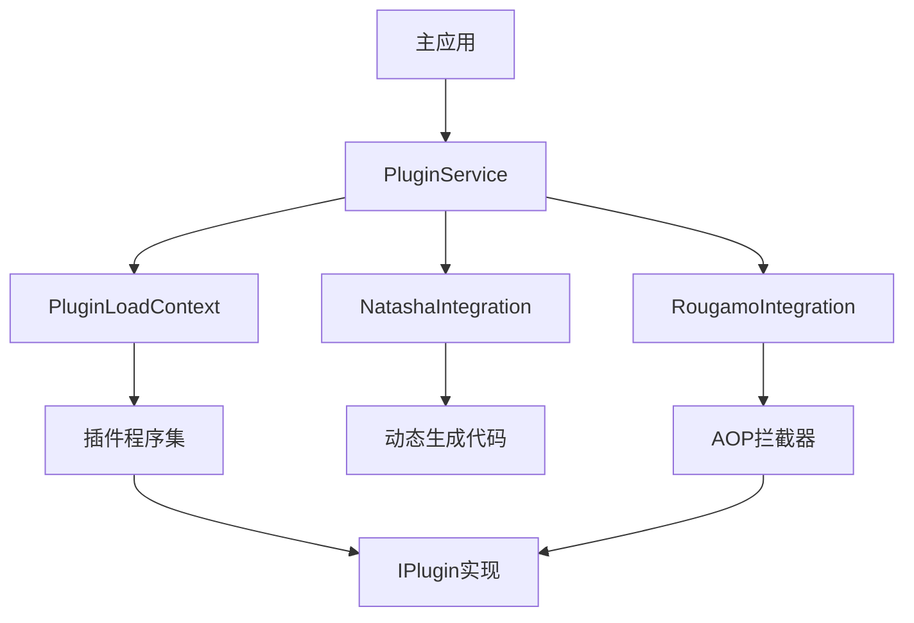

# 插件系统参考文档

## 1. 系统概述

本插件系统是一个基于.NET 10和AOT编译的高性能插件框架，支持动态加载、热重载、AOP拦截、性能监控等功能。系统采用模块化设计，包含以下核心组件：

- **PluginLoadContext**：插件加载上下文，负责隔离加载插件程序集
- **PluginService**：插件服务，负责插件的生命周期管理
- **NatashaIntegration**：动态代码生成集成，支持运行时生成插件代码
- **RougamoIntegration**：AOP拦截集成，支持方法拦截、性能监控、缓存等

## 2. 系统架构

### 2.1 核心组件关系



### 2.2 插件加载流程

1. 主应用通过PluginService请求加载插件
2. PluginService创建PluginLoadContext隔离加载环境
3. PluginLoadContext加载插件程序集并解析IPlugin实现
4. 创建插件实例并初始化
5. 注册到已加载插件列表

### 2.3 插件执行流程

1. 主应用通过PluginService请求执行插件
2. PluginService从已加载插件列表中获取插件
3. 应用Rougamo AOP拦截器（如果有）
4. 执行插件方法
5. 返回执行结果

## 3. 快速开始

### 3.1 环境要求

- .NET 10 SDK
- Visual Studio 2026或更高版本
- 支持的操作系统：Windows、Linux、macOS

### 3.2 安装依赖

```bash
dotnet add package Microsoft.Extensions.DependencyInjection
dotnet add package Microsoft.Extensions.Logging
dotnet add package System.Threading.Channels
dotnet add package Natasha
dotnet add package Rougamo
```

### 3.3 创建插件

```csharp
using Plugin.AOP;

public class MyPlugin : IPlugin
{
    private readonly ILogger<MyPlugin> _logger;

    public MyPlugin(ILogger<MyPlugin> logger)
    {
        _logger = logger;
    }

    [PluginInterceptor]
    [PerformanceMonitor]
    public async Task InitializeAsync()
    {
        _logger.LogInformation("初始化MyPlugin");
        await Task.CompletedTask;
    }

    [PluginInterceptor]
    [PerformanceMonitor]
    [Cache(60)]
    public async Task<object> ExecuteAsync(object context)
    {
        _logger.LogInformation($"执行MyPlugin，上下文: {context}");
        await Task.Delay(100);
        return $"MyPlugin执行结果: {DateTime.Now}";
    }

    [PluginInterceptor]
    [PerformanceMonitor]
    public async Task ShutdownAsync()
    {
        _logger.LogInformation("关闭MyPlugin");
        await Task.CompletedTask;
    }
}
```

### 3.4 加载和执行插件

```csharp
// 创建服务集合
var services = new ServiceCollection();

// 添加日志
services.AddLogging(builder =>
{
    builder.AddConsole();
});

// 添加插件服务
services.AddPluginService();

// 添加Rougamo集成
services.AddRougamoIntegration(Assembly.GetExecutingAssembly());

// 构建服务提供程序
using var serviceProvider = services.BuildServiceProvider();

// 获取插件服务
var pluginService = serviceProvider.GetRequiredService<IPluginService>();

// 加载插件
var pluginPath = "path/to/plugin.dll";
var pluginInfo = await pluginService.LoadPluginAsync(pluginPath);

// 执行插件
var result = await pluginService.ExecutePluginAsync(pluginPath, "测试参数");
Console.WriteLine($"插件执行结果: {result}");

// 卸载插件
await pluginService.UnloadPluginAsync(pluginPath);
```

## 4. 配置选项

### 4.1 插件服务配置

| 配置项 | 描述 | 默认值 |
|-------|------|-------|
| PluginDirectory | 插件目录 | plugins |
| EnableHotReload | 启用热重载 | true (开发环境) / false (生产环境) |
| EnableSandbox | 启用沙箱 | false (开发环境) / true (生产环境) |
| MaxConcurrentPlugins | 最大并发插件数 | 10 (开发环境) / 20 (生产环境) |
| HotReloadIntervalMs | 热重载检查间隔（毫秒） | 2000 (开发环境) / 5000 (生产环境) |
| PluginInitializationTimeoutMs | 插件初始化超时（毫秒） | 30000 (开发环境) / 60000 (生产环境) |
| PluginExecutionTimeoutMs | 插件执行超时（毫秒） | 60000 (开发环境) / 120000 (生产环境) |

### 4.2 AOT编译配置

| 配置项 | 描述 | 默认值 |
|-------|------|-------|
| PublishAot | 启用AOT编译 | true |
| TrimMode | 裁剪模式 | partial |
| ReadyToRun | 启用ReadyToRun编译 | true |
| TieredCompilation | 启用分层编译 | true |

### 4.3 AOP配置

| 配置项 | 描述 | 默认值 |
|-------|------|-------|
| EnableAOP | 启用AOP | true |
| EnablePerformanceMonitoring | 启用性能监控 | true |
| EnableCaching | 启用缓存 | true |
| EnableTransactions | 启用事务 | true |
| CacheExpirationSeconds | 缓存过期时间（秒） | 300 (开发环境) / 600 (生产环境) |

## 5. 动态代码生成

### 5.1 Natasha集成

系统集成了Natasha库，支持运行时动态生成插件代码。使用示例：

```csharp
// 获取Natasha集成服务
var natashaService = serviceProvider.GetRequiredService<INatashaIntegrationService>();

// 生成插件代码
var pluginCode = @"
using System;
using System.Threading.Tasks;
using Plugin.Core;

namespace DynamicPlugins
{
    public class DynamicPlugin : IPlugin
    {
        public async Task InitializeAsync()
        {
            Console.WriteLine("初始化动态插件");
            await Task.CompletedTask;
        }

        public async Task<object> ExecuteAsync(object context)
        {
            Console.WriteLine($"执行动态插件，上下文: {context}");
            await Task.CompletedTask;
            return $"动态插件执行结果: {DateTime.Now}";
        }

        public async Task ShutdownAsync()
        {
            Console.WriteLine("关闭动态插件");
            await Task.CompletedTask;
        }
    }
}
";

// 编译并加载插件
var pluginType = await natashaService.GenerateTypeAsync("DynamicPlugin", pluginCode);
var plugin = (IPlugin)Activator.CreateInstance(pluginType);

// 执行插件
await plugin.InitializeAsync();
var result = await plugin.ExecuteAsync("测试参数");
Console.WriteLine($"动态插件执行结果: {result}");
await plugin.ShutdownAsync();
```

### 5.2 代码缓存

Natasha集成服务会缓存生成的类型，避免重复编译，提高性能。

## 6. AOP拦截器

### 6.1 内置拦截器

| 拦截器 | 描述 | 使用方式 |
|-------|------|--------|
| PluginInterceptor | 基础插件拦截器，记录方法执行日志 | `[PluginInterceptor]` |
| PerformanceMonitor | 性能监控拦截器，记录执行时间和次数 | `[PerformanceMonitor]` |
| Transaction | 事务拦截器，支持事务开始、提交、回滚 | `[Transaction]` |
| Cache | 缓存拦截器，缓存方法返回值 | `[Cache(60)]` |

### 6.2 自定义拦截器

您可以通过继承`MoAttribute`类创建自定义拦截器：

```csharp
[AttributeUsage(AttributeTargets.Method | AttributeTargets.Class)]
public class CustomInterceptorAttribute : MoAttribute
{
    public override void OnEntry(MethodContext context)
    {
        // 执行前逻辑
    }

    public override void OnSuccess(MethodContext context)
    {
        // 执行成功逻辑
    }

    public override void OnException(MethodContext context)
    {
        // 异常处理逻辑
    }

    public override void OnExit(MethodContext context)
    {
        // 执行完成逻辑
    }
}
```

## 7. 热重载

系统支持插件热重载，当插件文件发生变化时，会自动重新加载插件。

### 7.1 启用热重载

在`plugin_service.run.json`中配置：

```json
"environment": {
  "development": {
    "ENABLE_HOT_RELOAD": "true",
    "HOT_RELOAD_INTERVAL_MS": "2000"
  }
}
```

### 7.2 热重载原理

1. PluginService启动文件系统监视器，监控插件目录
2. 当检测到插件文件变化时，触发重载逻辑
3. 卸载旧插件实例
4. 加载新插件文件
5. 创建新插件实例并初始化

## 8. 性能监控

系统集成了性能监控功能，通过`System.Diagnostics.Metrics`记录插件执行指标。

### 8.1 监控指标

| 指标名称 | 类型 | 描述 |
|---------|------|------|
| plugin.load.count | Counter | 插件加载次数 |
| plugin.execute.count | Counter | 插件执行次数 |
| plugin.error.count | Counter | 插件错误次数 |
| plugin.loaded.count | Gauge | 当前加载的插件数量 |
| plugin.execute.time.ms | Histogram | 插件执行时间（毫秒） |
| plugin.initialize.time.ms | Histogram | 插件初始化时间（毫秒） |
| plugin.load.time.ms | Histogram | 插件加载时间（毫秒） |

### 8.2 查看指标

可以通过以下方式查看性能指标：

1. 控制台日志
2. Prometheus（如果启用）
3. 自定义指标导出器

## 9. 部署指南

### 9.1 AOT编译部署

AOT编译将.NET代码编译为本地机器代码，提高应用启动速度和运行性能。

#### 9.1.1 Windows部署

```bash
dotnet publish -c Release -r win-x64 --self-contained true -p:PublishSingleFile=true -p:PublishAot=true
```

#### 9.1.2 Linux部署

```bash
dotnet publish -c Release -r linux-x64 --self-contained true -p:PublishSingleFile=true -p:PublishAot=true
```

#### 9.1.3 macOS部署

```bash
dotnet publish -c Release -r osx-x64 --self-contained true -p:PublishSingleFile=true -p:PublishAot=true
```

### 9.2 Docker容器部署

#### 9.2.1 Dockerfile

```dockerfile
FROM mcr.microsoft.com/dotnet/sdk:10.0 AS build
WORKDIR /app

COPY . .
RUN dotnet publish -c Release -r linux-x64 --self-contained true -p:PublishSingleFile=true -p:PublishAot=true -o out

FROM mcr.microsoft.com/dotnet/runtime-deps:10.0 AS runtime
WORKDIR /app
COPY --from=build /app/out .

EXPOSE 5000
ENTRYPOINT ["./PluginService"]
```

#### 9.2.2 构建和运行

```bash
docker build -t plugin-service .
docker run -p 5000:5000 plugin-service
```

## 10. 最佳实践

### 10.1 插件开发

1. **实现IPlugin接口**：所有插件必须实现IPlugin接口
2. **使用依赖注入**：通过构造函数注入所需服务
3. **添加AOP特性**：根据需要添加性能监控、缓存等AOP特性
4. **处理异常**：插件内部应妥善处理异常，避免影响主应用
5. **资源释放**：在ShutdownAsync方法中释放占用的资源

### 10.2 性能优化

1. **使用缓存**：对于频繁执行且结果稳定的方法，使用[Cache]特性
2. **避免阻塞**：插件方法应使用异步编程，避免阻塞主线程
3. **控制执行时间**：确保插件执行时间在配置的超时范围内
4. **减少反射**：避免在高频执行路径中使用反射
5. **使用AOT友好代码**：避免使用AOT不支持的特性

### 10.3 安全性

1. **启用沙箱**：在生产环境中启用沙箱，限制插件的权限
2. **验证插件**：在加载前验证插件的签名和完整性
3. **限制资源**：限制插件的CPU、内存使用
4. **监控异常**：监控插件的异常情况，及时发现问题

## 11. 故障排除

### 11.1 常见问题

| 问题 | 可能原因 | 解决方案 |
|-----|---------|--------|
| 插件加载失败 | 插件程序集不存在或损坏 | 检查插件路径和文件完整性 |
| 插件执行超时 | 插件执行时间过长 | 优化插件代码或增加超时时间 |
| 依赖冲突 | 插件与主应用依赖版本冲突 | 使用PluginLoadContext隔离加载 |
| AOT编译失败 | 使用了AOT不支持的特性 | 修改代码，使用AOT友好的特性 |
| 热重载不生效 | 热重载未启用或监控路径错误 | 检查配置和插件路径 |

### 11.2 日志排查

系统会记录详细的日志，包括：

- 插件加载日志
- 插件执行日志
- 异常日志
- 性能指标日志

通过查看日志，可以快速定位和解决问题。

## 12. 版本历史

| 版本 | 日期 | 变更内容 |
|-----|------|--------|
| 1.0.0 | 2026-01-24 | 初始版本，支持.NET 10和AOT编译 |
| 1.0.1 | 2026-02-01 | 优化热重载性能，修复内存泄漏问题 |
| 1.0.2 | 2026-02-15 | 增加Docker容器支持，完善监控指标 |

## 13. 联系方式

如有问题或建议，请通过以下方式联系：

- 邮箱：support@plugin-system.com
- GitHub：https://github.com/plugin-system
- 文档：https://docs.plugin-system.com

## 14. 许可证

本项目采用MIT许可证，详见LICENSE文件。
