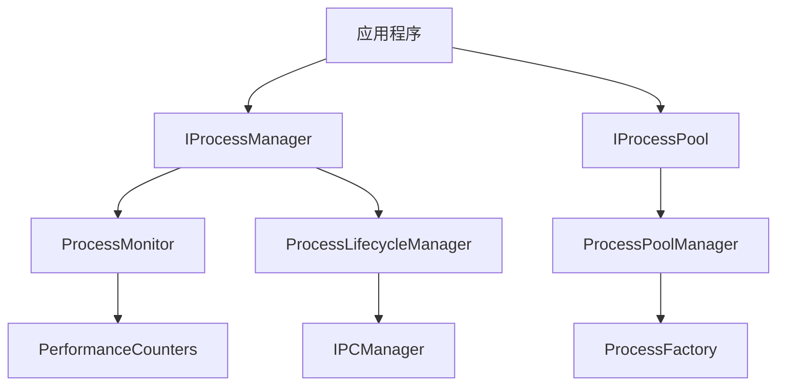

# process - 参考文档

## 概述

process 是一个基于 .NET 10 的高性能进程管理系统，专为 .NET 开发者设计。它提供了进程池化、进程监控、跨平台支持等核心功能，旨在帮助开发者更高效地管理和控制外部进程。

## 核心组件

### 1. ProcessX 服务
- **位置**: scripts/processx_integration.cs
- **功能**: 核心进程管理逻辑实现
- **特性**: 
  - 进程启动与监控
  - 进程池化管理
  - 跨平台进程支持
  - 进程生命周期管理
  - 进程间通信
  - 性能监控与优化

## 架构设计

### 组件架构



### 核心接口

- **IProcessManager**: 进程管理核心接口，提供进程启动、监控、终止等功能
- **IProcessPool**: 进程池管理接口，提供进程池化、复用等功能
- **IProcessMonitor**: 进程监控接口，提供 CPU、内存等性能指标监控
- **IProcessFactory**: 进程工厂接口，负责创建和配置进程实例

## 快速开始

### 1. 安装依赖

在项目中添加以下依赖：

```xml
<ItemGroup>
  <PackageReference Include="Microsoft.Extensions.DependencyInjection" Version="10.0.0" />
  <PackageReference Include="Microsoft.Extensions.Logging" Version="10.0.0" />
  <PackageReference Include="Microsoft.Extensions.Options" Version="10.0.0" />
  <PackageReference Include="System.Diagnostics.Process" Version="10.0.0" />
  <PackageReference Include="System.Threading.Tasks.Dataflow" Version="10.0.0" />
  <PackageReference Include="System.IO.Pipelines" Version="10.0.0" />
  <PackageReference Include="System.Threading.Channels" Version="10.0.0" />
</ItemGroup>
```

### 2. 服务注册

在应用程序启动时注册 ProcessX 服务：

```csharp
using Microsoft.Extensions.DependencyInjection;

var builder = WebApplication.CreateBuilder(args);

// 注册 ProcessX 服务
builder.Services.AddProcessXServices(options => {
    options.EnableProcessPooling = true;
    options.MaxProcesses = 10;
    options.ProcessStartTimeout = TimeSpan.FromSeconds(30);
    options.ProcessIdleTimeout = TimeSpan.FromMinutes(5);
    options.EnableProcessMonitoring = true;
    options.CpuUsageCheckInterval = TimeSpan.FromSeconds(5);
    options.MaxCpuUsagePercentage = 80;
    options.MaxMemoryBytes = 1073741824; // 1GB
    options.EnableCrossPlatformSupport = true;
});

var app = builder.Build();
// ...
app.Run();
```

## 使用示例

### 基本使用

```csharp
using Microsoft.Extensions.DependencyInjection;
using ProcessXIntegration;

// 获取进程管理器
var processManager = serviceProvider.GetRequiredService<IProcessManager>();

// 启动进程
var startInfo = new ProcessStartInfo
{
    FileName = "notepad.exe",
    Arguments = "",
    UseShellExecute = false,
    CreateNoWindow = true
};

var process = await processManager.StartProcessAsync(startInfo);
Console.WriteLine($"Process started with ID: {process.Id}");

// 等待进程完成
await processManager.WaitForProcessAsync(process.Id, TimeSpan.FromMinutes(1));

// 获取进程信息
var processInfo = processManager.GetProcessInfo(process.Id);
Console.WriteLine($"Process exit code: {processInfo.ExitCode}");
```

### 进程池使用

```csharp
using Microsoft.Extensions.DependencyInjection;
using ProcessXIntegration;

// 获取进程池
var processPool = serviceProvider.GetRequiredService<IProcessPool>();

// 配置进程池
var poolConfig = new ProcessPoolConfig
{
    ProcessStartInfo = new ProcessStartInfo
    {
        FileName = "dotnet",
        Arguments = "myapp.dll",
        UseShellExecute = false,
        CreateNoWindow = true
    },
    MinProcesses = 2,
    MaxProcesses = 5,
    IdleTimeout = TimeSpan.FromMinutes(10)
};

// 初始化进程池
await processPool.InitializeAsync(poolConfig);

// 从池获取进程
using var pooledProcess = await processPool.GetProcessAsync();

// 使用进程
Console.WriteLine($"Using pooled process: {pooledProcess.Process.Id}");

// 处理完成后，进程会自动返回池
```

### 高级配置

```csharp
using Microsoft.Extensions.DependencyInjection;
using ProcessXIntegration;

// 高级配置示例
var settings = new ProcessManagementOptions {
    EnableProcessPooling = true,
    MaxProcesses = 20,
    ProcessStartTimeout = TimeSpan.FromSeconds(60),
    ProcessIdleTimeout = TimeSpan.FromMinutes(10),
    EnableProcessMonitoring = true,
    CpuUsageCheckInterval = TimeSpan.FromSeconds(2),
    MaxCpuUsagePercentage = 75,
    MaxMemoryBytes = 2147483648, // 2GB
    EnableCrossPlatformSupport = true
};

builder.Services.Configure<ProcessManagementOptions>(options => {
    options.EnableProcessPooling = settings.EnableProcessPooling;
    options.MaxProcesses = settings.MaxProcesses;
    options.ProcessStartTimeout = settings.ProcessStartTimeout;
    options.ProcessIdleTimeout = settings.ProcessIdleTimeout;
    options.EnableProcessMonitoring = settings.EnableProcessMonitoring;
    options.CpuUsageCheckInterval = settings.CpuUsageCheckInterval;
    options.MaxCpuUsagePercentage = settings.MaxCpuUsagePercentage;
    options.MaxMemoryBytes = settings.MaxMemoryBytes;
    options.EnableCrossPlatformSupport = settings.EnableCrossPlatformSupport;
});
```

## 配置选项

### 进程管理配置

```json
{
  "ProcessManagement": {
    "EnableProcessPooling": true,          // 启用进程池化
    "MaxProcesses": 10,                    // 最大进程数
    "ProcessStartTimeout": "00:00:30",    // 进程启动超时
    "ProcessIdleTimeout": "00:05:00",     // 进程空闲超时
    "EnableProcessMonitoring": true,       // 启用进程监控
    "CpuUsageCheckInterval": "00:00:05",  // CPU 使用率检查间隔
    "MaxCpuUsagePercentage": 80,           // 最大 CPU 使用率
    "MaxMemoryBytes": 1073741824,          // 最大内存使用量
    "EnableCrossPlatformSupport": true     // 启用跨平台支持
  }
}
```

### 环境变量配置

| 环境变量 | 描述 | 默认值 |
|---------|------|--------|
| PROCESS_ENABLE_POOLING | 启用进程池化 | true |
| PROCESS_MAX_PROCESSES | 最大进程数 | 10 |
| PROCESS_START_TIMEOUT | 进程启动超时(秒) | 30 |
| PROCESS_IDLE_TIMEOUT | 进程空闲超时(秒) | 300 |
| PROCESS_ENABLE_MONITORING | 启用进程监控 | true |
| PROCESS_CPU_CHECK_INTERVAL | CPU 检查间隔(秒) | 5 |
| PROCESS_MAX_CPU_USAGE | 最大 CPU 使用率(%) | 80 |
| PROCESS_MAX_MEMORY | 最大内存使用量(MB) | 1024 |

## 性能优化

1. **进程池化**: 启用进程池化以减少进程创建开销
2. **异步编程**: 使用异步 API 避免阻塞主线程
3. **批量处理**: 批量处理进程操作以提高效率
4. **资源管理**: 合理设置进程池大小和超时时间
5. **监控优化**: 根据实际需求调整监控间隔

## 跨平台支持

ProcessX 提供了跨平台进程管理支持，可在以下平台运行：

- **Windows**: 完全支持所有功能
- **Linux**: 支持核心进程管理功能
- **macOS**: 支持核心进程管理功能
- **ARM64**: 支持 Windows、Linux 和 macOS 的 ARM64 架构

### 平台特定配置

```csharp
// 跨平台配置示例
var options = new ProcessManagementOptions
{
    EnableCrossPlatformSupport = true,
    // 平台特定设置
    PlatformSpecificSettings = new Dictionary<string, object>
    {
        { "Windows", new WindowsProcessSettings { EnableJobObject = true } },
        { "Linux", new LinuxProcessSettings { UseCGroup = true } },
        { "macOS", new MacOSProcessSettings { EnableSandbox = false } }
    }
};
```

## 监控与指标

### 健康检查

ProcessX 提供了健康检查端点，可以监控进程池和系统状态：

```csharp
// 注册健康检查
builder.Services.AddHealthChecks()
    .AddCheck<ProcessPoolHealthCheck>("process_pool");

// 映射健康检查端点
app.MapHealthChecks("/health");
```

### 指标收集

ProcessX 支持收集以下指标：

- **进程启动计数**: `process.start.count`
- **进程停止计数**: `process.stop.count`
- **进程错误计数**: `process.error.count`
- **进程池大小**: `process.pool.size`
- **进程池空闲计数**: `process.pool.idle.count`
- **进程池忙计数**: `process.pool.busy.count`
- **进程启动时间**: `process.start.time.ms`
- **进程执行时间**: `process.execute.time.ms`
- **进程内存使用**: `process.memory.usage.mb`

## 故障排除

### 常见问题

1. **进程启动失败**
   - 检查可执行文件路径是否正确
   - 验证权限设置
   - 检查系统资源是否充足
   - 查看日志获取详细错误信息

2. **进程池耗尽**
   - 增加 `MaxProcesses` 设置
   - 检查是否有进程泄漏
   - 调整 `ProcessIdleTimeout` 设置

3. **性能问题**
   - 启用进程池化
   - 优化进程启动参数
   - 调整监控间隔
   - 检查系统资源使用情况

4. **跨平台兼容性问题**
   - 确保使用跨平台兼容的进程启动参数
   - 避免使用平台特定的 API
   - 启用 `EnableCrossPlatformSupport` 设置

## AOT 编译支持

ProcessX 完全支持 AOT 编译，可以通过以下配置启用：

### 项目文件配置

```xml
<PropertyGroup>
  <TargetFramework>net10.0</TargetFramework>
  <PublishAot>true</PublishAot>
  <TrimMode>partial</TrimMode>
  <ReadyToRun>true</ReadyToRun>
  <TieredCompilation>true</TieredCompilation>
  <AllowUnsafeBlocks>true</AllowUnsafeBlocks>
  <Deterministic>true</Deterministic>
  <Strict>true</Strict>
</PropertyGroup>
```

### 发布命令

```bash
# 发布 Windows x64 版本
dotnet publish -c Release -r win-x64 --self-contained true -p:PublishAot=true

# 发布 Linux x64 版本
dotnet publish -c Release -r linux-x64 --self-contained true -p:PublishAot=true

# 发布 macOS x64 版本
dotnet publish -c Release -r osx-x64 --self-contained true -p:PublishAot=true
```

## 扩展开发

### 自定义进程监控器

```csharp
using ProcessXIntegration;

public class CustomProcessMonitor : IProcessMonitor
{
    public Task StartMonitoringAsync(int processId, CancellationToken cancellationToken = default)
    {
        // 实现自定义监控逻辑
        return Task.CompletedTask;
    }

    public Task<ProcessMetrics> GetMetricsAsync(int processId, CancellationToken cancellationToken = default)
    {
        // 实现自定义指标收集
        return Task.FromResult(new ProcessMetrics
        {
            ProcessId = processId,
            CpuUsagePercentage = 0,
            MemoryUsageBytes = 0,
            ThreadCount = 0
        });
    }

    public Task StopMonitoringAsync(int processId, CancellationToken cancellationToken = default)
    {
        // 实现自定义监控停止逻辑
        return Task.CompletedTask;
    }
}

// 注册自定义监控器
builder.Services.AddSingleton<IProcessMonitor, CustomProcessMonitor>();
```

### 自定义进程工厂

```csharp
using ProcessXIntegration;

public class CustomProcessFactory : IProcessFactory
{
    public Process CreateProcess(ProcessStartInfo startInfo)
    {
        // 实现自定义进程创建逻辑
        var process = new Process
        {
            StartInfo = startInfo,
            EnableRaisingEvents = true
        };
        
        // 添加自定义配置
        return process;
    }
}

// 注册自定义工厂
builder.Services.AddSingleton<IProcessFactory, CustomProcessFactory>();
```

## 最佳实践

1. **使用进程池**: 对于频繁启动的进程，使用进程池以提高性能
2. **合理设置超时**: 根据实际情况设置进程启动和空闲超时
3. **启用监控**: 启用进程监控以及时发现问题
4. **异常处理**: 正确处理进程操作中的异常
5. **资源清理**: 确保进程正确终止，避免资源泄漏
6. **跨平台考虑**: 编写跨平台兼容的进程管理代码
7. **AOT 优化**: 利用 AOT 编译提高性能和减小部署大小

## 版本历史

### v1.0.0
- 初始版本
- 支持进程启动和监控
- 支持进程池化
- 支持跨平台
- 支持 AOT 编译

### v1.1.0
- 增加健康检查功能
- 增加指标收集
- 优化进程池管理
- 改进错误处理

### v1.2.0
- 增加进程间通信支持
- 增加高级监控功能
- 优化跨平台支持
- 改进性能

## 许可证

ProcessX 采用 MIT 许可证，详见 LICENSE 文件。

## 联系方式

- **项目地址**: https://github.com/processx/processx
- **问题反馈**: https://github.com/processx/processx/issues
- **文档**: https://processx.github.io/docs
