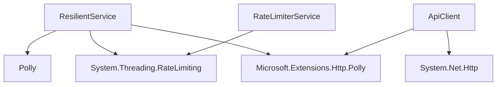

# Resilient 技能参考文档

## 概述

Resilient 是一个基于 .NET 10 和 AOT 编译的弹性服务库，提供了全面的弹性模式实现，包括重试、熔断、限速、超时、隔离舱和回退策略。该库旨在帮助开发者构建更加可靠、稳定的分布式系统和微服务应用。

## 核心功能

### 1. 重试策略 (Retry)
- **指数退避重试**：根据配置的最小和最大退避时间，自动调整重试间隔
- **可配置的重试次数**：支持自定义最大重试次数
- **可配置的退避参数**：支持设置最小退避时间、最大退避时间和最大重试延迟
- **可自定义的重试条件**：支持基于异常类型或返回值的重试条件

### 2. 熔断策略 (Circuit Breaker)
- **基于失败率的熔断**：当失败率超过阈值时自动熔断
- **可配置的采样窗口**：支持设置采样持续时间和最小吞吐量
- **可配置的熔断持续时间**：支持设置熔断后的恢复时间
- **熔断状态监控**：提供熔断状态的实时监控

### 3. 限速策略 (Rate Limiter)
- **令牌桶限速器**：支持按速率分配令牌的限速策略
- **滑动窗口限速器**：支持基于时间窗口的限速策略
- **并发限速器**：支持基于并发数的限速策略
- **可配置的限速参数**：支持设置令牌桶大小、令牌生成速率、队列长度等参数

### 4. 超时策略 (Timeout)
- **可配置的超时时间**：支持为每个操作设置超时时间
- **超时异常处理**：当操作超时时自动抛出超时异常

### 5. 隔离舱策略 (Bulkhead Isolation)
- **基于信号量的隔离**：限制并发执行的操作数
- **可配置的并发限制**：支持设置最大并发数和队列长度
- **隔离舱状态监控**：提供隔离舱使用情况的实时监控

### 6. 回退策略 (Fallback)
- **可配置的回退操作**：当主要操作失败时执行回退操作
- **基于异常类型的回退**：支持为不同类型的异常设置不同的回退策略

## 架构设计

### 1. 核心组件

| 组件 | 描述 | 实现文件 |
|------|------|----------|
| `IResilientService` | 弹性服务接口，定义了各种弹性操作方法 | resilient_polly_integration.cs |
| `ResilientService` | 弹性服务实现，集成了各种弹性策略 | resilient_polly_integration.cs |
| `ResilientOptions` | 弹性服务配置选项，包含各种策略的配置参数 | resilient_polly_integration.cs |
| `IRateLimiterService` | 限速器服务接口，定义了限速操作方法 | rate_limiter.cs |
| `RateLimiterService` | 限速器服务实现，集成了各种限速策略 | rate_limiter.cs |
| `RateLimiterOptions` | 限速器配置选项，包含各种限速策略的配置参数 | rate_limiter.cs |
| `IApiClient` | API客户端接口，定义了HTTP请求方法 | publicapi_integration.cs |
| `ApiClient` | API客户端实现，集成了弹性策略的HTTP客户端 | publicapi_integration.cs |
| `ApiIntegrationOptions` | API客户端配置选项，包含API集成的配置参数 | publicapi_integration.cs |

### 2. 依赖关系



### 3. 数据流

1. **服务注册**：通过依赖注入注册弹性服务
2. **配置加载**：从配置文件加载弹性策略配置
3. **策略初始化**：根据配置初始化各种弹性策略
4. **操作执行**：执行带弹性策略的操作
5. **策略应用**：应用重试、熔断、限速等策略
6. **结果返回**：返回操作结果或执行回退

## 配置参考

### 1. 弹性服务配置

在 `appsettings.json` 或 `resilient_polly_integration.setting.json` 中配置：

```json
{
  "Resilient": {
    "Retry": {
      "Count": 3,
      "MinBackoff": "00:00:01",
      "MaxBackoff": "00:00:10",
      "MaxRetryDelay": "00:00:30"
    },
    "CircuitBreaker": {
      "FailureThreshold": 0.5,
      "SamplingDuration": "00:00:30",
      "MinimumThroughput": 10,
      "BreakDuration": "00:00:30"
    },
    "RateLimiter": {
      "PermitsPerSecond": 100,
      "QueueLimit": 50
    },
    "Timeout": "00:00:30",
    "Bulkhead": {
      "MaxParallelization": 10,
      "MaxQueuedActions": 50
    }
  }
}
```

### 2. 限速器配置

在 `appsettings.json` 或 `rate_limiter.setting.json` 中配置：

```json
{
  "RateLimiter": {
    "TokenLimit": 100,
    "TokensPerPeriod": 100,
    "ReplenishmentPeriod": "00:00:01",
    "QueueLimit": 50,
    "QueueProcessingOrder": "OldestFirst",
    "WindowLimit": 100,
    "Window": "00:00:01",
    "AutoReplenishment": true,
    "PermitLimit": 100,
    "HealthCheckInterval": "00:01:00",
    "EnableHealthCheck": true,
    "EnableTelemetry": true
  }
}
```

### 3. API客户端配置

在 `appsettings.json` 或 `publicapi_integration.setting.json` 中配置：

```json
{
  "ApiIntegration": {
    "BaseUrl": "https://api.example.com",
    "Timeout": "00:00:30",
    "RetryCount": 3,
    "RetryBackoff": "00:00:01",
    "CircuitBreakThreshold": 5,
    "CircuitBreakDuration": "00:00:30",
    "CircuitBreakSamplingDuration": "00:01:00",
    "RateLimitPermits": 100,
    "RateLimitWindow": "00:00:01",
    "HealthCheckInterval": "00:01:00",
    "EnableHealthCheck": true,
    "EnableTelemetry": true,
    "EnableDetailedLogging": true
  }
}
```

## 依赖项

### 1. 核心依赖

| 依赖项 | 版本 | 用途 |
|--------|------|------|
| `Polly` | 7.2.4 | 提供重试、熔断、超时、隔离舱等弹性策略 |
| `System.Threading.RateLimiting` | 8.0.0 | 提供限速策略 |
| `Microsoft.Extensions.Http.Polly` | 10.0.0 | 提供HTTP客户端的弹性策略集成 |
| `Microsoft.Extensions.Options` | 10.0.0 | 提供配置选项管理 |
| `Microsoft.Extensions.Logging` | 10.0.0 | 提供日志记录 |

### 2. 可选依赖

| 依赖项 | 版本 | 用途 |
|--------|------|------|
| `System.Net.Http` | 8.0.0 | 提供HTTP客户端 |
| `System.Buffers` | 4.5.1 | 提供内存缓冲区管理 |

## AOT 编译支持

Resilient 技能完全支持 AOT (Ahead-of-Time) 编译，通过以下配置实现：

### 1. 编译配置

```json
{
  "compilation": {
    "targetFramework": "net11.0",
    "publishAot": true,
    "trimMode": "partial",
    "readyToRun": true,
    "tieredCompilation": true,
    "optimize": true,
    "enableCompressionInSingleFile": true,
    "selfContained": true
  }
}
```

### 2. AOT 兼容性

- **使用 trim-safe 的 API**：避免使用反射、动态类型等不兼容 AOT 的特性
- **显式类型标注**：使用 `[DynamicallyAccessedMembers]` 等属性标注需要保留的类型
- **资源管理**：确保资源正确释放，避免内存泄漏
- **序列化兼容**：使用 AOT 兼容的序列化库

## 性能优化

### 1. 内存优化
- **对象池**：使用对象池减少对象创建和垃圾回收
- **内存分配**：使用 `Span<T>` 和 `Memory<T>` 减少内存分配
- **避免大对象**：避免创建大对象，减少 LOH (Large Object Heap) 分配

### 2. 并发优化
- **异步操作**：优先使用异步操作，避免线程阻塞
- **并发控制**：使用合适的并发控制机制，如 `SemaphoreSlim`、`ConcurrentDictionary` 等
- **避免锁竞争**：减少锁的范围和竞争，使用无锁数据结构

### 3. 网络优化
- **连接池**：使用 HTTP 连接池减少连接建立和释放的开销
- **请求合并**：合并多个小请求为一个大请求，减少网络往返
- **缓存**：合理使用缓存，减少重复请求

## 监控与诊断

### 1. 健康检查
- **内置健康检查**：提供弹性服务和限速器的健康检查接口
- **定期健康检查**：支持配置定期健康检查的间隔
- **健康状态监控**：提供健康状态的实时监控

### 2. 指标收集
- **操作指标**：收集操作的执行次数、成功次数、失败次数等指标
- **性能指标**：收集操作的执行时间、重试次数等性能指标
- **策略指标**：收集熔断状态、限速器使用情况等策略指标

### 3. 日志记录
- **结构化日志**：使用结构化日志记录操作和策略的执行情况
- **日志级别**：支持配置不同的日志级别，如 Information、Warning、Error 等
- **详细日志**：支持启用详细日志，记录更多操作细节

## 最佳实践

### 1. 配置最佳实践
- **根据实际需求调整策略参数**：不同的应用场景需要不同的策略配置
- **避免过度配置**：只配置必要的参数，避免复杂的配置
- **使用配置文件管理**：使用配置文件管理策略参数，便于动态调整

### 2. 实现最佳实践
- **优先使用组合策略**：根据实际需求组合使用不同的弹性策略
- **合理设置超时时间**：根据操作的性质设置合理的超时时间
- **提供有意义的回退操作**：回退操作应该能够提供有意义的结果，而不是简单的错误提示

### 3. 监控最佳实践
- **定期检查策略状态**：定期检查熔断状态、限速器使用情况等策略状态
- **设置合理的告警阈值**：根据实际情况设置合理的告警阈值
- **分析性能指标**：定期分析性能指标，优化策略配置

## 常见问题

### 1. 重试策略不生效
- **检查重试条件**：确保重试条件正确配置，能够捕获到需要重试的异常
- **检查重试次数**：确保重试次数设置合理，不为 0
- **检查退避参数**：确保退避参数设置合理，避免重试间隔过长或过短

### 2. 熔断策略不生效
- **检查失败率阈值**：确保失败率阈值设置合理，能够触发熔断
- **检查采样窗口**：确保采样窗口设置合理，能够收集足够的样本
- **检查最小吞吐量**：确保最小吞吐量设置合理，避免在低流量时误触发熔断

### 3. 限速策略不生效
- **检查限速器类型**：确保选择了正确的限速器类型
- **检查限速参数**：确保限速参数设置合理，能够限制请求速率
- **检查队列长度**：确保队列长度设置合理，避免请求被直接拒绝

### 4. 超时策略不生效
- **检查超时时间**：确保超时时间设置合理，不为 0
- **检查异步操作**：确保使用了异步操作，避免线程阻塞导致超时不生效

### 5. 隔离舱策略不生效
- **检查并发限制**：确保并发限制设置合理，不为 0
- **检查队列长度**：确保队列长度设置合理，避免请求被直接拒绝

## 总结

Resilient 技能提供了全面的弹性模式实现，帮助开发者构建更加可靠、稳定的分布式系统和微服务应用。通过合理配置和使用这些弹性策略，开发者可以有效地应对网络故障、服务不可用、流量突发等常见问题，提高系统的可用性和可靠性。

同时，Resilient 技能完全支持 .NET 10 和 AOT 编译，通过优化配置和实现，可以获得更好的性能和更小的部署包大小。

希望本参考文档能够帮助开发者更好地理解和使用 Resilient 技能，构建更加弹性的系统。